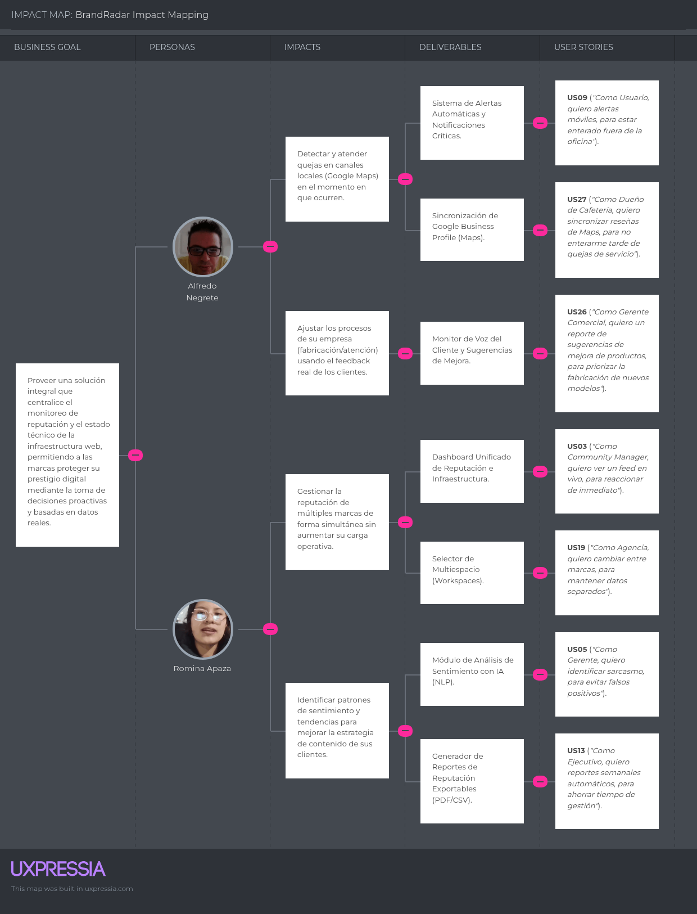

<div align="center">

<br>


# Universidad Peruana de Ciencias Aplicadas
### Facultad de Ingeniería · Ciclo 2026-10

<br>

#  Informe de Proyecto - Avance 1

## Presentado por "Los 5 Suyos"


## Startup analizada: BrandRadar

*Monitoreo de reputación digital en tiempo real para marcas y empresas*

<br>

**Código del Curso:** 1ASI0729 &nbsp;|&nbsp; **Nombre del Curso:** Desarrollo de Aplicaciones Open Source

**NRC:** `11863`

**Profesor:** Ivan Robles Fernández

<br>

### Integrantes de ´Los 5 Suyos´

`U20410239` - `Salinas Guzmán, Brianna Cristina` 

`U202410024` - `Jáuregui Cerna, Jean Franco` 

`U202411354` - `Cruzalegui Herrera, Joaquin` 

`U202012001` - `Garcia Paredes, Victor Manuel` 

`U202417228` - `Acuña de la Cruz, Luis` 


### **Abril 2026**

</div>

---

<br>
<div align="center">
  
##  Registro de Versiones del Informe

| Versión | Fecha | Participantes | Descripción de modificación |
|:-------:|:-----:|:-----:|:---------------------------|
| AV1 | 2026-04-08 | Salinas Guzmán, Brianna Cristina <br> Jáuregui Cerna, Jean Franco <br> Cruzalegui Herrera, Joaquin <br> Garcia Paredes, Victor Manuel <br> Acuña de la Cruz, Luis | Avance 1 del reporte del proyecto y primera versión de la landing page |

</div>

---

<br>

##  Project Report Collaboration Insights

<div align="center">
  
**URL del Repositorio:** [`https://github.com/Los-5-Suyos/BrandRadar-AV1.git`](https://github.com/Los-5-Suyos/BrandRadar-AV1.git)

<br>

Para el desarrollo del AV1, cada integrante contribuyó de la siguiente manera al desarrollo del avance 1:

| Integrante | Tareas Realizadas |
|------------|------------------|
| Salinas Guzmán, Brianna Cristina | Elaboración del Student Outcome, registro de entrevistas, redacción del Capítulo I: Introducción, desarrollo de la sección 4.3 (Landing Page UI Design), modelado de diagramas de clases (4.7.1), diseño de base de datos (4.8), así como redacción de conclusiones y recomendaciones. |
| Jáuregui Cerna, Jean Franco |  Elaboración del Student Outcome, registro de entrevistas, desarrollo del Capítulo III (Requirements Specification) y Capítulo IV (Product Design), incluyendo lineamientos de estilo general y web (4.1), así como el diseño UX/UI de aplicaciones web (4.4). |
| Cruzalegui Herrera, Joaquin | Elaboración del Student Outcome, registro de entrevistas, participación en el Capítulo II, desarrollo de herramientas de análisis como User Task Matrix, User Journey Mapping y Empathy Mapping (2.3), modelado de eventos (2.4), definición de lenguaje ubicuo (2.5) y desarrollo del Sprint 1 (5.2.1). |
| Garcia Paredes, Victor Manuel | Elaboración del Student Outcome, registro de entrevistas, desarrollo de la sección 1.3 (Segmentos objetivo), participación en el Capítulo II (Requirements Elicitation & Analysis), prototipado de aplicaciones web (4.5), desarrollo de arquitectura basada en Domain-Driven Design (4.6) y diseño orientado a objetos (4.7). |
| Acuña de la Cruz, Luis | Elaboración del Student Outcome, registro de entrevistas, desarrollo de la arquitectura de información (4.2), incluyendo sistemas de organización, etiquetado, búsqueda y navegación, así como participación en el Capítulo V (Product Implementation, Validation & Deployment) y gestión de configuración del software (5.1 y 5.2). |

</div>

<br>

### Gestión del repositorio en GitHub

En el repositorio de GitHub se evidencia una línea de tiempo que refleja la evolución del proyecto, incluyendo las principales ramas creadas por cada integrante del equipo, así como los procesos de integración (merge) realizados. Asimismo, la gestión de dichas ramas se llevó a cabo siguiendo el flujo de trabajo GitFlow, el cual fue adaptado a las necesidades del equipo para garantizar una adecuada organización, el control de versiones y el desarrollo colaborativo del proyecto. 

Este enfoque permitió mantener una estructura ordenada durante el desarrollo, evitando conflictos entre versiones y facilitando la integración del trabajo en equipo.


<br>

<div align="center">

### Integrantes y usuarios de GitHub

| Integrante | Usuario GitHub |
|------------|----------------|
| Salinas Guzmán, Brianna Cristina | brianna-salinas |
| Jáuregui Cerna, Jean Franco | JFranco556 |
| Cruzalegui Herrera, Joaquin | JoaquinCruzalegui |
| Garcia Paredes, Victor Manuel | vicmacode |
| Acuña de la Cruz, Luis | L2006delacruz |

</div>


<br>

## Ramas principales del repositorio

- **main**: Rama principal que contiene la versión estable del proyecto.
- **develop**: Rama de desarrollo donde se integran las nuevas funcionalidades antes de ser fusionadas a `main`.
- **feature/sprintX-brianna**: Rama destinada al desarrollo de las tareas asignadas a Brianna en cada sprint.
- **feature/sprintX-jfranco**: Rama destinada al desarrollo de las tareas asignadas a Jean Franco en cada sprint.
- **feature/sprintX-joaquin**: Rama destinada al desarrollo de las tareas asignadas a Joaquin en cada sprint.
- **feature/sprintX-victor**: Rama destinada al desarrollo de las tareas asignadas a Victor en cada sprint.
- **feature/sprintX-luis**: Rama destinada al desarrollo de las tareas asignadas a Luis en cada sprint.
  
Esta estructura de ramas permite un desarrollo organizado y paralelo, facilitando la integración de cambios y reduciendo conflictos durante el proceso de desarrollo.

---

<br>

## AV1 - Network Graph

A continuación, se presenta el gráfico de red (network graph) del repositorio del proyecto, el cual permite visualizar la estructura de ramas, así como la interacción entre ellas a través de los procesos de integración (merge).

<div align="center">

</div>


---

<br>

##  Tabla de Contenidos
  #### [Contenido](#-tabla-de-contenidos)
  #### [Student Outcome](#-student-outcome)

  #### [Capítulo I: Introducción](#capítulo-i-introducción-1)
  - [1.1. Startup Profile](#11-startup-profile)
    - [1.1.1. Descripción de la Startup](#111-descripción-de-la-startup)
    - [1.1.2. Perfiles de integrantes del equipo](#112-perfiles-de-integrantes-del-equipo)
  - [1.2. Solution Profile](#12-solution-profile)
    - [1.2.1. Antecedentes y problemática](#121-antecedentes-y-problemática)
    - [1.2.2. Lean UX Process](./brandradar-report/docs/capitulo-1.md#122-lean-ux-process)
      - [1.2.2.1. Lean UX Problem Statements](#1221-lean-ux-problem-statements)
      - [1.2.2.2. Lean UX Assumptions](#1222-lean-ux-assumptions)
      - [1.2.2.3. Lean UX Hypothesis Statements](#1223-lean-ux-hypothesis-statements)
      - [1.2.2.4. Lean UX Canvas](#1224-lean-ux-canvas)
  - [1.3. Segmentos objetivo](#13-segmentos-objetivo)
 
  #### [Capítulo II: Requirements Elicitation & Analysis](#capítulo-ii-requirements-elicitation--analysis-1)
  - [2.1. Competidores](#21-competidores)
    - [2.1.1. Análisis competitivo](#211-análisis-competitivo)
    - [2.1.2. Estrategias y tácticas frente a competidores](#212-estrategias-y-tácticas-frente-a-competidores)
  - [2.2. Entrevistas](#22-entrevistas)
    - [2.2.1. Diseño de entrevistas](#221-diseño-de-entrevistas)
    - [2.2.2. Registro de entrevistas](#222-registro-de-entrevistas)
    - [2.2.3. Análisis de entrevistas](#223-análisis-de-entrevistas)
  - [2.3. Needfinding](#23-needfinding)
    - [2.3.1. User Personas](#231-user-personas)
    - [2.3.2. User Task Matrix](#232-user-task-matrix)
    - [2.3.3. User Journey Mapping](#233-user-journey-mapping)
    - [2.3.4. Empathy Mapping](#234-empathy-mapping)
  - [2.4. Big Picture Event Storming](#24-big-picture-event-storming)
  - [2.5. Ubiquitous Language](#25-ubiquitous-language)
    
  #### [Capítulo III: Requirements Specification](#capítulo-iii-requirements-specification-1)
  - [3.1. User Stories](./brandradar-report/docs/capitulo-3.md#31-user-stories)
  - [3.2. Impact Mapping](./brandradar-report/docs/capitulo-3.md#32-impact-mapping)
  - [3.3. Product Backlog](./brandradar-report/docs/capitulo-3.md#33-product-backlog)
    
  #### [Capítulo IV: Product Design](#capítulo-iv-product-design-1)
  - [4.1. Style Guidelines](#41-style-guidelines)
    - [4.1.1. General Style Guidelines](#411-general-style-guidelines)
    - [4.1.2. Web Style Guidelines](#412-web-style-guidelines)
  - [4.2. Information Architecture](#42-information-architecture)
    - [4.2.1. Organization Systems](#421-organization-systems)
    - [4.2.2. Labeling Systems](#422-labeling-systems)
    - [4.2.3. SEO Tags and Meta Tags](#423-seo-tags-and-meta-tags)
    - [4.2.4. Searching Systems](#424-searching-systems)
    - [4.2.5. Navigation Systems](#425-navigation-systems)
  - [4.3. Landing Page UI Design](#43-landing-page-ui-design)
    - [4.3.1. Landing Page Wireframe](#431-landing-page-wireframe)
    - [4.3.2. Landing Page Mock-up](#432-landing-page-mock-up)
  - [4.4. Web Applications UX/UI Design](#44-web-applications-uxui-design)
    - [4.4.1. Web Applications Wireframes](#441-web-applications-wireframes)
    - [4.4.2. Web Applications Wireflow Diagrams](#442-web-applications-wireflow-diagrams)
    - [4.4.3. Web Applications Mock-ups](#443-web-applications-mock-ups)
    - [4.4.4. Web Applications User Flow Diagrams](#444-web-applications-user-flow-diagrams)
  - [4.5. Web Applications Prototyping](#45-web-applications-prototyping)
  - [4.6. Domain-Driven Software Architecture](#46-domain-driven-software-architecture)
    - [4.6.1. Design-Level Event Storming](#461-design-level-event-storming)
    - [4.6.2. Software Architecture Context Diagram](#462-software-architecture-context-diagram)
    - [4.6.3. Software Architecture Container Diagrams](#463-software-architecture-container-diagrams)
    - [4.6.4. Software Architecture Components Diagrams](#464-software-architecture-components-diagrams)
  - [4.7. Software Object-Oriented Design](#47-software-object-oriented-design)
    - [4.7.1. Class Diagrams](#471-class-diagrams)
  - [4.8. Database Design](#48-database-design)
    - [4.8.1. Database Diagrams](#481-database-diagrams)
      
  #### [Capítulo V: Product Implementation, Validation & Deployment](#capítulo-v-product-implementation-validation--deployment-1)
  - [5.1. Software Configuration Management](#51-software-configuration-management)
    - [5.1.1. Software Development Environment Configuration](#511-software-development-environment-configuration)
    - [5.1.2. Source Code Management](#512-source-code-management)
    - [5.1.3. Source Code Style Guide & Conventions](#513-source-code-style-guide--conventions)
    - [5.1.4. Software Deployment Configuration](#514-software-deployment-configuration)
  - [5.2. Landing Page, Services & Applications Implementation](#52-landing-page-services--applications-implementation)
    - [5.2.1. Sprint 1](#521-sprint-1)
  - [5.3. Validation Interviews](#53-validation-interviews)
  - [5.4. Video About-the-Product](#54-video-about-the-product)
    
  #### [Conclusiones](#conclusiones-1)
  
  #### [Recomendaciones](#recomendaciones-1)

  #### [Video About-the-Team](#video-about-the-team-1)
  
  #### [Bibliografía](#-bibliografía)
  
  #### [Anexos](#anexos-1)

---

<br>

##  Student Outcome

En el siguiente cuadro se describen las acciones realizadas y enunciados de conclusiones que permiten sustentar el logro alcanzado.

| Criterio específico | Acciones realizadas | Conclusiones |
|:---|:---|:---|
| **3.c1. Comunica oralmente con efectividad a diferentes rangos de audiencia.** | **Salinas, Brianna** <br> AV1: Durante el registro de entrevistas, conduje sesiones con usuarios del segmento objetivo adaptando mi discurso oral según el perfil del entrevistado, logrando transmitir el propósito de BrandRadar de forma clara y comprensible tanto para perfiles técnicos como no técnicos. <br><br> **Jáuregui, Jean Franco** <br> AV1: (acción específica) <br><br> **Cruzalegui, Joaquin** <br> AV1: (acción específica) <br><br> **Garcia Paredes, Victor** <br> AV1: (acción específica) <br><br> **Acuña de la Cruz, Luis** <br> AV1: (acción específica) | (Completar de forma grupal en cada entrega) |
| **3.c2. Comunica por escrito con efectividad a diferentes rangos de audiencia.** | **Salinas, Brianna** <br> AV1: Redacté el Capítulo I, la sección 4.3 de Landing Page UI Design, los diagramas de clases (4.7.1) y el diseño de base de datos (4.8), empleando un lenguaje técnico preciso y estructurado acorde al formato académico del informe, garantizando que el contenido sea comprensible para lectores con distintos niveles de conocimiento en ingeniería de software. <br><br> **Jáuregui, Jean Franco** <br> AV1: (acción específica) <br><br> **Cruzalegui, Joaquin** <br> AV1: (acción específica) <br><br> **Garcia Paredes, Victor** <br> AV1: (acción específica) <br><br> **Acuña de la Cruz, Luis** <br> AV1: (acción específica) | (Completar de forma grupal en cada entrega) |

---


<div align="center">

# Capítulo I: Introducción

</div>

---

## 1.1. Startup Profile

###   1.1.1. Descripción de la Startup

<br>

**BrandRadar** es una startup tecnológica que desarrolla una aplicación web orientada al monitoreo y análisis de la reputación digital de marcas y empresas en tiempo real.

La plataforma permite a las organizaciones comprender cómo son percidas en internet mediante la recopilación y análisis de información proveniente de redes sociales, reseñas y menciones en distintas plataformas digitales. Además, integra el monitoreo de redes sociales y el estado de la infraestructura web en un solo panel de control, brindando una visión unificada del rendimiento y la presencia digital de la marca.

A través del uso de técnicas de análisis de datos y procesamiento de lenguaje natural, **BrandRadar** identifica tendencias, evalúa el sentimiento de los usuarios (positivo, negativo o neutro) y detecta posibles riesgos reputacionales. Esto permite a las empresas tomar decisiones estratégicas, mejorar su posicionamiento y fortalecer su imagen en el entorno digital.

<br>

<div align="center">
  
###  Logo y nombre del proyecto:

**BrandRadar**

  

<br>

##  Misión

*"Brindar a empresas y marcas una herramienta tecnológica que les permita monitorear y analizar su reputación digital en tiempo real, facilitando la toma de decisiones estratégicas basadas en datos confiables."*

<br>

##  Visión

*"Ser una plataforma líder en Latinoamérica en gestión de reputación digital, reconocida por su innovación, precisión analítica y contribución al crecimiento de las marcas en el entorno digital."*

</div>

<br>

##  Propuesta de Valor

BrandRadar permite a las empresas:

-  Monitorear en tiempo real lo que se dice sobre su marca en internet  
-  Centralizar el monitoreo de redes sociales y el estado de la infraestructura web en un solo panel de control  
-  Analizar automáticamente el sentimiento de opiniones y comentarios
-  Detectar crisis reputacionales de manera temprana
-  Obtener información clara y accionable para mejorar su posicionamiento digital  
<br>

##  Valores

-  **Innovación**: Uso de tecnología para ofrecer soluciones modernas  
-  **Transparencia**: Información clara y confiable  
-  **Orientación al cliente**: Enfoque en necesidades reales  
-  **Responsabilidad**: Manejo ético y seguro de los datos  
-  **Calidad**: Resultados precisos y útiles  
<br>

##  Objetivos

1. Desarrollar una plataforma web funcional para el monitoreo de reputación digital  
2. Implementar un sistema de análisis de sentimiento automático basado en procesamiento de lenguaje natural
3. Integrar múltiples fuentes de datos digitales en tiempo real (redes sociales, reseñas y menciones)
4. Incorporar el monitoreo del estado de la infraestructura web (disponibilidad, rendimiento y errores)
5. Centralizar toda la información en un panel de control intuitivo y fácil de usar
6. Facilitar la toma de decisiones mediante reportes claros, visuales y accionables
7. Contribuir al fortalecimiento del posicionamiento digital de las empresas usuarias


---

###   1.1.2. Perfiles de integrantes del equipo

<div align="center">
  
####  Integrante 1


| Campo | Detalle |
|:------|:--------|
| **Nombres y Apellidos** | `Salinas Guzmán, Brianna` |
| **Código de estudiante** | `U202410239` |
| **Carrera** | Ingeniería de Software |

</div>
<br>

**Descripción:**
*Soy estudiante de Ingeniería de Software con conocimientos en desarrollo de aplicaciones, estructuras de datos y programación orientada a objetos. Tengo experiencia trabajando con lenguajes como C++, Pyhton, SQL para base de datos y en la gestión de proyectos utilizando Git y GitHub para el control de versiones. Además, cuento con formación complementaria en marketing digital, lo que me permite aportar una perspectiva orientada al usuario y al posicionamiento del producto. Me considero una persona responsable, con capacidad de aprendizaje autónomo y habilidades para trabajar en equipo y comunicar ideas de manera clara.*

---

<br>

<div align="center">
  
####  Integrante 2


| Campo | Detalle |
|:------|:--------|
| **Nombres y Apellidos** | `Jáuregui Cerna, Jean Franco` |
| **Código de estudiante** | `U202410024` |
| **Carrera** | Ingeniería de Software |

</div>

**Descripción:**
*(Párrafo describiendo principales conocimientos técnicos y habilidades que puede aportar al equipo)*

---
<br>

<div align="center">
  
####  Integrante 3


| Campo | Detalle |
|:------|:--------|
| **Nombres y Apellidos** | `Cruzalegui Herrera, Joaquin` |
| **Código de estudiante** | `U202411354` |
| **Carrera** | Ingeniería de Software |
</div>

**Descripción:**
*Soy estudiante de la carrera de Ingeniería de Software, actualmente cuento con conocimiento de desarrollo de aplicaciones, estructura de datos y programación orientada a objetos. Cuento con experiencia en lenguajes como C++ y un nivel intermedio de python, además he trabajado con MySql y MongoDB en cuanto a base de datos. Considero que soy una persona resposable, que se desenvuelve mejor en trabajos colaborativos y que da lo mejor de sí en las acividades correspondientes para el cumplimiento de un proyecto.*

---
<br>
<div align="center">

####  Integrante 4


| Campo | Detalle |
|:------|:--------|
| **Nombres y Apellidos** | `Garcia Paredes, Victor Manuel` |
| **Código de estudiante** | `U202012001` |
| **Carrera** | Ingeniería de Software |

</div>

**Descripción:**
*Soy estudiante de Ingeniería de Software con sólidos conocimientos en desarrollo de aplicaciones, estructuras de datos y programación orientada a objetos. Tengo experiencia en el uso de C++, así como en la gestión de proyectos mediante herramientas como Git y GitHub para el control de versiones. Me caracterizo por ser una persona responsable, con iniciativa para el aprendizaje autónomo, y con habilidades para el trabajo en equipo y la comunicación efectiva de ideas.*

---
<br>
<div align="center">
  
####  Integrante 5


| Campo | Detalle |
|:------|:--------|
| **Nombres y Apellidos** | `Acuña de la Cruz, Luis` |
| **Código de estudiante** | `U202417228` |
| **Carrera** | Ingeniería de Software |
</div>

**Descripción:**
*(Párrafo describiendo principales conocimientos técnicos y habilidades que puede aportar al equipo)*

---
<br>

## 1.2. Solution Profile

###   1.2.1. Antecedentes y problemática

###  Antecedentes


En la última década, la digitalización ha transformado significativamente la relación entre empresas y consumidores, trasladando gran parte de la interacción hacia entornos digitales. En este contexto, la reputación de marca ya no depende únicamente de la comunicación corporativa, sino también del contenido generado por los propios usuarios en internet.

De acuerdo con Statista (2025), las reseñas online se han convertido en un factor clave en la toma de decisiones de compra, siendo consideradas por el 62 % de los consumidores como muy influyentes al momento de elegir productos o servicios . Esto evidencia que la percepción digital de una marca impacta directamente en su desempeño comercial.

Asimismo, estudios recientes de BrightLocal (2026) muestran que el 97 % de los consumidores lee reseñas en línea antes de elegir un negocio, y que el 85 % es más propenso a confiar en empresas con opiniones positivas, mientras que el 77 % evita aquellas con reseñas negativas . Estos datos confirman que la reputación digital influye de manera directa en la confianza y decisión del consumidor.

Por otro lado, investigaciones académicas también han demostrado que las reseñas digitales funcionan como un mecanismo que reduce la incertidumbre en los consumidores. Según Myle Ott, Claire Cardie y Jeff Hancock (2012), las opiniones en línea actúan como señales que permiten a los usuarios evaluar la calidad de un producto o servicio en ausencia de información directa .

Sin embargo, el entorno digital actual también presenta desafíos importantes. La información sobre una marca se encuentra distribuida en múltiples plataformas, lo que dificulta su gestión. Además, el volumen de datos generado por los usuarios es cada vez mayor, lo que complica su análisis e interpretación. A esto se suma la existencia de información poco confiable o engañosa, lo que afecta la credibilidad del ecosistema digital. En este sentido, estudios recientes evidencian que más del 75 % de los consumidores desconfía de posibles reseñas falsas, lo que impacta directamente en la confianza hacia las marcas (Backlinko, 2026).

En conjunto, estos factores demuestran que la reputación digital se ha convertido en un activo estratégico para las empresas, pero también en un desafío complejo de gestionar, especialmente para aquellas organizaciones que no cuentan con herramientas adecuadas para monitorear y analizar la información en tiempo real.


<br>

### Descripción de la Problemática (5W + 2H)
<br>

  *Para comprender la problemática que aborda BrandRadar, se aplica la técnica de las 5W + 2H:*

####   What — ¿Cuál es el problema?

Las marcas no cuentan con visibilidad en tiempo real sobre cómo son percibidas en internet. No saben qué se dice de ellas, dónde se dice, qué tono predomina ni cuándo una mención negativa está escalando hacia una crisis, debido a la dispersión de información en múltiples plataformas y la falta de herramientas accesibles que integren estos datos de manera clara y accionable. Esta ausencia de información oportuna impide tomar decisiones correctivas antes de que el daño a la reputación sea irreversible.

####   Why — ¿Por qué es un problema relevante?

Este problema ocurre porque:

- La información sobre la marca está distribuida en múltiples canales digitales.
  
- Las herramientas existentes suelen ser complejas o costosas.
  
- Existe una sobrecarga de datos difícil de interpretar.
  
- La reputación digital es dinámica y cambia constantemente en tiempo real

####   Who — ¿Quiénes son los afectados?

- Pequeñas y medianas empresas o marcas digitales (PyMEs).

- Agencias de marketing digital y especialistas.

- Community managers y responsables de comunicación.


####   Where — ¿Dónde ocurre?

El problema se manifiesta en el ecosistema digital en su conjunto: redes sociales (Instagram, X/Twitter, TikTok, LinkedIn, Facebook), plataformas de reseñas (Google, Trustpilot, TripAdvisor), foros y comunidades (Reddit, Quora), medios de comunicación digitales y blogs. La dispersión de fuentes hace imposible el monitoreo de forma manual.


####   When — ¿Cuándo se presenta con mayor criticidad?

El problema se vuelve crítico en momentos de alta exposición mediática: lanzamientos de productos, campañas publicitarias, controversias públicas o eventos del sector. No obstante, la naturaleza del entorno digital implica que la reputación está en juego de forma permanente y continua, las 24 horas del día, los 7 días de la semana.

####   How — ¿Cómo se enfrenta actualmente el problema?

- La mayoría de empresas que no accede a soluciones especializadas recurre a métodos manuales: búsquedas periódicas en Google, revisión esporádica de redes sociales y alertas básicas por correo electrónico. 

- La información está fragmentada en múltiples plataformas

- No existe monitoreo automatizado en tiempo real

- Las empresas detectan problemas de forma tardía

- Las decisiones se toman sin datos consolidados


####   How Much — ¿Cuál es la magnitud del impacto?

El impacto de la reputación digital en las empresas es significativo y está respaldado por múltiples estudios recientes.

Diversas investigaciones evidencian que:

- El **93 % de los consumidores lee reseñas online antes de comprar (Ruby, 2025).**
  
- El **97 % consulta reseñas de negocios antes de visitarlos (Capital One Shopping Research, 2026).**
  
- El **85 % evita empresas sin reseñas o con mala reputación (Capital One Shopping Research, 2026).**
  
- El **75 % de los consumidores desconfía de reseñas falsas, lo que afecta la credibilidad de las marcas ((Ruby, 2025).**
  
- Las reseñas pueden **incrementar las ventas hasta en 19.8 % (Capital One Shopping Research, 2026)**

Estos datos demuestran que la reputación digital tiene un impacto directo en:

- La **decisión de compra**

- La **confianza del consumidor**

- Los **ingresos de la empresa**

<br>

###  Imagen 1: Influencia de las reseñas en decisiones de compra

 Esta gráfica muestra cómo la mayoría de consumidores:

Lee reseñas frecuentemente

Basa sus decisiones en opiniones de otros usuarios
<br>
<div align="center">
  


(BrightLocal, 2026)

</div>


###   Imagen 2: Frecuencia de lectura de reseñas

 Se observa que:

Más del 70 % de usuarios revisa reseñas regularmente

Solo un porcentaje mínimo no las consulta

<br>
<div align="center">
  


(Backlinko, 2026)

</div>

<br>

Estos resultados evidencian que una mala gestión de la reputación digital puede generar pérdida de clientes, disminución de ingresos y deterioro de la imagen de marca, lo que justifica la necesidad de soluciones como *BrandRadar*.

---
<br>

### 1.2.2. Lean UX Process

#### 1.2.2.1. Lean UX Problem Statements

El proceso Lean UX parte de identificar con precisión los problemas reales que enfrentan los usuarios antes de proponer cualquier solución. A continuación se presentan los Problem Statements correspondientes a los dos segmentos iniciales de BrandRadar, construidos a partir del análisis de dominio, segmento de cliente, pain points, gap de mercado, visión estratégica y segmento inicial.
<br>

### Problem Statement 1

####  Pequeñas y medianas empresas y marcas digitales (PyMEs)
<br>

> Hemos observado que las **pequeñas y medianas empresas con presencia digital** no cuentan con herramientas que les permitan monitorear su reputación en tiempo real, lo que provoca que no detecten a tiempo comentarios negativos o crisis reputacionales. Como resultado, reaccionan de forma tardía, toman decisiones sin datos claros y pierden control sobre la percepción de su marca.

*"¿Cómo podríamos permitir a estas empresas monitorear y detectar en tiempo real lo que se dice de su marca para gestionar su reputación de forma proactiva?"*

<br>

### Problem Statement 2

####  Especialistas de marketing o community managers
<br>

> Hemos observado que las **agencias de marketing digital** enfrentan una gestión fragmentada de la reputación de sus clientes, sin una herramienta que centralice el monitoreo y permita detectar menciones relevantes en tiempo real. Esto incrementa el tiempo operativo, dificulta la respuesta oportuna ante crisis y limita la capacidad de gestionar múltiples marcas de forma eficiente.

*"¿Cómo podríamos centralizar el monitoreo de múltiples marcas y facilitar la detección oportuna de menciones críticas en un solo lugar?"*

---
<br>

#### 1.2.2.2. Lean UX Assumptions
<br>

#### Features

  •  Registro de usuarios para acceder a la plataforma.
  
  •  Dashboard centralizado con visualización en tiempo real de menciones y métricas clave.
  
  •  Sistema de alertas automáticas ante menciones negativas y eventos críticos.
  
  •  Monitoreo de múltiples fuentes digitales (redes sociales, reseñas y menciones web).
  
  •  Monitoreo del estado de la infraestructura web (disponibilidad, rendimiento y errores).
  
  •  Análisis de sentimiento automático (positivo / neutro / negativo).

  •  Historial y trazabilidad de menciones y eventos.

<br>

#### Business Outcomes

  •  Reducir el tiempo de respuesta ante menciones negativas y fallos en la infraestructura web.
  
  •  Incrementar el sentimiento positivo de la marca.
  
  •  Mejorar la continuidad operativa mediante la detección temprana de problemas técnicos.
  
  •  Aumentar la retención de usuarios activos. 
  
  •  Lograr adopción temprana de la plataforma en PyMEs y agencias.

<br>

#### Users

  •  Responsables de marketing o community managers que gestionan la reputación digital.
  
  •  Pequeñas y medianas empresas con presencia online.
  
  •  Agencias de marketing digital que manejan múltiples marcas.

<br>

#### User Outcomes

  •  Conocer en tiempo real qué se dice de su marca.
  
  •  Detectar rápidamente comentarios negativos, crisis reputacionales o fallos técnicos.
  
  •  Tener una visión unificada de reputación digital y estado de la infraestructura.
  
  •  Tomar decisiones basadas en datos de percepción y rendimiento.
  
  •  Ahorrar tiempo en el monitoreo manual de múltiples plataformas.

  •  Gestionar su reputación de forma proactiva en lugar de reactiva.

<br>

---

#### 1.2.2.3. Lean UX Hypothesis Statements

<br>

**Hypothesis Statement 1:**


> Creemos que al implementar alertas automáticas en tiempo real sobre menciones negativas y fallos en la infraestructura web, los responsables de marketing y equipos técnicos podrán responder más rápido y prevenir crisis reputacionales y operativas.
**Sabremos que hemos tenido éxito** cuando al menos el 70 % de los usuarios activos configure alertas en su primera semana y se evidencie una reducción en el tiempo de respuesta ante incidentes.

**Hypothesis Statement 2:**


> Creemos que al ofrecer un dashboard centralizado que integre métricas de reputación (sentimiento, volumen, tendencias) y estado de la infraestructura web, los usuarios podrán comprender mejor el desempeño digital de su marca y tomar decisiones estratégicas más informadas.
**Sabremos que hemos tenido éxito** cuando el 65 % de los usuarios consulte el dashboard al menos 3 veces por semana durante el primer mes.


**Hypothesis Statement 3:**


> Creemos que al integrar múltiples canales digitales y el monitoreo técnico en una sola plataforma, los usuarios podrán obtener una visión completa y unificada de su ecosistema digital.
**Sabremos que hemos tenido éxito** cuando el 60 % de los usuarios conecte más de una fuente de datos y utilice al menos una funcionalidad de monitoreo de infraestructura durante su primera semana de uso.


<br>

---

#### 1.2.2.4. Lean UX Canvas

*Lean UX Canvas elaborado en la herramienta Figma*


El Lean UX Canvas fue diseñado utilizando Figma, lo que permitió estructurar de manera visual y colaborativa los principales componentes del proyecto. En este canvas se identifican los problemas del usuario, las hipótesis de solución, los segmentos de clientes, las propuestas de valor y las métricas clave. Además, su desarrollo facilitó la iteración rápida de ideas y la alineación del equipo en torno a los objetivos del producto, permitiendo validar supuestos de forma temprana y enfocar los esfuerzos en generar valor para el usuario final.

---

## 1.3. Segmentos objetivo

### Segmento objetivo 1: Pequeñas y medianas empresas y marcas digitales (PyMEs)
<br>

Este grupo está formado por propietarios o gerentes de pequeñas y medianas empresas (como restaurantes, clínicas dentales, hoteles boutique o e-commerce) que cuentan con presencia activa en canales digitales, pero que no disponen de equipos especializados en comunicación o gestión de reputación.

<br>

**Características demográficas:**

<br>

* **Edad:** Entre 25 y 55 años.
* **Género:** Hombres y mujeres.
* **Ubicación:** Zonas urbanas y de alto comercio en Perú y principales ciudades de Latinoamerica.
* **Ocupación:** Emprendedores, Gerentes Generales, Administradores de local comercial.
* **Nivel socioeconómico:** Sectores B y C.

<br>

*Estadísticas de sustento:*

<br>
Para respaldar este segmento, según Ipsos Perú (2023), el 85% de los consumidores peruanos revisa opiniones en línea antes de adquirir un producto o servicio. Asimismo, estudios de BrightLocal (2026) indican que el 93% de los usuarios toma decisiones de compra basadas en las reseñas locales. Esto demuestra que para una PyME, monitorear su reputación no es un lujo, sino una necesidad de supervivencia.

---

### Segmento objetivo 2: Especialistas de marketing o community managers
<br>

Este segmento está compuesto por profesionales responsables de gestionar la presencia digital de una o múltiples marcas, incluyendo community managers, analistas de marketing digital y equipos de comunicación. Su mayor dolor es el tiempo operativo que pierden revisando diferentes redes sociales una por una y armando reportes de reputación manualmente. Necesitan una herramienta que centralice todo y les alerte de crisis en tiempo real para proteger a las marcas que representan.

<br>

**Características demográficas:**

<br>

* **Edad:** Entre 20 y 45 años.
* **Género:** Hombres y mujeres.
* **Ubicación:** Ecosistemas corporativos o en modalidad de trabajo remoto a nivel nacional y regional (LATAM).
* **Ocupación:** Directores de Agencia, Ejecutivos de Cuentas (Account Managers), Social Media Managers, Community managers.
* **Nivel socioeconómico:** Sectores A y B.
<br>

*Estadísticas de sustento:*

<br>

Según reportes de la industria como el State of Marketing de HubSpot, los equipos de marketing enfrentan una creciente necesidad de gestionar grandes volúmenes de información, lo que incrementa el tiempo dedicado a tareas operativas como la elaboración de reportes y el seguimiento de métricas (HubSpot, 2024).

---

<div align="center">

# Capítulo II: Requirements Elicitation & Analysis

</div>

---

## 2.1. Competidores

### 2.1.1. Análisis competitivo

A continuación, se presenta el *Competitive Analysis Landscape* para evaluar a BrandRadar frente a las principales alternativas del mercado.


<br>

### 2.1.2. Estrategias y tácticas frente a competidores

Para asegurar la competitividad de BrandRadar en el mercado de herramientas de monitoreo digital, se plantean estrategias orientadas a diferenciar su propuesta de valor frente a soluciones existentes, aprovechando sus limitaciones y necesidades no cubiertas.

En primer lugar, se adopta una estrategia de enfoque en prevención, diferenciándose de herramientas como Metricool, que priorizan la gestión de contenido. BrandRadar se centra en la detección temprana de riesgos reputacionales. Como táctica, se implementan alertas automáticas en tiempo real ante picos de menciones negativas o eventos críticos, posicionándose como una herramienta que permite anticiparse a crisis y no solo reaccionar ante ellas.

En segundo lugar, se propone una estrategia de liderazgo en costos y usabilidad frente a plataformas más complejas como Mention. BrandRadar busca democratizar el acceso a herramientas de monitoreo mediante una interfaz intuitiva y un modelo SaaS accesible para PyMEs. Como táctica, se simplifica la visualización de datos a través de indicadores claros (por ejemplo, semáforos de reputación) y se ofrecen planes adaptados al contexto del mercado local.

Finalmente, se plantea una estrategia de diferenciación tecnológica frente a soluciones básicas como Google Alerts, que se limitan a la detección de menciones. BrandRadar incorpora análisis de sentimiento y centralización de información, permitiendo no solo identificar qué se dice de una marca, sino también interpretar cómo es percibida. Como táctica, se integran técnicas de procesamiento de lenguaje natural para generar insights accionables que apoyen la toma de decisiones.

En conjunto, estas estrategias permiten posicionar a BrandRadar como una solución accesible, inteligente y orientada a la acción dentro del mercado de monitoreo de reputación digital.

<br>

---

<br>

## 2.2. Entrevistas

### 2.2.1. Diseño de entrevistas

En esta sección se presenta el diseño de las entrevistas realizadas con el objetivo de comprender en profundidad las necesidades, comportamientos y problemáticas de los usuarios identificados. Se empleó un enfoque de entrevistas semiestructuradas, permitiendo obtener información cualitativa relevante y flexible según las respuestas de los participantes.


El diseño de las entrevistas se basó en buenas prácticas de investigación en experiencia de usuario (UX), priorizando el uso de preguntas abiertas, evitando sesgos y enfocándose en experiencias reales de los usuarios. Asimismo, se buscó recolectar tanto información principal (relacionada con el problema y uso de herramientas) como información complementaria (datos demográficos y contexto personal), necesaria para la construcción de arquetipos o user personas.
<br>

### Segmento 1: Pequeñas y medianas empresas y marcas digitales (PyMEs)

Para este segmento, las entrevistas estuvieron orientadas a comprender cómo las empresas gestionan actualmente su reputación digital, qué dificultades enfrentan y qué nivel de conocimiento tienen sobre herramientas tecnológicas.
  
<br>

**Preguntas iniciales**

- ¿Podrías presentarte contándome tu edad, dónde vives, con quiénes vives y a qué te dedicas exactamente?
  
- Si tuvieras que describir tu personalidad y tus principales habilidades en el trabajo en tres palabras, ¿cuáles serían y por qué?
  
- ¿Cuáles son las marcas (nacionales o internacionales) o referentes que más te inspiran en tu día a día o para tu negocio?
  
<br>

### Preguntas principales:

1. En la última semana, ¿cómo verificaste qué opinaban los clientes sobre tu marca? Describe el proceso paso a paso.
2. ¿Con qué frecuencia revisas comentarios o menciones en redes sociales o internet? (diario, semanal, ocasional)
3. ¿Qué haces exactamente cuando encuentras un comentario negativo sobre tu negocio?
4. ¿Cuánto tiempo te toma revisar todas tus redes o plataformas para ver qué dicen de tu marca?
5. ¿Alguna vez te enteraste tarde de un comentario negativo o problema? ¿Qué ocurrió y qué impacto tuvo?
6. ¿Qué herramientas específicas utilizas actualmente para monitorear tu marca? ¿Qué es lo que más te dificulta de ellas?
7. Si no revisas constantemente, ¿qué te impide hacerlo (tiempo, desconocimiento, complejidad, otros)?
8. ¿Qué tan útil sería para ti recibir una alerta inmediata cuando alguien habla negativamente de tu marca? ¿En qué situaciones la usarías?

<br>

**Preguntas complementarias:**

¿Cuántas personas trabajan en tu empresa?

¿En qué distrito o ciudad operas?

¿Qué redes sociales utilizas con mayor frecuencia?

¿Qué dispositivos utilizas para gestionar tu negocio?

¿Qué tipo de herramientas digitales sueles usar?

¿Qué te gustaría mejorar en la gestión de tu marca?

<br>

### Segmento 2: Especialistas de marketing o community managers

En este segmento, las entrevistas se enfocaron en comprender el flujo de trabajo, herramientas utilizadas, carga operativa y necesidades de automatización en la gestión de reputación digital.

<br>

**Preguntas iniciales**

- ¿Podrías presentarte indicando tu edad, distrito de residencia, estado civil?
  
- ¿Cómo ha sido tu background profesional para llegar a este puesto donde gestionas múltiples marcas?
  
- ¿Cómo describirías tu personalidad trabajando bajo presión y cuáles crees que son tus mejores habilidades profesionales?
  
- ¿Qué marcas, agencias referentes o "influencias" del rubro sigues para mantenerte actualizado?

<br>

### Preguntas principales:

1. ¿Cuál es tu rol y cuáles son tus principales responsabilidades en la gestión de marcas?
2. Describe tu flujo diario para monitorear menciones de las marcas que gestionas. ¿Qué pasos sigues?
3. ¿Qué plataformas revisas normalmente para monitorear estas menciones?
4. ¿Qué herramientas utilizas actualmente para este proceso? ¿Qué limitaciones tienen?
5. ¿Cuánto tiempo dedicas diariamente o semanalmente al monitoreo y a la elaboración de reportes?
6. ¿Cómo detectas actualmente una crisis o un aumento de comentarios negativos?
7. Cuéntame sobre la última vez que una mención negativa no fue detectada a tiempo. ¿Qué ocurrió?
8. ¿Qué parte del proceso (monitoreo, análisis o reporte) te consume más tiempo y por qué?
9. Si contaras con una herramienta que te envíe alertas automáticas en tiempo real sobre la percepción de la marca en redes sociales e internet, ¿cómo cambiaría tu forma de trabajo?

<br>

**Preguntas complementarias:**

Edad, género (opcional), lugar de residencia

Formación académica o experiencia laboral

Tipo de empresa o agencia donde trabajas

¿Cuántas marcas gestionas actualmente?

¿Qué dispositivos utilizas con mayor frecuencia?

¿Qué plataformas digitales usas diariamente?

¿Qué herramientas o marcas influyen en tu trabajo?

<br>

---

### 2.2.2. Registro de entrevistas
<div align="center">
  
**Segmento objetivo 1: `Pequeñas y medianas empresas y marcas digitales (PyMEs)`**

<br>

#### Entrevista 1
*Imagen de la entrevista*


<br>

<br>

| Campo | Detalle |
|:------|:--------|
| **Nombres y apellidos** | `Alfredo Negrete` |
| **Edad** | `49 años` |
| **Ubicación** | `Surco` |
| **Fecha de entrevista** | `2026-04-11` |
| **Duración** | `15:00` |
| **Enlace al video** | [Ver entrevista en Microsoft Stream](https://1drv.ms/v/c/d936c864c8cca0bb/IQBCE_dtbeoPTYkZnSVxycpQASHO2xsa9YOUk000HVkybnE?e=gn42mC) |

**Resumen:**
</div>

Alfredo Negrete es gerente comercial y socio de una empresa dedicada a la fabricación de muebles de exhibición, implementación de espacios comerciales y desarrollo de mobiliario. Tiene 49 años, es padre de familia y actualmente vive en Surco.

Cuenta con experiencia en el rubro, ya que anteriormente trabajó en una empresa similar. Gracias a ello, ha desarrollado habilidades que considera clave en su desempeño, como cumplir su palabra, ser puntual y ofrecer un servicio diferencial a sus clientes, lo que fortalece la credibilidad de su negocio.

Además, siente admiración por las marcas de consumo masivo debido a la complejidad que implica mantenerse en el mercado frente a altos niveles de exigencia. En esa línea, su experiencia trabajando con empresas internacionales como Samsung le ha permitido tener referentes claros y reafirmar que su negocio va por buen camino.

Por otro lado, considera que la comunicación es un factor fundamental en su sector. Por ello, utiliza diversas herramientas digitales como el teléfono, el correo electrónico, Zoom, Meet y WhatsApp, con el fin de mantener un contacto constante con clientes y proveedores.

Actualmente, uno de sus principales objetivos es cubrir una deuda generada por su anterior empresa, también del mismo rubro. En su momento, priorizó la voz del cliente como elemento clave para la imagen empresarial, lo que lo llevó a asumir ciertos gastos que finalmente contribuyeron al quiebre del negocio.

Sin embargo, le genera frustración no poder identificar con claridad las causas de las pérdidas, especialmente cuando los clientes optan por otros proveedores. A pesar de ello, ya ha utilizado anteriormente una página web como medio de comunicación y ha logrado resolver problemas importantes con clientes de manera interna, priorizando siempre mantener una buena imagen frente a las empresas con las que trabaja y potenciales clientes.

Finalmente, considera que una aplicación podría ayudarle a fortalecer su imagen empresarial, permitiéndole compartir contenido como fotografías, artículos y casos de resolución de problemas relacionados con su negocio.

<br>
<div align="center">
  
#### Entrevista 2
*Imagen de la entrevista*


<br>

<br>

| Campo | Detalle |
|:------|:--------|
| **Nombres y apellidos** | `Jenifer Natali López Huamán` |
| **Edad** | `22` |
| **Ubicación** | `Surco` |
| **Fecha de entrevista** | `2026-04-11` |
| **Duración** | `09:03` |
| **Enlace al video** | [Ver entrevista en Microsoft Stream](https://upcedupe-my.sharepoint.com/:v:/g/personal/u202012001_upc_edu_pe/IQAlodktDrH_RYNs0fTbCXXQAR0g-JyDOAB3OlwdYg47y2M?nav=eyJyZWZlcnJhbEluZm8iOnsicmVmZXJyYWxBcHAiOiJTdHJlYW1XZWJBcHAiLCJyZWZlcnJhbFZpZXciOiJTaGFyZURpYWxvZy1MaW5rIiwicmVmZXJyYWxBcHBQbGF0Zm9ybSI6IldlYiIsInJlZmVycmFsTW9kZSI6InZpZXcifX0%3D&e=sZcbFk) |

**Resumen:**
</div>

La entrevista fue realizada a Jenifer Natali Lopez Huamán, una estudiante de administración y emprendedora de 22 años, como parte de la validación del proyecto BrandRadar. Esta iniciativa consiste en una aplicación web diseñada para el monitoreo y análisis en tiempo real de la reputación digital de las marcas. Durante la conversación, Jenifer compartió su experiencia como fundadora de Siana Boutique, una tienda de ropa femenina que inició sus operaciones de manera virtual durante la pandemia y que, tras un periodo de esfuerzo y ahorro, logró expandirse a un local físico para ofrecer una atención presencial y directa.

En la gestión diaria de su negocio, Jenifer encuentra inspiración en grandes marcas de retail como Zara, Shein y H&M, así como en creadores de contenido en plataformas como Instagram y TikTok. Su principal herramienta de trabajo es el celular, dispositivo indispensable para la venta, la creación de contenido y la gestión de redes, mientras que reserva el uso de la laptop para labores administrativas y pedidos a proveedores. A nivel de comunicación, WhatsApp es su canal estrella para cerrar ventas gracias a la confianza que genera, respaldándose en Instagram como catálogo visual y en Facebook (especialmente Marketplace) para atraer a la clientela local.

A futuro, sus objetivos principales se centran en aumentar las ventas, construir una cartera de clientes fidelizados, mejorar su presencia en redes y posicionar su marca en la ciudad. No obstante, en el día a día lidia con frustraciones comunes del emprendimiento, tales como las ventas abandonadas a mitad del proceso, la competencia con precios excesivamente bajos y los comentarios negativos. Actualmente, el seguimiento de la opinión de sus clientes lo realiza de manera manual, revisando plataformas como Google Maps y Facebook. A pesar de no contar con un sistema automatizado, mantiene una postura receptiva; por ejemplo, recordó cómo transformó una queja sobre la falta de tallas en una crítica constructiva, lo que la motivó a ampliar su inventario para un público más diverso.

Al reflexionar sobre el impacto del entorno digital en sus ventas, Jenifer señaló que, si tuviera una tienda online y esta sufriera una caída, probablemente se enteraría demasiado tarde a través de los reclamos de los clientes, lo que afectaría tanto sus ingresos como la imagen de la boutique. Por esta razón, consideró que una plataforma como BrandRadar le quitaría un peso de encima si le ofreciera notificaciones de alerta ante quejas o malas reseñas, respuestas automáticas de contingencia para atender a los usuarios de inmediato y herramientas que le ayuden a conseguir más comentarios positivos para fortalecer la reputación de su negocio.

<br>
<div align="center">
  
#### Entrevista 3

*Imagen de la entrevista*


<br>

<br>

| Campo | Detalle |
|:------|:--------|
| **Nombres y apellidos** | `Karim Castillo` |
| **Edad** | `25` |
| **Ubicación** | `San Isidro` |
| **Fecha de entrevista** | `2026-04-12` |
| **Duración** | `07:12` |
| **Enlace al video** | [Ver entrevista en Microsoft Stream](https://upcedupe-my.sharepoint.com/:v:/g/personal/u202417228_upc_edu_pe/IQAYoH-uIHznQpUZ1saYqN0MATxVGo0pPEIlJliRq-sOhf8?nav=eyJyZWZlcnJhbEluZm8iOnsicmVmZXJyYWxBcHAiOiJPbmVEcml2ZUZvckJ1c2luZXNzIiwicmVmZXJyYWxBcHBQbGF0Zm9ybSI6IldlYiIsInJlZmVycmFsTW9kZSI6InZpZXciLCJyZWZlcnJhbFZpZXciOiJNeUZpbGVzTGlua0NvcHkifX0&e=pA0fuu) |

**Resumen:**

</div>

La entrevista fue realizada a Karim Castillo, un joven emprendedor de 25 años, como parte de la validación del proyecto BrandRadar. Esta iniciativa consiste en una aplicación web diseñada para el monitoreo y análisis en tiempo real de la reputación digital de las marcas. Durante la conversación, Karim compartió su experiencia como fundador y gerente de dos cafeterías especializadas en café de especialidad, desayunos saludables y postres, ubicadas en San Isidro y Miraflores. Su negocio inició hace dos años y medio, tras haber trabajado como barista mientras estudiaba Administración de Empresas.

En la gestión diaria de sus cafeterías, Karim encuentra inspiración en marcas internacionales como Starbucks por la experiencia que brindan al cliente, y en marcas locales como La Brea y Cholo’s, que han logrado un buen crecimiento manteniendo calidad. Su principal herramienta de trabajo es el celular Android, que utiliza constantemente para comunicarse por WhatsApp con proveedores y equipo, revisar reseñas en Google Maps e Instagram, y atender clientes. Reserva la laptop para labores administrativas como revisar ventas, realizar pedidos grandes y llevar la contabilidad.

A nivel de comunicación, WhatsApp es su canal principal tanto para el negocio como a nivel personal, ya que le permite una respuesta rápida y cercana. Utiliza Instagram principalmente para mostrar sus productos y atraer nuevos clientes, mientras que el correo lo reserva solo para trámites formales.
Sus objetivos principales para este año se centran en aumentar las ventas en un 40%, mejorar significativamente su presencia en Google y redes sociales, implementar delivery propio y prepararse para abrir una tercera sucursal en el futuro. Sin embargo, en el día a día enfrenta varias frustraciones, entre las que destacan no enterarse a tiempo de las reseñas negativas, la alta rotación de personal y el constante aumento de costos.

Actualmente, el seguimiento de las opiniones de sus clientes lo realiza de manera manual, revisando Google Maps cada dos o tres días y revisando notificaciones de Facebook de forma irregular. Recordó que la última vez que recibió un comentario muy negativo sobre un café que salió frío y una atención lenta, se enteró dos días después gracias a un amigo que le envió una captura. Respondió pidiendo disculpas y ofreciendo una compensación, pero reconoció que el retraso afectó su capacidad de reacción.

Al reflexionar sobre el impacto del entorno digital, Karim mencionó que si tuviera una página web o pasarela de pagos y esta dejara de funcionar, se enteraría probablemente a través de mensajes de clientes por WhatsApp, lo que generaría pérdida de ventas inmediata y mucho estrés, especialmente en fines de semana. Por esta razón, consideró que una herramienta como BrandRadar le quitaría un gran peso de encima si le permitiera recibir alertas instantáneas ante reseñas negativas o comentarios fuertes en Google Maps, Instagram o Facebook, mostrar toda la información de sus dos locales en un solo lugar, analizar el sentimiento general y sugerir formas de responder rápidamente.

---
<div align="center">
  
**Segmento objetivo 2: `Especialistas de marketing o community managers`**

<br>

#### Entrevista 1

*Imagen de la entrevista*


<br>

<br>

| Campo | Detalle |
|:------|:--------|
| **Nombres y apellidos** | `Romina Apaza` |
| **Edad** | `22 años` |
| **Ubicación** | `Arequipa` |
| **Fecha de entrevista** | `2026-04-14` |
| **Duración** | `05:31` |
| **Enlace al video** | [Ver entrevista en Microsoft Stream](https://upcedupe-my.sharepoint.com/:v:/g/personal/u202410239_upc_edu_pe/IQCZytpHumWSQIGg_8klU0SaAeGDq2KGqbSibNVgBLzLz6s?nav=eyJyZWZlcnJhbEluZm8iOnsicmVmZXJyYWxBcHAiOiJPbmVEcml2ZUZvckJ1c2luZXNzIiwicmVmZXJyYWxBcHBQbGF0Zm9ybSI6IldlYiIsInJlZmVycmFsTW9kZSI6InZpZXciLCJyZWZlcnJhbFZpZXciOiJNeUZpbGVzTGlua0NvcHkifX0&e=QbskUU) |

**Resumen:**

</div>

Romina Apaza se desempeña como freelance en monitoreo de marcas en entornos digitales, trabajando actualmente con dos marcas. Su labor principal consiste en gestionar la presencia en redes sociales, analizar la interacción del público y asegurar que la comunicación sea coherente con la identidad de cada marca.

Está especialmente interesada en la comunicación política y la gestión digital de comunidades municipales, lo que la ha llevado a desarrollar habilidades en análisis de audiencias y manejo de redes sociales. Trabaja principalmente con plataformas como Instagram y TikTok, enfocándose en comprender el comportamiento del público y en construir comunidades sólidas alrededor de las marcas.

En su trabajo diario, revisa redes sociales, analiza comentarios, mensajes y menciones, evalúa la interacción con el público y observa tendencias tanto propias como de la competencia. Este proceso le toma entre una y dos horas diarias, mientras que semanalmente dedica más tiempo a la elaboración de reportes.

Romina identifica el monitoreo como la parte más demandante de su trabajo, ya que es un proceso manual que requiere observación constante. Ha enfrentado situaciones como la propagación de comentarios negativos que no se detectaron a tiempo, lo que evidencia la necesidad de respuestas rápidas ante posibles crisis.

Entre sus fortalezas destacan su capacidad de análisis, observación y adaptación bajo presión, priorizando tareas para resolver situaciones complejas. Considera que el uso de herramientas automatizadas con alertas en tiempo real mejoraría significativamente su eficiencia, permitiéndole enfocarse más en el análisis estratégico que en el monitoreo operativo.


<br>

<div align="center">
  
#### Entrevista 2

*Imagen de la entrevista*


<br>

<br>

| Campo | Detalle |
|:------|:--------|
| **Nombres y apellidos** | `Esteban Andrés Medina Hernández` |
| **Edad** | `27` |
| **Ubicación** | `Breña, Lima` |
| **Fecha de entrevista** | `2026-04-13` |
| **Duración** | `16:11` |
| **Enlace al video** | [Ver entrevista en Microsoft Stream](https://upcedupe-my.sharepoint.com/:v:/g/personal/u202012001_upc_edu_pe/IQClneebUgtXSJe2UFApCmAAASuqxOfQdrm9aQzKm2Gkgpo?nav=eyJyZWZlcnJhbEluZm8iOnsicmVmZXJyYWxBcHAiOiJTdHJlYW1XZWJBcHAiLCJyZWZlcnJhbFZpZXciOiJTaGFyZURpYWxvZy1MaW5rIiwicmVmZXJyYWxBcHBQbGF0Zm9ybSI6IldlYiIsInJlZmVycmFsTW9kZSI6InZpZXcifX0%3D&e=OjJ9gn)|

**Resumen:**

</div>

La entrevista fue realizada a Esteban Andrés Medina Hernández (27 años, vive en Breña) con el fin de recabar información para un proyecto enfocado en el monitoreo y análisis en tiempo real de la reputación digital de marcas. Esteban se presenta como editor audiovisual y marketer: trabaja con varios clientes, pero su cliente principal es una clínica dental donde se desempeña como jefe de marketing; anteriormente tuvo una agencia, pero actualmente trabaja como freelance. Relata que su interés por la edición comenzó muy joven (a los 12–13 años), primero editando para sí mismo y luego, al estudiar Ciencias de la Comunicación, asumiendo trabajos de otros estudiantes; durante la pandemia dio un salto profesional al colaborar con marcas relevantes (menciona campañas o trabajos para JBL, GG Poker y BCP), además de su trabajo sostenido con la clínica Dental Protect.

Sobre su desempeño profesional, comenta que bajo presión se considera resiliente y con “mentalidad de crecimiento”: interpreta las dificultades como aprendizaje y experiencia para optimizar procesos y resolver problemas con más eficacia. Señala como fortaleza principal su nivel de dominio en edición y postproducción (preproducción, producción y postproducción), al punto de poder entender con rapidez lo que el cliente quiere con solo conversar y traducirlo en piezas que los dejan satisfechos.

En cuanto a mantenerse actualizado, no sigue muchas marcas como referencia directa, sino más bien creadores/personajes en TikTok vinculados a equipos audiovisuales (porque también graba). Como marcas que le interesan o sigue menciona Sony (cámaras), Rode (audio) y Apple (computación), destacando que en su experiencia la Mac está muy bien optimizada para edición y postproducción.

Al describir su flujo de trabajo para monitorear menciones o desempeño de marca, indica que en entornos de agencia el seguimiento suele ser un trabajo colaborativo y que típicamente recae en la community manager o en quien gestiona redes. Su dinámica habitual incluye reuniones semanales (de 1 a 2 horas) para revisar estadísticas: rendimiento de videos, volumen y tono de comentarios, resultados de ads/publicidad, mensajes recibidos y —sobre todo— métricas de conversión. En su enfoque, lo crítico es medir cuántas personas pasan a ser clientes potenciales (cuando se trata de servicios) o cuántas compran (cuando se trata de productos), y luego continuar con acciones de fidelización. Para coordinar y operar el día a día, menciona que WhatsApp es central por su facilidad para mantenerse conectado con clientes y equipos (y valora funciones como destacados en WhatsApp Business). Para reuniones usa Google Meet o Zoom; Discord lo ve como opcional porque, según su experiencia, a partir de cierta edad (27+) muchas personas no lo usan. Para organización y gestión de tareas ha usado sobre todo Trello, y también Notion (que le parece interesante por sus funciones).

Respecto al tiempo invertido en reportes, estima que el trabajo manual de consolidar capturas de pantalla, comentarios y métricas para presentar reportes “coherentes” puede tomar aproximadamente entre 10 y 15 horas al mes, y suele ser responsabilidad de una persona específica dentro del equipo.

Sobre detección de crisis o incremento de negatividad, comenta que muchas veces lo identifican por señales de rendimiento (por ejemplo, cuando un video “no despega” y la audiencia no conecta) y por el análisis conjunto con la persona de marketing/redes. Distingue entre resultados orgánicos (feed) y resultados impulsados por pauta (ads): menciona que a veces contenidos “flojos” pueden despegar con ads, mientras que sin publicidad pueden no funcionar, por lo que el éxito se termina evaluando por conversiones (interesados que escriben, consultas, etc.) y por indicadores como vistas, interacciones y compartidos.

Como ejemplo de una situación negativa no detectada a tiempo, relata un caso serio en la clínica dental: una reseña negativa en Google por demoras en la atención. Explica que esto les afecta fuertemente porque gran parte de la captación viene de Google Maps (la gente busca “clínica dental” y decide mirando estrellas y reseñas). Frente al comentario, el manejo consistió en conversar con la persona, disculparse y explicar los factores que llevaron al problema, intentando que retire la reseña; subraya que en Google no pueden borrar la opinión si el usuario no la elimina. Según su percepción, el episodio impactó el desempeño general (menciona que se sintió tanto en redes como TikTok y Facebook, con menos alcance y algunos comentarios negativos), atribuyéndolo a un factor externo que terminó afectando a la marca y a la conversación en redes.

Finalmente, al hablar de qué parte del proceso le consume más tiempo, destaca que lo más difícil en marketing de contenidos es construir el guion inicial y, especialmente, el “hook” (el gancho): puede tardar desde minutos hasta horas, implica iteraciones y correcciones, y a veces el gancho aparece al final y debe reubicarse al inicio. También resalta la necesidad de adaptar la estructura de un mismo video a cada plataforma (por ejemplo, algo puede funcionar en TikTok pero no en Instagram), lo que obliga a “voltear” o rearmar el contenido. Complementa que los primeros 3 segundos son determinantes para retener al espectador.

En ese contexto, considera que una herramienta que envíe alertas automáticas en tiempo real sobre percepción/reputación de marca en redes e internet sería muy valiosa: ayudaría a entender mejor qué busca la audiencia, conectar con ella y optimizar contenido, reduciendo horas invertidas en prueba y error para encontrar el hook adecuado. Llega a afirmar que, si una aplicación indicara de forma clara qué tipo de hook o enfoque usar para atraer audiencia y convertirla en clientes, sería “10 de 10” y la compraría de inmediato.

<br>

<div align="center">

#### Entrevista 3

*Imagen de la entrevista*


<br>

| Campo | Detalle |
|:------|:--------|
| **Nombres y apellidos** | `[Nombre del entrevistado]` |
| **Edad** | `[Edad]` |
| **Ubicación** | `[Distrito]` |
| **Fecha de entrevista** | `YYYY-MM-DD` |
| **Duración** | `[HH:MM]` |
| **Enlace al video** | [Ver entrevista en Microsoft Stream](`URL`) |

**Resumen:**

</div>

*(Redactar resumen de la entrevista)*

---

### 2.2.3. Análisis de entrevistas

> *El análisis de entrevistas permite identificar percepciones, necesidades y comportamientos de los segmentos objetivo a partir de la información recopilada. En esta sección, los resultados se presentan por segmento, utilizando porcentajes para evidenciar patrones, tendencias y diferencias relevantes que apoyan la toma de decisiones.*

<br>

**Segmento objetivo 1: `Pequeñas y medianas empresas y marcas digitales (PyMEs)`**

A partir de las entrevistas realizadas a emprendedores y gerentes de negocios locales, se identificaron patrones de comportamiento relevantes para la construcción del User Persona. En términos demográficos, el 100% de los entrevistados opera en zonas comerciales urbanas (Surco) y coincide en que mantener una buena imagen, generar confianza y cumplir su propuesta de valor son factores críticos para el éxito de sus negocios.

Respecto al uso de tecnología, el 100% utiliza el dispositivo móvil como principal herramienta de gestión diaria, mientras que un 50% complementa con laptop para tareas administrativas. En cuanto a canales digitales, existe consenso en que WhatsApp (100%) es el medio más importante para cerrar ventas, seguido por Instagram y Facebook (100%) como plataformas clave de atracción de clientes.

En relación con sus principales dificultades, el 100% de los entrevistados manifestó haber experimentado pérdidas de ventas debido a factores como comentarios negativos, competencia desleal o carritos abandonados. Asimismo, el monitoreo de reputación es realizado de forma manual en plataformas como Google Maps y Facebook (100%), lo que evidencia una falta de automatización. Este hallazgo valida la necesidad de BrandRadar, obteniendo una aceptación total (100%) hacia una herramienta enfocada en la gestión de la imagen de marca, con interés tanto en alertas preventivas como en la difusión de casos de éxito.

<br>

**Segmento objetivo 2: `Especialistas de marketing o community managers`**

A partir de las entrevistas realizadas a profesionales de marketing digital, se identificaron patrones que respaldan la viabilidad de la solución en el entorno B2B. El 100% de los entrevistados trabaja bajo modalidades freelance o en cargos de jefatura, gestionando cuentas de alta exigencia, y destaca por su enfoque analítico y orientación a resultados.

En cuanto al uso de herramientas, el 100% utiliza plataformas de organización como Trello o Notion, así como WhatsApp y herramientas de videollamadas (100%) para la coordinación. Para el monitoreo de reputación, el 100% emplea múltiples canales, incluyendo Instagram, TikTok, Facebook y Google Maps.

El principal pain point identificado es la alta carga operativa del monitoreo manual, ya que el 100% de los entrevistados invierte entre 1 y 2 horas diarias en la revisión de redes, y entre 10 a 15 horas mensuales en la elaboración de reportes. Además, el 100% ha experimentado situaciones críticas donde comentarios negativos no fueron detectados a tiempo, afectando el rendimiento y la captación de clientes. Esto refuerza la necesidad de una solución automatizada que optimice el seguimiento y la gestión de la reputación digital.

<br>

---

## 2.3. Needfinding

> *Artefactos resultantes del proceso de análisis de la información recolectada*

### 2.3.1. User Personas

Estos arquetipos han sido construidos a partir del análisis cualitativo de las entrevistas realizadas y el estudio de la competencia.

<br>

**User Persona 1 — Segmento 1: `Alfredo Negrete`**


<br>

**User Persona 2 — Segmento 1: `Jenifer López`**


---

<br>

**User Persona 1 — Segmento 2: `Romina Apaza`**


<br>

**User Persona 2 — Segmento 2: `Esteban Medina`**


<br>

---

### 2.3.2. User Task Matrix

La siguiente matriz identifica las tareas principales que realizan los dos User Personas definidos: dueños de PyMEs y account managers de agencias digitales. Se evalúan según su referencia de ejecuciín y su importancia dentro del flujo de trabajo.

<br>

| Tarea (Task) | `PyMe (Dueño de negocio)` Frecuencia | `PyMe` Importancia | `Agencia (Account Manager)` Frecuencia | `Agencia` Importancia |
|:-------------|:------------------------:|:-------------------------:|:------------------------:|:-------------------------:|
| *Revisar menciones de la marca* | Media | Alta | Alta | Alta |
| *Detectar comentarios negativos* | Baja | Alta | Alta | Alta |
| *Responder a reseñas/comentarios* | Media | Alta | Alta | Alta |
| *Generar reportes de reputación* | Baja | Media | Alta | Alta |
| *Monitorear múltiples plataformas* | Baja | Media | Alta | Alta |

<br>

Se observa que:

- Para las PyMEs, las tareas son menos frecuentes pero muy críticas, especialmente la detección de comentarios negativos.
- Para las agencias, casi todas las tareas son frecuentes y altamente importantes, debido a la gestión de múltiples clientes.
- Existe una coincidencia clave: ambos segmentos valkoran mucho la detección de comentarios negativos y monitoreo, lo que valida el enfoque de BrandRadar.

<br>

---

### 2.3.3. User Journey Mapping

El Customer Journey presentado ilustra el recorrido end-to-end actual (versión As-Is) que siguen los usuarios objetivo —dueños de PyMEs y account managers de agencias— al gestionar la reputación digital de sus marcas. Este journey describe las etapas desde el momento en que el usuario toma conciencia de la falta de control sobre las opiniones en línea, pasando por la búsqueda y adopción de soluciones, hasta el uso continuo de herramientas para monitorear menciones y responder a comentarios. 

En la situación actual, muchas de estas actividades se realizan de forma manual y en múltiples plataformas, lo que genera retrasos en la detección de problemas, sobrecarga de trabajo y dificultad para obtener una visión clara del estado de la reputación. Este recorrido permite identificar los principales puntos de fricción, emociones negativas y oportunidades de mejora que fundamentan el diseño de la solución propuesta.

<br>

**User Journey Map — `PyMEs`**


<br>

**User Journey Map — `Agencia(Account Manager)`**


---

### 2.3.4. Empathy Mapping

El Empathy Mapping fue elaborado a partir del análisis de las entrevistas realizadas a los dos segmentos objetivo: dueños de PyMEs y account managers de agencias digitales. Este proceso permitió sintetizar la información cualitativa obtenida, identificando patrones de comportamiento, pensamientos, emociones, necesidades y frustraciones de los usuarios.

<br>

**Empathy Map — `PyMEs`**


<br>

**Empathy Map — `Agencia(Account Manager)`**


---

## 2.4. Big Picture Event Storming

<br>

El proceso de Big Picture Event Storming se llevó a cabo con el objetivo de comprender de manera integral el flujo de negocio del sistema propuesto, identificando los principales eventos del dominio, los actores involucrados y las interacciones con sistemas externos. Esta técnica permitió visualizar el comportamiento general del sistema de forma cronológica, facilitando la identificación de procesos clave, dependencias y posibles puntos de mejora dentro del flujo operativo.

Durante el desarrollo del Event Storming se trabajó siguiendo una serie de etapas estructuradas que permitieron construir progresivamente una representación clara del dominio del problema. En la primera etapa, denominada Collect Domain Events, se identificaron los eventos principales del sistema, representando acciones que ya ocurrieron dentro del flujo del negocio.

<br>


<br>

Posteriormente, en la etapa Refine Domain Events, se revisaron los eventos previamente identificados con el fin de verificar su correcta redacción en tiempo pasado, asegurar su orden temporal adecuado y eliminar posibles redundancias o inconsistencias terminológicas. Asimismo, se agregaron eventos faltantes necesarios para completar el flujo lógico del sistema y reflejar con mayor precisión los procesos internos que ocurren dentro del dominio.

<br>


<br>

En la etapa Track Causes, se identificaron los actores que interactúan con el sistema, así como las acciones específicas que desencadenan ciertos eventos, representadas mediante comandos. También se incorporaron los sistemas externos que intervienen en el proceso, tales como servicios de análisis de sentimiento y plataformas externas de datos, además de los procesos internos del sistema que ocurren automáticamente entre eventos.

<br>


<br>

Finalmente, en la etapa Find Aggregates, se agruparon los eventos relacionados dentro de límites funcionales conocidos como agregados, permitiendo identificar claramente las principales entidades del dominio y sus responsabilidades. Esta etapa facilitó la estructuración del modelo del dominio y sirvió como base para el diseño posterior del sistema.

<br>


<br>

Durante el desarrollo del Big Picture Event Storming se identificaron los principales eventos del dominio, los actores que interactúan con el sistema y los flujos que describen el comportamiento general del sistema desde el registro del usuario hasta la generación de reportes de reputación digital.

En primer lugar, se definieron los eventos del dominio, los cuales representan cambios significativos que ocurren dentro del sistema y que describen acciones completadas en tiempo pasado. Entre los eventos identificados se encuentran aquellos relacionados con la gestión de cuentas, como el registro de usuario, la verificación de correo electrónico y el inicio de sesión. Estos eventos marcan el inicio del flujo del sistema y permiten establecer una sesión válida para que el usuario pueda interactuar con las funcionalidades principales.

Posteriormente, se identificaron eventos relacionados con la configuración de marcas y fuentes de datos, tales como el ingreso de información de la marca, la definición de palabras clave y la conexión con fuentes externas. Estos eventos son fundamentales para que el sistema pueda iniciar el proceso de monitoreo y recolectar información relevante desde plataformas externas.

Asimismo, se reconocieron eventos asociados al proceso de monitoreo automático, en el cual el sistema recolecta menciones desde fuentes externas, filtra la información recibida y la almacena para su posterior análisis. En esta etapa se incluyen también los eventos relacionados con el análisis de sentimiento, donde las menciones son evaluadas y clasificadas según su contenido, permitiendo detectar menciones negativas que puedan representar riesgos para la reputación de la marca.

Dentro del flujo del sistema, se identificaron también eventos relacionados con la gestión de alertas, donde el sistema genera notificaciones cuando se detectan menciones negativas. Estas notificaciones son posteriormente revisadas por los usuarios, quienes pueden ejecutar acciones de respuesta ante situaciones que requieran atención inmediata.

Finalmente, se identificaron eventos correspondientes a la generación de reportes y visualización de resultados, donde el sistema permite generar informes, exportar resultados y actualizar dashboards con métricas relevantes. Estos eventos permiten a los usuarios evaluar el desempeño de la marca y tomar decisiones estratégicas basadas en los datos recolectados.

En cuanto a los actores identificados, se reconocieron principalmente dos roles: el PyME Owner, quien gestiona directamente la reputación digital de su propia marca, y el Agency Manager, quien administra múltiples marcas en representación de distintos clientes. Ambos actores interactúan con el sistema mediante acciones específicas como la configuración de marcas, revisión de alertas y generación de reportes. Asimismo, se identificaron sistemas externos, tales como plataformas de redes sociales, servicios de análisis de sentimiento y servicios de notificación, los cuales participan en el flujo del sistema proporcionando datos y facilitando la comunicación con los usuarios.

Los flujos identificados describen el recorrido completo del sistema desde el registro inicial del usuario hasta la generación de reportes finales. Estos flujos permiten comprender cómo se encadenan los eventos y cómo interactúan los distintos actores y sistemas externos en cada etapa. Además, el análisis de estos flujos permitió identificar dependencias críticas, automatizaciones internas y puntos clave donde pueden surgir riesgos o mejoras futuras.

En conjunto, la identificación de eventos, actores y flujos permitió construir una representación clara del comportamiento del sistema, facilitando la comprensión del dominio del problema y estableciendo una base sólida para la definición de agregados y el diseño del modelo de dominio.

---

## 2.5. Ubiquitous Language

> *El Ubiquitous Language es un glosario de términos clave del dominio del negocio que busca unificar el significado de los conceptos utilizados por todos los involucrados en el proyecto. Su objetivo es evitar ambigüedades y asegurar una comunicación clara y consistente entre el equipo técnico y el área de negocio. En esta sección, se definen los principales términos del sistema en inglés, acompañados de su explicación en español dentro del contexto del proyecto.*

<br>

| Término (EN) | Término (ES) | Definición |
|:-------------|:-------------|:-----------|
| `User` | Usuario | Persona que interactúa con el sistema para gestionar la reputación digital |
| `PyME Owner` | Dueño de PyME | Usuario que gestiona su propia marca dentro del sistema |
| `Agency Manager` | Gestor de Agencia | Usuario que administra múltiples marcas de distintos clientes |
| `Account` | Cuenta | Identidad del usuario dentro del sistema que permite autenticación y acceso |
| `Session` | Sesión | Estado activo de un usuario autenticado en el sistema |
| `Brand` | Marca | Empresa o negocio cuya reputación digital es monitoreada |
| `Keyword` | Palabra clave | Término definido para identificar menciones relacionadas con una marca |
| `Data Source` | Fuente de datos | Plataforma externa desde donde se obtienen menciones (redes sociales, APIs, etc.) |
| `Connection` | Conexión | Integración establecida entre el sistema y una fuente de datos |
| `Monitoring` | Monitoreo | Proceso automático y continuo de recolección de menciones |
| `Mention` | Mención | Contenido externo que hace referencia a una marca |
| `Filtered Mention` | Mención filtrada | Mención que cumple con los criterios definidos (keywords, reglas, etc.) |
| `Stored Mention` | Mención almacenada | Mención guardada en el sistema para su análisis posterior |
| `Sentiment` | Sentimiento | Clasificación de una mención (positivo, negativo o neutro) |
| `Sentiment Analysis` | Análisis de sentimiento | Proceso de evaluación del contenido de una mención |
| `Negative Mention` | Mención negativa | Mención clasificada con sentimiento negativo |
| `Alert` | Alerta | Evento generado cuando se detecta una mención relevante o negativa |
| `Notification` | Notificación | Mensaje enviado al usuario para informar sobre una alerta |
| `Alert Review` | Revisión de alerta | Proceso en el cual el usuario evalúa una alerta generada |
| `Response` | Respuesta | Acción tomada por el usuario frente a una mención o alerta |
| `Response Action` | Acción de respuesta | Ejecución específica realizada para gestionar una mención |
| `Response Validation` | Validación de respuesta | Proceso de verificación de la acción tomada por el usuario |
| `Response Log` | Registro de respuesta | Historial de acciones realizadas sobre menciones |
| `Report` | Reporte | Documento generado con resultados del monitoreo |
| `Report Export` | Exportación de reporte | Proceso de descarga o generación externa del reporte |
| `Dashboard` | Panel de control | Interfaz visual con métricas e indicadores de reputación |
| `Reputation Metrics` | Métricas de reputación | Indicadores calculados a partir de las menciones analizadas |
| `Monitoring Configuration` | Configuración de monitoreo | Parámetros definidos para ejecutar el monitoreo |
| `Insight` | Hallazgo | Información relevante derivada del análisis de datos |
| `External API` | API externa | Servicio externo utilizado para obtener datos o procesarlos |
| `Sentiment Service` | Servicio de sentimiento | Sistema externo que clasifica el sentimiento de las menciones |

<br>

---

<div align="center">

# Capítulo III: Requirements Specification

</div>

---

## 3.1. User Stories

>*Las User Stories representan necesidades concretas de los usuarios del sistema BrandRadar expresadas desde su perspectiva, describiendo qué requieren y por qué lo necesitan. Estas historias permiten traducir los requerimientos del negocio en funcionalidades claras, comprensibles y enfocadas en el valor para el usuario.
En esta sección se presentan las User Stories organizadas dentro de Epics, lo que facilita estructurar el alcance del sistema y priorizar el desarrollo de las funcionalidades más importantes del producto.*

> **Nota:** Los criterios de aceptación se redactan en tiempo presente, tercera persona, sin referencia a detalles de interfaz de usuario, y siguen la estructura **Gherkin (Given-When-Then)**.

| Epic / Story ID | Título | Descripción | Criterios de Aceptación | Relacionado con (Epic ID) |
|:---------------:|:------:|:------------|:------------------------|:-------------------------:|
| **EP01** | `Real-Time Monitoring & Data Collection` | Sistema de recolección automatizada de datos desde redes sociales y fuentes digitales. | — | — |
| US01 | `Integración de APIs Externas` | Como `Analista`, quiero `conectar APIs de Twitter e Instagram`, para `recolectar menciones automáticamente`. | **Scenario 1:** Vínculo exitoso. **Given** credenciales válidas **When** se conecta la API **Then** inicia la sincronización. <br> **Scenario 2:** Token expirado. **Given** una conexión previa **When** el token vence **Then** el sistema pide re-autenticación. | EP01 |
| US02 | `Filtrado de Exclusión` | Como `Emprendedor`, quiero `excluir keywords irrelevantes`, para `evitar ruido de marcas homónimas`. | **Scenario 1:** Filtro activo. **Given** ruido de homónimos **When** se añade la palabra al "Blacklist" **Then** el feed se limpia. <br> **Scenario 2:** Validación. **Given** intento de keyword vacía **When** se guarda **Then** muestra error de campo obligatorio. | EP01 |
| US03 | `Live Feed Monitor` | Como `Community Manager`, quiero `ver un feed en vivo`, para `reaccionar de inmediato`. | **Scenario 1:** Update dinámico. **Given** dashboard abierto **When** entra mención **Then** aparece al inicio sin recargar. <br> **Scenario 2:** Pausa de flujo. **Given** alto volumen **When** se presiona "Pausa" **Then** el feed se detiene para lectura. | EP01 |
| US04 | `Uso de Webhooks` | Como `Desarrollador`, quiero `usar Webhooks`, para `reducir la latencia de alertas`. | **Scenario 1:** Registro. **Given** URL de escucha **When** se registra en el panel **Then** el sistema envía un JSON de prueba. <br> **Scenario 2:** Reintento. **Given** server destino caído **When** falla el envío **Then** el sistema reintenta 3 veces. | EP01 |
| **EP02** | `AI Sentiment Analysis` | Módulo de procesamiento de lenguaje natural para categorizar el tono emocional. | — | — |
| US05 | `Detección de Sarcasmo` | Como `Gerente`, quiero `identificar sarcasmo`, para `evitar falsos positivos`. | **Scenario 1:** Tono irónico. **Given** frase "Excelente demora" **When** la IA procesa **Then** clasifica como "Negativo". <br> **Scenario 2:** Confianza baja. **Given** frase ambigua **When** IA duda **Then** etiqueta como "Para revisión manual". | EP02 |
| US06 | `Ajuste Manual` | Como `Analista`, quiero `corregir la polaridad manualmente`, para `entrenar mejor a la IA`. | **Scenario 1:** Corrección. **Given** mención mal clasificada **When** se cambia a "Negativo" **Then** se actualiza el dashboard. <br> **Scenario 2:** Log de cambios. **Given** una edición **When** se guarda **Then** registra qué usuario hizo el cambio. | EP02 |
| US07 | `Word Cloud de Sentimiento` | Como `Usuario`, quiero `ver nubes de palabras por sentimiento`, para `identificar temas críticos`. | **Scenario 1:** Filtro negativo. **Given** filtro "Negativo" activo **When** carga nube **Then** muestra términos de queja más frecuentes. <br> **Scenario 2:** Drill-down. **Given** una palabra en la nube **When** se clickea **Then** muestra los posts que la contienen. | EP02 |
| **EP03** | `Crisis Management & Alerts` | Herramientas de detección temprana y protocolos ante incidentes reputacionales. | — | — |
| US08 | `Semáforo de Crisis` | Como `Jefe de PR`, quiero `un semáforo configurable`, para `saber cuándo intervenir legalmente`. | **Scenario 1:** Alerta Roja. **Given** umbral de 50 quejas/hora **When** se alcanza **Then** el dashboard se pone rojo. <br> **Scenario 2:** Personalización. **Given** ajustes de alerta **When** se cambia el límite **Then** el sistema aplica la nueva regla. | EP03 |
| US09 | `Alertas en Telegram/WhatsApp` | Como `Usuario`, quiero `alertas móviles`, para `estar enterado fuera de la oficina`. | **Scenario 1:** Notificación móvil. **Given** crisis detectada **When** usuario vinculado **Then** llega mensaje instantáneo con link. <br> **Scenario 2:** Silent mode. **Given** horario nocturno **When** llega alerta no crítica **Then** el sistema la encola para la mañana. | EP03 |
| US10 | `Asignación de Tickets` | Como `Soporte`, quiero `asignar menciones a miembros del equipo`, para `gestión inmediata`. | **Scenario 1:** Derivación. **Given** queja crítica **When** se asigna a un agente **Then** este recibe notificación de tarea. <br> **Scenario 2:** Cierre de ticket. **Given** ticket resuelto **When** se marca "Finalizado" **Then** sale del flujo de pendientes. | EP03 |
| **EP04** | `Competitive Intelligence` | Análisis comparativo frente a competidores directos. | — | — |
| US11 | `Share of Sentiment` | Como `Gerente`, quiero `ver mi sentimiento vs competencia`, para `saber mi posición en el mercado`. | **Scenario 1:** Gráfico barras. **Given** 2 competidores **When** se genera reporte **Then** muestra ratio comparativo de positividad. <br> **Scenario 2:** Exportación. **Given** gráfico listo **When** se descarga **Then** genera un PNG de alta calidad. | EP04 |
| US12 | `Rastreo de Hashtags Competidores` | Como `Analista`, quiero `monitorear hashtags de competencia`, para `entender sus estrategias`. | **Scenario 1:** Monitor campaña. **Given** hashtag nuevo de competencia **When** se añade **Then** inicia medición de volumen. <br> **Scenario 2:** Alerta viral. **Given** hashtag competidor **When** crece 200% **Then** notifica "Campaña Viral Detectada". | EP04 |
| **EP05** | `Advanced Analytics & Reporting` | Generación de reportes y filtrado profundo de datos. | — | — |
| US13 | `Reportes PDF Programados` | Como `Ejecutivo`, quiero `reportes semanales automáticos`, para `ahorrar tiempo de gestión`. | **Scenario 1:** Envío lunes. **Given** Lunes 8am **When** cronjob corre **Then** envía PDF por correo. <br> **Scenario 2:** Error log. **Given** fallo en PDF **When** falla envío **Then** reintenta en 1 hora y avisa al admin. | EP05 |
| US14 | `Filtro por Alcance (Influencers)` | Como `Usuario`, quiero `filtrar por número de seguidores`, para `priorizar respuestas críticas`. | **Scenario 1:** Filtro 10k. **Given** feed lleno **When** se filtra ">10k fans" **Then** solo muestra cuentas influyentes. <br> **Scenario 2:** Badge dorado. **Given** mención nueva **When** autor tiene >50k fans **Then** marca el post con icono especial. | EP05 |
| US15 | `Heatmap Horario` | Como `Estratega`, quiero `ver horas pico de quejas`, para `ajustar turnos de moderación`. | **Scenario 1:** Generación mapa. **Given** data de 30 días **When** se abre "Insights" **Then** muestra cuadrícula 24/7 de calor. <br> **Scenario 2:** Filtro finde. **Given** heatmap mensual **When** se marca "Sáb/Dom" **Then** actualiza solo para esos días. | EP05 |
| US16 | `Exportación CSV/JSON` | Como `Admin`, quiero `exportar data cruda`, para `análisis en Power BI`. | **Scenario 1:** Exportación. **Given** rango fechas **When** se presiona "Exportar" **Then** descarga CSV con todos los campos. <br> **Scenario 2:** Fondo. **Given** data masiva **When** se exporta **Then** procesa en background y avisa al terminar. | EP05 |
| **EP06** | `User Experience & Collaboration` | Gestión de interfaz, flujos internos y acceso multiplataforma. | — | — |
| US17 | `Onboarding Interactivo` | Como `Usuario nuevo`, quiero `un tutorial guiado`, para `configurar el sistema sin soporte`. | **Scenario 1:** Inicio tour. **Given** login #1 **When** entra dashboard **Then** resalta botones clave con explicación. <br> **Scenario 2:** Skip. **Given** tour activo **When** presiona "Omitir" **Then** cierra tutorial y no vuelve a aparecer. | EP06 |
| US18 | `Notas Internas` | Como `Líder`, quiero `dejar comentarios en menciones`, para `coordinar respuestas con el equipo`. | **Scenario 1:** Nota privada. **Given** mención crítica **When** líder comenta **Then** solo el equipo interno ve la nota. <br> **Scenario 2:** Mención @usuario. **Given** nota interna **When** se usa @nombre **Then** el usuario recibe alerta de mención. | EP06 |
| US19 | `Selector de Workspaces` | Como `Agencia`, quiero `cambiar entre marcas`, para `mantener datos separados`. | **Scenario 1:** Cambio marca. **Given** 2 clientes **When** cambia en el menú lateral **Then** carga métricas de la nueva marca. <br> **Scenario 2:** Independencia. **Given** 2 workspaces **When** cambia keyword en uno **Then** el otro no se ve afectado. | EP06 |
| US20 | `Interfaz Responsiva` | Como `Usuario móvil`, quiero `un diseño adaptable`, para `monitorear desde el celular`. | **Scenario 1:** Vista móvil. **Given** resolución smartphone **When** carga web **Then** los gráficos se apilan verticalmente. <br> **Scenario 2:** Touch target. **Given** interfaz móvil **When** hay botones de acción **Then** tienen tamaño mín de 44px para dedos. | EP06 |
| **EP07** | `Industry-Specific Branding & Social Evidence` | Funcionalidades diseñadas para la gestión de imagen comercial y validación social (Basado en Alfredo y Jenifer). | — | — |
| US21 | `Galería de Casos de Éxito` | Como `Gerente de Muebles`, quiero `subir fotos de problemas resueltos`, para `mejorar mi imagen ante clientes`. | **Scenario 1:** Subir evidencia. **Given** caso cerrado **When** sube foto de solución **Then** se añade a la galería pública. <br> **Scenario 2:** Tagging. **Given** foto nueva **When** se etiqueta como "Retail" **Then** aparece en el filtro de ese sector. | EP07 |
| US22 | `Archivo Visual de Campañas` | Como `Dueña de Boutique`, quiero `guardar snapshots de mis redes en fechas de alta venta`, para `replicar el éxito el próximo año`. | **Scenario 1:** Snapshot estacional. **Given** campaña finalizada **When** presiona "Guardar Snapshot" **Then** captura el estado visual del feed. <br> **Scenario 2:** Comparativa anual. **Given** campaña actual **When** compara con archivo previo **Then** indica variaciones en la recepción. | EP07 |
| US23 | `Sugerencia de Respuestas Empáticas` | Como `Dueña de Boutique`, quiero `respuestas automáticas de cortesía`, para `atender al cliente mientras estoy ocupada`. | **Scenario 1:** Out of office. **Given** queja recibida 2am **When** bot activo **Then** responde "Estamos revisando tu caso". <br> **Scenario 2:** Desactivación. **Given** horario laboral **When** entra mención **Then** el bot se inhibe para respuesta humana. | EP07 |
| US24 | `Identificación de Leads Calientes` | Como `Vendedora`, quiero `detectar usuarios que preguntan por precios/tallas`, para `priorizar su atención inmediata`. | **Scenario 1:** Tagging automático. **Given** comentario "¿Precio?" **When** entra al sistema **Then** le asigna etiqueta "Lead Caliente". <br> **Scenario 2:** Alerta venta. **Given** lead identificado **When** no se responde en 5 min **Then** lanza alerta push sonora. | EP07 |
| US25 | `Sugerencia de Scripts de Venta` | Como `Usuario de WhatsApp`, quiero `sugerencias de frases para cerrar ventas`, para `evitar carritos abandonados`. | **Scenario 1:** Sugerencia cierre. **Given** chat estancado **When** pide ayuda **Then** IA sugiere frases de escasez o urgencia. <br> **Scenario 2:** A/B Testing frases. **Given** 2 tipos de cierre **When** analiza ventas finalizadas **Then** indica cuál convierte más. | EP07 |
| US26 | `Monitor de Voz del Cliente` | Como `Gerente Comercial`, quiero `un reporte de sugerencias de mejora de productos`, para `priorizar la fabricación de nuevos modelos`. | **Scenario 1:** Agrupación pedidos. **Given** menciones de mejora **When** IA agrupa **Then** muestra tendencias de diseño solicitadas. <br> **Scenario 2:** Feedback loop. **Given** característica nueva lanzada **When** entran menciones **Then** compara satisfacción vs anterior. | EP07 |
| **EP08** | `Multi-Platform Local SEO & Service Monitoring` | Monitoreo de reputación en plataformas de servicios y ubicación geográfica (Basado en Karim y Esteban). | — | — |
| US27 | `Sincronización de Google Maps` | Como `Dueño de Cafetería`, quiero `sincronizar reseñas de Maps`, para `no enterarme tarde de quejas de servicio`. | **Scenario 1:** Pull reseñas. **Given** local vinculado **When** entra reseña 1 estrella **Then** el sistema dispara alerta inmediata. <br> **Scenario 2:** Reply direct. **Given** reseña nueva **When** usuario escribe respuesta **Then** se publica en Google Maps desde la App. | EP08 |
| US28 | `Monitor de Múltiples Sucursales` | Como `Dueño de locales`, quiero `ver datos de San Isidro y Miraflores por separado`, para `evaluar el desempeño de cada equipo`. | **Scenario 1:** Filtro local. **Given** 2 locales **When** selecciona sede **Then** muestra solo sentimientos de ese punto físico. <br> **Scenario 2:** Ranking interno. **Given** datos globales **When** abre reporte global **Then** rankea sedes por estrellas promedio. | EP08 |
| US29 | `Fidelización de Clientes VIP` | Como `Gerente de Cafetería`, quiero `identificar clientes frecuentes que dejan reseñas`, para `ofrecerles compensaciones`. | **Scenario 1:** Identificar fan. **Given** usuario recurrente **When** publica reseña **Then** el sistema lo marca como "Cliente VIP". <br> **Scenario 2:** Cupón automático. **Given** reseña positiva de VIP **When** se aprueba respuesta **Then** envía código de descuento. | EP08 |
| US30 | `Sentimiento de Atención (Personal)` | Como `Gerente`, quiero `monitorear menciones sobre el trato de mis empleados`, para `gestionar capacitaciones`. | **Scenario 1:** Detección de nombre. **Given** reseña con nombre de empleado **When** detecta el patrón **Then** vincula la queja al legajo digital del staff. <br> **Scenario 2:** Tendencia trato. **Given** datos mensuales **When** genera reporte RRHH **Then** indica si las quejas son por actitud o lentitud. | EP08 |
| US31 | `Detección de Caída de Servicios Web` | Como `Dueño de Negocio`, quiero `alerta de inactividad de página web o pasarela`, para `no perder ventas técnicas`. | **Scenario 1:** Web Down. **Given** monitoreo URL **When** sitio devuelve error **Then** envía alerta crítica "Sitio Caído". <br> **Scenario 2:** Restore alert. **Given** web caída **When** vuelve a estar online **Then** envía confirmación de recuperación. | EP08 |
| US32 | `Monitor de Reputación de Aliados` | Como `Gerente Comercial`, quiero `monitorear menciones de mis proveedores`, para `anticipar problemas en mi cadena de suministro`. | **Scenario 1:** Alerta proveedor. **Given** proveedor en crisis **When** entra noticia negativa **Then** envía alerta "Riesgo en Suministro". <br> **Scenario 2:** Reputación aliados. **Given** lista de proveedores **When** compara sentimiento **Then** sugiere el más confiable. | EP08 |
| **EP09** | `Digital Content Strategy & Creative Analysis` | Herramientas para la optimización de contenido audiovisual y estrategias de retención (Basado en Esteban). | — | — |
| US33 | `Sugerencia de Hooks Audiovisuales` | Como `Editor`, quiero `sugerencias de ganchos basados en tendencias`, para `retener audiencia en los primeros 3 segundos`. | **Scenario 1:** Analizar video. **Given** video con poco alcance **When** pide ayuda **Then** IA propone 3 ganchos tipo "Sabías que...". <br> **Scenario 2:** Comparativa hooks. **Given** 2 videos distintos **When** compara performance **Then** indica cuál retuvo más gente. | EP09 |
| US34 | `Análisis de Retención de Video` | Como `Marketer`, quiero `ver en qué segundo los usuarios dejan de ver mis videos`, para `mejorar el montaje`. | **Scenario 1:** Punto de fuga. **Given** video de TikTok **When** analiza data **Then** marca el segundo exacto de la caída de audiencia. <br> **Scenario 2:** Sugerencia edición. **Given** fuga detectada **When** pide mejora **Then** sugiere cambios de plano o textos dinámicos. | EP09 |
| US35 | `Benchmarking de Hooks Competidores` | Como `Editor`, quiero `saber qué ganchos usa la competencia`, para `diferenciar mi contenido`. | **Scenario 1:** Análisis viral. **Given** video externo viral **When** IA analiza audio **Then** extrae el hook utilizado. <br> **Scenario 2:** Reporte originalidad. **Given** guion nuevo **When** compara con sector **Then** indica si el gancho es cliché. | EP09 |
| US36 | `Tracking de Conversión (ROI)` | Como `Jefe de Marketing`, quiero `conectar clics en menciones con ventas reales`, para `medir el retorno de inversión`. | **Scenario 1:** UTM Tracking. **Given** link de respuesta **When** cliente compra **Then** el dashboard marca "Conversión Exitosa". <br> **Scenario 2:** Reporte ROI. **Given** campaña de mes **When** genera reporte **Then** indica costo por mención vs venta generada. | EP09 |
| US37 | `Integración de Métricas TikTok` | Como `Marketer`, quiero `ver visualizaciones vs comentarios de TikTok`, para `diagnosticar por qué un video no despega`. | **Scenario 1:** Ratio engagement. **Given** video posteado **When** carga data **Then** calcula % de interacción sobre vistas. <br> **Scenario 2:** Diagnóstico. **Given** bajo ratio **When** solicita análisis **Then** indica si falla el gancho o el contenido. | EP09 |
| US38 | `Identificación de Influencers de Nicho` | Como `Socio`, quiero `identificar profesionales influyentes en mi rubro`, para `proponer alianzas`. | **Scenario 1:** Ranking sectorial. **Given** keywords nicho **When** analiza autores **Then** muestra ranking de los más seguidos. <br> **Scenario 2:** Contact info. **Given** perfil identificado **When** se clickea **Then** muestra enlaces a perfiles profesionales. | EP09 |
| **EP10** | `Public Governance & Crisis Simulation` | Gestión de comunidades municipales y simulación de escenarios críticos (Basado en Romina y Piero). | — | — |
| US39 | `Detección de Trending Topics Locales` | Como `Gestora Municipal`, quiero `saber qué temas preocupan a los vecinos por distrito`, para `orientar la comunicación oficial`. | **Scenario 1:** Top temas. **Given** ubicación específica **When** analiza menciones locales **Then** reporta temas críticos (ej. Inseguridad). <br> **Scenario 2:** Sentimiento por barrio. **Given** data distrital **When** filtra por zona **Then** muestra barrios con más quejas. | EP10 |
| US40 | `Análisis de Campaña Política` | Como `Freelance en política`, quiero `monitorear menciones de candidatos`, para `gestionar comunidades municipales`. | **Scenario 1:** Tracking apoyo. **Given** keyword candidato **When** entra mención **Then** clasifica si es apoyo o denuncia. <br> **Scenario 2:** Reporte de vecinos. **Given** menciones territoriales **When** genera reporte **Then** agrupa quejas por necesidades ciudadanas. | EP10 |
| US41 | `Simulador de Impacto de Comunicado` | Como `Gerente de PR`, quiero `predecir la reacción a un comunicado`, para `evitar empeorar la crisis`. | **Scenario 1:** Test de respuesta. **Given** borrador comunicado **When** pasa por simulador **Then** indica probabilidad de aceptación. <br> **Scenario 2:** Red flags. **Given** texto respuesta **When** contiene lenguaje agresivo **Then** resalta palabras y sugiere cambios. | EP10 |
| US42 | `Histórico de Resoluciones de Crisis` | Como `Jefe de PR`, quiero `ver cómo se resolvieron crisis similares en el pasado`, para `no repetir errores`. | **Scenario 1:** Búsqueda histórica. **Given** crisis nueva **When** busca casos similares **Then** muestra el protocolo usado anteriormente. <br> **Scenario 2:** Base de conocimiento. **Given** caso cerrado **When** se añade "Lección" **Then** se guarda en la Wiki del equipo. | EP10 |
| US43 | `Dashboard de Tiempo de Respuesta Operativo` | Como `Freelance`, quiero `medir mi tiempo de respuesta`, para `cumplir con KPIs de atención`. | **Scenario 1:** Tiempo promedio. **Given** respuestas del día **When** abre reporte **Then** muestra media de minutos por respuesta. <br> **Scenario 2:** Alerta demora. **Given** mención sin respuesta **When** pasa el tiempo límite **Then** lanza recordatorio de atención. | EP10 |
| US44 | `Detección de Competencia Desleal (Market)` | Como `Dueño de Negocio`, quiero `alerta de precios/ofertas agresivas de competidores`, para `ajustar mi estrategia`. | **Scenario 1:** Price drop alert. **Given** monitor competencia **When** detecta post con ofertas 50% menores **Then** envía alerta. <br> **Scenario 2:** Comparativa stock. **Given** post competencia **When** IA analiza **Then** indica si compite con mi producto estrella. | EP10 |
| US45 | `KPI de Retención Mensual de Clientes` | Como `Administrador`, quiero `ver cuántos clientes vuelven a dejar reseñas positivas`, para `medir la fidelización`. | **Scenario 1:** Tasa de retorno. **Given** historial anual **When** genera KPI **Then** indica el % de usuarios recurrentes. <br> **Scenario 2:** Churn reputacional. **Given** usuarios que antes eran positivos y ahora son negativos **When** detecta el cambio **Then** alerta sobre "Riesgo de pérdida de cliente". | EP10 |

<br>

---

## 3.2. Impact Mapping



*(Explicación del Impact Map: Business Goals, Actors/Personas, Impacts, Deliverables y User Stories)*

El Impact Mapping de BrandRadar conecta nuestro propósito estratégico con las necesidades reales de los usuarios, asegurando que cada funcionalidad aporte un valor real.

<ul>
  <li>Objetivo de Negocio (Business Goal): Ofrecer una solución que centralice el monitoreo de reputación y el estado técnico de la web. Buscamos que las marcas protejan su prestigio mediante decisiones rápidas basadas en datos reales.</li>
  <li>
    Actores (Personas):
    <ul>
      <li>Alfredo Negrete: El dueño de negocio que busca proteger su trayectoria y resolver fallas de servicio antes de que dañen su imagen.</li>
      <li>Romina Apaza: La especialista que gestiona múltiples cuentas y necesita automatizar el trabajo manual para enfocarse en la estrategia.</li>
    </ul>
  </li>
  <li>
    Impactos (Cambios de comportamiento):
    <ul>
      <li>Para Alfredo: Lograr que detecte quejas locales (Google Maps) al instante y que use ese feedback para mejorar sus procesos de atención.</li>
      <li>Para Romina: Permitirle gestionar varias marcas a la vez sin aumentar su carga de trabajo, identificando tendencias de sentimiento rápidamente.</li>
    </ul>
  </li>
  <li>
    Entregables (Soluciones técnicas):
    <ul>
      <li>Alertas y Sincronización: Notificaciones críticas y conexión con Maps para una respuesta inmediata.</li>
      <li>IA y Dashboard: Uso de inteligencia artificial para clasificar sentimientos y un panel centralizado para ver todo en un solo lugar.</li>
      <li>Reportes: Generación de documentos (PDF/CSV) para presentar resultados de forma profesional.</li>
    </ul>
  </li>
  <li>Historias de Usuario (Conexión final): Cada herramienta técnica se aterriza en tareas específicas (como la US27 para Maps o la US05 para el análisis de sentimiento), garantizando que todo el desarrollo del software esté alineado con las metas de Alfredo y Romina.</li>
</ul>


---

## 3.3. Product Backlog

*(Introducción al Product Backlog de BrandRadar)*

> **Herramienta utilizada:** `[Pivotal Tracker / JetBrains YouTrack / Jira / Trello]`
>
> **URL del Product Backlog:** [`[URL pública del Product Backlog]`](`[URL]`)

*(Captura del Product Backlog en la herramienta indicada)*


| # Orden | Story ID | Título | Descripción | Story Points |
|:-------:|:--------:|:------:|:-----------:|:------------:|
| 01 | US01 | `Integración de APIs Externas` | Como `Analista`, quiero `conectar APIs de Twitter e Instagram`, para `recolectar menciones automáticamente`. | 8 |
| 02 | US02 | `Filtrado de Exclusión` | Como `Emprendedor`, quiero `excluir keywords irrelevantes`, para `evitar ruido de marcas homónimas`. | 3 |
| 03 | US03 | `Live Feed Monitor` | Como `Community Manager`, quiero `ver un feed en vivo`, para `reaccionar de inmediato`. | 5 |
| 04 | US04 | `Implementación de Webhooks` | Como `Desarrollador`, quiero `usar Webhooks`, para `reducir la latencia de alertas`. | 5 |
| 05 | US05 | `Detección de Sarcasmo e Ironía` | Como `Gerente`, quiero `identificar sarcasmo`, para `evitar falsos positivos`. | 13 |
| 06 | US06 | `Ajuste Manual de Polaridad` | Como `Analista`, quiero `corregir la polaridad manualmente`, para `entrenar mejor a la IA`. | 3 |
| 07 | US07 | `Visualización de Word Cloud` | Como `Usuario`, quiero `ver nubes de palabras por sentimiento`, para `identificar temas críticos`. | 5 |
| 08 | US08 | `Configuración de Semáforo de Crisis` | Como `Jefe de PR`, quiero `un semáforo configurable`, para `saber cuándo intervenir legalmente`. | 5 |
| 09 | US09 | `Alertas Multicanal en Móvil` | Como `Usuario`, quiero `alertas móviles`, para `estar enterado fuera de la oficina`. | 8 |
| 10 | US10 | `Asignación de Tickets de Respuesta` | Como `Soporte`, quiero `asignar menciones a miembros del equipo`, para `gestión inmediata`. | 5 |
| 11 | US11 | `Gráfico de Share of Sentiment` | Como `Gerente`, quiero `ver mi sentimiento vs competencia`, para `saber mi posición en el mercado`. | 8 |
| 12 | US12 | `Rastreo de Hashtags Competidores` | Como `Analista`, quiero `monitorear hashtags de competencia`, para `entender sus estrategias`. | 5 |
| 13 | US13 | `Reportes Automatizados PDF` | Como `Ejecutivo`, quiero `reportes semanales automáticos`, para `ahorrar tiempo de gestión`. | 8 |
| 14 | US14 | `Filtro por Alcance de Influencer` | Como `Usuario`, quiero `filtrar por número de seguidores`, para `priorizar respuestas críticas`. | 3 |
| 15 | US15 | `Heatmap de Menciones Negativas` | Como `Estratega`, quiero `ver horas pico de quejas`, para `ajustar turnos de moderación`. | 5 |
| 16 | US16 | `Exportación de Data Cruda (JSON/CSV)` | Como `Admin`, quiero `exportar data cruda`, para `análisis en Power BI`. | 5 |
| 17 | US17 | `Onboarding de Usuario Nuevo` | Como `Usuario nuevo`, quiero `un tutorial guiado`, para `configurar el sistema sin soporte`. | 5 |
| 18 | US18 | `Comentarios Internos de Equipo` | Como `Líder`, quiero `dejar comentarios en menciones`, para `coordinar respuestas con el equipo`. | 3 |
| 19 | US19 | `Selector de Multiespacio (Workspaces)` | Como `Agencia`, quiero `cambiar entre marcas`, para `mantener datos separados`. | 5 |
| 20 | US20 | `Optimización de Interfaz Móvil` | Como `Usuario móvil`, quiero `un diseño adaptable`, para `monitorear desde el celular`. | 8 |
| 21 | US21 | `Galería de Casos de Éxito` | Como `Gerente de Muebles`, quiero `subir fotos de problemas resueltos`, para `mejorar mi imagen ante clientes`. | 5 |
| 22 | US22 | `Archivo Visual de Campañas` | Como `Dueña de Boutique`, quiero `guardar snapshots de mis redes`, para `replicar el éxito el próximo año`. | 5 |
| 23 | US23 | `Sugerencia de Respuestas Empáticas` | Como `Dueña de Boutique`, quiero `respuestas automáticas de cortesía`, para `atender al cliente rápido`. | 8 |
| 24 | US24 | `Identificación de Leads Calientes` | Como `Vendedora`, quiero `detectar usuarios que preguntan por precios`, para `priorizar la atención`. | 5 |
| 25 | US25 | `Sugerencia de Scripts de Venta` | Como `Usuario de WhatsApp`, quiero `sugerencias de frases de cierre`, para `evitar carritos abandonados`. | 8 |
| 26 | US26 | `Monitor de Voz del Cliente` | Como `Gerente Comercial`, quiero `un reporte de sugerencias de mejora`, para `priorizar nuevos modelos`. | 8 |
| 27 | US27 | `Sincronización de Google Maps` | Como `Dueño de Cafetería`, quiero `sincronizar reseñas de Maps`, para `no enterarme tarde de quejas`. | 13 |
| 28 | US28 | `Monitor de Múltiples Sucursales` | Como `Dueño de locales`, quiero `ver datos de sedes por separado`, para `evaluar el desempeño local`. | 5 |
| 29 | US29 | `Fidelización de Clientes VIP` | Como `Gerente de Cafetería`, quiero `identificar clientes frecuentes`, para `ofrecerles compensaciones`. | 5 |
| 30 | US30 | `Sentimiento de Atención (Personal)` | Como `Gerente`, quiero `monitorear menciones sobre el trato del staff`, para `gestionar capacitaciones`. | 8 |
| 31 | US31 | `Detección de Caída de Servicios Web` | Como `Dueño de Negocio`, quiero `alerta de inactividad de página web`, para `no perder ventas técnicas`. | 5 |
| 32 | US32 | `Monitor de Reputación de Aliados` | Como `Gerente Comercial`, quiero `monitorear menciones de proveedores`, para `anticipar problemas de suministro`. | 5 |
| 33 | US33 | `Sugerencia de Hooks Audiovisuales` | Como `Editor`, quiero `sugerencias de ganchos de tendencia`, para `retener audiencia rápido`. | 13 |
| 34 | US34 | `Análisis de Retención de Video` | Como `Marketer`, quiero `ver en qué segundo los usuarios dejan de ver mis videos`, para `mejorar el montaje`. | 8 |
| 35 | US35 | `Benchmarking de Hooks Competidores` | Como `Editor`, quiero `saber qué ganchos usa la competencia`, para `diferenciar mi contenido`. | 8 |
| 36 | US36 | `Tracking de Conversión (ROI)` | Como `Jefe de Marketing`, quiero `conectar clics con ventas reales`, para `medir el retorno de inversión`. | 8 |
| 37 | US37 | `Integración de Métricas TikTok` | Como `Marketer`, quiero `ver visualizaciones vs comentarios`, para `diagnosticar el bajo alcance`. | 5 |
| 38 | US38 | `Identificación de Influencers de Nicho` | Como `Socio`, quiero `identificar profesionales influyentes`, para `proponer alianzas`. | 5 |
| 39 | US39 | `Detección de Trending Topics Locales` | Como `Gestora Municipal`, quiero `saber qué preocupa a los vecinos`, para `orientar la comunicación oficial`. | 8 |
| 40 | US40 | `Análisis de Campaña Política` | Como `Freelance en política`, quiero `monitorear menciones de candidatos`, para `gestionar comunidades`. | 8 |
| 41 | US41 | `Simulador de Impacto de Comunicado` | Como `Gerente de PR`, quiero `predecir la reacción a un comunicado`, para `evitar empeorar la crisis`. | 13 |
| 42 | US42 | `Histórico de Resoluciones de Crisis` | Como `Jefe de PR`, quiero `ver cómo se resolvieron crisis pasadas`, para `no repetir errores`. | 5 |
| 43 | US43 | `Dashboard de Tiempo de Respuesta Operativo` | Como `Freelance`, quiero `medir mi tiempo de respuesta`, para `cumplir con KPIs de atención`. | 3 |
| 44 | US44 | `Detección de Competencia Desleal (Market)` | Como `Dueño de Negocio`, quiero `alerta de ofertas agresivas de rivales`, para `ajustar mi estrategia`. | 5 |
| 45 | US45 | `KPI de Retención Mensual de Clientes` | Como `Administrador`, quiero `ver cuántos clientes dejan reseñas positivas`, para `medir fidelización`. | 8 |

---

<div align="center">

# Capítulo IV: Product Design

</div>

---

## 4.1. Style Guidelines

### 4.1.1. General Style Guidelines

*(Explicar las decisiones y referencias visuales sobre conceptos generales: Branding, Typography, Colors, Spacing y tono de comunicación)*

**Branding**

*(Descripción del branding de BrandRadar: logo, isotipo, naming, y principios de identidad visual)*

**Typography**

| Tipo | Fuente | Uso |
|:-----|:------:|:----|
| Display / Heading | `[Fuente principal]` | Títulos y encabezados |
| Body | `[Fuente secundaria]` | Texto de contenido |
| Monospace | `[Fuente monoespaciada]` | Código y datos técnicos |

**Colors**

| Nombre | Hex | Uso |
|:-------|:---:|:----|
| Primary | `#XXXXXX` | Color principal de la marca |
| Secondary | `#XXXXXX` | Color de apoyo |
| Accent | `#XXXXXX` | Énfasis y llamados a la acción |
| Background | `#XXXXXX` | Fondo general |
| Text | `#XXXXXX` | Texto principal |
| Error | `#XXXXXX` | Estados de error |
| Success | `#XXXXXX` | Estados de éxito |

**Spacing**

*(Describir el sistema de espaciado y las unidades base utilizadas)*

**Tono de comunicación**

| Dimensión | Selección |
|:----------|:---------:|
| Divertido / Serio | *(indicar posición en la escala)* |
| Formal / Casual | *(indicar posición en la escala)* |
| Respetuoso / Irreverente | *(indicar posición en la escala)* |
| Entusiasta / Sereno | *(indicar posición en la escala)* |

---

### 4.1.2. Web Style Guidelines

*(Decisiones sobre los estándares visuales y de interacción para responsive web interfaces)*

*(Incluir capturas o especificaciones visuales del Design System basado en Material Design y Angular Material)*

---

## 4.2. Information Architecture


### 4.2.1. Organization Systems

*(Organización Secuencial (Step-by-Step to Accomplish):
Se utiliza en procesos clave como la configuración inicial de monitoreo de una marca y la generación de reportes. La plataforma guía al usuario paso a paso para configurar alertas, conectar fuentes de datos (redes sociales, Google Maps, sitio web propio) y generar informes de reputación. Esto asegura que el usuario complete la configuración de manera eficiente y ordenada, desde la adición de keywords y marcas hasta la activación de notificaciones en tiempo real y la revisión de análisis de sentimiento.)*

### 4.2.2. Labeling Systems

*(Se procura evitar confusiones y que las etiquetas utilizadas sean descriptivas, simples y consistentes con la identidad de BrandRadar.
Etiquetas para la Navbar (Barra de navegación principal):

Dashboard: Muestra una vista general en tiempo real del estado de la reputación digital de la marca, incluyendo alertas recientes, puntuación general y tendencias de sentimiento.
Monitoreo: En esta sección se visualizan todas las menciones, reseñas y comentarios detectados en redes sociales, Google Maps y la web.
Análisis de Sentimiento: Aquí se muestran los resultados del procesamiento de lenguaje natural (positivo, negativo o neutro) junto con tendencias e insights accionables.
Alertas: En esta sección el usuario puede configurar y revisar notificaciones por reseñas negativas, caídas del sitio web u otras crisis reputacionales.
Reportes: Permite generar y descargar informes claros y visuales con datos consolidados para la toma de decisiones.
Fuentes: Gestión de las integraciones con APIs externas (redes sociales, Google, etc.) y configuración de keywords/marcas a monitorear.
Perfil: Acceso a la cuenta del usuario, suscripción, equipo y configuración de notificaciones personales.

Etiquetas para el cuerpo de la web / secciones principales:

Menciones Recientes: Lista cronológica de todas las menciones detectadas con filtros por plataforma y sentimiento.
Reseñas: Muestra calificaciones y comentarios de Google Maps, Facebook, TripAdvisor y otras plataformas de reseñas.
Tendencias: Gráficos y resúmenes de evolución de la reputación a lo largo del tiempo.
Crisis Detectadas: Sección dedicada a alertas críticas y posibles riesgos reputacionales.
Insights: Recomendaciones accionables basadas en el análisis automático de datos.)*


### 4.2.3. SEO Tags and Meta Tags

**Landing Page**
```html
<title>BrandRadar - Monitoreo de Reputación Digital en Tiempo Real</title>
<meta name="description" content="BrandRadar monitorea constantemente tu huella digital en redes sociales, Google Maps y la web. Recibe alertas instantáneas por reseñas negativas, caídas de sitio web y protege la imagen de tu marca con análisis de sentimiento en tiempo real." />
<meta name="keywords" content="monitoreo de reputación digital, reputación online, social listening, análisis de sentimiento, alertas de marca, gestión de reseñas, BrandRadar, protección de imagen corporativa, monitoreo Google Maps, crisis reputacional" />
<meta name="author" content="BrandRadar" />
```

**Web Application**
```html
<title>BrandRadar - Dashboard de Reputación Digital</title>
<meta name="description" content="Plataforma profesional de monitoreo en tiempo real de menciones, reseñas y sentimiento de marca. Alertas automáticas, análisis con IA y reportes accionables para PyMEs y agencias digitales." />
<meta name="keywords" content="monitoreo de marca, análisis de sentimiento, alertas reputacionales, social media monitoring, google maps reseñas, gestión de crisis online, herramienta de reputación digital, brand monitoring, brandradar" />
<meta name="author" content="BrandRadar" />
```

### 4.2.4. Searching Systems

*(Se expondrán los sistemas de búsqueda implementados para ayudar a los usuarios (dueños de PyMEs y account managers de agencias) a encontrar rápidamente la información que necesitan sobre su huella digital.
En la Landing Page, los sistemas de búsqueda son estáticos y se centran en la navegación intuitiva hacia las secciones de beneficios, precios y contacto.
En la aplicación web se implementan los siguientes métodos avanzados de búsqueda y filtrado:

Método de búsqueda por barra: Búsqueda libre por nombre de marca, keyword, frase específica o URL del sitio web.
Filtrado de búsqueda:
Por plataforma (Instagram, Facebook, Google Maps, Twitter/X, TripAdvisor, web general, etc.)
Por sentimiento (positivo, negativo, neutro)
Por rango de fecha o período de tiempo
Por tipo de mención (reseña, comentario, noticia, mención en redes)
Por nivel de criticidad (alertas altas, medias, bajas)
Por fuente específica o competidor (para benchmarking)


Estos filtros combinados permiten a los usuarios aislar rápidamente menciones negativas, crisis emergentes o tendencias positivas.)*

### 4.2.5. Navigation Systems

*(BrandRadar ha implementado un enfoque intuitivo, limpio y eficiente para guiar a los usuarios a través de la plataforma. La barra de navegación superior es fija y está organizada por prioridad de uso (Dashboard primero, luego Monitoreo y Alertas), facilitando el acceso rápido a las funciones más críticas como las alertas en tiempo real.
Adicionalmente, se incluye:

Navegación lateral (sidebar) en el Dashboard para acceder rápidamente a resúmenes por marca o cliente.
Breadcrumbs (migas de pan) en páginas profundas para mostrar la ruta (ejemplo: Dashboard > Monitoreo > Reseñas Google Maps).
Botones de acción contextuales (como “Ver todas las alertas” o “Generar reporte”) en cada sección para reducir clics y mejorar la experiencia.

La navegación está diseñada pensando en dos segmentos principales: dueños de PyMEs (experiencia simple y visual) y account managers de agencias (capacidad de gestionar múltiples marcas desde un solo panel centralizado).)*

---

<br>

## 4.3. Landing Page UI Design

>*En esta sección se presenta la propuesta de interfaz de usuario (UI) para el Landing Page de *BrandRadar*. El diseño se basa en los hallazgos obtenidos durante el proceso de investigación (entrevistas y Lean UX), priorizando las necesidades de los usuarios, especialmente la visualización clara de la reputación digital y el acceso rápido a información relevante.*

>*Asimismo, se han aplicado principios de diseño centrados en el usuario, una arquitectura de información clara y un enfoque visual moderno, con el objetivo de comunicar de manera efectiva el valor de la plataforma y facilitar la conversión de usuarios.*


### 4.3.1. Landing Page Wireframe

> *Los wireframes representan la estructura base del Landing Page, permitiendo definir la organización de contenidos, jerarquía visual y flujo de navegación antes de aplicar estilos visuales. Se desarrollaron versiones para Desktop Web Browser y Mobile Web Browser:*

<br>

<div align="center">

**Desktop Web Browser**

*Elaboración propia en Figma*


<br>

**Mobile Web Browser**

*Elaboración propia en Figma*


</div>


### 4.3.2. Landing Page Mock-up

>*Los mock-ups representan la versión visual final del Landing Page, incorporando colores, tipografía, iconografía y estilos definidos en el Design System.*

<div align="center">

**Desktop Web Browser**

*Elaboración propia en Figma*


<br>

**Mobile Web Browser**

*Elaboración propia en Figma*


</div>

<br>

---

## 4.4. Web Applications UX/UI Design

*(Propuesta visual y de interacción para las aplicaciones web)*

### 4.4.1. Web Applications Wireframes

*(Wireframes de las aplicaciones web con principios de diseño inclusivo y arquitectura de información aplicados)*


### 4.4.2. Web Applications Wireflow Diagrams

*(Un Wireflow por cada User goal, considerando los User Personas definidos)*

**User goal: `[Nombre del User goal]`**

*(Descripción del flujo especificado)*


---

**User goal: `[Nombre del User goal]`**

*(Descripción del flujo especificado)*


### 4.4.3. Web Applications Mock-ups

*(Mock-ups de las aplicaciones web con Design System aplicado)*


### 4.4.4. Web Applications User Flow Diagrams

*(User Flows incluyendo Mock-ups de vistas, happy paths y unhappy paths)*

**User goal: `[Nombre del User goal]`**

*(Descripción de los flujos y condiciones especificadas)*


---

## 4.5. Web Applications Prototyping

*(Introducción explicando los principales criterios para las decisiones de interacción)*

*(Prototipos de UI para Desktop y Mobile Web Browser con simulación de interacción y navegación)*

**Prototipo Desktop**


[Ver video de prototipo Desktop en Microsoft Stream](`URL`)

**Prototipo Mobile**


[Ver video de prototipo Mobile en Microsoft Stream](`URL`)

---

## 4.6. Domain-Driven Software Architecture

### 4.6.1. Design-Level Event Storming

*(Introducción y explicación del proceso de Design-Level EventStorming realizado. Referencia: https://bit.ly/dles-guide)*

*(Capturas del Event Storming elaborado en LucidChart / Miro)*


*(Identificación de Bounded Contexts, Aggregates, Events, Commands and Queries)*

### 4.6.2. Software Architecture Context Diagram

*(Introducción y explicación del Context Diagram — C4 Model elaborado en Structurizr)*

*(El sistema como recuadro central, rodeado por usuarios y sistemas externos con los que interactúa)*


*(Explicación del diagrama)*

### 4.6.3. Software Architecture Container Diagrams

*(Introducción y explicación del Container Diagram — C4 Model)*

*(Elementos de alto nivel de la arquitectura, distribución de responsabilidades, tecnologías y comunicación entre containers)*


*(Explicación del diagrama)*

### 4.6.4. Software Architecture Components Diagrams

*(Component Diagrams para cada Container identificado — C4 Model)*

**Bounded Context: `[Nombre del Bounded Context]`**


*(Explicación de los components, sus responsabilidades y detalles de implementación/tecnología)*

---

## 4.7. Software Object-Oriented Design

>*Esta sección presenta el diseño orientado a objetos de BrandRadar, traduciendo el modelo de dominio obtenido del Event Storming en una estructura de clases concreta lista para su implementación. Se aplican los principios SOLID y los patrones tácticos de Domain-Driven Design, organizando el sistema en seis bounded contexts: Account Management, Brand Setup, Monitoring, Sentiment Analysis, Alert Handling y Reporting.*

<br>

### 4.7.1. Class Diagrams

>*Los diagramas de clases documentan la estructura estática de cada bounded context, mostrando clases, atributos, métodos y relaciones con sus multiplicidades. Se utilizan los estereotipos «aggregate root», «value object», «service» y «enum» para distinguir el rol de cada elemento dentro del dominio. La comunicación entre contextos se realiza exclusivamente a través de identificadores, nunca mediante referencias directas entre objetos de distintos contextos.*

<br>

**Bounded Context: `Account Management`**

<br>

Este bounded context gestiona todo lo relacionado con la identidad y acceso de los usuarios en BrandRadar. Cubre el ciclo completo desde el registro hasta el inicio de sesión: la creación de la cuenta, la verificación del correo electrónico y el manejo de sesiones activas. Los dos actores del sistema, el PyME Owner y el Agency Manager, se diferencian únicamente por su UserRole, por lo que ambos comparten la misma clase User. Las credenciales se almacenan separadas del usuario principal para aislar la información sensible, y cada sesión queda registrada de forma independiente para permitir el control de accesos activos.

<br>

<div align="center">
  
*Imagen del Class Diagram*


*Elaboración propia con LucidChart*

</div>

<br>

**Bounded Context: `Brand Management`**

<br>

Este bounded context gestiona la configuración inicial de una marca dentro de BrandRadar. Cubre el proceso completo que debe realizar un usuario para que el sistema pueda comenzar a monitorear su reputación: registrar la información de la marca, definir las palabras clave a rastrear, conectar las fuentes de datos externas como redes sociales y configurar los parámetros del monitoreo. Una marca puede tener múltiples palabras clave y múltiples fuentes de datos conectadas, pero una sola configuración de monitoreo activa.

<br>

<div align="center">
  
*Imagen del Class Diagram*


*Elaboración propia con LucidChart*

</div>


<br>

**Bounded Context: `Monitoring`**

<br>

Este bounded context se encarga de la recolección automática de menciones desde las fuentes de datos externas configuradas por el usuario. Cada vez que el sistema ejecuta un ciclo de monitoreo, se crea un MonitoringJob que orquesta todo el proceso: conecta con las APIs externas, recolecta las menciones brutas, aplica las reglas de filtrado para descartar contenido irrelevante y almacena únicamente las menciones válidas para su posterior análisis. Una mención representa cualquier publicación o referencia encontrada en internet que coincide con las palabras clave definidas para una marca.

<br>

<div align="center">
  
*Imagen del Class Diagram*


*Elaboración propia con LucidChart*

</div>


<br>

**Bounded Context: `Sentiment Analysis`**

<br>

Este bounded context se encarga de analizar el contenido de cada mención recolectada por el proceso de monitoreo para determinar si expresa una opinión positiva, negativa o neutral hacia la marca. El análisis se delega a un servicio externo de procesamiento de lenguaje natural, y el resultado queda registrado como un SentimentResult vinculado a la mención. Cuando el resultado supera el umbral de negatividad configurado, el NegativeMentionDetector marca la mención para que el contexto de Alert Handling genere una alerta.

<br>
<div align="center">
  
*Imagen del Class Diagram*


*Elaboración propia con LucidChart*

</div>

<br>

**Bounded Context: `Alert Management`**

<br>

Este bounded context gestiona el ciclo completo de respuesta ante menciones negativas detectadas por el análisis de sentimiento. Cuando una mención supera el umbral de riesgo, el sistema genera una Alert y notifica al usuario a través del canal configurado. El usuario puede revisar la alerta, ejecutar una acción de respuesta y el sistema registra todo el proceso en un log de auditoría. Esto permite a los usuarios de BrandRadar actuar rápidamente ante situaciones que representen un riesgo para la reputación de su marca.

<br>

<div align="center">
  
*Imagen del Class Diagram*


*Elaboración propia con LucidChart*

</div>

<br>

**Bounded Context: `Reporting`**

<br>

Este bounded context permite a los usuarios de BrandRadar visualizar y exportar los resultados del monitoreo y análisis de su marca. A partir de los datos acumulados de menciones y sentimiento, el sistema calcula las métricas de reputación del período solicitado y las presenta tanto en reportes exportables como en el dashboard en tiempo real. Es el punto final del flujo del sistema y el principal insumo para que el PyME Owner o el Agency Manager tomen decisiones estratégicas sobre la reputación de su marca.

<br>

<div align="center">
  
*Imagen del Class Diagram*


*Elaboración propia con LucidChart*

</div>

<br>

---

## 4.8. Database Design

>*El diseño de base de datos de BrandRadar define la estructura persistente sobre la cual se almacena toda la información del sistema. Esta sección traduce el modelo de clases orientado a objetos hacia un esquema relacional concreto, estableciendo las tablas, columnas, tipos de datos, claves primarias, claves foráneas y restricciones necesarias para garantizar la integridad y consistencia de los datos. El diseño respeta los límites de cada bounded context definidos anteriormente, agrupando las tablas según el contexto al que pertenecen.*

<br>

### 4.8.1. Database Diagrams

>*Los diagramas de base de datos presentados en esta sección representan el esquema relacional del sistema organizado por bounded context. Cada diagrama muestra las tablas con sus columnas y tipos de dato, las claves primarias (PK) y foráneas (FK), y las relaciones entre tablas con su cardinalidad. La nomenclatura de columnas sigue la convención de prefijo de tres letras establecida en el diseño de clases, manteniendo consistencia entre el modelo orientado a objetos y el esquema de base de datos.*

<br>

<div align="center">
  
**Bounded Context: `Account Management (Database Diagram)`**

<br>


</div>

<br>

*El diagrama de base de datos del bounded context Account Management gestiona la identidad y acceso de los usuarios. La tabla central User almacena la información principal del usuario y se relaciona con tres tablas dependientes: UserCredentials para las credenciales de autenticación, EmailVerification para los tokens de verificación de correo, y Session para el registro de sesiones activas. Todas se vinculan a User mediante clave foránea garantizando la integridad referencial del contexto.*


<br>

<div align="center">
  
**Bounded Context: `Brand Management (Database Diagram)`**

<br>


</div>

<br>

*El diagrama de base de datos del bounded context Brand Setup gestiona la configuración de marcas dentro de BrandRadar. La tabla central Brand almacena la información principal de cada marca y se relaciona con tres tablas dependientes: Keyword para las palabras clave de monitoreo, DataSource para las fuentes de datos externas conectadas, y MonitoringConfig para los parámetros de configuración del monitoreo. Todas se vinculan a Brand mediante clave foránea garantizando la integridad referencial del contexto.*

<br>

<div align="center">
  
**Bounded Context: `Monitoring (Database Diagram)`**

<br>


</div>

<br>

*El diagrama de base de datos del bounded context Monitoring gestiona la recolección automática de menciones desde fuentes externas. La tabla central MonitoringJob registra cada ciclo de monitoreo ejecutado y se relaciona con Mention, que almacena cada publicación recolectada desde las plataformas externas. La tabla FilterRule almacena las reglas de filtrado definidas por marca para depurar el contenido irrelevante antes de su almacenamiento.*


<br>


<div align="center">
  
**Bounded Context: `Sentiment Analysis (Database Diagram)`**

<br>


</div>

<br>

*El diagrama de base de datos del bounded context Sentiment Analysis gestiona el análisis de sentimiento de cada mención recolectada. La tabla central SentimentAnalysis registra cada análisis ejecutado y se relaciona con SentimentResult, que almacena el resultado del análisis incluyendo el score, la etiqueta y el nivel de confianza. La tabla ClassificationProcess registra los parámetros del modelo utilizado para clasificar cada mención.*


<br>


<div align="center">
  
**Bounded Context: `Alert Management (Database Diagram)`**

<br>


</div>

<br>

*El diagrama de base de datos del bounded context Alert Handling gestiona el ciclo de respuesta ante menciones negativas detectadas. La tabla central Alert registra cada alerta generada y se relaciona con Notification, que almacena los envíos de notificación al usuario, y con Response, que registra las acciones tomadas ante cada alerta. La tabla AlertLog guarda el historial de auditoría de todo el proceso.*


<br>


<div align="center">
  
**Bounded Context: `Reporting (Database Diagram)`**

<br>


</div>

<br>

*El diagrama de base de datos del bounded context Reporting gestiona la generación y visualización de resultados del monitoreo de marca. La tabla central Report registra cada reporte generado y se relaciona con ReputationMetrics, que almacena las métricas calculadas para el período solicitado. La tabla Dashboard mantiene el estado del panel de visualización en tiempo real de cada marca.*


<br>

---

<div align="center">

# Capítulo V: Product Implementation, Validation & Deployment

</div>

---

## 5.1. Software Configuration Management

### 5.1.1. Software Development Environment Configuration

*(*(REQUIREMENTS MANAGEMENT)*
*(Miro: Plataforma en línea que permite la colaboración en tiempo real a través de pizarras digitales. Ofrece herramientas para la creación de diagramas, mapas mentales, diagramas de flujo y más. En este caso, utilizamos Miro para la elaboración de As-Is y To-Be Scenarios Mapping, así como para el Impact Mapping de cada segmento objetivo.


UXPressia: Herramienta especializada en la creación de mapas de experiencia de usuario (UX). En este caso, utilizamos UXPressia para la elaboración del Impact Mapping para cada segmento objetivo (Dueños y Gerentes de PyMEs y Directores de Agencias Digitales).


Figma: Herramienta de diseño de interfaces de usuario (UI) y prototipado colaborativo basada en la nube. En este caso, utilizamos Figma para la elaboración del prototipo de alta fidelidad de la aplicación web BrandRadar.


PivotalTracker (o Jira/Trello según tu preferencia): Herramienta de gestión de proyectos basada en tableros. En este caso, utilizamos PivotalTracker para visualizar y actualizar el estado de las tareas e historias de usuario pertenecientes al sprint a desarrollar.)*


*(Software Development:

Visual Studio Code: Editor de código fuente desarrollado por Microsoft que ofrece una amplia gama de funcionalidades para programadores. En este caso, utilizamos Visual Studio Code como nuestro entorno de desarrollo integrado principal para escribir, editar y depurar el código de la aplicación.


HTML5: Lenguaje estándar utilizado para estructurar y presentar el contenido de la aplicación web. En este caso, utilizamos HTML5 para la creación de la interfaz de la landing page y del dashboard de BrandRadar.


CSS3 / Tailwind CSS: CSS (Cascading Style Sheets) es un lenguaje de diseño utilizado para estilizar la presentación de documentos HTML. En este caso, utilizamos CSS3 junto con Tailwind CSS para lograr un diseño moderno, responsive y consistente en toda la plataforma.


GitHub: Plataforma de desarrollo colaborativo basada en la nube que utiliza el sistema de control de versiones Git. En este caso, utilizamos GitHub como repositorio remoto para almacenar, gestionar y colaborar en el código fuente del proyecto.


Netlify / Vercel: Plataforma de alojamiento y despliegue web que simplifica el proceso de implementación de sitios y aplicaciones. En este caso, utilizamos Netlify/Vercel para desplegar la landing page y la aplicación web directamente desde el repositorio de GitHub, facilitando la implementación continua.)*)*


---

### 5.1.2. Source Code Management

*(Para todo el ciclo de vida de nuestro proyecto, utilizaremos el sistema de control de versiones Git, donde la evidencia será visualizada y registrada en la plataforma de GitHub de nuestra organización. Se podrá visualizar todos los cambios y modificaciones realizadas por cada miembro del equipo. 
URL de GitHub: https://github.com/Los-5-Suyos/BrandRadar-report/graphs/contributors)*

---

### 5.1.3. Source Code Style Guide & Conventions

HTML:
Para el lenguaje HTML, nos planteamos utilizar las convenciones descritas en la guía “HTML Style Guide and Coding Conventions”:

Usar nombres de elementos y atributos en minúsculas.
Cerrar todos los elementos HTML correctamente.
Utilizar semantic HTML (header, nav, main, section, article, footer) para mejorar accesibilidad y SEO.
Declarar siempre el doctype y utilizar meta tags adecuados.
Evitar líneas de código excesivamente largas.
Usar sintaxis simple y clara para enlaces, estilos y scripts externos.

CSS / Tailwind CSS:
Para el lenguaje CSS, utilizaremos las siguientes prácticas para alcanzar un código coherente, sostenible y ordenado:

Utilizar minúsculas y guiones para los nombres de clases e IDs.
Agrupar reglas relacionadas y separarlas con líneas en blanco.
Utilizar nombres de clases descriptivos y significativos (siguiendo metodología BEM o utility-first con Tailwind).
Mantener baja la especificidad y aprovechar variables CSS (custom properties) para colores, tipografía y espaciado.
Organizar el código por componentes o secciones de la aplicación.

JavaScript:
Se utilizará un estilo limpio y moderno, siguiendo convenciones como:

Uso de const y let en lugar de var.
Funciones arrow cuando corresponda.
Código modular y comentarios claros para funcionalidades clave (alertas, análisis de sentimiento, integración de APIs).
---

### 5.1.4. Software Deployment Configuration

Landing Page:
Para desplegar la landing page de BrandRadar, utilizamos GitHub como repositorio y Netlify como plataforma de hosting. El despliegue se configura conectando el repositorio de GitHub a Netlify, permitiendo implementación continua automática cada vez que se realiza un push a la rama principal. El directorio de publicación corresponde a la carpeta que contiene el archivo index.html.

Frontend Web Application:
El frontend de la aplicación web se despliega utilizando GitHub + Netlify. Se configura el build automático (npm run build) y se define el directorio de salida. Esto permite que las actualizaciones del dashboard, sistema de alertas y visualización de menciones se publiquen de forma rápida y automática.

Web Services (RESTful API):
Los servicios backend (RESTful API) se despliegan en Render o Railway. Se vincula el repositorio de GitHub, se configuran las variables de entorno necesarias para las integraciones con APIs externas y se activa el despliegue automático. De esta forma, el backend que procesa el análisis de sentimiento y genera alertas funciona de manera independiente del frontend.

---

## 5.2. Landing Page, Services & Applications Implementation

### 5.2.1. Sprint 1

#### 5.2.1.1. Sprint Planning 1

*(Introducción al Sprint Planning 1)*

| Campo | Detalle |
|:------|:--------|
| **Sprint #** | Sprint 1 |
| **Date** | `YYYY-MM-DD` |
| **Time** | `HH:MM AM/PM` |
| **Location** | `[Descripción de la ubicación — física o virtual]` |
| **Prepared By** | `[Apellido, Nombre — Team Leader]` |
| **Attendees** | `[Apellido1, Nombre1]` / `[Apellido2, Nombre2]` / ... |
| **Sprint 0 Review Summary** | *(Para el primer sprint, describir el estado inicial del proyecto)* |
| **Sprint 0 Retrospective Summary** | *(Para el primer sprint, describir las expectativas del equipo)* |
| **Sprint 1 Goal** | *(Definir el Goal siguiendo la estructura: Our focus is on... We believe it delivers... This will be confirmed when...)* |
| **Sprint 1 Velocity** | `[Story Points que puede aceptar el equipo]` |
| **Sum of Story Points** | `[Suma de Story Points del Sprint]` |

---

#### 5.2.1.2. Aspect Leaders and Collaborators

*(Introducción explicando los principales aspectos del Sprint)*

| Team Member (Last Name, First Name) | GitHub Username | `[Aspecto 1]` | `[Aspecto 2]` | `[Aspecto 3]` | `[Aspecto n]` |
|:-----------------------------------:|:---------------:|:-------------:|:-------------:|:-------------:|:-------------:|
| `[Apellido, Nombre]` | `[username]` | L | C | C | L |
| `[Apellido, Nombre]` | `[username]` | C | L | C | C |
| `[Apellido, Nombre]` | `[username]` | C | C | L | C |
| `[Apellido, Nombre]` | `[username]` | C | C | C | L |
| `[Apellido, Nombre]` | `[username]` | L | C | C | C |

> **L** = Leader &nbsp;|&nbsp; **C** = Collaborator

---

#### 5.2.1.3. Sprint Backlog 1

*(Introducción que resume el objetivo principal del Sprint 1)*

**URL del Board en herramienta de control:** [`[URL pública del Board]`](`[URL]`)

*(Screenshot del Board del Sprint 1)*


| Sprint # | | | | | | | |
|:--------:|---|---|---|---|---|---|---|
| **Sprint 1** | **User Story** | | **Work-Item / Task** | | | | |
| | **ID** | **Título** | **ID** | **Título** | **Descripción** | **Estimación (h)** | **Asignado a** | **Estado** |
| | US01 | `[Título]` | T01 | `[Título del task]` | `[Descripción]` | `[n]` | `[Nombre]` | To-do / In-Process / To-Review / Done |
| | US01 | | T02 | `[Título del task]` | `[Descripción]` | `[n]` | `[Nombre]` | |
| | US02 | `[Título]` | T03 | `[Título del task]` | `[Descripción]` | `[n]` | `[Nombre]` | |

---

#### 5.2.1.4. Development Evidence for Sprint Review

*(Introducción resumiendo los principales avances en implementación del Sprint 1)*

| Repository | Branch | Commit ID | Commit Message | Commit Message Body | Committed on (Date) |
|:----------:|:------:|:---------:|:--------------:|:-------------------:|:-------------------:|
| `[user/repo]` | `[branch]` | `[commit-id]` | `[mensaje]` | `[cuerpo]` | `YYYY-MM-DD` |
| | | | | | |

---

#### 5.2.1.5. Execution Evidence for Sprint Review

*(Resumen de lo alcanzado en el Sprint 1 — screenshots de vistas implementadas)*

*(Descripción de las vistas implementadas)*


[Ver video de ejecución Sprint 1](`URL`)

---

#### 5.2.1.6. Services Documentation Evidence for Sprint Review

*(Introducción resumiendo los logros de Documentación de Web Services para el Sprint 1)*

> *(Para el Sprint 1, enfocado en Landing Page, puede no aplicar. Documentar si se implementaron endpoints)*

| Endpoint | Acción | Verbo HTTP | Sintaxis | Parámetros | Response ejemplo | URL documentación |
|:--------:|:------:|:----------:|:--------:|:----------:|:----------------:|:-----------------:|
| `[endpoint]` | `[acción]` | `GET/POST/PUT/DELETE` | `[sintaxis]` | `[params]` | `[JSON]` | `[URL]` |

---

#### 5.2.1.7. Software Deployment Evidence for Sprint Review

*(Introducción explicando las actividades de despliegue realizadas durante el Sprint 1)*

*(Capturas e instrucciones de los pasos realizados durante el Sprint: creación de cuentas, configuración de recursos en cloud, configuración de proyectos)*


---

#### 5.2.1.8. Team Collaboration Insights during Sprint

*(Descripción de las actividades de implementación y capturas de analíticos de colaboración en GitHub)*

*(Capturas de analíticos de commits por miembro del equipo en GitHub)*


<br>

---

<br>

## 5.3. Validation Interviews

### 5.3.1. Diseño de Entrevistas


### 5.3.2. Registro de Entrevistas


### 5.3.3. Evaluaciones según heurísticas

---

## 5.4. Video About-the-Product

---


<br>

## Conclusiones


1. Durante el Avance 1 se logró establecer una base sólida del proyecto BrandRadar, definiendo con claridad la identidad de la startup, su misión, visión y propuesta de valor orientada al monitoreo de reputación digital en tiempo real para PyMEs y agencias de marketing digital.

2. El proceso de investigación mediante entrevistas semiestructuradas con 5 usuarios reales (3 del segmento PyMEs y 2 del segmento especialistas de marketing) permitió validar la problemática identificada: el monitoreo manual, fragmentado y tardío de la reputación digital es un dolor real y compartido por ambos segmentos objetivo.

3. A partir del needfinding se construyeron artefactos clave como User Personas, User Journey Maps, Empathy Maps y la User Task Matrix, que evidencian con claridad las necesidades, frustraciones y comportamientos de los usuarios, sirviendo como base para las decisiones de diseño posteriores.

4. El proceso de Big Picture Event Storming permitió modelar el flujo completo del dominio del negocio, identificando los eventos principales, actores, comandos y agregados del sistema, lo que facilitó la definición de 6 bounded contexts: Account Management, Brand Management, Monitoring, Sentiment Analysis, Alert Management y Reporting.

5. Se definió un Product Backlog de 45 User Stories organizadas en 10 Epics, priorizadas según el valor que aportan a los segmentos objetivo, lo que proporciona una hoja de ruta clara y estructurada para el desarrollo del producto.

6. Se completó el diseño UI/UX de la landing page en sus versiones desktop y mobile, incluyendo wireframes y mock-ups elaborados en Figma, así como el despliegue de la primera versión funcional de la landing page mediante GitHub y Netlify/Vercel.

7. El diseño de la arquitectura del sistema mediante diagramas de clases por bounded context y diagramas de base de datos relacionales demuestra que BrandRadar cuenta con una estructura técnica coherente, modular y escalable, lista para guiar las etapas de desarrollo en los siguientes sprints.

<br>

## Recomendaciones

1. Para la siguiente etapa del proyecto, se recomienda avanzar hacia la validación de la solución propuesta mediante prototipos de mayor fidelidad, permitiendo evaluar la usabilidad del sistema con usuarios reales de los segmentos identificados.

2. Se sugiere profundizar en la definición de requerimientos funcionales y no funcionales, asegurando que estos estén correctamente alineados con los insights obtenidos en las entrevistas y el proceso de needfinding.

3. Para mejorar la calidad de la propuesta, se recomienda realizar iteraciones adicionales del Lean UX Canvas, validando hipótesis clave con potenciales usuarios antes de avanzar a etapas de desarrollo.

4. Se sugiere explorar con mayor profundidad las fuentes de datos externas y sus posibles integraciones, evaluando su viabilidad técnica y limitaciones para el monitoreo en tiempo real.

5. Finalmente, se recomienda mantener un enfoque iterativo y centrado en el usuario, incorporando feedback continuo en cada fase del proyecto para asegurar que la solución evolucione de acuerdo con las necesidades reales del mercado.

<br>

## Video About-The-Team

Este apartado será desarrollado en la **entrega final del proyecto**, donde se incluirá el video de presentación del equipo.

En la versión final del reporte se incorporará:

- Screenshot representativo del video  
- URL del video en Microsoft Stream  
- URL del video en YouTube  
- Timing o estructura del contenido presentado (introducción, desarrollo y cierre)

El video tendrá como objetivo presentar a los integrantes del equipo, sus roles, contribuciones y la experiencia adquirida durante el desarrollo del proyecto BrandRadar.

<br>

---


##  Bibliografía

> Backlinko. (2024). *Online review statistics.* https://backlinko.com/online-review-stats

> BrightLocal. (2026). *Local consumer review survey 2026.* https://www.brightlocal.com/research/local-consumer-review-survey/

> Capital One Shopping Research. (2026). *Online reviews statistics.* https://capitaloneshopping.com/research/online-reviews-statistics/

> HubSpot. (2024). State of Marketing Report. https://www.hubspot.com/marketing-statistics

> Ott, M., Cardie, C., & Hancock, J. T. (2012). *Estimating the prevalence of deception in online review communities*. https://arxiv.org/abs/1204.2804

> ReputationUP. (2024). *Qué es la reputación digital y cómo gestionarla.* https://reputationup.com/es/reputacion-digital/

> Ruby, D. (2025, December 30). *30 latest online review statistics 2026 (updated data).* DemandSage. https://www.demandsage.com/online-review-statistics/

> Statista. (2024). *Online reviews - statistics & facts.* https://www.statista.com/topics/4381/online-reviews/

<br>

---

<br>

## Anexos


### Anexo A: Participant Performance Report

El *Participant Performance Report* se adjunta como documento independiente en formato Word y PDF, donde se detalla el nivel de participación, contribuciones y desempeño de cada integrante del equipo a lo largo del desarrollo del presente proyecto.

En este documento se incluyen los criterios de evaluación, evidencias de trabajo y la distribución de responsabilidades asumidas por cada miembro del equipo.

<br>

### Anexo B: Videos de Exposiciones

| Entrega | Título | Enlace |
|:-------:|:------:|:------:|
| AV1 | `upc-pre-202610-1asi0729-[11863]-[brandradar]-expo-av1` | `[URL Microsoft Stream]` |


---

<div align="center">

<br>

*BrandRadar · Desarrollo de Aplicaciones Open Source · UPC 2026-10*

</div>
