<div align="center">

<br>


# Universidad Peruana de Ciencias Aplicadas
### Facultad de Ingeniería · Ciclo 2026-10

<br>

#  Informe de Proyecto - Avance 1

## Presentado por "Los 5 Suyos"


## Startup analizada: BrandRadar

*Monitoreo de reputación digital en tiempo real para marcas y empresas*

<br>

**Código del Curso:** 1ASI0729 &nbsp;|&nbsp; **Nombre del Curso:** Desarrollo de Aplicaciones Open Source

**NRC:** `11863`

**Profesor:** Ivan Robles Fernández

<br>

### Integrantes de ´Los 5 Suyos´

`U20410239` - `Salinas Guzmán, Brianna Cristina` 

`U202410024` - `Jáuregui Cerna, Jean Franco` 

`U202411354` - `Cruzalegui Herrera, Joaquin` 

`U202012001` - `Garcia Paredes, Victor Manuel` 

`U202417228` - `Acuña de la Cruz, Luis` 


### **Abril 2026**

</div>

---

<br>
<div align="center">
  
##  Registro de Versiones del Informe

| Versión | Fecha | Participantes | Descripción de modificación |
|:-------:|:-----:|:-----:|:---------------------------|
| AV1 | 2026-04-08 | Salinas Guzmán, Brianna Cristina <br> Jáuregui Cerna, Jean Franco <br> Cruzalegui Herrera, Joaquin <br> Garcia Paredes, Victor Manuel <br> Acuña de la Cruz, Luis | Avance 1 del reporte del proyecto y primera versión de la landing page |

</div>

---

<br>

##  Project Report Collaboration Insights

<div align="center">
  
**URL del Repositorio:** [`https://github.com/Los-5-Suyos/BrandRadar-report.git`](https://github.com/Los-5-Suyos/BrandRadar-report.git)

<br>

Para el desarrollo del AV1, cada integrante contribuyó de la siguiente manera al desarrollo del avance 1:

| Integrante | Tareas Realizadas |
|------------|------------------|
| Salinas Guzmán, Brianna Cristina | Elaboración del Student Outcome, registro de entrevistas, redacción del Capítulo I: Introducción, desarrollo de la sección 4.3 (Landing Page UI Design), modelado de diagramas de clases (4.7.1), diseño de base de datos (4.8), así como redacción de conclusiones y recomendaciones. |
| Jáuregui Cerna, Jean Franco |  Elaboración del Student Outcome, registro de entrevistas, desarrollo del Capítulo III (Requirements Specification) y Capítulo IV (Product Design), incluyendo lineamientos de estilo general y web (4.1), así como el diseño UX/UI de aplicaciones web (4.4). |
| Cruzalegui Herrera, Joaquin | Elaboración del Student Outcome, registro de entrevistas, participación en el Capítulo II, desarrollo de herramientas de análisis como User Task Matrix, User Journey Mapping y Empathy Mapping (2.3), modelado de eventos (2.4), definición de lenguaje ubicuo (2.5) y desarrollo del Sprint 1 (5.2.1). |
| Garcia Paredes, Victor Manuel | Elaboración del Student Outcome, registro de entrevistas, desarrollo de la sección 1.3 (Segmentos objetivo), participación en el Capítulo II (Requirements Elicitation & Analysis), prototipado de aplicaciones web (4.5), desarrollo de arquitectura basada en Domain-Driven Design (4.6) y diseño orientado a objetos (4.7). |
| Acuña de la Cruz, Luis | Elaboración del Student Outcome, registro de entrevistas, desarrollo de la arquitectura de información (4.2), incluyendo sistemas de organización, etiquetado, búsqueda y navegación, así como participación en el Capítulo V (Product Implementation, Validation & Deployment) y gestión de configuración del software (5.1 y 5.2). |

</div>

<br>

### Gestión del repositorio en GitHub

En el repositorio de GitHub se evidencia una línea de tiempo que refleja la evolución del proyecto, incluyendo las principales ramas creadas por cada integrante del equipo, así como los procesos de integración (merge) realizados. Asimismo, la gestión de dichas ramas se llevó a cabo siguiendo el flujo de trabajo GitFlow, el cual fue adaptado a las necesidades del equipo para garantizar una adecuada organización, el control de versiones y el desarrollo colaborativo del proyecto. 

Este enfoque permitió mantener una estructura ordenada durante el desarrollo, evitando conflictos entre versiones y facilitando la integración del trabajo en equipo.


<br>

<div align="center">

### Integrantes y usuarios de GitHub

| Integrante | Usuario GitHub |
|------------|----------------|
| Salinas Guzmán, Brianna Cristina | brianna-salinas |
| Jáuregui Cerna, Jean Franco | JFranco556 |
| Cruzalegui Herrera, Joaquin | JoaquinCruzalegui |
| Garcia Paredes, Victor Manuel | vicmacode |
| Acuña de la Cruz, Luis | L2006delacruz |

</div>


<br>

## Ramas principales del repositorio

- **main**: Rama principal que contiene la versión estable del proyecto.
- **develop**: Rama de desarrollo donde se integran las nuevas funcionalidades antes de ser fusionadas a `main`.
- **feature/sprintX-brianna**: Rama destinada al desarrollo de las tareas asignadas a Brianna en cada sprint.
- **feature/sprintX-jfranco**: Rama destinada al desarrollo de las tareas asignadas a Jean Franco en cada sprint.
- **feature/sprintX-joaquin**: Rama destinada al desarrollo de las tareas asignadas a Joaquin en cada sprint.
- **feature/sprintX-victor**: Rama destinada al desarrollo de las tareas asignadas a Victor en cada sprint.
- **feature/sprintX-luis**: Rama destinada al desarrollo de las tareas asignadas a Luis en cada sprint.
  
Esta estructura de ramas permite un desarrollo organizado y paralelo, facilitando la integración de cambios y reduciendo conflictos durante el proceso de desarrollo.

---

<br>

## AV1 - Network Graph

A continuación, se presenta el gráfico de red (network graph) del repositorio del proyecto, el cual permite visualizar la estructura de ramas, así como la interacción entre ellas a través de los procesos de integración (merge).

<br>

<div align="center">

</div>

<br>

A continuación, se muestran los gráficos con el análisis de los commits realizados en el repositorio. Estos reflejan tanto la cantidad de líneas de código añadidas por cada integrante del equipo como la actividad de commits registrada.

<br> <br>

<div align="center">
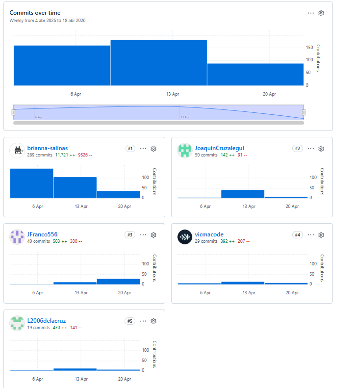
</div>

<br>

---

<br>

##  Tabla de Contenidos
  #### [Contenido](#-tabla-de-contenidos)
  #### [Student Outcome](#-student-outcome)

  #### [Capítulo I: Introducción](#capítulo-i-introducción-1)
  - [1.1. Startup Profile](#11-startup-profile)
    - [1.1.1. Descripción de la Startup](#111-descripción-de-la-startup)
    - [1.1.2. Perfiles de integrantes del equipo](#112-perfiles-de-integrantes-del-equipo)
  - [1.2. Solution Profile](#12-solution-profile)
    - [1.2.1. Antecedentes y problemática](#121-antecedentes-y-problemática)
    - [1.2.2. Lean UX Process](#122-lean-ux-process)
      - [1.2.2.1. Lean UX Problem Statements](#1221-lean-ux-problem-statements)
      - [1.2.2.2. Lean UX Assumptions](#1222-lean-ux-assumptions)
      - [1.2.2.3. Lean UX Hypothesis Statements](#1223-lean-ux-hypothesis-statements)
      - [1.2.2.4. Lean UX Canvas](#1224-lean-ux-canvas)
  - [1.3. Segmentos objetivo](#13-segmentos-objetivo)
 
  #### [Capítulo II: Requirements Elicitation & Analysis](#capítulo-ii-requirements-elicitation--analysis-1)
  - [2.1. Competidores](#21-competidores)
    - [2.1.1. Análisis competitivo](#211-análisis-competitivo)
    - [2.1.2. Estrategias y tácticas frente a competidores](#212-estrategias-y-tácticas-frente-a-competidores)
  - [2.2. Entrevistas](#22-entrevistas)
    - [2.2.1. Diseño de entrevistas](#221-diseño-de-entrevistas)
    - [2.2.2. Registro de entrevistas](#222-registro-de-entrevistas)
    - [2.2.3. Análisis de entrevistas](#223-análisis-de-entrevistas)
  - [2.3. Needfinding](#23-needfinding)
    - [2.3.1. User Personas](#231-user-personas)
    - [2.3.2. User Task Matrix](#232-user-task-matrix)
    - [2.3.3. User Journey Mapping](#233-user-journey-mapping)
    - [2.3.4. Empathy Mapping](#234-empathy-mapping)
  - [2.4. Big Picture Event Storming](#24-big-picture-event-storming)
  - [2.5. Ubiquitous Language](#25-ubiquitous-language)
    
  #### [Capítulo III: Requirements Specification](#capítulo-iii-requirements-specification-1)
  - [3.1. User Stories](#31-user-stories)
  - [3.2. Impact Mapping](#32-impact-mapping)
  - [3.3. Product Backlog](#33-product-backlog)
    
  #### [Capítulo IV: Product Design](#capítulo-iv-product-design-1)
  - [4.1. Style Guidelines](#41-style-guidelines)
    - [4.1.1. General Style Guidelines](#411-general-style-guidelines)
    - [4.1.2. Web Style Guidelines](#412-web-style-guidelines)
  - [4.2. Information Architecture](#42-information-architecture)
    - [4.2.1. Organization Systems](#421-organization-systems)
    - [4.2.2. Labeling Systems](#422-labeling-systems)
    - [4.2.3. SEO Tags and Meta Tags](#423-seo-tags-and-meta-tags)
    - [4.2.4. Searching Systems](#424-searching-systems)
    - [4.2.5. Navigation Systems](#425-navigation-systems)
  - [4.3. Landing Page UI Design](#43-landing-page-ui-design)
    - [4.3.1. Landing Page Wireframe](#431-landing-page-wireframe)
    - [4.3.2. Landing Page Mock-up](#432-landing-page-mock-up)
  - [4.4. Web Applications UX/UI Design](#44-web-applications-uxui-design)
    - [4.4.1. Web Applications Wireframes](#441-web-applications-wireframes)
    - [4.4.2. Web Applications Wireflow Diagrams](#442-web-applications-wireflow-diagrams)
    - [4.4.3. Web Applications Mock-ups](#443-web-applications-mock-ups)
    - [4.4.4. Web Applications User Flow Diagrams](#444-web-applications-user-flow-diagrams)
  - [4.5. Web Applications Prototyping](#45-web-applications-prototyping)
  - [4.6. Domain-Driven Software Architecture](#46-domain-driven-software-architecture)
    - [4.6.1. Design-Level Event Storming](#461-design-level-event-storming)
    - [4.6.2. Software Architecture Context Diagram](#462-software-architecture-context-diagram)
    - [4.6.3. Software Architecture Container Diagrams](#463-software-architecture-container-diagrams)
    - [4.6.4. Software Architecture Components Diagrams](#464-software-architecture-components-diagrams)
  - [4.7. Software Object-Oriented Design](#47-software-object-oriented-design)
    - [4.7.1. Class Diagrams](#471-class-diagrams)
  - [4.8. Database Design](#48-database-design)
    - [4.8.1. Database Diagrams](#481-database-diagrams)
      
  #### [Capítulo V: Product Implementation, Validation & Deployment](#capítulo-v-product-implementation-validation--deployment-1)
  - [5.1. Software Configuration Management](#51-software-configuration-management)
    - [5.1.1. Software Development Environment Configuration](#511-software-development-environment-configuration)
    - [5.1.2. Source Code Management](#512-source-code-management)
    - [5.1.3. Source Code Style Guide & Conventions](#513-source-code-style-guide--conventions)
    - [5.1.4. Software Deployment Configuration](#514-software-deployment-configuration)
  - [5.2. Landing Page, Services & Applications Implementation](#52-landing-page-services--applications-implementation)
    - [5.2.1. Sprint 1](#521-sprint-1)
  - [5.3. Validation Interviews](#53-validation-interviews)
  - [5.4. Video About-the-Product](#54-video-about-the-product)
    
  #### [Conclusiones](#conclusiones-1)
  
  #### [Recomendaciones](#recomendaciones-1)

  #### [Video About-the-Team](#video-about-the-team-1)
  
  #### [Bibliografía](#-bibliografía)
  
  #### [Anexos](#anexos-1)

---

<br>

##  Student Outcome

En el siguiente cuadro se describen las acciones realizadas y enunciados de conclusiones que permiten sustentar el logro alcanzado.

| Criterio específico | Acciones realizadas | Conclusiones |
|:---|:---|:---|
| **3.c1. Comunica oralmente con efectividad a diferentes rangos de audiencia.** | **Salinas, Brianna** <br> AV1: Durante el registro de entrevistas, conduje sesiones con usuarios del segmento objetivo adaptando mi discurso oral según el perfil del entrevistado, logrando transmitir el propósito de BrandRadar de forma clara y comprensible tanto para perfiles técnicos como no técnicos. <br><br> **Jáuregui, Jean Franco** <br> AV1: (acción específica) <br><br> **Cruzalegui, Joaquin** <br> AV1: (acción específica) <br><br> **Garcia Paredes, Victor** <br> AV1: Diseñé y conduje oralmente dos entrevistas dirigidas a representantes de nuestros segmentos objetivo (una PyME y una Agencia Digital). Durante las sesiones, adapté mi lenguaje y tono para generar empatía con perfiles no técnicos, logrando extraer con claridad sus dolores respecto a la gestión de su reputación digital y comunicando efectivamente el propósito de nuestra investigación. <br><br> **Acuña de la Cruz, Luis** <br> AV1: (acción específica) | (Completar de forma grupal en cada entrega) |
| **3.c2. Comunica por escrito con efectividad a diferentes rangos de audiencia.** | **Salinas, Brianna** <br> AV1: Redacté el Capítulo I, la sección 4.3 de Landing Page UI Design, los diagramas de clases (4.7.1) y el diseño de base de datos (4.8), empleando un lenguaje técnico preciso y estructurado acorde al formato académico del informe, garantizando que el contenido sea comprensible para lectores con distintos niveles de conocimiento en ingeniería de software. <br><br> **Jáuregui, Jean Franco** <br> AV1: (acción específica) <br><br> **Cruzalegui, Joaquin** <br> AV1: (acción específica) <br><br> **Garcia Paredes, Victor** <br> AV1: Redacté las secciones de segmentos objetivo, análisis competitivo, needfinding y arquitectura de software basada en DDD. Empleé un lenguaje claro, persuasivo y estructurado para documentar los User Personas; y utilicé terminología técnica estandarizada para describir el design-level event storming y los diagramas del modelo C4, garantizando que la documentación sea comprensible tanto para stakeholders como para el equipo de desarrollo. <br><br> **Acuña de la Cruz, Luis** <br> AV1: (acción específica) | (Completar de forma grupal en cada entrega) |

---


<div align="center">

# Capítulo I: Introducción

</div>

---

## 1.1. Startup Profile

###   1.1.1. Descripción de la Startup

<br>

*BrandRadar* es una startup tecnológica dedicada al desarrollo de una aplicación web especializada en el monitoreo y análisis de la reputación digital de marcas y empresas en tiempo real. Su propuesta se centra en proporcionar información estratégica que permita a las organizaciones comprender y gestionar su presencia en el entorno digital de manera eficiente.

La plataforma integra la recopilación y el análisis de datos provenientes de diversas fuentes, como redes sociales, reseñas en línea y menciones en múltiples plataformas digitales. Asimismo, incorpora el monitoreo del estado de la infraestructura web, consolidando toda la información en un único panel de control. Esto facilita una visión integral del desempeño y posicionamiento digital de la marca.

Mediante el uso de técnicas avanzadas de análisis de datos y procesamiento de lenguaje natural, *BrandRadar* identifica patrones, analiza tendencias y evalúa el sentimiento de los usuarios, clasificándolo en positivo, negativo o neutro. Además, permite detectar oportunamente posibles riesgos reputacionales, lo que contribuye a una gestión preventiva y estratégica.

En conjunto, esta herramienta brinda a las empresas la capacidad de tomar decisiones informadas, optimizar su posicionamiento en el mercado digital y fortalecer su imagen corporativa, generando así una ventaja competitiva en un entorno cada vez más dinámico y exigente.

<br>

<div align="center">
  
###  Logo y nombre del proyecto:

**BrandRadar**

  

<br>

##  Misión

*"Brindar a empresas y marcas una herramienta tecnológica que les permita monitorear y analizar su reputación digital en tiempo real, facilitando la toma de decisiones estratégicas basadas en información confiable y oportuna."*

<br>

##  Visión

*"Ser una plataforma líder en Latinoamérica en la gestión de la reputación digital, reconocida por su innovación, precisión analítica y aporte al crecimiento y posicionamiento de las marcas en el entorno digital."*

</div>

<br>

##  Propuesta de Valor

BrandRadar permite a las empresas:

-  Monitorear en tiempo real lo que se dice sobre su marca en internet  
-  Centralizar el monitoreo de redes sociales y el estado de la infraestructura web en un único panel de control  
-  Analizar de forma automática el sentimiento de opiniones y comentarios
-  Detectar crisis reputacionales de manera temprana
-  Obtener información clara y accionable para mejorar su posicionamiento digital  
<br>

##  Valores

-  **Innovación**: Uso de tecnología para ofrecer soluciones modernas  
-  **Transparencia**: Información clara y confiable  
-  **Orientación al cliente**: Enfoque en necesidades reales  
-  **Responsabilidad**: Manejo ético y seguro de los datos  
-  **Calidad**: Resultados precisos y útiles  
<br>

##  Objetivos

1. Desarrollar una plataforma web funcional para el monitoreo de reputación digital  
2. Implementar un sistema de análisis de sentimiento automático basado en procesamiento de lenguaje natural
3. Integrar múltiples fuentes de datos digitales en tiempo real (redes sociales, reseñas y menciones)
4. Incorporar el monitoreo del estado de la infraestructura web (disponibilidad, rendimiento y errores)
5. Centralizar toda la información en un panel de control intuitivo y fácil de usar
6. Facilitar la toma de decisiones mediante reportes claros, visuales y accionables
7. Contribuir al fortalecimiento del posicionamiento digital de las empresas usuarias


---

###   1.1.2. Perfiles de integrantes del equipo

<div align="center">
  
####  Integrante 1


| Campo | Detalle |
|:------|:--------|
| **Nombres y Apellidos** | `Salinas Guzmán, Brianna` |
| **Código de estudiante** | `U202410239` |
| **Carrera** | Ingeniería de Software |

</div>
<br>

**Descripción:**
*Soy estudiante de Ingeniería de Software con conocimientos en desarrollo de aplicaciones, estructuras de datos y programación orientada a objetos. Tengo experiencia trabajando con lenguajes como C++, Pyhton, SQL para base de datos y en la gestión de proyectos utilizando Git y GitHub para el control de versiones. Además, cuento con formación complementaria en marketing digital, lo que me permite aportar una perspectiva orientada al usuario y al posicionamiento del producto. Me considero una persona responsable, con capacidad de aprendizaje autónomo y habilidades para trabajar en equipo y comunicar ideas de manera clara.*

---

<br>

<div align="center">
  
####  Integrante 2


| Campo | Detalle |
|:------|:--------|
| **Nombres y Apellidos** | `Jáuregui Cerna, Jean Franco` |
| **Código de estudiante** | `U202410024` |
| **Carrera** | Ingeniería de Software |

</div>

**Descripción:**
*(Párrafo describiendo principales conocimientos técnicos y habilidades que puede aportar al equipo)*

---
<br>

<div align="center">
  
####  Integrante 3


| Campo | Detalle |
|:------|:--------|
| **Nombres y Apellidos** | `Cruzalegui Herrera, Joaquin` |
| **Código de estudiante** | `U202411354` |
| **Carrera** | Ingeniería de Software |
</div>

**Descripción:**
*Soy estudiante de la carrera de Ingeniería de Software, actualmente cuento con conocimiento de desarrollo de aplicaciones, estructura de datos y programación orientada a objetos. Cuento con experiencia en lenguajes como C++ y un nivel intermedio de python, además he trabajado con MySql y MongoDB en cuanto a base de datos. Considero que soy una persona resposable, que se desenvuelve mejor en trabajos colaborativos y que da lo mejor de sí en las acividades correspondientes para el cumplimiento de un proyecto.*

---
<br>
<div align="center">

####  Integrante 4


| Campo | Detalle |
|:------|:--------|
| **Nombres y Apellidos** | `Garcia Paredes, Victor Manuel` |
| **Código de estudiante** | `U202012001` |
| **Carrera** | Ingeniería de Software |

</div>

**Descripción:**
*Soy estudiante de Ingeniería de Software con sólidos conocimientos en desarrollo de aplicaciones, estructuras de datos y programación orientada a objetos. Tengo experiencia en el uso de C++, así como en la gestión de proyectos mediante herramientas como Git y GitHub para el control de versiones. También tengo un conocimiento basico sobre Python, MSSQL y MongoDB. Me caracterizo por ser una persona responsable, con iniciativa para el aprendizaje autónomo, y con habilidades para el trabajo en equipo y la comunicación efectiva de ideas.*

---
<br>
<div align="center">
  
####  Integrante 5


| Campo | Detalle |
|:------|:--------|
| **Nombres y Apellidos** | `Acuña de la Cruz, Luis` |
| **Código de estudiante** | `U202417228` |
| **Carrera** | Ingeniería de Software |
</div>

**Descripción:**
*(Párrafo describiendo principales conocimientos técnicos y habilidades que puede aportar al equipo)*

---
<br>

## 1.2. Solution Profile

###   1.2.1. Antecedentes y problemática

###  Antecedentes


En la última década, la digitalización ha transformado significativamente la relación entre empresas y consumidores, trasladando gran parte de la interacción hacia entornos digitales. En este contexto, la reputación de marca ya no depende únicamente de la comunicación corporativa, sino también del contenido generado por los propios usuarios en internet.

De acuerdo con Statista (2025), las reseñas online se han convertido en un factor clave en la toma de decisiones de compra, siendo consideradas por el 62 % de los consumidores como muy influyentes al momento de elegir productos o servicios. Esto evidencia que la percepción digital de una marca impacta directamente en su desempeño comercial.

Asimismo, estudios recientes de BrightLocal (2026) muestran que el 97 % de los consumidores lee reseñas en línea antes de elegir un negocio, y que el 85 % es más propenso a confiar en empresas con opiniones positivas, mientras que el 77 % evita aquellas con reseñas negativas. Estos datos refuerzan la idea de que la reputación digital influye de manera directa en la confianza y decisión del consumidor.

Por otro lado, diversas investigaciones académicas han demostrado que las reseñas digitales funcionan como un mecanismo que reduce la incertidumbre en los consumidores. Según Ott, Cardie y Hancock (2012), las opiniones en línea actúan como señales que permiten a los usuarios evaluar la calidad de un producto o servicio en ausencia de información directa.

No obstante, el entorno digital actual también presenta desafíos importantes. La información sobre una marca se encuentra distribuida en múltiples plataformas, lo que dificulta su gestión. Además, el volumen de datos generado por los usuarios es cada vez mayor, lo que complica su análisis e interpretación. A ello se suma la presencia de información poco confiable o engañosa, lo que afecta la credibilidad del ecosistema digital. En este sentido, estudios recientes evidencian que más del 75 % de los consumidores desconfía de posibles reseñas falsas, lo que impacta directamente en la confianza hacia las marcas (Backlinko, 2026).

En conjunto, estos factores demuestran que la reputación digital se ha convertido en un activo estratégico para las empresas, pero también en un desafío complejo de gestionar, especialmente para aquellas organizaciones que no cuentan con herramientas adecuadas que les permitan monitorear y analizar la información en tiempo real de manera eficiente.


<br>

### Descripción de la Problemática (5W + 2H)
<br>

  *Para comprender la problemática que aborda BrandRadar, se aplica la técnica de las 5W + 2H:*

####   What — ¿Cuál es el problema?

Las marcas no cuentan con visibilidad en tiempo real sobre cómo son percibidas en internet. En muchos casos, desconocen qué se dice de ellas, en qué plataformas se generan las menciones, qué tono predomina en las opiniones ni cuándo una percepción negativa puede escalar hacia una crisis reputacional.

Esta situación se debe, principalmente, a la dispersión de la información en múltiples canales digitales y a la falta de herramientas accesibles que integren y analicen estos datos de manera clara y accionable. Como consecuencia, las organizaciones no logran identificar oportunamente riesgos reputacionales, lo que limita su capacidad de respuesta y dificulta la toma de decisiones estratégicas antes de que el impacto negativo se intensifique.

####   Why — ¿Por qué es un problema relevante?

Este problema es relevante debido a diversos factores que dificultan una adecuada gestión de la reputación digital:

- La información sobre la marca se encuentra distribuida en múltiples canales digitales, lo que complica su seguimiento y análisis.
- Las herramientas disponibles en el mercado suelen ser complejas o implican costos elevados, limitando su acceso, especialmente para pequeñas y medianas empresas.
- Existe una sobrecarga de datos generados constantemente, lo que dificulta su correcta interpretación y uso estratégico.
- La reputación digital es dinámica y puede cambiar rápidamente en tiempo real, lo que exige una supervisión continua.

####   Who — ¿Quiénes son los afectados?

- Pequeñas y medianas empresas (PyMEs) y marcas digitales que buscan gestionar su presencia en línea.

- Agencias de marketing digital y especialistas encargados de la gestión de marcas.

- Community managers y responsables de comunicación que monitorean la interacción con los usuarios.


####   Where — ¿Dónde ocurre?

El problema se manifiesta en el ecosistema digital en su conjunto, abarcando redes sociales (Instagram, X/Twitter, TikTok, LinkedIn y Facebook), plataformas de reseñas (Google, Trustpilot y TripAdvisor), así como foros y comunidades en línea (Reddit y Quora), medios digitales y blogs.

La dispersión de la información en estos múltiples canales dificulta su seguimiento integral, haciendo que el monitoreo manual resulte ineficiente e incluso inviable para muchas organizaciones.


####   When — ¿Cuándo se presenta con mayor criticidad?

El problema se intensifica en momentos de alta exposición mediática, como lanzamientos de productos, campañas publicitarias, controversias públicas o eventos relevantes del sector. En estas situaciones, el volumen de interacciones y menciones aumenta significativamente, elevando el riesgo de impacto reputacional.

No obstante, debido a la naturaleza dinámica del entorno digital, la reputación de una marca se encuentra en constante evaluación, lo que implica que este problema está presente de manera continua, las 24 horas del día, los 7 días de la semana.

####   How — ¿Cómo se enfrenta actualmente el problema?

Actualmente, muchas empresas que no cuentan con soluciones especializadas enfrentan esta problemática mediante métodos manuales y poco integrados. Entre las principales prácticas se encuentran:

- La realización de búsquedas periódicas en motores como Google y la revisión esporádica de redes sociales.
- El uso de alertas básicas por correo electrónico, que no garantizan un seguimiento completo ni en tiempo real.
- La gestión de información fragmentada en múltiples plataformas, lo que dificulta su análisis integral.
- La ausencia de sistemas automatizados que permitan monitorear la reputación digital de manera continua.
- La detección tardía de problemas reputacionales, lo que reduce la capacidad de respuesta.
- La toma de decisiones basada en información incompleta o no consolidada.


####   How Much — ¿Cuál es la magnitud del impacto?

El impacto de la reputación digital en las empresas es significativo y se encuentra respaldado por diversos estudios recientes.

En este sentido, distintas investigaciones evidencian que:

- El **93 % de los consumidores lee reseñas online antes de realizar una compra (Ruby, 2025).**
- El **97 % consulta reseñas de negocios antes de visitarlos (Capital One Shopping Research, 2026).**
- El **85 % evita empresas sin reseñas o con una reputación negativa (Capital One Shopping Research, 2026).**
- El **75 % de los consumidores desconfía de reseñas falsas, lo que afecta la credibilidad de las marcas (Ruby, 2025).**
- Las reseñas pueden **incrementar las ventas hasta en un 19,8 % (Capital One Shopping Research, 2026).**

Estos datos demuestran que la reputación digital tiene un impacto directo en aspectos clave como:

- La **decisión de compra**
- La **confianza del consumidor**
- Los **ingresos de la empresa**

<br>

###  Imagen 1: Influencia de las reseñas en decisiones de compra

 Esta gráfica muestra cómo la mayoría de consumidores:

Lee reseñas frecuentemente

Basa sus decisiones en opiniones de otros usuarios
<br>
<div align="center">
  


(BrightLocal, 2026)

</div>


###   Imagen 2: Frecuencia de lectura de reseñas

 Se observa que:

Más del 70 % de usuarios revisa reseñas regularmente

Solo un porcentaje mínimo no las consulta

<br>
<div align="center">
  
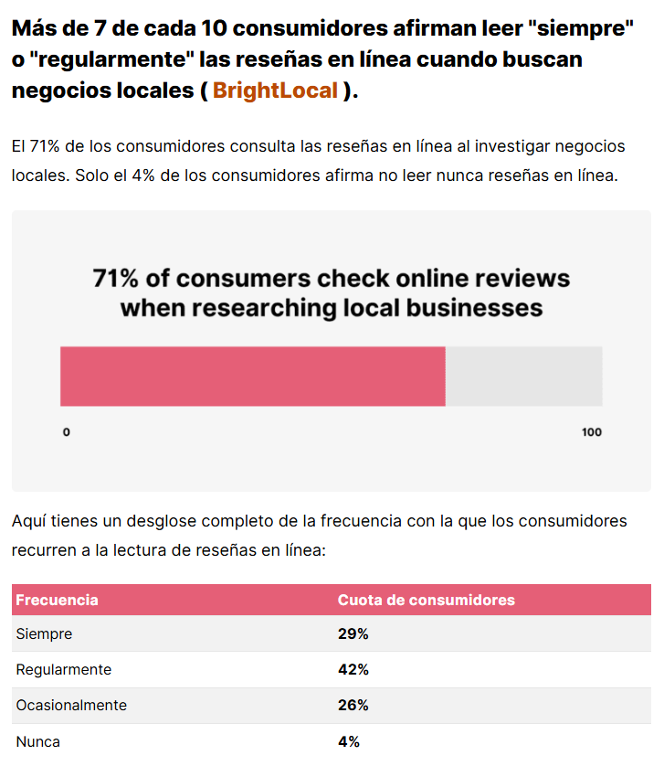

(Backlinko, 2026)

</div>

<br>

Estos resultados evidencian que una mala gestión de la reputación digital puede generar pérdida de clientes, disminución de ingresos y deterioro de la imagen de marca, lo que justifica la necesidad de soluciones como *BrandRadar*.

---
<br>

### 1.2.2. Lean UX Process

#### 1.2.2.1. Lean UX Problem Statements

El proceso Lean UX se basa en identificar con precisión los problemas reales que enfrentan los usuarios antes de proponer cualquier solución. Este enfoque permite comprender sus necesidades, comportamientos y dificultades, con el fin de diseñar propuestas que generen valor de manera efectiva.

A continuación, se presentan los Problem Statements correspondientes a los dos segmentos iniciales de BrandRadar, los cuales han sido formulados a partir del análisis del dominio, el segmento de clientes, los principales pain points, el gap de mercado y la visión estratégica del proyecto.

<br>

### Problem Statement 1

####  Pequeñas y medianas empresas y marcas digitales (PyMEs)
<br>

> Hemos observado que las **pequeñas y medianas empresas con presencia digital** no cuentan con herramientas accesibles que les permitan monitorear su reputación en tiempo real. Esto ocasiona que no logren detectar oportunamente comentarios negativos o posibles crisis reputacionales. Como consecuencia, reaccionan de forma tardía, toman decisiones sin información clara y pierden control sobre la percepción de su marca.

*"¿Cómo podríamos ayudar a estas empresas a monitorear y detectar en tiempo real lo que se dice de su marca, para que puedan gestionar su reputación de manera proactiva y basada en información confiable?"*

<br>

### Problem Statement 2

####  Especialistas de marketing o community managers
<br>

> Hemos observado que las **agencias de marketing digital y especialistas en gestión de marca** enfrentan una administración fragmentada de la reputación de sus clientes, sin contar con una herramienta que centralice el monitoreo y permita identificar menciones relevantes en tiempo real. Esto incrementa el tiempo operativo, dificulta la respuesta oportuna ante posibles crisis y limita la capacidad de gestionar múltiples marcas de manera eficiente.

*"¿Cómo podríamos ayudar a estos profesionales a centralizar el monitoreo de múltiples marcas y facilitar la detección oportuna de menciones críticas en un solo lugar, optimizando así su gestión y capacidad de respuesta?"*

---
<br>

#### 1.2.2.2. Lean UX Assumptions
<br>

#### Features

  •  Registro de usuarios para acceder a la plataforma.
  
  •  Dashboard centralizado con visualización en tiempo real de menciones y métricas clave.
  
  •  Sistema de alertas automáticas ante menciones negativas y eventos críticos.
  
  •  Monitoreo de múltiples fuentes digitales, como redes sociales, plataformas de reseñas y menciones web.
  
  •  Monitoreo del estado de la infraestructura web, considerando disponibilidad, rendimiento y detección de errores.
  
  •  Análisis de sentimiento automatizado, clasificando las opiniones en positivas, neutras o negativas.

  •  Historial y trazabilidad de menciones y eventos para su seguimiento y análisis.

<br>

#### Business Outcomes

  •  Reducir el tiempo de respuesta ante menciones negativas y fallos en la infraestructura web.
  
  •  Incrementar el nivel de sentimiento positivo asociado a la marca.
  
  •  Mejorar la continuidad operativa mediante la detección temprana de problemas técnicos.
  
  •  Aumentar la retención de usuarios activos en la plataforma. 
  
  •  Lograr la adopción temprana de la plataforma por parte de PyMEs y agencias de marketing digital.

<br>

#### Users

  •  Responsables de marketing y community managers encargados de la gestión de la reputación digital.
  
  •  Pequeñas y medianas empresas (PyMEs) con presencia en entornos digitales.
  
  •  Agencias de marketing digital que gestionan múltiples marcas y clientes.
  
<br>

#### User Outcomes

  •  Conocer en tiempo real lo que se dice sobre su marca en el entorno digital.
  
  •  Detectar de manera oportuna comentarios negativos, posibles crisis reputacionales o fallos técnicos.
  
  •  Contar con una visión unificada de la reputación digital y del estado de la infraestructura web.
  
  •  Tomar decisiones informadas basadas en datos sobre percepción y rendimiento.
  
  •  Reducir el tiempo invertido en el monitoreo manual de múltiples plataformas.
  
  •  Gestionar su reputación de forma proactiva, en lugar de reactiva.

<br>

---

#### 1.2.2.3. Lean UX Hypothesis Statements

<br>

**Hypothesis Statement 1:**


> Creemos que, al implementar alertas automáticas en tiempo real sobre menciones negativas y fallos en la infraestructura web, los responsables de marketing y equipos técnicos podrán responder de manera más oportuna y prevenir crisis reputacionales y operativas.
**Sabremos que hemos tenido éxito** cuando al menos el 70 % de los usuarios activos configure alertas durante su primera semana de uso y se evidencie una reducción en el tiempo de respuesta ante incidentes.

**Hypothesis Statement 2:**


> Creemos que, al ofrecer un dashboard centralizado que integre métricas de reputación (sentimiento, volumen y tendencias) junto con el estado de la infraestructura web, los usuarios podrán comprender mejor el desempeño digital de su marca y tomar decisiones estratégicas más informadas.
**Sabremos que hemos tenido éxito** cuando el 65 % de los usuarios activos consulte el dashboard al menos tres veces por semana durante el primer mes de uso.


**Hypothesis Statement 3:**


> Creemos que, al integrar múltiples canales digitales junto con el monitoreo técnico en una sola plataforma, los usuarios podrán obtener una visión más completa y unificada de su ecosistema digital.
**Sabremos que hemos tenido éxito** cuando al menos el 60 % de los usuarios activos conecte más de una fuente de datos y utilice al menos una funcionalidad de monitoreo de infraestructura durante su primera semana de uso.


<br>

---

#### 1.2.2.4. Lean UX Canvas

*Lean UX Canvas elaborado en la herramienta Figma*

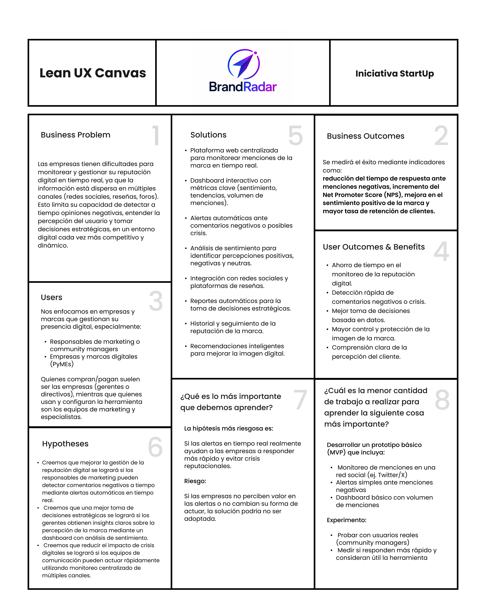

El Lean UX Canvas fue elaborado utilizando la herramienta Figma, lo que permitió estructurar de manera visual y colaborativa los principales componentes del proyecto. En este se identifican los problemas del usuario, las hipótesis de solución, los segmentos de clientes, la propuesta de valor y las métricas clave.

Asimismo, su desarrollo facilitó la iteración continua de ideas y la alineación del equipo en torno a los objetivos del producto. De esta manera, se logró validar supuestos de forma temprana y enfocar los esfuerzos en generar valor para el usuario final.

---

## 1.3. Segmentos objetivo

### Segmento objetivo 1: Pequeñas y medianas empresas y marcas digitales (PyMEs)
<br>

Este segmento está conformado por propietarios o gerentes de pequeñas y medianas empresas, como restaurantes, clínicas dentales, hoteles boutique o negocios de comercio electrónico, que cuentan con presencia activa en canales digitales. Sin embargo, no disponen de equipos especializados en comunicación o gestión de la reputación, lo que limita su capacidad para monitorear y responder de manera oportuna a las interacciones de los usuarios.

<br>

**Características demográficas:**

<br>

* **Edad:** Entre 25 y 55 años.
* **Género:** Hombres y mujeres.
* **Ubicación:** Zonas urbanas y de alto comercio en Perú y principales ciudades de Latinoamerica.
* **Ocupación:** Emprendedores, Gerentes Generales, Administradores de local comercial.
* **Nivel socioeconómico:** Sectores B y C.

<br>

*Estadísticas de sustento:*

<br>
Para respaldar este segmento, según Ipsos Perú (2023), el 85 % de los consumidores peruanos revisa opiniones en línea antes de adquirir un producto o servicio. Asimismo, estudios de BrightLocal (2026) indican que el 93 % de los usuarios toma decisiones de compra basadas en reseñas locales.

Estos datos evidencian que, para una PyME, el monitoreo de su reputación digital no constituye un elemento opcional, sino una necesidad estratégica para su posicionamiento y sostenibilidad en el mercado.

---

### Segmento objetivo 2: Especialistas de marketing o community managers
<br>

Este segmento está conformado por profesionales responsables de gestionar la presencia digital de una o múltiples marcas, incluyendo community managers, analistas de marketing digital y equipos de comunicación. Estos usuarios enfrentan como principal dificultad el alto tiempo operativo que invierten en la revisión manual de diversas plataformas digitales y en la elaboración de reportes de reputación.

En este contexto, requieren una herramienta que les permita centralizar la información, optimizar sus procesos de monitoreo y recibir alertas en tiempo real ante posibles crisis, con el fin de gestionar de manera más eficiente la reputación de las marcas que representan.

<br>

**Características demográficas:**

<br>

* **Edad:** Entre 20 y 45 años.
* **Género:** Hombres y mujeres.
* **Ubicación:** Ecosistemas corporativos o en modalidad de trabajo remoto a nivel nacional y regional (LATAM).
* **Ocupación:** Directores de Agencia, Ejecutivos de Cuentas (Account Managers), Social Media Managers, Community managers.
* **Nivel socioeconómico:** Sectores A y B.
<br>

*Estadísticas de sustento:*

<br>

Según reportes de la industria, como el *State of Marketing* de HubSpot (2024), los equipos de marketing enfrentan una creciente necesidad de gestionar grandes volúmenes de información, lo que incrementa el tiempo dedicado a tareas operativas como la elaboración de reportes y el seguimiento de métricas.

Estos datos evidencian que los profesionales del marketing requieren herramientas que optimicen sus procesos, reduzcan la carga operativa y les permitan enfocarse en actividades estratégicas de mayor valor.

---

<div align="center">

# Capítulo II: Requirements Elicitation & Analysis

</div>

---

## 2.1. Competidores

### 2.1.1. Análisis competitivo

En esta sección se presenta el *Competitive Analysis Landscape*, el cual permite evaluar a **BrandRadar** frente a las principales soluciones disponibles en el mercado. Este análisis tiene como finalidad identificar fortalezas, debilidades y oportunidades, con el fin de comprender el posicionamiento de la propuesta y su valor diferencial frente a la competencia.

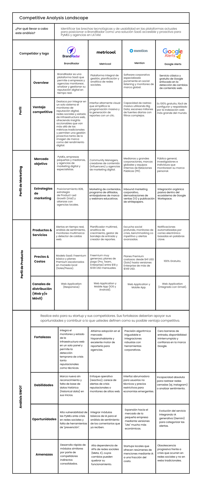

<br>

### 2.1.2. Estrategias y tácticas frente a competidores

Para asegurar la competitividad de BrandRadar en el mercado de herramientas de monitoreo digital, se plantean estrategias orientadas a diferenciar su propuesta de valor frente a las soluciones existentes, aprovechando sus limitaciones y las necesidades no cubiertas del mercado.

En primer lugar, se adopta una estrategia de enfoque en la prevención, diferenciándose de herramientas como Metricool, que priorizan la gestión de contenido. En este sentido, BrandRadar se centra en la detección temprana de riesgos reputacionales. Como táctica, se implementan alertas automáticas en tiempo real ante picos de menciones negativas o eventos críticos, posicionándose como una herramienta que permite anticiparse a posibles crisis y no solo reaccionar ante ellas.

En segundo lugar, se propone una estrategia de liderazgo en costos y usabilidad frente a plataformas más complejas como Mention. BrandRadar busca democratizar el acceso a herramientas de monitoreo mediante una interfaz intuitiva y un modelo SaaS accesible para PyMEs. Como táctica, se simplifica la visualización de datos a través de indicadores claros (por ejemplo, semáforos de reputación) y se ofrecen planes adaptados al contexto del mercado.

Finalmente, se plantea una estrategia de diferenciación tecnológica frente a soluciones básicas como Google Alerts, que se limitan a la detección de menciones. BrandRadar incorpora análisis de sentimiento y centralización de la información, lo que permite no solo identificar qué se dice de una marca, sino también interpretar cómo es percibida. Como táctica, se integran técnicas de procesamiento de lenguaje natural para generar insights accionables que apoyen la toma de decisiones.

En conjunto, estas estrategias permiten posicionar a BrandRadar como una solución accesible, inteligente y orientada a la acción dentro del mercado de monitoreo de reputación digital. De este modo, la propuesta no solo responde a las limitaciones de las herramientas existentes, sino que también aporta un valor diferencial al facilitar una gestión más proactiva, integrada y basada en datos.

<br>

---

<br>

## 2.2. Entrevistas

### 2.2.1. Diseño de entrevistas

En esta sección se presenta el diseño de las entrevistas realizadas con el objetivo de comprender en profundidad las necesidades, comportamientos y problemáticas de los usuarios identificados. Para ello, se empleó un enfoque de entrevistas semiestructuradas, el cual permitió obtener información cualitativa relevante, manteniendo a la vez flexibilidad para profundizar en las respuestas de los participantes.

El diseño de las entrevistas se basó en buenas prácticas de investigación en experiencia de usuario (UX), priorizando el uso de preguntas abiertas, evitando sesgos y enfocándose en experiencias reales de los usuarios. Asimismo, se buscó recolectar tanto información principal —relacionada con el problema y el uso de herramientas— como información complementaria, como datos demográficos y contexto personal, necesarios para la construcción de arquetipos o user personas.
<br>

### Segmento 1: Pequeñas y medianas empresas y marcas digitales (PyMEs)

Para este segmento, las entrevistas estuvieron orientadas a comprender cómo las empresas gestionan actualmente su reputación digital, qué dificultades enfrentan en este proceso y cuál es su nivel de conocimiento sobre herramientas tecnológicas disponibles.
  
<br>

**Preguntas iniciales**

- Para comenzar, ¿podrías presentarte brevemente? (edad, lugar donde vives, con quiénes vives y a qué te dedicas).
  
- Si tuvieras que describir tu personalidad y tus principales habilidades en el trabajo en tres palabras, ¿cuáles serían y por qué?
  
- ¿Qué marcas (nacionales o internacionales) o referentes te inspiran en tu día a día o en la gestión de tu negocio?
  
<br>

### Preguntas principales:

1. En la última semana, ¿cómo verificaste qué opinaban los clientes sobre tu marca? Describe el proceso paso a paso.
2. ¿Con qué frecuencia revisas comentarios o menciones en redes sociales o internet? (diario, semanal, ocasional)
3. ¿Qué haces exactamente cuando encuentras un comentario negativo sobre tu negocio?
4. ¿Cuánto tiempo te toma revisar todas tus redes o plataformas para ver qué dicen de tu marca?
5. ¿Alguna vez te enteraste tarde de un comentario negativo o problema? ¿Qué ocurrió y qué impacto tuvo?
6. ¿Qué herramientas específicas utilizas actualmente para monitorear tu marca? ¿Qué es lo que más te dificulta de ellas?
7. Si no revisas constantemente, ¿qué te impide hacerlo (tiempo, desconocimiento, complejidad, otros)?
8. ¿Qué tan útil sería para ti recibir una alerta inmediata cuando alguien habla negativamente de tu marca? ¿En qué situaciones la usarías?

<br>

**Preguntas complementarias:**

¿Cuántas personas trabajan en tu empresa?

¿En qué distrito o ciudad operas?

¿Qué redes sociales utilizas con mayor frecuencia?

¿Qué dispositivos utilizas para gestionar tu negocio?

¿Qué tipo de herramientas digitales sueles usar?

¿Qué te gustaría mejorar en la gestión de tu marca?

<br>

### Segmento 2: Especialistas de marketing o community managers

En este segmento, las entrevistas estuvieron orientadas a comprender el flujo de trabajo de los profesionales, las herramientas que utilizan, la carga operativa asociada a sus funciones y sus necesidades en relación con la automatización en la gestión de la reputación digital.

<br>

**Preguntas iniciales**

- ¿Podrías presentarte indicando tu edad, distrito de residencia, estado civil?
  
- ¿Cómo ha sido tu background profesional para llegar a este puesto donde gestionas múltiples marcas?
  
- ¿Cómo describirías tu personalidad trabajando bajo presión y cuáles crees que son tus mejores habilidades profesionales?
  
- ¿Qué marcas, agencias referentes o "influencias" del rubro sigues para mantenerte actualizado?

<br>

### Preguntas principales:

1. ¿Cuál es tu rol y cuáles son tus principales responsabilidades en la gestión de marcas?
2. Describe tu flujo diario para monitorear menciones de las marcas que gestionas. ¿Qué pasos sigues?
3. ¿Qué plataformas revisas normalmente para monitorear estas menciones?
4. ¿Qué herramientas utilizas actualmente para este proceso? ¿Qué limitaciones tienen?
5. ¿Cuánto tiempo dedicas diariamente o semanalmente al monitoreo y a la elaboración de reportes?
6. ¿Cómo detectas actualmente una crisis o un aumento de comentarios negativos?
7. Cuéntame sobre la última vez que una mención negativa no fue detectada a tiempo. ¿Qué ocurrió?
8. ¿Qué parte del proceso (monitoreo, análisis o reporte) te consume más tiempo y por qué?
9. Si contaras con una herramienta que te envíe alertas automáticas en tiempo real sobre la percepción de la marca en redes sociales e internet, ¿cómo cambiaría tu forma de trabajo?

<br>

**Preguntas complementarias:**

Edad, género (opcional), lugar de residencia

Formación académica o experiencia laboral

Tipo de empresa o agencia donde trabajas

¿Cuántas marcas gestionas actualmente?

¿Qué dispositivos utilizas con mayor frecuencia?

¿Qué plataformas digitales usas diariamente?

¿Qué herramientas o marcas influyen en tu trabajo?

<br>

---

### 2.2.2. Registro de entrevistas
<div align="center">
  
**Segmento objetivo 1: `Pequeñas y medianas empresas y marcas digitales (PyMEs)`**

<br>

#### Entrevista 1
*Imagen de la entrevista*


<br>

<br>

| Campo | Detalle |
|:------|:--------|
| **Nombres y apellidos** | `Alfredo Negrete` |
| **Edad** | `49 años` |
| **Ubicación** | `Surco` |
| **Fecha de entrevista** | `2026-04-11` |
| **Duración** | `15:00` |
| **Enlace al video** | [Ver entrevista en Microsoft Stream](https://1drv.ms/v/c/d936c864c8cca0bb/IQBCE_dtbeoPTYkZnSVxycpQASHO2xsa9YOUk000HVkybnE?e=gn42mC) |

**Resumen:**
</div>

Alfredo Negrete es gerente comercial y socio de una empresa dedicada a la fabricación de muebles de exhibición, implementación de espacios comerciales y desarrollo de mobiliario. Tiene 49 años, es padre de familia y reside en el distrito de Surco. Cuenta con experiencia previa en el rubro, lo que le ha permitido desarrollar habilidades clave como el cumplimiento de compromisos, la puntualidad y la orientación a brindar un servicio diferencial, aspectos que fortalecen la credibilidad de su negocio.

Asimismo, manifiesta admiración por las marcas de consumo masivo debido a la complejidad que implica mantenerse competitivas en el mercado. Su experiencia trabajando con empresas internacionales, como Samsung, le ha permitido establecer referentes claros y reforzar su percepción de que su negocio se encuentra bien encaminado.

En cuanto a su dinámica laboral, considera que la comunicación es un factor fundamental en su sector, por lo que utiliza diversas herramientas digitales como el teléfono, correo electrónico, Zoom, Google Meet y WhatsApp para mantener un contacto constante con clientes y proveedores.

Por otro lado, uno de sus principales objetivos actuales es cubrir una deuda generada por su anterior empresa, también del mismo rubro. En ese contexto, menciona que anteriormente priorizó la satisfacción del cliente como elemento central de la imagen empresarial, lo que lo llevó a asumir ciertos costos que finalmente contribuyeron al quiebre del negocio. Sin embargo, expresa frustración al no poder identificar con claridad las causas de las pérdidas, especialmente cuando los clientes optan por otros proveedores.

A pesar de estas dificultades, ha utilizado herramientas digitales como páginas web para comunicarse con sus clientes y ha logrado resolver conflictos de manera interna, priorizando siempre mantener una imagen positiva frente a sus clientes actuales y potenciales.

Finalmente, considera que una aplicación podría ayudarle a fortalecer su imagen empresarial, permitiéndole compartir contenido relevante, como fotografías, artículos y casos de resolución de problemas vinculados a su negocio.

<br>
<div align="center">
  
#### Entrevista 2
*Imagen de la entrevista*


<br>

<br>

| Campo | Detalle |
|:------|:--------|
| **Nombres y apellidos** | `Jenifer Natali López Huamán` |
| **Edad** | `22` |
| **Ubicación** | `Surco` |
| **Fecha de entrevista** | `2026-04-11` |
| **Duración** | `09:03` |
| **Enlace al video** | [Ver entrevista en Microsoft Stream](https://upcedupe-my.sharepoint.com/:v:/g/personal/u202012001_upc_edu_pe/IQAlodktDrH_RYNs0fTbCXXQAR0g-JyDOAB3OlwdYg47y2M?nav=eyJyZWZlcnJhbEluZm8iOnsicmVmZXJyYWxBcHAiOiJTdHJlYW1XZWJBcHAiLCJyZWZlcnJhbFZpZXciOiJTaGFyZURpYWxvZy1MaW5rIiwicmVmZXJyYWxBcHBQbGF0Zm9ybSI6IldlYiIsInJlZmVycmFsTW9kZSI6InZpZXcifX0%3D&e=sZcbFk) |

**Resumen:**
</div>

Jenifer Natali López Huamán es una estudiante de Administración y emprendedora de 22 años, fundadora de Siana Boutique, una tienda de ropa femenina que inició sus operaciones de manera virtual durante la pandemia. Gracias a su esfuerzo y capacidad de ahorro, logró expandir su negocio hacia un local físico, combinando así la venta digital con la atención presencial.

En su gestión diaria, encuentra inspiración en marcas de retail como Zara, Shein y H&M, así como en creadores de contenido en plataformas como Instagram y TikTok. Su principal herramienta de trabajo es el celular, el cual utiliza para la venta, la creación de contenido y la gestión de redes sociales, mientras que la laptop es empleada principalmente para tareas administrativas y coordinación con proveedores.

En cuanto a la comunicación con sus clientes, utiliza principalmente WhatsApp para concretar ventas, debido a la confianza que genera este canal. Asimismo, emplea Instagram como catálogo visual y Facebook, especialmente Marketplace, para atraer clientes a nivel local. Entre sus principales objetivos se encuentran incrementar sus ventas, fidelizar clientes, mejorar su presencia digital y posicionar su marca en el mercado.

No obstante, enfrenta diversas dificultades en su día a día, como la pérdida de ventas durante el proceso de compra, la competencia con precios bajos y la gestión de comentarios negativos. Actualmente, el monitoreo de la opinión de sus clientes lo realiza de manera manual, revisando plataformas como Google Maps y Facebook, lo que limita su capacidad de respuesta oportuna.

A pesar de ello, demuestra una actitud proactiva frente a la retroalimentación. Por ejemplo, mencionó que, ante una queja relacionada con la falta de tallas, decidió ampliar su inventario para atender a un público más diverso, convirtiendo una crítica en una oportunidad de mejora.

Finalmente, reconoce la importancia del entorno digital en su negocio y señala que, ante una posible caída de su tienda online, probablemente se enteraría de forma tardía a través de reclamos de los clientes, lo que afectaría tanto sus ingresos como su imagen de marca. En este contexto, considera que una solución como BrandRadar le resultaría útil, especialmente si le permite recibir alertas en tiempo real, automatizar respuestas ante incidencias y fortalecer su reputación mediante la generación de comentarios positivos.

<br>
<div align="center">
  
#### Entrevista 3

*Imagen de la entrevista*


<br>

<br>

| Campo | Detalle |
|:------|:--------|
| **Nombres y apellidos** | `Karim Castillo` |
| **Edad** | `25` |
| **Ubicación** | `San Isidro` |
| **Fecha de entrevista** | `2026-04-12` |
| **Duración** | `07:12` |
| **Enlace al video** | [Ver entrevista en Microsoft Stream](https://upcedupe-my.sharepoint.com/:v:/g/personal/u202417228_upc_edu_pe/IQAYoH-uIHznQpUZ1saYqN0MATxVGo0pPEIlJliRq-sOhf8?nav=eyJyZWZlcnJhbEluZm8iOnsicmVmZXJyYWxBcHAiOiJPbmVEcml2ZUZvckJ1c2luZXNzIiwicmVmZXJyYWxBcHBQbGF0Zm9ybSI6IldlYiIsInJlZmVycmFsTW9kZSI6InZpZXciLCJyZWZlcnJhbFZpZXciOiJNeUZpbGVzTGlua0NvcHkifX0&e=pA0fuu) |

**Resumen:**

</div>

Karim Castillo es un emprendedor de 25 años, fundador y gerente de dos cafeterías especializadas en café de especialidad, desayunos saludables y postres, ubicadas en los distritos de San Isidro y Miraflores. Su negocio inició hace aproximadamente dos años y medio, luego de haber trabajado como barista mientras estudiaba Administración de Empresas.

En la gestión de sus cafeterías, encuentra inspiración en marcas internacionales como Starbucks, por la experiencia que brindan al cliente, así como en marcas locales como La Brea y Cholo’s, que han logrado crecer manteniendo estándares de calidad. Su principal herramienta de trabajo es el celular, el cual utiliza constantemente para comunicarse con proveedores y su equipo a través de WhatsApp, revisar reseñas en Google Maps e Instagram y atender a los clientes. Por otro lado, utiliza la laptop para tareas administrativas como el control de ventas, pedidos y contabilidad.

En cuanto a la comunicación, WhatsApp es su canal principal debido a la rapidez y cercanía que ofrece. Asimismo, emplea Instagram para promocionar sus productos y atraer nuevos clientes, mientras que el correo electrónico lo utiliza únicamente para gestiones formales.

Entre sus principales objetivos se encuentran incrementar sus ventas en un 40 %, fortalecer su presencia en Google y redes sociales, implementar un servicio de delivery propio y abrir una tercera sucursal en el futuro. Sin embargo, enfrenta diversas dificultades en su operación diaria, como no enterarse oportunamente de reseñas negativas, la alta rotación de personal y el incremento constante de costos.

Actualmente, el monitoreo de la opinión de sus clientes lo realiza de manera manual, revisando Google Maps cada dos o tres días y consultando notificaciones de Facebook de forma irregular. En este contexto, mencionó que en una ocasión se enteró con retraso de un comentario negativo sobre la calidad del producto y el servicio, lo que limitó su capacidad de respuesta oportuna, a pesar de haber ofrecido disculpas y una compensación al cliente.

Finalmente, reconoce que el entorno digital tiene un impacto directo en su negocio. Señala que, ante una posible falla en una página web o sistema de pagos, probablemente se enteraría a través de reclamos de clientes, lo que implicaría pérdidas económicas inmediatas y un alto nivel de estrés. En ese sentido, considera que una herramienta como BrandRadar le resultaría de gran utilidad, ya que le permitiría recibir alertas en tiempo real, centralizar la información de sus locales, analizar el sentimiento de las opiniones y responder de manera más rápida y eficiente.

---
<div align="center">
  
**Segmento objetivo 2: `Especialistas de marketing o community managers`**

<br>

#### Entrevista 1

*Imagen de la entrevista*


<br>

<br>

| Campo | Detalle |
|:------|:--------|
| **Nombres y apellidos** | `Romina Apaza` |
| **Edad** | `22 años` |
| **Ubicación** | `Arequipa` |
| **Fecha de entrevista** | `2026-04-14` |
| **Duración** | `05:31` |
| **Enlace al video** | [Ver entrevista en Microsoft Stream](https://upcedupe-my.sharepoint.com/:v:/g/personal/u202410239_upc_edu_pe/IQCZytpHumWSQIGg_8klU0SaAeGDq2KGqbSibNVgBLzLz6s?nav=eyJyZWZlcnJhbEluZm8iOnsicmVmZXJyYWxBcHAiOiJPbmVEcml2ZUZvckJ1c2luZXNzIiwicmVmZXJyYWxBcHBQbGF0Zm9ybSI6IldlYiIsInJlZmVycmFsTW9kZSI6InZpZXciLCJyZWZlcnJhbFZpZXciOiJNeUZpbGVzTGlua0NvcHkifX0&e=QbskUU) |

**Resumen:**

</div>

Romina Apaza es una profesional freelance especializada en el monitoreo de marcas en entornos digitales, trabajando actualmente con dos marcas. Su labor principal consiste en gestionar la presencia en redes sociales, analizar la interacción del público y asegurar que la comunicación sea coherente con la identidad de cada marca.

Muestra un especial interés en la comunicación política y en la gestión digital de comunidades municipales, lo que le ha permitido desarrollar habilidades en análisis de audiencias y manejo estratégico de redes sociales. Trabaja principalmente con plataformas como Instagram y TikTok, enfocándose en comprender el comportamiento del público y en construir comunidades digitales sólidas.

En su rutina diaria, revisa redes sociales, analiza comentarios, mensajes y menciones, evalúa la interacción con los usuarios y observa tendencias tanto propias como de la competencia. Este proceso le demanda entre una y dos horas al día, mientras que semanalmente dedica más tiempo a la elaboración de reportes.

Romina identifica el monitoreo como la actividad más demandante de su trabajo, ya que se realiza de manera manual y requiere una observación constante. Asimismo, ha enfrentado situaciones en las que comentarios negativos se propagaron sin ser detectados a tiempo, lo que evidencia la necesidad de contar con mecanismos de alerta más rápidos y eficientes.

Entre sus principales fortalezas destacan su capacidad de análisis, observación y adaptación bajo presión, lo que le permite priorizar tareas y responder ante situaciones complejas. No obstante, considera que el uso de herramientas automatizadas con alertas en tiempo real mejoraría significativamente su eficiencia, permitiéndole enfocarse en el análisis estratégico en lugar de tareas operativas.


<br>

<div align="center">
  
#### Entrevista 2

*Imagen de la entrevista*


<br>

<br>

| Campo | Detalle |
|:------|:--------|
| **Nombres y apellidos** | `Esteban Andrés Medina Hernández` |
| **Edad** | `27` |
| **Ubicación** | `Breña, Lima` |
| **Fecha de entrevista** | `2026-04-13` |
| **Duración** | `16:11` |
| **Enlace al video** | [Ver entrevista en Microsoft Stream](https://upcedupe-my.sharepoint.com/:v:/g/personal/u202012001_upc_edu_pe/IQClneebUgtXSJe2UFApCmAAASuqxOfQdrm9aQzKm2Gkgpo?nav=eyJyZWZlcnJhbEluZm8iOnsicmVmZXJyYWxBcHAiOiJTdHJlYW1XZWJBcHAiLCJyZWZlcnJhbFZpZXciOiJTaGFyZURpYWxvZy1MaW5rIiwicmVmZXJyYWxBcHBQbGF0Zm9ybSI6IldlYiIsInJlZmVycmFsTW9kZSI6InZpZXcifX0%3D&e=OjJ9gn)|

**Resumen:**

</div>

La entrevista fue realizada a Esteban Andrés Medina Hernández (27 años, residente en Breña), con el objetivo de recabar información para un proyecto enfocado en el monitoreo y análisis en tiempo real de la reputación digital de marcas. Esteban se desempeña como editor audiovisual y marketer freelance, trabajando principalmente con una clínica dental donde ejerce como jefe de marketing, además de haber tenido experiencia previa dirigiendo su propia agencia.

Relata que su interés por la edición audiovisual comenzó desde temprana edad (aproximadamente a los 12–13 años), iniciando con proyectos personales y posteriormente desarrollándose profesionalmente durante su formación en Ciencias de la Comunicación. Durante la pandemia, experimentó un crecimiento significativo al colaborar con marcas como JBL, GG Poker y BCP, además de su trabajo continuo con la clínica Dental Protect.

En cuanto a su perfil profesional, se describe como una persona resiliente, con mentalidad de crecimiento, capaz de aprender de las dificultades y optimizar procesos bajo presión. Su principal fortaleza radica en su dominio integral de la producción audiovisual (preproducción, producción y postproducción), lo que le permite interpretar rápidamente las necesidades del cliente y transformarlas en productos satisfactorios.

Respecto a sus referentes, no sigue marcas de manera constante, sino más bien creadores de contenido en TikTok vinculados al ámbito audiovisual. Sin embargo, menciona como marcas de interés a Sony (cámaras), Rode (audio) y Apple (tecnología), destacando la optimización de los equipos Mac para edición y postproducción.

En su flujo de trabajo, el monitoreo de métricas y reputación digital suele ser una tarea compartida dentro del equipo, generalmente liderada por el community manager. Sus actividades incluyen reuniones semanales de una a dos horas para revisar rendimiento de contenido, comentarios, mensajes, resultados de publicidad y métricas de conversión. En su enfoque, el indicador más relevante es la conversión de usuarios en clientes potenciales o ventas efectivas.

Para la gestión diaria, utiliza herramientas como WhatsApp (principal canal de comunicación), Google Meet y Zoom para reuniones, Trello y Notion para organización de tareas. Señala que la elaboración de reportes manuales puede tomar entre 10 y 15 horas mensuales, ya que implica consolidar métricas, capturas y análisis de desempeño.

En cuanto a la detección de problemas o crisis, indica que muchas veces se identifican a partir del rendimiento del contenido o del análisis conjunto del equipo. Distingue entre resultados orgánicos y pagados, señalando que el éxito final se mide en función de interacciones y conversiones.

Como caso relevante, menciona una reseña negativa en Google para la clínica dental donde trabaja, relacionada con demoras en la atención. Dado que gran parte de la captación de clientes proviene de Google Maps, este tipo de comentarios impacta directamente en la decisión de los usuarios. El manejo del caso incluyó comunicación con el cliente, disculpas y explicación de la situación, aunque la reseña no pudo ser eliminada. Este evento evidenció cómo la reputación digital puede afectar directamente el rendimiento de la marca en distintos canales.

Finalmente, identifica como uno de los mayores retos del marketing de contenidos la creación del “hook” o gancho inicial, el cual puede requerir múltiples iteraciones y pruebas. Además, resalta la necesidad de adaptar el contenido a cada plataforma, ya que un mismo video puede funcionar en TikTok pero no en Instagram. En este contexto, considera que una herramienta como BrandRadar, capaz de ofrecer alertas en tiempo real sobre la reputación digital y análisis de percepción de audiencia, sería altamente valiosa, ya que permitiría optimizar la creación de contenido, reducir el tiempo de prueba y error y mejorar la conversión. Incluso afirma que una solución que sugiera tipos de hooks efectivos sería altamente útil y la adoptaría de inmediato.

<br>

<div align="center">

#### Entrevista 3

*Imagen de la entrevista*


<br> <br>

| Campo | Detalle |
|:------|:--------|
| **Nombres y apellidos** | `Valeria Nuñez` |
| **Edad** | `[22]` |
| **Ubicación** | `Miraflores` |
| **Fecha de entrevista** | `2026-04-21` |
| **Duración** | `[HH:MM]` |
| **Enlace al video** | [Ver entrevista en Microsoft Stream](https://upcedupe-my.sharepoint.com/:v:/g/personal/u202410024_upc_edu_pe/IQDzVbzry8MzSKHuE6JMAtsWASvmIkfCaAhcBpafy-BUcb0?e=BRsswd&nav=eyJyZWZlcnJhbEluZm8iOnsicmVmZXJyYWxBcHAiOiJTdHJlYW1XZWJBcHAiLCJyZWZlcnJhbFZpZXciOiJTaGFyZURpYWxvZy1MaW5rIiwicmVmZXJyYWxBcHBQbGF0Zm9ybSI6IldlYiIsInJlZmVycmFsTW9kZSI6InZpZXcifX0%3D) |

**Resumen:**

</div>

La entrevista fue realizada a Valeria, una joven de 22 años residente de Miraflores, quien se desempeña como Community Manager y Social Media Strategist en una agencia de publicidad. Con formación en comunicaciones y una trayectoria que inició desde sus prácticas universitarias, Vale gestiona actualmente tres marcas de los sectores lifestyle y tech. Su perfil representa al usuario especializado que vive la inmediatez de las redes sociales y que debe mantener un equilibrio entre la creatividad y el manejo de crisis bajo presión.

En su día a día, Vale se inspira en el trabajo de agencias globales como Ogilvy y referentes de estrategia digital como Vilma Núñez. Para ella, la gestión de comunidades no es solo responder mensajes, sino realizar una empatía estratégica que le permita entender el sentimiento real del usuario. Su flujo de trabajo es altamente demandante: dedica entre 2 a 3 horas diarias solo al monitoreo manual de menciones y hasta dos días completos al mes para consolidar reportes de sentimiento y métricas.

Actualmente, Vale enfrenta limitaciones críticas con las herramientas oficiales como Meta Business Suite, ya que estas solo le notifican menciones directas (etiquetas). Esto genera un "punto ciego" peligroso, especialmente en plataformas como TikTok y X (Twitter), donde las críticas pueden viralizarse sin que la marca sea etiquetada. Relató una experiencia reciente donde una queja de un influencer no detectada a tiempo derivó en una crisis reputacional que tuvo que atenderse de emergencia un fin de semana, afectando la percepción de la marca.

La mayor frustración de Vale radica en el carácter "artesanal" y manual del monitoreo actual, lo cual le genera una constante ansiedad por la posibilidad de no detectar un "incendio" digital a tiempo. Al conocer la propuesta de BrandRadar, destacó que una herramienta que centralice alertas en tiempo real y automatice el análisis de percepción cambiaría radicalmente su dinámica laboral. Para ella, BrandRadar no solo optimizaría su tiempo de reporte, sino que le permitiría transitar de un modo reactivo a uno proactivo, eliminando el estrés de la búsqueda manual y garantizando que ninguna mención relevante pase desapercibida.

<br>

---

### 2.2.3. Análisis de entrevistas

> *El análisis de entrevistas permite identificar percepciones, necesidades y comportamientos de los segmentos objetivo a partir de la información recopilada. En esta sección, los resultados se presentan por segmento, utilizando porcentajes y hallazgos cualitativos para evidenciar patrones, tendencias y diferencias relevantes que apoyan la toma de decisiones en el diseño de la solución.*

<br>

**Segmento objetivo 1: `Pequeñas y medianas empresas y marcas digitales (PyMEs)`**

<br>

A partir de las entrevistas realizadas a emprendedores y gerentes de negocios locales, se identificaron patrones de comportamiento relevantes para la construcción del User Persona. En términos demográficos, el 100 % de los entrevistados opera en zonas comerciales urbanas (Surco) y coincide en que mantener una buena imagen, generar confianza y cumplir con su propuesta de valor son factores críticos para el éxito de sus negocios.

Respecto al uso de tecnología, el 100 % utiliza el dispositivo móvil como principal herramienta de gestión diaria, mientras que el 50 % complementa sus actividades con el uso de laptop para tareas administrativas. En cuanto a canales digitales, existe consenso en que WhatsApp (100 %) es el medio más importante para el cierre de ventas, seguido de Instagram y Facebook (100 %) como plataformas clave para la atracción de clientes.

En relación con las principales dificultades, el 100 % de los entrevistados manifestó haber experimentado pérdidas de ventas asociadas a factores como comentarios negativos, competencia en precios o abandono del proceso de compra. Asimismo, el monitoreo de la reputación digital se realiza de forma manual en plataformas como Google Maps y Facebook (100 %), lo que evidencia una ausencia de automatización en estos procesos.

Este hallazgo valida la necesidad de una solución como BrandRadar, la cual obtuvo una aceptación total (100 %) por parte de los entrevistados. Los usuarios mostraron especial interés en funcionalidades como alertas preventivas en tiempo real y la visualización de información que les permita gestionar de manera más eficiente la imagen de sus marcas.

<br>

**Segmento objetivo 2: `Especialistas de marketing o community managers`**

<br>

A partir de las entrevistas realizadas a profesionales de marketing digital, se identificaron patrones que respaldan la viabilidad de la solución en un entorno B2B. El 100 % de los entrevistados trabaja bajo modalidad freelance o en posiciones de jefatura, gestionando cuentas de alta exigencia, y destaca por su enfoque analítico y orientación a resultados.

En cuanto al uso de herramientas, el 100 % emplea plataformas de organización como Trello o Notion, así como herramientas de comunicación como WhatsApp y videollamadas para la coordinación de equipos y clientes. Para el monitoreo de reputación digital, el 100 % utiliza múltiples canales, incluyendo Instagram, TikTok, Facebook y Google Maps.

El principal pain point identificado es la alta carga operativa asociada al monitoreo manual. El 100 % de los entrevistados invierte entre 1 y 2 horas diarias en la revisión de redes sociales, además de entre 10 y 15 horas mensuales en la elaboración de reportes. Asimismo, el 100 % ha enfrentado situaciones críticas en las que comentarios negativos no fueron detectados a tiempo, lo que impactó directamente en el rendimiento de las campañas y la captación de clientes.

Estos hallazgos refuerzan la necesidad de una solución automatizada que optimice el monitoreo, centralice la información y mejore la capacidad de respuesta ante eventos críticos de reputación digital.

<br>

---

## 2.3. Needfinding

>*Artefactos resultantes del proceso de análisis de la información recolectada a través de entrevistas y la síntesis de hallazgos cualitativos.*

### 2.3.1. User Personas

>*Estos arquetipos han sido construidos a partir del análisis cualitativo de las entrevistas realizadas a los usuarios de los segmentos objetivo, complementado con la identificación de patrones de comportamiento y el análisis del contexto del mercado y la competencia.*

<br>

**User Persona 1 — Segmento 1: `Alfredo Negrete`**


<br>

**User Persona 2 — Segmento 1: `Jenifer López`**


---

<br>

**User Persona 1 — Segmento 2: `Romina Apaza`**


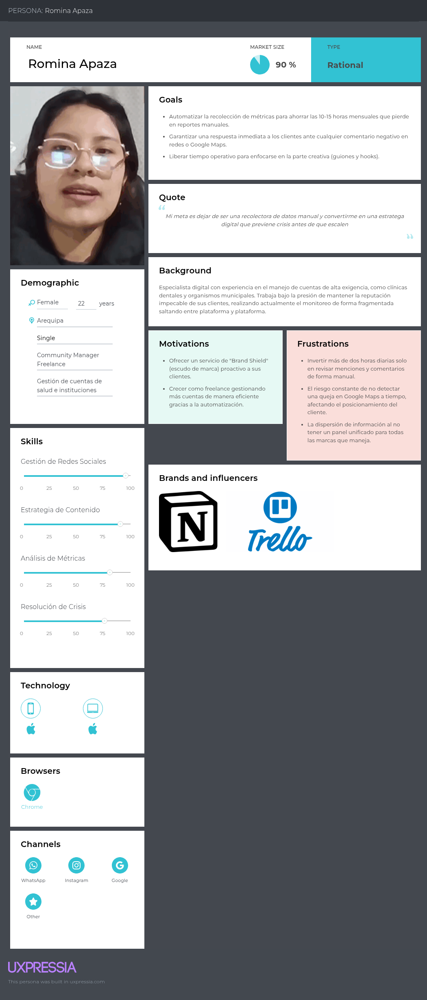

<br>

**User Persona 2 — Segmento 2: `Esteban Medina`**


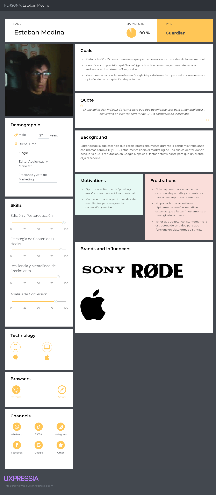

<br>

---

### 2.3.2. User Task Matrix

>*La siguiente matriz identifica las tareas principales que realizan los dos User Personas definidos: dueños de PyMEs y account managers de agencias digitales. Estas tareas se evalúan según su frecuencia de ejecución y su nivel de importancia dentro del flujo de trabajo.*

<br>

| Tarea (Task) | `PyMe (Dueño de negocio)` Frecuencia | `PyMe` Importancia | `Agencia (Account Manager)` Frecuencia | `Agencia` Importancia |
|:-------------|:------------------------:|:-------------------------:|:------------------------:|:-------------------------:|
| *Revisar menciones de la marca* | Media | Alta | Alta | Alta |
| *Detectar comentarios negativos* | Baja | Alta | Alta | Alta |
| *Responder a reseñas/comentarios* | Media | Alta | Alta | Alta |
| *Generar reportes de reputación* | Baja | Media | Alta | Alta |
| *Monitorear múltiples plataformas* | Baja | Media | Alta | Alta |

<br>

A partir de la matriz se observa que:

- Para las PyMEs, las tareas no se realizan con alta frecuencia; sin embargo, tienen un alto nivel de importancia, especialmente aquellas relacionadas con la detección de comentarios negativos y la gestión de la reputación.
- Para las agencias, las tareas son altamente frecuentes y críticas, debido a la gestión simultánea de múltiples marcas y clientes.
- Existe una coincidencia clave entre ambos segmentos: la alta importancia de la detección de comentarios negativos y el monitoreo de la reputación digital, lo que valida directamente el enfoque de BrandRadar como solución centralizada de monitoreo.

<br>

---

### 2.3.3. User Journey Mapping
>*El Customer Journey presentado ilustra el recorrido end-to-end actual (versión As-Is) que siguen los usuarios objetivo (dueños de PyMEs y especialistas de marketing) al gestionar la reputación digital de sus marcas. Este journey describe las etapas desde la toma de conciencia de la falta de control sobre las opiniones en línea, pasando por la búsqueda y adopción de soluciones, hasta el uso continuo de herramientas para monitorear menciones y responder a comentarios.
En el contexto actual, gran parte de estas actividades se realiza de forma manual y en múltiples plataformas, lo que genera retrasos en la detección de problemas, sobrecarga operativa y dificultades para obtener una visión integrada del estado de la reputación digital.
Este recorrido permite identificar puntos de fricción, emociones asociadas a cada etapa y oportunidades de mejora clave, las cuales fundamentan el diseño de la solución propuesta.*

<br>

**User Journey Map — `PyMEs`**

<br>

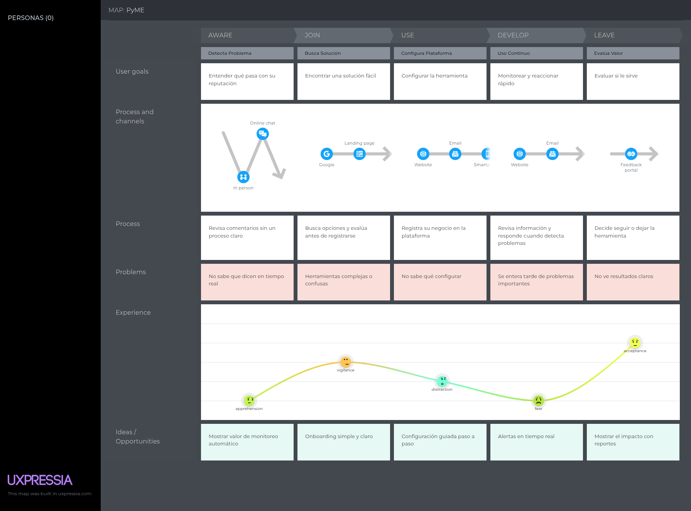

<br>

**User Journey Map — `Agencia(Account Manager)`**

<br>


<br>

---

### 2.3.4. Empathy Mapping

>*El Empathy Mapping fue elaborado a partir del análisis de las entrevistas realizadas a los dos segmentos objetivo: dueños de PyMEs y account managers de agencias digitales. Este proceso permitió sintetizar la información cualitativa recolectada, identificando patrones de comportamiento, pensamientos, emociones, necesidades y frustraciones de los usuarios.*

<br>

**Empathy Map — `PyMEs`**


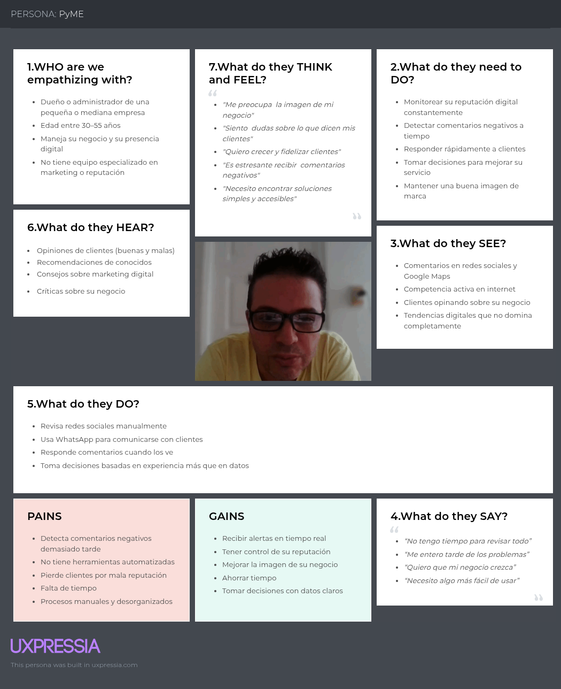

<br>

**Empathy Map — `Agencia(Account Manager)`**


<br>

---

## 2.4. Big Picture Event Storming

<br>

El proceso de Big Picture Event Storming se llevó a cabo con el objetivo de comprender de manera integral el flujo del dominio del sistema propuesto, identificando los principales eventos, actores involucrados e interacciones con sistemas externos. Esta técnica permitió visualizar el comportamiento del sistema de forma cronológica, facilitando la identificación de procesos clave, dependencias y posibles puntos de mejora dentro del flujo operativo.

Durante el desarrollo del Event Storming, se siguieron etapas estructuradas que permitieron construir progresivamente una representación clara del dominio del problema. En la primera etapa, denominada Collect Domain Events, se identificaron los principales eventos del sistema, los cuales representan acciones que ya han ocurrido dentro del flujo del negocio.

<br>

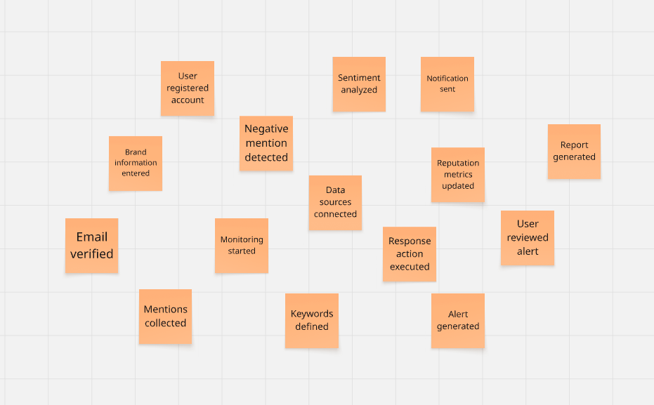

<br>

Posteriormente, en la etapa *Refine Domain Events*, se revisaron los eventos previamente identificados con el fin de validar su correcta redacción en tiempo pasado, asegurar su orden temporal y depurar posibles redundancias o inconsistencias terminológicas. Asimismo, se incorporaron eventos adicionales necesarios para completar el flujo lógico del sistema y representar con mayor precisión los procesos internos del dominio.
<br>

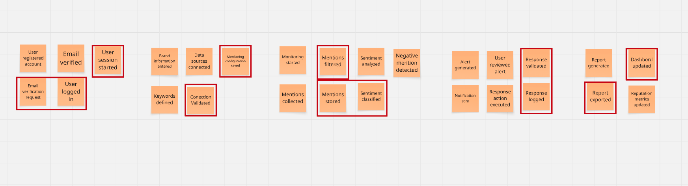

<br>

En la etapa *Track Causes*, se identificaron los actores que interactúan con el sistema, así como las acciones específicas que desencadenan determinados eventos, representadas mediante comandos. Asimismo, se incorporaron los sistemas externos que intervienen en el flujo, como servicios de análisis de sentimiento y plataformas de datos externas, además de los procesos internos que se ejecutan de manera automática entre eventos.

<br>

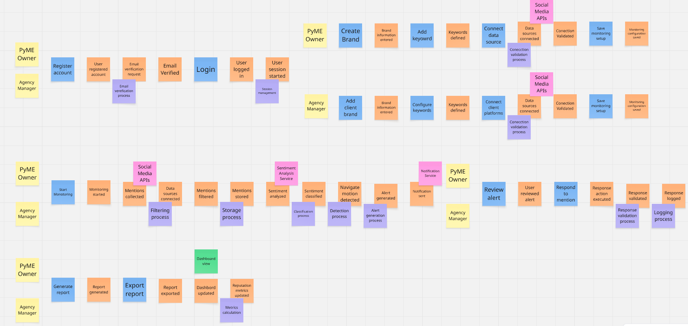

<br>

Finalmente, en la etapa *Find Aggregates*, se agruparon los eventos relacionados dentro de límites de consistencia conocidos como aggregates, lo que permitió identificar las principales entidades del dominio y sus responsabilidades. Esta etapa facilitó la estructuración del modelo de dominio y sirvió como base para el diseño posterior del sistema.

<br>

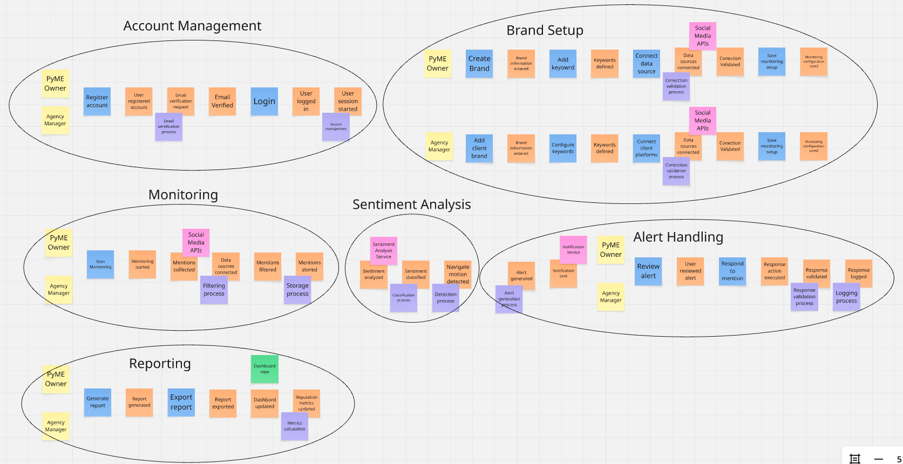

<br>

Durante el desarrollo del Big Picture Event Storming se identificaron los principales eventos del dominio, los actores que interactúan con el sistema y los flujos que describen el comportamiento general del sistema, desde el registro del usuario hasta la generación de reportes de reputación digital.

En primer lugar, se definieron los eventos del dominio, los cuales representan cambios significativos dentro del sistema y describen acciones ya completadas en tiempo pasado. Entre los eventos identificados se incluyen aquellos relacionados con la gestión de cuentas, como el registro de usuario, la verificación de correo electrónico y el inicio de sesión. Estos eventos marcan el inicio del flujo del sistema y habilitan el acceso del usuario a las funcionalidades principales.

Posteriormente, se identificaron eventos asociados a la configuración de marcas y fuentes de datos, como el registro de información de la marca, la definición de palabras clave y la conexión con fuentes externas. Estos eventos resultan fundamentales para iniciar el proceso de monitoreo y habilitar la recolección de información desde distintas plataformas digitales.

Asimismo, se reconocieron eventos vinculados al proceso de monitoreo automático, en el cual el sistema recolecta menciones desde fuentes externas, las filtra y las almacena para su análisis. En esta etapa se incluyen también los eventos de análisis de sentimiento, donde las menciones son clasificadas según su polaridad, permitiendo identificar posibles riesgos reputacionales.

Dentro del flujo del sistema, también se identificaron eventos relacionados con la gestión de alertas, donde el sistema genera notificaciones ante la detección de menciones negativas. Estas alertas son revisadas por los usuarios, quienes pueden ejecutar acciones de respuesta según la criticidad del caso.

Finalmente, se identificaron eventos correspondientes a la generación de reportes y visualización de métricas, donde el sistema permite crear informes, exportar resultados y actualizar dashboards con indicadores clave. Estos eventos facilitan la evaluación del desempeño de la marca y la toma de decisiones basadas en datos.

En cuanto a los actores identificados, se reconocen principalmente dos roles: el PyME Owner, responsable de la gestión directa de su marca, y el Agency Manager, encargado de administrar múltiples cuentas de clientes. Ambos interactúan con el sistema mediante acciones como la configuración de marcas, la revisión de alertas y la generación de reportes. Asimismo, se identificaron sistemas externos como redes sociales, servicios de análisis de sentimiento y servicios de notificación, los cuales alimentan el sistema con datos y permiten la interacción con los usuarios.

Los flujos del sistema describen el recorrido end-to-end desde el registro inicial hasta la generación de reportes finales, permitiendo visualizar cómo se encadenan los eventos y cómo interactúan los distintos actores y sistemas externos. Este análisis permitió identificar dependencias críticas, automatizaciones potenciales y puntos de mejora dentro del sistema.

En conjunto, la identificación de eventos, actores y flujos permitió construir una representación estructurada del dominio del problema, sirviendo como base para la definición de agregados y el diseño del modelo de dominio.

<br>

---

## 2.5. Ubiquitous Language

> *El Ubiquitous Language es un glosario de términos clave del dominio del negocio que busca unificar el significado de los conceptos utilizados por todos los involucrados en el proyecto. Su objetivo es evitar ambigüedades y asegurar una comunicación clara y consistente entre el equipo técnico y el área de negocio. En esta sección, se definen los principales términos del sistema en inglés, acompañados de su definición en español dentro del contexto del proyecto.*

<br>

| Término (EN) | Término (ES) | Definición |
|:-------------|:-------------|:-----------|
| `User` | Usuario | Persona que interactúa con el sistema para gestionar la reputación digital de una o más marcas |
| `PyME Owner` | Dueño de PyME | Usuario que gestiona la reputación digital de su propia marca |
| `Community Manager` | Especialista de marketing y comunidades | Usuario que administra múltiples marcas de distintos clientes |
| `Account` | Cuenta | Identidad del usuario dentro del sistema que permite autenticación y acceso |
| `Session` | Sesión | Estado activo de un usuario autenticado en el sistema |
| `Brand` | Marca | Empresa o negocio cuya reputación digital es monitoreada |
| `Keyword` | Palabra clave | Término definido para identificar menciones relacionadas con una marca |
| `Data Source` | Fuente de datos | Plataforma externa desde donde se obtienen menciones (redes sociales, APIs, etc.) |
| `Connection` | Conexión | Integración establecida entre el sistema y una fuente de datos |
| `Monitoring` | Monitoreo | Proceso automático y continuo de recolección de menciones |
| `Mention` | Mención | Contenido externo que hace referencia a una marca |
| `Filtered Mention` | Mención filtrada | Mención que cumple con los criterios definidos (keywords, reglas, etc.) |
| `Stored Mention` | Mención almacenada | Mención guardada en el sistema para su análisis posterior |
| `Sentiment` | Sentimiento | Clasificación de una mención (positivo, negativo o neutro) |
| `Sentiment Analysis` | Análisis de sentimiento | Proceso de evaluación del contenido de una mención |
| `Negative Mention` | Mención negativa | Mención clasificada con sentimiento negativo |
| `Alert` | Alerta | Evento generado cuando se detecta una mención relevante o negativa |
| `Notification` | Notificación | Mensaje enviado al usuario para informar sobre una alerta |
| `Alert Review` | Revisión de alerta | Proceso en el cual el usuario evalúa una alerta generada |
| `Response` | Respuesta | Acción tomada por el usuario frente a una mención o alerta |
| `Response Action` | Acción de respuesta | Ejecución específica realizada para gestionar una mención |
| `Response Validation` | Validación de respuesta | Proceso de verificación de la acción tomada por el usuario |
| `Response Log` | Registro de respuesta | Historial de acciones realizadas sobre menciones |
| `Report` | Reporte | Documento generado con resultados del monitoreo |
| `Report Export` | Exportación de reporte | Proceso de descarga o generación externa del reporte |
| `Dashboard` | Panel de control | Interfaz visual con métricas e indicadores de reputación |
| `Reputation Metrics` | Métricas de reputación | Indicadores calculados a partir de las menciones analizadas |
| `Monitoring Configuration` | Configuración de monitoreo | Parámetros definidos para ejecutar el monitoreo |
| `Insight` | Hallazgo | Información relevante derivada del análisis de datos |
| `External API` | API externa | Servicio externo utilizado para obtener datos o procesarlos |
| `Sentiment Service` | Servicio de sentimiento | Sistema externo que clasifica el sentimiento de las menciones |

<br>

---

<div align="center">

# Capítulo III: Requirements Specification

</div>


## 3.1. User Stories

>*Las User Stories de BrandRadar expresan las necesidades reales de los usuarios en su propio lenguaje, describiendo qué requieren del sistema y por qué es importante para ellos. Cada historia traduce un requerimiento de negocio en una funcionalidad concreta, manteniendo el foco en el valor que aporta al usuario. En esta sección, las historias se organizan en Epics, lo que permite estructurar el alcance del producto y priorizar el desarrollo de las funcionalidades más relevantes. Los criterios de aceptación se redactan en tiempo presente y tercera persona, sin referencias a detalles de interfaz, siguiendo la estructura Gherkin (Given / When / Then).*

<br>

| Epic / Story ID | Título | Descripción | Criterios de Aceptación | Relacionado con (Epic ID) |
|:---------------:|:------:|:------------|:------------------------|:-------------------------:|
| **EP01** | `Real-Time Monitoring & Data Collection` | Sistema de recolección automatizada de datos desde redes sociales y fuentes digitales. | — | — |
| US01 | `Integración de APIs Externas` | Como `Analista`, quiero `conectar APIs de Twitter e Instagram`, para `recolectar menciones automáticamente`. | **Scenario 1:** Vínculo exitoso. **Given** credenciales válidas **When** se conecta la API **Then** inicia la sincronización. <br> **Scenario 2:** Token expirado. **Given** una conexión previa **When** el token vence **Then** el sistema pide re-autenticación. | EP01 |
| US02 | `Filtrado de Exclusión` | Como `Emprendedor`, quiero `excluir keywords irrelevantes`, para `evitar ruido de marcas homónimas`. | **Scenario 1:** Filtro activo. **Given** ruido de homónimos **When** se añade la palabra al "Blacklist" **Then** el feed se limpia. <br> **Scenario 2:** Validación. **Given** intento de keyword vacía **When** se guarda **Then** muestra error de campo obligatorio. | EP01 |
| US03 | `Live Feed Monitor` | Como `Community Manager`, quiero `ver un feed en vivo`, para `reaccionar de inmediato`. | **Scenario 1:** Update dinámico. **Given** dashboard abierto **When** entra mención **Then** aparece al inicio sin recargar. <br> **Scenario 2:** Pausa de flujo. **Given** alto volumen **When** se presiona "Pausa" **Then** el feed se detiene para lectura. | EP01 |
| US04 | `Implementación de Webhooks` | Como `Desarrollador`, quiero `usar Webhooks`, para `reducir la latencia de alertas`. | **Scenario 1:** Registro. **Given** URL de escucha **When** se registra en el panel **Then** el sistema envía un JSON de prueba. <br> **Scenario 2:** Reintento. **Given** server destino caído **When** falla el envío **Then** el sistema reintenta 3 veces. | EP01 |
| **EP02** | `AI Sentiment Analysis` | Módulo de procesamiento de lenguaje natural para categorizar el tono emocional. | — | — |
| US05 | `Detección de Sarcasmo e Ironía` | Como `Gerente`, quiero `identificar sarcasmo`, para `evitar falsos positivos`. | **Scenario 1:** Tono irónico. **Given** frase "Excelente demora" **When** la IA procesa **Then** clasifica como "Negativo". <br> **Scenario 2:** Confianza baja. **Given** frase ambigua **When** IA duda **Then** etiqueta como "Para revisión manual". | EP02 |
| US06 | `Ajuste Manual de Polaridad` | Como `Analista`, quiero `corregir la polaridad manualmente`, para `entrenar mejor a la IA`. | **Scenario 1:** Corrección. **Given** mención mal clasificada **When** se cambia a "Negativo" **Then** se actualiza el dashboard. <br> **Scenario 2:** Log de cambios. **Given** una edición **When** se guarda **Then** registra qué usuario hizo el cambio. | EP02 |
| US07 | `Entrenamiento de Modelos por Industria` | Como `Administrador`, quiero `entrenar la IA con vocabulario específico`, para `mejorar la precisión según el rubro del cliente`. | **Scenario 1:** Cambio de contexto. **Given** sector "Hospitalidad" **When** detecta palabra "limpieza" **Then** le asigna un peso mayor en satisfacción. <br> **Scenario 2:** Glosario custom. **Given** términos técnicos **When** se suben al modelo **Then** deja de marcarlos como errores. | EP02 |
| US08 | `Word Cloud de Sentimiento` | Como `Usuario`, quiero `ver nubes de palabras por sentimiento`, para `identificar temas críticos`. | **Scenario 1:** Filtro negativo. **Given** filtro "Negativo" activo **When** carga nube **Then** muestra términos de queja más frecuentes. <br> **Scenario 2:** Drill-down. **Given** una palabra en la nube **When** se clickea **Then** muestra los posts que la contienen. | EP02 |
| **EP03** | `Crisis Management & Alerts` | Herramientas de detección temprana y protocolos ante incidentes reputacionales. | — | — |
| US09 | `Configuración de Semáforo de Crisis` | Como `Jefe de PR`, quiero `un semáforo configurable`, para `saber cuándo intervenir legalmente`. | **Scenario 1:** Alerta Roja. **Given** umbral de 50 quejas/hora **When** se alcanza **Then** el dashboard se pone rojo. <br> **Scenario 2:** Personalización. **Given** ajustes de alerta **When** se cambia el límite **Then** el sistema aplica la nueva regla. | EP03 |
| US10 | `Alertas Multicanal en Móvil` | Como `Usuario`, quiero `alertas móviles`, para `estar enterado fuera de la oficina`. | **Scenario 1:** Notificación móvil. **Given** crisis detectada **When** usuario vinculado **Then** llega mensaje instantáneo con link. <br> **Scenario 2:** Silent mode. **Given** horario nocturno **When** llega alerta no crítica **Then** el sistema la encola para la mañana. | EP03 |
| US11 | `Asignación de Tickets de Respuesta` | Como `Soporte`, quiero `asignar menciones a miembros del equipo`, para `gestión inmediata`. | **Scenario 1:** Derivación. **Given** queja crítica **When** se asigna a un agente **Then** este recibe notificación de tarea. <br> **Scenario 2:** Cierre de ticket. **Given** ticket resuelto **When** se marca "Finalizado" **Then** sale del flujo de pendientes. | EP03 |
| **EP04** | `Competitive Intelligence` | Análisis comparativo frente a competidores directos. | — | — |
| US12 | `Share of Sentiment` | Como `Gerente`, quiero `ver mi sentimiento vs competencia`, para `saber mi posición en el mercado`. | **Scenario 1:** Gráfico barras. **Given** 2 competidores **When** se genera reporte **Then** muestra ratio comparativo de positividad. <br> **Scenario 2:** Exportación. **Given** gráfico listo **When** se descarga **Then** genera un PNG de alta calidad. | EP04 |
| US13 | `Rastreo de Hashtags Competidores` | Como `Analista`, quiero `monitorear hashtags de competencia`, para `entender sus estrategias`. | **Scenario 1:** Monitor campaña. **Given** hashtag nuevo de competencia **When** se añade **Then** inicia medición de volumen. <br> **Scenario 2:** Alerta viral. **Given** hashtag competidor **When** crece 200% **Then** notifica "Campaña Viral Detectada". | EP04 |
| **EP05** | `Advanced Analytics & Reporting` | Generación de reportes y filtrado profundo de datos. | — | — |
| US14 | `Reportes PDF Programados` | Como `Ejecutivo`, quiero `reportes semanales automáticos`, para `ahorrar tiempo de gestión`. | **Scenario 1:** Envío lunes. **Given** Lunes 8am **When** cronjob corre **Then** envía PDF por correo. <br> **Scenario 2:** Error log. **Given** fallo en PDF **When** falla envío **Then** reintenta en 1 hora y avisa al admin. | EP05 |
| US15 | `Filtro por Alcance (Influencers)` | Como `Usuario`, quiero `filtrar por número de seguidores`, para `priorizar respuestas críticas`. | **Scenario 1:** Filtro 10k. **Given** feed lleno **When** se filtra ">10k fans" **Then** solo muestra cuentas influyentes. <br> **Scenario 2:** Badge dorado. **Given** mención nueva **When** autor tiene >50k fans **Then** marca el post con icono especial. | EP05 |
| US16 | `Heatmap Horario` | Como `Estratega`, quiero `ver horas pico de quejas`, para `ajustar turnos de moderación`. | **Scenario 1:** Generación mapa. **Given** data de 30 días **When** se abre "Insights" **Then** muestra cuadrícula 24/7 de calor. <br> **Scenario 2:** Filtro finde. **Given** heatmap mensual **When** se marca "Sáb/Dom" **Then** actualiza solo para esos días. | EP05 |
| US17 | `Exportación CSV/JSON` | Como `Admin`, quiero `exportar data cruda`, para `análisis en Power BI`. | **Scenario 1:** Exportación. **Given** rango fechas **When** se presiona "Exportar" **Then** descarga CSV con todos los campos. <br> **Scenario 2:** Fondo. **Given** data masiva **When** se exporta **Then** procesa en background y avisa al terminar. | EP05 |
| **EP06** | `User Experience & Collaboration` | Gestión de interfaz, flujos internos y acceso multiplataforma. | — | — |
| US18 | `Onboarding Interactivo` | Como `Usuario nuevo`, quiero `un tutorial guiado`, para `configurar el sistema sin soporte`. | **Scenario 1:** Inicio tour. **Given** login #1 **When** entra dashboard **Then** resalta botones clave con explicación. <br> **Scenario 2:** Skip. **Given** tour activo **When** presiona "Omitir" **Then** cierra tutorial y no vuelve a aparecer. | EP06 |
| US19 | `Notas Internas` | Como `Líder`, quiero `dejar comentarios en menciones`, para `coordinar respuestas con el equipo`. | **Scenario 1:** Nota privada. **Given** mención crítica **When** líder comenta **Then** solo el equipo interno ve la nota. <br> **Scenario 2:** Mención @usuario. **Given** nota interna **When** se usa @nombre **Then** el usuario recibe alerta de mención. | EP06 |
| US20 | `Selector de Workspaces` | Como `Agencia`, quiero `cambiar entre marcas`, para `mantener datos separados`. | **Scenario 1:** Cambio marca. **Given** 2 clientes **When** cambia en el menú lateral **Then** carga métricas de la nueva marca. <br> **Scenario 2:** Independencia. **Given** 2 workspaces **When** cambia keyword en uno **Then** el otro no se ve afectado. | EP06 |
| US21 | `Interfaz Responsiva` | Como `Usuario móvil`, quiero `un diseño adaptable`, para `monitorear desde el celular`. | **Scenario 1:** Vista móvil. **Given** resolución smartphone **When** carga web **Then** los gráficos se apilan verticalmente. <br> **Scenario 2:** Touch target. **Given** interfaz móvil **When** hay botones de acción **Then** tienen tamaño mín de 44px para dedos. | EP06 |
| **EP07** | `Industry-Specific Branding & Social Evidence` | Funcionalidades diseñadas para la gestión de imagen comercial y validación social. | — | — |
| US22 | `Galería de Casos de Éxito` | Como `Gerente de Muebles`, quiero `subir fotos de problemas resueltos`, para `mejorar mi imagen ante clientes`. | **Scenario 1:** Subir evidencia. **Given** caso cerrado **When** sube foto de solución **Then** se añade a la galería pública. <br> **Scenario 2:** Tagging. **Given** foto nueva **When** se etiqueta como "Retail" **Then** aparece en el filtro de ese sector. | EP07 |
| US23 | `Archivo Visual de Campañas` | Como `Dueña de Boutique`, quiero `guardar snapshots de mis redes en fechas de alta venta`, para `replicar el éxito el próximo año`. | **Scenario 1:** Snapshot estacional. **Given** campaña finalizada **When** presiona "Guardar Snapshot" **Then** captura el estado visual del feed. <br> **Scenario 2:** Comparativa anual. **Given** campaña actual **When** compara con archivo previo **Then** indica variaciones en la recepción. | EP07 |
| US24 | `Sugerencia de Respuestas Empáticas` | Como `Dueña de Boutique`, quiero `respuestas automáticas de cortesía`, para `atender al cliente mientras estoy ocupada`. | **Scenario 1:** Out of office. **Given** queja recibida 2am **When** bot activo **Then** responde "Estamos revisando tu caso". <br> **Scenario 2:** Desactivación. **Given** horario laboral **When** entra mención **Then** el bot se inhibe para respuesta humana. | EP07 |
| US25 | `Monitor de Voz del Cliente` | Como `Gerente Comercial`, quiero `un reporte de sugerencias de mejora de productos`, para `priorizar la fabricación de nuevos modelos`. | **Scenario 1:** Agrupación pedidos. **Given** menciones de mejora **When** IA agrupa **Then** muestra tendencias de diseño solicitadas. <br> **Scenario 2:** Feedback loop. **Given** característica nueva lanzada **When** entran menciones **Then** compara satisfacción vs anterior. | EP07 |
| **EP08** | `Multi-Platform Local SEO & Service Monitoring` | Monitoreo de reputación en plataformas de servicios y ubicación geográfica. | — | — |
| US26 | `Sincronización de Google Maps` | Como `Dueño de Cafetería`, quiero `sincronizar reseñas de Maps`, para `no enterarme tarde de quejas de servicio`. | **Scenario 1:** Pull reseñas. **Given** local vinculado **When** entra reseña 1 estrella **Then** el sistema dispara alerta inmediata. <br> **Scenario 2:** Reply direct. **Given** reseña nueva **When** usuario escribe respuesta **Then** se publica en Google Maps desde la App. | EP08 |
| US27 | `Monitor de Múltiples Sucursales` | Como `Dueño de locales`, quiero `ver datos de San Isidro y Miraflores por separado`, para `evaluar el desempeño de cada equipo`. | **Scenario 1:** Filtro local. **Given** 2 locales **When** selecciona sede **Then** muestra solo sentimientos de ese punto físico. <br> **Scenario 2:** Ranking interno. **Given** datos globales **When** abre reporte global **Then** rankea sedes por estrellas promedio. | EP08 |
| US28 | `Detección de Caída de Servicios Web` | Como `Dueño de Negocio`, quiero `alerta de inactividad de página web o pasarela`, para `no perder ventas técnicas`. | **Scenario 1:** Web Down. **Given** monitoreo URL **When** sitio devuelve error **Then** envía alerta crítica "Sitio Caído". <br> **Scenario 2:** Restore alert. **Given** web caída **When** vuelve a estar online **Then** envía confirmación de recuperación. | EP08 |
| US29 | `Monitor de Reputación de Aliados` | Como `Gerente Comercial`, quiero `monitorear menciones de mis proveedores`, para `anticipar problemas en mi cadena de suministro`. | **Scenario 1:** Alerta proveedor. **Given** proveedor en crisis **When** entra noticia negativa **Then** envía alerta "Riesgo en Suministro". <br> **Scenario 2:** Reputación aliados. **Given** lista de proveedores **When** compara sentimiento **Then** sugiere el más confiable. | EP08 |
| **EP09** | `Digital Content Strategy & Creative Analysis` | Herramientas para la optimización de contenido audiovisual y estrategias de retención. | — | — |
| US30 | `Sugerencia de Hooks Audiovisuales` | Como `Editor`, quiero `sugerencias de ganchos basados en tendencias`, para `retener audiencia en los primeros 3 segundos`. | **Scenario 1:** Analizar video. **Given** video con poco alcance **When** pide ayuda **Then** IA propone 3 ganchos tipo "Sabías que...". <br> **Scenario 2:** Comparativa hooks. **Given** 2 videos distintos **When** compara performance **Then** indica cuál retuvo más gente. | EP09 |
| US31 | `Análisis de Retención de Video` | Como `Marketer`, quiero `ver en qué segundo los usuarios dejan de ver mis videos`, para `mejorar el montaje`. | **Scenario 1:** Punto de fuga. **Given** video de TikTok **When** analiza data **Then** marca el segundo exacto de la caída de audiencia. <br> **Scenario 2:** Sugerencia edición. **Given** fuga detectada **When** pide mejora **Then** sugiere cambios de plano o textos dinámicos. | EP09 |
| US32 | `Benchmarking de Hooks Competidores` | Como `Editor`, quiero `saber qué ganchos usa la competencia`, para `diferenciar mi contenido`. | **Scenario 1:** Análisis viral. **Given** video externo viral **When** IA analiza audio **Then** extrae el hook utilizado. <br> **Scenario 2:** Reporte originalidad. **Given** guion nuevo **When** compara con sector **Then** indica si el gancho es cliché. | EP09 |
| US33 | `Tracking de Conversión (ROI)` | Como `Jefe de Marketing`, quiero `conectar clics en menciones con ventas reales`, para `medir el retorno de inversión`. | **Scenario 1:** UTM Tracking. **Given** link de respuesta **When** cliente compra **Then** el dashboard marca "Conversión Exitosa". <br> **Scenario 2:** Reporte ROI. **Given** campaña de mes **When** genera reporte **Then** indica costo por mención vs venta generada. | EP09 |
| US34 | `Integración de Métricas TikTok` | Como `Marketer`, quiero `ver visualizaciones vs comentarios de TikTok`, para `diagnosticar por qué un video no despega`. | **Scenario 1:** Ratio engagement. **Given** video posteado **When** carga data **Then** calcula % de interacción sobre vistas. <br> **Scenario 2:** Diagnóstico. **Given** bajo ratio **When** solicita análisis **Then** indica si falla el gancho o el contenido. | EP09 |
| US35 | `Identificación de Influencers de Nicho` | Como `Socio`, quiero `identificar profesionales influyentes en mi rubro`, para `proponer alianzas`. | **Scenario 1:** Ranking sectorial. **Given** keywords nicho **When** analiza autores **Then** muestra ranking de los más seguidos. <br> **Scenario 2:** Contact info. **Given** perfil identificado **When** se clickea **Then** muestra enlaces a perfiles profesionales. | EP09 |
| **EP10** | `Public Governance & Crisis Simulation` | Gestión de comunidades municipales y simulación de escenarios críticos. | — | — |
| US36 | `Detección de Trending Topics Locales` | Como `Gestora Municipal`, quiero `saber qué temas preocupan a los vecinos por distrito`, para `orientar la comunicación oficial`. | **Scenario 1:** Top temas. **Given** ubicación específica **When** analiza menciones locales **Then** reporta temas críticos (ej. Inseguridad). <br> **Scenario 2:** Sentimiento por barrio. **Given** data distrital **When** filtra por zona **Then** muestra barrios con más quejas. | EP10 |
| US37 | `Análisis de Campaña Política` | Como `Freelance en política`, quiero `monitorear menciones de candidatos`, para `gestionar comunidades municipales`. | **Scenario 1:** Tracking apoyo. **Given** keyword candidato **When** entra mención **Then** clasifica si es apoyo o denuncia. <br> **Scenario 2:** Reporte de vecinos. **Given** menciones territoriales **When** genera reporte **Then** agrupa quejas por necesidades ciudadanas. | EP10 |
| US38 | `Simulador de Impacto de Comunicado` | Como `Gerente de PR`, quiero `predecir la reacción a un comunicado`, para `evitar empeorar la crisis`. | **Scenario 1:** Test de respuesta. **Given** borrador comunicado **When** pasa por simulador **Then** indica probabilidad de aceptación. <br> **Scenario 2:** Red flags. **Given** texto respuesta **When** contiene lenguaje agresivo **Then** resalta palabras y sugiere cambios. | EP10 |
| US39 | `Histórico de Resoluciones de Crisis` | Como `Jefe de PR`, quiero `ver cómo se resolvieron crisis similares en el pasado`, para `no repetir errores`. | **Scenario 1:** Búsqueda histórica. **Given** crisis nueva **When** busca casos similares **Then** muestra el protocolo usado anteriormente. <br> **Scenario 2:** Base de conocimiento. **Given** caso cerrado **When** se añade "Lección" **Then** se guarda en la Wiki del equipo. | EP10 |
| US40 | `Dashboard de Tiempo de Respuesta Operativo` | Como `Freelance`, quiero `medir mi tiempo de respuesta`, para `cumplir con KPIs de atención`. | **Scenario 1:** Tiempo promedio. **Given** respuestas del día **When** abre reporte **Then** muestra media de minutos por respuesta. <br> **Scenario 2:** Alerta demora. **Given** mención sin respuesta **When** pasa el tiempo límite **Then** lanza recordatorio de atención. | EP10 |
| **EP11** | `Sales & Lead Management` | Herramientas para la detección de oportunidades de venta y competencia comercial. | — | — |
| US41 | `Identificación de Leads Calientes` | Como `Vendedora`, quiero `detectar usuarios que preguntan por precios/tallas`, para `priorizar su atención inmediata`. | **Scenario 1:** Tagging automático. **Given** comentario "¿Precio?" **When** entra al sistema **Then** le asigna etiqueta "Lead Caliente". <br> **Scenario 2:** Alerta venta. **Given** lead identificado **When** no se responde en 5 min **Then** lanza alerta push sonora. | EP11 |
| US42 | `Sugerencia de Scripts de Venta` | Como `Usuario de WhatsApp`, quiero `sugerencias de frases para cerrar ventas`, para `evitar carritos abandonados`. | **Scenario 1:** Sugerencia cierre. **Given** chat estancado **When** pide ayuda **Then** IA sugiere frases de escasez o urgencia. <br> **Scenario 2:** A/B Testing frases. **Given** 2 tipos de cierre **When** analiza ventas finalizadas **Then** indica cuál convierte más. | EP11 |
| US43 | `Detección de Competencia Desleal (Market)` | Como `Dueño de Negocio`, quiero `alerta de precios/ofertas agresivas de competidores`, para `ajustar mi estrategia`. | **Scenario 1:** Price drop alert. **Given** monitor competencia **When** detecta post con ofertas 50% menores **Then** envía alerta. <br> **Scenario 2:** Comparativa stock. **Given** post competencia **When** IA analiza **Then** indica si compite con mi producto estrella. | EP11 |
| **EP12** | `Customer Loyalty & Success` | Módulo de fidelización y métricas de satisfacción a largo plazo. | — | — |
| US44 | `Fidelización de Clientes VIP` | Como `Gerente de Cafetería`, quiero `identificar clientes frecuentes que dejan reseñas`, para `ofrecerles compensaciones`. | **Scenario 1:** Identificar fan. **Given** usuario recurrente **When** publica reseña **Then** el sistema lo marca como "Cliente VIP". <br> **Scenario 2:** Cupón automático. **Given** reseña positiva de VIP **When** se aprueba respuesta **Then** envía código de descuento. | EP12 |
| US45 | `Sentimiento de Atención (Personal)` | Como `Gerente`, quiero `monitorear menciones sobre el trato de mis empleados`, para `gestionar capacitaciones`. | **Scenario 1:** Detección de nombre. **Given** reseña con nombre de empleado **When** detecta el patrón **Then** vincula la queja al legajo digital del staff. <br> **Scenario 2:** Tendencia trato. **Given** datos mensuales **When** genera reporte RRHH **Then** indica si las quejas son por actitud o lentitud. | EP12 |
| US46 | `KPI de Retención Mensual de Clientes` | Como `Administrador`, quiero `ver cuántos clientes vuelven a dejar reseñas positivas`, para `medir la fidelización`. | **Scenario 1:** Tasa de retorno. **Given** historial anual **When** genera KPI **Then** indica el % de usuarios recurrentes. <br> **Scenario 2:** Churn reputacional. **Given** usuarios que antes eran positivos y ahora son negativos **When** detecta el cambio **Then** alerta sobre "Riesgo de pérdida de cliente". | EP12 |

<br>

---

## 3.2. Impact Mapping

>*El Impact Mapping de BrandRadar vincula el objetivo central del producto —lograr la conversión y fidelización mediante el monitoreo de reputación e infraestructura— con las necesidades de Alfredo Negrete y Romina Apaza.*
<br>

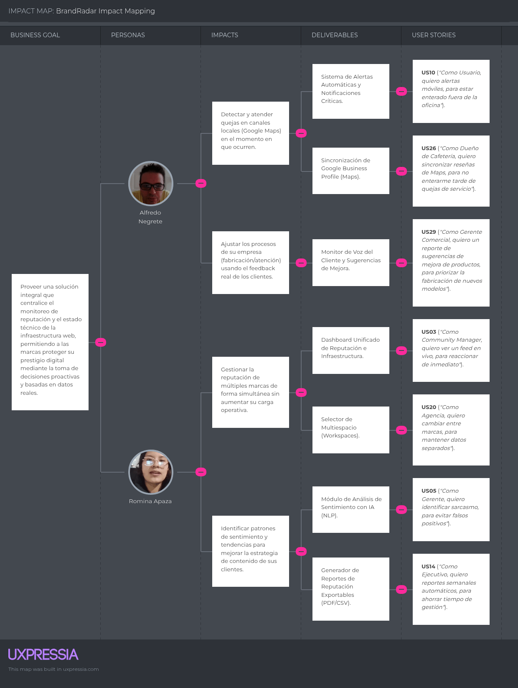

<br>

Para Alfredo Negrete, el sistema no solo facilita la detección de quejas, sino que transforma el feedback en oportunidades de venta directa mediante la identificación de leads calientes y scripts de cierre.

Para Romina Apaza, la solución elimina la carga operativa del monitoreo manual y le otorga capacidad analítica avanzada, permitiéndole entregar valor estratégico a través de KPIs de retención mensual y métricas de conversión real (ROI).

Estos impactos se materializan en entregables como el motor de IA con entrenamiento por industria, módulos de SEO local sincronizados con Google Maps y herramientas de análisis creativo para redes sociales, asegurando una trazabilidad total con las 46 historias de usuario del backlog.

<br>

---

## 3.3. Product Backlog

>*El Product Backlog de BrandRadar consolida el conjunto de funcionalidades priorizadas que guían el desarrollo del producto. Cada historia de usuario está estimada en Story Points y ordenada según su valor estratégico, lo que permite planificar iteraciones de forma incremental y realista. El backlog abarca cinco áreas principales: monitoreo de redes sociales, análisis de sentimiento mediante inteligencia artificial, gestión de reputación digital, generación de reportes y exportación de datos, y herramientas de respuesta y colaboración. En conjunto, el backlog está compuesto por 45 historias de usuario, distribuidas según su nivel de complejidad y prioridad.*

<br>


| # Orden | Story ID | Título | Descripción | Story Points |
|:-------:|:--------:|:-------|:------------|:------------:|
| 1 | US01 | Integración de APIs Externas | Como `Analista`, quiero `conectar APIs de Twitter e Instagram`, para `recolectar menciones automáticamente`. | 8 |
| 2 | US02 | Filtrado de Exclusión | Como `Emprendedor`, quiero `excluir keywords irrelevantes`, para `evitar ruido de marcas homónimas`. | 3 |
| 3 | US03 | Live Feed Monitor | Como `Community Manager`, quiero `ver un feed en vivo`, para `reaccionar de inmediato`. | 5 |
| 4 | US04 | Implementación de Webhooks | Como `Desarrollador`, quiero `usar Webhooks`, para `reducir la latencia de alertas`. | 8 |
| 5 | US05 | Detección de Sarcasmo e Ironía | Como `Gerente`, quiero `identificar sarcasmo`, para `evitar falsos positivos`. | 13 |
| 6 | US06 | Ajuste Manual de Polaridad | Como `Analista`, quiero `corregir la polaridad manualmente`, para `entrenar mejor a la IA`. | 3 |
| 7 | US07 | Entrenamiento de Modelos por Industria | Como `Administrador`, quiero `entrenar la IA con vocabulario específico`, para `mejorar la precisión según el rubro del cliente`. | 8 |
| 8 | US08 | Visualización de Word Cloud | Como `Usuario`, quiero `ver nubes de palabras por sentimiento`, para `identificar temas críticos`. | 5 |
| 9 | US09 | Configuración de Semáforo de Crisis | Como `Jefe de PR`, quiero `un semáforo configurable`, para `saber cuándo intervenir legalmente`. | 5 |
| 10 | US10 | Alertas Multicanal en Móvil | Como `Usuario`, quiero `alertas móviles`, para `estar enterado fuera de la oficina`. | 5 |
| 11 | US11 | Asignación de Tickets de Respuesta | Como `Soporte`, quiero `asignar menciones a miembros del equipo`, para `gestión inmediata`. | 5 |
| 12 | US12 | Share of Sentiment | Como `Gerente`, quiero `ver mi sentimiento vs competencia`, para `saber mi posición en el mercado`. | 8 |
| 13 | US13 | Rastreo de Hashtags Competidores | Como `Analista`, quiero `monitorear hashtags de competencia`, para `entender sus estrategias`. | 5 |
| 14 | US14 | Reportes PDF Programados | Como `Ejecutivo`, quiero `reportes semanales automáticos`, para `ahorrar tiempo de gestión`. | 8 |
| 15 | US15 | Filtro por Alcance (Influencers) | Como `Usuario`, quiero `filtrar por número de seguidores`, para `priorizar respuestas críticas`. | 3 |
| 16 | US16 | Heatmap Horario | Como `Estratega`, quiero `ver horas pico de quejas`, para `ajustar turnos de moderación`. | 5 |
| 17 | US17 | Exportación CSV/JSON | Como `Admin`, quiero `exportar data cruda`, para `análisis en Power BI`. | 3 |
| 18 | US18 | Onboarding Interactivo | Como `Usuario nuevo`, quiero `un tutorial guiado`, para `configurar el sistema sin soporte`. | 5 |
| 19 | US19 | Notas Internas | Como `Líder`, quiero `dejar comentarios en menciones`, para `coordinar respuestas con el equipo`. | 3 |
| 20 | US20 | Selector de Workspaces | Como `Agencia`, quiero `cambiar entre marcas`, para `mantener datos separados`. | 5 |
| 21 | US21 | Interfaz Responsiva | Como `Usuario móvil`, quiero `un diseño adaptable`, para `monitorear desde el celular`. | 8 |
| 22 | US22 | Galería de Casos de Éxito | Como `Gerente de Muebles`, quiero `subir fotos de problemas resueltos`, para `mejorar mi imagen ante clientes`. | 5 |
| 23 | US23 | Archivo Visual de Campañas | Como `Dueña de Boutique`, quiero `guardar snapshots de mis redes en fechas de alta venta`, para `replicar el éxito el próximo año`. | 5 |
| 24 | US24 | Sugerencia de Respuestas Empáticas | Como `Dueña de Boutique`, quiero `respuestas automáticas de cortesía`, para `atender al cliente mientras estoy ocupada`. | 8 |
| 25 | US25 | Monitor de Voz del Cliente | Como `Gerente Comercial`, quiero `un reporte de sugerencias de mejora de productos`, para `priorizar la fabricación de nuevos modelos`. | 8 |
| 26 | US26 | Sincronización de Google Maps | Como `Dueño de Cafetería`, quiero `sincronizar reseñas de Maps`, para `no enterarme tarde de quejas de servicio`. | 8 |
| 27 | US27 | Monitor de Múltiples Sucursales | Como `Dueño de locales`, quiero `ver datos de San Isidro y Miraflores por separado`, para `evaluar el desempeño de cada equipo`. | 5 |
| 28 | US28 | Detección de Caída de Servicios Web | Como `Dueño de Negocio`, quiero `alerta de inactividad de página web o pasarela`, para `no perder ventas técnicas`. | 5 |
| 29 | US29 | Monitor de Reputación de Aliados | Como `Gerente Comercial`, quiero `monitorear menciones de mis proveedores`, para `anticipar problemas en mi cadena de suministro`. | 5 |
| 30 | US30 | Sugerencia de Hooks Audiovisuales | Como `Editor`, quiero `sugerencias de ganchos basados en tendencias`, para `retener audiencia en los primeros 3 segundos`. | 8 |
| 31 | US31 | Análisis de Retención de Video | Como `Marketer`, quiero `ver en qué segundo los usuarios dejan de ver mis videos`, para `mejorar el montaje`. | 8 |
| 32 | US32 | Benchmarking de Hooks Competidores | Como `Editor`, quiero `saber qué ganchos usa la competencia`, para `diferenciar mi contenido`. | 5 |
| 33 | US33 | Tracking de Conversión (ROI) | Como `Jefe de Marketing`, quiero `conectar clics en menciones con ventas reales`, para `medir el retorno de inversión`. | 8 |
| 34 | US34 | Integración de Métricas TikTok | Como `Marketer`, quiero `ver visualizaciones vs comentarios de TikTok`, para `diagnosticar por qué un video no despega`. | 5 |
| 35 | US35 | Identificación de Influencers de Nicho | Como `Socio`, quiero `identificar profesionales influyentes en mi rubro`, para `proponer alianzas`. | 3 |
| 36 | US36 | Detección de Trending Topics Locales | Como `Gestora Municipal`, quiero `saber qué temas preocupan a los vecinos por distrito`, para `orientar la comunicación oficial`. | 5 |
| 37 | US37 | Análisis de Campaña Política | Como `Freelance en política`, quiero `monitorear menciones de candidatos`, para `gestionar comunidades municipales`. | 5 |
| 38 | US38 | Simulador de Impacto de Comunicado | Como `Gerente de PR`, quiero `predecir la reacción a un comunicado`, para `evitar empeorar la crisis`. | 13 |
| 39 | US39 | Histórico de Resoluciones de Crisis | Como `Jefe de PR`, quiero `ver cómo se resolvieron crisis similares en el pasado`, para `no repetir errores`. | 3 |
| 40 | US40 | Dashboard de Tiempo de Respuesta Operativo | Como `Freelance`, quiero `medir mi tiempo de respuesta`, para `cumplir con KPIs de atención`. | 5 |
| 41 | US41 | Identificación de Leads Calientes | Como `Vendedora`, quiero `detectar usuarios que preguntan por precios/tallas`, para `priorizar su atención inmediata`. | 5 |
| 42 | US42 | Sugerencia de Scripts de Venta | Como `Usuario de WhatsApp`, quiero `sugerencias de frases para cerrar ventas`, para `evitar carritos abandonados`. | 5 |
| 43 | US43 | Detección de Competencia Desleal (Market) | Como `Dueño de Negocio`, quiero `alerta de precios/ofertas agresivas de competidores`, para `ajustar mi estrategia`. | 5 |
| 44 | US44 | Fidelización de Clientes VIP | Como `Gerente de Cafetería`, quiero `identificar clientes frecuentes que dejan reseñas`, para `ofrecerles compensaciones`. | 3 |
| 45 | US45 | Sentimiento de Atención (Personal) | Como `Gerente`, quiero `monitorear menciones sobre el trato de mis empleados`, para `gestionar capacitaciones`. | 5 |
| 46 | US46 | KPI de Retención Mensual de Clientes | Como `Administrador`, quiero `ver cuántos clientes vuelven a dejar reseñas positivas`, para `medir la fidelización`. | 8 |


<div align="center">
  
**Herramienta utilizada:** `Trello`

**URL del Product Backlog:** [Ver Product Backlog en Trello](https://trello.com/invite/b/69dfea832aaca97dda513a28/ATTI3586e52f52192c31ff4597c5fcf42e5cC6CA6C96/productbacklog-brandradar)

<br>

*Captura del Product Backlog en herramienta*


</div>

<br>

---

<div align="center">

# Capítulo IV: Product Design

</div>

---

## 4.1. Style Guidelines

### 4.1.1. General Style Guidelines

### Branding:

**Branding Overview**

El nombre BrandRadar combina dos conceptos centrales: *"Brand"*, que representa la identidad y reputación de una empresa en el mercado, y *"Radar"*, que evoca monitoreo continuo, detección temprana y precisión analítica. Este nombre fue elegido por su claridad conceptual, fácil recordación y por reflejar con exactitud la misión del producto: rastrear, detectar y gestionar la reputación digital de una marca en tiempo real.

<br>

**Logo e Isotipo**

El logotipo de BrandRadar combina un símbolo geométrico con una tipografía sans serif de alto contraste. El símbolo (un avión de papel dentro de un círculo con un punto en la parte superior) transmite velocidad, dirección y monitoreo activo, evocando la idea de rastrear señales en tiempo real. El punto exterior al círculo refuerza la metáfora del radar: una señal siendo detectada.

La tipografía del wordmark divide visualmente las dos palabras que conforman el nombre: **Brand** aparece en negro y **Radar** en el color primario de la marca (azul-violeta o verde según la variante), lo que refuerza el concepto de "seguimiento de marca" de forma inmediata.

Se dispone de dos variantes de logo para adaptarse a distintos contextos:

<br>

<div align="center">
  
| Variante | Descripción | Uso recomendado |
|---|---|---|
| **Principal (Purple/Blue)** | Isotipo en gradiente violeta–azul con wordmark en negro y primario | Fondos blancos, documentos, landing page |
| **Alternativa (Teal)** | Isotipo en verde-turquesa con wordmark en negro y verde | Fondos claros alternativos, materiales secundarios |

</div>

<br>

El isotipo circular puede utilizarse de forma independiente como favicon, ícono de aplicación móvil o avatar en redes sociales, manteniendo plena legibilidad a tamaños reducidos.

<br>
<div align="center">
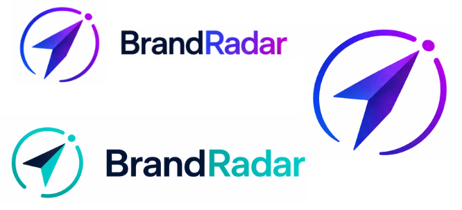
</div>
<br>

**Uso No Permitido:**

No se permite el uso de sombras paralelas (drop shadows) excesivas en el logotipo, ni la alteración de sus proporciones (estiramiento). Queda prohibido el uso de combinaciones de colores cálidos como rojo o naranja, ya que entran en conflicto con la psicología de "monitoreo sereno" y "seguridad de marca" que el azul y morado proyectan.

<br>
<div align="center">

</div>
<br>

### Typography:

<br>

La estrategia tipográfica de BrandRadar combina cinco familias de fuentes con roles claramente diferenciados, logrando un sistema visual que equilibra impacto, legibilidad y personalidad tecnológica. Todas las fuentes están disponibles a través de Google Fonts, garantizando compatibilidad en entornos web y móviles sin dependencias externas.

- **Special Gothic Expanded One** se reserva para los títulos principales y elementos de branding de alto impacto. Su diseño expandido y de trazo uniforme domina el espacio visual, ideal para el hero de la landing page y portadas de reportes.

- **Spartan** actúa como la fuente de encabezados estructurales. Su geometría limpia y sus proporciones equilibradas la hacen perfecta para organizar la jerarquía de secciones sin competir con el display principal.

- **Special Gothic Condensed One** complementa al display en subtítulos y bloques destacados donde se requiere presencia tipográfica con menor ocupación horizontal, permitiendo mayor densidad de información en espacios reducidos.

- **Radio Canada Big** es la fuente de interfaz y cuerpo de texto. Diseñada para alta legibilidad en pantallas, se usa en todo el contenido navegable: descripciones, párrafos, etiquetas de navegación, botones y formularios.

- **TASA Orbiter** se emplea de forma selectiva en elementos de datos, métricas y componentes técnicos, aportando un carácter tecnológico y preciso que refuerza la naturaleza analítica del producto.

<br>

Sistema de familias tipográficas

<br>

| Tipo | Fuente | Uso |
|:---|:---:|:---|
| Display / Hero | **Special Gothic Expanded One** | Títulos principales, landing, branding |
| Heading | **Spartan** | Encabezados (H2, H3, secciones) |
| Subheading | **Special Gothic Condensed One** | Subtítulos y bloques destacados |
| UI / Body | **Radio Canada Big** | Texto principal, navegación, interfaz |
| Accent / Tech | **TASA Orbiter** | Elementos tecnológicos, números, métricas |

<br>

Jerarquía tipográfica

<br>

| Nivel | Fuente | Peso / Estilo | Tamaño | Uso |
|:---|:---:|:---:|:---:|:---|
| H1 | Special Gothic Expanded One | Bold / Wide | 56–72px | Hero, títulos principales |
| H2 | Spartan | SemiBold | 36–42px | Secciones principales |
| H3 | Spartan | Medium | 24–28px | Sub-secciones |
| H4 | Special Gothic Condensed One | Regular | 18–20px | Encabezados secundarios |
| Body 1 (Bold) | Radio Canada Big | SemiBold | 16px | Énfasis en cuerpo de texto |
| Body 1 (Regular) | Radio Canada Big | Regular | 16px | Texto general de interfaz |
| Body 2 / Caption | Radio Canada Big | Light | 13–14px | Texto secundario, notas al pie |
| Nav link | Radio Canada Big | Medium | 15px | Ítems de navegación |
| Button text | Radio Canada Big | SemiBold | 14px | Etiquetas de botones y CTAs |
| UI / Data | TASA Orbiter | Regular | 14–16px | Datos, métricas, UI técnica |

<br>
<div align="center">
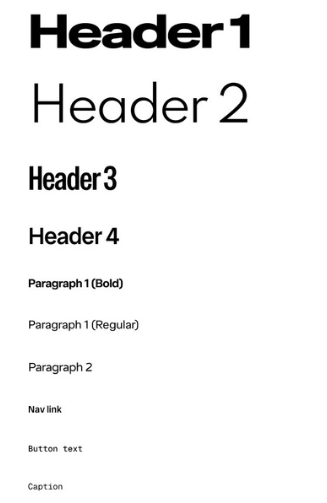
</div>
<br>

### Colors

La paleta de BrandRadar está diseñada para transmitir confianza, tecnología y enfoque analítico, manteniendo un balance entre tonos oscuros profundos, fondos limpios y acentos vibrantes que dirigen la atención del usuario hacia las acciones y datos más relevantes.

Los tonos oscuros (negro y azul pizarra) aportan seriedad y profundidad, adecuados para encabezados, fondos de componentes y texto principal. Los tonos lavanda y lila claro funcionan como superficies neutras de bajo contraste, ideales para fondos de tarjetas, estados hover y separadores. El blanco y el gris muy claro garantizan espacios de respiro visual que mejoran la legibilidad. Como contrapeso, los acentos en azul-violeta intenso y violeta-púrpura introducen dinamismo, identifican las acciones primarias y refuerzan la identidad tecnológica del producto.

<br>
<div align="center">
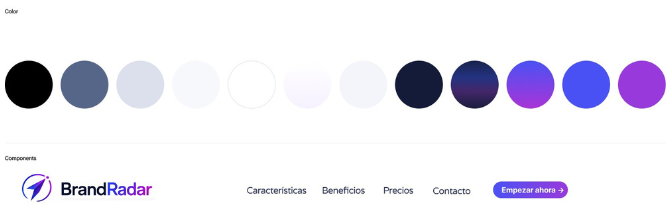
</div>
<br>

| Nombre | Hex | Uso |
|:---|:---:|:---|
| Black | `#000000` | Texto de alta importancia, encabezados H1 |
| Slate / Dark Text | `#3D4466` | Texto secundario oscuro, íconos, subtítulos |
| Lavender Medium | `#8B8FBF` | Estados deshabilitados, texto terciario |
| Lavender Light | `#C5C7E0` | Bordes, separadores, fondos de hover |
| Off-White | `#ECEDF5` | Fondo de tarjetas, superficies secundarias |
| White / Ghost | `#F5F5FA` | Fondo general de la aplicación |
| Near White | `#FAFAFA` | Fondo de página, áreas de contenido amplio |
| Navy Deep | `#0D1033` | Fondo de headers oscuros, sidebar dark mode |
| Midnight Blue | `#1A2155` | Fondo de secciones hero, banners de alerta |
| Primary Purple | `#5B5FEE` | Botones primarios, links activos, CTA |
| Accent Blue | `#4B6EF5` | Estados hover de botones, énfasis secundario |
| Accent Violet | `#9B3CF7` | Highlights, badges, métricas destacadas |

<br>

Adicionalmente, se definen colores de estado semántico para alertas, notificaciones y feedback del sistema:

| Estado | Hex | Uso |
|:---|:---:|:---|
| Success (positivo) | `#22C55E` | Sentimiento positivo, confirmaciones |
| Warning (moderado) | `#F59E0B` | Alertas medias, advertencias |
| Danger (crítico) | `#EF4444` | Alertas críticas, errores, sentimiento negativo |
| Info (informativo) | `#3B82F6` | Mensajes informativos, tooltips |

<br>

---

## 4.2. Information Architecture

La arquitectura de información de **BrandRadar** ha sido diseñada para estructurar de forma clara y jerárquica los contenidos, permitiendo a los usuarios (dueños de PyMEs y especialistas de marketing) monitorear su reputación digital sin fricciones. Se prioriza una navegación intuitiva que reduzca la carga cognitiva al gestionar múltiples fuentes de datos en tiempo real.

A continuación, se presentan los diagramas de estructura que representan la organización general de la plataforma, tanto en su versión web como móvil.

**Figura 1. Diagrama de estructura de la página web**


<br>

**Figura 2. Diagrama de la estructura de la aplicación móvil (Android y iOS)**


<br>

---

### 4.2.1. Organization Systems

<div align="center">
  
### Organización visual del contenido

<br>

  
**Experiencia Web**

| Forma de organización visual | Razón | Sección de la plataforma |
|---|---|---|
| **Jerárquica (Visual Hierarchy)** | Prioriza las alertas críticas y el score de reputación para una respuesta inmediata ante crisis. Los elementos de mayor importancia (score, alertas rojas) ocupan la posición superior izquierda y mayor tamaño visual. | Dashboard principal, Panel de alertas críticas. |
| **Secuencial (Step-by-step)** | Guía al usuario en flujos obligatorios que deben completarse en orden, como el alta de una marca o la conexión de fuentes de datos externas. | Registro de cuenta, Configuración de fuentes (APIs), Configuración de alertas, Onboarding. |
| **Matricial (Modular)** | Divide las métricas (sentimiento, reseñas, menciones) en bloques independientes y comparables, evitando la saturación visual al gestionar múltiples fuentes simultáneamente. | Sección de Monitoreo detallado, Reportes, Análisis comparativo. |

<br>

**Experiencia Móvil**

| Forma de organización visual | Razón | Sección de la plataforma |
|---|---|---|
| **Jerárquica (Visual Hierarchy)** | Facilita el acceso inmediato a notificaciones push y al resumen de menciones recientes en pantallas de tamaño reducido, donde el espacio es crítico. | Pantalla de inicio, Centro de notificaciones en tiempo real. |
| **Secuencial (Step-by-step)** | Permite al usuario completar tareas rápidas —como responder una reseña o reportar una mención negativa— sin perderse en submenús. | Gestión de reseñas individuales, Reporte de incidentes, Respuesta rápida. |
| **Matricial (Modular)** | Optimiza la lectura de datos de sentimiento y tendencias agrupándolos en tarjetas desplazables, sin saturar la interfaz móvil. | Dashboard móvil, Ajustes de alertas. |

</div>

<br>

<div align="center">
  
### Esquemas de categorización de contenido

<br>

**Experiencia Web**

| Esquema de organización | Razón | Sección de la plataforma |
|---|---|---|
| **Cronológico** | Muestra las menciones y comentarios conforme ocurren en tiempo real, ofreciendo al usuario una línea de tiempo de su reputación. | Feed de Monitoreo, Historial de alertas, Línea de tiempo de menciones. |
| **Por tópicos** | Agrupa el análisis según la fuente o área temática (Redes Sociales, Google Maps, Web General), para que el usuario acceda directamente a la fuente relevante. | Fuentes de datos configuradas, Análisis de sentimiento por plataforma. |
| **Según audiencia** | Personaliza el panel y las funciones visibles según el rol del usuario: vista simplificada para el dueño de PyME vs. vista multi-marca para el Account Manager de agencia. | Dashboard principal, Gestión de cuentas de clientes. |

<br>

**Experiencia Móvil**

| Esquema de organización | Razón | Sección de la plataforma |
|---|---|---|
| **Cronológico** | Presenta las alertas más urgentes primero según el momento de detección, facilitando la respuesta oportuna desde cualquier lugar. | Centro de notificaciones, Feed de menciones recientes. |
| **Por tópicos** | Clasifica las alertas por nivel de riesgo (Alto, Medio, Bajo) para que el usuario priorice su atención de forma visual e inmediata. | Filtros de búsqueda rápida, Listado de crisis detectadas. |
| **Según audiencia** | Adapta las herramientas y acciones disponibles en el menú según el rol del usuario autenticado. | Menú de navegación principal, Pantalla de configuración de perfil. |

</div>
<br>

---

### 4.2.2. Labeling Systems

El objetivo del sistema de etiquetado de BrandRadar es representar conjuntos de información complejos (reputación, sentimiento, alertas, métricas) con el menor número de palabras posible, evitando la ambigüedad. Todas las etiquetas son concretas, orientadas a la acción y coherentes entre la versión web y móvil.

<br>

<div align="center">


<br> <br>

**Etiquetas de estados y badges**

| Contexto | Etiqueta | Color |
|---|---|---|
| Sentimiento positivo | **Positivo** | Verde `#43A047` |
| Sentimiento negativo | **Negativo** | Rojo `#E53935` |
| Sentimiento neutro | **Neutro** | Gris `#9E9E9E` |
| Nivel de alerta alto | **Crítico** | Rojo `#E53935` |
| Nivel de alerta medio | **Moderado** | Naranja `#FB8C00` |
| Nivel de alerta bajo | **Informativo** | Azul `#1A73E8` |

</div>

<br>

**Etiquetas de acciones directas en tarjetas**

- **Responder** — abre el editor de respuesta a una reseña.
- **Ver detalle** — expande la mención o alerta seleccionada.
- **Generar reporte** — inicia la generación del informe de la crisis detectada.
- **Marcar revisado** — archiva la alerta sin generar acción.
- **Escalar** — redirige la alerta al administrador de cuenta.


<br>

---

### 4.2.3. SEO Tags and Meta Tags

**Landing Page**

```html
<!-- Landing Page: BrandRadar -->
<title>BrandRadar – Monitoreo de Reputación Digital para PyMEs</title>

<meta name="description"
  content="BrandRadar analiza en tiempo real las menciones, reseñas y comentarios de tu marca en redes sociales, Google Maps y la web. Detecta crisis, gestiona alertas y mejora tu reputación digital.">

<meta name="keywords"
  content="monitoreo de reputación, gestión de reseñas, alertas de marca, análisis de sentimiento, menciones en redes sociales, reputación digital PyMEs, Google Maps reviews, social listening">

<meta name="author" content="BrandRadar Team">

<meta property="og:title" content="BrandRadar – Monitoreo de Reputación Digital para PyMEs">
<meta property="og:description"
  content="Detecta crisis reputacionales antes de que escalen. Analiza el sentimiento de tu marca en tiempo real.">
<meta property="og:image" content="https://brandradar.app/assets/og-cover.png">
<meta property="og:url" content="https://brandradar.app">
<meta property="og:type" content="website">

<meta name="twitter:card" content="summary_large_image">
<meta name="twitter:title" content="BrandRadar – Monitoreo de Reputación Digital">
<meta name="twitter:description"
  content="Gestiona la reputación de tu negocio desde un solo panel. Alertas en tiempo real, análisis de sentimiento y reportes automáticos.">

<link rel="canonical" href="https://brandradar.app">
```
<br>

**Web Application — Dashboard (usuario autenticado)**

<br>

```html
<!-- Dashboard principal -->
<title>Dashboard – BrandRadar</title>
<meta name="description" content="Resumen de tu score de reputación, alertas críticas y menciones recientes.">
<meta name="robots" content="noindex, nofollow">
<meta name="author" content="BrandRadar Team">
```
<br>

**Web Application — Sección Monitoreo**

<br>

```html
<title>Monitoreo en Tiempo Real – BrandRadar</title>
<meta name="description"
  content="Feed en tiempo real de todas las menciones detectadas de tu marca en redes sociales, Google Maps y la web general.">
<meta name="robots" content="noindex, nofollow">
<meta name="author" content="BrandRadar Team">
```

<br>

**Web Application — Sección Reportes**

```html
<title>Reportes de Reputación – BrandRadar</title>
<meta name="description"
  content="Genera informes detallados sobre la evolución de la reputación de tu marca. Exporta en PDF o comparte directamente.">
<meta name="robots" content="noindex, nofollow">
<meta name="author" content="BrandRadar Team">
```

<br>

---

### 4.2.4. Searching Systems

En BrandRadar, los sistemas de búsqueda han sido diseñados para reducir el tiempo de localización de información crítica dentro de un volumen alto de datos provenientes de múltiples fuentes simultáneas. El usuario nunca debe sentirse abrumado; los filtros actúan como capas que van reduciendo progresivamente el universo de resultados hasta mostrar exactamente lo que necesita.

**Tipos de búsqueda disponibles**

| Nombre | Descripción | Disponible en |
|---|---|---|
| **Barra de búsqueda libre** | Búsqueda por palabra clave, nombre de marca, frase específica o URL. Autocompletado con sugerencias basadas en historial. | Web y App |
| **Filtro por Sentimiento** | Aísla menciones positivas, negativas o neutras para gestión de crisis o fidelización. | Web y App |
| **Filtro por Plataforma** | Segmenta resultados por fuente: Instagram, Facebook, Google Maps, Twitter/X, TripAdvisor, web general. | Web y App |
| **Filtro por Criticidad** | Enfoca la vista en alertas de alta prioridad (caída de score, reseñas de 1 estrella, pico de menciones negativas). | Web y App |
| **Rango cronológico** | Visualiza menciones y tendencias en un período específico (ej. semana de campaña, Black Friday). | Web y App |
| **Filtro por tipo de mención** | Diferencia entre reseñas, comentarios, noticias y menciones directas en redes. | Web |
| **Buscador de competidores** | Busca palabras clave asociadas a la competencia para análisis de benchmarking. | Web |

**Cómo lucen los resultados después de la búsqueda**

Los resultados se presentan como **tarjetas informativas** ordenadas cronológicamente (más reciente primero):

- El **badge de sentimiento** (verde/rojo/gris) permite identificar el tono de un vistazo.
- El **badge de criticidad** (Crítico / Moderado / Informativo) indica la urgencia de acción.
- Los **botones de acción directa** permiten gestionar la mención sin salir de la vista de resultados.
- Al aplicar filtros, aparece una barra de **filtros activos** en la parte superior, donde cada filtro puede eliminarse individualmente con una "X".
- Si la búsqueda no devuelve resultados, se muestra un mensaje con sugerencias: "No encontramos menciones con estos filtros. Prueba ampliar el rango de fechas o eliminar un filtro."

<br>


## 4.2.5. Navigation Systems

Los sistemas de navegación de BrandRadar han sido diseñados para guiar al usuario de forma clara, personalizada e intuitiva tanto en la Landing Page como en la aplicación web y móvil. El objetivo es que los dueños de PyMEs y los especialistas de marketing encuentren cualquier funcionalidad en tres clics o menos.

<br>
<div align="center">
  
**Landing Page**

</div>
<br>

La navegación se basa en una **barra superior fija** (sticky header) con las siguientes secciones:

<br>
<div align="center">
  
| Etiqueta | Destino |
|---|---|
| Inicio | Hero section con propuesta de valor |
| Características | Bloque de funcionalidades principales |
| Planes | Tabla de precios y comparativa de suscripciones |
| Testimonios | Casos de éxito de clientes |
| Comunidad | Foro y recursos de la comunidad BrandRadar |
| Iniciar sesión | Redirección al login de la aplicación |

<br>
</div>

Se incorporan **CTAs visibles** a lo largo del scroll:
- _"Empieza tu monitoreo gratis"_ — activa el flujo de registro.
- _"Agenda una demo"_ — abre un modal con formulario de contacto.
- _"Ver planes"_ — ancla a la sección de precios.

El **pie de página** complementa la navegación secundaria con acceso a: Política de Privacidad, Términos de Servicio, Documentación de la API, Centro de Ayuda y redes sociales oficiales.

<br>
<div align="center">
  
**Aplicación Web — Dashboard**

</div>
<br>

Se implementa un patrón de navegación híbrido:

- **Sidebar lateral izquierdo** (fijo en desktop, colapsable en tablet): acceso permanente a las secciones principales.
- **Pestañas superiores** dentro de secciones complejas (ej. Monitoreo > pestaña Instagram / Google Maps / Web).
- **Breadcrumbs** en rutas profundas para indicar al usuario en qué nivel de la jerarquía se encuentra (ej. _Clientes > Marca XYZ > Alertas_).

<br>
<div align="center">
  
**Aplicación Móvil**

</div>

La navegación móvil utiliza una **barra inferior de navegación** (bottom tab bar) con los 4-5 destinos más frecuentes, siguiendo el patrón estándar de iOS y Android:

<br>
<div align="center">
  
**Dueño de PyME (barra inferior)**

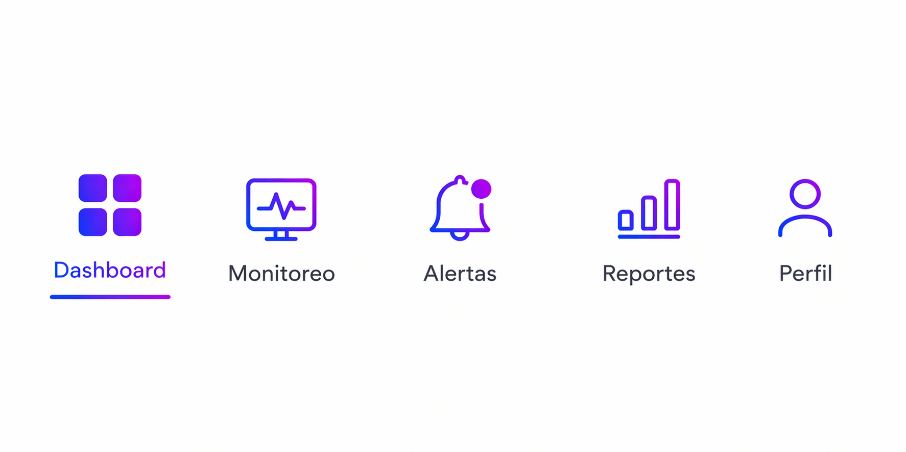

**Especialista de Marketing (barra inferior)**

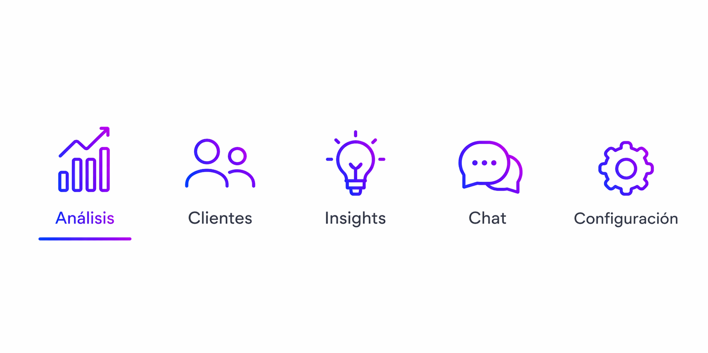
</div>

Las notificaciones push dirigen al usuario directamente a la mención o alerta específica, sin necesidad de navegar manualmente por la app. Los flujos de acción rápida (responder reseña, escalar alerta) se resuelven en modales de pantalla completa que no interrumpen la ruta de navegación principal.

<br>

---

## 4.3. Landing Page UI Design

>En esta sección se presenta la propuesta de interfaz de usuario (UI) para la Landing Page de **BrandRadar**. El diseño se fundamenta en los hallazgos obtenidos durante el proceso de investigación (entrevistas y Lean UX), priorizando las necesidades de los usuarios, especialmente la visualización clara de la reputación digital y el acceso rápido a información relevante.*

>*Asimismo, se han aplicado principios de diseño centrados en el usuario, una arquitectura de información clara y un enfoque visual moderno, con el objetivo de comunicar de manera efectiva el valor de la plataforma y facilitar la conversión de usuarios.*


### 4.3.1. Landing Page Wireframe

>*Los wireframes representan la estructura base de la Landing Page, permitiendo definir la organización de contenidos, la jerarquía visual y el flujo de navegación antes de la aplicación del diseño visual final. Se desarrollaron versiones para escritorio (desktop web browser) y dispositivos móviles (mobile web browser):*

<br>

<div align="center">

**Desktop Web Browser**

<br>

*Elaboración propia en Figma*


<br>

**Mobile Web Browser**
<br>

*Elaboración propia en Figma*


</div>


### 4.3.2. Landing Page Mock-up

>*Los mock-ups representan la versión visual final de la Landing Page, incorporando los elementos definidos en el Design System, como la paleta de colores, la tipografía, la iconografía y los estilos de componentes.
En esta etapa se materializa la propuesta de wireframes en una interfaz visual completamente definida, permitiendo validar la coherencia estética, la jerarquía visual y la experiencia de usuario antes del desarrollo final.*

<div align="center">

**Desktop Web Browser**

<br>

*Elaboración propia en Figma*

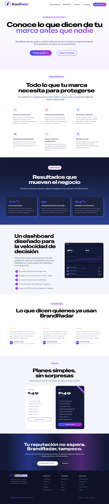

<br>

**Mobile Web Browser**

<br>

*Elaboración propia en Figma*


</div>

<br>

---

## 4.4. Web Applications UX/UI Design

>*En esta sección se presenta la propuesta visual y de interacción para la aplicación web de BrandRadar. El diseño ha sido desarrollado a partir de los hallazgos obtenidos en el proceso de investigación con usuarios, priorizando la claridad en la visualización de datos, el acceso rápido a funcionalidades críticas y una experiencia coherente tanto para dueños de PyMEs como para especialistas de marketing.
Se aplican principios de diseño centrado en el usuario, consistencia visual basada en el Design System definido y una arquitectura de información orientada a reducir la carga cognitiva en cada interacción.*

<br>

### 4.4.1. Web Applications Wireframes

>*Los wireframes presentados a continuación representan la estructura base de las principales vistas de la aplicación web de BrandRadar. Su elaboración se realizó aplicando principios de diseño inclusivo, asegurando que la disposición de los elementos sea clara, comprensible y accesible para usuarios con distintos niveles de experiencia tecnológica.*

<br>


<br>

### 4.4.2. Web Applications Wireflow Diagrams

*(Un Wireflow por cada User goal, considerando los User Personas definidos)*

<br>


**User goal: `[Nombre del User goal]`**

*(Descripción del flujo especificado)*


<br>

**User goal: `[Nombre del User goal]`**

*(Descripción del flujo especificado)*


<br>

### 4.4.3. Web Applications Mock-ups

>*Los mock-ups presentados a continuación representan la propuesta visual final de las principales vistas de la aplicación web de BrandRadar, incorporando el Design System definido en la sección 4.1. A diferencia de los wireframes, estas vistas integran la paleta de colores, tipografía, iconografía, componentes visuales y espaciado establecidos para la plataforma, ofreciendo una representación de alta fidelidad de la experiencia de usuario en el sistema.*

>*El diseño busca transmitir confianza, claridad y eficiencia, valores fundamentales de BrandRadar, asegurando que tanto los dueños de PyMEs como los account managers de agencias puedan interpretar la información de reputación digital de forma rápida e intuitiva.*

<br>


<br>

### 4.4.4. Web Applications User Flow Diagrams

*(User Flows incluyendo Mock-ups de vistas, happy paths y unhappy paths)*

<br>

**User goal: `[Nombre del User goal]`**

*(Descripción de los flujos y condiciones especificadas)*

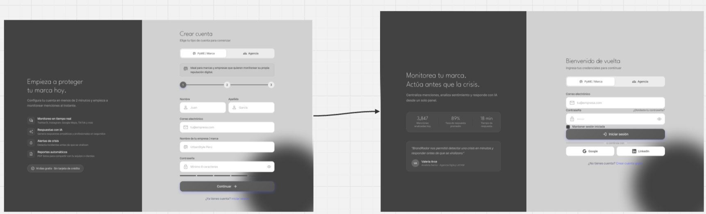

<br>

---

## 4.5. Web Applications Prototyping

En esta sección se presenta el prototipo interactivo de la aplicación web de BrandRadar, desarrollado en Figma a partir de los mock-ups de alta fidelidad definidos en la sección anterior. El prototipo simula la navegación real del sistema, permitiendo visualizar los flujos de interacción entre las distintas vistas de la plataforma en sus versiones Desktop y Mobile Web.

Las decisiones de interacción del prototipo se basaron en los siguientes criterios:

- **Accesibilidad y simplicidad:** Se prioriza una navegación intuitiva que permita a cualquier usuario, independientemente de su nivel técnico, utilizar la plataforma sin necesidad de instrucciones previas, especialmente en el segmento de dueños de PyMEs.
- **Rapidez de acceso a funciones críticas:** Las acciones más frecuentes, como la revisión de alertas, el análisis de sentimiento y la generación de reportes, se encuentran disponibles desde el Dashboard principal con el menor número de interacciones posible.
- **Consistencia visual:** Todos los elementos siguen el Design System definido, garantizando un comportamiento coherente y predecible en componentes como botones, formularios, tarjetas y navegación.
- **Diseño responsivo:** El prototipo se adapta a dispositivos móviles, asegurando una experiencia consistente que permita el monitoreo de la reputación digital desde cualquier dispositivo.

A continuación, se presentan los prototipos para Desktop y Mobile Web, junto con los videos de simulación de navegación correspondientes.

<br>

<div align="center">

**Prototipo Desktop**


[Ver video de prototipo Desktop en Microsoft Stream](`URL`)

<br>

**Prototipo Mobile**


[Ver video de prototipo Mobile en Microsoft Stream](`URL`)

</div>

<br>

---

## 4.6. Domain-Driven Software Architecture

### 4.6.1. Design-Level Event Storming

>*Para definir la arquitectura de BrandRadar orientada al dominio (DDD), se realizó un proceso iterativo de Design-Level Event Storming siguiendo la metodología de 10 pasos. A continuación, se detalla la evolución del modelo:*

<br>
  
**Step 1: Unstructured Exploration**

Se identificaron y representaron todos los eventos que modifican el estado del sistema, escritos en tiempo pasado (post-its naranjas). Estos abarcan desde `User Registered` hasta `PDF Report Generated`, entre otros eventos relevantes del dominio.

<br>
<div align="center">
  


</div>

**Step 2: Timelines**

Se ordenaron los eventos del dominio de forma cronológica de izquierda a derecha, estableciendo el flujo del ciclo de vida del monitoreo de reputación digital.

<br>
<div align="center">
  


</div>

**Step 3: Hotspots**

Se identificaron los puntos críticos del sistema y riesgos técnicos del negocio (marcados con rombos rojos), como posibles limitaciones por rate limits en APIs de redes sociales o falsos positivos en los modelos de análisis de sentimiento basados en inteligencia artificial.

<br>
<div align="center">
  
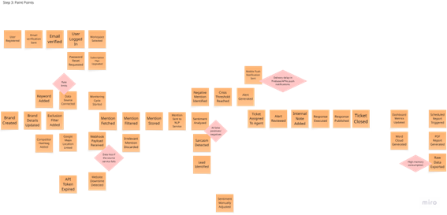

</div>

**Step 4: Pivotal Events**

Se definieron eventos pivote que segmentan el flujo del sistema en fases funcionales, delimitando el cambio de estado entre la configuración inicial, el monitoreo automático y la gestión de crisis reputacionales.

<div align="center">
  
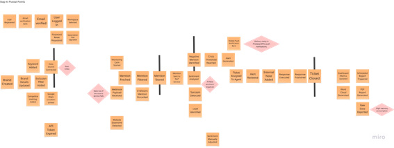

</div>

**Step 5: Commands & Actors**

Se definieron los commands (post-its azules) que disparan los eventos del sistema, así como los actores (íconos amarillos) responsables de ejecutarlos, ya sean usuarios (PyME / Agencia) o procesos automatizados del sistema.

<div align="center">
  
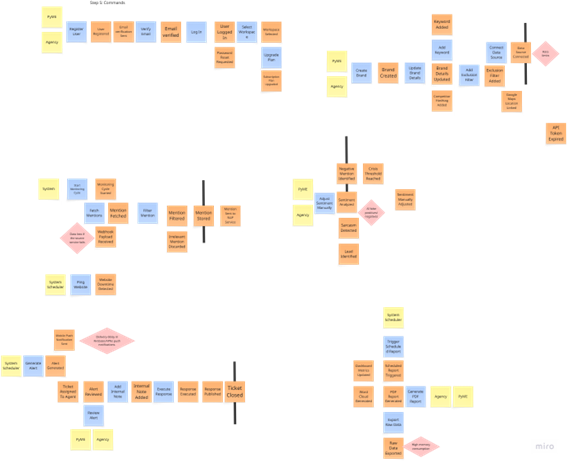

</div>

**Step 6: Policies**

Se incorporaron las business policies (post-its lilas), que representan reglas de negocio reactivas que automatizan el comportamiento del sistema. Por ejemplo, la regla que establece que cuando una mención presenta sentimiento negativo, se genera automáticamente una alerta de alta prioridad.

<div align="center">
  
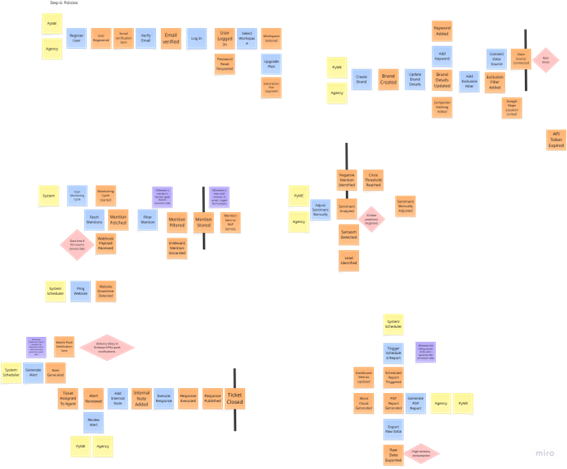

</div>

**Step 7: Read Models**

Se mapearon los read models (post-its verdes), que representan las vistas e interfaces que los usuarios necesitan consultar para la toma de decisiones antes de ejecutar un comando.

<div align="center">
  
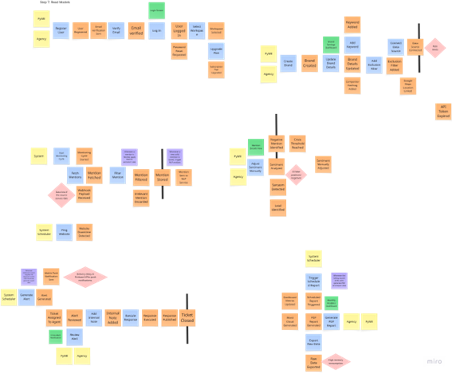

</div>

**Step 8: External Systems**

Se identificaron los sistemas externos (post-its rosados) que interactúan con BrandRadar, incluyendo APIs de redes sociales, Google Maps API y servicios de procesamiento de lenguaje natural (NLP) basados en inteligencia artificial.

<div align="center">
  
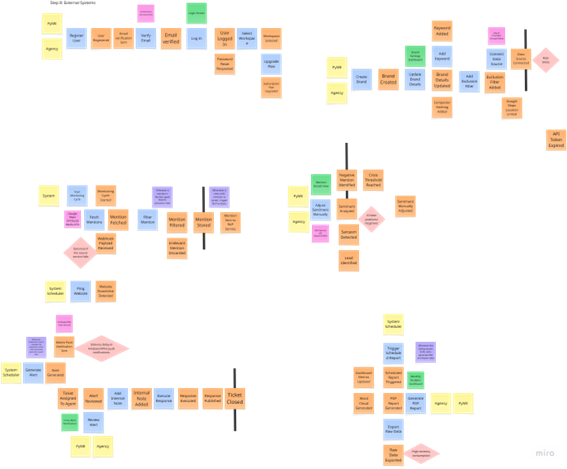

</div>

**Step 9: Aggregates**

Se incrementó el nivel de abstracción agrupando comandos y eventos alrededor de las principales entidades del dominio (Aggregates, representados como post-its amarillos grandes). En esta etapa se definieron agregados clave como `Account`, `Brand`, `Mention`, `Crisis Alert` y `Analytics Report`, los cuales encapsulan la consistencia de las reglas de negocio y el estado del sistema.

<div align="center">
  


</div>

**Step 10: Bounded Contexts**

Finalmente, se delimitaron los límites semánticos y transaccionales del dominio mediante la definición de Bounded Contexts, agrupando los agregados relacionados en bloques coherentes e independientes. Este paso consolidó la arquitectura del sistema en seis contextos principales: Account Management, Brand Management, Monitoring, Sentiment Analysis, Alert Management y Reporting.

<div align="center">
  
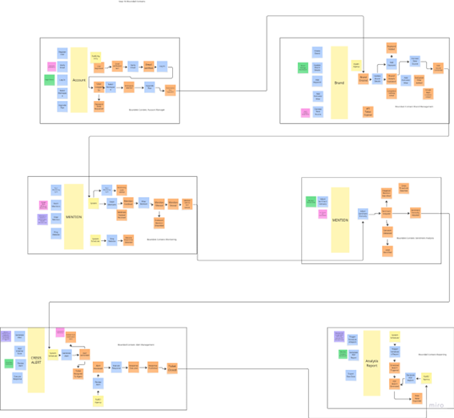

  
**Bounded Contexts:**


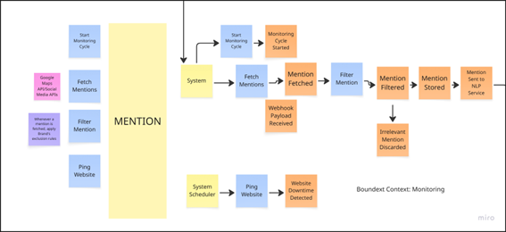

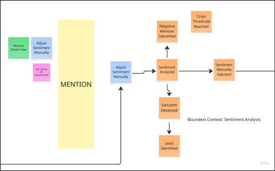


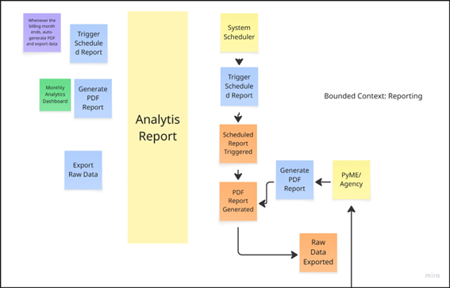

</div>

<br>

El proceso de Design-Level Event Storming permitió profundizar en el comportamiento técnico del sistema, tomando como base los flujos identificados en el Big Picture Event Storming. En esta etapa, se definieron los límites transaccionales (Bounded Contexts) y se incorporaron elementos de diseño táctico como Comandos (Commands), Agregados (Aggregates) y Políticas (Policies). [Ver Miro](https://miro.com/welcomeonboard/OFNBUUR3ZHl3VWkyVzJPRzhPWEV5bHF2S0hiRjArNEswejJoT0ZyZVdHQ0VMVDkzNy9Xd3RCOGdHemhTN3ZJblhjSkJLRjBneGRvNjdaaXNCZHkvWVQ3N1VhMUxRYkI4SmNBRTdTaHpBWWlzRHhGTTZKL2NFVjVtK1IwcFZscnhnbHpza3F6REdEcmNpNEFOMmJXWXBBPT0hdjE=?share_link_id=126405139400).

A partir del análisis del dominio de BrandRadar, se consolidaron seis Bounded Contexts principales:
1. **Account Management:** Gestiona la identidad de los usuarios, roles (PyME Owner, Agency Manager) y sesiones de autenticación.
2. **Brand Management:** Administra la configuración de marcas, palabras clave (keywords) y la conexión con fuentes de datos externas.
3. **Monitoring:** Coordina la integración con APIs externas y la recolección de menciones (mentions) en tiempo real.
4. **Sentiment Analysis:** Delega el procesamiento de lenguaje natural y clasifica el sentimiento.
5. **Alert Management:** Aplica reglas de negocio para la generación de alertas y notificaciones ante eventos críticos o menciones negativas.
6. **Reporting:** Consolida métricas del sistema y genera dashboards y reportes exportables para análisis y toma de decisiones.
   
<br>

---

### 4.6.2. Software Architecture Context Diagram

>*El Diagrama de Contexto representa a BrandRadar dentro de su entorno operativo, mostrando las interacciones de alto nivel entre el sistema, los usuarios y los sistemas externos.*

<br>

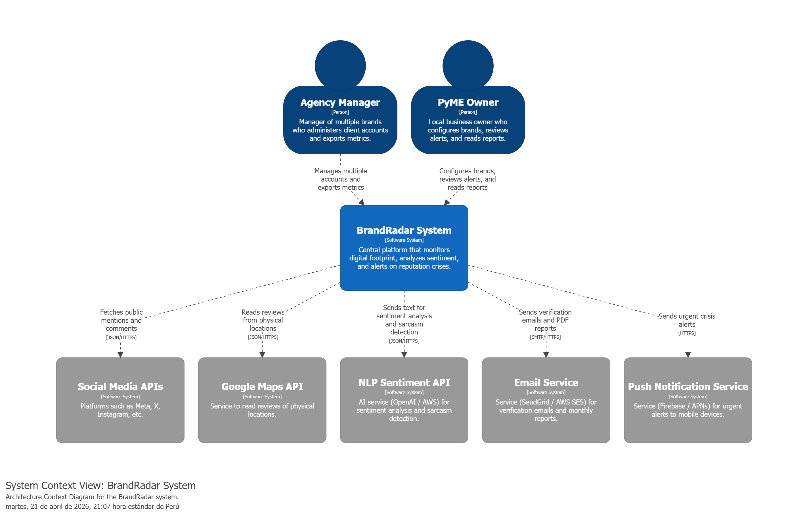

Este nivel de abstracción permite comprender el alcance del sistema y su valor dentro del dominio de negocio, evidenciando cómo los actores principales —PyME Owner y Agency Manager— interactúan con la plataforma central de BrandRadar. Asimismo, se identifican las dependencias críticas con sistemas externos, como las APIs de redes sociales y Google Maps para la obtención de datos, y servicios de Inteligencia Artificial (NLP) para el análisis automático de sentimiento.

<br>

### 4.6.3. Software Architecture Container Diagrams

>*El Diagrama de Contenedores descompone el sistema BrandRadar en sus unidades desplegables, describiendo cómo se distribuyen las responsabilidades técnicas y las tecnologías utilizadas en cada componente.*

<br>
<div align="center">
  
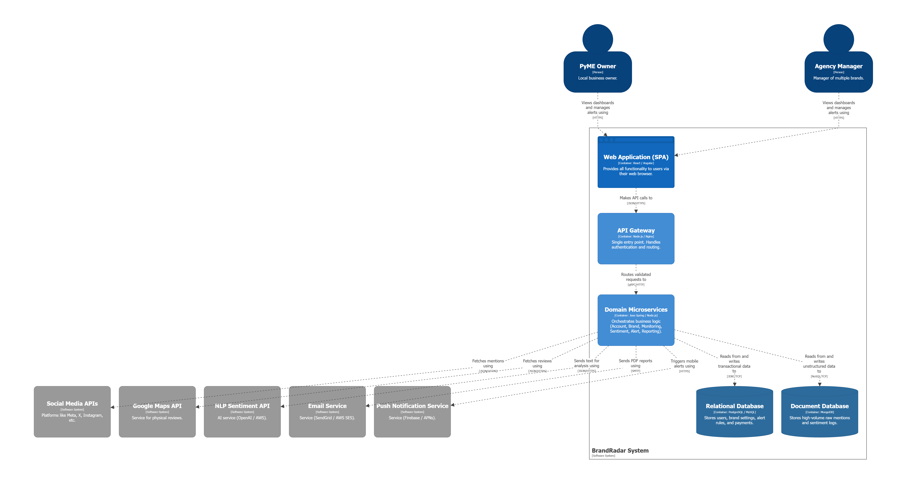

</div>
<br>

En esta vista se presenta la arquitectura de contenedores del sistema BrandRadar, basada en una aproximación de microservicios. Se observa cómo la aplicación cliente (Web App SPA) se comunica exclusivamente con un API Gateway, el cual actúa como punto de entrada único y enruta las solicitudes hacia los distintos servicios de dominio.

Este enfoque permite centralizar la gestión de autenticación, seguridad y enrutamiento, desacoplando la capa de presentación de la lógica de negocio.

Asimismo, se justifica la adopción de persistencia políglota, utilizando una base de datos relacional para datos transaccionales estructurados (cuentas, usuarios y suscripciones), y una base de datos documental para el manejo de información no estructurada y de alta volumetría, como las menciones provenientes de redes sociales.

<br>

### 4.6.4. Software Architecture Components Diagrams

Para el diagrama de componentes, se ha desglosado la arquitectura interna de cada contenedor principal, alineándola directamente con los Bounded Contexts identificados durante el proceso de Event Storming.

Este nivel de detalle permite identificar las piezas de software que conforman cada microservicio, tales como controladores, servicios de lógica de negocio, repositorios de acceso a datos y conectores hacia sistemas externos.

A continuación, se presentan los diagramas de componentes correspondientes a los seis contextos delimitados del sistema:

<br>
<div align="center">
  
**Bounded Context: `Account Manager`**


</div>
<br>

Administra la seguridad, la emisión de tokens JWT, el registro de usuarios y el control de las cuotas permitidas según el plan de suscripción adquirido.

<br>
<div align="center">
  
**Bounded Context: `Brand Management`**


</div>
<br>

Permite la configuración del núcleo del negocio: la creación de marcas, la validación de palabras clave (keywords) y el intercambio seguro de tokens OAuth con plataformas de terceros.

<br>
<div align="center">

**Bounded Context: `Monitoring`**

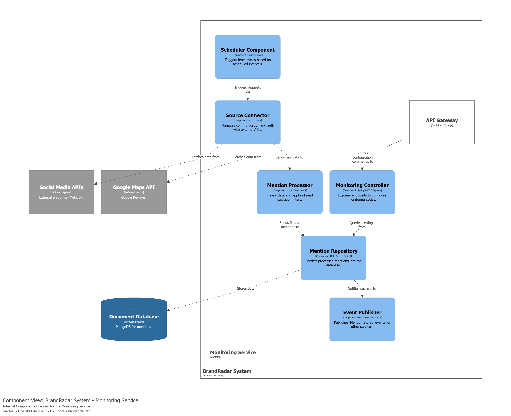

</div>
<br>
  
Encargado de orquestar los ciclos programados (Schedulers) para extraer datos de Google Maps y Redes Sociales, filtrarlos y almacenarlos en la base de datos documental.

<br>
<div align="center">

**Bounded Context: `Sentiment Analysis`**

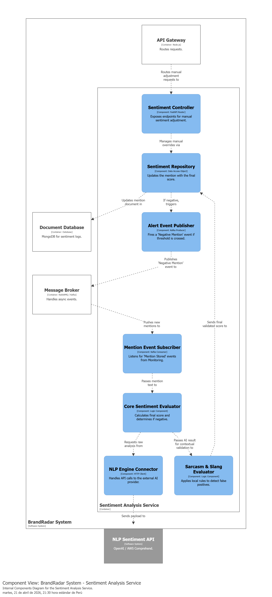

</div>
<br>

Integra el motor central de evaluación. Recibe eventos de nuevas menciones, interactúa con la API de NLP externa, aplica reglas locales para detección de sarcasmo y determina si el sentimiento cruza el umbral negativo.


<br>
<div align="center">
  
**Bounded Context: `Alert Management`**

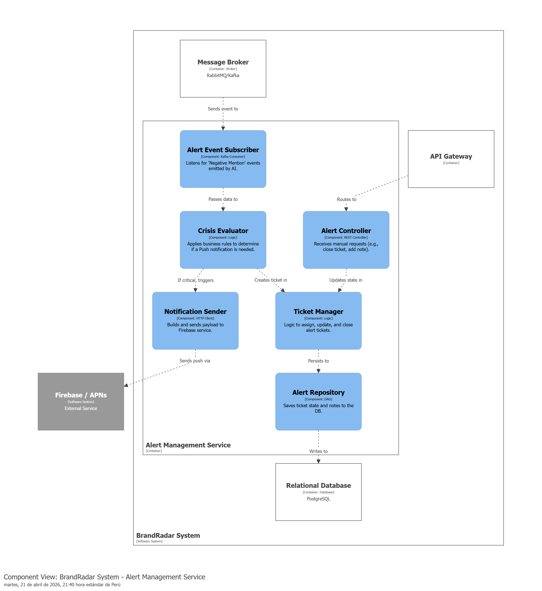

</div>
<br>

Gestiona el ciclo de vida de las crisis de reputación. Evalúa las menciones negativas, genera tickets de seguimiento y dispara notificaciones push a través de servicios como Firebase/APNs.

<br>
<div align="center">
  
**Bounded Context: `Reporting`**

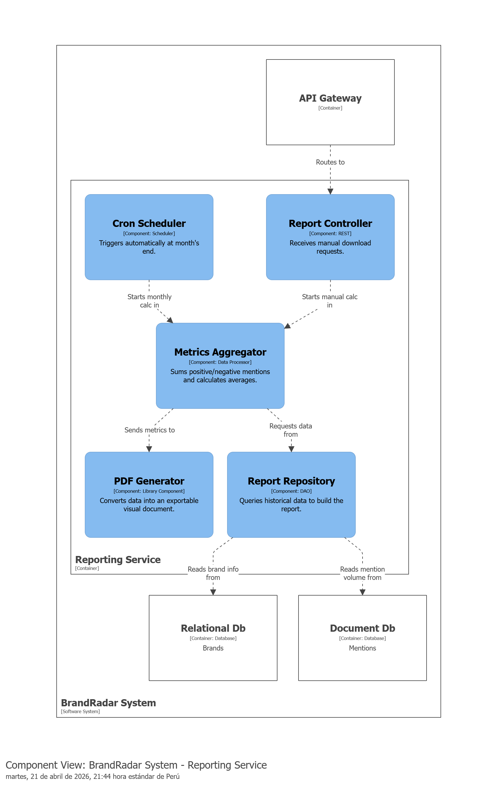

</div>
<br>

Consolida la información mediante procesos asíncronos para generar dashboards analíticos y reportes descargables en PDF, permitiendo a las agencias presentar resultados tangibles a sus clientes.

<br>

---

## 4.7. Software Object-Oriented Design

>*Esta sección presenta el diseño orientado a objetos de BrandRadar, traduciendo el modelo de dominio obtenido del Event Storming en una estructura de clases implementable. Se aplican principios SOLID y patrones tácticos de Domain-Driven Design, organizando el sistema en seis Bounded Contexts: Account Management, Brand Setup, Monitoring, Sentiment Analysis, Alert Management y Reporting.*

<br>

### 4.7.1. Class Diagrams

>*Los diagramas de clases describen la estructura estática de cada Bounded Context, incluyendo clases, atributos, métodos y relaciones con sus respectivas multiplicidades. Se emplean estereotipos como «Aggregate Root», «Value Object», «Service» y «Enum» para representar el rol de cada elemento dentro del dominio.

La comunicación entre contextos se realiza únicamente mediante identificadores (IDs) o contratos de integración, evitando referencias directas entre objetos pertenecientes a distintos Bounded Contexts, con el fin de mantener el bajo acoplamiento y la independencia de cada módulo.*

<br>

**Bounded Context: `Account Management`**

<br>

Este Bounded Context gestiona todo lo relacionado con la identidad, autenticación y autorización de usuarios en BrandRadar. Cubre el ciclo completo de vida de la cuenta, desde el registro hasta el inicio de sesión, incluyendo la verificación de correo electrónico y la gestión de sesiones activas.

Los dos actores del sistema, **PyME Owner y Agency Manager**, se modelan como variantes de un mismo agregado de usuario, diferenciados mediante el atributo UserRole, por lo que ambos comparten la entidad principal User.

Las credenciales de autenticación se gestionan como una entidad separada dentro del mismo contexto, con el objetivo de aislar información sensible y reforzar la seguridad del sistema. Asimismo, cada sesión se registra de forma independiente, permitiendo el control y la trazabilidad de accesos activos.

<br>

<div align="center">
  
*Imagen del Class Diagram*

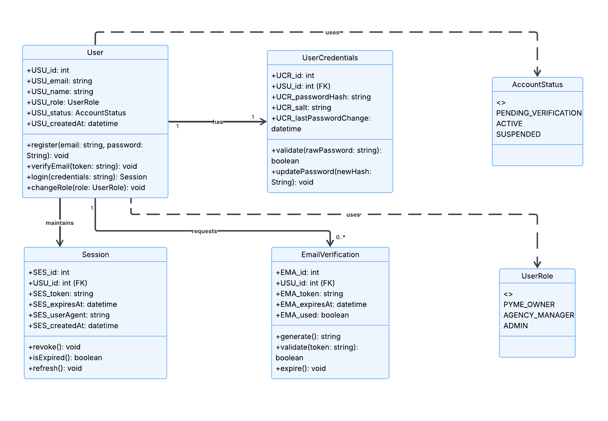

*Elaboración propia con LucidChart*

</div>

<br>

**Bounded Context: `Brand Management`**

<br>

Este Bounded Context gestiona la configuración inicial y el mantenimiento de una marca dentro de BrandRadar. Cubre el proceso mediante el cual el usuario habilita una marca para el monitoreo de reputación digital, incluyendo el registro de información básica de la marca, la definición de palabras clave (keywords) y la conexión con fuentes de datos externas como redes sociales y plataformas de reseñas.

Una *Brand* puede asociarse a múltiples *Keywords* y múltiples *Data Sources*, mientras que la configuración de monitoreo define los parámetros activos bajo los cuales el sistema realiza la recolección de información en tiempo real.

<br>

<div align="center">
  
*Imagen del Class Diagram*

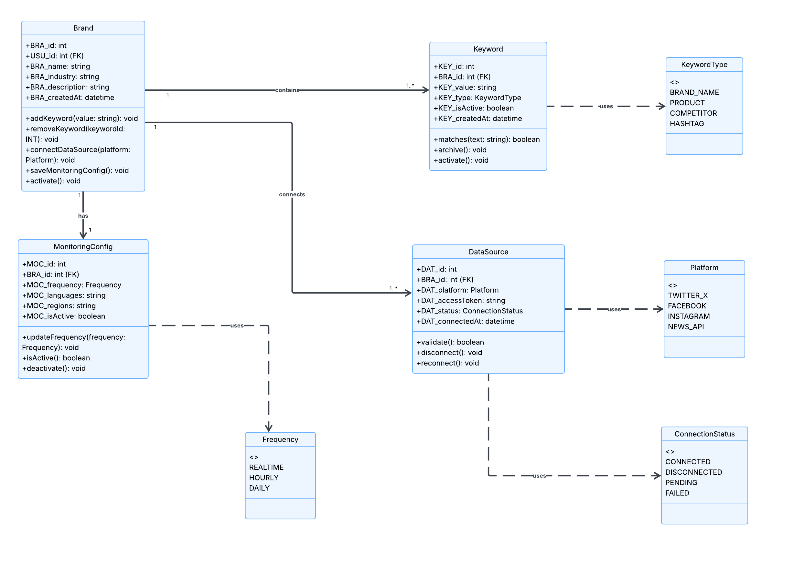

*Elaboración propia con LucidChart*

</div>


<br>

**Bounded Context: `Monitoring`**

<br>

Este Bounded Context se encarga de la recolección automatizada de menciones desde las fuentes de datos externas configuradas por el usuario. Cada vez que se ejecuta un ciclo de monitoreo, se genera un MonitoringJob, el cual coordina el proceso de ingesta de datos desde APIs externas.

Durante su ejecución, el sistema recupera menciones en bruto, aplica reglas de filtrado para eliminar contenido irrelevante o duplicado, y persiste únicamente aquellas menciones que cumplen con los criterios definidos para su posterior procesamiento.

Una *Mention* representa cualquier publicación, comentario o referencia en línea que contiene coincidencias con las *keywords* asociadas a una marca dentro del sistema.
<br>

<div align="center">
  
*Imagen del Class Diagram*

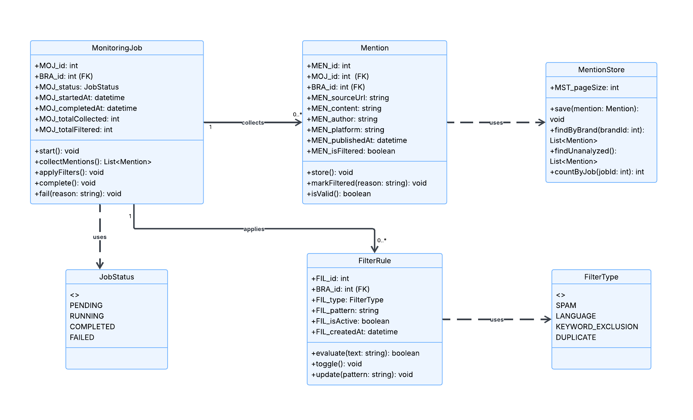

*Elaboración propia con LucidChart*

</div>


<br>

**Bounded Context: `Sentiment Analysis`**

<br>

Este Bounded Context se encarga del análisis del contenido de las menciones recolectadas por el *Monitoring Context*, con el objetivo de determinar el sentimiento expresado hacia la marca (positivo, neutro o negativo).

El análisis de sentimiento se realiza mediante la integración con un servicio externo de procesamiento de lenguaje natural (NLP), cuyo resultado se registra como un SentimentResult asociado a cada Mention.

En función de los resultados obtenidos, el sistema evalúa un umbral de negatividad configurado previamente. Cuando dicho umbral es superado, la mención es clasificada como crítica y queda disponible para su tratamiento dentro del Alert Management Context, el cual se encarga de la generación de alertas.

<br>
<div align="center">
  
*Imagen del Class Diagram*

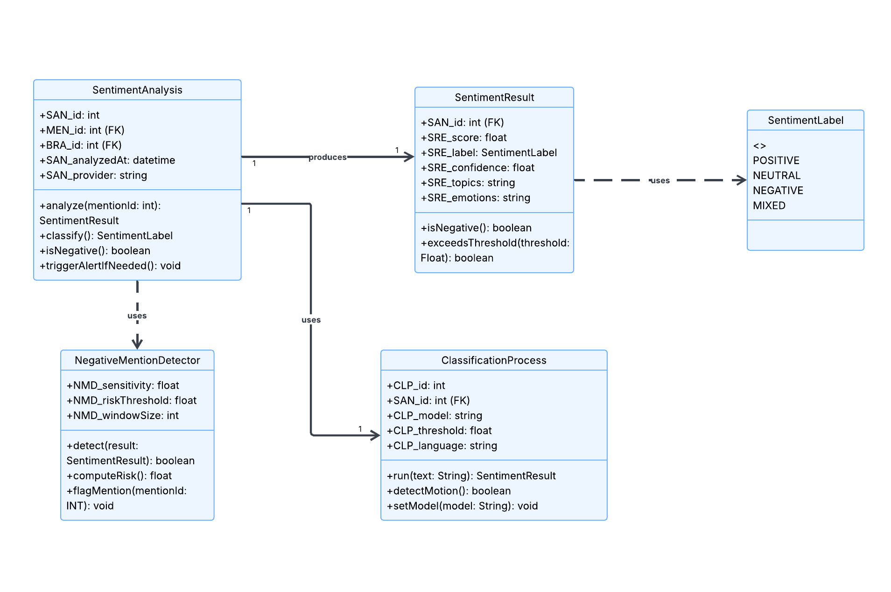

*Elaboración propia con LucidChart*

</div>

<br>

**Bounded Context: `Alert Management`**

<br>

Este *Bounded Context* gestiona el ciclo de vida de las alertas generadas a partir de menciones clasificadas como críticas por el *Sentiment Analysis Context*.

Cuando una mención supera el umbral de riesgo definido, el sistema genera una Alert y desencadena el proceso de notificación al usuario a través del canal configurado.

El usuario puede revisar la alerta, evaluar su contenido y ejecutar una acción de respuesta. Todas las acciones realizadas sobre la alerta quedan registradas en un log de auditoría, garantizando trazabilidad del proceso.

Este contexto permite a los usuarios de BrandRadar reaccionar de manera oportuna ante situaciones que puedan impactar la reputación de su marca.

<br>

<div align="center">
  
*Imagen del Class Diagram*

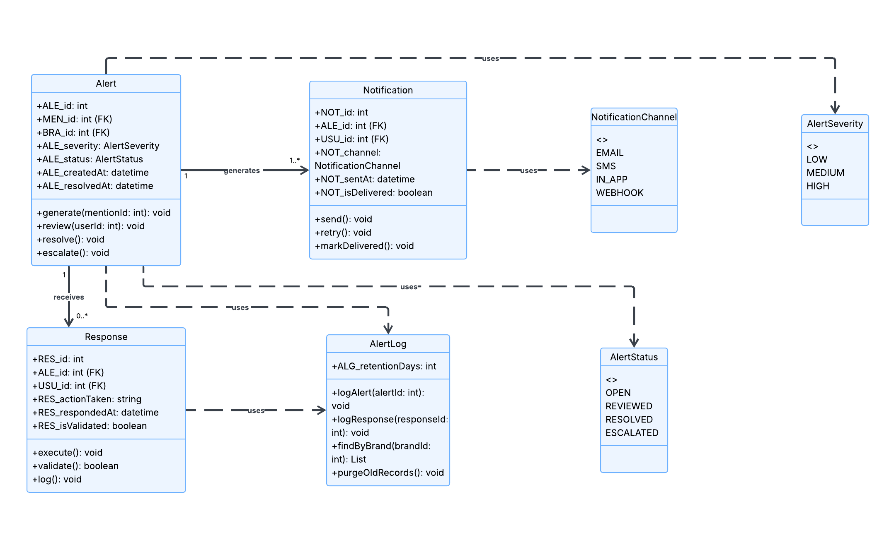

*Elaboración propia con LucidChart*

</div>

<br>

**Bounded Context: `Reporting`**

<br>

Este *Bounded Context* permite a los usuarios de BrandRadar visualizar y exportar los resultados del monitoreo y análisis de reputación de sus marcas.

A partir de los datos acumulados de menciones y análisis de sentimiento, el sistema calcula métricas de reputación correspondientes al período solicitado y las presenta en forma de dashboards en tiempo real y reportes exportables.

Este contexto representa la capa de visualización y síntesis del sistema, consolidando la información procesada para facilitar la toma de decisiones estratégicas por parte del *PyME Owner* o el *Agency Manager*.

<br>

<div align="center">
  
*Imagen del Class Diagram*

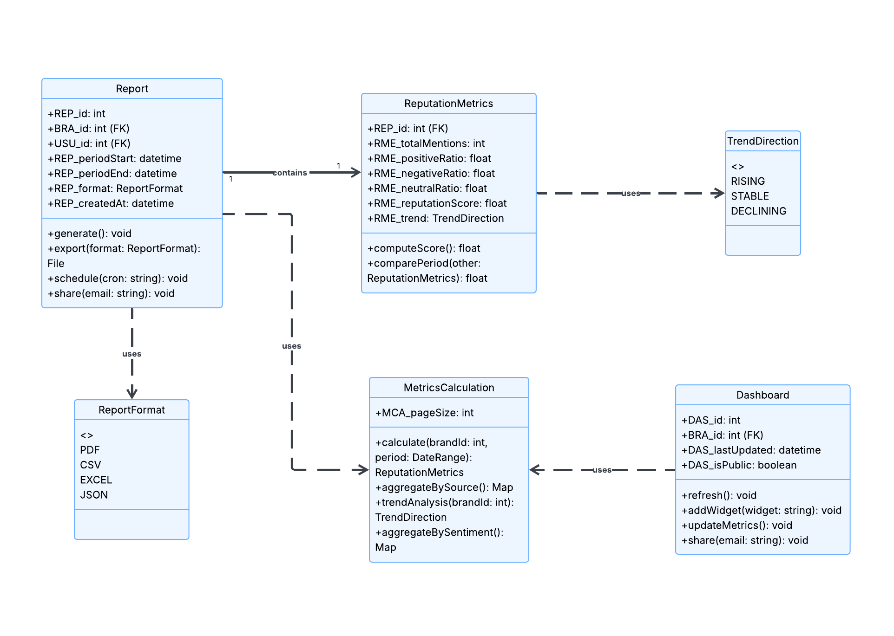

*Elaboración propia con LucidChart*

</div>

<br>

---

## 4.8. Database Design

>*El diseño de base de datos de BrandRadar define la capa de persistencia del sistema, donde se almacena la información generada y procesada por los distintos Bounded Contexts. Esta sección traduce el modelo orientado a objetos hacia un esquema relacional, definiendo tablas, columnas, tipos de datos, claves primarias, claves foráneas y restricciones necesarias para garantizar la integridad, consistencia y trazabilidad de los datos.*

*El diseño respeta los límites establecidos por los Bounded Contexts, organizando las tablas de forma modular según el dominio al que pertenecen.*

<br>

### 4.8.1. Database Diagrams

>*Los diagramas de base de datos representan el esquema relacional del sistema organizado por Bounded Context. Cada diagrama detalla las tablas correspondientes, incluyendo sus columnas, tipos de datos, claves primarias (PK), claves foráneas (FK) y relaciones con sus respectivas cardinalidades.*

*La nomenclatura de atributos sigue la convención definida en el modelo de clases, manteniendo consistencia entre el diseño orientado a objetos y la capa de persistencia, asegurando trazabilidad entre dominio y base de datos.*

<br>

<div align="center">
  
**Bounded Context: `Account Management (Database Diagram)`**

<br>

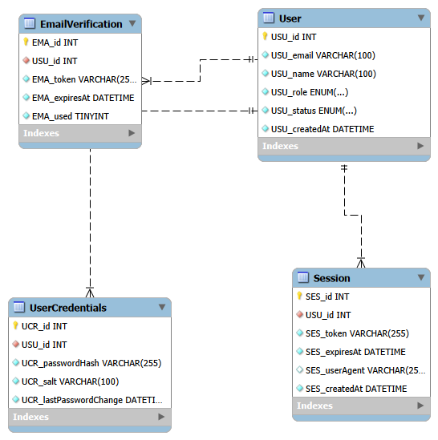

</div>

<br>

*El diagrama de base de datos del Bounded Context Account Management gestiona la identidad y el acceso de los usuarios del sistema. La entidad principal es la tabla User, que almacena la información base del usuario y actúa como raíz del agregado.*

*Esta tabla se relaciona con tres entidades dependientes: UserCredentials, que almacena las credenciales de autenticación; EmailVerification, que gestiona los tokens de verificación de correo electrónico; y Session, que registra las sesiones activas del usuario.*

*Todas las relaciones se establecen mediante claves foráneas hacia User, garantizando la integridad referencial dentro del contexto y manteniendo la consistencia del modelo de identidad.*


<br>

<div align="center">
  
**Bounded Context: `Brand Management (Database Diagram)`**

<br>

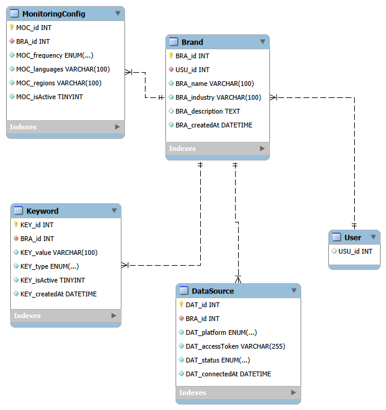

</div>

<br>

*El diagrama de base de datos del Bounded Context Brand Setup gestiona la configuración de las marcas dentro de BrandRadar. La entidad principal es la tabla Brand, que almacena la información base de cada marca y actúa como raíz del agregado.*

*Esta entidad se relaciona con tres componentes dependientes: Keyword, que define las palabras clave utilizadas para el monitoreo; DataSource, que representa las fuentes de datos externas conectadas al sistema; y MonitoringConfig, que almacena los parámetros de configuración del proceso de monitoreo.*

*Todas las relaciones se establecen mediante claves foráneas hacia Brand, garantizando la integridad referencial del contexto y manteniendo la consistencia de la configuración de cada marca.*

<br>

<div align="center">
  
**Bounded Context: `Monitoring (Database Diagram)`**

<br>

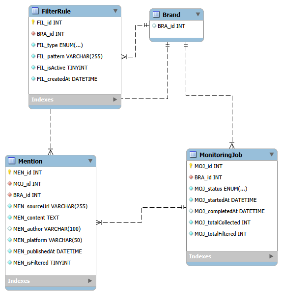

</div>

<br>

*El diagrama de base de datos del Bounded Context Monitoring gestiona el proceso de recolección automática de menciones desde fuentes de datos externas. La entidad principal es la tabla MonitoringJob, que registra cada ejecución del ciclo de monitoreo y actúa como raíz del proceso de recolección.*

*Esta entidad se relaciona con Mention, que almacena las publicaciones recolectadas desde las plataformas externas, y con FilterRule, que define las reglas de filtrado configuradas por cada marca para depurar contenido irrelevante antes de su persistencia.*

*Todas las relaciones se estructuran mediante claves foráneas dentro del contexto, asegurando la trazabilidad entre cada ejecución de monitoreo, las reglas aplicadas y las menciones obtenidas.*


<br>


<div align="center">
  
**Bounded Context: `Sentiment Analysis (Database Diagram)`**

<br>

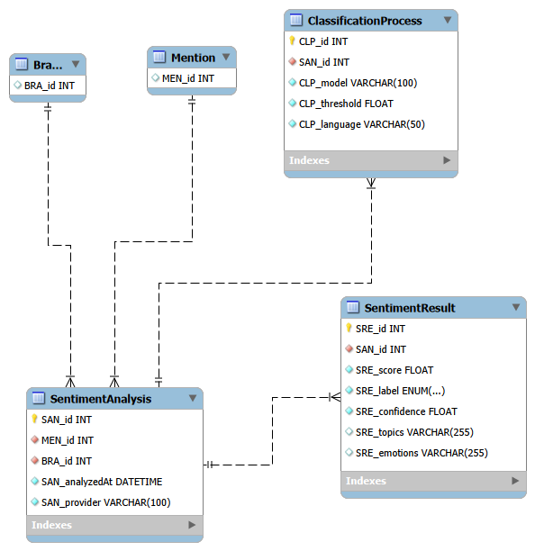

</div>

<br>

*El diagrama de base de datos del Bounded Context Sentiment Analysis gestiona el análisis de sentimiento aplicado a cada mención recolectada por el sistema.*

*La entidad principal es la tabla SentimentAnalysis, que registra cada proceso de análisis ejecutado sobre una mención. Esta se relaciona con SentimentResult, que almacena el resultado del análisis, incluyendo el score, la etiqueta de sentimiento y el nivel de confianza del modelo.*

*Adicionalmente, la tabla ClassificationProcess registra la configuración y parámetros del modelo utilizado en cada análisis, permitiendo la trazabilidad del proceso de clasificación.*


<br>


<div align="center">
  
**Bounded Context: `Alert Management (Database Diagram)`**

<br>

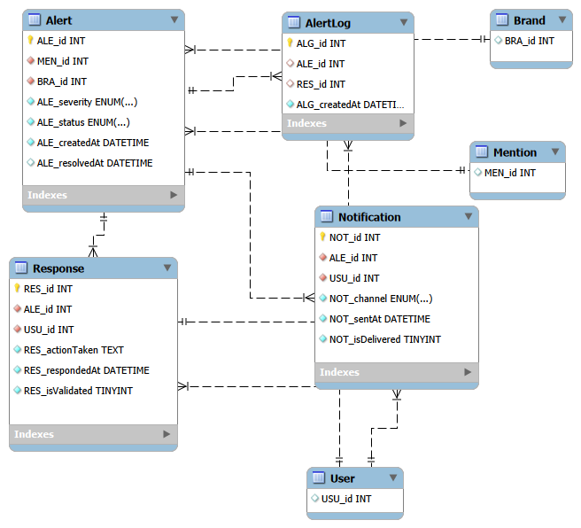

</div>

<br>

*El diagrama de base de datos del Bounded Context Alert Management gestiona el ciclo de vida de las alertas generadas a partir de menciones clasificadas como negativas.*

*La entidad principal es la tabla Alert, que registra cada alerta generada por el sistema. Esta se relaciona con Notification, que almacena los envíos de notificaciones al usuario, y con Response, que registra las acciones realizadas en respuesta a cada alerta.*

*La tabla AlertLog almacena el historial de auditoría de todo el proceso, garantizando la trazabilidad de las decisiones y acciones ejecutadas sobre cada alerta.*


<br>


<div align="center">
  
**Bounded Context: `Reporting (Database Diagram)`**

<br>

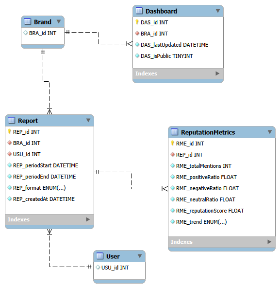

</div>

<br>

*El diagrama de base de datos del Bounded Context Reporting gestiona la generación, consolidación y visualización de resultados derivados del monitoreo y análisis de reputación de marca.*

*La entidad principal es la tabla Report, que registra cada reporte generado para una marca en un período determinado. Esta se relaciona con ReputationMetrics, que almacena las métricas calculadas a partir de las menciones y su análisis de sentimiento, correspondientes al rango de tiempo solicitado.*

*Adicionalmente, la tabla Dashboard mantiene el estado de visualización en tiempo real por marca, permitiendo representar indicadores actualizados de reputación y desempeño.*


<br>

---

<div align="center">

# Capítulo V: Product Implementation, Validation & Deployment

</div>

---

## 5.1. Software Configuration Management

### 5.1.1. Software Development Environment Configuration

En esta sección se describen las herramientas de software seleccionadas para dar soporte a las distintas fases del ciclo de vida del producto digital BrandRadar. Se incluyen sus nombres, objetivos específicos dentro del proyecto y los enlaces de acceso o descarga, diferenciando entre soluciones SaaS y aplicaciones instalables.

<br>

<div align="center">

**Gestión de Requisitos**

| Herramienta | Uso principal | Enlace |
|:---|:---|:---|
|  | Elaboración colaborativa de As-Is y To-Be Scenario Maps, así como Impact Maps para cada segmento objetivo. | [miro.com](https://miro.com) |
|  | Creación de User Personas, Empathy Maps, Journey Maps e Impact Maps para los segmentos Dueños de PyMEs y Directores de Agencias Digitales. | [uxpressia.com](https://uxpressia.com) |
|  | Seguimiento de proyectos con enfoque en historias de usuario, métricas de velocidad y visualización del estado de tareas por sprint. | [pivotaltracker.com](https://pivotaltracker.com) |


<br>

**Diseño de Experiencia y UI/UX**

| Herramienta | Uso principal | Enlace |
|:---|:---|:---|
|  | Diseño colaborativo de wireframes, mockups y prototipos de alta fidelidad de la aplicación web BrandRadar. | [figma.com](https://figma.com) |
|  | Elaboración de user flows, wireflows y diagramas de procesos o arquitectura. | [lucidchart.com](https://lucidchart.com) |
|  | Diseño colaborativo en tiempo real de mapas de experiencia (As-Is y To-Be Scenarios). | [miro.com](https://miro.com) |
|  | Creación de User Personas, Empathy Maps y Journey Maps para la validación de la experiencia de usuario. | [uxpressia.com](https://uxpressia.com) |

<br>

**Desarrollo de Software**

| Herramienta / Tecnología | Uso principal | Enlace |
|:---|:---|:---|
|  | Entorno de desarrollo integrado principal para escribir, editar y depurar el código de la aplicación. | [code.visualstudio.com](https://code.visualstudio.com) |
|  | Lenguaje de marcado para estructurar el contenido de la landing page y del dashboard de BrandRadar. | [MDN Web Docs](https://developer.mozilla.org/docs/Web/HTML) |
|  | Lenguaje de estilos para definir la apariencia visual de la landing page y la aplicación web. | [MDN Web Docs](https://developer.mozilla.org/docs/Web/CSS) |
|  | Framework principal para el desarrollo de la aplicación web con componentes reutilizables y enrutamiento. | [angular.io](https://angular.io) |
|  | Superconjunto tipado de JavaScript utilizado como lenguaje principal del proyecto Angular. | [typescriptlang.org](https://www.typescriptlang.org) |

<br>

**Pruebas de Software**

| Herramienta | Uso principal |
|:---|:---|
|  | Lenguaje para definir criterios de aceptación de las User Stories en formato legible por todos los integrantes del equipo (Given / When / Then). |

<br>

**Diseño de Arquitectura de Software**

| Herramienta | Uso principal | Enlace |
|:---|:---|:---|
|  | Modelado de la arquitectura del sistema con el enfoque C4 mediante la técnica Diagrams-as-Code. | [structurizr.com/dsl](https://structurizr.com/dsl) |
|  | Elaboración de diagramas UML y de arquitectura, compatible con la documentación técnica del proyecto. | [lucidchart.com](https://www.lucidchart.com/pages/es) |
|  | Diseño visual y profesional de bases de datos relacionales. | [mysql.com/products/workbench](https://www.mysql.com/products/workbench) |

<br>

**Control de Versiones y Colaboración**

| Herramienta | Uso principal | Enlace |
|:---|:---|:---|
|  | Sistema distribuido de control de versiones para la gestión del código fuente. | [git-scm.com](https://git-scm.com) |
|  | Repositorio remoto para almacenar, gestionar y colaborar en el código fuente. Incluye seguimiento de issues y revisión de Pull Requests. | [github.com](https://github.com) |
|  | Modelo de ramificación para mantener el código organizado en ramas (`main`, `develop`, `feature`, `release`, `hotfix`). | [nvie.com](https://nvie.com/posts/a-successful-git-branching-model) |
|  | Convención de mensajes de commit para mejorar la trazabilidad y facilitar la generación de changelogs. | [conventionalcommits.org](https://www.conventionalcommits.org) |

<br>

**Despliegue de Software**

| Herramienta / Plataforma | Uso principal | Enlace |
|:---|:---|:---|
|  | Despliegue automático y gratuito de la landing page directamente desde el repositorio de GitHub, con integración continua. | [netlify.com](https://www.netlify.com) |

<br>

**Documentación de Software**

| Herramienta / Recurso | Uso principal | Enlace |
|:---|:---|:---|
|  | Repositorio central de documentación mediante `README.md`, issues y wikis del proyecto. | [github.com](https://github.com) |
|  | Edición y mantenimiento del archivo `README.md` asociado a la documentación del proyecto. | [code.visualstudio.com](https://code.visualstudio.com) |

</div>
<br>

---

### 5.1.2. Source Code Management

El equipo utilizará Git como sistema de control de versiones y GitHub como plataforma centralizada para la gestión del repositorio del proyecto BrandRadar. Esta infraestructura permite registrar, rastrear y visualizar todos los cambios realizados en el código fuente, así como identificar la contribución individual de cada integrante del equipo a lo largo del ciclo de desarrollo.

<br>

El repositorio principal del proyecto se encuentra disponible en el siguiente enlace:

[https://github.com/Los-5-Suyos/BrandRadar-report](https://github.com/Los-5-Suyos/BrandRadar-report)

<br>

**Contribuciones del equipo:**

[https://github.com/Los-5-Suyos/BrandRadar-report/graphs/contributors](https://github.com/Los-5-Suyos/BrandRadar-report/graphs/contributors)

| Producto                 | Repositorio GitHub                                                                                   |
| :----------------------- | :--------------------------------------------------------------------------------------------------- |
| Organización Los 5 Suyos | [https://github.com/Los-5-Suyos](https://github.com/Los-5-Suyos)                                     |
| Landing Page             | [https://github.com/Los-5-Suyos/BrandRadar-Landing-Page](https://github.com/Los-5-Suyos/BrandRadar-Landing-Page)  |
| Report                   | [https://github.com/Los-5-Suyos/BrandRadar-report](https://github.com/Los-5-Suyos/BrandRadar-report) |
| Web Application          | [https://github.com/Los-5-Suyos/BrandRadar-Frontend-Web-App](https://github.com/Los-5-Suyos/BrandRadar-Frontend-Web-App)  |
| API / Backend            | [https://github.com/Los-5-Suyos/BrandRadar-Web-Services](https://github.com/Los-5-Suyos/BrandRadar-Web-Services)  |

<br>

**Modelo de Ramificación (GitFlow)**

El equipo adoptará la estrategia GitFlow Workflow, la cual permite organizar el desarrollo de manera estructurada mediante el uso de ramas especializadas.

Se definen dos ramas principales:

- main: contiene las versiones estables listas para producción.
- develop: integra las nuevas funcionalidades antes de su liberación.

<br>

| Tipo de rama | Uso principal                        | Convención de nombres        | Ejemplo                |
| :----------- | :----------------------------------- | :--------------------------- | :--------------------- |
| feature      | Desarrollo de nuevas funcionalidades | feature/<nombre-descriptivo> | feature/login-usuarios |
| release      | Preparación de versiones previas     | release/vX.Y.Z               | release/v1.0.0         |
| hotfix       | Corrección de errores en producción  | hotfix/<problema>            | hotfix/error-navbar    |


<br>

**Convención de Commits**

Para mantener consistencia y trazabilidad, los mensajes de commit seguirán la convención Conventional Commits.

Formato general:

*tipo(alcance opcional): descripción breve*

Tipos de commit definidos:

- feat: nueva funcionalidad
- fix: corrección de errores
- docs: cambios en documentación
- style: ajustes de formato
- refactor: cambios sin alterar funcionalidad
- test: pruebas
- chore: tareas de mantenimiento

<br>

---

### 5.1.3. Source Code Style Guide & Conventions

Con el objetivo de mantener un código ordenado, consistente y fácil de mantener entre todos los miembros del equipo, se han definido las siguientes convenciones para el proyecto BrandRadar. Estas normas aseguran una correcta colaboración y facilitan la escalabilidad del sistema.

<br>

**Convenciones Generales**

- Se utilizará inglés como idioma único para nombres de variables, funciones, clases, comentarios y documentación.
- Se evitarán abreviaciones innecesarias y nombres genéricos como data1, temp, info, etc.
- Los nombres deben ser descriptivos y reflejar claramente su propósito.
- Se prioriza la claridad del código sobre soluciones complejas.

<br>

### HTML

- Atributos en minúsculas.
- Nombres de clases usando kebab-case (ej. section-title, main-container).
- Uso de estructura semántica clara:
  - *header*
  - *nav*
  - *main*
  - *section*
  - *footer*
- Sangría de 2 espacios.
- Atributos ordenados de manera lógica:
- id, class, type, name, placeholder, value, required, etc.

<br>

### CSS

- Para clases personalizadas se utilizará kebab-case.
- Las clases se organizarán por orden lógico:
  - layout → spacing → color → typography
- Se evitarán estilos redundantes y se priorizará la reutilización.

<br>

### TypeScript

Basado en buenas prácticas de desarrollo, se adoptan las siguientes reglas:

Nombres y sintaxis:

- camelCase para variables, funciones y parámetros.
- PascalCase para clases, interfaces, enums y tipos.
- Constantes globales en UPPER_CASE_WITH_UNDERSCORES.

Módulos e imports:

- Imports ordenados:
    Librerías externas
    Módulos internos
- Evitar default export, usar:
    export const
    export class
  
Tipado:

- Tipar explícitamente parámetros y valores de retorno.
- Evitar any excepto cuando sea estrictamente necesario.
- Usar readonly en propiedades inmutables.
- Preferir interface sobre type cuando aplique.

Buenas prácticas:

- Preferir const sobre let y evitar var.
- Evitar el uso de this fuera de clases.
- Separar lógica de negocio de la capa de presentación.
- Mantener funciones pequeñas y reutilizables.

<br>

### Angular

Se seguirán buenas prácticas para mantener una arquitectura limpia:

Componentes:

- Nombres en PascalCase con sufijo Component
(ej. UserCardComponent)
- Separación de archivos:
    templateUrl para HTML
    styleUrls para CSS
- Evitar lógica compleja en los templates.

Buenas prácticas:

- No incluir lógica de negocio dentro de los componentes.
- Delegar procesos a servicios.
- Usar async en templates en lugar de suscripciones manuales.
- Selectores en kebab-case (ej. app-user-card).

<br>

### Pruebas (Gherkin)

En caso de utilizar especificaciones basadas en Gherkin:

- Se empleará el formato estándar:

```html
Given condición inicial  
When ocurre una acción  
Then se obtiene un resultado  
And condiciones adicionales  
```

<br>

---

### 5.1.4. Software Deployment Configuration

Para el despliegue de la Landing Page del proyecto BrandRadar, el equipo utiliza la plataforma Netlify, la cual permite integrar repositorios de GitHub y automatizar el proceso de publicación mediante integración continua.

A continuación, se describe el proceso de configuración del despliegue:

<br>


  
**1. Ingreso a Netlify**


Se accede a la plataforma mediante las credenciales de GitHub, utilizando la opción "Log in with GitHub".

<br>

<div align="center">

*Screenshot 1 del Deployment*


</div>
<br>


**2. Autorización de Netlify**

Se otorgan permisos a Netlify para acceder a los repositorios del equipo en GitHub.
Posteriormente, se ingresa a la sección "Sites" y se selecciona la opción "Add new site", seguido de "Import an existing project".

<br>
<div align="center">
  
*Screenshot 2 del Deployment*


</div>
<br>


  
**3. Selección del proveedor**

En la sección "Let’s deploy your project with...", se elige GitHub como proveedor de repositorios.

<br>
<div align="center">
  
*Screenshot 3 del Deployment*


</div>
<br>


  
**4. Selección del repositorio**

Se selecciona la organización del equipo Los 5 Suyos y luego el repositorio correspondiente a la Landing Page de BrandRadar.

<br>
<div align="center">
  
*Screenshot 4 del Deployment*


</div>
<br>

  
**5. Configuración del despliegue**

Se configuran los parámetros principales del despliegue:

Site Name: nombre del sitio web
Team: equipo del proyecto
Branch: main

<br>
<div align="center">
  
*Screenshot 5 del Deployment*


</div>
<br>
  
**6. Configuración final**

Se completa la configuración indicando:

Publish directory: public (o la carpeta de salida del proyecto)

Finalmente, se selecciona la opción "Deploy site" para iniciar el proceso.


<br>
<div align="center">
  
*Screenshot 6 del Deployment*


</div>
<br>
  
**7. Despliegue completado**

Una vez finalizado el proceso, Netlify genera automáticamente un enlace público donde se puede visualizar la Landing Page desplegada.

<br>
<div align="center">
  
*Screenshot 7 del Deployment*


</div>
<br>

**Integración Continua**

<br>

Con la configuración realizada, el despliegue queda automatizado.
Cada vez que se realiza un push en la rama main, Netlify ejecuta un nuevo despliegue de manera automática, actualizando la aplicación sin necesidad de repetir el proceso manual.

<br>

*Enlace de la Landing Page*

(Agregar aquí el link de tu deploy en Netlify)

<br>

---

## 5.2. Landing Page, Services & Applications Implementation

### 5.2.1. Sprint 1

#### 5.2.1.1. Sprint Planning 1

El Sprint Planning 1 tuvo como objetivo principal completar y desplegar la Landing Page del proyecto BrandRadar, estableciendo así una primera versión funcional y accesible para los usuarios.

Durante este sprint, el equipo definió las tareas necesarias para finalizar el desarrollo visual y estructural de la Landing Page, asegurando el cumplimiento de los lineamientos de diseño responsive y experiencia de usuario previamente establecidos. Asimismo, se planificó la integración con el repositorio en GitHub y su posterior despliegue en la plataforma Netlify.

Entre las actividades principales se incluyeron:

- Finalización de secciones clave de la Landing Page (Home, Features, About, Contact).
- Ajustes de estilos y diseño responsive.
- Optimización de componentes y estructura HTML/CSS.
- Configuración del despliegue continuo mediante Netlify.
- Publicación de la versión inicial accesible mediante un enlace web.

Como resultado del Sprint Planning, el equipo estableció un conjunto claro de tareas priorizadas, permitiendo organizar el trabajo de manera eficiente y cumplir con el objetivo de contar con una Landing Page completamente funcional y desplegada al finalizar el sprint.

<br>

| Campo | Detalle |
|:------|:--------|
| **Sprint #** | Sprint 1 |
| **Date** | 2026-04-15 |
| **Time** | 18:00 PM |
| **Location** | Llamada por la plataforma de discord |
| **Prepared By** | Salinas Guzmán, Brianna Cristina |
| **Attendees** | Salinas, Brianna / Cruzalegui, Joaquin / Jáuregui, Jean  / García, Victor / Acuña, Luis|
| **Sprint 0 Review Summary** | Se finalizó la etapa de investigación y diseño de arquitectura base. El equipo cuenta con los mock-ups de alta fidelidad listos para iniciar la implementación de la Landing Page. |
| **Sprint 0 Retrospective Summary** | El equipo muestra compromiso, pero se debe reforzar el flujo de GitFlow para evitar conflictos en la integración de las secciones de la Landing Page. |
| **Sprint 1 Goal** | Nuestro enfoque es el desarrollo y despliegue de la Landing Page de BrandRadar. Creemos que entrega valor al permitir la captación de leads y visibilidad de marca. Esto se confirmará cuando todas las secciones estén integradas y funcionales en Netlify. |
| **Sprint 1 Velocity** | 45 |
| **Sum of Story Points** | 35 |

<br>

---

#### 5.2.1.2. Aspect Leaders and Collaborators

Ahora presentaremos nuestro LACX (Leadership-and-Collaboration Matrix) que nos ayudará a saber quién lidera y quién colabora en cada aspecto de este primer sprint. En base a la coordinación del equipo, se asignaron los siguientes liderazgos para los componentes de la Landing Page:

| Team Member (Last Name, First Name) | GitHub Username | `[Header + Hero]` | `[Características]` | `[Beneficios + Métricas]` | `[DashBoard + Testimonios]` | `[Precios + CTA + Footer]` |
|:-----------------------------------:|:---------------:|:-------------:|:-------------:|:-------------:|:-------------:|:-------------:|
| Salinas, Brianna | brianna-salinas | L | C | C | C | C |
| García, Victor | vicmacode | C | L | C | C | C |
| Jáuregui, Jean | JFranco556 | C | C | L | C | C |
| Acuña, Luis | L2006delacruz | C | C | C | L | C |
| Cruzalegui, Joaquin | JoaquinCruzalegui | C | C | C | C | L |

> **L** = Leader &nbsp;|&nbsp; **C** = Collaborator

<br>

---

#### 5.2.1.3. Sprint Backlog 1

El objetivo principal del Sprint 1 es diseñar, implementar y desplegar la Landing Page del proyecto BrandRadar, permitiendo presentar la propuesta de valor, funcionalidades principales, planes de suscripción y canales de contacto.

Este sprint se enfoca en construir una primera versión funcional orientada al usuario final, priorizando la experiencia visual, la estructura responsive y la claridad del mensaje del producto. Asimismo, el despliegue permitirá validar la aceptación inicial del producto y establecer una base sólida para futuras iteraciones.

A continuación, se detallan las User Stories seleccionadas y las tareas asociadas:

| Sprint #     |                           |        |                      |                                                                |                    |                |
| :----------- | :------------------------ | :----- | :------------------- | :------------------------------------------------------------- | :----------------- | :------------- |
| **Sprint 1** | **User Story**            |        | **Work-Item / Task** |                                                                |                    |                |
| **ID**       | **Título**                | **ID** | **Título**           | **Descripción**                                                | **Estimación (h)** | **Asignado a** |
| US20         | Interfaz Responsiva       | T01    | Header & Hero UI     | Implementar sección de navegación y primer impacto visual      | 6                  | Brianna         |
| US20         | Interfaz Responsiva       | T02    | Features Section     | Desarrollo de la sección de características clave del servicio | 5                  | Victor         |
| US03         | Live Feed Monitor         | T03    | Benefits & Metrics   | Maquetación de beneficios y visualización de datos de marca    | 7                  | Jean           |
| US07         | Word Cloud de Sentimiento | T04    | Social Proof UI      | Implementar sección de dashboard y reseñas de usuarios         | 6                  | Luis           |
| US17         | Onboarding interactivo    | T05    | Conversion & Footer  | Implementar tablas de precios, CTA y pie de página corporativo | 5                  | Joaquin        |

<br>

---

#### 5.2.1.4. Development Evidence for Sprint Review

Durante el Sprint 1, el equipo se enfocó en establecer la base técnica de BrandRadar mediante el uso de estándares web modernos: HTML5 para la estructura y CSS3 para el diseño visual. Se priorizó una arquitectura de estilos modular, donde cada componente de la Landing Page cuenta con su propia hoja de estilos, facilitando el trabajo paralelo y evitando conflictos en el código.

Se adoptó el flujo GitFlow, organizando el desarrollo en ramas de características (feature/) que permitieron a los integrantes trabajar de forma independiente en el Header, Hero, Beneficios y demás secciones, antes de consolidar el producto final en la rama develop para su revisión. 

El desarrollo se realizó en el repositorio público https://github.com/Los-5-Suyos/BrandRadar-Landing-Page, utilizando un flujo de ramas basado en feature branches.

| Repository | Branch | Commit ID | Commit Message | Commit Message Body | Committed on (Date) |
|:----------:|:------:|:---------:|:--------------:|:-------------------:|:-------------------:|
| Los-5-Suyos/BrandRadar-Landing-Page | main | b148470 | `initial commit | Configuración inicial del repositorio y README base | 2026-04-13 |
| Los-5-Suyos/BrandRadar-Landing-Page | develop | f3aaaf1 | feat: project structure setup | Creación de carpetas e integración de estilos CSS base | 2026-04-13 |
| Los-5-Suyos/BrandRadar-Landing-Page | feature/brianna | f85e590 | feat: add header and hero | Implementación de navegación e impacto visual con CSS nativo | 2026-04-19 |
| Los-5-Suyos/BrandRadar-Landing-Page | feature/victor | b5b80f6 | feat: add features section | Desarrollo de la cuadrícula de servicios usando CSS | 2026-04-DD |
| Los-5-Suyos/BrandRadar-Landing-Page | feature/jfranco | 09c0f86 | feat: add benefits and metrics | Maquetación de beneficios y métricas con estilos personalizados | 2026-04-22 |
| Los-5-Suyos/BrandRadar-Landing-Page | feature/luis | 6272bc2 | feat: add dashboard and social proof | Implementación de testimonios y previsualización de Dashboard | 2026-04-23 |
| Los-5-Suyos/BrandRadar-Landing-Page | feature/Joaquin | 68319a2 | feat: add pricing and footer | Diseño de tablas de precios y cierre de página con CSS responsivo | 2026-04-22 |
| Los-5-Suyos/BrandRadar-Landing-Page | develop | d9812fb | merge: final integration | Fusión de ramas para el despliegue final en producción | 2026-04-23 |
| | | | | | |

<br>

---

#### 5.2.1.5. Execution Evidence for Sprint Review

Durante el Sprint 1 se completó la Landing Page de BrandRadar, cumpliendo con los objetivos de diseño responsivo y captación de interés. El producto permite una navegación fluida y cuenta con interactividad avanzada gracias a la implementación de scripts de scroll y observadores de intersección.

- El desarrollo se validó mediante:

- Interactividad: Menú hamburguesa funcional para móviles y efectos de sombra dinámicos en el header.

- Secciones integradas: Hero (Brianna), Características (Victor), Beneficios (Jean Franco), Dashboard/Testimonios (Luis) y Precios/Footer (Joaquin).

- Rendimiento: Uso de técnicas de carga diferida visual para la aparición de elementos de la interfaz.

A continuación se muestran las capturas de las vistas desarrolladas 

<br>

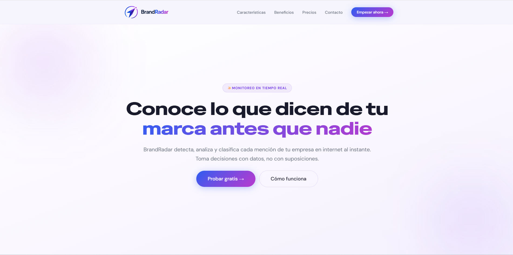


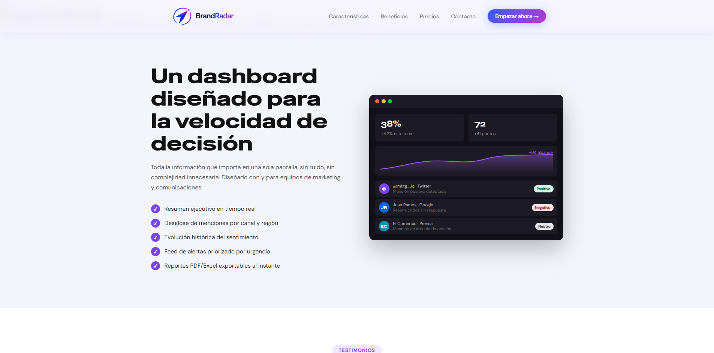

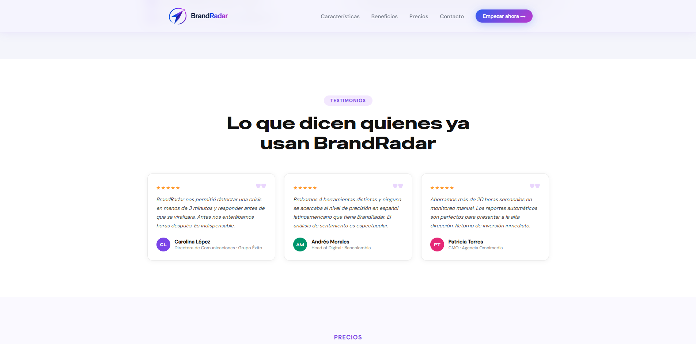

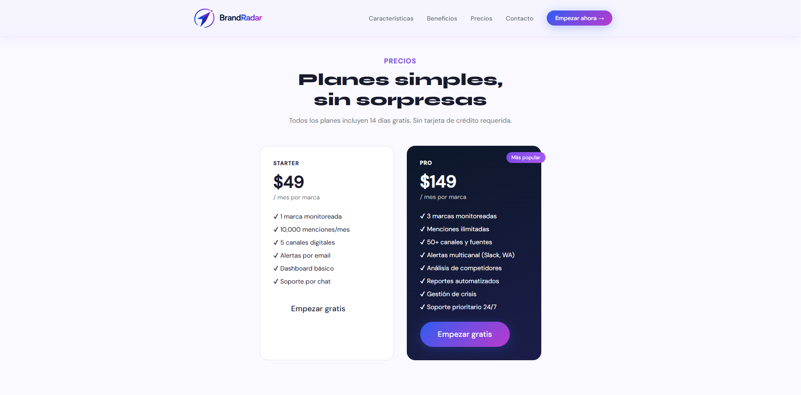

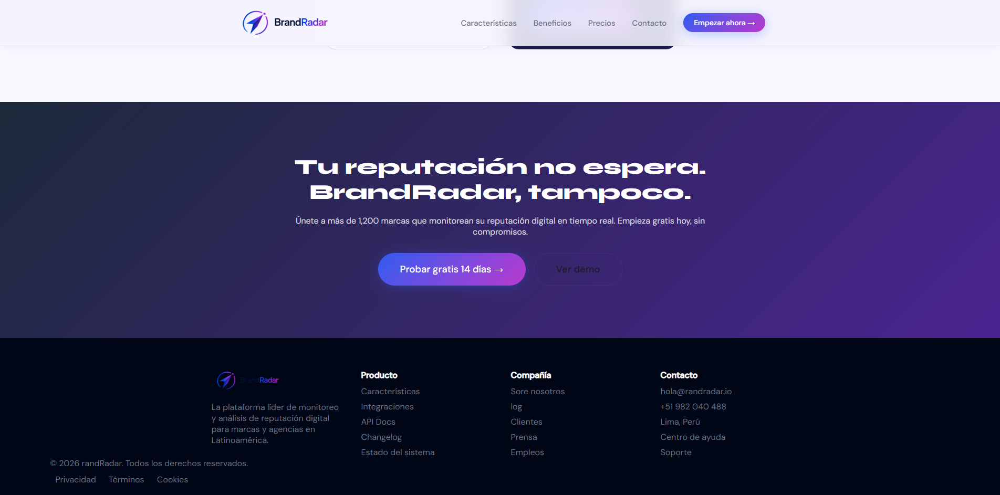

<br>

Asimismo, se elaboró un video demostrativo que muestra la navegación de la Landing Page y explica cada una de las secciones implementadas:

[Ver video de ejecución Sprint 1](`URL`)

<br>

---

#### 5.2.1.6. Services Documentation Evidence for Sprint Review

Durante el Sprint 1, el alcance del proyecto estuvo centrado estrictamente en la implementación del Frontend (Landing Page). Por lo tanto, no se desarrollaron servicios de backend asociados a la lógica de negocio ni se expusieron endpoints funcionales en esta etapa.

Sin embargo, el equipo ha definido preliminarmente la estructura de los servicios necesarios para la captación de leads que se integrarán en futuros ciclos, dejando preparada la base de la documentación técnica (OpenAPI/Swagger) para asegurar la trazabilidad del desarrollo.

<br>

---

#### 5.2.1.7. Software Deployment Evidence for Sprint Review

Durante el Sprint 1 se realizó el despliegue de la Landing Page del proyecto BrandRadar utilizando la plataforma Netlify, integrada con el repositorio en GitHub.

El despliegue fue configurado mediante integración continua (CI/CD), permitiendo que la aplicación se publique automáticamente cada vez que se realizan cambios en la rama principal (main) del repositorio.

 **Proceso seguido**
  1. Ingresar a la plataforma Netlify utilizando la opción “Log in with GitHub”.
  2. Autorizar el acceso de Netlify a los repositorios del equipo.
  3. Seleccionar la opción “Add new site” → “Import an existing project”.
  4. Elegir GitHub como proveedor del repositorio.
  5. Seleccionar la organización Los 5 Suyos y el repositorio de la Landing Page.
  6. Configurar los parámetros de despliegue: Branch: main, Publish directory: public (o carpeta de salida del proyecto)
  7. Ejecutar el proceso de despliegue mediante la opción “Deploy site”.
  8. Esperar la confirmación de despliegue exitoso.
  9. Acceder a la URL pública generada por Netlify.

<br>
 **URL del despliegue**

 (Agregar aquí el enlace de tu Landing Page en Netlify)

 **Evidencias**

A continuación, se presentan capturas del proceso de despliegue y del resultado final:


<br>

---

#### 5.2.1.8. Team Collaboration Insights during Sprint

El equipo utilizó la estrategia GitFlow para gestionar el desarrollo paralelo. Cada integrante trabajó en su propia rama de característica (feature/brianna, feature/victor, etc.), las cuales fueron fusionadas en la rama develop tras pasar una revisión de código básica.

Métricas de colaboración:

Commits: Se registró una actividad constante de los 5 miembros, con picos de integración los días previos a la entrega.

Roles: La matriz de trabajo permitió que cada componente tuviera un líder responsable, evitando la duplicidad de trabajo.

Gráfico de red de ramas en el repositorio de GitHub evidenciando la integración de las 5 ramas de características en la rama develop.

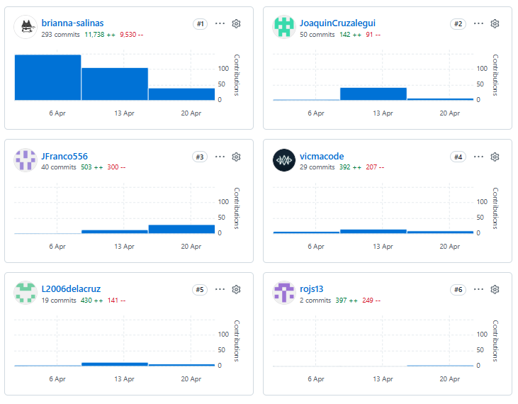

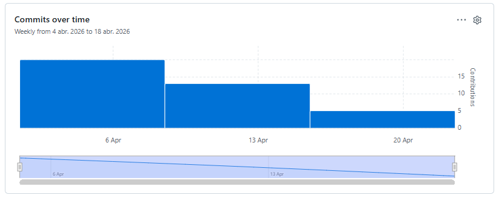

<br>

---


<br>

## Conclusiones


1. Durante el Avance 1 se estableció una base sólida del proyecto BrandRadar, definiendo la identidad de la startup, así como su misión, visión y propuesta de valor orientada al monitoreo de reputación digital en tiempo real para PyMEs y agencias de marketing digital.

2. El proceso de investigación mediante entrevistas semiestructuradas a 5 usuarios reales (3 del segmento PyMEs y 2 del segmento de especialistas en marketing) permitió validar la problemática identificada, evidenciando que el monitoreo manual, fragmentado y tardío de la reputación digital es un dolor relevante y compartido por ambos segmentos objetivo.

3. A partir del proceso de needfinding se elaboraron artefactos clave como User Personas, User Journey Maps, Empathy Maps y la User Task Matrix, los cuales permitieron comprender en profundidad las necesidades, frustraciones y comportamientos de los usuarios, sirviendo como base para las decisiones de diseño.

4. El proceso de Big Picture Event Storming permitió modelar el flujo completo del dominio del negocio, identificando eventos, actores, comandos y agregados del sistema, lo que facilitó la definición de seis Bounded Contexts: Account Management, Brand Management, Monitoring, Sentiment Analysis, Alert Management y Reporting.

5. Se definió un Product Backlog de 45 User Stories organizadas en 10 Epics, priorizadas según el valor aportado a los segmentos objetivo, estableciendo una hoja de ruta clara para el desarrollo incremental del producto.

6. Se diseñó la interfaz de usuario de la landing page en versiones desktop y mobile, incluyendo wireframes y mock-ups desarrollados en Figma, y se implementó una primera versión funcional desplegada mediante servicios como GitHub Pages y Vercel/Netlify.

7. El diseño de la arquitectura del sistema, a través de diagramas de clases por bounded context y diagramas de base de datos relacionales, evidencia una estructura técnica coherente, modular y escalable, que servirá como base para el desarrollo en las siguientes iteraciones.

<br>

## Recomendaciones

1. Para la siguiente etapa del proyecto, se recomienda avanzar en la validación de la solución mediante prototipos de alta fidelidad, con el objetivo de evaluar la usabilidad del sistema en escenarios reales con usuarios de los segmentos identificados.

2. Se sugiere profundizar en la definición y refinamiento de los requerimientos funcionales y no funcionales, asegurando su alineación directa con los insights obtenidos en las entrevistas y el proceso de needfinding.}

3. Se recomienda iterar el Lean UX Canvas con validaciones adicionales de las hipótesis críticas del producto, incorporando feedback temprano de usuarios potenciales antes de avanzar a fases de desarrollo más complejas.

4. Se sugiere analizar con mayor detalle las fuentes de datos externas y sus mecanismos de integración, evaluando su viabilidad técnica, limitaciones de acceso (APIs, rate limits) y escalabilidad para el monitoreo en tiempo real.

5. Finalmente, se recomienda mantener un enfoque iterativo, centrado en el usuario y basado en evidencia, incorporando retroalimentación continua en cada fase del desarrollo para asegurar la evolución del producto en función de necesidades reales del mercado.

<br>

## Video About-The-Team

Este apartado será desarrollado en la **entrega final del proyecto**, donde se incluirá el video de presentación del equipo.

En la versión final del informe se incorporarán los siguientes elementos:

- Captura representativa del video
- URL del video en Microsoft Stream  
- URL del video en YouTube  
- Estructura o timing del contenido presentado (introducción, desarrollo y cierre)

El video tiene como objetivo presentar a los integrantes del equipo, sus roles, principales contribuciones y la experiencia obtenida durante el desarrollo del proyecto BrandRadar.

<br>

---


##  Bibliografía

> Backlinko. (2024). *Online review statistics.* https://backlinko.com/online-review-stats

> BrightLocal. (2026). *Local consumer review survey 2026.* https://www.brightlocal.com/research/local-consumer-review-survey/

> Capital One Shopping Research. (2026). *Online reviews statistics.* https://capitaloneshopping.com/research/online-reviews-statistics/

> HubSpot. (2024). State of Marketing Report. https://www.hubspot.com/marketing-statistics

> Ott, M., Cardie, C., & Hancock, J. T. (2012). *Estimating the prevalence of deception in online review communities*. https://arxiv.org/abs/1204.2804

> ReputationUP. (2024). *Qué es la reputación digital y cómo gestionarla.* https://reputationup.com/es/reputacion-digital/

> Ruby, D. (2025, December 30). *30 latest online review statistics 2026 (updated data).* DemandSage. https://www.demandsage.com/online-review-statistics/

> Statista. (2024). *Online reviews - statistics & facts.* https://www.statista.com/topics/4381/online-reviews/

<br>

---

<br>

## Anexos


### Anexo A: Participant Performance Report

El *Participant Performance Report* se adjunta como documento independiente en formato Word y PDF, donde se detalla el nivel de participación, contribuciones y desempeño de cada integrante del equipo a lo largo del desarrollo del presente proyecto.

En este documento se incluyen los criterios de evaluación, evidencias de trabajo y la distribución de responsabilidades asumidas por cada miembro del equipo.

<br>

### Anexo B: Videos de Exposiciones

| Entrega | Título | Enlace |
|:-------:|:------:|:------:|
| AV1 | `upc-pre-202610-1asi0729-[11863]-[brandradar]-expo-av1` | `[URL Microsoft Stream]` |


---

<div align="center">

<br>

*BrandRadar · Desarrollo de Aplicaciones Open Source · UPC 2026-10*

</div>
