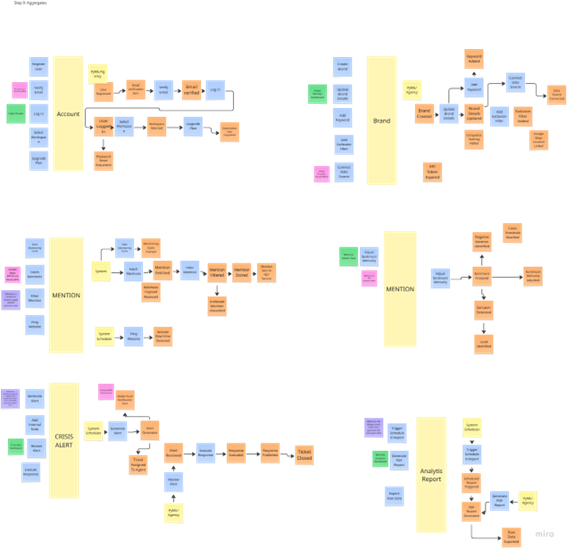
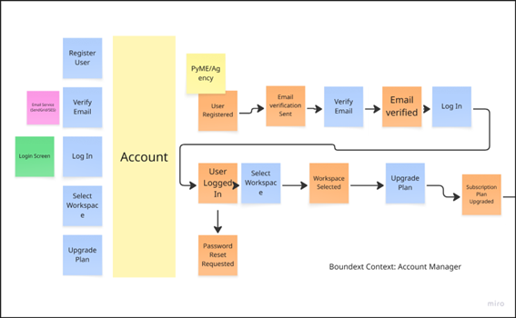
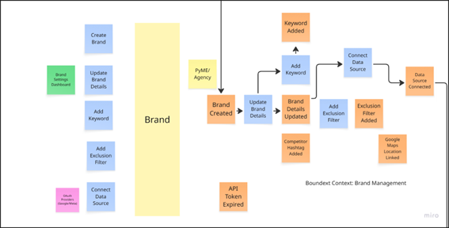
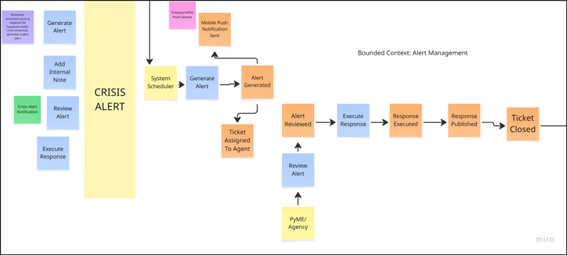

<div align="center">

<br>


# Universidad Peruana de Ciencias Aplicadas
### Facultad de Ingeniería · Ciclo 2026-10

<br>

#  Informe de Proyecto - TB1

## Presentado por "Los 5 Suyos"


## Startup analizada: BrandRadar

*Monitoreo de reputación digital en tiempo real para marcas y empresas*

<br>

**Código del Curso:** 1ASI0729 &nbsp;|&nbsp; **Nombre del Curso:** Desarrollo de Aplicaciones Open Source

**NRC:** `11863`

**Profesor:** Ivan Robles Fernández

<br>

### Integrantes de ´Los 5 Suyos´

`U20410239` - `Salinas Guzmán, Brianna Cristina` 

`U202410024` - `Jáuregui Cerna, Jean Franco` 

`U202411354` - `Cruzalegui Herrera, Joaquin` 

`U202012001` - `Garcia Paredes, Victor Manuel` 

`U202417228` - `Acuña de la Cruz, Luis` 

<br>

### **Mayo 2026**

<br>

</div>

---

<br>
<div align="center">
  
##  Registro de Versiones del Informe

| Versión | Fecha | Participantes | Descripción de modificación |
|:-------:|:-----:|:-----:|:---------------------------|
| AV1 | 2026-04-08 | Salinas Guzmán, Brianna Cristina <br> Jáuregui Cerna, Jean Franco <br> Cruzalegui Herrera, Joaquin <br> Garcia Paredes, Victor Manuel <br> Acuña de la Cruz, Luis | Avance 1 del reporte del proyecto y primera versión de la landing page |
| TB1 | 2026-05-11 | Salinas Guzmán, Brianna Cristina  | Entrega del reporte TB1 del proyecto, nueva version del landing page y frontend web application desplegadas |
</div>

---

<br>

##  Project Report Collaboration Insights

<div align="center">
<br>

  
**URL del Repositorio:** [`link`](link)

<br>

Para el desarrollo del AV1, cada integrante contribuyó de la siguiente manera al desarrollo del avance 1:

| Integrante | Tareas Realizadas |
|------------|------------------|
| Salinas Guzmán, Brianna Cristina | Elaboración del Student Outcome, registro de entrevistas, redacción del Capítulo I: Introducción, desarrollo de la sección 4.3 (Landing Page UI Design), modelado de diagramas de clases (4.7.1), diseño de base de datos (4.8), así como redacción de conclusiones y recomendaciones. |
| Jáuregui Cerna, Jean Franco |  Elaboración del Student Outcome, registro de entrevistas, desarrollo del Capítulo III (Requirements Specification) y Capítulo IV (Product Design), incluyendo lineamientos de estilo general y web (4.1), así como el diseño UX/UI de aplicaciones web (4.4). |
| Cruzalegui Herrera, Joaquin | Elaboración del Student Outcome, registro de entrevistas, participación en el Capítulo II, desarrollo de herramientas de análisis como User Task Matrix, User Journey Mapping y Empathy Mapping (2.3), modelado de eventos (2.4), definición de lenguaje ubicuo (2.5) y desarrollo del Sprint 1 (5.2.1). |
| Garcia Paredes, Victor Manuel | Elaboración del Student Outcome, registro de entrevistas, desarrollo de la sección 1.3 (Segmentos objetivo), participación en el Capítulo II (Requirements Elicitation & Analysis), prototipado de aplicaciones web (4.5), desarrollo de arquitectura basada en Domain-Driven Design (4.6) y diseño orientado a objetos (4.7). |
| Acuña de la Cruz, Luis | Elaboración del Student Outcome, registro de entrevistas, desarrollo de la arquitectura de información (4.2), incluyendo sistemas de organización, etiquetado, búsqueda y navegación, así como participación en el Capítulo V (Product Implementation, Validation & Deployment) y gestión de configuración del software (5.1 y 5.2). |

<br>
<br>

**TB1 Collaboration Insights**

Para el desarrollo del TB1, cada integrante contribuyó de la siguiente manera:

| Integrante | Tareas Realizadas |
|------------|------------------|
| Salinas Guzmán, Brianna Cristina | Tareas TB1 |
| Jáuregui Cerna, Jean Franco |  Tareas TB1 |
| Cruzalegui Herrera, Joaquin | Tareas TB1 |
| Garcia Paredes, Victor Manuel | Tareas TB1 |
| Acuña de la Cruz, Luis | Tareas TB1 |

</div>

<br>

### Gestión del repositorio en GitHub

En el repositorio de GitHub se evidencia una línea de tiempo que refleja la evolución del proyecto, incluyendo las principales ramas creadas por cada integrante del equipo, así como los procesos de integración (merge) realizados. Asimismo, la gestión de dichas ramas se llevó a cabo siguiendo el flujo de trabajo GitFlow, el cual fue adaptado a las necesidades del equipo para garantizar una adecuada organización, el control de versiones y el desarrollo colaborativo del proyecto. 

Este enfoque permitió mantener una estructura ordenada durante el desarrollo, evitando conflictos entre versiones y facilitando la integración del trabajo en equipo.


<br>

<div align="center">

### Integrantes y usuarios de GitHub

| Integrante | Usuario GitHub |
|------------|----------------|
| Salinas Guzmán, Brianna Cristina | brianna-salinas |
| Jáuregui Cerna, Jean Franco | JFranco556 |
| Cruzalegui Herrera, Joaquin | JoaquinCruzalegui |
| Garcia Paredes, Victor Manuel | vicmacode |
| Acuña de la Cruz, Luis | L2006delacruz |

</div>


<br>

## Ramas principales del repositorio

- **main**: Rama principal que contiene la versión estable del proyecto.
- **develop**: Rama de desarrollo donde se integran las nuevas funcionalidades antes de ser fusionadas a `main`.
- **feature/sprintX-brianna**: Rama destinada al desarrollo de las tareas asignadas a Brianna en cada sprint.
- **feature/sprintX-jfranco**: Rama destinada al desarrollo de las tareas asignadas a Jean Franco en cada sprint.
- **feature/sprintX-joaquin**: Rama destinada al desarrollo de las tareas asignadas a Joaquin en cada sprint.
- **feature/sprintX-victor**: Rama destinada al desarrollo de las tareas asignadas a Victor en cada sprint.
- **feature/sprintX-luis**: Rama destinada al desarrollo de las tareas asignadas a Luis en cada sprint.
  
Esta estructura de ramas permite un desarrollo organizado y paralelo, facilitando la integración de cambios y reduciendo conflictos durante el proceso de desarrollo.

---

<br>

## AV1 - Network Graph

A continuación, se presenta el gráfico de red (network graph) del repositorio del proyecto, el cual permite visualizar la estructura de ramas, así como la interacción entre ellas a través de los procesos de integración (merge).

<br>

<div align="center">

</div>

<br>

A continuación, se muestran los gráficos con el análisis de los commits realizados en el repositorio. Estos reflejan tanto la cantidad de líneas de código añadidas por cada integrante del equipo como la actividad de commits registrada.

<br> <br>

<div align="center">

</div>

<br>

---

<br>

##  Tabla de Contenidos
  #### [Contenido](#-tabla-de-contenidos)
  #### [Student Outcome](#student-outcome-1)

  #### [Capítulo I: Introducción](#capítulo-i-introducción-1)
  - [1.1. Startup Profile](#11-startup-profile)
    - [1.1.1. Descripción de la Startup](#111-descripción-de-la-startup)
    - [1.1.2. Perfiles de integrantes del equipo](#112-perfiles-de-integrantes-del-equipo)
  - [1.2. Solution Profile](#12-solution-profile)
    - [1.2.1. Antecedentes y problemática](#121-antecedentes-y-problemática)
    - [1.2.2. Lean UX Process](#122-lean-ux-process)
      - [1.2.2.1. Lean UX Problem Statements](#1221-lean-ux-problem-statements)
      - [1.2.2.2. Lean UX Assumptions](#1222-lean-ux-assumptions)
      - [1.2.2.3. Lean UX Hypothesis Statements](#1223-lean-ux-hypothesis-statements)
      - [1.2.2.4. Lean UX Canvas](#1224-lean-ux-canvas)
  - [1.3. Segmentos objetivo](#13-segmentos-objetivo)
 
  #### [Capítulo II: Requirements Elicitation & Analysis](#capítulo-ii-requirements-elicitation--analysis-1)
  - [2.1. Competidores](#21-competidores)
    - [2.1.1. Análisis competitivo](#211-análisis-competitivo)
    - [2.1.2. Estrategias y tácticas frente a competidores](#212-estrategias-y-tácticas-frente-a-competidores)
  - [2.2. Entrevistas](#22-entrevistas)
    - [2.2.1. Diseño de entrevistas](#221-diseño-de-entrevistas)
    - [2.2.2. Registro de entrevistas](#222-registro-de-entrevistas)
    - [2.2.3. Análisis de entrevistas](#223-análisis-de-entrevistas)
  - [2.3. Needfinding](#23-needfinding)
    - [2.3.1. User Personas](#231-user-personas)
    - [2.3.2. User Task Matrix](#232-user-task-matrix)
    - [2.3.3. User Journey Mapping](#233-user-journey-mapping)
    - [2.3.4. Empathy Mapping](#234-empathy-mapping)
  - [2.4. Big Picture Event Storming](#24-big-picture-event-storming)
  - [2.5. Ubiquitous Language](#25-ubiquitous-language)
    
  #### [Capítulo III: Requirements Specification](#capítulo-iii-requirements-specification-1)
  - [3.1. User Stories](#31-user-stories)
  - [3.2. Impact Mapping](#32-impact-mapping)
  - [3.3. Product Backlog](#33-product-backlog)
    
  #### [Capítulo IV: Product Design](#capítulo-iv-product-design-1)
  - [4.1. Style Guidelines](#41-style-guidelines)
    - [4.1.1. General Style Guidelines](#411-general-style-guidelines)
    - [4.1.2. Web Style Guidelines](#412-web-style-guidelines)
  - [4.2. Information Architecture](#42-information-architecture)
    - [4.2.1. Organization Systems](#421-organization-systems)
    - [4.2.2. Labeling Systems](#422-labeling-systems)
    - [4.2.3. SEO Tags and Meta Tags](#423-seo-tags-and-meta-tags)
    - [4.2.4. Searching Systems](#424-searching-systems)
    - [4.2.5. Navigation Systems](#425-navigation-systems)
  - [4.3. Landing Page UI Design](#43-landing-page-ui-design)
    - [4.3.1. Landing Page Wireframe](#431-landing-page-wireframe)
    - [4.3.2. Landing Page Mock-up](#432-landing-page-mock-up)
  - [4.4. Web Applications UX/UI Design](#44-web-applications-uxui-design)
    - [4.4.1. Web Applications Wireframes](#441-web-applications-wireframes)
    - [4.4.2. Web Applications Wireflow Diagrams](#442-web-applications-wireflow-diagrams)
    - [4.4.3. Web Applications Mock-ups](#443-web-applications-mock-ups)
    - [4.4.4. Web Applications User Flow Diagrams](#444-web-applications-user-flow-diagrams)
  - [4.5. Web Applications Prototyping](#45-web-applications-prototyping)
  - [4.6. Domain-Driven Software Architecture](#46-domain-driven-software-architecture)
    - [4.6.1. Design-Level Event Storming](#461-design-level-event-storming)
    - [4.6.2. Software Architecture Context Diagram](#462-software-architecture-context-diagram)
    - [4.6.3. Software Architecture Container Diagrams](#463-software-architecture-container-diagrams)
    - [4.6.4. Software Architecture Components Diagrams](#464-software-architecture-components-diagrams)
  - [4.7. Software Object-Oriented Design](#47-software-object-oriented-design)
    - [4.7.1. Class Diagrams](#471-class-diagrams)
  - [4.8. Database Design](#48-database-design)
    - [4.8.1. Database Diagrams](#481-database-diagrams)
      
  #### [Capítulo V: Product Implementation, Validation & Deployment](#capítulo-v-product-implementation-validation--deployment-1)
  - [5.1. Software Configuration Management](#51-software-configuration-management)
    - [5.1.1. Software Development Environment Configuration](#511-software-development-environment-configuration)
    - [5.1.2. Source Code Management](#512-source-code-management)
    - [5.1.3. Source Code Style Guide & Conventions](#513-source-code-style-guide--conventions)
    - [5.1.4. Software Deployment Configuration](#514-software-deployment-configuration)
  - [5.2. Landing Page, Services & Applications Implementation](#52-landing-page-services--applications-implementation)
    - [5.2.1. Sprint 1](#521-sprint-1)
  - [5.3. Validation Interviews](#53-validation-interviews)
  - [5.4. Video About-the-Product](#54-video-about-the-product)
    
  #### [Conclusiones](#conclusiones-1)
  
  #### [Recomendaciones](#recomendaciones-1)

  #### [Video About-the-Team](#video-about-the-team-1)
  
  #### [Bibliografía](#-bibliografía)
  
  #### [Anexos](#anexos-1)

---

<br>

##  Student Outcome

En el siguiente cuadro se describen las acciones realizadas y enunciados de conclusiones que permiten sustentar el logro alcanzado.

| Criterio específico | Acciones realizadas | Conclusiones |
|:---|:---|:---|
| **3.c1. Comunica oralmente con efectividad a diferentes rangos de audiencia.** | **Salinas, Brianna** <br> AV1: Durante el registro de entrevistas, conduje sesiones con usuarios del segmento objetivo adaptando mi discurso oral según el perfil del entrevistado, logrando transmitir el propósito de BrandRadar de forma clara y comprensible tanto para perfiles técnicos como no técnicos. <br><br> TB1: (acción específica)<br><br> **Jáuregui, Jean Franco** <br> AV1: (acción específica) <br><br> TB1: (acción específica)<br><br> **Cruzalegui, Joaquin** <br> AV1: Elaboré una de las entrevistas del segmento 1 (PyMEs), por la cual tuve que adecuar mi vocabulario de la mejor manera posible, para hacer sentir cómodo al entrevistado y poder recopilar la mejor información posible <br><br> TB1: (acción específica)<br><br> **Garcia Paredes, Victor** <br> AV1: Diseñé y conduje oralmente dos entrevistas dirigidas a representantes de nuestros segmentos objetivo (una PyME y una Agencia Digital). Durante las sesiones, adapté mi lenguaje y tono para generar empatía con perfiles no técnicos, logrando extraer con claridad sus dolores respecto a la gestión de su reputación digital y comunicando efectivamente el propósito de nuestra investigación. <br><br> TB1: (acción específica)<br><br> **Acuña de la Cruz, Luis** <br> AV1: (acción específica) <br><br> TB1: (acción específica) <br> | (Completar de forma grupal en cada entrega) |
| **3.c2. Comunica por escrito con efectividad a diferentes rangos de audiencia.** | **Salinas, Brianna** <br> AV1: Redacté el Capítulo I, la sección 4.3 de Landing Page UI Design, los diagramas de clases (4.7.1) y el diseño de base de datos (4.8), empleando un lenguaje técnico preciso y estructurado acorde al formato académico del informe, garantizando que el contenido sea comprensible para lectores con distintos niveles de conocimiento en ingeniería de software. <br><br> TB1: (acción específica) <br><br> **Jáuregui, Jean Franco** <br> AV1: (acción específica) <br><br> TB1: (acción específica) <br><br> **Cruzalegui, Joaquin** <br> AV1: Realicé los Empathy Maps, los Journey Maps en base a las entrevistas y User Personas, también el Event Storming donde identifiqué los principales eventos del dominio. Además realicé el capítulo 5.2.1 sobre el sprint 1 <br><br> TB1: (acción específica) <br><br> **Garcia Paredes, Victor** <br> AV1: Redacté las secciones de segmentos objetivo, análisis competitivo, needfinding y arquitectura de software basada en DDD. Empleé un lenguaje claro, persuasivo y estructurado para documentar los User Personas; y utilicé terminología técnica estandarizada para describir el design-level event storming y los diagramas del modelo C4, garantizando que la documentación sea comprensible tanto para stakeholders como para el equipo de desarrollo. <br><br> TB1: (acción específica) <br><br> **Acuña de la Cruz, Luis** <br> AV1: (acción específica) <br><br> TB1: (acción específica) <br> | (Completar de forma grupal en cada entrega) |

---


<div align="center">

# Capítulo I: Introducción

</div>

---

## 1.1. Startup Profile

###   1.1.1. Descripción de la Startup

<br>

---

###   1.1.2. Perfiles de integrantes del equipo

<div align="center">
  
####  Integrante 1


| Campo | Detalle |
|:------|:--------|
| **Nombres y Apellidos** | `Salinas Guzmán, Brianna` |
| **Código de estudiante** | `U202410239` |
| **Carrera** | Ingeniería de Software |

</div>
<br>

**Descripción:**
*(Párrafo describiendo principales conocimientos técnicos y habilidades que puede aportar al equipo)*

---

<br>

<div align="center">
  
####  Integrante 2


| Campo | Detalle |
|:------|:--------|
| **Nombres y Apellidos** | `Jáuregui Cerna, Jean Franco` |
| **Código de estudiante** | `U202410024` |
| **Carrera** | Ingeniería de Software |

</div>

**Descripción:**
*(Párrafo describiendo principales conocimientos técnicos y habilidades que puede aportar al equipo)*

---
<br>

<div align="center">
  
####  Integrante 3


| Campo | Detalle |
|:------|:--------|
| **Nombres y Apellidos** | `Cruzalegui Herrera, Joaquin` |
| **Código de estudiante** | `U202411354` |
| **Carrera** | Ingeniería de Software |
</div>

**Descripción:**
*(Párrafo describiendo principales conocimientos técnicos y habilidades que puede aportar al equipo)*

---
<br>
<div align="center">

####  Integrante 4


| Campo | Detalle |
|:------|:--------|
| **Nombres y Apellidos** | `Garcia Paredes, Victor Manuel` |
| **Código de estudiante** | `U202012001` |
| **Carrera** | Ingeniería de Software |

</div>

**Descripción:**
*(Párrafo describiendo principales conocimientos técnicos y habilidades que puede aportar al equipo)*

---
<br>
<div align="center">
  
####  Integrante 5


| Campo | Detalle |
|:------|:--------|
| **Nombres y Apellidos** | `Acuña de la Cruz, Luis` |
| **Código de estudiante** | `U202417228` |
| **Carrera** | Ingeniería de Software |
</div>

**Descripción:**
*Soy estudiante de Ingeniería de Software con conocimientos en desarrollo de aplicaciones, programación orientada a objetos y estructuras de datos. Tengo experiencia en C++, Git y GitHub, además de conocimientos básicos en Python, MSSQL y MongoDB. Me considero una persona responsable, con capacidad de aprendizaje autónomo y habilidades para trabajar en equipo y comunicar ideas de manera efectiva.*

---
<br>

## 1.2. Solution Profile

###   1.2.1. Antecedentes y problemática

<br>

---

### 1.2.2. Lean UX Process

#### 1.2.2.1. Lean UX Problem Statements

<br>

---

#### 1.2.2.2. Lean UX Assumption

<br>

---

#### 1.2.2.3. Lean UX Hypothesis Statements

<br>

**Hypothesis Statement 1:**


> Creemos que, al implementar alertas automáticas en tiempo real sobre menciones negativas y fallos en la infraestructura web, los responsables de marketing y equipos técnicos podrán responder de manera más oportuna y prevenir crisis reputacionales y operativas.
**Sabremos que hemos tenido éxito** cuando al menos el 70 % de los usuarios activos configure alertas durante su primera semana de uso y se evidencie una reducción en el tiempo de respuesta ante incidentes.

**Hypothesis Statement 2:**


> Creemos que, al ofrecer un dashboard centralizado que integre métricas de reputación (sentimiento, volumen y tendencias) junto con el estado de la infraestructura web, los usuarios podrán comprender mejor el desempeño digital de su marca y tomar decisiones estratégicas más informadas.
**Sabremos que hemos tenido éxito** cuando el 65 % de los usuarios activos consulte el dashboard al menos tres veces por semana durante el primer mes de uso.


**Hypothesis Statement 3:**


> Creemos que, al integrar múltiples canales digitales junto con el monitoreo técnico en una sola plataforma, los usuarios podrán obtener una visión más completa y unificada de su ecosistema digital.
**Sabremos que hemos tenido éxito** cuando al menos el 60 % de los usuarios activos conecte más de una fuente de datos y utilice al menos una funcionalidad de monitoreo de infraestructura durante su primera semana de uso.


<br>

---

#### 1.2.2.4. Lean UX Canvas

<br>

---

## 1.3. Segmentos objetivo

<br>

---

<div align="center">

# Capítulo II: Requirements Elicitation & Analysis

</div>

---

## 2.1. Competidores

### 2.1.1. Análisis competitivo

<br>

### 2.1.2. Estrategias y tácticas frente a competidores

<br>

---

<br>

## 2.2. Entrevistas

### 2.2.1. Diseño de entrevistas

<br>

---

### 2.2.2. Registro de entrevistas

<br>

---

### 2.2.3. Análisis de entrevistas

<br>

---

## 2.3. Needfinding


### 2.3.1. User Personas


<br>

---

### 2.3.2. User Task Matrix

<br>

---

### 2.3.3. User Journey Mapping

<br>

---

### 2.3.4. Empathy Mapping

<br>

---

## 2.4. Big Picture Event Storming

<br>

---

## 2.5. Ubiquitous Language

> *El Ubiquitous Language es un glosario de términos clave del dominio del negocio que busca unificar el significado de los conceptos utilizados por todos los involucrados en el proyecto. Su objetivo es evitar ambigüedades y asegurar una comunicación clara y consistente entre el equipo técnico y el área de negocio. En esta sección, se definen los principales términos del sistema en inglés, acompañados de su definición en español dentro del contexto del proyecto.*

<br>

| Término (EN) | Término (ES) | Definición |
|:-------------|:-------------|:-----------|
| `User` | Usuario | Persona que interactúa con el sistema para gestionar la reputación digital de una o más marcas |
| `PyME Owner` | Dueño de PyME | Usuario que gestiona la reputación digital de su propia marca |
| `Community Manager` | Especialista de marketing y comunidades | Usuario que administra múltiples marcas de distintos clientes |
| `Account` | Cuenta | Identidad del usuario dentro del sistema que permite autenticación y acceso |
| `Session` | Sesión | Estado activo de un usuario autenticado en el sistema |
| `Brand` | Marca | Empresa o negocio cuya reputación digital es monitoreada |
| `Keyword` | Palabra clave | Término definido para identificar menciones relacionadas con una marca |
| `Data Source` | Fuente de datos | Plataforma externa desde donde se obtienen menciones (redes sociales, APIs, etc.) |
| `Connection` | Conexión | Integración establecida entre el sistema y una fuente de datos |
| `Monitoring` | Monitoreo | Proceso automático y continuo de recolección de menciones |
| `Mention` | Mención | Contenido externo que hace referencia a una marca |
| `Filtered Mention` | Mención filtrada | Mención que cumple con los criterios definidos (keywords, reglas, etc.) |
| `Stored Mention` | Mención almacenada | Mención guardada en el sistema para su análisis posterior |
| `Sentiment` | Sentimiento | Clasificación de una mención (positivo, negativo o neutro) |
| `Sentiment Analysis` | Análisis de sentimiento | Proceso de evaluación del contenido de una mención |
| `Negative Mention` | Mención negativa | Mención clasificada con sentimiento negativo |
| `Alert` | Alerta | Evento generado cuando se detecta una mención relevante o negativa |
| `Notification` | Notificación | Mensaje enviado al usuario para informar sobre una alerta |
| `Alert Review` | Revisión de alerta | Proceso en el cual el usuario evalúa una alerta generada |
| `Response` | Respuesta | Acción tomada por el usuario frente a una mención o alerta |
| `Response Action` | Acción de respuesta | Ejecución específica realizada para gestionar una mención |
| `Response Validation` | Validación de respuesta | Proceso de verificación de la acción tomada por el usuario |
| `Response Log` | Registro de respuesta | Historial de acciones realizadas sobre menciones |
| `Report` | Reporte | Documento generado con resultados del monitoreo |
| `Report Export` | Exportación de reporte | Proceso de descarga o generación externa del reporte |
| `Dashboard` | Panel de control | Interfaz visual con métricas e indicadores de reputación |
| `Reputation Metrics` | Métricas de reputación | Indicadores calculados a partir de las menciones analizadas |
| `Monitoring Configuration` | Configuración de monitoreo | Parámetros definidos para ejecutar el monitoreo |
| `Insight` | Hallazgo | Información relevante derivada del análisis de datos |
| `External API` | API externa | Servicio externo utilizado para obtener datos o procesarlos |
| `Sentiment Service` | Servicio de sentimiento | Sistema externo que clasifica el sentimiento de las menciones |

<br>

---

<div align="center">

# Capítulo III: Requirements Specification

</div>


## 3.1. User Stories

>*Las User Stories de BrandRadar expresan las necesidades reales de los usuarios en su propio lenguaje, describiendo qué requieren del sistema y por qué es importante para ellos. Cada historia traduce un requerimiento de negocio en una funcionalidad concreta, manteniendo el foco en el valor que aporta al usuario. En esta sección, las historias se organizan en Epics, lo que permite estructurar el alcance del producto y priorizar el desarrollo de las funcionalidades más relevantes. Los criterios de aceptación se redactan en tiempo presente y tercera persona, sin referencias a detalles de interfaz, siguiendo la estructura Gherkin (Given / When / Then).*

<br>

## Epics

| **Epic ID** | **Título** | **Descripción** | **Historias Relacionadas** |
| --- | --- | --- | --- |
| **EP01** | **Landing Page** | Sitio web informativo con propuesta de valor, funcionalidades, precios, testimonios y contacto, dirigido a visitantes PyME y de agencia digital. | US01, US02, US03, US04, US05 |
| **EP02** | **Identidad y Acceso Seguro** | Capacidad de negocio que garantiza que solo usuarios autorizados accedan a información reputacional sensible de sus marcas asignadas, protegiendo la integridad operacional del sistema. | US06, US07, US08, US09, US10, TS01, TS02, TS03, TS04, TS05 |
| **EP03** | **Configuración Estratégica de Marca** | Capacidad de negocio que permite a los equipos definir el perímetro de monitoreo de cada marca: palabras clave sensibles, fuentes relevantes y reglas de seguimiento reputacional. | US11, US12, US13, US14, US15, TS06, TS07, TS08 |
| **EP04** | **Detección y Trazabilidad de Menciones** | Capacidad de negocio que habilita la captura, clasificación y trazabilidad de menciones digitales, permitiendo identificar señales reputacionales antes de que escalen. | US16, US17, US18, US19, TS09 |
| **EP05** | **Inteligencia de Sentimiento Reputacional** | Capacidad de negocio que transforma menciones en señales interpretables de percepción, detectando deterioro reputacional y tendencias adversas que requieren acción correctiva. | US20, US21, US22, TS10 |
| **EP06** | **Gestión de Crisis y Escalamiento** | Capacidad de negocio que permite detectar, priorizar, escalar y responder a incidentes reputacionales críticos antes de que afecten la percepción pública de la marca. | US23, US24, US25, US26, TS11, TS12 |
| **EP07** | **Inteligencia Estratégica y Reportes** | Capacidad de negocio que convierte datos reputacionales en evidencia estratégica, permitiendo evaluar impacto de campañas, comparar períodos y documentar evolución reputacional. | US27, US28, US29, US30, TS13, TS14, TS15 |

<br>

## User Stories & Technical Stories

| **Story ID** | **Título** | **Descripción** | **Criterios de Aceptación** | **Epic ID** |
| --- | --- | --- | --- | --- |
| **EP01**  | **Landing Page** ||||
| **US01** | Ver propuesta de valor en la landing page | Como visitante de la landing page, quiero ver claramente el propósito y los beneficios de BrandRadar para entender cómo puede ayudarme antes de registrarme. | **Escenario 1 – Visualización del hero:** **Given:** el visitante accede a la URL principal **When:** la página carga completamente **Then:** ve el titular, descripción del producto y botón 'Comenzar gratis' visible sin scroll. **Escenario 2 – Visualización en móvil:** **Given:** el visitante accede desde un smartphone **When:** la página carga **Then:** el contenido se adapta al ancho de la pantalla sin pérdida de información. **Escenario 3 – Clic en llamada a la acción:** **Given:** el visitante hace clic en 'Comenzar gratis' **When:** el sistema responde **Then:** redirige al formulario de registro. | EP01 |
| **US02** | Ver sección de funcionalidades | Como visitante de la landing page, quiero ver las funcionalidades principales de BrandRadar para evaluar si el producto cubre mis necesidades antes de registrarme. | **Escenario 1 – Sección visible:** **Given:** el visitante navega a la sección de funcionalidades **When:** la sección carga **Then:** muestra al menos tres funcionalidades clave con ícono, título y descripción breve. **Escenario 2 – Beneficios para agencias:** **Given:** el visitante navega a la sección de agencias **When:** carga **Then:** muestra gestión multi-marca, reportes para clientes y alertas priorizadas. **Escenario 3 – Navegación desde el menú:** **Given:** el visitante hace clic en 'Funcionalidades' **When:** el sistema responde **Then:** realiza scroll suave sin recargar la página. | EP01 |
| **US03** | Ver testimonios en la landing page | Como visitante de la landing page, quiero ver testimonios de otros usuarios de BrandRadar para generar confianza antes de registrarme. | **Escenario 1 – Sección visible:** **Given:** el visitante llega a la sección de testimonios **When:** carga **Then:** muestra al menos dos testimonios con nombre, tipo de usuario y experiencia. **Escenario 2 – Visualización en móvil:** **Given:** el visitante accede desde smartphone **When:** carga **Then:** testimonios adaptados sin desbordamiento. **Escenario 3 – Navegación entre testimonios:** **Given:** hay más de dos testimonios **When:** el visitante usa los controles **Then:** avanza o retrocede sin recargar. | EP01 |
| **US04** | Ver planes y precios en la landing page | Como visitante de la landing page, quiero ver los planes y precios disponibles de BrandRadar para decidir cuál se adapta mejor a mis necesidades. | **Escenario 1 – Tabla de precios:** **Given:** el visitante accede a la sección de precios **When:** carga **Then:** muestra al menos dos planes con características, precio y botón de acción. **Escenario 2 – Plan destacado:** **Given:** hay múltiples planes visibles **When:** el visitante visualiza **Then:** el plan recomendado está diferenciado con etiqueta o borde. **Escenario 3 – Clic en plan:** **Given:** el visitante hace clic en un plan **When:** el sistema responde **Then:** redirige al registro con ese plan preseleccionado. | EP01 |
| **US05** | Enviar mensaje de contacto desde la landing page | Como visitante de la landing page, quiero enviar un mensaje de contacto a BrandRadar para resolver dudas antes de registrarme. | **Escenario 1 – Envío exitoso:** **Given:** el visitante completa nombre, correo y mensaje **When:** hace clic en 'Enviar' **Then:** muestra confirmación y limpia el formulario. **Escenario 2 – Correo inválido:** **Given:** el visitante ingresa formato incorrecto **When:** intenta enviar **Then:** resalta el campo con 'Ingresa un correo válido' y no envía. **Escenario 3 – Campos vacíos:** **Given:** hay campos obligatorios vacíos **When:** hace clic en 'Enviar' **Then:** resalta campos y muestra mensaje de error. | EP01 |
| **EP02** | **Identidad y Acceso Seguro** ||||
| **US06** | Registrar cuenta para acceder a monitoreo reputacional | Como administrador corporativo, quiero crear una cuenta verificada con acceso solo a las marcas asignadas para proteger información reputacional sensible de cada cliente. | **Escenario 1 – Registro exitoso:** **Given:** el usuario completa nombre, correo, contraseña y tipo de cuenta **When:** envía el formulario **Then:** el sistema crea la cuenta, envía verificación y confirma el acceso reputacional habilitado. **Escenario 2 – Validación de contraseña:** **Given:** el usuario ingresa contraseña que no cumple requisitos **When:** escribe en el campo **Then:** muestra requisitos incumplidos sin enviar. **Escenario 3 – Correo duplicado:** **Given:** el correo ya está registrado **When:** envía el formulario **Then:** muestra 'El correo ya está registrado.' sin recargar. | EP02 |
| **US07** | Verificar correo para activar acceso reputacional | Como usuario recién registrado, quiero verificar mi correo electrónico para activar mi cuenta y comenzar a monitorear la reputación de mis marcas. | **Escenario 1 – Verificación exitosa:** **Given:** el usuario hace clic en el enlace de verificación **When:** el sistema procesa el token **Then:** confirma activación y habilita acceso al panel reputacional. **Escenario 2 – Token expirado:** **Given:** el token ya expiró **When:** el sistema lo valida **Then:** muestra opción de reenvío sin permitir acceso. **Escenario 3 – Token inválido:** **Given:** el token es incorrecto **When:** el sistema lo valida **Then:** muestra error sin redirigir al login. | EP02 |
| **US08** | Iniciar sesión para acceder a marcas asignadas | Como administrador autorizado, quiero iniciar sesión para acceder únicamente a las marcas asignadas a mi cuenta y proteger información reputacional sensible. | **Escenario 1 – Login exitoso:** **Given:** el usuario ingresa credenciales válidas **When:** el sistema autentica **Then:** redirige al panel mostrando solo las marcas de su cuenta. **Escenario 2 – Credenciales incorrectas:** **Given:** el usuario ingresa contraseña incorrecta **When:** el sistema valida **Then:** muestra error sin revelar qué campo falló. **Escenario 3 – Cuenta no verificada:** **Given:** la cuenta no fue verificada **When:** intenta ingresar **Then:** bloquea el acceso y ofrece reenvío de verificación. | EP02 |
| **US09** | Recuperar acceso sin comprometer seguridad reputacional | Como usuario registrado, quiero recuperar acceso a mi cuenta mediante un flujo seguro para evitar que información reputacional sensible quede expuesta. | **Escenario 1 – Solicitud enviada:** **Given:** el usuario ingresa su correo en recuperación **When:** el sistema procesa **Then:** envía enlace con expiración de 1 hora sin confirmar si el correo existe. **Escenario 2 – Restablecimiento exitoso:** **Given:** el usuario completa nueva contraseña válida **When:** el sistema procesa **Then:** actualiza, invalida el token anterior y redirige al login. **Escenario 3 – Enlace expirado:** **Given:** el token venció **When:** el sistema valida **Then:** bloquea el acceso y ofrece solicitar uno nuevo. | EP02 |
| **US10** | Cerrar sesión para proteger datos reputacionales | Como usuario autenticado, quiero cerrar sesión para proteger el acceso a información reputacional sensible desde dispositivos compartidos o no seguros. | **Escenario 1 – Cierre exitoso:** **Given:** el usuario hace clic en 'Cerrar sesión' **When:** el sistema ejecuta **Then:** elimina token, limpia estado y redirige al login. **Escenario 2 – Sesión expirada:** **Given:** el token expiró durante navegación **When:** el sistema detecta **Then:** redirige al login sin exponer datos protegidos. **Escenario 3 – Múltiples pestañas:** **Given:** el usuario cierra sesión en una pestaña **When:** intenta navegar en otra **Then:** el sistema detecta token inválido y redirige. | EP02 |
| **TS01** | Endpoint de registro de usuario | Como Developer, quiero implementar el endpoint de registro en Spring Boot para que la aplicación pueda crear nuevas cuentas de usuario. | **Escenario 1 – Registro exitoso (201):** **Given:** datos válidos en POST /api/v1/auth/register **When:** el servidor procesa **Then:** crea usuario, envía verificación y retorna 201 con userId. **Escenario 2 – Correo duplicado (409):** **Given:** correo ya existe **When:** el servidor procesa **Then:** retorna 409. **Escenario 3 – Datos inválidos (400):** **Given:** campos faltantes o formato incorrecto **When:** el servidor valida **Then:** retorna 400 con detalle de errores. | EP02 |
| **TS02** | Endpoint de inicio de sesión y emisión de JWT | Como Developer, quiero implementar el endpoint de login en Spring Boot para autenticar usuarios y emitir tokens JWT. | **Escenario 1 – Login exitoso (200):** **Given:** credenciales válidas en POST /api/v1/auth/login **When:** el servidor autentica **Then:** retorna 200 con JWT, refresh token y expiración. **Escenario 2 – Credenciales inválidas (401):** **Given:** contraseña incorrecta **When:** el servidor valida **Then:** retorna 401. **Escenario 3 – Cuenta no verificada (403):** **Given:** cuenta sin verificar **When:** el servidor procesa **Then:** retorna 403. | EP02 |
| **TS03** | Endpoint de verificación de correo | Como Developer, quiero implementar el endpoint de verificación de token en Spring Boot para activar las cuentas de usuario. | **Escenario 1 – Verificación exitosa (200):** **Given:** token válido en GET /api/v1/auth/verify?token={token} **When:** el servidor procesa **Then:** activa cuenta y retorna 200. **Escenario 2 – Token expirado (400):** **Given:** token vencido **When:** el servidor valida **Then:** retorna 400. **Escenario 3 – Token inválido (404):** **Given:** token inexistente **When:** el servidor busca **Then:** retorna 404. | EP02 |
| **TS04** | Endpoint de recuperación de contraseña | Como Developer, quiero implementar el flujo de recuperación de contraseña en Spring Boot para que los usuarios puedan restablecer su acceso. | **Escenario 1 – Solicitud enviada (200):** **Given:** correo registrado en POST /api/v1/auth/forgot-password **When:** el servidor procesa **Then:** genera token (1h), envía correo y retorna 200. **Escenario 2 – Restablecimiento exitoso (200):** **Given:** token válido en POST /api/v1/auth/reset-password **When:** el servidor procesa **Then:** actualiza contraseña, invalida token y retorna 200. **Escenario 3 – Token expirado (400):** **Given:** token vencido **When:** el servidor valida **Then:** retorna 400. | EP02 |
| **TS05** | Endpoint de refresh de token JWT | Como Developer, quiero implementar el endpoint de renovación de token en Spring Boot para mantener la sesión activa sin requerir un nuevo login. | **Escenario 1 – Refresh exitoso (200):** **Given:** refresh token válido en POST /api/v1/auth/refresh **When:** el servidor valida **Then:** emite nuevo JWT, invalida el anterior y retorna 200. **Escenario 2 – Token inválido (401):** **Given:** token manipulado **When:** el servidor valida **Then:** retorna 401. **Escenario 3 – Token expirado (401):** **Given:** token vencido **When:** el servidor valida **Then:** retorna 401 indicando sesión expirada. | EP02 |
| **EP03** | **Configuración Estratégica de Marca** ||||
| **US11** | Definir perímetro de monitoreo de una marca | Como director de agencia, quiero configurar el perfil de una marca con palabras clave sensibles y fuentes relevantes para que BrandRadar capture solo las menciones estratégicamente importantes. | **Escenario 1 – Configuración exitosa:** **Given:** el director completa nombre, descripción, palabras clave y fuentes **When:** confirma la configuración **Then:** el sistema activa el perímetro de monitoreo y confirma la cobertura habilitada. **Escenario 2 – Nombre duplicado:** **Given:** ya existe una marca con ese nombre en la cuenta **When:** el sistema valida **Then:** muestra advertencia sin crear duplicados que confundan el análisis. **Escenario 3 – Campos incompletos:** **Given:** el formulario tiene campos obligatorios vacíos **When:** intenta confirmar **Then:** indica los campos requeridos para garantizar un monitoreo válido. | EP03 |
| **US12** | Actualizar configuración de monitoreo de una marca | Como responsable de marketing, quiero actualizar las palabras clave y fuentes de una marca existente para ajustar el monitoreo cuando cambia la estrategia de campaña. | **Escenario 1 – Actualización exitosa:** **Given:** el usuario modifica datos con valores válidos y guarda **When:** el sistema procesa **Then:** actualiza la configuración y confirma que el monitoreo refleja los nuevos parámetros. **Escenario 2 – Datos precargados:** **Given:** el usuario accede a la edición **When:** la vista carga **Then:** muestra la configuración actual para revisión antes de modificar. **Escenario 3 – Campo obligatorio vacío:** **Given:** el usuario borra el nombre **When:** intenta guardar **Then:** indica que el nombre es obligatorio para mantener trazabilidad. | EP03 |
| **US13** | Desactivar marca para mantener cobertura operacional limpia | Como director de agencia, quiero eliminar marcas inactivas de mi panel para evitar que datos obsoletos contaminen el análisis reputacional de clientes activos. | **Escenario 1 – Confirmación antes de eliminar:** **Given:** el usuario solicita eliminar una marca **When:** el sistema responde **Then:** muestra advertencia indicando que se perderán históricos asociados. **Escenario 2 – Eliminación exitosa:** **Given:** el usuario confirma la eliminación **When:** el sistema procesa **Then:** elimina la marca y detiene todo monitoreo asociado automáticamente. **Escenario 3 – Cancelación sin cambios:** **Given:** el usuario cancela **When:** el sistema responde **Then:** cierra el diálogo y mantiene la marca activa sin cambios. | EP03 |
| **US14** | Definir reglas de monitoreo para detectar menciones sensibles | Como analista reputacional, quiero definir y editar palabras clave específicas de monitoreo para que el sistema detecte automáticamente menciones sensibles relacionadas con la marca. | **Escenario 1 – Regla añadida:** **Given:** el analista ingresa una nueva palabra clave **When:** confirma **Then:** el sistema la incorpora al motor de detección activo de esa marca. **Escenario 2 – Duplicado detectado:** **Given:** la palabra clave ya existe en las reglas **When:** intenta agregar **Then:** advierte que la regla ya está activa para evitar redundancias. **Escenario 3 – Reglas visibles:** **Given:** el analista accede a la configuración **When:** carga **Then:** muestra todas las reglas activas con opción de eliminar cada una. | EP03 |
| **US15** | Centralizar canales digitales para reducir monitoreo manual | Como especialista digital, quiero conectar múltiples plataformas digitales a una marca para centralizar el monitoreo y eliminar la revisión manual dispersa de cada canal. | **Escenario 1 – Conexión exitosa:** **Given:** el usuario ingresa credenciales válidas de una plataforma **When:** el sistema valida con el servicio externo **Then:** activa la fuente y comienza a recolectar menciones automáticamente. **Escenario 2 – Error de credenciales:** **Given:** credenciales incorrectas **When:** el sistema intenta validar **Then:** muestra error y mantiene la fuente desconectada para evitar gaps de cobertura. **Escenario 3 – Estado de cobertura visible:** **Given:** el usuario accede a la vista de fuentes **When:** carga **Then:** muestra cada plataforma con estado de conexión y fecha de última recolección. | EP03 |
| **TS06** | Endpoints de creación y consulta de marcas | Como Developer, quiero implementar los endpoints de creación y consulta de marcas en Spring Boot para registrar y listar marcas del usuario autenticado. | **Escenario 1 – Creación exitosa (201):** **Given:** solicitud autenticada con datos válidos en POST /api/v1/brands **When:** el servidor procesa **Then:** persiste y retorna 201 con id y datos. **Escenario 2 – Lista retornada (200):** **Given:** GET autenticado a /api/v1/brands **When:** el servidor procesa **Then:** retorna 200 con arreglo de marcas. **Escenario 3 – Nombre duplicado (409):** **Given:** nombre ya existente **When:** el servidor valida **Then:** retorna 409. | EP03 |
| **TS07** | Endpoints de edición y eliminación de marcas | Como Developer, quiero implementar los endpoints de edición y eliminación de marcas en Spring Boot para completar el CRUD de marcas. | **Escenario 1 – Edición exitosa (200):** **Given:** PUT autenticado con datos válidos a /api/v1/brands/{id} **When:** el servidor procesa **Then:** actualiza y retorna 200. **Escenario 2 – Eliminación exitosa (200):** **Given:** DELETE autenticado a /api/v1/brands/{id} **When:** el servidor procesa **Then:** elimina y retorna 200. **Escenario 3 – No encontrada (404):** **Given:** id inexistente **When:** el servidor busca **Then:** retorna 404. | EP03 |
| **TS08** | Endpoints de palabras clave y fuentes de datos | Como Developer, quiero implementar los endpoints de palabras clave y fuentes de datos en Spring Boot para configurar el monitoreo de cada marca. | **Escenario 1 – Keywords actualizadas (200):** **Given:** PUT /api/v1/brands/{id}/keywords con arreglo válido **When:** el servidor procesa **Then:** actualiza y retorna 200 con lista. **Escenario 2 – Fuente conectada (200):** **Given:** POST /api/v1/brands/{id}/sources con credenciales válidas **When:** el servidor valida externamente **Then:** persiste y retorna 200 con estado 'Conectado'. **Escenario 3 – Credenciales inválidas (400):** **Given:** credenciales incorrectas **When:** el servidor valida **Then:** retorna 400. | EP03 |
| **EP04** | **Detección y Trazabilidad de Menciones** ||||
| **US16** | Activar monitoreo para capturar señales reputacionales | Como director de marca, quiero activar el monitoreo de una marca configurada para que BrandRadar comience a capturar señales reputacionales antes de que escalen a crisis. | **Escenario 1 – Activación exitosa:** **Given:** la marca tiene palabras clave y fuentes conectadas **When:** el usuario activa el monitoreo **Then:** el sistema inicia la captura y registra fecha y hora de inicio para trazabilidad. **Escenario 2 – Configuración incompleta:** **Given:** la marca no tiene fuentes conectadas **When:** el usuario intenta activar **Then:** bloquea la activación e indica qué configuración falta. **Escenario 3 – Estado persistido:** **Given:** el monitoreo fue activado previamente **When:** el usuario regresa a la vista **Then:** muestra estado activo con fecha de inicio original para auditoría. | EP04 |
| **US17** | Identificar menciones negativas recurrentes para priorizar respuesta | Como community manager, quiero identificar menciones negativas recurrentes para priorizar acciones de respuesta antes de que afecten la percepción pública de la marca. | **Escenario 1 – Menciones clasificadas:** **Given:** el sistema tiene menciones recolectadas **When:** el usuario accede al listado **Then:** muestra cada mención con fuente, fecha, texto, sentimiento y frecuencia de recurrencia. **Escenario 2 – Sin menciones:** **Given:** el monitoreo está activo pero sin menciones aún **When:** accede **Then:** indica que el monitoreo está en proceso sin mostrar datos vacíos engañosos. **Escenario 3 – Fuente con falla:** **Given:** una fuente presenta error durante monitoreo **When:** el usuario accede **Then:** advierte la falla y continúa mostrando menciones de fuentes operativas. | EP04 |
| **US18** | Filtrar menciones para encontrar incidentes relevantes | Como analista reputacional, quiero filtrar menciones por fecha, fuente y sentimiento para encontrar rápidamente las más relevantes y priorizar la respuesta operacional. | **Escenario 1 – Filtros aplicados:** **Given:** el analista selecciona criterios de filtro **When:** el sistema procesa **Then:** actualiza el listado mostrando solo menciones que cumplen los criterios. **Escenario 2 – Sin coincidencias:** **Given:** los filtros no coinciden con ninguna mención **When:** el sistema procesa **Then:** indica que no hay resultados para esos criterios. **Escenario 3 – Limpiar filtros:** **Given:** hay filtros activos **When:** el analista limpia los filtros **Then:** restaura el listado completo desde la primera página. | EP04 |
| **US19** | Detectar fuentes recurrentes de comentarios negativos | Como gerente de marca, quiero identificar las fuentes digitales que generan comentarios negativos de forma recurrente para ejecutar acciones correctivas sobre productos o campañas específicas. | **Escenario 1 – Fuentes recurrentes identificadas:** **Given:** la marca tiene menciones clasificadas de múltiples fuentes **When:** el gerente accede al análisis de fuentes **Then:** muestra ranking de fuentes por volumen de menciones negativas con tendencia temporal. **Escenario 2 – Fuente crítica destacada:** **Given:** una fuente supera el umbral de menciones negativas configurado **When:** el sistema detecta **Then:** marca la fuente como crítica y notifica para acción inmediata. **Escenario 3 – Sin datos suficientes:** **Given:** hay menos de 5 menciones por fuente **When:** accede al análisis **Then:** indica que se requieren más datos para identificar patrones confiables. | EP04 |
| **TS09** | Endpoints de monitoreo y consulta paginada de menciones | Como Developer, quiero implementar los endpoints de inicio de monitoreo y consulta paginada de menciones en Spring Boot para habilitar la recolección y análisis de datos. | **Escenario 1 – Inicio de monitoreo (200):** **Given:** POST /api/v1/brands/{id}/monitoring/start con marca configurada **When:** el servidor procesa **Then:** activa monitoreo y retorna 200 con timestamp de inicio. **Escenario 2 – Consulta paginada (200):** **Given:** GET /api/v1/brands/{id}/mentions con parámetros válidos **When:** el servidor procesa **Then:** retorna 200 con listado paginado incluyendo totalElements y totalPages. **Escenario 3 – Configuración incompleta (400):** **Given:** la marca sin fuentes conectadas **When:** el servidor valida **Then:** retorna 400 indicando configuración requerida. | EP04 |
| **EP05**  | **Inteligencia de Sentimiento Reputacional** ||||
| **US20** | Detectar deterioro reputacional antes de afectar campañas | Como director de marca, quiero identificar deterioro reputacional temprano a través del análisis de sentimiento para ejecutar acciones correctivas antes de que afecten campañas activas. | **Escenario 1 – Distribución de sentimiento:** **Given:** la marca tiene menciones clasificadas **When:** el director accede al análisis **Then:** muestra distribución porcentual con score global e indicador de riesgo reputacional. **Escenario 2 – Análisis en proceso:** **Given:** el sistema aún procesa menciones recientes **When:** accede **Then:** muestra datos disponibles con indicador de actualización en curso. **Escenario 3 – Datos insuficientes:** **Given:** menos de 5 menciones recolectadas **When:** accede **Then:** indica que se requieren más datos para un análisis reputacional confiable. | EP05 |
| **US21** | Priorizar menciones que requieren atención inmediata | Como community manager, quiero filtrar menciones por categoría de sentimiento para priorizar las negativas que requieren respuesta inmediata y evitar que escalen. | **Escenario 1 – Filtro aplicado:** **Given:** el community manager selecciona categoría 'Negativo' **When:** el sistema procesa **Then:** muestra solo menciones negativas ordenadas por criticidad y fecha. **Escenario 2 – Cambio de categoría:** **Given:** un filtro está activo **When:** el usuario selecciona otra categoría **Then:** actualiza el listado sin recargar la página. **Escenario 3 – Categoría sin menciones:** **Given:** la categoría seleccionada no tiene menciones **When:** el sistema procesa **Then:** indica que no hay incidentes en esa categoría actualmente. | EP05 |
| **US22** | Evaluar impacto de acciones estratégicas en la percepción de marca | Como gerente reputacional, quiero ver la evolución del sentimiento a lo largo del tiempo para evaluar si las acciones correctivas ejecutadas están mejorando la percepción de la marca. | **Escenario 1 – Tendencia con rango por defecto:** **Given:** la marca tiene menciones en múltiples fechas **When:** accede a tendencias **Then:** muestra curva de evolución de sentimiento de los últimos 30 días con variaciones destacadas. **Escenario 2 – Rango personalizado:** **Given:** el gerente selecciona rango de fechas específico **When:** el sistema procesa **Then:** actualiza la curva mostrando impacto de campañas en ese período. **Escenario 3 – Comparación de períodos:** **Given:** el gerente activa modo comparación y selecciona dos períodos **When:** el sistema procesa **Then:** muestra ambas curvas diferenciadas con variación porcentual entre períodos. | EP05 |
| **TS10** | Endpoints de análisis de sentimiento y tendencias | Como Developer, quiero implementar los endpoints de análisis de sentimiento y tendencias en Spring Boot para consultar el estado reputacional de una marca. | **Escenario 1 – Resumen de sentimiento (200):** **Given:** GET /api/v1/brands/{id}/sentiment con rango válido **When:** el servidor procesa **Then:** retorna 200 con porcentajes y score global. **Escenario 2 – Tendencia retornada (200):** **Given:** GET /api/v1/brands/{id}/sentiment/trend con rango y agrupación **When:** el servidor procesa **Then:** retorna 200 con serie temporal de scores. **Escenario 3 – Sin datos (404):** **Given:** rango sin menciones clasificadas **When:** el servidor consulta **Then:** retorna 404 indicando ausencia de datos. | EP05 |
| **EP06**  | **Gestión de Crisis y Escalamiento** ||||
| **US23** | Detectar picos anómalos para activar protocolos preventivos | Como director reputacional, quiero que el sistema detecte automáticamente picos anómalos de menciones negativas para activar protocolos preventivos antes de que una crisis escale públicamente. | **Escenario 1 – Pico detectado y alerta generada:** **Given:** el volumen de menciones negativas supera el umbral configurado en un período corto **When:** el sistema detecta la anomalía **Then:** genera una alerta crítica con severidad 'Alta' y notifica a los responsables designados. **Escenario 2 – Panel de alertas activas:** **Given:** el sistema ha generado alertas **When:** el director accede al panel **Then:** muestra cada alerta con tipo, severidad, mención asociada y estado (Activa/Atendida). **Escenario 3 – Sin alertas activas:** **Given:** no hay anomalías detectadas **When:** accede al panel **Then:** confirma que no hay incidentes críticos activos en ese momento. | EP06 |
| **US24** | Configurar umbrales de escalamiento por cliente | Como Agency Manager, quiero configurar los criterios y umbrales de alerta por cada marca cliente para personalizar cuándo y cómo se escalan los incidentes reputacionales. | **Escenario 1 – Criterios guardados:** **Given:** el Agency Manager define umbrales de volumen y severidad **When:** guarda la configuración **Then:** el sistema aplica los nuevos criterios al motor de detección de esa marca. **Escenario 2 – Configuración precargada:** **Given:** el usuario accede a la configuración **When:** carga **Then:** muestra criterios actuales para revisión antes de modificar. **Escenario 3 – Sin criterios definidos:** **Given:** el usuario borra todos los criterios **When:** intenta guardar **Then:** indica que se requiere al menos un criterio para activar el motor de detección. | EP06 |
| **US25** | Priorizar incidentes según severidad para gestión simultánea | Como agencia digital, quiero priorizar incidentes reputacionales según severidad e impacto potencial para optimizar la atención de múltiples clientes simultáneamente. | **Escenario 1 – Incidentes priorizados:** **Given:** hay múltiples alertas activas de distintas marcas **When:** el usuario accede al panel de incidentes **Then:** muestra incidentes ordenados por severidad con indicador de impacto potencial por marca. **Escenario 2 – Filtro por severidad:** **Given:** el usuario selecciona nivel de severidad **When:** el sistema procesa **Then:** filtra y muestra solo los incidentes de ese nivel de criticidad. **Escenario 3 – Incidente sin asignar:** **Given:** existe un incidente crítico sin responsable asignado **When:** el sistema detecta **Then:** lo destaca visualmente para garantizar atención inmediata. | EP06 |
| **US26** | Registrar respuesta a incidente para mantener trazabilidad | Como supervisor reputacional, quiero registrar quién respondió cada incidente y cuándo para mantener trazabilidad y control operativo del manejo de crisis. | **Escenario 1 – Respuesta registrada:** **Given:** el supervisor redacta respuesta y confirma **When:** el sistema procesa **Then:** registra la respuesta con usuario, fecha, hora y actualiza estado a 'Respondida'. **Escenario 2 – Auditoría visible:** **Given:** el incidente fue respondido previamente **When:** el usuario accede al detalle **Then:** muestra historial completo de respuestas con responsable y timestamp para auditoría. **Escenario 3 – Campo vacío:** **Given:** el usuario intenta confirmar sin contenido **When:** el sistema valida **Then:** indica que la respuesta no puede estar vacía para garantizar trazabilidad. | EP06 |
| **TS11** | Endpoints de consulta y configuración de alertas | Como Developer, quiero implementar los endpoints de consulta y configuración de alertas en Spring Boot para gestionar las alertas de reputación. | **Escenario 1 – Alertas retornadas (200):** **Given:** GET /api/v1/brands/{id}/alerts **When:** el servidor procesa **Then:** retorna 200 con listado incluyendo id, tipo, severidad, estado y mención. **Escenario 2 – Criterios actualizados (200):** **Given:** PUT /api/v1/brands/{id}/alerts/config con criterios válidos **When:** el servidor procesa **Then:** persiste y retorna 200. **Escenario 3 – Sin alertas (200 vacío):** **Given:** la marca no tiene alertas activas **When:** el servidor consulta **Then:** retorna 200 con arreglo vacío. | EP06 |
| **TS12** | Endpoint de respuesta y trazabilidad de incidentes | Como Developer, quiero implementar el endpoint de respuesta a alertas con registro de auditoría en Spring Boot para garantizar trazabilidad de cada incidente gestionado. | **Escenario 1 – Respuesta registrada (200):** **Given:** PATCH /api/v1/alerts/{id}/respond con contenido válido **When:** el servidor procesa **Then:** persiste con usuario, fecha y hora, actualiza estado y retorna 200. **Escenario 2 – No encontrada (404):** **Given:** id inexistente **When:** el servidor busca **Then:** retorna 404. **Escenario 3 – Respuesta vacía (400):** **Given:** body vacío **When:** el servidor valida **Then:** retorna 400. | EP06 |
| **EP07**  | **Inteligencia Estratégica y Reportes** ||||
| **US27** | Detectar tendencias negativas para ejecutar acciones correctivas | Como gerente reputacional, quiero detectar tendencias negativas en el dashboard para ejecutar acciones correctivas rápidamente antes de que afecten la percepción pública. | **Escenario 1 – Dashboard con señales de alerta:** **Given:** la marca tiene menciones y análisis disponibles **When:** el gerente accede al dashboard **Then:** muestra volumen de menciones, distribución de sentimiento, alertas activas y tendencia con indicadores de riesgo destacados. **Escenario 2 – Sin datos:** **Given:** la marca no tiene menciones aún **When:** accede **Then:** indica que se requiere iniciar monitoreo para visualizar señales reputacionales. **Escenario 3 – Actualización de datos:** **Given:** el gerente solicita actualización **When:** el sistema procesa **Then:** refresca métricas sin recargar la página, manteniendo el contexto de análisis. | EP07 |
| **US28** | Evaluar impacto de campañas con reportes reputacionales | Como gerente comercial, quiero generar reportes de reputación por período para identificar variaciones reputacionales y evaluar el impacto de campañas recientes. | **Escenario 1 – Reporte generado:** **Given:** el gerente selecciona un rango con datos disponibles **When:** solicita el reporte **Then:** genera reporte con variaciones de sentimiento, volumen de menciones y alertas del período. **Escenario 2 – Sin datos en el período:** **Given:** el rango no tiene menciones **When:** el sistema procesa **Then:** indica que no hay datos disponibles para ese período. **Escenario 3 – Selector de fechas:** **Given:** el gerente accede al generador **When:** carga **Then:** muestra selector de rango y botón habilitado para generar. | EP07 |
| **US29** | Acceder a historial de evidencia reputacional | Como gerente de reputación, quiero conservar y acceder a evidencia histórica de reportes para analizar la evolución de incidentes críticos y decisiones tomadas. | **Escenario 1 – Historial con reportes:** **Given:** el usuario ha generado reportes previamente **When:** accede al historial **Then:** muestra cada reporte con fecha, período cubierto y opciones de descarga para consulta. **Escenario 2 – Historial vacío:** **Given:** no hay reportes generados **When:** accede **Then:** indica que no hay evidencia histórica disponible aún. **Escenario 3 – Eliminación de reporte obsoleto:** **Given:** el usuario confirma eliminación de un reporte **When:** el sistema procesa **Then:** elimina el reporte del historial de evidencia. | EP07 |
| **US30** | Compartir evidencia reputacional con clientes o equipo | Como Agency Manager, quiero exportar reportes de reputación en PDF o CSV para compartir evidencia reputacional verificada con clientes o el equipo interno. | **Escenario 1 – Exportación PDF:** **Given:** el usuario tiene un reporte generado **When:** solicita exportación PDF **Then:** descarga el archivo con formato profesional listo para presentar al cliente. **Escenario 2 – Exportación CSV:** **Given:** el usuario solicita CSV **When:** el sistema procesa **Then:** descarga archivo con datos tabulados para análisis adicional del equipo. **Escenario 3 – Exportación no disponible:** **Given:** el reporte aún se está generando **When:** el usuario intenta exportar **Then:** indica que debe esperar a que el reporte esté completo. | EP07 |
| **US31** | Comparar períodos para evaluar evolución de estrategias | Como Agency Manager, quiero comparar métricas reputacionales entre dos períodos para evaluar la evolución e impacto de las estrategias aplicadas y tomar decisiones basadas en evidencia. | **Escenario 1 – Comparación exitosa:** **Given:** el usuario selecciona dos períodos distintos con datos **When:** el sistema procesa **Then:** muestra cuadro comparativo con variaciones en menciones, sentimiento y alertas entre períodos. **Escenario 2 – Períodos iguales:** **Given:** el usuario selecciona el mismo rango en ambos selectores **When:** intenta comparar **Then:** indica que los períodos deben ser diferentes para una comparación válida. **Escenario 3 – Variación destacada:** **Given:** hay una variación significativa entre períodos **When:** el sistema muestra resultados **Then:** destaca la variación con indicador visual para facilitar interpretación estratégica. | EP07 |
| **US32** | Detectar patrones coordinados de comentarios sospechosos | Como analista de reputación, quiero detectar patrones coordinados de comentarios negativos sospechosos para identificar posibles campañas de desinformación que afecten la marca. | **Escenario 1 – Patrón detectado:** **Given:** el sistema identifica menciones negativas con origen, timing y lenguaje similares **When:** supera el umbral de correlación configurado **Then:** genera alerta de 'Patrón sospechoso detectado' con detalle de las menciones correlacionadas. **Escenario 2 – Análisis de origen:** **Given:** el analista accede al detalle del patrón **When:** el sistema muestra el análisis **Then:** presenta origen de las menciones, frecuencia y similitud semántica para evaluar si es coordinado. **Escenario 3 – Falso positivo descartado:** **Given:** el analista determina que el patrón no es sospechoso **When:** lo descarta **Then:** el sistema registra la decisión para mejorar la calibración del detector. | EP07 |
| **TS13** | Endpoints de generación y consulta de reportes | Como Developer, quiero implementar los endpoints de generación y consulta del historial de reportes en Spring Boot para crear y listar reportes reputacionales. | **Escenario 1 – Reporte generado (201):** **Given:** POST /api/v1/brands/{id}/reports con rango válido **When:** el servidor procesa **Then:** genera, persiste y retorna 201 con id y enlace de descarga. **Escenario 2 – Historial retornado (200):** **Given:** GET /api/v1/brands/{id}/reports **When:** el servidor procesa **Then:** retorna 200 con listado de reportes. **Escenario 3 – Sin datos (404):** **Given:** rango sin menciones **When:** el servidor procesa **Then:** retorna 404. | EP07 |
| **TS14** | Endpoints de exportación y eliminación de reportes | Como Developer, quiero implementar los endpoints de exportación y eliminación de reportes en Spring Boot para completar la gestión del ciclo de vida de reportes. | **Escenario 1 – Exportación exitosa (200):** **Given:** GET /api/v1/reports/{id}/export?format={pdf\|csv} **When:** el servidor genera **Then:** retorna 200 con archivo en Content-Type correspondiente. **Escenario 2 – Formato no soportado (400):** **Given:** formato distinto a pdf o csv **When:** el servidor valida **Then:** retorna 400. **Escenario 3 – Eliminación exitosa (200):** **Given:** DELETE /api/v1/reports/{id} **When:** el servidor procesa **Then:** elimina y retorna 200. | EP07 |
| **TS15** | Endpoint de métricas consolidadas del dashboard | Como Developer, quiero implementar el endpoint de métricas del dashboard en Spring Boot para consultar en una sola llamada todos los indicadores reputacionales clave. | **Escenario 1 – Métricas retornadas (200):** **Given:** GET /api/v1/brands/{id}/dashboard **When:** el servidor procesa **Then:** retorna 200 con volumen de menciones, sentimiento, alertas activas y variación. **Escenario 2 – Marca sin datos (200):** **Given:** la marca existe pero sin menciones **When:** el servidor consulta **Then:** retorna 200 con campos numéricos en cero. **Escenario 3 – No encontrada (404):** **Given:** id inexistente **When:** el servidor busca **Then:** retorna 404. | EP07 |
 
<br>

---

## 3.2. Impact Mapping

>*El Impact Mapping de BrandRadar vincula el objetivo central del producto —lograr la conversión y fidelización mediante el monitoreo de reputación e infraestructura— con las necesidades de Alfredo Negrete y Romina Apaza.*
<br>


<br>

Para Alfredo Negrete, el sistema no solo facilita la detección de quejas, sino que transforma el feedback en oportunidades de venta directa mediante la identificación de leads calientes y scripts de cierre.

Para Romina Apaza, la solución elimina la carga operativa del monitoreo manual y le otorga capacidad analítica avanzada, permitiéndole entregar valor estratégico a través de KPIs de retención mensual y métricas de conversión real (ROI).

Estos impactos se materializan en entregables como el motor de IA con entrenamiento por industria, módulos de SEO local sincronizados con Google Maps y herramientas de análisis creativo para redes sociales, asegurando una trazabilidad total con las 46 historias de usuario del backlog.

<br>

---

## 3.3. Product Backlog

> *El Product Backlog de BrandRadar consolida el conjunto de funcionalidades priorizadas que guían el desarrollo del producto. Cada historia de usuario está estimada en Story Points usando la escala Fibonacci y ordenada según su valor estratégico para el negocio, lo que permite planificar iteraciones de forma incremental y realista. Las historias relacionadas con la Landing Page se priorizan desde el primer sprint por ser el principal canal de captación de usuarios. El backlog está compuesto por 32 User Stories y 15 Technical Stories distribuidas en 7 epics.*
 
**Total de Story Points: 239  |  Total de historias: 47 (32 User Stories + 15 Technical Stories)**
 
<br>

| **N°** | **Story ID** | **Épico** | **Título** | **Descripción** | **Story Points** |
| --- | --- | --- | --- | --- | --- |
| 1 | **US01** | EP01 – Landing Page | Ver propuesta de valor en la landing page | Como visitante de la landing page, quiero ver claramente el propósito y los beneficios de BrandRadar para entender cómo puede ayudarme antes de registrarme. | 3 |
| 2 | **US02** | EP01 – Landing Page | Ver sección de funcionalidades | Como visitante de la landing page, quiero ver las funcionalidades principales de BrandRadar para evaluar si el producto cubre mis necesidades. | 3 |
| 3 | **US03** | EP01 – Landing Page | Ver testimonios en la landing page | Como visitante, quiero ver testimonios de otros usuarios para generar confianza antes de registrarme. | 2 |
| 4 | **US04** | EP01 – Landing Page | Ver planes y precios en la landing page | Como visitante, quiero ver los planes disponibles para decidir cuál se adapta mejor a mis necesidades. | 3 |
| 5 | **US05** | EP01 – Landing Page | Enviar mensaje de contacto | Como visitante, quiero enviar un mensaje de contacto para resolver dudas antes de registrarme. | 3 |
| 6 | **TS01** | EP02 – Identidad y Acceso Seguro | Endpoint de registro de usuario | Como Developer, quiero implementar el endpoint de registro en Spring Boot para crear nuevas cuentas. | 5 |
| 7 | **US06** | EP02 – Identidad y Acceso Seguro | Registrar cuenta para acceder a monitoreo reputacional | Como administrador corporativo, quiero crear una cuenta verificada con acceso solo a las marcas asignadas para proteger información reputacional sensible. | 5 |
| 8 | **TS02** | EP02 – Identidad y Acceso Seguro | Endpoint de inicio de sesión y emisión de JWT | Como Developer, quiero implementar el endpoint de login para autenticar usuarios y emitir tokens JWT. | 5 |
| 9 | **US08** | EP02 – Identidad y Acceso Seguro | Iniciar sesión para acceder a marcas asignadas | Como administrador autorizado, quiero iniciar sesión para acceder únicamente a las marcas asignadas y proteger información sensible. | 3 |
| 10 | **TS03** | EP02 – Identidad y Acceso Seguro | Endpoint de verificación de correo | Como Developer, quiero implementar el endpoint de verificación de token para activar cuentas. | 3 |
| 11 | **US07** | EP02 – Identidad y Acceso Seguro | Verificar correo para activar acceso reputacional | Como usuario recién registrado, quiero verificar mi correo para activar mi cuenta y comenzar a monitorear. | 3 |
| 12 | **TS04** | EP02 – Identidad y Acceso Seguro | Endpoint de recuperación de contraseña | Como Developer, quiero implementar el flujo de recuperación de contraseña. | 5 |
| 13 | **US09** | EP02 – Identidad y Acceso Seguro | Recuperar acceso sin comprometer seguridad reputacional | Como usuario registrado, quiero recuperar acceso mediante flujo seguro para evitar exposición de información sensible. | 3 |
| 14 | **TS05** | EP02 – Identidad y Acceso Seguro | Endpoint de refresh de token JWT | Como Developer, quiero implementar el endpoint de renovación de token para mantener sesión activa. | 5 |
| 15 | **US10** | EP02 – Identidad y Acceso Seguro | Cerrar sesión para proteger datos reputacionales | Como usuario autenticado, quiero cerrar sesión para proteger datos reputacionales en dispositivos compartidos. | 2 |
| 16 | **TS06** | EP03 – Configuración Estratégica de Marca | Endpoints de creación y consulta de marcas | Como Developer, quiero implementar endpoints de creación y consulta de marcas. | 5 |
| 17 | **US11** | EP03 – Configuración Estratégica de Marca | Definir perímetro de monitoreo de una marca | Como director de agencia, quiero configurar perfil de marca con palabras clave y fuentes para capturar menciones estratégicas. | 5 |
| 18 | **TS07** | EP03 – Configuración Estratégica de Marca | Endpoints de edición y eliminación de marcas | Como Developer, quiero implementar endpoints de edición y eliminación de marcas. | 3 |
| 19 | **US12** | EP03 – Configuración Estratégica de Marca | Actualizar configuración de monitoreo de una marca | Como responsable de marketing, quiero actualizar palabras clave y fuentes para ajustar el monitoreo a la estrategia actual. | 3 |
| 20 | **US13** | EP03 – Configuración Estratégica de Marca | Desactivar marca para mantener cobertura operacional limpia | Como director de agencia, quiero eliminar marcas inactivas para evitar que datos obsoletos contaminen el análisis. | 2 |
| 21 | **TS08** | EP03 – Configuración Estratégica de Marca | Endpoints de palabras clave y fuentes de datos | Como Developer, quiero implementar endpoints de palabras clave y fuentes de datos. | 8 |
| 22 | **US14** | EP03 – Configuración Estratégica de Marca | Definir reglas de monitoreo para detectar menciones sensibles | Como analista reputacional, quiero definir palabras clave para que el sistema detecte automáticamente menciones sensibles. | 5 |
| 23 | **US15** | EP03 – Configuración Estratégica de Marca | Centralizar canales digitales para reducir monitoreo manual | Como especialista digital, quiero conectar múltiples plataformas para centralizar monitoreo y eliminar revisión manual dispersa. | 8 |
| 24 | **TS09** | EP04 – Detección y Trazabilidad de Menciones | Endpoints de monitoreo y consulta paginada de menciones | Como Developer, quiero implementar endpoints de inicio de monitoreo y consulta paginada. | 8 |
| 25 | **US16** | EP04 – Detección y Trazabilidad de Menciones | Activar monitoreo para capturar señales reputacionales | Como director de marca, quiero activar monitoreo para capturar señales reputacionales antes de que escalen. | 5 |
| 26 | **US17** | EP04 – Detección y Trazabilidad de Menciones | Identificar menciones negativas recurrentes para priorizar respuesta | Como community manager, quiero identificar menciones negativas recurrentes para priorizar acciones de respuesta. | 5 |
| 27 | **US18** | EP04 – Detección y Trazabilidad de Menciones | Filtrar menciones para encontrar incidentes relevantes | Como analista reputacional, quiero filtrar menciones por criterio para encontrar rápidamente las más relevantes. | 5 |
| 28 | **US19** | EP04 – Detección y Trazabilidad de Menciones | Detectar fuentes recurrentes de comentarios negativos | Como gerente de marca, quiero identificar fuentes que generan comentarios negativos para ejecutar acciones correctivas. | 8 |
| 29 | **TS10** | EP05 – Inteligencia de Sentimiento Reputacional | Endpoints de análisis de sentimiento y tendencias | Como Developer, quiero implementar endpoints de análisis de sentimiento y tendencias. | 8 |
| 30 | **US20** | EP05 – Inteligencia de Sentimiento Reputacional | Detectar deterioro reputacional antes de afectar campañas | Como director de marca, quiero identificar deterioro reputacional temprano para ejecutar acciones correctivas. | 5 |
| 31 | **US21** | EP05 – Inteligencia de Sentimiento Reputacional | Priorizar menciones que requieren atención inmediata | Como community manager, quiero filtrar por sentimiento para priorizar menciones negativas que requieren respuesta. | 3 |
| 32 | **US22** | EP05 – Inteligencia de Sentimiento Reputacional | Evaluar impacto de acciones estratégicas en percepción de marca | Como gerente reputacional, quiero ver evolución del sentimiento para evaluar si las acciones correctivas están funcionando. | 8 |
| 33 | **TS11** | EP06 – Gestión de Crisis y Escalamiento | Endpoints de consulta y configuración de alertas | Como Developer, quiero implementar endpoints de consulta y configuración de alertas. | 5 |
| 34 | **US23** | EP06 – Gestión de Crisis y Escalamiento | Detectar picos anómalos para activar protocolos preventivos | Como director reputacional, quiero que el sistema detecte picos anómalos para activar protocolos antes de una crisis pública. | 8 |
| 35 | **TS12** | EP06 – Gestión de Crisis y Escalamiento | Endpoint de respuesta y trazabilidad de incidentes | Como Developer, quiero implementar endpoint de respuesta a alertas con registro de auditoría. | 3 |
| 36 | **US24** | EP06 – Gestión de Crisis y Escalamiento | Configurar umbrales de escalamiento por cliente | Como Agency Manager, quiero configurar criterios y umbrales de alerta por marca cliente para personalizar el escalamiento. | 5 |
| 37 | **US25** | EP06 – Gestión de Crisis y Escalamiento | Priorizar incidentes según severidad para gestión simultánea | Como agencia digital, quiero priorizar incidentes por severidad para optimizar atención de múltiples clientes. | 5 |
| 38 | **US26** | EP06 – Gestión de Crisis y Escalamiento | Registrar respuesta a incidente para mantener trazabilidad | Como supervisor reputacional, quiero registrar quién respondió cada incidente para mantener trazabilidad y control. | 5 |
| 39 | **TS15** | EP07 – Inteligencia Estratégica y Reportes | Endpoint de métricas consolidadas del dashboard | Como Developer, quiero implementar endpoint de métricas del dashboard para consultar todos los indicadores en una sola llamada. | 8 |
| 40 | **US27** | EP07 – Inteligencia Estratégica y Reportes | Detectar tendencias negativas para ejecutar acciones correctivas | Como gerente reputacional, quiero detectar tendencias negativas en el dashboard para ejecutar acciones correctivas rápidamente. | 8 |
| 41 | **TS13** | EP07 – Inteligencia Estratégica y Reportes | Endpoints de generación y consulta de reportes | Como Developer, quiero implementar endpoints de generación y consulta de reportes reputacionales. | 8 |
| 42 | **US28** | EP07 – Inteligencia Estratégica y Reportes | Evaluar impacto de campañas con reportes reputacionales | Como gerente comercial, quiero generar reportes por período para identificar variaciones reputacionales y evaluar impacto de campañas. | 8 |
| 43 | **US29** | EP07 – Inteligencia Estratégica y Reportes | Acceder a historial de evidencia reputacional | Como gerente de reputación, quiero conservar evidencia histórica de reportes para analizar evolución de incidentes críticos. | 3 |
| 44 | **TS14** | EP07 – Inteligencia Estratégica y Reportes | Endpoints de exportación y eliminación de reportes | Como Developer, quiero implementar endpoints de exportación y eliminación de reportes. | 5 |
| 45 | **US30** | EP07 – Inteligencia Estratégica y Reportes | Compartir evidencia reputacional con clientes o equipo | Como Agency Manager, quiero exportar reportes en PDF o CSV para compartir evidencia verificada con clientes o equipo. | 5 |
| 46 | **US31** | EP07 – Inteligencia Estratégica y Reportes | Comparar períodos para evaluar evolución de estrategias | Como Agency Manager, quiero comparar métricas entre períodos para evaluar impacto de estrategias aplicadas. | 8 |
| 47 | **US32** | EP07 – Inteligencia Estratégica y Reportes | Detectar patrones coordinados de comentarios sospechosos | Como analista de reputación, quiero detectar patrones coordinados para identificar posibles campañas de desinformación. | 8 |

<br>

<div align="center">
  
**Herramienta utilizada:** `Jira`

**URL del Product Backlog:** [Ver Product Backlog en Jira](https://trello.com/invite/b/69dfea832aaca97dda513a28/ATTI3586e52f52192c31ff4597c5fcf42e5cC6CA6C96/productbacklog-brandradar)

<br>

*Captura del Product Backlog en herramienta*


</div>

<br>

---

<div align="center">

# Capítulo IV: Product Design

</div>

---

## 4.1. Style Guidelines

### 4.1.1. General Style Guidelines

La identidad visual de BrandRadar ha sido diseñada para transmitir precisión, tecnología y confianza analítica, cualidades esenciales en una herramienta digital orientada al monitoreo y gestión de la reputación de marca en tiempo real. El estilo visual se inspira en principios de claridad, sofisticación y consistencia, permitiendo que tanto equipos de marketing como analistas de datos y gestores de marca puedan interactuar con la plataforma de manera intuitiva en su versión web y móvil.
BrandRadar es una solución desarrollada para responder a la necesidad de rastrear, detectar y gestionar la reputación digital de una organización mediante el uso de tecnología analítica avanzada, asegurando una experiencia centrada en el usuario y adaptable a distintos perfiles y roles. La plataforma integra procesos de monitoreo de menciones, análisis de sentimiento, generación de reportes y alertas en tiempo real, con un enfoque accesible, preciso y profesional.

<br>


### Branding Overview

El nombre BrandRadar combina dos conceptos centrales: *"Brand"*, que representa la identidad y reputación de una empresa en el mercado, y *"Radar"*, que evoca monitoreo continuo, detección temprana y precisión analítica. Este nombre fue elegido por su claridad conceptual, fácil recordación y por reflejar con exactitud la misión del producto: rastrear, detectar y gestionar la reputación digital de una marca en tiempo real.

<br>

**Logo e Isotipo**

El logotipo de BrandRadar combina un símbolo geométrico con una tipografía sans serif de alto contraste. El símbolo (un avión de papel dentro de un círculo con un punto en la parte superior) transmite velocidad, dirección y monitoreo activo, evocando la idea de rastrear señales en tiempo real. El punto exterior al círculo refuerza la metáfora del radar: una señal siendo detectada.

La tipografía del wordmark divide visualmente las dos palabras que conforman el nombre: **Brand** aparece en negro y **Radar** en el color primario de la marca (azul-violeta o verde según la variante), lo que refuerza el concepto de "seguimiento de marca" de forma inmediata.

Se dispone de dos variantes de logo para adaptarse a distintos contextos:

<br>

<div align="center">
  
| Variante | Descripción | Uso recomendado |
|---|---|---|
| **Principal (Purple/Blue)** | Isotipo en gradiente violeta–azul con wordmark en negro y primario | Fondos blancos, documentos, landing page |
| **Alternativa (Teal)** | Isotipo en verde-turquesa con wordmark en negro y verde | Fondos claros alternativos, materiales secundarios |

</div>

<br>

El isotipo circular puede utilizarse de forma independiente como favicon, ícono de aplicación móvil o avatar en redes sociales, manteniendo plena legibilidad a tamaños reducidos.

<br>
<div align="center">

</div>
<br>

**Uso No Permitido:**

No se permite el uso de sombras paralelas (drop shadows) excesivas en el logotipo, ni la alteración de sus proporciones (estiramiento). Queda prohibido el uso de combinaciones de colores cálidos como rojo o naranja, ya que entran en conflicto con la psicología de "monitoreo sereno" y "seguridad de marca" que el azul y morado proyectan.

<br>
<div align="center">

</div>
<br>

### Typography:

<br>

La estrategia tipográfica de BrandRadar combina cinco familias de fuentes con roles claramente diferenciados, logrando un sistema visual que equilibra impacto, legibilidad y personalidad tecnológica. Todas las fuentes están disponibles a través de Google Fonts, garantizando compatibilidad en entornos web y móviles sin dependencias externas.

- **Special Gothic Expanded One** se reserva para los títulos principales y elementos de branding de alto impacto. Su diseño expandido y de trazo uniforme domina el espacio visual, ideal para el hero de la landing page y portadas de reportes.

- **Spartan** actúa como la fuente de encabezados estructurales. Su geometría limpia y sus proporciones equilibradas la hacen perfecta para organizar la jerarquía de secciones sin competir con el display principal.

- **Special Gothic Condensed One** complementa al display en subtítulos y bloques destacados donde se requiere presencia tipográfica con menor ocupación horizontal, permitiendo mayor densidad de información en espacios reducidos.

- **Radio Canada Big** es la fuente de interfaz y cuerpo de texto. Diseñada para alta legibilidad en pantallas, se usa en todo el contenido navegable: descripciones, párrafos, etiquetas de navegación, botones y formularios.

- **TASA Orbiter** se emplea de forma selectiva en elementos de datos, métricas y componentes técnicos, aportando un carácter tecnológico y preciso que refuerza la naturaleza analítica del producto.

<br>


<br>

Sistema de familias tipográficas

<br>

| Tipo | Fuente | Uso |
|:---|:---:|:---|
| Display / Hero | **Special Gothic Expanded One** | Títulos principales, landing, branding |
| Heading | **Spartan** | Encabezados (H2, H3, secciones) |
| Subheading | **Special Gothic Condensed One** | Subtítulos y bloques destacados |
| UI / Body | **Radio Canada Big** | Texto principal, navegación, interfaz |
| Accent / Tech | **TASA Orbiter** | Elementos tecnológicos, números, métricas |

<br>

Jerarquía tipográfica

<br>

| Nivel | Fuente | Peso / Estilo | Tamaño | Uso |
|:---|:---:|:---:|:---:|:---|
| H1 | Special Gothic Expanded One | Bold / Wide | 56–72px | Hero, títulos principales |
| H2 | Spartan | SemiBold | 36–42px | Secciones principales |
| H3 | Spartan | Medium | 24–28px | Sub-secciones |
| H4 | Special Gothic Condensed One | Regular | 18–20px | Encabezados secundarios |
| Body 1 (Bold) | Radio Canada Big | SemiBold | 16px | Énfasis en cuerpo de texto |
| Body 1 (Regular) | Radio Canada Big | Regular | 16px | Texto general de interfaz |
| Body 2 / Caption | Radio Canada Big | Light | 13–14px | Texto secundario, notas al pie |
| Nav link | Radio Canada Big | Medium | 15px | Ítems de navegación |
| Button text | Radio Canada Big | SemiBold | 14px | Etiquetas de botones y CTAs |
| UI / Data | TASA Orbiter | Regular | 14–16px | Datos, métricas, UI técnica |

<br>

### Colors

La paleta de BrandRadar está diseñada para transmitir confianza, tecnología y enfoque analítico, manteniendo un balance entre tonos oscuros profundos, fondos limpios y acentos vibrantes que dirigen la atención del usuario hacia las acciones y datos más relevantes.

Los tonos oscuros (negro y azul pizarra) aportan seriedad y profundidad, adecuados para encabezados, fondos de componentes y texto principal. Los tonos lavanda y lila claro funcionan como superficies neutras de bajo contraste, ideales para fondos de tarjetas, estados hover y separadores. El blanco y el gris muy claro garantizan espacios de respiro visual que mejoran la legibilidad. Como contrapeso, los acentos en azul-violeta intenso y violeta-púrpura introducen dinamismo, identifican las acciones primarias y refuerzan la identidad tecnológica del producto.

<br>
<div align="center">

</div>
<br><br>

| Nombre | Hex | Uso |
|:---|:---:|:---|
| Black | `#000000` | Texto de alta importancia, encabezados H1 |
| Slate / Dark Text | `#3D4466` | Texto secundario oscuro, íconos, subtítulos |
| Lavender Medium | `#8B8FBF` | Estados deshabilitados, texto terciario |
| Lavender Light | `#C5C7E0` | Bordes, separadores, fondos de hover |
| Off-White | `#ECEDF5` | Fondo de tarjetas, superficies secundarias |
| White / Ghost | `#F5F5FA` | Fondo general de la aplicación |
| Near White | `#FAFAFA` | Fondo de página, áreas de contenido amplio |
| Navy Deep | `#0D1033` | Fondo de headers oscuros, sidebar dark mode |
| Midnight Blue | `#1A2155` | Fondo de secciones hero, banners de alerta |
| Primary Purple | `#5B5FEE` | Botones primarios, links activos, CTA |
| Accent Blue | `#4B6EF5` | Estados hover de botones, énfasis secundario |
| Accent Violet | `#9B3CF7` | Highlights, badges, métricas destacadas |

<br>

Adicionalmente, se definen colores de estado semántico para alertas, notificaciones y feedback del sistema:

| Estado | Hex | Uso |
|:---|:---:|:---|
| Success (positivo) | `#22C55E` | Sentimiento positivo, confirmaciones |
| Warning (moderado) | `#F59E0B` | Alertas medias, advertencias |
| Danger (crítico) | `#EF4444` | Alertas críticas, errores, sentimiento negativo |
| Info (informativo) | `#3B82F6` | Mensajes informativos, tooltips |

<br><br>

### 4.1.2. Web Style Guidelines

En esta sección se describen las decisiones relacionadas con los estándares visuales y de interacción aplicados a las interfaces web de BrandRadar, enfocadas en la construcción de un sistema de diseño consistente, moderno y escalable.

El sistema de componentes ha sido diseñado bajo un enfoque minimalista sobre fondo claro, priorizando la legibilidad, la jerarquía visual y la claridad en las interacciones. Asimismo, se emplea una paleta basada en tonos neutros (blancos y grises) combinados con acentos en gradientes azul-violeta, los cuales permiten resaltar elementos clave sin sobrecargar la interfaz.

Las decisiones adoptadas buscan garantizar una experiencia de usuario intuitiva, accesible y coherente en todos los módulos del sistema, especialmente en contextos de análisis de datos y monitoreo de reputación digital en tiempo real.

<br>

### Buttons

Para las acciones principales dentro de la plataforma (como iniciar monitoreo, analizar métricas o acceder a reportes), se han definido distintos tipos de botones que responden a diferentes niveles de jerarquía e interacción.

El botón Primary utiliza un gradiente en tonos azul-violeta, destacándose visualmente como la acción principal en cada vista. Este presenta diferentes estados (default, hover, active y disabled), los cuales proporcionan retroalimentación inmediata al usuario.

Por otro lado, el botón Secondary (outline) emplea bordes con color de acento y fondo transparente, siendo utilizado para acciones complementarias. También se incluyen variantes como Ghost buttons, utilizados en contextos de baja prioridad visual, e Icon buttons, orientados a acciones rápidas mediante iconografía.

Finalmente, se contemplan diferentes tamaños (large, medium, small), permitiendo su adaptación a múltiples contextos dentro de la interfaz.

<br>

<br><br>

<br>

### Cards

Las tarjetas (cards) constituyen uno de los componentes principales para la organización y visualización de información dentro de BrandRadar. Estas permiten agrupar datos relevantes de manera clara y estructurada, facilitando la comprensión de métricas y resultados por parte del usuario.

Se han definido múltiples variantes de cards:

- **Default:** utilizada para mostrar información general con un diseño limpio y sombras suaves.

- **Hover:** incorpora elevación y sombreado para indicar interactividad.

- **Outline:** presenta bordes definidos para un estilo más ligero.

- **Soft:** utiliza fondos sutilmente coloreados para destacar contenido sin generar alto contraste.

Asimismo, se incluyen cards de métricas, las cuales resaltan indicadores clave (porcentajes, comparativas, rendimiento, etc.) mediante el uso de tipografía destacada y colores de acento. Estas son fundamentales en dashboards y vistas analíticas.

<br>

<br><br>

<br>

### Forms

La recolección de datos en BrandRadar se realiza mediante un conjunto de componentes de formulario diseñados para ser claros, accesibles y consistentes.

Los elementos principales incluyen:

- **Inputs (default, focus, error):** campos de entrada con distintos estados visuales que indican interacción y validación.

- **Inputs con label:** permiten contextualizar la información solicitada.

- **Selects:** utilizados para la selección de opciones predefinidas.

- **Textarea:** destinado a entradas de texto más extensas.

- **Checkbox y Radio buttons:** empleados para selecciones múltiples o únicas.

- **Toggle switch:** utilizado para activar o desactivar configuraciones de manera rápida.

Se incorporan estados de validación, como el estado de error (con borde rojo y mensaje descriptivo), que facilitan la identificación de problemas en la entrada de datos. Además, los estados de foco incluyen resaltados en color de acento, mejorando la experiencia de interacción.

<br>

<br><br>

<br>

---

## 4.2. Information Architecture


<br>

---

### 4.2.1. Organization Systems

<br>

---

### 4.2.2. Labeling Systems

<br>

---

### 4.2.3. SEO Tags and Meta Tags

<br>

---

### 4.2.4. Searching Systems

<br>


## 4.2.5. Navigation Systems

<br>

---

## 4.3. Landing Page UI Design


### 4.3.1. Landing Page Wireframe

<br>

### 4.3.2. Landing Page Mock-up

<br>

---

## 4.4. Web Applications UX/UI Design

<br>

### 4.4.1. Web Applications Wireframes

>*Los wireframes presentados a continuación representan la estructura base de las principales vistas de la aplicación web de BrandRadar. Su elaboración se realizó aplicando principios de diseño inclusivo, asegurando que la disposición de los elementos sea clara, comprensible y accesible para usuarios con distintos niveles de experiencia tecnológica.*

<br>


<br>

### 4.4.2. Web Applications Wireflow Diagrams

<br>

### 4.4.3. Web Applications Mock-ups

>*Los mock-ups presentados a continuación representan la propuesta visual final de las principales vistas de la aplicación web de BrandRadar, incorporando el Design System definido en la sección 4.1. A diferencia de los wireframes, estas vistas integran la paleta de colores, tipografía, iconografía, componentes visuales y espaciado establecidos para la plataforma, ofreciendo una representación de alta fidelidad de la experiencia de usuario en el sistema.*

>*El diseño busca transmitir confianza, claridad y eficiencia, valores fundamentales de BrandRadar, asegurando que tanto los dueños de PyMEs como los account managers de agencias puedan interpretar la información de reputación digital de forma rápida e intuitiva.*

<br>


<br>

### 4.4.4. Web Applications User Flow Diagrams

<br>

---

## 4.5. Web Applications Prototyping

En esta sección se presenta el prototipo interactivo de la aplicación web de BrandRadar, desarrollado en Figma a partir de los mock-ups de alta fidelidad definidos en la sección anterior. El prototipo simula la navegación real del sistema, permitiendo visualizar los flujos de interacción entre las distintas vistas de la plataforma en sus versiones Desktop y Mobile Web.

Las decisiones de interacción del prototipo se basaron en los siguientes criterios:

- **Accesibilidad y simplicidad:** Se prioriza una navegación intuitiva que permita a cualquier usuario, independientemente de su nivel técnico, utilizar la plataforma sin necesidad de instrucciones previas, especialmente en el segmento de dueños de PyMEs.
- **Rapidez de acceso a funciones críticas:** Las acciones más frecuentes, como la revisión de alertas, el análisis de sentimiento y la generación de reportes, se encuentran disponibles desde el Dashboard principal con el menor número de interacciones posible.
- **Consistencia visual:** Todos los elementos siguen el Design System definido, garantizando un comportamiento coherente y predecible en componentes como botones, formularios, tarjetas y navegación.
- **Diseño responsivo:** El prototipo se adapta a dispositivos móviles, asegurando una experiencia consistente que permita el monitoreo de la reputación digital desde cualquier dispositivo.

A continuación, se presentan los prototipos para Desktop y Mobile Web, junto con los videos de simulación de navegación correspondientes.

<br>

<div align="center">

**Desktop Prototyping**


[Ver video de prototipo Desktop en Microsoft Stream](`URL`)

<br>

**Mobile Prototyping**


[Ver video de prototipo Mobile en Microsoft Stream](`URL`)

</div>

<br>

---

## 4.6. Domain-Driven Software Architecture

### 4.6.1. Design-Level Event Storming

>*Para definir la arquitectura de BrandRadar orientada al dominio (DDD), se realizó un proceso iterativo de Design-Level Event Storming siguiendo la metodología de 10 pasos. A continuación, se detalla la evolución del modelo:*

<br>
  
**Step 1: Unstructured Exploration**

Se identificaron y representaron todos los eventos que modifican el estado del sistema, escritos en tiempo pasado (post-its naranjas). Estos abarcan desde `User Registered` hasta `PDF Report Generated`, entre otros eventos relevantes del dominio.

<br>
<div align="center">
  


</div>

**Step 2: Timelines**

Se ordenaron los eventos del dominio de forma cronológica de izquierda a derecha, estableciendo el flujo del ciclo de vida del monitoreo de reputación digital.

<br>
<div align="center">
  


</div>

**Step 3: Hotspots**

Se identificaron los puntos críticos del sistema y riesgos técnicos del negocio (marcados con rombos rojos), como posibles limitaciones por rate limits en APIs de redes sociales o falsos positivos en los modelos de análisis de sentimiento basados en inteligencia artificial.

<br>
<div align="center">
  


</div>

**Step 4: Pivotal Events**

Se definieron eventos pivote que segmentan el flujo del sistema en fases funcionales, delimitando el cambio de estado entre la configuración inicial, el monitoreo automático y la gestión de crisis reputacionales.

<div align="center">
  


</div>

**Step 5: Commands & Actors**

Se definieron los commands (post-its azules) que disparan los eventos del sistema, así como los actores (íconos amarillos) responsables de ejecutarlos, ya sean usuarios (PyME / Agencia) o procesos automatizados del sistema.

<div align="center">
  


</div>

**Step 6: Policies**

Se incorporaron las business policies (post-its lilas), que representan reglas de negocio reactivas que automatizan el comportamiento del sistema. Por ejemplo, la regla que establece que cuando una mención presenta sentimiento negativo, se genera automáticamente una alerta de alta prioridad.

<div align="center">
  


</div>

**Step 7: Read Models**

Se mapearon los read models (post-its verdes), que representan las vistas e interfaces que los usuarios necesitan consultar para la toma de decisiones antes de ejecutar un comando.

<div align="center">
  


</div>

**Step 8: External Systems**

Se identificaron los sistemas externos (post-its rosados) que interactúan con BrandRadar, incluyendo APIs de redes sociales, Google Maps API y servicios de procesamiento de lenguaje natural (NLP) basados en inteligencia artificial.

<div align="center">
  


</div>

**Step 9: Aggregates**

Se incrementó el nivel de abstracción agrupando comandos y eventos alrededor de las principales entidades del dominio (Aggregates, representados como post-its amarillos grandes). En esta etapa se definieron agregados clave como `Account`, `Brand`, `Mention`, `Crisis Alert` y `Analytics Report`, los cuales encapsulan la consistencia de las reglas de negocio y el estado del sistema.

<div align="center">
  


</div>

**Step 10: Bounded Contexts**

Finalmente, se delimitaron los límites semánticos y transaccionales del dominio mediante la definición de Bounded Contexts, agrupando los agregados relacionados en bloques coherentes e independientes. Este paso consolidó la arquitectura del sistema en seis contextos principales: Account Management, Brand Management, Monitoring, Sentiment Analysis, Alert Management y Reporting.

<div align="center">
  


  
**Bounded Contexts:**









</div>

<br>

El proceso de Design-Level Event Storming permitió profundizar en el comportamiento técnico del sistema, tomando como base los flujos identificados en el Big Picture Event Storming. En esta etapa, se definieron los límites transaccionales (Bounded Contexts) y se incorporaron elementos de diseño táctico como Comandos (Commands), Agregados (Aggregates) y Políticas (Policies). [Ver Miro](https://miro.com/welcomeonboard/OFNBUUR3ZHl3VWkyVzJPRzhPWEV5bHF2S0hiRjArNEswejJoT0ZyZVdHQ0VMVDkzNy9Xd3RCOGdHemhTN3ZJblhjSkJLRjBneGRvNjdaaXNCZHkvWVQ3N1VhMUxRYkI4SmNBRTdTaHpBWWlzRHhGTTZKL2NFVjVtK1IwcFZscnhnbHpza3F6REdEcmNpNEFOMmJXWXBBPT0hdjE=?share_link_id=126405139400).

A partir del análisis del dominio de BrandRadar, se consolidaron seis Bounded Contexts principales:
1. **Account Management:** Gestiona la identidad de los usuarios, roles (PyME Owner, Agency Manager) y sesiones de autenticación.
2. **Brand Management:** Administra la configuración de marcas, palabras clave (keywords) y la conexión con fuentes de datos externas.
3. **Monitoring:** Coordina la integración con APIs externas y la recolección de menciones (mentions) en tiempo real.
4. **Sentiment Analysis:** Delega el procesamiento de lenguaje natural y clasifica el sentimiento.
5. **Alert Management:** Aplica reglas de negocio para la generación de alertas y notificaciones ante eventos críticos o menciones negativas.
6. **Reporting:** Consolida métricas del sistema y genera dashboards y reportes exportables para análisis y toma de decisiones.
   
<br>

---

### 4.6.2. Software Architecture Context Diagram

<br>

### 4.6.4. Software Architecture Components Diagrams

Para el diagrama de componentes, se ha desglosado la arquitectura interna de cada contenedor principal, alineándola directamente con los Bounded Contexts identificados durante el proceso de Event Storming.

Este nivel de detalle permite identificar las piezas de software que conforman cada microservicio, tales como controladores, servicios de lógica de negocio, repositorios de acceso a datos y conectores hacia sistemas externos.

A continuación, se presentan los diagramas de componentes correspondientes a los seis contextos delimitados del sistema:

<br>
<div align="center">
  
**Bounded Context: `Account Manager`**


</div>
<br>

Administra la seguridad, la emisión de tokens JWT, el registro de usuarios y el control de las cuotas permitidas según el plan de suscripción adquirido.

<br>
<div align="center">
  
**Bounded Context: `Brand Management`**


</div>
<br>

Permite la configuración del núcleo del negocio: la creación de marcas, la validación de palabras clave (keywords) y el intercambio seguro de tokens OAuth con plataformas de terceros.

<br>
<div align="center">

**Bounded Context: `Monitoring`**


</div>
<br>
  
Encargado de orquestar los ciclos programados (Schedulers) para extraer datos de Google Maps y Redes Sociales, filtrarlos y almacenarlos en la base de datos documental.

<br>
<div align="center">

**Bounded Context: `Sentiment Analysis`**


</div>
<br>

Integra el motor central de evaluación. Recibe eventos de nuevas menciones, interactúa con la API de NLP externa, aplica reglas locales para detección de sarcasmo y determina si el sentimiento cruza el umbral negativo.


<br>
<div align="center">
  
**Bounded Context: `Alert Management`**


</div>
<br>

Gestiona el ciclo de vida de las crisis de reputación. Evalúa las menciones negativas, genera tickets de seguimiento y dispara notificaciones push a través de servicios como Firebase/APNs.

<br>
<div align="center">
  
**Bounded Context: `Reporting`**


</div>
<br>

Consolida la información mediante procesos asíncronos para generar dashboards analíticos y reportes descargables en PDF, permitiendo a las agencias presentar resultados tangibles a sus clientes.

<br>

---

## 4.7. Software Object-Oriented Design

<br>

### 4.7.1. Class Diagrams

>*A continuación, se presentan los diagramas de clases UML para cada bounded context de BrandRadar. Estos diagramas describen las clases, sus atributos, métodos y relaciones, diferenciando además los componentes de frontend y backend. Esta representación permite comprender la organización modular del sistema y la distribución de responsabilidades entre la interfaz de usuario y la lógica de negocio, asegurando coherencia con la arquitectura definida.*

<br>

**1. Bounded Context: `Account Management`**

<br>

Este diagrama corresponde al contexto de gestión de cuentas, responsable de administrar la identidad de los usuarios, sus roles y las sesiones de autenticación dentro de la plataforma BrandRadar. El agregado principal User contiene información clave como el correo electrónico, nombre completo, rol asignado (PyME Owner o Agency Manager) y el estado de la cuenta. Este contexto garantiza que solo usuarios autorizados puedan acceder al sistema, gestionando el ciclo completo de autenticación mediante tokens JWT. Además, contempla la gestión de sesiones activas, permitiendo al usuario revisar y revocar accesos desde distintos dispositivos, lo que refuerza la seguridad de la plataforma.

<br>
<div align="center">

**Frontend Components Diagrams**


</div>
<br>

El módulo Account Management permite a los usuarios registrarse, iniciar sesión y gestionar su perfil personal. Incluye componentes como LoginView, RegisterView, ProfileView y SessionManagementView, acompañados de componentes reutilizables como LoginFormComponent, UserAvatarComponent y RoleBadgeComponent. El AccountStore gestiona el estado de autenticación y sincroniza los datos del usuario con el backend a través del AccountApi.

<br>
<div align="center">

**Backend Components Diagrams**


</div>
<br>

El módulo Account Management gestiona la lógica de negocio relacionada con el registro, autenticación y administración de usuarios. Implementa comandos como RegisterUserCommand, LoginCommand y UpdateProfileCommand, procesados por sus respectivos servicios de aplicación. El JwtService se encarga de la generación y validación de tokens, mientras que el UserRepository y el TokenRepository aseguran la persistencia de usuarios y sesiones activas.

<br>

**2. Bounded Context: `Brand Management`**

<br>

Este diagrama corresponde al contexto de gestión de marcas, responsable de administrar la configuración de marcas, sus palabras clave de monitoreo y la conexión con fuentes de datos externas. El agregado principal Brand centraliza la información de cada marca, como nombre, industria, estado y su propietario. Este contexto permite a los usuarios de tipo PyME Owner y Agency Manager registrar y configurar las marcas que desean monitorear. Además, gestiona las Keyword asociadas —clasificadas como primarias, secundarias, negativas o hashtags— y los DataSource que representan las cuentas o canales de redes sociales vinculados a cada marca.

<br>
<div align="center">

**Frontend Components Diagrams**


</div>
<br>

El módulo Brand Management permite a los usuarios crear, editar y administrar sus marcas y su configuración de seguimiento. Incluye vistas como BrandListView, BrandDetailView, BrandFormView, KeywordManagementView y DataSourceView, junto con componentes reutilizables como BrandCardComponent, KeywordTagComponent y DataSourceCardComponent. El BrandStore centraliza el estado y coordina las operaciones con el backend a través del BrandApi.

<br>
<div align="center">

**Backend Components Diagrams**


</div>
<br>

El módulo Brand Management gestiona la lógica de negocio para la creación y configuración de marcas. Implementa comandos como CreateBrandCommand, AddKeywordCommand y ConnectDataSourceCommand, procesados por el BrandCommandServiceImpl y el DataSourceCommandServiceImpl. El ExternalSourceConnector valida y prueba la conexión con plataformas externas, mientras que los repositorios BrandRepository, KeywordRepository y DataSourceRepository garantizan la persistencia estructurada de toda la información.

<br>

**3. Bounded Context: `Monitoring`**

<br>

Este diagrama corresponde al contexto de monitoreo, responsable de coordinar la integración con APIs externas y la recolección de menciones en tiempo real. El agregado principal Mention representa cada publicación capturada de las redes sociales o fuentes de noticias, almacenando el contenido, la plataforma de origen, el autor y la fecha de publicación. Este contexto opera de forma continua, recolectando menciones relevantes según las palabras clave configuradas por cada marca. El SourceStatus permite llevar un control del estado de salud de cada fuente de datos integrada, detectando fallos o degradaciones en la conectividad con las APIs externas.

<br>
<div align="center">

**Frontend Components Diagrams**


</div>
<br>

El módulo Monitoring ofrece a los usuarios una vista centralizada de todas las menciones recolectadas para sus marcas. Incluye vistas como MonitoringDashboardView, MentionListView, MentionDetailView, LiveFeedView y SourceStatusView, acompañadas de componentes como MentionCardComponent, MentionFilterComponent, LiveFeedTickerComponent y MentionStatsComponent. El MonitoringStore gestiona el estado reactivo del feed en tiempo real y sincroniza los filtros y estadísticas con el backend a través del MonitoringApi.

<br>
<div align="center">

**Backend Components Diagrams**


</div>
<br>

El módulo Monitoring gestiona la recolección y almacenamiento de menciones provenientes de múltiples plataformas sociales. Implementa comandos como CollectMentionCommand, BulkCollectMentionsCommand y RunCollectionJobCommand, procesados por el MentionCommandServiceImpl y el MonitoringJobServiceImpl. Los colectores externos TwitterApiCollector e InstagramApiCollector implementan la interfaz ExternalApiCollector para obtener menciones, mientras que el SentimentAnalysisClient delega el análisis de texto al bounded context correspondiente. El MentionRepository garantiza la persistencia y evita duplicados mediante el control del externalId.

<br>

**4. Bounded Context: `Sentiment Analysis`**

<br>

Este diagrama corresponde al contexto de análisis de sentimiento, responsable de procesar el lenguaje natural de las menciones recolectadas y clasificar su tono como positivo, neutro o negativo. El agregado principal SentimentResult almacena el resultado del análisis para cada mención, incluyendo la puntuación de confianza, el idioma detectado y las palabras clave relevantes extraídas del texto. Este contexto actúa como un servicio especializado que delega el procesamiento lingüístico a un NlpProcessorClient externo, transformando datos crudos en inteligencia accionable sobre la percepción pública de cada marca. Adicionalmente, genera tendencias y resúmenes agregados que alimentan el contexto de Reporting.

<br>
<div align="center">

**Frontend Components Diagrams**


</div>
<br>

El módulo Sentiment Analysis permite a los usuarios explorar el estado emocional de las menciones de sus marcas a lo largo del tiempo. Incluye vistas como SentimentOverviewView, SentimentResultListView, SentimentDetailView y SentimentTrendView, junto con componentes visuales como SentimentGaugeComponent, SentimentBadgeComponent, SentimentTrendChartComponent y KeywordSentimentComponent. El SentimentStore centraliza el estado y coordina las llamadas al SentimentApi para obtener resultados, tendencias y resúmenes agregados por marca.

<br>
<div align="center">

**Backend Components Diagrams**


</div>
<br>

El módulo Sentiment Analysis gestiona la lógica de clasificación emocional de menciones. Implementa comandos como AnalyzeMentionCommand, ReanalyzeMentionCommand y BatchAnalyzeCommand, procesados por el SentimentAnalysisCommandServiceImpl. El NlpProcessorClient se integra con el servicio externo de procesamiento de lenguaje natural, mientras que el LanguageDetectorClient identifica el idioma del texto antes del análisis. El SentimentResultRepository persiste cada resultado y expone consultas para generar resúmenes estadísticos y datos de tendencia por marca y periodo.

<br>

**5. Bounded Context: `Alert Management`**

<br>

Este diagrama corresponde al contexto de gestión de alertas, responsable de aplicar reglas de negocio configurables para detectar eventos críticos y notificar a los usuarios ante situaciones como picos de menciones negativas o caídas abruptas de sentimiento. El agregado AlertRule define las condiciones de disparo —métrica, operador, umbral y ventana de tiempo— mientras que el agregado Alert representa cada evento generado al cumplirse dichas condiciones. Este contexto contempla múltiples canales de notificación (correo electrónico, webhooks y notificaciones in-app), permitiendo que cada usuario configure sus preferencias de recepción mediante el NotificationSettings.

<br>
<div align="center">

**Frontend Components Diagrams**


</div>
<br>

El módulo Alert Management permite a los usuarios revisar alertas activas, configurar reglas de disparo y personalizar sus canales de notificación. Incluye vistas como AlertInboxView, AlertDetailView, AlertRulesView, AlertRuleFormView y NotificationSettingsView, junto con componentes como AlertCardComponent, AlertBadgeComponent, AlertRuleCardComponent y NotificationChannelComponent. El AlertStore gestiona el estado de las alertas, el conteo de no leídas y la configuración de notificaciones, comunicándose con el backend a través del AlertApi.

<br>
<div align="center">

**Backend Components Diagrams**


</div>
<br>

El módulo Alert Management gestiona la evaluación de reglas y la generación de alertas ante eventos detectados por el sistema de monitoreo. Implementa comandos como TriggerAlertCommand, AcknowledgeAlertCommand y CreateAlertRuleCommand, procesados por el AlertCommandServiceImpl, el AlertRuleCommandServiceImpl y el AlertEvaluationServiceImpl. El NotificationDispatcher coordina el envío de notificaciones a través de los servicios EmailNotificationService, WebhookNotificationService e InAppNotificationService, garantizando que cada alerta llegue por los canales configurados por el usuario.

<br>

**6. Bounded Context: `Reporting`**

<br>

Este diagrama corresponde al contexto de reportes y métricas, responsable de consolidar los datos generados por los demás bounded contexts y transformarlos en dashboards interactivos y reportes exportables. El agregado principal Report encapsula la configuración de un reporte —métricas seleccionadas, rango de fechas y estado de generación— mientras que Dashboard organiza los widgets visuales que el usuario visualiza en tiempo real. El ReportSchedule permite automatizar la generación periódica de reportes con frecuencias diaria, semanal o mensual. Este contexto es el punto de toma de decisiones de la plataforma, ofreciendo exportaciones en formatos PDF, Excel, CSV y JSON.

<br>
<div align="center">

**Frontend Components Diagrams**


</div>
<br>

El módulo Reporting proporciona a los usuarios una vista consolidada del rendimiento de sus marcas a través de dashboards y reportes personalizados. Incluye vistas como DashboardView, ReportListView, ReportDetailView, ReportFormView y ScheduleReportView, junto con componentes como DashboardWidgetComponent, MetricChartComponent, ReportCardComponent, ExportButtonComponent y PeriodSelectorComponent. El ReportStore gestiona el estado de métricas, el periodo seleccionado y el proceso de exportación, sincronizando todo a través del ReportApi.

<br>
<div align="center">

**Backend Components Diagrams**


</div>
<br>

El módulo Reporting gestiona la generación, almacenamiento y exportación de reportes analíticos. Implementa comandos como CreateReportCommand, GenerateReportCommand, ExportReportCommand y RunScheduledReportsCommand, procesados por el ReportCommandServiceImpl, el DashboardCommandServiceImpl y el ScheduleCommandServiceImpl. El ReportGeneratorService agrega métricas consultando los repositorios de menciones, sentimientos y alertas, mientras que el ReportExportService delega la generación de archivos al PdfGeneratorClient y al ExcelGeneratorClient según el formato solicitado.

<br>

---

## 4.8. Database Design

<br>

### 4.8.1. Database Diagrams

>*El diagrama de base de datos de Brandradar refleja una arquitectura orientada al dominio, organizada en múltiples bounded contexts, cada uno responsable de un conjunto cohesivo de entidades. Para su elaboración se utilizó MySQL Workbench, herramienta que permitió diseñar, visualizar y estructurar las tablas, columnas y relaciones del sistema de manera clara. Aunque el modelo es único a nivel físico, en el diagrama las tablas se agrupan visualmente según el bounded context al que pertenecen, lo que facilita la comprensión de la estructura del sistema sin generar duplicación de datos.*

<br>

<div align="center">
  

**`Database Diagram`**

<br>


</div>

<br>

*Explicación:*

<br>

**Account Management**

Este contexto gestiona identidad, autenticación y sesiones. USERS es la raíz: centraliza credenciales, roles y estado. De ella se derivan AUTH_TOKENS (tokens de acceso y refresh con expiración) y SESSIONS (sesiones activas por dispositivo/IP), garantizando el control de acceso transversal al sistema.

<br>

**Brand Management** 

Este contexto administra las marcas monitoreadas. BRANDS es la raíz y se vincula con DATA_SOURCES (plataformas conectadas como canales de escucha) y KEYWORDS (términos de búsqueda por marca y tipo). Es el contexto base del que dependen casi todos los demás.

<br>

**Monitoring** 


Este contexto captura las menciones en tiempo real. MENTIONS registra contenido, autor, URL y metadatos de cada aparición detectada. SOURCE_STATUSES complementa el estado de sincronización de cada fuente, permitiendo saber cuándo fue el último rastreo exitoso.
Sentiment Analysis es el contexto de inteligencia. SENTIMENT_RESULTS toma cada mención y genera un análisis: sentimiento, score de confianza, idioma y keywords detectadas. No recolecta datos propios, sino que enriquece los del contexto de Monitoring.

<br>

**Alert Management** 


Este contexto orquesta las alertas. ALERT_RULES define las condiciones de disparo (métrica, operador, umbral, severidad). Cuando se cumple una regla, ALERTS registra el evento. NOTIFICATION_SETTINGS configura los canales de entrega (email, webhook, in-app) por marca.

<br>

**Reporting** 


Este contexto consolida y presenta datos analíticos. REPORTS almacena los reportes generados con su rango temporal. REPORT_SCHEDULES automatiza su ejecución periódica. DASHBOARDS y DASHBOARD_WIDGETS permiten construir vistas visuales personalizadas. Este contexto no duplica información: consume datos de Monitoring, Sentiment Analysis y Alert Management como única fuente de verdad.

<br>

---

<div align="center">

# Capítulo V: Product Implementation, Validation & Deployment

</div>

---

## 5.1. Software Configuration Management

### 5.1.1. Software Development Environment Configuration

En esta sección se describen las herramientas de software seleccionadas para dar soporte a las distintas fases del ciclo de vida del producto digital BrandRadar. Se incluyen sus nombres, objetivos específicos dentro del proyecto y los enlaces de acceso o descarga, diferenciando entre soluciones SaaS y aplicaciones instalables.

<br>

<div align="center">

**Gestión de Requisitos**

| Herramienta | Uso principal | Enlace |
|:---|:---|:---|
|  | Elaboración colaborativa de As-Is y To-Be Scenario Maps, así como Impact Maps para cada segmento objetivo. | [miro.com](https://miro.com) |
|  | Creación de User Personas, Empathy Maps, Journey Maps e Impact Maps para los segmentos Dueños de PyMEs y Directores de Agencias Digitales. | [uxpressia.com](https://uxpressia.com) |
|  | Seguimiento de proyectos con enfoque en historias de usuario, métricas de velocidad y visualización del estado de tareas por sprint. | [pivotaltracker.com](https://pivotaltracker.com) |


<br>

**Diseño de Experiencia y UI/UX**

| Herramienta | Uso principal | Enlace |
|:---|:---|:---|
|  | Diseño colaborativo de wireframes, mockups y prototipos de alta fidelidad de la aplicación web BrandRadar. | [figma.com](https://figma.com) |
|  | Elaboración de user flows, wireflows y diagramas de procesos o arquitectura. | [lucidchart.com](https://lucidchart.com) |
|  | Diseño colaborativo en tiempo real de mapas de experiencia (As-Is y To-Be Scenarios). | [miro.com](https://miro.com) |
|  | Creación de User Personas, Empathy Maps y Journey Maps para la validación de la experiencia de usuario. | [uxpressia.com](https://uxpressia.com) |

<br>

**Desarrollo de Software**

| Herramienta / Tecnología | Uso principal | Enlace |
|:---|:---|:---|
|  | Entorno de desarrollo integrado principal para escribir, editar y depurar el código de la aplicación. | [code.visualstudio.com](https://code.visualstudio.com) |
|  | Lenguaje de marcado para estructurar el contenido de la landing page y del dashboard de BrandRadar. | [MDN Web Docs](https://developer.mozilla.org/docs/Web/HTML) |
|  | Lenguaje de estilos para definir la apariencia visual de la landing page y la aplicación web. | [MDN Web Docs](https://developer.mozilla.org/docs/Web/CSS) |
|  | Framework principal para el desarrollo de la aplicación web con componentes reutilizables y enrutamiento. | [angular.io](https://angular.io) |
|  | Superconjunto tipado de JavaScript utilizado como lenguaje principal del proyecto Angular. | [typescriptlang.org](https://www.typescriptlang.org) |

<br>

**Pruebas de Software**

| Herramienta | Uso principal |
|:---|:---|
|  | Lenguaje para definir criterios de aceptación de las User Stories en formato legible por todos los integrantes del equipo (Given / When / Then). |

<br>

**Diseño de Arquitectura de Software**

| Herramienta | Uso principal | Enlace |
|:---|:---|:---|
|  | Modelado de la arquitectura del sistema con el enfoque C4 mediante la técnica Diagrams-as-Code. | [structurizr.com/dsl](https://structurizr.com/dsl) |
|  | Elaboración de diagramas UML y de arquitectura, compatible con la documentación técnica del proyecto. | [plantuml.com](https://plantuml.com/es/) |
|  | Diseño visual y profesional de bases de datos relacionales. | [mysql.com/products/workbench](https://www.mysql.com/products/workbench) |

<br>

**Control de Versiones y Colaboración**

| Herramienta | Uso principal | Enlace |
|:---|:---|:---|
|  | Sistema distribuido de control de versiones para la gestión del código fuente. | [git-scm.com](https://git-scm.com) |
|  | Repositorio remoto para almacenar, gestionar y colaborar en el código fuente. Incluye seguimiento de issues y revisión de Pull Requests. | [github.com](https://github.com) |
|  | Modelo de ramificación para mantener el código organizado en ramas (`main`, `develop`, `feature`, `release`). | [nvie.com](https://nvie.com/posts/a-successful-git-branching-model) |
|  | Convención de mensajes de commit para mejorar la trazabilidad y facilitar la generación de changelogs. | [conventionalcommits.org](https://www.conventionalcommits.org) |

<br>

**Despliegue de Software**

| Herramienta / Plataforma | Uso principal | Enlace |
|:---|:---|:---|
|  | Despliegue automático y gratuito de la landing page directamente desde el repositorio de GitHub, con integración continua. | [netlify.com](https://www.netlify.com) |

<br>

**Documentación de Software**

| Herramienta / Recurso | Uso principal | Enlace |
|:---|:---|:---|
|  | Repositorio central de documentación mediante `README.md`, issues y wikis del proyecto. | [github.com](https://github.com) |
|  | Edición y mantenimiento del archivo `README.md` asociado a la documentación del proyecto. | [code.visualstudio.com](https://code.visualstudio.com) |

</div>
<br>

---

### 5.1.2. Source Code Management

El equipo utilizará Git como sistema de control de versiones y GitHub como plataforma centralizada para la gestión del repositorio del proyecto BrandRadar. Esta infraestructura permite registrar, rastrear y visualizar todos los cambios realizados en el código fuente, así como identificar la contribución individual de cada integrante del equipo a lo largo del ciclo de desarrollo.

<br>

El repositorio principal del proyecto se encuentra disponible en el siguiente enlace:

[https://github.com/Los-5-Suyos/BrandRadar](https://github.com/Los-5-Suyos/BrandRadar)

<br>

**Contribuciones del equipo:**

[https://github.com/Los-5-Suyos/BrandRadar-report/graphs/contributors](https://github.com/Los-5-Suyos/BrandRadar-report/graphs/contributors)

| Producto                 | Repositorio GitHub                                                                                   |
| :----------------------- | :--------------------------------------------------------------------------------------------------- |
| Organización Los 5 Suyos | [https://github.com/Los-5-Suyos](https://github.com/Los-5-Suyos)                                     |
| Landing Page             | [https://github.com/Los-5-Suyos/BrandRadar-Landing-Page](https://github.com/Los-5-Suyos/BrandRadar-Landing-Page)  |
| Report                   | [https://github.com/Los-5-Suyos/BrandRadar](https://github.com/Los-5-Suyos/BrandRadar) |
| Web Application          | [https://github.com/Los-5-Suyos/BrandRadar-Frontend-Web-App](https://github.com/Los-5-Suyos/BrandRadar-Frontend-Web-App)  |
| API / Backend            | [https://github.com/Los-5-Suyos/BrandRadar-Web-Services](https://github.com/Los-5-Suyos/BrandRadar-Web-Services)  |

<br>

**Modelo de Ramificación (GitFlow)**

El equipo adoptará la estrategia GitFlow Workflow, la cual permite organizar el desarrollo de manera estructurada mediante el uso de ramas especializadas.

Se definen dos ramas principales:

- main: contiene las versiones estables listas para producción.
- develop: integra las nuevas funcionalidades antes de su liberación.

<br>

| Tipo de rama | Uso principal                        | Convención de nombres        | Ejemplo                |
| :----------- | :----------------------------------- | :--------------------------- | :--------------------- |
| feature      | Desarrollo de nuevas funcionalidades | feature/<nombre-descriptivo> | feature/login-usuarios |
| release      | Preparación de versiones previas     | release/vX.Y.Z               | release/v1.0.0         |
| hotfix       | Corrección de errores en producción  | hotfix/<problema>            | hotfix/error-navbar    |


<br>

## Convención de Commits

Para mantener consistencia y trazabilidad, los mensajes de commit seguirán la convención Conventional Commits.

**Formato general:**

>*tipo(alcance opcional): descripción breve*

**Tipos de commit definidos:**

- **feat:** nueva funcionalidad
- **fix:** corrección de errores
- **docs:** cambios en documentación
- **style:** ajustes de formato
- **refactor:** cambios sin alterar funcionalidad
- **test:** pruebas
- **chore:** tareas de mantenimiento

<br>

---

### 5.1.3. Source Code Style Guide & Conventions

Con el objetivo de mantener un código ordenado, consistente y fácil de mantener entre todos los miembros del equipo, se han definido las siguientes convenciones para el proyecto BrandRadar. Estas normas aseguran una correcta colaboración y facilitan la escalabilidad del sistema.

<br>

**Convenciones Generales**

- Se utilizará inglés como idioma único para nombres de variables, funciones, clases, comentarios y documentación.
- Se evitarán abreviaciones innecesarias y nombres genéricos como data1, temp, info, etc.
- Los nombres deben ser descriptivos y reflejar claramente su propósito.
- Se prioriza la claridad del código sobre soluciones complejas.

<br>

### HTML

- Atributos en minúsculas.
- Nombres de clases usando kebab-case (ej. section-title, main-container).
- Uso de estructura semántica clara:
  - *header*
  - *nav*
  - *main*
  - *section*
  - *footer*
- Sangría de 2 espacios.
- Atributos ordenados de manera lógica:
- id, class, type, name, placeholder, value, required, etc.

<br>

### CSS

- Para clases personalizadas se utilizará kebab-case.
- Las clases se organizarán por orden lógico:
  - layout → spacing → color → typography
- Se evitarán estilos redundantes y se priorizará la reutilización.

<br>

### TypeScript

Basado en buenas prácticas de desarrollo, se adoptan las siguientes reglas:

Nombres y sintaxis:

- camelCase para variables, funciones y parámetros.
- PascalCase para clases, interfaces, enums y tipos.
- Constantes globales en UPPER_CASE_WITH_UNDERSCORES.

Módulos e imports:

- Imports ordenados:
    Librerías externas
    Módulos internos
- Evitar default export, usar:
    export const
    export class
  
Tipado:

- Tipar explícitamente parámetros y valores de retorno.
- Evitar any excepto cuando sea estrictamente necesario.
- Usar readonly en propiedades inmutables.
- Preferir interface sobre type cuando aplique.

Buenas prácticas:

- Preferir const sobre let y evitar var.
- Evitar el uso de this fuera de clases.
- Separar lógica de negocio de la capa de presentación.
- Mantener funciones pequeñas y reutilizables.

<br>

### Angular

Se seguirán buenas prácticas para mantener una arquitectura limpia:

Componentes:

- Nombres en PascalCase con sufijo Component
(ej. UserCardComponent)
- Separación de archivos:
    templateUrl para HTML
    styleUrls para CSS
- Evitar lógica compleja en los templates.

Buenas prácticas:

- No incluir lógica de negocio dentro de los componentes.
- Delegar procesos a servicios.
- Usar async en templates en lugar de suscripciones manuales.
- Selectores en kebab-case (ej. app-user-card).

<br>

### Pruebas (Gherkin)

En caso de utilizar especificaciones basadas en Gherkin:

- Se empleará el formato estándar:

```html
Given condición inicial  
When ocurre una acción  
Then se obtiene un resultado  
And condiciones adicionales  
```

<br>

---

### 5.1.4. Software Deployment Configuration

<br>

---

## 5.2. Landing Page, Services & Applications Implementation

### 5.2.1. Sprint 1

#### 5.2.1.1. Sprint Planning 1

El Sprint Planning 1 tuvo como objetivo principal completar y desplegar la Landing Page del proyecto BrandRadar, estableciendo así una primera versión funcional y accesible para los usuarios.

Durante este sprint, el equipo definió las tareas necesarias para finalizar el desarrollo visual y estructural de la Landing Page, asegurando el cumplimiento de los lineamientos de diseño responsive y experiencia de usuario previamente establecidos. Asimismo, se planificó la integración con el repositorio en GitHub y su posterior despliegue en la plataforma Netlify.

Entre las actividades principales se incluyeron:

- Finalización de secciones clave de la Landing Page (Home, Features, About, Contact).
- Ajustes de estilos y diseño responsive.
- Optimización de componentes y estructura HTML/CSS.
- Configuración del despliegue continuo mediante Netlify.
- Publicación de la versión inicial accesible mediante un enlace web.

Como resultado del Sprint Planning, el equipo estableció un conjunto claro de tareas priorizadas, permitiendo organizar el trabajo de manera eficiente y cumplir con el objetivo de contar con una Landing Page completamente funcional y desplegada al finalizar el sprint.

<br>

| Campo                               | Detalle   |
| :---------------------------------- | :-------------------------------------------------------------------------------------------------------------------------------------------------------------------------------------------------------------------------------------------------------------------------------------------------------------------------------------------------------------------------------------------------------------------------------- |
| **Sprint #**                        | Sprint  |
| **Sprint Planning Background**      | En este sprint se abordará el desarrollo de la Landing Page de BrandRadar utilizando HTML y CSS puro, a partir de los mock-ups de alta fidelidad previamente diseñados. El objetivo es construir una primera versión funcional del sitio web que comunique la propuesta de valor del producto, sus funcionalidades, planes y canales de contacto, permitiendo captar leads y generar visibilidad de marca.                        |
| **Date**                            | 2026/04/15              |
| **Time**                            | 6:00  PM|
| **Location**                        | Reunión virtual mediante la plataforma  |
| **Prepared By**                     | Salinas Guzmán, Brianna  |
| **Attendees (to planning meeting)** | Salinas, Brianna / Cruzalegui, Joaquin / Jáuregui, Jean / García, Victor / Acuña, Luis   |
| **Sprint 0 Review Summary**         | Durante el Sprint 0 se completó la etapa de investigación y diseño de la arquitectura base del sistema. Se definieron las épicas, user stories y se desarrollaron los mock-ups de alta fidelidad, lo que permite al equipo iniciar con claridad la implementación de la Landing Page.     |
| **Sprint 0 Retrospective Summary**  | El equipo demostró compromiso durante el desarrollo del Sprint 0; sin embargo, se identificó la necesidad de reforzar el uso de GitFlow y la coordinación en la integración del código para evitar conflictos durante el desarrollo colaborativo.   |
| **Sprint Goal & User Stories**      |    |
| **Sprint 1 Goal**                   | Nuestro enfoque está en desarrollar y desplegar la Landing Page de BrandRadar. Creemos que esto permitirá presentar claramente la propuesta de valor del producto y captar potenciales clientes desde una primera interacción. Esto se confirmará cuando todas las secciones (hero, funcionalidades, testimonios, precios y contacto) estén completamente implementadas, integradas y desplegadas en una plataforma como Netlify. |
| **Sprint 1 Velocity**               | 14   |
| **Sum of Story Points**             | 14   |

<br>

---

#### 5.2.1.2. Aspect Leaders and Collaborators

Ahora presentaremos nuestro LACX (Leadership-and-Collaboration Matrix) que nos ayudará a saber quién lidera y quién colabora en cada aspecto de este primer sprint. En base a la coordinación del equipo, se asignaron los siguientes liderazgos para los componentes de la Landing Page:

<br>

| Team Member (Last Name, First Name) | GitHub Username | `[Header + Hero]` | `[Características]` | `[Beneficios + Métricas]` | `[DashBoard + Testimonios]` | `[Precios + CTA + Footer]` |
|:-----------------------------------:|:---------------:|:-------------:|:-------------:|:-------------:|:-------------:|:-------------:|
| Salinas, Brianna | brianna-salinas | L | C | C | C | C |
| García, Victor | vicmacode | C | L | C | C | C |
| Jáuregui, Jean | JFranco556 | C | C | L | C | C |
| Acuña, Luis | L2006delacruz | C | C | C | L | C |
| Cruzalegui, Joaquin | JoaquinCruzalegui | C | C | C | C | L |

<br>

> **L** = Leader &nbsp;|&nbsp; **C** = Collaborator

<br>

---

#### 5.2.1.3. Sprint Backlog 1

El objetivo principal del Sprint 1 es diseñar, implementar y desplegar la Landing Page del proyecto BrandRadar, permitiendo presentar la propuesta de valor, funcionalidades principales, planes de suscripción y canales de contacto.

Este sprint se enfoca en construir una primera versión funcional orientada al usuario final, priorizando la experiencia visual, la estructura responsive y la claridad del mensaje del producto. Asimismo, el despliegue permitirá validar la aceptación inicial del producto y establecer una base sólida para futuras iteraciones.

A continuación, se detallan las User Stories seleccionadas y las tareas asociadas:

**Tech Lead: Brianna Cristina Salinas Guzmán**

<br>

| Sprint #     |                                                  |        |                      |                             |                                                                                                                                                                                |                |                |      |
| :----------- | :----------------------------------------------- | :----- | :------------------- | :-------------------------- | :----------------------------------------------------------------------------------------------------------------------------------------------------------------------------- | :------------- | :------------- | ---- |
| **Sprint 1** | **User Story**                                   |        | **Work-Item / Task** |                             |                                                                                                                                                                                |                | **Status**     |      |
| **ID**       | **Título**                                       | **SP** | **ID**               | **Título**                  | **Descripción**                                                                                                                                                                | **Estimación** | **Asignado a** |      |
| —            | —                                                | —      | T00                  | Base Landing Page Structure | Crear la estructura base de la landing page usando HTML puro. Incluir layout con `<header>`, `<nav>`, `<main>`, `<section>` y `<footer>`. Definir `index.html` y `styles.css`. | 4 horas        | Brianna        | Done |
| US01         | Ver propuesta de valor en la landing page        | 3      | T01                  | Header & Hero UI            | Implementar sección de navegación y hero con propuesta de valor, descripción del producto y CTA principal visible sin scroll. Diseño responsive.                               | 6 horas        | Brianna        | Done |
| US02         | Ver sección de funcionalidades                   | 3      | T02                  | Features Section            | Desarrollo de la sección de funcionalidades (monitoreo, alertas, reportes) con íconos, títulos y descripciones. Scroll suave desde el menú.                                    | 5 horas        | Victor         | Done |
| US03         | Ver testimonios en la landing page               | 2      | T03                  | Testimonials Section        | Sección de testimonios con tarjetas (PyME y agencia), navegación entre testimonios y diseño responsive.                                                                        | 4 horas        | Jean           | Done |
| US04         | Ver planes y precios en la landing page          | 3      | T04                  | Pricing Section             | Tabla de planes con características, precio, plan destacado y CTA con redirección a registro.                                                                                  | 6 horas        | Luis           | Done |
| US05         | Enviar mensaje de contacto desde la landing page | 3      | T05                  | Contact Form & Footer       | Formulario de contacto con validación de campos, confirmación de envío y footer corporativo.                                                                                   | 5 horas        | Joaquin        | Done |

<br>
 

---

#### 5.2.1.4. Development Evidence for Sprint Review

<br>

---

#### 5.2.1.5. Execution Evidence for Sprint Review

<br>

---

#### 5.2.1.8. Team Collaboration Insights during Sprint

<br>

---

### 5.2.2. Sprint 2

#### 5.2.2.1. Sprint Planning 2


A continuación se presenta el Sprint Planning para esta segunda entrega, donde definimos el trabajo a realizar, las metas y el enfoque del equipo para el desarrollo del frontend de BrandRadar.

<br>

| Campo                               | Detalle |
| :---------------------------------- | :---------------------------------------------------------------------------------------------------------------------------------------------------------------------------------------------------------------------------------------------------------------------------------------------------------------------------------------------------------------------------------------------------------------------------------------------------------------------------------------------------------------- |
| **Sprint #**                        | Sprint 2 |
| **Sprint Planning Background**      | En este sprint se abordará el desarrollo del Frontend Web Application de BrandRadar utilizando Angular, enfocándose en el módulo de Gestión de Cuentas (autenticación) y la construcción de la estructura base de la aplicación. Se integrará una Fake API mediante JSON Server para simular la comunicación con el backend. El objetivo es construir una primera versión funcional que permita validar el flujo de autenticación y la navegación inicial dentro de la aplicación.   |
| **Date**                            | 2026/05/06 |
| **Time**                            | 9:00 PM |
| **Location**                        | Reunión virtual mediante la plataforma Discord  |
| **Prepared By**                     | Salinas Guzmán, Brianna Cristina |
| **Attendees (to planning meeting)** | Salinas, Brianna / Cruzalegui, Joaquin / Jáuregui, Jean / García, Victor / Acuña, Luis  |
| **Sprint 1 Review Summary**         | Durante el Sprint 1 se desarrolló y desplegó la Landing Page de BrandRadar, permitiendo a los usuarios conocer la propuesta de valor, funcionalidades, planes y contacto del producto. Se logró una integración completa de las secciones y su despliegue en Netlify. Como feedback, se identificó la necesidad de mejorar la redirección de los call-to-action hacia la Web Application y establecer el idioma inglés como predeterminado.  |
| **Sprint 1 Retrospective Summary**  | El equipo mantuvo una comunicación constante a través de Discord; sin embargo, se identificaron dificultades en la gestión de ramas debido a un uso inconsistente de GitFlow. Para este sprint se adoptará un flujo más estructurado basado en feature branches por User Story, así como revisiones mediante Pull Requests antes de integrar cambios en la rama principal.   |
| **Sprint 2 Goal**                   | Nuestro enfoque está en desarrollar la primera versión funcional del frontend de BrandRadar, implementando el flujo de autenticación (registro, login, recuperación de contraseña y logout) e integrándolo con una Fake API. Creemos que esto permitirá validar la arquitectura base del sistema y los flujos principales de usuario. Esto se confirmará cuando los usuarios puedan registrarse, iniciar sesión, recuperar su contraseña y acceder a una vista inicial protegida dentro de la aplicación Angular. |
| **Sprint 2 Velocity**               | 41 |
| **Sum of Story Points**             | 41 |


<br>

---

#### 5.2.2.2. Aspect Leaders and Collaborators

<br>

---

#### 5.2.2.3. Sprint Backlog 2

A continuación se presenta el Sprint Planning para esta segunda entrega, donde se define el trabajo a realizar, las metas y el enfoque del equipo para el desarrollo del frontend de BrandRadar.

<br>

**Tech Lead: Brianna Cristina Salinas Guzmán**

<br>

| Sprint #     |                |        |                      |                 |                    |                |            |
| :----------- | :------------- | :----- | :------------------- | :-------------- | :----------------- | :------------- | :--------- |
| **Sprint 2** | **User Story** |        | **Work-Item / Task** |                 |                    |                | **Status** |
| **ID**       | **Título**     | **ID** | **Título**           | **Descripción** | **Estimación**     | **Asignado a** |            |
| — | — | T00 | Angular Project Setup | Crear proyecto Angular, routing, módulos (auth, shared), estructura base. | 6 horas | Brianna | To-do |
| — | — | T01 | Fake API Setup | Configurar JSON Server y db.json con usuarios y marcas mock. | 5 horas | Victor | To-do |
| US06 | Registrar cuenta para acceder a monitoreo reputacional | T02 | Register UI | Formulario con validaciones (Reactive Forms). | 6 horas | Brianna | To-do |
| US06 | Registrar cuenta para acceder a monitoreo reputacional | T03 | Register Service | Servicio Angular para POST register en Fake API. | 4 horas | Victor | To-do |
| US06 | Registrar cuenta para acceder a monitoreo reputacional | T04 | Register Flow | Integración UI + servicio + mensajes + redirección. | 4 horas | Jean | To-do |
| US07 | Verificar correo para activar acceso reputacional | T05 | Verification UI | Vista de confirmación (éxito, expirado, inválido). | 3 horas | Jean | To-do |
| US07 | Verificar correo para activar acceso reputacional | T06 | Verification Logic | Simular token desde URL (mock). | 3 horas | Victor | To-do |
| US08 | Iniciar sesión para acceder a marcas asignadas | T07 | Login UI | Formulario login con validaciones. | 5 horas | Luis | To-do |
| US08 | Iniciar sesión para acceder a marcas asignadas | T08 | Login Service | Consumo Fake API (login mock). | 4 horas | Victor | To-do |
| US08 | Iniciar sesión para acceder a marcas asignadas | T09 | Auth Handling | Manejo de sesión (localStorage) + redirección. | 5 horas | Brianna | To-do |
| US09 | Recuperar acceso sin comprometer seguridad reputacional | T10 | Forgot Password UI | Formulario solicitud recuperación. | 3 horas | Joaquin | To-do |
| US09 | Recuperar acceso sin comprometer seguridad reputacional | T11 | Reset Password UI | Vista nueva contraseña. | 3 horas | Joaquin | To-do |
| US09 | Recuperar acceso sin comprometer seguridad reputacional | T12 | Recovery Flow | Simulación completa con Fake API. | 4 horas | Victor | To-do |
| US10 | Cerrar sesión para proteger datos reputacionales | T13 | Logout | Eliminar sesión y redirigir al login. | 2 horas | Brianna | To-do |
| — | — | T14 | Routing & Guards | Implementar AuthGuard y rutas protegidas. | 5 horas | Luis | To-do |
| — | — | T15 | Dashboard Layout | Navbar + layout base post-login. | 4 horas | Jean | To-do |
| US11 | Definir perímetro de monitoreo de una marca | T16 | Create Brand UI | Formulario para crear marca (nombre, descripción, keywords). | 5 horas | Jean | To-do |
| US11 | Definir perímetro de monitoreo de una marca | T17 | Create Brand Service | Servicio Angular para POST brand en Fake API. | 4 horas | Victor | To-do |
| US11 | Definir perímetro de monitoreo de una marca | T18 | Create Brand Flow | Integración UI + servicio + mensaje de éxito. | 3 horas | Brianna | To-do |
| US12 | Actualizar configuración de monitoreo de una marca | T19 | Edit Brand UI | Formulario precargado para editar marca. | 4 horas | Luis | To-do |
| US12 | Actualizar configuración de monitoreo de una marca | T20 | Edit Brand Service | Servicio Angular para PUT brand. | 3 horas | Victor | To-do |
| US13 | Desactivar marca para mantener cobertura operacional limpia | T21 | Delete Brand UI | Botón + modal de confirmación. | 3 horas | Joaquin | To-do |
| US13 | Desactivar marca para mantener cobertura operacional limpia | T22 | Delete Brand Logic | Lógica para eliminar marca en Fake API. | 2 horas | Victor | To-do |

<br>

---

#### 5.2.2.4. Development Evidence for Sprint Review

<br>

---

#### 5.2.2.5. Execution Evidence for Sprint Review

<br>

---

#### 5.2.2.6. Services Documentation Evidence for Sprint Review

<br>

---

#### 5.2.2.7. Software Deployment Evidence for Sprint Review

<br>

---

#### 5.2.2.8. Team Collaboration Insights during Sprint

<br>

---

<br>

## Conclusiones


1. 

2. 

3. 

4. 

5. 

 

<br>

---

## Recomendaciones

1. 

2. 

3. 

4. 

5. 


<br>

## Video About-The-Team

Este apartado será desarrollado en la **entrega final del proyecto**, donde se incluirá el video de presentación del equipo.

En la versión final del informe se incorporarán los siguientes elementos:

- Captura representativa del video
- URL del video en Microsoft Stream  
- URL del video en YouTube  
- Estructura o timing del contenido presentado (introducción, desarrollo y cierre)

El video tiene como objetivo presentar a los integrantes del equipo, sus roles, principales contribuciones y la experiencia obtenida durante el desarrollo del proyecto BrandRadar.

<br>

---

##  Bibliografía


> Ruby, D. (2025, December 30). *30 latest online review statistics 2026 (updated data).* DemandSage. https://www.demandsage.com/online-review-statistics/

> Statista. (2024). *Online reviews - statistics & facts.* https://www.statista.com/topics/4381/online-reviews/

<br>

---

<br>

## Anexos


### Anexo A: Participant Performance Report

El *Participant Performance Report* se adjunta como documento independiente en formato Word y PDF, donde se detalla el nivel de participación, contribuciones y desempeño de cada integrante del equipo a lo largo del desarrollo del presente proyecto.

En este documento se incluyen los criterios de evaluación, evidencias de trabajo y la distribución de responsabilidades asumidas por cada miembro del equipo.

<br>

### Anexo B: Videos de Exposiciones

| Entrega | Título | Enlace |
|:-------:|:------:|:------:|
| AV1 | `upc-pre-202610-1asi0729-[11863]-[brandradar]-expo-av1` | [URL Microsoft Stream](https://upcedupe-my.sharepoint.com/:f:/g/personal/u202410239_upc_edu_pe/IgBV-ACEG37lQ466daCivegHARBFGxWIBXchDZGj6xfsMAY?e=Y3HNmH) |
| TB1 | `upc-pre-202610-1asi0729-[11863]-[brandradar]-expo-tb1` | [URL Microsoft Stream](https://upcedupe-my.sharepoint.com/) |


---

<div align="center">

<br>

*BrandRadar · Desarrollo de Aplicaciones Open Source · UPC 2026-10*

</div>
