<div align="center">

<br>


# Universidad Peruana de Ciencias Aplicadas
### Facultad de Ingeniería · Ciclo 2026-10

<br>

#  Informe de Proyecto - Avance 1

## Presentado por "Los 5 Suyos"


## Startup analizada: BrandRadar

*Monitoreo de reputación digital en tiempo real para marcas y empresas*

<br>

**Código del Curso:** 1ASI0729 &nbsp;|&nbsp; **Nombre del Curso:** Desarrollo de Aplicaciones Open Source

**NRC:** `11863`

**Profesor:** Ivan Robles Fernández

<br>

### Integrantes de ´Los 5 Suyos´

`U20410239` - `Salinas Guzmán, Brianna Cristina` 

`U202410024` - `Jáuregui Cerna, Jean Franco` 

`U202411354` - `Cruzalegui Herrera, Joaquin` 

`U202012001` - `Garcia Paredes, Victor Manuel` 

`U202417228` - `Acuña de la Cruz, Luis` 


### **Abril 2026**

</div>

---

<br>
<div align="center">
  
##  Registro de Versiones del Informe

| Versión | Fecha | Participantes | Descripción de modificación |
|:-------:|:-----:|:-----:|:---------------------------|
| AV1 | 2026-04-08 | Salinas Guzmán, Brianna Cristina <br> Jáuregui Cerna, Jean Franco <br> Cruzalegui Herrera, Joaquin <br> Garcia Paredes, Victor Manuel <br> Acuña de la Cruz, Luis | Avance 1 del reporte del proyecto y primera versión de la landing page |
| TB1 | 2026-05-11 | Salinas Guzmán, Brianna Cristina <br> Acuña de la Cruz, Luis  | Entrega del reporte TB1 del proyecto, nueva version del landing page y frontend web application desplegadas |
</div>

---

<br>

##  Project Report Collaboration Insights

<div align="center">
<br>

  
**URL del Repositorio:** [`https://github.com/Los-5-Suyos/BrandRadar-report.git`](https://github.com/Los-5-Suyos/BrandRadar-report.git)

<br>

**AV1 Collaboration Insights**

Para el desarrollo del AV1, cada integrante contribuyó de la siguiente manera:

| Integrante | Tareas Realizadas |
|------------|------------------|
| Salinas Guzmán, Brianna Cristina | Elaboración del Student Outcome, registro de entrevistas, redacción del Capítulo I: Introducción, desarrollo de la sección 4.3 (Landing Page UI Design), modelado de diagramas de clases (4.7.1), diseño de base de datos (4.8), así como redacción de conclusiones y recomendaciones. |
| Jáuregui Cerna, Jean Franco |  Elaboración del Student Outcome, registro de entrevistas, desarrollo del Capítulo III (Requirements Specification) y Capítulo IV (Product Design), incluyendo lineamientos de estilo general y web (4.1), así como el diseño UX/UI de aplicaciones web (4.4). |
| Cruzalegui Herrera, Joaquin | Elaboración del Student Outcome, registro de entrevistas, participación en el Capítulo II, desarrollo de herramientas de análisis como User Task Matrix, User Journey Mapping y Empathy Mapping (2.3), modelado de eventos (2.4), definición de lenguaje ubicuo (2.5) y desarrollo del Sprint 1 (5.2.1). |
| Garcia Paredes, Victor Manuel | Elaboración del Student Outcome, registro de entrevistas, desarrollo de la sección 1.3 (Segmentos objetivo), participación en el Capítulo II (Requirements Elicitation & Analysis), prototipado de aplicaciones web (4.5), desarrollo de arquitectura basada en Domain-Driven Design (4.6) y diseño orientado a objetos (4.7). |
| Acuña de la Cruz, Luis | Elaboración del Student Outcome, registro de entrevistas, desarrollo de la arquitectura de información (4.2), incluyendo sistemas de organización, etiquetado, búsqueda y navegación, así como participación en el Capítulo V (Product Implementation, Validation & Deployment) y gestión de configuración del software (5.1 y 5.2). |

<br>
<br>

**TB1 Collaboration Insights**

Para el desarrollo del TB1, cada integrante contribuyó de la siguiente manera:

| Integrante | Tareas Realizadas |
|------------|------------------|
| Salinas Guzmán, Brianna Cristina | Tareas TB1 |
| Jáuregui Cerna, Jean Franco |  Tareas TB1 |
| Cruzalegui Herrera, Joaquin | Tareas TB1 |
| Garcia Paredes, Victor Manuel | Tareas TB1 |
| Acuña de la Cruz, Luis | Tareas TB1 |

</div>

<br>

### Gestión del repositorio en GitHub

En el repositorio de GitHub se evidencia una línea de tiempo que refleja la evolución del proyecto, incluyendo las principales ramas creadas por cada integrante del equipo, así como los procesos de integración (merge) realizados. Asimismo, la gestión de dichas ramas se llevó a cabo siguiendo el flujo de trabajo GitFlow, el cual fue adaptado a las necesidades del equipo para garantizar una adecuada organización, el control de versiones y el desarrollo colaborativo del proyecto. 

Este enfoque permitió mantener una estructura ordenada durante el desarrollo, evitando conflictos entre versiones y facilitando la integración del trabajo en equipo.


<br>

<div align="center">

### Integrantes y usuarios de GitHub

| Integrante | Usuario GitHub |
|------------|----------------|
| Salinas Guzmán, Brianna Cristina | brianna-salinas |
| Jáuregui Cerna, Jean Franco | JFranco556 |
| Cruzalegui Herrera, Joaquin | JoaquinCruzalegui |
| Garcia Paredes, Victor Manuel | vicmacode |
| Acuña de la Cruz, Luis | L2006delacruz |

</div>


<br>

## Ramas principales del repositorio

- **main**: Rama principal que contiene la versión estable del proyecto.
- **develop**: Rama de desarrollo donde se integran las nuevas funcionalidades antes de ser fusionadas a `main`.
- **feature/sprintX-brianna**: Rama destinada al desarrollo de las tareas asignadas a Brianna en cada sprint.
- **feature/sprintX-jfranco**: Rama destinada al desarrollo de las tareas asignadas a Jean Franco en cada sprint.
- **feature/sprintX-joaquin**: Rama destinada al desarrollo de las tareas asignadas a Joaquin en cada sprint.
- **feature/sprintX-victor**: Rama destinada al desarrollo de las tareas asignadas a Victor en cada sprint.
- **feature/sprintX-luis**: Rama destinada al desarrollo de las tareas asignadas a Luis en cada sprint.
  
Esta estructura de ramas permite un desarrollo organizado y paralelo, facilitando la integración de cambios y reduciendo conflictos durante el proceso de desarrollo.

---

<br>

## AV1 - Network Graph

A continuación, se presenta el gráfico de red (network graph) del repositorio del proyecto de la entrega AV1, el cual permite visualizar la estructura de ramas, así como la interacción entre ellas a través de los procesos de integración (merge).

<br>

<div align="center">
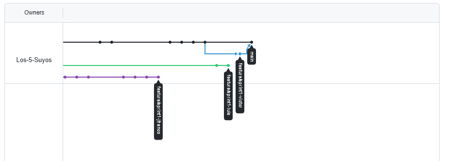
</div>

<br>

A continuación, se muestran los gráficos con el análisis de los commits realizados en el repositorio en la entrega AV1. Estos reflejan tanto la cantidad de líneas de código añadidas por cada integrante del equipo como la actividad de commits registrada.

<br>

<div align="center">

</div>

<br>

## TB1 - Network Graph

A continuación, se presenta el gráfico de red (network graph) del repositorio del proyecto de la entrega TB1, el cual permite visualizar la estructura de ramas, así como la interacción entre ellas a través de los procesos de integración (merge).

<br>

<div align="center">

</div>

<br>

A continuación, se muestran los gráficos con el análisis de los commits realizados en el repositorio en la entrega TB1. Estos reflejan tanto la cantidad de líneas de código añadidas por cada integrante del equipo como la actividad de commits registrada.

<br>

<div align="center">

</div>

<br>

---

<br>

##  Tabla de Contenidos
  #### [Contenido](#-tabla-de-contenidos)
  #### [Student Outcome](#-student-outcome)

  #### [Capítulo I: Introducción](#capítulo-i-introducción-1)
  - [1.1. Startup Profile](#11-startup-profile)
    - [1.1.1. Descripción de la Startup](#111-descripción-de-la-startup)
    - [1.1.2. Perfiles de integrantes del equipo](#112-perfiles-de-integrantes-del-equipo)
  - [1.2. Solution Profile](#12-solution-profile)
    - [1.2.1. Antecedentes y problemática](#121-antecedentes-y-problemática)
    - [1.2.2. Lean UX Process](#122-lean-ux-process)
      - [1.2.2.1. Lean UX Problem Statements](#1221-lean-ux-problem-statements)
      - [1.2.2.2. Lean UX Assumptions](#1222-lean-ux-assumptions)
      - [1.2.2.3. Lean UX Hypothesis Statements](#1223-lean-ux-hypothesis-statements)
      - [1.2.2.4. Lean UX Canvas](#1224-lean-ux-canvas)
  - [1.3. Segmentos objetivo](#13-segmentos-objetivo)
 
  #### [Capítulo II: Requirements Elicitation & Analysis](#capítulo-ii-requirements-elicitation--analysis-1)
  - [2.1. Competidores](#21-competidores)
    - [2.1.1. Análisis competitivo](#211-análisis-competitivo)
    - [2.1.2. Estrategias y tácticas frente a competidores](#212-estrategias-y-tácticas-frente-a-competidores)
  - [2.2. Entrevistas](#22-entrevistas)
    - [2.2.1. Diseño de entrevistas](#221-diseño-de-entrevistas)
    - [2.2.2. Registro de entrevistas](#222-registro-de-entrevistas)
    - [2.2.3. Análisis de entrevistas](#223-análisis-de-entrevistas)
  - [2.3. Needfinding](#23-needfinding)
    - [2.3.1. User Personas](#231-user-personas)
    - [2.3.2. User Task Matrix](#232-user-task-matrix)
    - [2.3.3. User Journey Mapping](#233-user-journey-mapping)
    - [2.3.4. Empathy Mapping](#234-empathy-mapping)
    - [2.3.5. As-Is Scenario Mapping](#235-as-is-scenario-mapping)
  - [2.4. Big Picture Event Storming](#24-big-picture-event-storming)
  - [2.5. Ubiquitous Language](#25-ubiquitous-language)
    
  #### [Capítulo III: Requirements Specification](#capítulo-iii-requirements-specification-1)
  - [3.1. User Stories](#31-user-stories)
  - [3.2. Impact Mapping](#32-impact-mapping)
  - [3.3. Product Backlog](#33-product-backlog)
    
  #### [Capítulo IV: Product Design](#capítulo-iv-product-design-1)
  - [4.1. Style Guidelines](#41-style-guidelines)
    - [4.1.1. General Style Guidelines](#411-general-style-guidelines)
    - [4.1.2. Web Style Guidelines](#412-web-style-guidelines)
  - [4.2. Information Architecture](#42-information-architecture)
    - [4.2.1. Organization Systems](#421-organization-systems)
    - [4.2.2. Labeling Systems](#422-labeling-systems)
    - [4.2.3. SEO Tags and Meta Tags](#423-seo-tags-and-meta-tags)
    - [4.2.4. Searching Systems](#424-searching-systems)
    - [4.2.5. Navigation Systems](#425-navigation-systems)
  - [4.3. Landing Page UI Design](#43-landing-page-ui-design)
    - [4.3.1. Landing Page Wireframe](#431-landing-page-wireframe)
    - [4.3.2. Landing Page Mock-up](#432-landing-page-mock-up)
  - [4.4. Web Applications UX/UI Design](#44-web-applications-uxui-design)
    - [4.4.1. Web Applications Wireframes](#441-web-applications-wireframes)
    - [4.4.2. Web Applications Wireflow Diagrams](#442-web-applications-wireflow-diagrams)
    - [4.4.3. Web Applications Mock-ups](#443-web-applications-mock-ups)
    - [4.4.4. Web Applications User Flow Diagrams](#444-web-applications-user-flow-diagrams)
  - [4.5. Web Applications Prototyping](#45-web-applications-prototyping)
  - [4.6. Domain-Driven Software Architecture](#46-domain-driven-software-architecture)
    - [4.6.1. Design-Level Event Storming](#461-design-level-event-storming)
    - [4.6.2. Software Architecture Context Diagram](#462-software-architecture-context-diagram)
    - [4.6.3. Software Architecture Container Diagrams](#463-software-architecture-container-diagrams)
    - [4.6.4. Software Architecture Components Diagrams](#464-software-architecture-components-diagrams)
  - [4.7. Software Object-Oriented Design](#47-software-object-oriented-design)
    - [4.7.1. Class Diagrams](#471-class-diagrams)
  - [4.8. Database Design](#48-database-design)
    - [4.8.1. Database Diagrams](#481-database-diagrams)
      
  #### [Capítulo V: Product Implementation, Validation & Deployment](#capítulo-v-product-implementation-validation--deployment-1)
  - [5.1. Software Configuration Management](#51-software-configuration-management)
    - [5.1.1. Software Development Environment Configuration](#511-software-development-environment-configuration)
    - [5.1.2. Source Code Management](#512-source-code-management)
    - [5.1.3. Source Code Style Guide & Conventions](#513-source-code-style-guide--conventions)
    - [5.1.4. Software Deployment Configuration](#514-software-deployment-configuration)
  - [5.2. Landing Page, Services & Applications Implementation](#52-landing-page-services--applications-implementation)
    - [5.2.1. Sprint 1](#521-sprint-1)
    - [5.2.2. Sprint 2](#522-sprint-2)
    
  #### [Conclusiones](#conclusiones-1)
  
  #### [Recomendaciones](#recomendaciones-1)

  #### [Video About-the-Team](#video-about-the-team-1)
  
  #### [Bibliografía](#-bibliografía)
  
  #### [Anexos](#anexos-1)

---

<br>

##  Student Outcome

En el siguiente cuadro se describen las acciones realizadas y enunciados de conclusiones que permiten sustentar el logro alcanzado.

| Criterio específico | Acciones realizadas | Conclusiones |
|:---|:---|:---|
| **3.c1. Comunica oralmente con efectividad a diferentes rangos de audiencia.** | **Salinas, Brianna** <br> AV1: Durante el registro de entrevistas, conduje sesiones con usuarios del segmento objetivo adaptando mi discurso oral según el perfil del entrevistado, logrando transmitir el propósito de BrandRadar de forma clara y comprensible tanto para perfiles técnicos como no técnicos. <br><br> TB1: (acción específica)<br><br> **Jáuregui, Jean Franco** <br> AV1: (acción específica) <br><br> TB1: (acción específica)<br><br> **Cruzalegui, Joaquin** <br> AV1: Elaboré una de las entrevistas del segmento 1 (PyMEs), por la cual tuve que adecuar mi vocabulario de la mejor manera posible, para hacer sentir cómodo al entrevistado y poder recopilar la mejor información posible <br><br> TB1: (acción específica)<br><br> **Garcia Paredes, Victor** <br> AV1: Diseñé y conduje oralmente dos entrevistas dirigidas a representantes de nuestros segmentos objetivo (una PyME y una Agencia Digital). Durante las sesiones, adapté mi lenguaje y tono para generar empatía con perfiles no técnicos, logrando extraer con claridad sus dolores respecto a la gestión de su reputación digital y comunicando efectivamente el propósito de nuestra investigación. <br><br> TB1: (acción específica)<br><br> **Acuña de la Cruz, Luis** <br> AV1: Diseñé y desarrollé el landing page del proyecto, enfocándome en transmitir de forma clara y atractiva la propuesta de valor para nuestros segmentos objetivo. Además, participé activamente en la presentación y explicación del sitio web ante el equipo y usuarios potenciales, comunicando de manera efectiva las funcionalidades y beneficios de la solución. Durante este proceso, adapté la estructura y el contenido de la página para mejorar la experiencia del usuario y generar mayor interés en la propuesta planteada. <br><br> TB1:Durante el desarrollo del Sprint 2, presenté los avances del Frontend y la integración de la Fake API ante mis compañeros y el líder técnico, utilizando un lenguaje adaptado para explicar la lógica de los servicios en Angular. Durante las reuniones de sincronización, expuse de manera clara cómo la arquitectura propuesta en el Dashboard permite visualizar el sentimiento de las menciones, facilitando que tanto el equipo de desarrollo como los interesados en el negocio comprendieran el flujo de los datos. Asimismo, respondí a las inquietudes técnicas sobre el manejo de estados globales, demostrando seguridad y dominio del tema para asegurar que todos los miembros del equipo estuvieran alineados con los objetivos del proyecto. <br> | (Completar de forma grupal en cada entrega) |
| **3.c2. Comunica por escrito con efectividad a diferentes rangos de audiencia.** | **Salinas, Brianna** <br> AV1: Redacté el Capítulo I, la sección 4.3 de Landing Page UI Design, los diagramas de clases (4.7.1) y el diseño de base de datos (4.8), empleando un lenguaje técnico preciso y estructurado acorde al formato académico del informe, garantizando que el contenido sea comprensible para lectores con distintos niveles de conocimiento en ingeniería de software. <br><br> TB1: (acción específica) <br><br> **Jáuregui, Jean Franco** <br> AV1: (acción específica) <br><br> TB1: (acción específica) <br><br> **Cruzalegui, Joaquin** <br> AV1: Realicé los Empathy Maps, los Journey Maps en base a las entrevistas y User Personas, también el Event Storming donde identifiqué los principales eventos del dominio. Además realicé el capítulo 5.2.1 sobre el sprint 1 <br><br> TB1: (acción específica) <br><br> **Garcia Paredes, Victor** <br> AV1: Redacté las secciones de segmentos objetivo, análisis competitivo, needfinding y arquitectura de software basada en DDD. Empleé un lenguaje claro, persuasivo y estructurado para documentar los User Personas; y utilicé terminología técnica estandarizada para describir el design-level event storming y los diagramas del modelo C4, garantizando que la documentación sea comprensible tanto para stakeholders como para el equipo de desarrollo. <br><br> TB1: (acción específica) <br><br> **Acuña de la Cruz, Luis** <br> AV1: Diseñé y desarrollé el landing page del proyecto, enfocándome en transmitir de forma clara y atractiva la propuesta de valor para nuestros segmentos objetivo. Además, participé activamente en la presentación y explicación del sitio web ante el equipo y usuarios potenciales, comunicando de manera efectiva las funcionalidades y beneficios de la solución. Durante este proceso, adapté la estructura y el contenido de la página para mejorar la experiencia del usuario y generar mayor interés en la propuesta planteada. <br><br> TB1: Redacté y documenté la estructura técnica del archivo db.json y los contratos de los endpoints mock para el módulo de Sentiment Analysis, asegurando que la documentación fuera comprensible para el equipo de backend y los encargados de arquitectura. Además, trabajé en la mejora de la coherencia de los Bounded Contexts, documentando mediante comentarios en el código y mensajes de commit detallados cada ajuste realizado en la integración de menciones, alertas y logs de auditoría. Esta comunicación escrita permitió una integración fluida en la rama develop, garantizando que la lógica de trazabilidad (Audit Logs) y el manejo de estados de los modelos estuvieran claramente explicados para futuras fases de mantenimiento. <br> | (Completar de forma grupal en cada entrega) |

---


<div align="center">

# Capítulo I: Introducción

</div>

---

## 1.1. Startup Profile

###   1.1.1. Descripción de la Startup

<br>

*BrandRadar* es una startup tecnológica dedicada al desarrollo de una aplicación web especializada en el monitoreo y análisis de la reputación digital de marcas y empresas en tiempo real. Su propuesta se centra en proporcionar información estratégica que permita a las organizaciones comprender y gestionar su presencia en el entorno digital de manera eficiente.

La plataforma integra la recopilación y el análisis de datos provenientes de diversas fuentes, como redes sociales, reseñas en línea y menciones en múltiples plataformas digitales. Asimismo, incorpora el monitoreo del estado de la infraestructura web, consolidando toda la información en un único panel de control. Esto facilita una visión integral del desempeño y posicionamiento digital de la marca.

Mediante el uso de técnicas avanzadas de análisis de datos y procesamiento de lenguaje natural, *BrandRadar* identifica patrones, analiza tendencias y evalúa el sentimiento de los usuarios, clasificándolo en positivo, negativo o neutro. Además, permite detectar oportunamente posibles riesgos reputacionales, lo que contribuye a una gestión preventiva y estratégica.

En conjunto, esta herramienta brinda a las empresas la capacidad de tomar decisiones informadas, optimizar su posicionamiento en el mercado digital y fortalecer su imagen corporativa, generando así una ventaja competitiva en un entorno cada vez más dinámico y exigente.

<br>

<div align="center">
  
###  Logo y nombre del proyecto:

**BrandRadar**

  

<br>

##  Misión

*"Brindar a empresas y marcas una herramienta tecnológica que les permita monitorear y analizar su reputación digital en tiempo real, facilitando la toma de decisiones estratégicas basadas en información confiable y oportuna."*

<br>

##  Visión

*"Ser una plataforma líder en Latinoamérica en la gestión de la reputación digital, reconocida por su innovación, precisión analítica y aporte al crecimiento y posicionamiento de las marcas en el entorno digital."*

</div>

<br>

##  Propuesta de Valor

BrandRadar permite a las empresas:

-  Monitorear en tiempo real lo que se dice sobre su marca en internet  
-  Centralizar el monitoreo de redes sociales y el estado de la infraestructura web en un único panel de control  
-  Analizar de forma automática el sentimiento de opiniones y comentarios
-  Detectar crisis reputacionales de manera temprana
-  Obtener información clara y accionable para mejorar su posicionamiento digital  
<br>

##  Valores

-  **Innovación**: Uso de tecnología para ofrecer soluciones modernas  
-  **Transparencia**: Información clara y confiable  
-  **Orientación al cliente**: Enfoque en necesidades reales  
-  **Responsabilidad**: Manejo ético y seguro de los datos  
-  **Calidad**: Resultados precisos y útiles  
<br>

##  Objetivos

1. Desarrollar una plataforma web funcional para el monitoreo de reputación digital  
2. Implementar un sistema de análisis de sentimiento automático basado en procesamiento de lenguaje natural
3. Integrar múltiples fuentes de datos digitales en tiempo real (redes sociales, reseñas y menciones)
4. Incorporar el monitoreo del estado de la infraestructura web (disponibilidad, rendimiento y errores)
5. Centralizar toda la información en un panel de control intuitivo y fácil de usar
6. Facilitar la toma de decisiones mediante reportes claros, visuales y accionables
7. Contribuir al fortalecimiento del posicionamiento digital de las empresas usuarias


---

###   1.1.2. Perfiles de integrantes del equipo

<div align="center">
  
####  Integrante 1


| Campo | Detalle |
|:------|:--------|
| **Nombres y Apellidos** | `Salinas Guzmán, Brianna` |
| **Código de estudiante** | `U202410239` |
| **Carrera** | Ingeniería de Software |

</div>
<br>

**Descripción:**
*Soy estudiante de Ingeniería de Software con conocimientos en desarrollo de aplicaciones, estructuras de datos y programación orientada a objetos. Tengo experiencia trabajando con lenguajes como C++, Pyhton, SQL para base de datos y en la gestión de proyectos utilizando Git y GitHub para el control de versiones. Además, cuento con formación complementaria en marketing digital, lo que me permite aportar una perspectiva orientada al usuario y al posicionamiento del producto. Me considero una persona responsable, con capacidad de aprendizaje autónomo y habilidades para trabajar en equipo y comunicar ideas de manera clara.*

---

<br>

<div align="center">
  
####  Integrante 2


| Campo | Detalle |
|:------|:--------|
| **Nombres y Apellidos** | `Jáuregui Cerna, Jean Franco` |
| **Código de estudiante** | `U202410024` |
| **Carrera** | Ingeniería de Software |

</div>

**Descripción:**
*(Párrafo describiendo principales conocimientos técnicos y habilidades que puede aportar al equipo)*

---
<br>

<div align="center">
  
####  Integrante 3


| Campo | Detalle |
|:------|:--------|
| **Nombres y Apellidos** | `Cruzalegui Herrera, Joaquin` |
| **Código de estudiante** | `U202411354` |
| **Carrera** | Ingeniería de Software |
</div>

**Descripción:**
*Soy estudiante de la carrera de Ingeniería de Software, actualmente cuento con conocimiento de desarrollo de aplicaciones, estructura de datos y programación orientada a objetos. Cuento con experiencia en lenguajes como C++ y un nivel intermedio de python, además he trabajado con MySql y MongoDB en cuanto a base de datos. Considero que soy una persona resposable, que se desenvuelve mejor en trabajos colaborativos y que da lo mejor de sí en las acividades correspondientes para el cumplimiento de un proyecto.*

---
<br>
<div align="center">

####  Integrante 4


| Campo | Detalle |
|:------|:--------|
| **Nombres y Apellidos** | `Garcia Paredes, Victor Manuel` |
| **Código de estudiante** | `U202012001` |
| **Carrera** | Ingeniería de Software |

</div>

**Descripción:**
*Soy estudiante de Ingeniería de Software con sólidos conocimientos en desarrollo de aplicaciones, estructuras de datos y programación orientada a objetos. Tengo experiencia en el uso de C++, así como en la gestión de proyectos mediante herramientas como Git y GitHub para el control de versiones. También tengo un conocimiento basico sobre Python, MSSQL y MongoDB. Me caracterizo por ser una persona responsable, con iniciativa para el aprendizaje autónomo, y con habilidades para el trabajo en equipo y la comunicación efectiva de ideas.*

---
<br>
<div align="center">
  
####  Integrante 5


| Campo | Detalle |
|:------|:--------|
| **Nombres y Apellidos** | `Acuña de la Cruz, Luis` |
| **Código de estudiante** | `U202417228` |
| **Carrera** | Ingeniería de Software |
</div>

**Descripción:**
*Soy estudiante de Ingeniería de Software con conocimientos en desarrollo de aplicaciones, programación orientada a objetos y estructuras de datos. Tengo experiencia en C++, Git y GitHub, además de conocimientos básicos en Python, MSSQL y MongoDB. Me considero una persona responsable, con capacidad de aprendizaje autónomo y habilidades para trabajar en equipo y comunicar ideas de manera efectiva.*

---
<br>

## 1.2. Solution Profile

###   1.2.1. Antecedentes y problemática

###  Antecedentes


En la última década, la digitalización ha transformado significativamente la relación entre empresas y consumidores, trasladando gran parte de la interacción hacia entornos digitales. En este contexto, la reputación de marca ya no depende únicamente de la comunicación corporativa, sino también del contenido generado por los propios usuarios en internet.

De acuerdo con Statista (2025), las reseñas online se han convertido en un factor clave en la toma de decisiones de compra, siendo consideradas por el 62 % de los consumidores como muy influyentes al momento de elegir productos o servicios. Esto evidencia que la percepción digital de una marca impacta directamente en su desempeño comercial.

Asimismo, estudios recientes de BrightLocal (2026) muestran que el 97 % de los consumidores lee reseñas en línea antes de elegir un negocio, y que el 85 % es más propenso a confiar en empresas con opiniones positivas, mientras que el 77 % evita aquellas con reseñas negativas. Estos datos refuerzan la idea de que la reputación digital influye de manera directa en la confianza y decisión del consumidor.

Por otro lado, diversas investigaciones académicas han demostrado que las reseñas digitales funcionan como un mecanismo que reduce la incertidumbre en los consumidores. Según Ott, Cardie y Hancock (2012), las opiniones en línea actúan como señales que permiten a los usuarios evaluar la calidad de un producto o servicio en ausencia de información directa.

No obstante, el entorno digital actual también presenta desafíos importantes. La información sobre una marca se encuentra distribuida en múltiples plataformas, lo que dificulta su gestión. Además, el volumen de datos generado por los usuarios es cada vez mayor, lo que complica su análisis e interpretación. A ello se suma la presencia de información poco confiable o engañosa, lo que afecta la credibilidad del ecosistema digital. En este sentido, estudios recientes evidencian que más del 75 % de los consumidores desconfía de posibles reseñas falsas, lo que impacta directamente en la confianza hacia las marcas (Backlinko, 2026).

En conjunto, estos factores demuestran que la reputación digital se ha convertido en un activo estratégico para las empresas, pero también en un desafío complejo de gestionar, especialmente para aquellas organizaciones que no cuentan con herramientas adecuadas que les permitan monitorear y analizar la información en tiempo real de manera eficiente.


<br>

### Descripción de la Problemática (5W + 2H)
<br>

  *Para comprender la problemática que aborda BrandRadar, se aplica la técnica de las 5W + 2H:*

####   What — ¿Cuál es el problema?

Las marcas no cuentan con visibilidad en tiempo real sobre cómo son percibidas en internet. En muchos casos, desconocen qué se dice de ellas, en qué plataformas se generan las menciones, qué tono predomina en las opiniones ni cuándo una percepción negativa puede escalar hacia una crisis reputacional.

Esta situación se debe, principalmente, a la dispersión de la información en múltiples canales digitales y a la falta de herramientas accesibles que integren y analicen estos datos de manera clara y accionable. Como consecuencia, las organizaciones no logran identificar oportunamente riesgos reputacionales, lo que limita su capacidad de respuesta y dificulta la toma de decisiones estratégicas antes de que el impacto negativo se intensifique.

####   Why — ¿Por qué es un problema relevante?

Este problema es relevante debido a diversos factores que dificultan una adecuada gestión de la reputación digital:

- La información sobre la marca se encuentra distribuida en múltiples canales digitales, lo que complica su seguimiento y análisis.
- Las herramientas disponibles en el mercado suelen ser complejas o implican costos elevados, limitando su acceso, especialmente para pequeñas y medianas empresas.
- Existe una sobrecarga de datos generados constantemente, lo que dificulta su correcta interpretación y uso estratégico.
- La reputación digital es dinámica y puede cambiar rápidamente en tiempo real, lo que exige una supervisión continua.

####   Who — ¿Quiénes son los afectados?

- Pequeñas y medianas empresas (PyMEs) y marcas digitales que buscan gestionar su presencia en línea.

- Agencias de marketing digital y especialistas encargados de la gestión de marcas.

- Community managers y responsables de comunicación que monitorean la interacción con los usuarios.


####   Where — ¿Dónde ocurre?

El problema se manifiesta en el ecosistema digital en su conjunto, abarcando redes sociales (Instagram, X/Twitter, TikTok, LinkedIn y Facebook), plataformas de reseñas (Google, Trustpilot y TripAdvisor), así como foros y comunidades en línea (Reddit y Quora), medios digitales y blogs.

La dispersión de la información en estos múltiples canales dificulta su seguimiento integral, haciendo que el monitoreo manual resulte ineficiente e incluso inviable para muchas organizaciones.


####   When — ¿Cuándo se presenta con mayor criticidad?

El problema se intensifica en momentos de alta exposición mediática, como lanzamientos de productos, campañas publicitarias, controversias públicas o eventos relevantes del sector. En estas situaciones, el volumen de interacciones y menciones aumenta significativamente, elevando el riesgo de impacto reputacional.

No obstante, debido a la naturaleza dinámica del entorno digital, la reputación de una marca se encuentra en constante evaluación, lo que implica que este problema está presente de manera continua, las 24 horas del día, los 7 días de la semana.

####   How — ¿Cómo se enfrenta actualmente el problema?

Actualmente, muchas empresas que no cuentan con soluciones especializadas enfrentan esta problemática mediante métodos manuales y poco integrados. Entre las principales prácticas se encuentran:

- La realización de búsquedas periódicas en motores como Google y la revisión esporádica de redes sociales.
- El uso de alertas básicas por correo electrónico, que no garantizan un seguimiento completo ni en tiempo real.
- La gestión de información fragmentada en múltiples plataformas, lo que dificulta su análisis integral.
- La ausencia de sistemas automatizados que permitan monitorear la reputación digital de manera continua.
- La detección tardía de problemas reputacionales, lo que reduce la capacidad de respuesta.
- La toma de decisiones basada en información incompleta o no consolidada.


####   How Much — ¿Cuál es la magnitud del impacto?

El impacto de la reputación digital en las empresas es significativo y se encuentra respaldado por diversos estudios recientes.

En este sentido, distintas investigaciones evidencian que:

- El **93 % de los consumidores lee reseñas online antes de realizar una compra (Ruby, 2025).**
- El **97 % consulta reseñas de negocios antes de visitarlos (Capital One Shopping Research, 2026).**
- El **85 % evita empresas sin reseñas o con una reputación negativa (Capital One Shopping Research, 2026).**
- El **75 % de los consumidores desconfía de reseñas falsas, lo que afecta la credibilidad de las marcas (Ruby, 2025).**
- Las reseñas pueden **incrementar las ventas hasta en un 19,8 % (Capital One Shopping Research, 2026).**

Estos datos demuestran que la reputación digital tiene un impacto directo en aspectos clave como:

- La **decisión de compra**
- La **confianza del consumidor**
- Los **ingresos de la empresa**

<br>

###  Imagen 1: Influencia de las reseñas en decisiones de compra

 Esta gráfica muestra cómo la mayoría de consumidores:

Lee reseñas frecuentemente

Basa sus decisiones en opiniones de otros usuarios
<br>
<div align="center">
  


(BrightLocal, 2026)

</div>


###   Imagen 2: Frecuencia de lectura de reseñas

 Se observa que:

Más del 70 % de usuarios revisa reseñas regularmente

Solo un porcentaje mínimo no las consulta

<br>
<div align="center">
  


(Backlinko, 2026)

</div>

<br>

Estos resultados evidencian que una mala gestión de la reputación digital puede generar pérdida de clientes, disminución de ingresos y deterioro de la imagen de marca, lo que justifica la necesidad de soluciones como *BrandRadar*.

---
<br>

### 1.2.2. Lean UX Process

#### 1.2.2.1. Lean UX Problem Statements

El proceso Lean UX se basa en identificar con precisión los problemas reales que enfrentan los usuarios antes de proponer cualquier solución. Este enfoque permite comprender sus necesidades, comportamientos y dificultades, con el fin de diseñar propuestas que generen valor de manera efectiva.

A continuación, se presentan los Problem Statements correspondientes a los dos segmentos iniciales de BrandRadar, los cuales han sido formulados a partir del análisis del dominio, el segmento de clientes, los principales pain points, el gap de mercado y la visión estratégica del proyecto.

<br>

### Problem Statement 1

####  Pequeñas y medianas empresas y marcas digitales (PyMEs)
<br>

> Hemos observado que las **pequeñas y medianas empresas con presencia digital** no cuentan con herramientas accesibles que les permitan monitorear su reputación en tiempo real. Esto ocasiona que no logren detectar oportunamente comentarios negativos o posibles crisis reputacionales. Como consecuencia, reaccionan de forma tardía, toman decisiones sin información clara y pierden control sobre la percepción de su marca.

*"¿Cómo podríamos ayudar a estas empresas a monitorear y detectar en tiempo real lo que se dice de su marca, para que puedan gestionar su reputación de manera proactiva y basada en información confiable?"*

<br>

### Problem Statement 2

####  Especialistas de marketing o community managers
<br>

> Hemos observado que las **agencias de marketing digital y especialistas en gestión de marca** enfrentan una administración fragmentada de la reputación de sus clientes, sin contar con una herramienta que centralice el monitoreo y permita identificar menciones relevantes en tiempo real. Esto incrementa el tiempo operativo, dificulta la respuesta oportuna ante posibles crisis y limita la capacidad de gestionar múltiples marcas de manera eficiente.

*"¿Cómo podríamos ayudar a estos profesionales a centralizar el monitoreo de múltiples marcas y facilitar la detección oportuna de menciones críticas en un solo lugar, optimizando así su gestión y capacidad de respuesta?"*

---
<br>

#### 1.2.2.2. Lean UX Assumptions
<br>

#### Features

  •  Registro de usuarios para acceder a la plataforma.
  
  •  Dashboard centralizado con visualización en tiempo real de menciones y métricas clave.
  
  •  Sistema de alertas automáticas ante menciones negativas y eventos críticos.
  
  •  Monitoreo de múltiples fuentes digitales, como redes sociales, plataformas de reseñas y menciones web.
  
  •  Monitoreo del estado de la infraestructura web, considerando disponibilidad, rendimiento y detección de errores.
  
  •  Análisis de sentimiento automatizado, clasificando las opiniones en positivas, neutras o negativas.

  •  Historial y trazabilidad de menciones y eventos para su seguimiento y análisis.

<br>

#### Business Outcomes

  •  Reducir el tiempo de respuesta ante menciones negativas y fallos en la infraestructura web.
  
  •  Incrementar el nivel de sentimiento positivo asociado a la marca.
  
  •  Mejorar la continuidad operativa mediante la detección temprana de problemas técnicos.
  
  •  Aumentar la retención de usuarios activos en la plataforma. 
  
  •  Lograr la adopción temprana de la plataforma por parte de PyMEs y agencias de marketing digital.

<br>

#### Users

  •  Responsables de marketing y community managers encargados de la gestión de la reputación digital.
  
  •  Pequeñas y medianas empresas (PyMEs) con presencia en entornos digitales.
  
  •  Agencias de marketing digital que gestionan múltiples marcas y clientes.
  
<br>

#### User Outcomes

  •  Conocer en tiempo real lo que se dice sobre su marca en el entorno digital.
  
  •  Detectar de manera oportuna comentarios negativos, posibles crisis reputacionales o fallos técnicos.
  
  •  Contar con una visión unificada de la reputación digital y del estado de la infraestructura web.
  
  •  Tomar decisiones informadas basadas en datos sobre percepción y rendimiento.
  
  •  Reducir el tiempo invertido en el monitoreo manual de múltiples plataformas.
  
  •  Gestionar su reputación de forma proactiva, en lugar de reactiva.

<br>

---

#### 1.2.2.3. Lean UX Hypothesis Statements

<br>

**Hypothesis Statement 1:**


> Creemos que, al implementar alertas automáticas en tiempo real sobre menciones negativas y fallos en la infraestructura web, los responsables de marketing y equipos técnicos podrán responder de manera más oportuna y prevenir crisis reputacionales y operativas.
**Sabremos que hemos tenido éxito** cuando al menos el 70 % de los usuarios activos configure alertas durante su primera semana de uso y se evidencie una reducción en el tiempo de respuesta ante incidentes.

**Hypothesis Statement 2:**


> Creemos que, al ofrecer un dashboard centralizado que integre métricas de reputación (sentimiento, volumen y tendencias) junto con el estado de la infraestructura web, los usuarios podrán comprender mejor el desempeño digital de su marca y tomar decisiones estratégicas más informadas.
**Sabremos que hemos tenido éxito** cuando el 65 % de los usuarios activos consulte el dashboard al menos tres veces por semana durante el primer mes de uso.


**Hypothesis Statement 3:**


> Creemos que, al integrar múltiples canales digitales junto con el monitoreo técnico en una sola plataforma, los usuarios podrán obtener una visión más completa y unificada de su ecosistema digital.
**Sabremos que hemos tenido éxito** cuando al menos el 60 % de los usuarios activos conecte más de una fuente de datos y utilice al menos una funcionalidad de monitoreo de infraestructura durante su primera semana de uso.


<br>

---

#### 1.2.2.4. Lean UX Canvas

*Lean UX Canvas elaborado en la herramienta Figma*


El Lean UX Canvas fue elaborado utilizando la herramienta Figma, lo que permitió estructurar de manera visual y colaborativa los principales componentes del proyecto. En este se identifican los problemas del usuario, las hipótesis de solución, los segmentos de clientes, la propuesta de valor y las métricas clave.

Asimismo, su desarrollo facilitó la iteración continua de ideas y la alineación del equipo en torno a los objetivos del producto. De esta manera, se logró validar supuestos de forma temprana y enfocar los esfuerzos en generar valor para el usuario final.

---

## 1.3. Segmentos objetivo

### Segmento objetivo 1: Pequeñas y medianas empresas y marcas digitales (PyMEs)
<br>

Este segmento está conformado por propietarios o gerentes de pequeñas y medianas empresas, como restaurantes, clínicas dentales, hoteles boutique o negocios de comercio electrónico, que cuentan con presencia activa en canales digitales. Sin embargo, no disponen de equipos especializados en comunicación o gestión de la reputación, lo que limita su capacidad para monitorear y responder de manera oportuna a las interacciones de los usuarios.

<br>

**Características demográficas:**

<br>

* **Edad:** Entre 25 y 55 años.
* **Género:** Hombres y mujeres.
* **Ubicación:** Zonas urbanas y de alto comercio en Perú y principales ciudades de Latinoamerica.
* **Ocupación:** Emprendedores, Gerentes Generales, Administradores de local comercial.
* **Nivel socioeconómico:** Sectores B y C.

<br>

*Estadísticas de sustento:*

<br>
Para respaldar este segmento, según Ipsos Perú (2023), el 85 % de los consumidores peruanos revisa opiniones en línea antes de adquirir un producto o servicio. Asimismo, estudios de BrightLocal (2026) indican que el 93 % de los usuarios toma decisiones de compra basadas en reseñas locales.

Estos datos evidencian que, para una PyME, el monitoreo de su reputación digital no constituye un elemento opcional, sino una necesidad estratégica para su posicionamiento y sostenibilidad en el mercado.

---

### Segmento objetivo 2: Especialistas de marketing o community managers
<br>

Este segmento está conformado por profesionales responsables de gestionar la presencia digital de una o múltiples marcas, incluyendo community managers, analistas de marketing digital y equipos de comunicación. Estos usuarios enfrentan como principal dificultad el alto tiempo operativo que invierten en la revisión manual de diversas plataformas digitales y en la elaboración de reportes de reputación.

En este contexto, requieren una herramienta que les permita centralizar la información, optimizar sus procesos de monitoreo y recibir alertas en tiempo real ante posibles crisis, con el fin de gestionar de manera más eficiente la reputación de las marcas que representan.

<br>

**Características demográficas:**

<br>

* **Edad:** Entre 20 y 45 años.
* **Género:** Hombres y mujeres.
* **Ubicación:** Ecosistemas corporativos o en modalidad de trabajo remoto a nivel nacional y regional (LATAM).
* **Ocupación:** Directores de Agencia, Ejecutivos de Cuentas (Account Managers), Social Media Managers, Community managers.
* **Nivel socioeconómico:** Sectores A y B.
<br>

*Estadísticas de sustento:*

<br>

Según reportes de la industria, como el *State of Marketing* de HubSpot (2024), los equipos de marketing enfrentan una creciente necesidad de gestionar grandes volúmenes de información, lo que incrementa el tiempo dedicado a tareas operativas como la elaboración de reportes y el seguimiento de métricas.

Estos datos evidencian que los profesionales del marketing requieren herramientas que optimicen sus procesos, reduzcan la carga operativa y les permitan enfocarse en actividades estratégicas de mayor valor.

---

<div align="center">

# Capítulo II: Requirements Elicitation & Analysis

</div>

---

## 2.1. Competidores

### 2.1.1. Análisis competitivo

En esta sección se presenta el *Competitive Analysis Landscape*, el cual permite evaluar a **BrandRadar** frente a las principales soluciones disponibles en el mercado. Este análisis tiene como finalidad identificar fortalezas, debilidades y oportunidades, con el fin de comprender el posicionamiento de la propuesta y su valor diferencial frente a la competencia.


<br>

### 2.1.2. Estrategias y tácticas frente a competidores

Para asegurar la competitividad de BrandRadar en el mercado de herramientas de monitoreo digital, se plantean estrategias orientadas a diferenciar su propuesta de valor frente a las soluciones existentes, aprovechando sus limitaciones y las necesidades no cubiertas del mercado.

En primer lugar, se adopta una estrategia de enfoque en la prevención, diferenciándose de herramientas como Metricool, que priorizan la gestión de contenido. En este sentido, BrandRadar se centra en la detección temprana de riesgos reputacionales. Como táctica, se implementan alertas automáticas en tiempo real ante picos de menciones negativas o eventos críticos, posicionándose como una herramienta que permite anticiparse a posibles crisis y no solo reaccionar ante ellas.

En segundo lugar, se propone una estrategia de liderazgo en costos y usabilidad frente a plataformas más complejas como Mention. BrandRadar busca democratizar el acceso a herramientas de monitoreo mediante una interfaz intuitiva y un modelo SaaS accesible para PyMEs. Como táctica, se simplifica la visualización de datos a través de indicadores claros (por ejemplo, semáforos de reputación) y se ofrecen planes adaptados al contexto del mercado.

Finalmente, se plantea una estrategia de diferenciación tecnológica frente a soluciones básicas como Google Alerts, que se limitan a la detección de menciones. BrandRadar incorpora análisis de sentimiento y centralización de la información, lo que permite no solo identificar qué se dice de una marca, sino también interpretar cómo es percibida. Como táctica, se integran técnicas de procesamiento de lenguaje natural para generar insights accionables que apoyen la toma de decisiones.

En conjunto, estas estrategias permiten posicionar a BrandRadar como una solución accesible, inteligente y orientada a la acción dentro del mercado de monitoreo de reputación digital. De este modo, la propuesta no solo responde a las limitaciones de las herramientas existentes, sino que también aporta un valor diferencial al facilitar una gestión más proactiva, integrada y basada en datos.

<br>

---

<br>

## 2.2. Entrevistas

### 2.2.1. Diseño de entrevistas

En esta sección se presenta el diseño de las entrevistas realizadas con el objetivo de comprender en profundidad las necesidades, comportamientos y problemáticas de los usuarios identificados. Para ello, se empleó un enfoque de entrevistas semiestructuradas, el cual permitió obtener información cualitativa relevante, manteniendo a la vez flexibilidad para profundizar en las respuestas de los participantes.

El diseño de las entrevistas se basó en buenas prácticas de investigación en experiencia de usuario (UX), priorizando el uso de preguntas abiertas, evitando sesgos y enfocándose en experiencias reales de los usuarios. Asimismo, se buscó recolectar tanto información principal —relacionada con el problema y el uso de herramientas— como información complementaria, como datos demográficos y contexto personal, necesarios para la construcción de arquetipos o user personas.
<br>

### Segmento 1: Pequeñas y medianas empresas y marcas digitales (PyMEs)

Para este segmento, las entrevistas estuvieron orientadas a comprender cómo las empresas gestionan actualmente su reputación digital, qué dificultades enfrentan en este proceso y cuál es su nivel de conocimiento sobre herramientas tecnológicas disponibles.
  
<br>

**Preguntas iniciales**

- Para comenzar, ¿podrías presentarte brevemente? (edad, lugar donde vives, con quiénes vives y a qué te dedicas).
  
- Si tuvieras que describir tu personalidad y tus principales habilidades en el trabajo en tres palabras, ¿cuáles serían y por qué?
  
- ¿Qué marcas (nacionales o internacionales) o referentes te inspiran en tu día a día o en la gestión de tu negocio?
  
<br>

### Preguntas principales:

1. En la última semana, ¿cómo verificaste qué opinaban los clientes sobre tu marca? Describe el proceso paso a paso.
2. ¿Con qué frecuencia revisas comentarios o menciones en redes sociales o internet? (diario, semanal, ocasional)
3. ¿Qué haces exactamente cuando encuentras un comentario negativo sobre tu negocio?
4. ¿Cuánto tiempo te toma revisar todas tus redes o plataformas para ver qué dicen de tu marca?
5. ¿Alguna vez te enteraste tarde de un comentario negativo o problema? ¿Qué ocurrió y qué impacto tuvo?
6. ¿Qué herramientas específicas utilizas actualmente para monitorear tu marca? ¿Qué es lo que más te dificulta de ellas?
7. Si no revisas constantemente, ¿qué te impide hacerlo (tiempo, desconocimiento, complejidad, otros)?
8. ¿Qué tan útil sería para ti recibir una alerta inmediata cuando alguien habla negativamente de tu marca? ¿En qué situaciones la usarías?

<br>

**Preguntas complementarias:**

¿Cuántas personas trabajan en tu empresa?

¿En qué distrito o ciudad operas?

¿Qué redes sociales utilizas con mayor frecuencia?

¿Qué dispositivos utilizas para gestionar tu negocio?

¿Qué tipo de herramientas digitales sueles usar?

¿Qué te gustaría mejorar en la gestión de tu marca?

<br>

### Segmento 2: Especialistas de marketing o community managers

En este segmento, las entrevistas estuvieron orientadas a comprender el flujo de trabajo de los profesionales, las herramientas que utilizan, la carga operativa asociada a sus funciones y sus necesidades en relación con la automatización en la gestión de la reputación digital.

<br>

**Preguntas iniciales**

- ¿Podrías presentarte indicando tu edad, distrito de residencia, estado civil?
  
- ¿Cómo ha sido tu background profesional para llegar a este puesto donde gestionas múltiples marcas?
  
- ¿Cómo describirías tu personalidad trabajando bajo presión y cuáles crees que son tus mejores habilidades profesionales?
  
- ¿Qué marcas, agencias referentes o "influencias" del rubro sigues para mantenerte actualizado?

<br>

### Preguntas principales:

1. ¿Cuál es tu rol y cuáles son tus principales responsabilidades en la gestión de marcas?
2. Describe tu flujo diario para monitorear menciones de las marcas que gestionas. ¿Qué pasos sigues?
3. ¿Qué plataformas revisas normalmente para monitorear estas menciones?
4. ¿Qué herramientas utilizas actualmente para este proceso? ¿Qué limitaciones tienen?
5. ¿Cuánto tiempo dedicas diariamente o semanalmente al monitoreo y a la elaboración de reportes?
6. ¿Cómo detectas actualmente una crisis o un aumento de comentarios negativos?
7. Cuéntame sobre la última vez que una mención negativa no fue detectada a tiempo. ¿Qué ocurrió?
8. ¿Qué parte del proceso (monitoreo, análisis o reporte) te consume más tiempo y por qué?
9. Si contaras con una herramienta que te envíe alertas automáticas en tiempo real sobre la percepción de la marca en redes sociales e internet, ¿cómo cambiaría tu forma de trabajo?

<br>

**Preguntas complementarias:**

Edad, género (opcional), lugar de residencia

Formación académica o experiencia laboral

Tipo de empresa o agencia donde trabajas

¿Cuántas marcas gestionas actualmente?

¿Qué dispositivos utilizas con mayor frecuencia?

¿Qué plataformas digitales usas diariamente?

¿Qué herramientas o marcas influyen en tu trabajo?

<br>

---

### 2.2.2. Registro de entrevistas
<div align="center">
  
**Segmento objetivo 1: `Pequeñas y medianas empresas y marcas digitales (PyMEs)`**

<br>

#### Entrevista 1
*Imagen de la entrevista*


<br>

<br>

| Campo | Detalle |
|:------|:--------|
| **Nombres y apellidos** | `Alfredo Negrete` |
| **Edad** | `49 años` |
| **Ubicación** | `Surco` |
| **Fecha de entrevista** | `2026-04-11` |
| **Duración** | `15:00` |
| **Enlace al video** | [Ver entrevista en Microsoft Stream](https://upcedupe-my.sharepoint.com/:v:/g/personal/u202411354_upc_edu_pe/IQBjxTLrWi8NSqPn4hPz_eWwAeBG68dptaNBlqth-0p3xhU?nav=eyJyZWZlcnJhbEluZm8iOnsicmVmZXJyYWxBcHAiOiJPbmVEcml2ZUZvckJ1c2luZXNzIiwicmVmZXJyYWxBcHBQbGF0Zm9ybSI6IldlYiIsInJlZmVycmFsTW9kZSI6InZpZXciLCJyZWZlcnJhbFZpZXciOiJNeUZpbGVzTGlua0NvcHkifX0&e=bVj4ft) |

**Resumen:**
</div>

Alfredo Negrete es gerente comercial y socio de una empresa dedicada a la fabricación de muebles de exhibición, implementación de espacios comerciales y desarrollo de mobiliario. Tiene 49 años, es padre de familia y reside en el distrito de Surco. Cuenta con experiencia previa en el rubro, lo que le ha permitido desarrollar habilidades clave como el cumplimiento de compromisos, la puntualidad y la orientación a brindar un servicio diferencial, aspectos que fortalecen la credibilidad de su negocio.

Asimismo, manifiesta admiración por las marcas de consumo masivo debido a la complejidad que implica mantenerse competitivas en el mercado. Su experiencia trabajando con empresas internacionales, como Samsung, le ha permitido establecer referentes claros y reforzar su percepción de que su negocio se encuentra bien encaminado.

En cuanto a su dinámica laboral, considera que la comunicación es un factor fundamental en su sector, por lo que utiliza diversas herramientas digitales como el teléfono, correo electrónico, Zoom, Google Meet y WhatsApp para mantener un contacto constante con clientes y proveedores.

Por otro lado, uno de sus principales objetivos actuales es cubrir una deuda generada por su anterior empresa, también del mismo rubro. En ese contexto, menciona que anteriormente priorizó la satisfacción del cliente como elemento central de la imagen empresarial, lo que lo llevó a asumir ciertos costos que finalmente contribuyeron al quiebre del negocio. Sin embargo, expresa frustración al no poder identificar con claridad las causas de las pérdidas, especialmente cuando los clientes optan por otros proveedores.

A pesar de estas dificultades, ha utilizado herramientas digitales como páginas web para comunicarse con sus clientes y ha logrado resolver conflictos de manera interna, priorizando siempre mantener una imagen positiva frente a sus clientes actuales y potenciales.

Finalmente, considera que una aplicación podría ayudarle a fortalecer su imagen empresarial, permitiéndole compartir contenido relevante, como fotografías, artículos y casos de resolución de problemas vinculados a su negocio.

<br>
<div align="center">
  
#### Entrevista 2
*Imagen de la entrevista*


<br>

<br>

| Campo | Detalle |
|:------|:--------|
| **Nombres y apellidos** | `Jenifer Natali López Huamán` |
| **Edad** | `22` |
| **Ubicación** | `Surco` |
| **Fecha de entrevista** | `2026-04-11` |
| **Duración** | `09:03` |
| **Enlace al video** | [Ver entrevista en Microsoft Stream](https://upcedupe-my.sharepoint.com/:v:/g/personal/u202012001_upc_edu_pe/IQAlodktDrH_RYNs0fTbCXXQAR0g-JyDOAB3OlwdYg47y2M?nav=eyJyZWZlcnJhbEluZm8iOnsicmVmZXJyYWxBcHAiOiJTdHJlYW1XZWJBcHAiLCJyZWZlcnJhbFZpZXciOiJTaGFyZURpYWxvZy1MaW5rIiwicmVmZXJyYWxBcHBQbGF0Zm9ybSI6IldlYiIsInJlZmVycmFsTW9kZSI6InZpZXcifX0%3D&e=sZcbFk) |

**Resumen:**
</div>

Jenifer Natali López Huamán es una estudiante de Administración y emprendedora de 22 años, fundadora de Siana Boutique, una tienda de ropa femenina que inició sus operaciones de manera virtual durante la pandemia. Gracias a su esfuerzo y capacidad de ahorro, logró expandir su negocio hacia un local físico, combinando así la venta digital con la atención presencial.

En su gestión diaria, encuentra inspiración en marcas de retail como Zara, Shein y H&M, así como en creadores de contenido en plataformas como Instagram y TikTok. Su principal herramienta de trabajo es el celular, el cual utiliza para la venta, la creación de contenido y la gestión de redes sociales, mientras que la laptop es empleada principalmente para tareas administrativas y coordinación con proveedores.

En cuanto a la comunicación con sus clientes, utiliza principalmente WhatsApp para concretar ventas, debido a la confianza que genera este canal. Asimismo, emplea Instagram como catálogo visual y Facebook, especialmente Marketplace, para atraer clientes a nivel local. Entre sus principales objetivos se encuentran incrementar sus ventas, fidelizar clientes, mejorar su presencia digital y posicionar su marca en el mercado.

No obstante, enfrenta diversas dificultades en su día a día, como la pérdida de ventas durante el proceso de compra, la competencia con precios bajos y la gestión de comentarios negativos. Actualmente, el monitoreo de la opinión de sus clientes lo realiza de manera manual, revisando plataformas como Google Maps y Facebook, lo que limita su capacidad de respuesta oportuna.

A pesar de ello, demuestra una actitud proactiva frente a la retroalimentación. Por ejemplo, mencionó que, ante una queja relacionada con la falta de tallas, decidió ampliar su inventario para atender a un público más diverso, convirtiendo una crítica en una oportunidad de mejora.

Finalmente, reconoce la importancia del entorno digital en su negocio y señala que, ante una posible caída de su tienda online, probablemente se enteraría de forma tardía a través de reclamos de los clientes, lo que afectaría tanto sus ingresos como su imagen de marca. En este contexto, considera que una solución como BrandRadar le resultaría útil, especialmente si le permite recibir alertas en tiempo real, automatizar respuestas ante incidencias y fortalecer su reputación mediante la generación de comentarios positivos.

<br>
<div align="center">
  
#### Entrevista 3

*Imagen de la entrevista*


<br>

<br>

| Campo | Detalle |
|:------|:--------|
| **Nombres y apellidos** | `Karim Castillo` |
| **Edad** | `25` |
| **Ubicación** | `San Isidro` |
| **Fecha de entrevista** | `2026-04-12` |
| **Duración** | `07:12` |
| **Enlace al video** | [Ver entrevista en Microsoft Stream](https://upcedupe-my.sharepoint.com/:v:/g/personal/u202417228_upc_edu_pe/IQAYoH-uIHznQpUZ1saYqN0MATxVGo0pPEIlJliRq-sOhf8?nav=eyJyZWZlcnJhbEluZm8iOnsicmVmZXJyYWxBcHAiOiJPbmVEcml2ZUZvckJ1c2luZXNzIiwicmVmZXJyYWxBcHBQbGF0Zm9ybSI6IldlYiIsInJlZmVycmFsTW9kZSI6InZpZXciLCJyZWZlcnJhbFZpZXciOiJNeUZpbGVzTGlua0NvcHkifX0&e=pA0fuu) |

**Resumen:**

</div>

Karim Castillo es un emprendedor de 25 años, fundador y gerente de dos cafeterías especializadas en café de especialidad, desayunos saludables y postres, ubicadas en los distritos de San Isidro y Miraflores. Su negocio inició hace aproximadamente dos años y medio, luego de haber trabajado como barista mientras estudiaba Administración de Empresas.

En la gestión de sus cafeterías, encuentra inspiración en marcas internacionales como Starbucks, por la experiencia que brindan al cliente, así como en marcas locales como La Brea y Cholo’s, que han logrado crecer manteniendo estándares de calidad. Su principal herramienta de trabajo es el celular, el cual utiliza constantemente para comunicarse con proveedores y su equipo a través de WhatsApp, revisar reseñas en Google Maps e Instagram y atender a los clientes. Por otro lado, utiliza la laptop para tareas administrativas como el control de ventas, pedidos y contabilidad.

En cuanto a la comunicación, WhatsApp es su canal principal debido a la rapidez y cercanía que ofrece. Asimismo, emplea Instagram para promocionar sus productos y atraer nuevos clientes, mientras que el correo electrónico lo utiliza únicamente para gestiones formales.

Entre sus principales objetivos se encuentran incrementar sus ventas en un 40 %, fortalecer su presencia en Google y redes sociales, implementar un servicio de delivery propio y abrir una tercera sucursal en el futuro. Sin embargo, enfrenta diversas dificultades en su operación diaria, como no enterarse oportunamente de reseñas negativas, la alta rotación de personal y el incremento constante de costos.

Actualmente, el monitoreo de la opinión de sus clientes lo realiza de manera manual, revisando Google Maps cada dos o tres días y consultando notificaciones de Facebook de forma irregular. En este contexto, mencionó que en una ocasión se enteró con retraso de un comentario negativo sobre la calidad del producto y el servicio, lo que limitó su capacidad de respuesta oportuna, a pesar de haber ofrecido disculpas y una compensación al cliente.

Finalmente, reconoce que el entorno digital tiene un impacto directo en su negocio. Señala que, ante una posible falla en una página web o sistema de pagos, probablemente se enteraría a través de reclamos de clientes, lo que implicaría pérdidas económicas inmediatas y un alto nivel de estrés. En ese sentido, considera que una herramienta como BrandRadar le resultaría de gran utilidad, ya que le permitiría recibir alertas en tiempo real, centralizar la información de sus locales, analizar el sentimiento de las opiniones y responder de manera más rápida y eficiente.

---
<div align="center">
  
**Segmento objetivo 2: `Especialistas de marketing o community managers`**

<br>

#### Entrevista 1

*Imagen de la entrevista*


<br>

<br>

| Campo | Detalle |
|:------|:--------|
| **Nombres y apellidos** | `Romina Apaza` |
| **Edad** | `22 años` |
| **Ubicación** | `Arequipa` |
| **Fecha de entrevista** | `2026-04-14` |
| **Duración** | `05:31` |
| **Enlace al video** | [Ver entrevista en Microsoft Stream](https://upcedupe-my.sharepoint.com/:v:/g/personal/u202410239_upc_edu_pe/IQCZytpHumWSQIGg_8klU0SaAeGDq2KGqbSibNVgBLzLz6s?nav=eyJyZWZlcnJhbEluZm8iOnsicmVmZXJyYWxBcHAiOiJPbmVEcml2ZUZvckJ1c2luZXNzIiwicmVmZXJyYWxBcHBQbGF0Zm9ybSI6IldlYiIsInJlZmVycmFsTW9kZSI6InZpZXciLCJyZWZlcnJhbFZpZXciOiJNeUZpbGVzTGlua0NvcHkifX0&e=QbskUU) |

**Resumen:**

</div>

Romina Apaza es una profesional freelance especializada en el monitoreo de marcas en entornos digitales, trabajando actualmente con dos marcas. Su labor principal consiste en gestionar la presencia en redes sociales, analizar la interacción del público y asegurar que la comunicación sea coherente con la identidad de cada marca.

Muestra un especial interés en la comunicación política y en la gestión digital de comunidades municipales, lo que le ha permitido desarrollar habilidades en análisis de audiencias y manejo estratégico de redes sociales. Trabaja principalmente con plataformas como Instagram y TikTok, enfocándose en comprender el comportamiento del público y en construir comunidades digitales sólidas.

En su rutina diaria, revisa redes sociales, analiza comentarios, mensajes y menciones, evalúa la interacción con los usuarios y observa tendencias tanto propias como de la competencia. Este proceso le demanda entre una y dos horas al día, mientras que semanalmente dedica más tiempo a la elaboración de reportes.

Romina identifica el monitoreo como la actividad más demandante de su trabajo, ya que se realiza de manera manual y requiere una observación constante. Asimismo, ha enfrentado situaciones en las que comentarios negativos se propagaron sin ser detectados a tiempo, lo que evidencia la necesidad de contar con mecanismos de alerta más rápidos y eficientes.

Entre sus principales fortalezas destacan su capacidad de análisis, observación y adaptación bajo presión, lo que le permite priorizar tareas y responder ante situaciones complejas. No obstante, considera que el uso de herramientas automatizadas con alertas en tiempo real mejoraría significativamente su eficiencia, permitiéndole enfocarse en el análisis estratégico en lugar de tareas operativas.


<br>

<div align="center">
  
#### Entrevista 2

*Imagen de la entrevista*


<br>

<br>

| Campo | Detalle |
|:------|:--------|
| **Nombres y apellidos** | `Esteban Andrés Medina Hernández` |
| **Edad** | `27` |
| **Ubicación** | `Breña, Lima` |
| **Fecha de entrevista** | `2026-04-13` |
| **Duración** | `16:11` |
| **Enlace al video** | [Ver entrevista en Microsoft Stream](https://upcedupe-my.sharepoint.com/:v:/g/personal/u202012001_upc_edu_pe/IQClneebUgtXSJe2UFApCmAAASuqxOfQdrm9aQzKm2Gkgpo?nav=eyJyZWZlcnJhbEluZm8iOnsicmVmZXJyYWxBcHAiOiJTdHJlYW1XZWJBcHAiLCJyZWZlcnJhbFZpZXciOiJTaGFyZURpYWxvZy1MaW5rIiwicmVmZXJyYWxBcHBQbGF0Zm9ybSI6IldlYiIsInJlZmVycmFsTW9kZSI6InZpZXcifX0%3D&e=OjJ9gn)|

**Resumen:**

</div>

La entrevista fue realizada a Esteban Andrés Medina Hernández (27 años, residente en Breña), con el objetivo de recabar información para un proyecto enfocado en el monitoreo y análisis en tiempo real de la reputación digital de marcas. Esteban se desempeña como editor audiovisual y marketer freelance, trabajando principalmente con una clínica dental donde ejerce como jefe de marketing, además de haber tenido experiencia previa dirigiendo su propia agencia.

Relata que su interés por la edición audiovisual comenzó desde temprana edad (aproximadamente a los 12–13 años), iniciando con proyectos personales y posteriormente desarrollándose profesionalmente durante su formación en Ciencias de la Comunicación. Durante la pandemia, experimentó un crecimiento significativo al colaborar con marcas como JBL, GG Poker y BCP, además de su trabajo continuo con la clínica Dental Protect.

En cuanto a su perfil profesional, se describe como una persona resiliente, con mentalidad de crecimiento, capaz de aprender de las dificultades y optimizar procesos bajo presión. Su principal fortaleza radica en su dominio integral de la producción audiovisual (preproducción, producción y postproducción), lo que le permite interpretar rápidamente las necesidades del cliente y transformarlas en productos satisfactorios.

Respecto a sus referentes, no sigue marcas de manera constante, sino más bien creadores de contenido en TikTok vinculados al ámbito audiovisual. Sin embargo, menciona como marcas de interés a Sony (cámaras), Rode (audio) y Apple (tecnología), destacando la optimización de los equipos Mac para edición y postproducción.

En su flujo de trabajo, el monitoreo de métricas y reputación digital suele ser una tarea compartida dentro del equipo, generalmente liderada por el community manager. Sus actividades incluyen reuniones semanales de una a dos horas para revisar rendimiento de contenido, comentarios, mensajes, resultados de publicidad y métricas de conversión. En su enfoque, el indicador más relevante es la conversión de usuarios en clientes potenciales o ventas efectivas.

Para la gestión diaria, utiliza herramientas como WhatsApp (principal canal de comunicación), Google Meet y Zoom para reuniones, Trello y Notion para organización de tareas. Señala que la elaboración de reportes manuales puede tomar entre 10 y 15 horas mensuales, ya que implica consolidar métricas, capturas y análisis de desempeño.

En cuanto a la detección de problemas o crisis, indica que muchas veces se identifican a partir del rendimiento del contenido o del análisis conjunto del equipo. Distingue entre resultados orgánicos y pagados, señalando que el éxito final se mide en función de interacciones y conversiones.

Como caso relevante, menciona una reseña negativa en Google para la clínica dental donde trabaja, relacionada con demoras en la atención. Dado que gran parte de la captación de clientes proviene de Google Maps, este tipo de comentarios impacta directamente en la decisión de los usuarios. El manejo del caso incluyó comunicación con el cliente, disculpas y explicación de la situación, aunque la reseña no pudo ser eliminada. Este evento evidenció cómo la reputación digital puede afectar directamente el rendimiento de la marca en distintos canales.

Finalmente, identifica como uno de los mayores retos del marketing de contenidos la creación del “hook” o gancho inicial, el cual puede requerir múltiples iteraciones y pruebas. Además, resalta la necesidad de adaptar el contenido a cada plataforma, ya que un mismo video puede funcionar en TikTok pero no en Instagram. En este contexto, considera que una herramienta como BrandRadar, capaz de ofrecer alertas en tiempo real sobre la reputación digital y análisis de percepción de audiencia, sería altamente valiosa, ya que permitiría optimizar la creación de contenido, reducir el tiempo de prueba y error y mejorar la conversión. Incluso afirma que una solución que sugiera tipos de hooks efectivos sería altamente útil y la adoptaría de inmediato.

<br>

<div align="center">

#### Entrevista 3

*Imagen de la entrevista*


<br> <br>

| Campo | Detalle |
|:------|:--------|
| **Nombres y apellidos** | `Valeria Nuñez` |
| **Edad** | `[22]` |
| **Ubicación** | `Miraflores` |
| **Fecha de entrevista** | `2026-04-21` |
| **Duración** | `[HH:MM]` |
| **Enlace al video** | [Ver entrevista en Microsoft Stream](https://upcedupe-my.sharepoint.com/:v:/g/personal/u202410024_upc_edu_pe/IQDzVbzry8MzSKHuE6JMAtsWASvmIkfCaAhcBpafy-BUcb0?e=BRsswd&nav=eyJyZWZlcnJhbEluZm8iOnsicmVmZXJyYWxBcHAiOiJTdHJlYW1XZWJBcHAiLCJyZWZlcnJhbFZpZXciOiJTaGFyZURpYWxvZy1MaW5rIiwicmVmZXJyYWxBcHBQbGF0Zm9ybSI6IldlYiIsInJlZmVycmFsTW9kZSI6InZpZXcifX0%3D) |

**Resumen:**

</div>

La entrevista fue realizada a Valeria, una joven de 22 años residente de Miraflores, quien se desempeña como Community Manager y Social Media Strategist en una agencia de publicidad. Con formación en comunicaciones y una trayectoria que inició desde sus prácticas universitarias, Vale gestiona actualmente tres marcas de los sectores lifestyle y tech. Su perfil representa al usuario especializado que vive la inmediatez de las redes sociales y que debe mantener un equilibrio entre la creatividad y el manejo de crisis bajo presión.

En su día a día, Vale se inspira en el trabajo de agencias globales como Ogilvy y referentes de estrategia digital como Vilma Núñez. Para ella, la gestión de comunidades no es solo responder mensajes, sino realizar una empatía estratégica que le permita entender el sentimiento real del usuario. Su flujo de trabajo es altamente demandante: dedica entre 2 a 3 horas diarias solo al monitoreo manual de menciones y hasta dos días completos al mes para consolidar reportes de sentimiento y métricas.

Actualmente, Vale enfrenta limitaciones críticas con las herramientas oficiales como Meta Business Suite, ya que estas solo le notifican menciones directas (etiquetas). Esto genera un "punto ciego" peligroso, especialmente en plataformas como TikTok y X (Twitter), donde las críticas pueden viralizarse sin que la marca sea etiquetada. Relató una experiencia reciente donde una queja de un influencer no detectada a tiempo derivó en una crisis reputacional que tuvo que atenderse de emergencia un fin de semana, afectando la percepción de la marca.

La mayor frustración de Vale radica en el carácter "artesanal" y manual del monitoreo actual, lo cual le genera una constante ansiedad por la posibilidad de no detectar un "incendio" digital a tiempo. Al conocer la propuesta de BrandRadar, destacó que una herramienta que centralice alertas en tiempo real y automatice el análisis de percepción cambiaría radicalmente su dinámica laboral. Para ella, BrandRadar no solo optimizaría su tiempo de reporte, sino que le permitiría transitar de un modo reactivo a uno proactivo, eliminando el estrés de la búsqueda manual y garantizando que ninguna mención relevante pase desapercibida.

<br>

---

### 2.2.3. Análisis de entrevistas

> *El análisis de entrevistas permite identificar percepciones, necesidades y comportamientos de los segmentos objetivo a partir de la información recopilada. En esta sección, los resultados se presentan por segmento, utilizando porcentajes y hallazgos cualitativos para evidenciar patrones, tendencias y diferencias relevantes que apoyan la toma de decisiones en el diseño de la solución.*

<br>

**Segmento objetivo 1: `Pequeñas y medianas empresas y marcas digitales (PyMEs)`**

<br>

A partir de las entrevistas realizadas a emprendedores y gerentes de negocios locales, se identificaron patrones de comportamiento relevantes para la construcción del User Persona. En términos demográficos, el 100 % de los entrevistados opera en zonas comerciales urbanas (Surco) y coincide en que mantener una buena imagen, generar confianza y cumplir con su propuesta de valor son factores críticos para el éxito de sus negocios.

Respecto al uso de tecnología, el 100 % utiliza el dispositivo móvil como principal herramienta de gestión diaria, mientras que el 50 % complementa sus actividades con el uso de laptop para tareas administrativas. En cuanto a canales digitales, existe consenso en que WhatsApp (100 %) es el medio más importante para el cierre de ventas, seguido de Instagram y Facebook (100 %) como plataformas clave para la atracción de clientes.

En relación con las principales dificultades, el 100 % de los entrevistados manifestó haber experimentado pérdidas de ventas asociadas a factores como comentarios negativos, competencia en precios o abandono del proceso de compra. Asimismo, el monitoreo de la reputación digital se realiza de forma manual en plataformas como Google Maps y Facebook (100 %), lo que evidencia una ausencia de automatización en estos procesos.

Este hallazgo valida la necesidad de una solución como BrandRadar, la cual obtuvo una aceptación total (100 %) por parte de los entrevistados. Los usuarios mostraron especial interés en funcionalidades como alertas preventivas en tiempo real y la visualización de información que les permita gestionar de manera más eficiente la imagen de sus marcas.

<br>

**Segmento objetivo 2: `Especialistas de marketing o community managers`**

<br>

A partir de las entrevistas realizadas a profesionales de marketing digital, se identificaron patrones que respaldan la viabilidad de la solución en un entorno B2B. El 100 % de los entrevistados trabaja bajo modalidad freelance o en posiciones de jefatura, gestionando cuentas de alta exigencia, y destaca por su enfoque analítico y orientación a resultados.

En cuanto al uso de herramientas, el 100 % emplea plataformas de organización como Trello o Notion, así como herramientas de comunicación como WhatsApp y videollamadas para la coordinación de equipos y clientes. Para el monitoreo de reputación digital, el 100 % utiliza múltiples canales, incluyendo Instagram, TikTok, Facebook y Google Maps.

El principal pain point identificado es la alta carga operativa asociada al monitoreo manual. El 100 % de los entrevistados invierte entre 1 y 2 horas diarias en la revisión de redes sociales, además de entre 10 y 15 horas mensuales en la elaboración de reportes. Asimismo, el 100 % ha enfrentado situaciones críticas en las que comentarios negativos no fueron detectados a tiempo, lo que impactó directamente en el rendimiento de las campañas y la captación de clientes.

Estos hallazgos refuerzan la necesidad de una solución automatizada que optimice el monitoreo, centralice la información y mejore la capacidad de respuesta ante eventos críticos de reputación digital.

<br>

---

## 2.3. Needfinding

>*Artefactos resultantes del proceso de análisis de la información recolectada a través de entrevistas y la síntesis de hallazgos cualitativos.*

### 2.3.1. User Personas

>*Estos arquetipos han sido construidos a partir del análisis cualitativo de las entrevistas realizadas a los usuarios de los segmentos objetivo, complementado con la identificación de patrones de comportamiento y el análisis del contexto del mercado y la competencia.*

<br>

**User Persona 1 — Segmento 1: `Alfredo Negrete`**


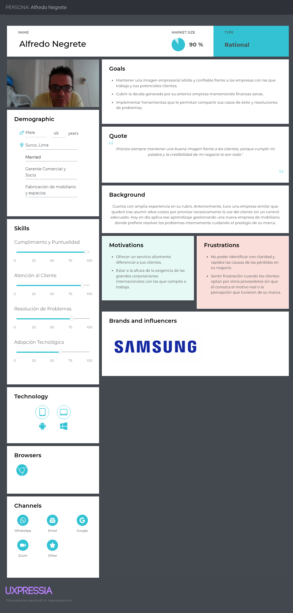

<br>

**User Persona 2 — Segmento 1: `Jenifer López`**


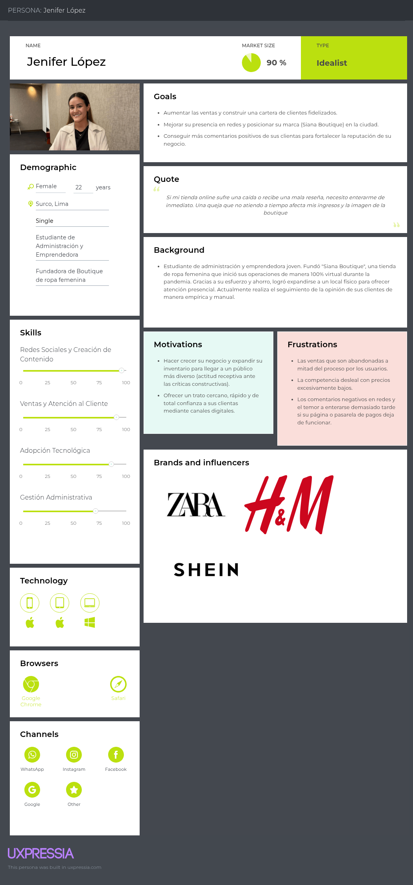

---

<br>

**User Persona 1 — Segmento 2: `Romina Apaza`**


<br>

**User Persona 2 — Segmento 2: `Esteban Medina`**


<br>

---

### 2.3.2. User Task Matrix

>*A continuación se presenta la matriz de tareas que realizan los User Persona de cada segmento para alcanzar sus objetivos, independientemente de la existencia de una solución de software. El análisis permite identificar qué tareas son más críticas para cada segmento según su frecuencia e importancia, y dónde existe mayor oportunidad de generar valor con BrandRadar.*


<br>

**User Task Matrix — `PyMEs`**

<br>

| Task | Frecuency | Importance |
|---|:---:|:---:|
| 1. Buscar menciones y reseñas de la marca en plataformas digitales | Media | Alta |
| 2. Revisar comentarios de clientes actuales y potenciales | Media | Alta |
| 3. Identificar comentarios negativos que afecten la imagen empresarial | Baja | Muy Alta |
| 4. Responder a clientes insatisfechos por canales directos (WhatsApp, email) | Media | Alta |
| 5. Identificar las causas de pérdida de clientes o contratos | Baja | Muy Alta |
| 6. Analizar la percepción general de la marca en el mercado | Baja | Alta |
| 7. Tomar decisiones comerciales en base a retroalimentación recibida | Media | Muy Alta |
| 8. Compartir casos de éxito y resolución de problemas con socios o clientes | Media | Alta |
| 9. Verificar si las acciones correctivas mejoraron la imagen de marca | Baja | Alta |
| 10. Comparar el desempeño reputacional de la empresa en distintos periodos | Baja | Media |

<br>

Este segmento agrupa a profesionales que administran empresas o áreas comerciales y para quienes la reputación de marca es un activo estratégico directamente vinculado a la captación y retención de clientes corporativos. Sus tareas de monitoreo y análisis se realizan de forma esporádica y sin un proceso definido, ya que no cuentan con herramientas especializadas ni con el tiempo operativo para hacerlo de manera sistemática. La alta importancia asignada a tareas de baja frecuencia revela una brecha crítica: saben que el monitoreo de su reputación es fundamental, pero no logran ejecutarlo con la regularidad necesaria.

<br>


**User Task Matrix — `Agencia(Account Manager)`**

<br>

| Task | Frecuency | Importance |
|---|:---:|:---:|
| 1. Monitorear menciones y reseñas de múltiples marcas en distintas plataformas | Alta | Muy Alta |
| 2. Identificar y priorizar comentarios negativos según urgencia e impacto | Alta | Muy Alta |
| 3. Responder públicamente a reseñas o comentarios en nombre de la marca | Alta | Alta |
| 4. Detectar quejas en Google Maps que afecten el posicionamiento del cliente | Alta | Muy Alta |
| 5. Escalar casos críticos de reputación al cliente o responsable interno | Media | Alta |
| 6. Analizar el sentimiento general por marca para orientar la estrategia de contenido | Media | Alta |
| 7. Elaborar reportes periódicos de reputación digital para cada cliente | Alta | Muy Alta |
| 8. Gestionar simultáneamente la reputación de múltiples cuentas o marcas | Alta | Muy Alta |
| 9. Configurar criterios de alerta ante eventos críticos de reputación | Media | Alta |
| 10. Verificar el estado de las fuentes de datos monitoreadas por plataforma | Alta | Media |
| 11. Comparar métricas de reputación entre periodos para evaluar evolución | Media | Alta |
| 12. Presentar resultados y estrategias de mejora a los clientes | Media | Media |

<br>

Este segmento comprende a profesionales digitales que gestionan la presencia en línea de múltiples marcas de forma simultánea, con alta exposición a crisis de reputación y exigencias de respuesta inmediata por parte de sus clientes. A diferencia del primer segmento, sus tareas de monitoreo y reporte son parte del núcleo de su trabajo diario, por lo que se ejecutan con alta frecuencia. La combinación de alta frecuencia y muy alta importancia en varias tareas evidencia que el proceso actual, al depender de revisiones manuales y herramientas dispersas, genera una carga operativa insostenible que limita su capacidad de escalar y ofrecer un servicio de mayor valor estratégico.

<br>

---

### 2.3.3. User Journey Mapping
>*El Customer Journey presentado ilustra el recorrido end-to-end actual (versión As-Is) que siguen los usuarios objetivo (dueños de PyMEs y especialistas de marketing) al gestionar la reputación digital de sus marcas. Este journey describe las etapas desde la toma de conciencia de la falta de control sobre las opiniones en línea, pasando por la búsqueda y adopción de soluciones, hasta el uso continuo de herramientas para monitorear menciones y responder a comentarios.
En el contexto actual, gran parte de estas actividades se realiza de forma manual y en múltiples plataformas, lo que genera retrasos en la detección de problemas, sobrecarga operativa y dificultades para obtener una visión integrada del estado de la reputación digital.
Este recorrido permite identificar puntos de fricción, emociones asociadas a cada etapa y oportunidades de mejora clave, las cuales fundamentan el diseño de la solución propuesta.*

<br>

**User Journey Map — `PyMEs`**

<br>


<br>

**User Journey Map — `Agencia(Account Manager)`**

<br>

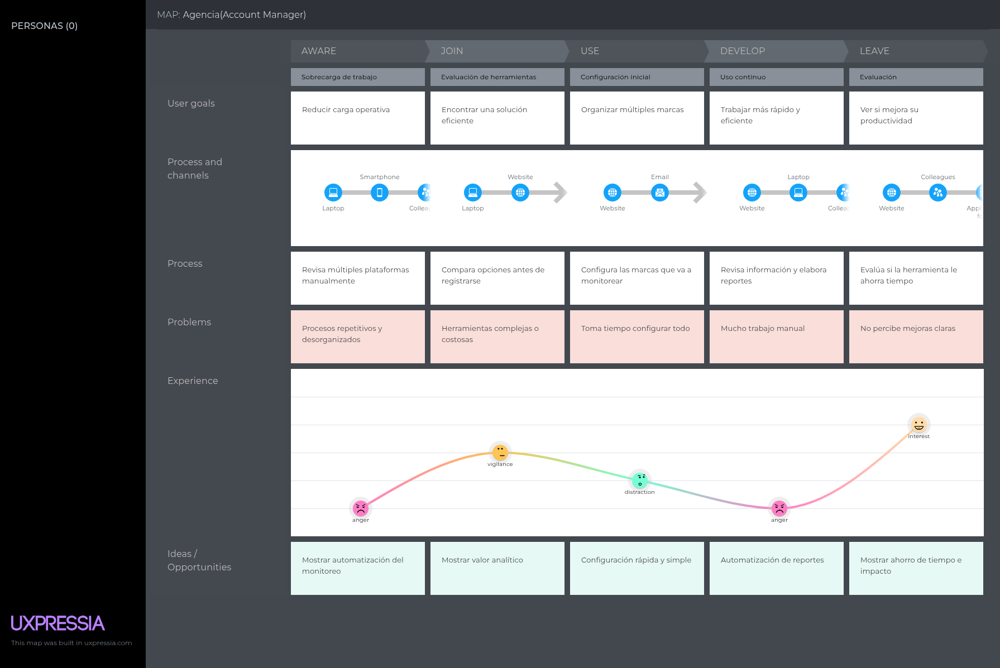

<br>

---

### 2.3.4. Empathy Mapping

>*El Empathy Mapping fue elaborado a partir del análisis de las entrevistas realizadas a los dos segmentos objetivo: dueños de PyMEs y account managers de agencias digitales. Este proceso permitió sintetizar la información cualitativa recolectada, identificando patrones de comportamiento, pensamientos, emociones, necesidades y frustraciones de los usuarios.*

<br>

**Empathy Map — `PyMEs`**


<br>

**Empathy Map — `Agencia(Account Manager)`**


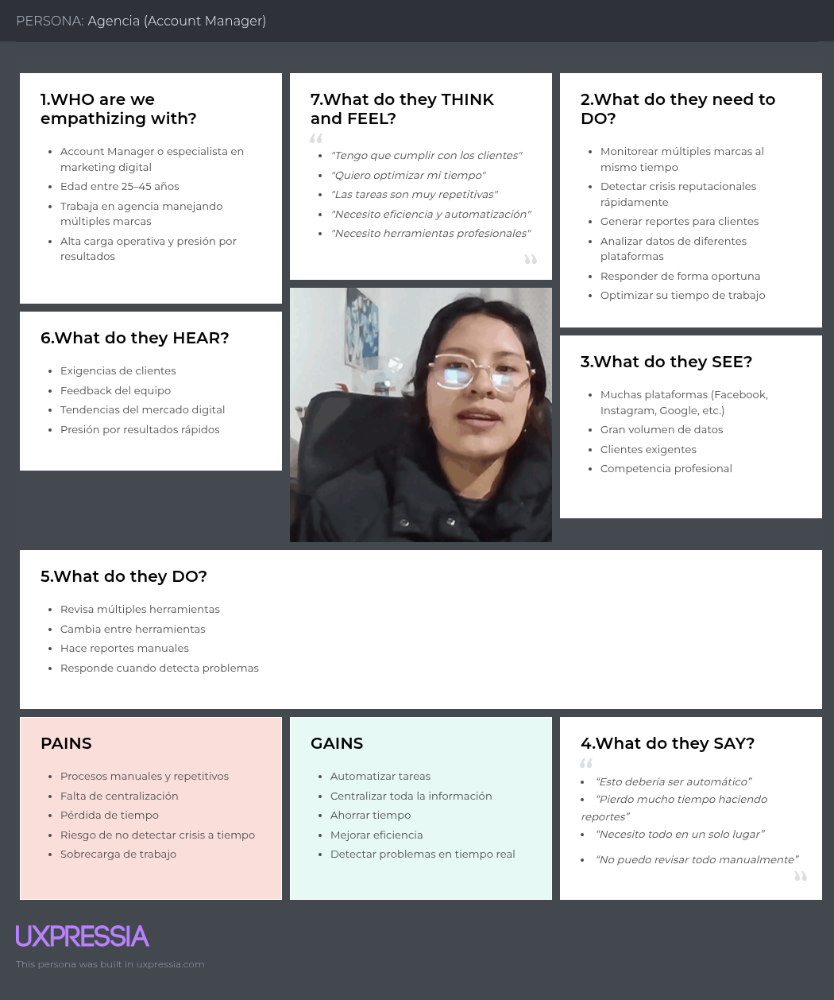

<br>

---

### 2.3.5. As-Is Scenario Mapping

>*El As-Is Scenario Mapping permite visualizar el estado actual de la experiencia de cada segmento objetivo antes de la existencia de BrandRadar. A través de las dimensiones de acciones (Doing), pensamientos (Thinking) y emociones (Feeling), se identifican los puntos de fricción, ineficiencias y necesidades insatisfechas que motivan el desarrollo de la solución. Este análisis es la base para comprender qué aspectos del proceso actual deben ser transformados.*

<br>

**Segmento 1: `PyMEs`**

<br>

*"Alfredo, gerente comercial de una empresa de mobiliario, necesita monitorear cómo perciben su marca los clientes y potenciales socios, pero no cuenta con un sistema centralizado para hacerlo."*

<br>

| | **Búsqueda de menciones y opiniones sobre su marca** | **Análisis y evaluación de la información recopilada** | **Toma de decisiones y respuesta al cliente** | **Seguimiento de resultados** |
|---|---|---|---|---|
| **Doing** | Revisa manualmente Google Maps, redes sociales y correos recibidos buscando comentarios sobre su empresa. Pregunta a su equipo comercial si han escuchado quejas o elogios de clientes. | Anota en hojas de cálculo o cuadernos los comentarios que considera relevantes. Intenta identificar patrones de insatisfacción basándose en su experiencia. | Responde personalmente a clientes insatisfechos por WhatsApp o email. Toma decisiones sobre cambios en el servicio de forma intuitiva, sin datos consolidados. | Verifica semanas después si el cliente volvió a contactarlo o si la queja se repite. No tiene un registro estructurado del historial. |
| **Thinking** | "No sé si hay comentarios negativos sobre mi empresa que no estoy viendo." | "No puedo saber con certeza si este problema es aislado o sistemático." | "Estoy respondiendo sin saber si mi respuesta realmente resuelve la percepción del cliente." | "No tengo forma de saber si mejoré mi reputación o solo resolví un caso puntual." |
| | "Revisar todo esto me quita tiempo que debería dedicar a conseguir nuevos clientes." | "Mis decisiones dependen de lo que recuerdo, no de datos reales." | "Si pierdo a un cliente potencial, nunca sabré si fue por algo que dijeron de mí en internet." | "Mi imagen de marca podría estar deteriorándose y yo sin enterarme a tiempo." |
| **Feeling** | Se siente inseguro al no tener visibilidad completa de lo que se dice sobre su empresa. | Se siente frustrado por la falta de claridad para identificar las causas reales de sus pérdidas comerciales. | Se siente impotente al responder de forma reactiva sin datos que respalden sus decisiones. | Se siente ansioso al no poder confirmar si sus acciones correctivas están teniendo efecto. |


<br>

**Segmento 2: `Agencia(Account Manager)`**

<br>

*"Romina, community manager freelance que gestiona cuentas de clínicas y organismos municipales, necesita monitorear la reputación de múltiples marcas en tiempo real, pero su proceso actual es fragmentado y manual."*

<br>

| | **Monitoreo de menciones en múltiples plataformas** | **Clasificación y priorización de comentarios** | **Respuesta y gestión de crisis** | **Reporte a clientes** |
|---|---|---|---|---|
| **Doing** | Ingresa manualmente a cada red social, Google Maps y reseñas por marca para revisar nuevos comentarios. Alterna entre plataformas sin un orden fijo, dependiendo del tiempo disponible. | Copia y pega los comentarios relevantes en un documento de Notion o Trello para organizarlos por urgencia. | Redacta respuestas individuales para cada comentario negativo. Escala a sus clientes los casos más críticos por WhatsApp. | Arma reportes manuales en documentos, agregando capturas de pantalla y métricas recopiladas a mano cada mes. |
| **Thinking** | "Hay demasiadas plataformas para revisar y siempre tengo miedo de perderme algo importante." | "Clasificar esto a mano me lleva horas que podría usar en estrategia de contenido." | "Si no detecto una queja a tiempo, el posicionamiento de mi cliente en Google puede verse afectado." | "Armar este reporte me tomó 3 horas. No es sostenible si quiero escalar mis cuentas." |
| | "No puedo estar pendiente de todo al mismo tiempo cuando manejo más de una marca." | "No tengo certeza de que lo que priorizo sea realmente lo más urgente." | "Respondo como puedo, pero sin datos de sentimiento no sé si mi estrategia está funcionando." | "Mis clientes me exigen datos que yo mismo estoy calculando a ojo." |
| **Feeling** | Se siente abrumada por el volumen de información dispersa que debe revisar diariamente. | Se siente agotada al invertir más de dos horas diarias en tareas repetitivas y manuales. | Se siente bajo presión constante ante el riesgo de no detectar una crisis a tiempo. | Se siente limitada profesionalmente porque el tiempo que pierde en reportes le impide ofrecer un servicio de mayor valor a sus clientes. |


<br>

---

## 2.4. Big Picture Event Storming

<br>

El proceso de Big Picture Event Storming se llevó a cabo con el objetivo de comprender de manera integral el flujo del dominio del sistema propuesto, identificando los principales eventos, actores involucrados e interacciones con sistemas externos. Esta técnica permitió visualizar el comportamiento del sistema de forma cronológica, facilitando la identificación de procesos clave, dependencias y posibles puntos de mejora dentro del flujo operativo.

Durante el desarrollo del Event Storming, se siguieron etapas estructuradas que permitieron construir progresivamente una representación clara del dominio del problema. En la primera etapa, denominada Collect Domain Events, se identificaron los principales eventos del sistema, los cuales representan acciones que ya han ocurrido dentro del flujo del negocio.

<br>


<br>

Posteriormente, en la etapa *Refine Domain Events*, se revisaron los eventos previamente identificados con el fin de validar su correcta redacción en tiempo pasado, asegurar su orden temporal y depurar posibles redundancias o inconsistencias terminológicas. Asimismo, se incorporaron eventos adicionales necesarios para completar el flujo lógico del sistema y representar con mayor precisión los procesos internos del dominio.
<br>


<br>

En la etapa *Track Causes*, se identificaron los actores que interactúan con el sistema, así como las acciones específicas que desencadenan determinados eventos, representadas mediante comandos. Asimismo, se incorporaron los sistemas externos que intervienen en el flujo, como servicios de análisis de sentimiento y plataformas de datos externas, además de los procesos internos que se ejecutan de manera automática entre eventos.

<br>


<br>

Finalmente, en la etapa *Find Aggregates*, se agruparon los eventos relacionados dentro de límites de consistencia conocidos como aggregates, lo que permitió identificar las principales entidades del dominio y sus responsabilidades. Esta etapa facilitó la estructuración del modelo de dominio y sirvió como base para el diseño posterior del sistema.

<br>


<br>

Durante el desarrollo del Big Picture Event Storming se identificaron los principales eventos del dominio, los actores que interactúan con el sistema y los flujos que describen el comportamiento general del sistema, desde el registro del usuario hasta la generación de reportes de reputación digital.

En primer lugar, se definieron los eventos del dominio, los cuales representan cambios significativos dentro del sistema y describen acciones ya completadas en tiempo pasado. Entre los eventos identificados se incluyen aquellos relacionados con la gestión de cuentas, como el registro de usuario, la verificación de correo electrónico y el inicio de sesión. Estos eventos marcan el inicio del flujo del sistema y habilitan el acceso del usuario a las funcionalidades principales.

Posteriormente, se identificaron eventos asociados a la configuración de marcas y fuentes de datos, como el registro de información de la marca, la definición de palabras clave y la conexión con fuentes externas. Estos eventos resultan fundamentales para iniciar el proceso de monitoreo y habilitar la recolección de información desde distintas plataformas digitales.

Asimismo, se reconocieron eventos vinculados al proceso de monitoreo automático, en el cual el sistema recolecta menciones desde fuentes externas, las filtra y las almacena para su análisis. En esta etapa se incluyen también los eventos de análisis de sentimiento, donde las menciones son clasificadas según su polaridad, permitiendo identificar posibles riesgos reputacionales.

Dentro del flujo del sistema, también se identificaron eventos relacionados con la gestión de alertas, donde el sistema genera notificaciones ante la detección de menciones negativas. Estas alertas son revisadas por los usuarios, quienes pueden ejecutar acciones de respuesta según la criticidad del caso.

Finalmente, se identificaron eventos correspondientes a la generación de reportes y visualización de métricas, donde el sistema permite crear informes, exportar resultados y actualizar dashboards con indicadores clave. Estos eventos facilitan la evaluación del desempeño de la marca y la toma de decisiones basadas en datos.

En cuanto a los actores identificados, se reconocen principalmente dos roles: el PyME Owner, responsable de la gestión directa de su marca, y el Agency Manager, encargado de administrar múltiples cuentas de clientes. Ambos interactúan con el sistema mediante acciones como la configuración de marcas, la revisión de alertas y la generación de reportes. Asimismo, se identificaron sistemas externos como redes sociales, servicios de análisis de sentimiento y servicios de notificación, los cuales alimentan el sistema con datos y permiten la interacción con los usuarios.

Los flujos del sistema describen el recorrido end-to-end desde el registro inicial hasta la generación de reportes finales, permitiendo visualizar cómo se encadenan los eventos y cómo interactúan los distintos actores y sistemas externos. Este análisis permitió identificar dependencias críticas, automatizaciones potenciales y puntos de mejora dentro del sistema.

En conjunto, la identificación de eventos, actores y flujos permitió construir una representación estructurada del dominio del problema, sirviendo como base para la definición de agregados y el diseño del modelo de dominio.

<br>

---

## 2.5. Ubiquitous Language

> *El Ubiquitous Language es el vocabulario compartido y no negociable del dominio reputacional de BrandRadar. Cada término tiene un significado preciso, único y consistente — el mismo para el equipo técnico, el equipo de negocio y los stakeholders. Su uso en User Stories, criterios de aceptación, código fuente, APIs y documentación elimina ambigüedades y garantiza que el modelo de dominio refleje la realidad del negocio. Los términos están organizados por categoría semántica: Aggregates, Entidades, Value Objects, Domain Events, Estados y Roles.*

<br>

### Aggregates Raíz
 
| Término (EN) | Término (ES) | Definición |
|:-------------|:-------------|:-----------|
| `BrandWorkspace` | Workspace de Marca | Aggregate raíz que encapsula todo el perímetro de monitoreo de una marca: sus reglas activas, fuentes conectadas, límites operacionales y estado de cobertura. Ninguna operación de monitoreo ocurre fuera de un `BrandWorkspace`. |
| `ReputationIncident` | Incidente Reputacional | Aggregate raíz que representa un evento de riesgo reputacional detectado. Encapsula severidad, estado de escalamiento, historial de respuestas y trazabilidad de quién lo gestionó. Transita por estados definidos hasta su resolución. |
| `MonitoringRule` | Regla de Monitoreo | Aggregate raíz que protege la consistencia de las reglas de detección de una marca: palabras clave activas, umbrales de alerta y triggers automáticos. Versionada con trazabilidad de cambios. |
| `MentionStream` | Flujo de Menciones | Aggregate raíz que agrupa temporalmente menciones capturadas para una marca, garantizando su clasificación consistente y habilitando la detección de anomalías. |
 
<br>
 
### Entidades
 
| Término (EN) | Término (ES) | Definición |
|:-------------|:-------------|:-----------|
| `UserAccount` | Cuenta de Usuario | Entidad que representa la identidad de un usuario dentro del sistema. Controla el acceso, el rol y los workspaces autorizados. Transita por estados de ciclo de vida definidos. |
| `Brand` | Marca | Entidad que representa la empresa o producto cuya reputación digital es monitoreada. Pertenece a un `BrandWorkspace` y no existe fuera de él. |
| `Mention` | Mención | Entidad que representa un contenido externo que hace referencia a una marca. Tiene fuente, fecha, clasificación de sentimiento y nivel de severidad. Es inmutable una vez capturada. |
| `MonitoringChannel` | Canal de Monitoreo | Entidad que representa una fuente digital conectada a un `BrandWorkspace` (red social, plataforma de reseñas, etc.). Tiene estado propio de conexión y es independiente por canal. |
| `CrisisAlert` | Alerta de Crisis | Entidad generada automáticamente cuando una `MonitoringRule` detecta un umbral superado. Desencadena el ciclo de vida de un `ReputationIncident`. |
| `ReputationReport` | Reporte Reputacional | Entidad que consolida el análisis de un período: variaciones de `SentimentScore`, volumen de menciones e incidentes. Persiste en el historial como evidencia estratégica inmutable. |
| `UserSubscription` | Suscripción de Usuario | Entidad que define el plan contratado por una cuenta, sus límites operacionales (marcas, fuentes, usuarios) y su vigencia. |
 
<br>
 
### Value Objects
 
| Término (EN) | Término (ES) | Definición |
|:-------------|:-------------|:-----------|
| `SentimentScore` | Puntaje de Sentimiento | Valor calculado que representa la percepción reputacional global de una marca en un período. Compuesto por distribución positivo/negativo/neutro y un índice consolidado. Inmutable — se recalcula, no se modifica. |
| `SeverityLevel` | Nivel de Severidad | Clasificación ordinal del impacto potencial de un `ReputationIncident`: `BAJA`, `MEDIA`, `ALTA`, `CRÍTICA`. Determina la prioridad de escalamiento y respuesta. |
| `AlertThreshold` | Umbral de Alerta | Configuración que define cuándo el volumen o intensidad de menciones negativas activa una `CrisisAlert`. Específico por `BrandWorkspace` y personalizable por cliente. |
| `MentionSource` | Fuente de Mención | Identificador de la plataforma digital de origen de una mención (Twitter/X, Instagram, Google Reviews, etc.). Parte del estado de cada `MonitoringChannel`. |
| `KeywordRule` | Regla de Palabra Clave | Término o expresión definida dentro de una `MonitoringRule` para la detección automática de menciones sensibles. No admite duplicados dentro del mismo `BrandWorkspace`. |
| `ReputationIndex` | Índice Reputacional | Indicador compuesto que resume el estado de salud reputacional de una marca, derivado del `SentimentScore` y la frecuencia de `ReputationIncident` activos. |
| `MonitoringPeriod` | Período de Monitoreo | Rango de fechas con trazabilidad de inicio y fin de cobertura activa de un `BrandWorkspace`. Inmutable una vez registrado. |
 
<br>
 
### Domain Events
 
| Término (EN) | Término (ES) | Definición |
|:-------------|:-------------|:-----------|
| `AccountRegistered` | Cuenta Registrada | Evento emitido cuando un usuario completa el registro. La cuenta queda en estado `PENDIENTE_VERIFICACIÓN`. Ningún workspace es accesible hasta la verificación. |
| `AccountActivated` | Cuenta Activada | Evento emitido cuando el token de verificación es válido y la cuenta transita a estado `ACTIVA`. Habilita el acceso al workspace asignado. |
| `MonitoringActivated` | Monitoreo Activado | Evento emitido cuando un `BrandWorkspace` completa su configuración mínima (keywords + fuente) y transita a estado `MONITOREO_ACTIVO`. El motor de detección comienza a operar. |
| `MonitoringRuleUpdated` | Regla de Monitoreo Actualizada | Evento emitido cuando se modifican keywords o umbrales de un `BrandWorkspace`. Registra la versión anterior para trazabilidad y aplica la nueva configuración inmediatamente. |
| `MonitoringSourceFailed` | Falla de Fuente de Monitoreo | Evento emitido cuando un `MonitoringChannel` activo deja de responder. La fuente transita a estado `ERROR`. El monitoreo de las demás fuentes continúa sin interrupción. |
| `NegativeMentionDetected` | Mención Negativa Detectada | Evento emitido cuando una fuente supera el umbral de menciones negativas configurado en la `MonitoringRule`. Activa la creación de una `CrisisAlert`. |
| `ReputationSpikeDetected` | Pico Reputacional Detectado | Evento emitido cuando el volumen de menciones negativas supera el `AlertThreshold` en un período corto. Desencadena la creación de un `ReputationIncident` con `SeverityLevel` `ALTA` o `CRÍTICA`. |
| `CrisisEscalated` | Crisis Escalada | Evento emitido cuando un `ReputationIncident` con `SeverityLevel` `CRÍTICA` no tiene analista asignado. Activa notificación inmediata a los responsables designados. |
| `AlertAcknowledged` | Alerta Reconocida | Evento emitido cuando un supervisor registra una respuesta válida a un `ReputationIncident`. El incidente transita a estado `RESPONDIDO`. |
| `WorkspaceDeactivated` | Workspace Desactivado | Evento emitido cuando un administrador desactiva un `BrandWorkspace`. El monitoreo se suspende pero todo el historial de menciones, incidentes y reglas se conserva intacto. |
| `ReportGenerated` | Reporte Generado | Evento emitido cuando un `ReputationReport` es creado exitosamente para un período con evidencia disponible. El reporte queda persistido en el historial para auditoría. |
| `WorkspaceAccessGranted` | Acceso a Workspace Concedido | Evento emitido cuando un administrador asigna un `BrandWorkspace` a un usuario. El workspace queda visible en la sesión del usuario autorizado. |
| `WorkspaceAccessRevoked` | Acceso a Workspace Revocado | Evento emitido cuando se revoca el acceso de un usuario a un `BrandWorkspace`. El workspace queda inaccesible de forma inmediata, incluso en sesiones activas. |
| `UnauthorizedAccessAttempted` | Intento de Acceso No Autorizado | Evento de auditoría emitido cuando un usuario intenta acceder a un `BrandWorkspace` que no le fue asignado. Queda registrado con userId, workspaceId y timestamp. |
| `SentimentTrendChanged` | Tendencia de Sentimiento Cambiada | Evento emitido cuando el `SentimentScore` de una marca varía significativamente respecto al período anterior, habilitando análisis de impacto de campañas. |
| `ProspectInterestCaptured` | Interés de Prospecto Capturado | Evento emitido cuando un visitante hace clic en la CTA de la landing page. Inicia el seguimiento comercial del prospecto. |
| `CommercialInquiryReceived` | Consulta Comercial Recibida | Evento emitido cuando un visitante envía el formulario de contacto con datos válidos. Registra la consulta en el pipeline comercial para seguimiento. |
 
<br>
 
### Estados del Dominio
 
| Término (EN) | Término (ES) | Entidad / Aggregate | Definición |
|:-------------|:-------------|:--------------------|:-----------|
| `PENDING_VERIFICATION` | `PENDIENTE_VERIFICACIÓN` | `UserAccount` | Estado inicial tras el registro. Ningún workspace es accesible. Requiere verificación de correo para avanzar. |
| `ACTIVE` | `ACTIVA` | `UserAccount` | Estado operacional. El usuario puede autenticarse y operar sobre sus workspaces asignados. |
| `BLOCKED` | `BLOQUEADA` | `UserAccount` | Estado de bloqueo por 5 intentos fallidos de login. Requiere intervención del administrador para desbloquear. |
| `WITHOUT_CONFIGURATION` | `SIN_CONFIGURACIÓN` | `BrandWorkspace` | Estado inicial del workspace. No tiene keywords ni fuentes conectadas. El motor de detección no opera. |
| `MONITORING_ACTIVE` | `MONITOREO_ACTIVO` | `BrandWorkspace` | Estado operacional. El workspace tiene configuración mínima completa y el motor captura menciones activamente. |
| `INACTIVE` | `INACTIVO` | `BrandWorkspace` | Estado suspendido por desactivación. El monitoreo se detiene pero el historial se conserva íntegro. |
| `CONNECTED` | `CONECTADA` | `MonitoringChannel` | La fuente está integrada y enviando menciones al sistema según las reglas activas. |
| `DISCONNECTED` | `DESCONECTADA` | `MonitoringChannel` | La fuente no está integrada. Sus menciones no son recolectadas. No afecta a otras fuentes. |
| `ERROR` | `ERROR` | `MonitoringChannel` | La fuente estaba conectada pero dejó de responder. Emite `MonitoringSourceFailed`. El monitoreo continúa con las fuentes restantes. |
| `CRITICAL` | `CRÍTICA` | `MonitoringChannel` | La fuente acumula un volumen de menciones negativas que supera el umbral configurado. Activa `NegativeMentionDetected`. |
| `ACTIVE` | `ACTIVO` | `ReputationIncident` | Incidente detectado y abierto. Requiere atención. Si es `CRÍTICA` sin asignar, emite `CrisisEscalated`. |
| `UNASSIGNED` | `SIN_ASIGNAR` | `ReputationIncident` | Incidente crítico sin analista asignado. Estado de máxima urgencia operacional. |
| `RESPONDED` | `RESPONDIDO` | `ReputationIncident` | El incidente tiene al menos una respuesta registrada con responsable y timestamp. |
| `RESOLVED` | `RESUELTO` | `ReputationIncident` | El incidente fue cerrado por el equipo responsable. La trazabilidad completa queda archivada. |
| `DISCARDED` | `DESCARTADO` | `ReputationIncident` | El incidente fue evaluado como falso positivo. La decisión queda registrada con analista y justificación para calibrar el motor de detección. |
| `GENERATING` | `GENERANDO` | `ReputationReport` | El reporte está siendo procesado. No puede exportarse hasta alcanzar estado `LISTO`. |
| `READY` | `LISTO` | `ReputationReport` | El reporte está disponible para descarga en PDF o CSV. |
| `SIGNIFICANT` | `SIGNIFICATIVA` | Variación de `SentimentScore` | Variación entre períodos que supera el 20% en el `SentimentScore`. Se indica con dirección (mejora / deterioro) para análisis estratégico. |
 
<br>
 
### Roles del Dominio
 
| Término (EN) | Término (ES) | Definición |
|:-------------|:-------------|:-----------|
| `Corporate Administrator` | Administrador Corporativo | Usuario con permisos para crear cuentas, asignar y revocar acceso a `BrandWorkspace`, y desactivar marcas. Opera sobre la estructura del sistema. |
| `Agency Manager` | Gerente de Agencia | Usuario que gestiona múltiples `BrandWorkspace` de distintos clientes. Configura umbrales de escalamiento y exporta reportes para sus clientes. |
| `Reputation Analyst` | Analista Reputacional | Usuario que define `MonitoringRule`, filtra menciones e identifica patrones reputacionales. Opera dentro de los workspaces asignados. |
| `Community Manager` | Community Manager | Usuario que monitorea menciones en tiempo real, prioriza respuestas y gestiona la interacción con las audiencias digitales de una marca. |
| `Reputation Supervisor` | Supervisor Reputacional | Usuario que registra respuestas a `ReputationIncident`, mantiene la trazabilidad operacional y audita el historial de gestión de crisis. |
| `Digital Strategist` | Estratega Digital | Usuario que analiza tendencias de `SentimentScore`, compara períodos y evalúa el impacto de campañas sobre la percepción de marca. |
| `PyME Owner` | Dueño de PyME | Usuario que gestiona la reputación de su propio negocio. Opera sobre un único `BrandWorkspace` con autonomía total sobre su configuración. |

<br>

---

<div align="center">

# Capítulo III: Requirements Specification

</div>


## 3.1. User Stories

>*Las User Stories expresan necesidades reales del negocio reputacional, no funcionalidades de interfaz. Cada historia describe una capacidad operacional con impacto concreto en la gestión de reputación digital. Los criterios de aceptación siguen la estructura Gherkin (Given/When/Then) y validan **comportamiento del dominio**: estados que cambian, **invariantes que se protegen**, y eventos que se emiten — no lo que muestra la pantalla. Los aggregates raíz (`BrandWorkspace`, `ReputationIncident`, `MonitoringRule`, `MentionStream`) y los Domain Events utilizados en estas historias fueron derivados del Event Storming del equipo. Los criterios de aceptación se redactan en tiempo presente y tercera persona, sin referencias a detalles de interfaz, siguiendo la estructura Gherkin (Given / When / Then).*

<br>

## Epics

| **ID** | **Título** | **Descripción** | **Historias Relacionadas** |
| --- | --- | --- | --- |
| **EP01** | **Adquisición de Clientes** | Capacidad de negocio que permite convertir visitantes en prospectos calificados, comunicando la propuesta de valor reputacional de BrandRadar y habilitando el primer contacto comercial con segmentos PyME y agencias digitales. | US01, US02, US03, US04, US05 |
| **EP02** | **Identidad y Acceso Seguro** | Capacidad de negocio que garantiza que solo usuarios autorizados accedan a información reputacional sensible de sus marcas asignadas, protegiendo la integridad operacional del sistema. | US06, US07, US08, US09, US10, TS01, TS02, TS03, TS04, TS05 |
| **EP03** | **Configuración Estratégica de Marca** | Capacidad de negocio que permite a los equipos definir el perímetro de monitoreo de cada marca: palabras clave sensibles, fuentes relevantes y reglas de seguimiento reputacional. | US11, US12, US13, US14, US15, TS06, TS07, TS08 |
| **EP04** | **Detección y Trazabilidad de Menciones** | Capacidad de negocio que habilita la captura, clasificación y trazabilidad de menciones digitales, permitiendo identificar señales reputacionales antes de que escalen. | US16, US17, US18, US19, TS09 |
| **EP05** | **Inteligencia de Sentimiento Reputacional** | Capacidad de negocio que transforma menciones en señales interpretables de percepción, detectando deterioro reputacional y tendencias adversas que requieren acción correctiva. | US20, US21, US22, TS10 |
| **EP06** | **Gestión de Crisis y Escalamiento** | Capacidad de negocio que permite detectar, priorizar, escalar y responder a incidentes reputacionales críticos antes de que afecten la percepción pública de la marca. | US23, US24, US25, US26, TS11, TS12 |
| **EP07** | **Inteligencia Estratégica y Reportes** | Capacidad de negocio que convierte datos reputacionales en evidencia estratégica, permitiendo evaluar impacto de campañas, comparar períodos y documentar evolución reputacional. | US27, US28, US29, US30, US31, US32, TS13, TS14, TS15 |
| **EP08** | **Control de Acceso Contextual** | Capacidad de negocio que garantiza que cada usuario opera exclusivamente dentro del perímetro reputacional de las marcas que le fueron asignadas, protegiendo información sensible entre clientes y equipos. | US33, TS16 |

<br>

## User Stories & Technical Stories

 | **Story/Epic  ID** | **Título** | **Descripción** | **Criterios de Aceptación** | **Epic ID** |
| --- | --- | --- | --- | --- |
| **EP01 – Landing Page** |||||
| **US01** | Comunicar propuesta de valor para convertir visitantes en prospectos | Como visitante PyME o de agencia digital, quiero comprender rápidamente qué problema resuelve BrandRadar y qué lo diferencia de otras herramientas para decidir si vale la pena registrarme. | **Escenario 1 – Prospecto decide iniciar registro:** <br> **Given:** el visitante accede a la página principal y lee la propuesta de valor <br>**When:** comprende que BrandRadar monitorea reputación en tiempo real <br> **Then:** el sistema registra la intención de conversión cuando el visitante hace clic en 'Comenzar gratis', emitiendo el evento `ProspectInterestCaptured` para el seguimiento comercial. <br> <br> **Escenario 2 – Visitante abandona sin conversión:** <br> **Given:** el visitante llega a la página pero no encuentra su caso de uso representado <br> **When:** abandona sin interactuar <br> **Then:** el sistema no registra ningún evento de conversión, preservando la integridad de las métricas de adquisición. <br> <br> **Escenario 3 – Prospecto desde dispositivo móvil:** <br> **Given:** el visitante accede desde un smartphone <br> **When:** lee la propuesta de valor <br> **Then:** el contenido es completamente legible y la llamada a la acción es accesible, sin pérdida de capacidad de conversión por limitaciones de dispositivo. | EP01 |
| **US02** | Evaluar si las capacidades del producto cubren las necesidades de monitoreo reputacional | Como director de agencia digital, quiero conocer las capacidades operacionales de BrandRadar — detección de menciones, análisis de sentimiento, gestión de crisis — para evaluar si cubre el flujo de trabajo de mis clientes antes de comprometer una suscripción. | **Escenario 1 – Capacidades operacionales identificadas:** <br> **Given:** el director accede a la sección de funcionalidades <br> **When:** revisa las capacidades listadas <br> **Then:** puede identificar al menos tres flujos de trabajo reputacional concretos (monitoreo, detección de crisis, reportes) que se alinean con sus necesidades operacionales. <br> <br> **Escenario 2 – Caso de uso para agencias representado:** <br> **Given:** el director busca si BrandRadar soporta gestión multi-cliente <br> **When:** revisa la sección de agencias <br> **Then:** el sistema expone explícitamente la capacidad de gestión de múltiples marcas con reportes por cliente, habilitando evaluación de adecuación para su modelo de negocio. <br> <br> **Escenario 3 – Prospecto no encuentra su caso de uso:** **Given:** el visitante no identifica su segmento representado **When:** intenta contactar al equipo para más información **Then:** puede acceder directamente al flujo de contacto sin abandonar la evaluación. | EP01 |
| **US03** | Reducir fricción de decisión mediante evidencia social de usuarios reales | Como gerente PyME, quiero conocer la experiencia de otras empresas similares con BrandRadar para reducir el riesgo percibido de adopción y tomar una decisión de registro más informada. | **Escenario 1 – Evidencia social de segmento relevante:** <br> **Given:** el gerente accede a la sección de testimonios <br> **When:** revisa los casos presentados <br> **Then:** puede identificar al menos un testimonio de una empresa del mismo segmento (PyME o agencia) que describe un problema reputacional concreto resuelto con BrandRadar. <br> <br> **Escenario 2 – Credibilidad del testimonio verificable:** <br> **Given:** el gerente quiere validar la autenticidad del caso <br> **When:** revisa el testimonio <br> **Then:** el sistema expone nombre, tipo de empresa y descripción del resultado operacional obtenido, no solo una frase genérica de satisfacción. <br> <br> **Escenario 3 – Más de un caso disponible para comparación:** <br> **Given:** hay múltiples testimonios con casos distintos <br> **When:** el gerente navega entre ellos <br> **Then:** puede comparar experiencias de distintos perfiles para reducir incertidumbre antes de registrarse. | EP01 |
| **US04** | Seleccionar el plan que se alinea con la escala operacional del negocio | Como dueño de PyME, quiero comparar los planes disponibles de BrandRadar con sus límites operacionales — marcas monitoreadas, fuentes, usuarios — para seleccionar el que se ajusta a mi escala sin pagar por capacidad que no usaré. | **Escenario 1 – Comparación de capacidades operacionales por plan:** <br> **Given:** el dueño accede a la sección de precios <br> **When:** compara los planes disponibles <br> **Then:** puede identificar diferencias concretas en capacidades operacionales (número de marcas, fuentes conectadas, usuarios) que le permiten tomar una decisión fundamentada en sus necesidades actuales. <br> <br> **Escenario 2 – Plan seleccionado vincula compromiso comercial:** <br> **Given:** el dueño decide qué plan se ajusta a su escala <br> **When:** elige un plan <br> **Then:** el sistema registra la selección como intención comercial y la preserva durante el flujo de registro para evitar que el prospecto deba repetir la decisión. <br> <br> **Escenario 3 – Plan sin información operacional suficiente:** <br> **Given:** el dueño no puede determinar si el plan cubre sus necesidades con la información disponible <br> **When:** intenta obtener más detalles <br> **Then:** puede acceder directamente al flujo de contacto comercial sin perder el contexto de la evaluación. | EP01 |
| **US05** | Iniciar conversación comercial antes de comprometer una suscripción | Como director de agencia con necesidades específicas, quiero contactar directamente al equipo de BrandRadar para resolver dudas sobre capacidades operacionales antes de comprometer una suscripción para mis clientes. | **Escenario 1 – Consulta comercial registrada correctamente:** <br> **Given:** el director completa nombre, correo corporativo y descripción de su necesidad operacional <br> **When:** envía el mensaje <br> **Then:** el sistema registra la consulta como evento `CommercialInquiryReceived` con todos los datos, el formulario queda limpio y el director recibe confirmación de que fue recibida. <br> <br> **Escenario 2 – Correo corporativo inválido bloqueado:** <br> **Given:** el director ingresa un formato de correo inválido <br> **When:** intenta enviar <br> **Then:** el sistema rechaza el envío y la consulta no queda registrada, protegiendo la integridad del pipeline comercial de datos incorrectos. <br> <br> **Escenario 3 – Intento de envío sin información de negocio:** <br> **Given:** el director omite campos obligatorios que impiden entender la necesidad <br> **When:** intenta enviar <br> **Then:** el sistema bloquea el envío y ninguna consulta incompleta queda registrada, evitando seguimientos comerciales sin contexto. | EP01 |
| **EP02 – Identidad y Acceso Seguro** |||||
| **US06** | Registrar cuenta para acceder a monitoreo reputacional | Como administrador corporativo, quiero crear una cuenta verificada con acceso solo a las marcas asignadas para proteger información reputacional sensible de cada cliente. | **Escenario 1 – Registro exitoso:** <br> **Given:** el administrador completa nombre, correo, contraseña válida y tipo de cuenta <br> **When:** envía el formulario <br> **Then:** el sistema crea la cuenta en estado `PENDIENTE_VERIFICACIÓN`, emite el evento `AccountRegistered` y ningún workspace queda accesible hasta completar la verificación. <br> <br> **Escenario 2 – Contraseña inválida:** <br> **Given:** el administrador ingresa una contraseña que no cumple los requisitos mínimos de seguridad <br> **When:** envía el formulario <br> **Then:** el sistema rechaza el registro, la cuenta no se crea y el estado del dominio no cambia. <br> <br> **Escenario 3 – Correo ya registrado:** <br> **Given:** el correo ingresado ya está asociado a una cuenta existente <br> **When:** envía el formulario <br> **Then:** el sistema rechaza el registro sin revelar si la cuenta está activa o pendiente, protegiendo información de otros usuarios. | EP02 |
| **US07** | Verificar correo para activar acceso reputacional | Como usuario recién registrado, quiero verificar mi correo electrónico para activar mi cuenta y comenzar a monitorear la reputación de mis marcas. | **Escenario 1 – Verificación exitosa:** <br> **Given:** el usuario accede al enlace de verificación con un token válido y vigente <br> **When:** el sistema valida el token <br> **Then:** la cuenta transita de estado `PENDIENTE_VERIFICACIÓN` a `ACTIVA`, se emite el evento `AccountActivated` y el usuario puede acceder al workspace asignado. <br> <br> **Escenario 2 – Token expirado:** <br> **Given:** el token de verificación ya superó su tiempo de vigencia <br> **When:** el sistema lo valida <br> **Then:** la cuenta permanece en estado `PENDIENTE_VERIFICACIÓN`, el token queda invalidado y el acceso al workspace sigue bloqueado. <br> <br> **Escenario 3 – Token inválido:** <br> **Given:** el token es incorrecto o fue manipulado <br> **When:** el sistema lo valida <br> **Then:** el sistema rechaza la verificación, registra el intento fallido como evento de auditoría y la cuenta no cambia de estado. | EP02 |
| **US08** | Iniciar sesión para acceder a marcas asignadas | Como administrador autorizado, quiero iniciar sesión para acceder únicamente a las marcas asignadas a mi cuenta y proteger información reputacional sensible. | **Escenario 1 – Login exitoso:** <br> **Given:** el usuario ingresa credenciales válidas y su cuenta está en estado `ACTIVA` <br> **When:** el sistema autentica <br> **Then:** se carga exclusivamente el contexto del workspace asignado a esa cuenta, sin exponer marcas ni datos de otros workspaces. <br> <br> **Escenario 2 – Credenciales incorrectas:** <br> **Given:** el usuario ingresa contraseña incorrecta <br> **When:** el sistema valida <br> **Then:** el intento queda registrado en el log de auditoría; tras 5 intentos fallidos consecutivos la cuenta transita a estado `BLOQUEADA` y el acceso queda suspendido hasta intervención del administrador. <br> <br> **Escenario 3 – Cuenta no verificada:** <br> **Given:** la cuenta está en estado `PENDIENTE_VERIFICACIÓN` <br> **When:** el usuario intenta ingresar <br> **Then:** el acceso es denegado, el estado de la cuenta no cambia y no se expone información del workspace. | EP02 |
| **US09** | Recuperar acceso sin comprometer seguridad reputacional | Como usuario registrado, quiero recuperar acceso a mi cuenta mediante un flujo seguro para evitar que información reputacional sensible quede expuesta. | **Escenario 1 – Solicitud enviada:** <br> **Given:** el usuario ingresa su correo en el flujo de recuperación <br> **When:** el sistema procesa la solicitud <br> **Then:** se genera un token de recuperación con vigencia de 1 hora, se emite el evento `PasswordRecoveryRequested` y el sistema no confirma si el correo existe o no, previniendo enumeración de cuentas. <br> <br> **Escenario 2 – Restablecimiento exitoso:** <br> **Given:** el usuario accede con un token de recuperación válido y completa una nueva contraseña segura <br> **When:** el sistema procesa <br> **Then:** las credenciales se actualizan, el token queda invalidado, todas las sesiones activas previas se cierran y se emite el evento `PasswordReset`. <br> <br> **Escenario 3 – Token de recuperación expirado:** <br> **Given:** el usuario intenta usar un token cuya vigencia de 1 hora ya venció <br> **When:** el sistema valida <br> **Then:** el token queda invalidado definitivamente, el acceso permanece bloqueado y debe iniciarse un nuevo flujo de recuperación. | EP02 |
| **US10** | Cerrar sesión para proteger datos reputacionales | Como usuario autenticado, quiero cerrar sesión para proteger el acceso a información reputacional sensible desde dispositivos compartidos o no seguros. | **Escenario 1 – Cierre exitoso:** <br> **Given:** el usuario tiene una sesión activa con workspace cargado <br> **When:** ejecuta el cierre de sesión <br> **Then:** la sesión queda invalidada en el servidor, el contexto del workspace se descarga completamente del cliente y se emite el evento `SessionTerminated`. <br> <br> **Escenario 2 – Sesión expirada por inactividad:** <br> **Given:** el usuario no registra actividad durante 30 minutos <br> **When:** el sistema detecta el timeout <br> **Then:** la sesión se invalida automáticamente, el workspace se descarga y el usuario debe reautenticarse para retomar el acceso. <br> <br> **Escenario 3 – Cierre en múltiples pestañas:** **Given:** el usuario cierra sesión en una pestaña activa <br> **When:** intenta operar en otra pestaña abierta <br> **Then:** el sistema detecta que la sesión fue invalidada y deniega cualquier operación sobre el workspace en esa pestaña. | EP02 |
| **TS01** | Endpoint de registro de usuario | Como Developer, quiero implementar el endpoint de registro en Spring Boot para que la aplicación pueda crear nuevas cuentas de usuario. | **Escenario 1 – Registro exitoso (201):** <br> **Given:** datos válidos en POST /api/v1/auth/register <br> **When:** el servidor procesa <br> **Then:** crea usuario en estado `PENDIENTE_VERIFICACIÓN`, emite evento `AccountRegistered` y retorna 201 con userId. <br> <br> **Escenario 2 – Correo duplicado (409):** <br> **Given:** correo ya existe <br> **When:** el servidor procesa *<br> *Then:** retorna 409 sin revelar el estado de la cuenta existente. <br> <br> **Escenario 3 – Datos inválidos (400):** <br> **Given:** campos faltantes o formato incorrecto <br> **When:** el servidor valida <br> **Then:** retorna 400 con detalle de errores. | EP02 |
| **TS02** | Endpoint de inicio de sesión y emisión de JWT | Como Developer, quiero implementar el endpoint de login en Spring Boot para autenticar usuarios y emitir tokens JWT. | **Escenario 1 – Login exitoso (200):** <br> **Given:** credenciales válidas en POST /api/v1/auth/login con cuenta en estado `ACTIVA` <br> **When:** el servidor autentica <br> **Then:** retorna 200 con JWT, refresh token y expiración. <br> <br> **Escenario 2 – Credenciales inválidas (401):** <br> **Given:** contraseña incorrecta <br> **When:** el servidor valida <br> **Then:** registra intento fallido y retorna 401; al quinto intento consecutivo actualiza estado a `BLOQUEADA`. <br> <br> **Escenario 3 – Cuenta no verificada (403):** <br> **Given:** cuenta en estado `PENDIENTE_VERIFICACIÓN` <br> **When:** el servidor procesa <br> **Then:** retorna 403. | EP02 |
| **TS03** | Endpoint de verificación de correo | Como Developer, quiero implementar el endpoint de verificación de token en Spring Boot para activar las cuentas de usuario. | **Escenario 1 – Verificación exitosa (200):** <br> <br> **Given:** token válido en GET /api/v1/auth/verify?token={token} **When:** el servidor procesa <br> **Then:** transiciona cuenta a estado `ACTIVA`, emite evento `AccountActivated` y retorna 200. <br> <br> **Escenario 2 – Token expirado (400):** <br> **Given:** token vencido <br> **When:** el servidor valida <br> **Then:** invalida el token y retorna 400; la cuenta permanece en `PENDIENTE_VERIFICACIÓN`. <br> <br> **Escenario 3 – Token inválido (404):** <br> **Given:** token inexistente o manipulado <br> **When:** el servidor busca <br> **Then:** registra intento de auditoría y retorna 404. | EP02 |
| **TS04** | Endpoint de recuperación de contraseña | Como Developer, quiero implementar el flujo de recuperación de contraseña en Spring Boot para que los usuarios puedan restablecer su acceso. | **Escenario 1 – Solicitud enviada (200):** <br> **Given:** correo en POST /api/v1/auth/forgot-password <br> **When:** el servidor procesa <br> **Then:** genera token con vigencia de 1 hora, emite evento `PasswordRecoveryRequested` y retorna 200 independientemente de si el correo existe. <br> <br> **Escenario 2 – Restablecimiento exitoso (200):** <br> **Given:** token válido en POST /api/v1/auth/reset-password <br> **When:** el servidor procesa <br> **Then:** actualiza contraseña, invalida token, cierra sesiones activas, emite evento `PasswordReset` y retorna 200. <br> <br> **Escenario 3 – Token expirado (400):** <br> **Given:** token vencido <br> **When:** el servidor valida <br> **Then:** invalida el token definitivamente y retorna 400. | EP02 |
| **TS05** | Endpoint de refresh de token JWT | Como Developer, quiero implementar el endpoint de renovación de token en Spring Boot para mantener la sesión activa sin requerir un nuevo login. | **Escenario 1 – Refresh exitoso (200):** <br> **Given:** refresh token válido en POST /api/v1/auth/refresh <br> **When:** el servidor valida <br> **Then:** emite nuevo JWT, invalida el anterior y retorna 200. <br> <br> **Escenario 2 – Token inválido (401):** <br> **Given:** token manipulado <br> **When:** el servidor valida <br> **Then:** retorna 401. <br> <br> **Escenario 3 – Token expirado (401):** <br> **Given:** token vencido <br> **When:** el servidor valida <br> **Then:** retorna 401 indicando sesión expirada. | EP02 |
| **EP03 – Configuración Estratégica de Marca** |||||
| **US11** | Definir perímetro de monitoreo de una marca | Como director de agencia, quiero configurar el perfil de una marca con palabras clave sensibles y fuentes relevantes para que BrandRadar capture solo las menciones estratégicamente importantes. | **Escenario 1 – Perímetro activado exitosamente:** <br> **Given:** el director define nombre de marca, al menos una palabra clave y al menos una fuente conectada <br> **When:** confirma la configuración <br> **Then:** el aggregate `BrandWorkspace` queda en estado `MONITOREO_ACTIVO`, se emite el evento `MonitoringActivated` y el motor de detección comienza a clasificar menciones entrantes contra las reglas definidas. <br> <br> **Escenario 2 – Nombre de marca duplicado:** <br> **Given:** ya existe un `BrandWorkspace` con ese nombre en la cuenta <br> **When:** el sistema valida <br> **Then:** rechaza la creación, ningún workspace nuevo se crea y el perímetro de la marca existente no se altera. <br> <br> **Escenario 3 – Configuración mínima incompleta:** <br> **Given:** el director intenta confirmar sin palabras clave o sin fuentes conectadas <br> **When:** intenta activar el monitoreo de la marca <br> **Then:** el sistema bloquea la activación del perímetro, el `BrandWorkspace` no transita a `MONITOREO_ACTIVO` y las reglas de monitoreo no se aplican. | EP03 |
| **US12** | Actualizar configuración de monitoreo de una marca | Como responsable de marketing, quiero actualizar las palabras clave y fuentes de una marca existente para ajustar el monitoreo cuando cambia la estrategia de campaña. | **Escenario 1 – Actualización con trazabilidad:** <br> **Given:** el usuario modifica palabras clave o fuentes con valores válidos <br> **When:** confirma los cambios <br> **Then:** el `BrandWorkspace` registra la versión anterior de las reglas para trazabilidad, aplica la nueva configuración al motor de detección y emite el evento `MonitoringRuleUpdated` con timestamp del cambio. <br> <br> **Escenario 2 – Intento de dejar el perímetro vacío:** <br> **Given:** el usuario elimina todas las palabras clave activas <br> **When:** intenta guardar <br> **Then:** el sistema bloquea la operación, el `BrandWorkspace` conserva su configuración anterior y el estado `MONITOREO_ACTIVO` no se interrumpe. <br> <br> **Escenario 3 – Campo de nombre eliminado:** <br> **Given:** el usuario borra el nombre de la marca <br> **When:** intenta guardar <br> **Then:** el sistema rechaza el cambio, el `BrandWorkspace` mantiene su nombre original y la trazabilidad del aggregate no se rompe. | EP03 |
| **US13** | Desactivar marca para suspender monitoreo sin perder evidencia | Como director de agencia, quiero desactivar marcas que ya no requieren seguimiento activo para mantener el análisis limpio, sin eliminar la evidencia reputacional histórica acumulada. | **Escenario 1 – Desactivación con conservación de historial:** <br> **Given:** el `BrandWorkspace` está en estado `MONITOREO_ACTIVO` con incidentes y menciones registradas <br> **When:** el director confirma la desactivación <br> **Then:** el workspace transita a estado `INACTIVO`, el monitoreo de nuevas menciones se suspende, y todo el historial de incidentes, menciones y reglas previas se conserva intacto. Se emite el evento `WorkspaceDeactivated`. <br> <br> **Escenario 2 – Intento de desactivación sin permisos:** <br> **Given:** un usuario sin rol de administrador intenta desactivar un workspace <br> **When:** ejecuta la acción <br> **Then:** el sistema deniega la operación, el `BrandWorkspace` permanece en estado `MONITOREO_ACTIVO` y el intento queda registrado en el log de auditoría. <br> <br> **Escenario 3 – Cancelación de desactivación:** <br> **Given:** el director inicia el flujo de desactivación pero decide cancelar <br> **When:** cancela la acción <br> **Then:** el `BrandWorkspace` permanece en estado `MONITOREO_ACTIVO` sin ningún cambio en sus reglas ni historial. | EP03 |
| **US14** | Definir reglas de monitoreo para detectar menciones sensibles | Como analista reputacional, quiero definir y editar palabras clave específicas de monitoreo para que el sistema detecte automáticamente menciones sensibles relacionadas con la marca. | **Escenario 1 – Regla incorporada al motor de detección:** <br> **Given:** el analista ingresa una nueva palabra clave válida <br> **When:** confirma <br> **Then:** la `MonitoringRule` queda activa en el aggregate `BrandWorkspace` y el motor de detección comienza a clasificar menciones entrantes contra esa regla inmediatamente. <br> <br> **Escenario 2 – Palabra clave duplicada bloqueada:** <br> **Given:** la palabra clave ya existe en las reglas activas del workspace <br> **When:** el analista intenta agregarla <br> **Then:** el sistema rechaza la operación, la `MonitoringRule` no se duplica y el motor de detección no registra redundancias. <br> <br> **Escenario 3 – Eliminación de la única regla activa:** <br> **Given:** el workspace tiene una única palabra clave activa y el analista la elimina <br> **When:** confirma la eliminación <br> **Then:** el sistema advierte que el perímetro quedará sin reglas y solicita confirmación explícita; si confirma, el `BrandWorkspace` transita a estado `SIN_CONFIGURACIÓN` y el monitoreo se suspende automáticamente. | EP03 |
| **US15** | Centralizar canales digitales para reducir monitoreo manual | Como especialista digital, quiero conectar múltiples plataformas digitales a una marca para centralizar el monitoreo y eliminar la revisión manual dispersa de cada canal. | **Escenario 1 – Fuente conectada y activa:** <br> **Given:** el usuario provee credenciales válidas de una plataforma digital <br> **When:** el sistema valida con el servicio externo <br> **Then:** la fuente queda en estado `CONECTADA` dentro del `BrandWorkspace` y comienza a recolectar menciones automáticamente según las reglas activas. <br> <br> **Escenario 2 – Credenciales inválidas — cobertura no interrumpida:** <br> **Given:** el usuario provee credenciales incorrectas de una plataforma <br> **When:** el sistema intenta validar <br> **Then:** la fuente permanece en estado `DESCONECTADA`, el `BrandWorkspace` no registra esa fuente como activa y el monitoreo de las demás fuentes conectadas continúa sin interrupción. <br> <br> **Escenario 3 – Falla de fuente activa detectada:** <br> **Given:** una fuente previamente conectada deja de responder durante el monitoreo <br> **When:** el sistema detecta el fallo <br> **Then:** la fuente transita a estado `ERROR`, se emite el evento `MonitoringSourceFailed` y el monitoreo de las fuentes restantes continúa preservando la cobertura parcial. | EP03 |
| **TS06** | Endpoints de creación y consulta de marcas | Como Developer, quiero implementar los endpoints de creación y consulta de marcas en Spring Boot para registrar y listar marcas del usuario autenticado. | **Escenario 1 – Creación exitosa (201):** <br> **Given:** solicitud autenticada con datos válidos en POST /api/v1/brands <br> **When:** el servidor procesa <br> **Then:** persiste `BrandWorkspace` en estado `SIN_CONFIGURACIÓN` y retorna 201 con id y datos. <br> <br> **Escenario 2 – Lista retornada (200):** <br> **Given:** GET autenticado a /api/v1/brands <br> **When:** el servidor procesa <br> **Then:** retorna 200 con arreglo de workspaces del usuario, incluyendo estado de cada uno. <br> <br> **Escenario 3 – Nombre duplicado (409):** <br> **Given:** nombre ya existente en la cuenta <br> **When:** el servidor valida <br> **Then:** retorna 409. | EP03 |
| **TS07** | Endpoints de edición y desactivación de marcas | Como Developer, quiero implementar los endpoints de edición y desactivación de marcas en Spring Boot, garantizando que la desactivación conserve el historial. | **Escenario 1 – Edición exitosa (200):** <br> **Given:** PUT autenticado con datos válidos a /api/v1/brands/{id} <br> **When:** el servidor procesa <br> **Then:** actualiza `BrandWorkspace`, registra versión anterior y retorna 200. <br> <br> **Escenario 2 – Desactivación exitosa (200):** <br> **Given:** PATCH autenticado a /api/v1/brands/{id}/deactivate <br> **When:** el servidor procesa <br> **Then:** transiciona estado a `INACTIVO`, conserva historial completo, emite evento `WorkspaceDeactivated` y retorna 200. <br> <br> **Escenario 3 – No encontrada (404):** <br> **Given:** id inexistente <br> **When:** el servidor busca <br> **Then:** retorna 404. | EP03 |
| **TS08** | Endpoints de palabras clave y fuentes de datos | Como Developer, quiero implementar los endpoints de palabras clave y fuentes de datos en Spring Boot para configurar el monitoreo de cada marca. | **Escenario 1 – Keywords actualizadas (200):** <br> **Given:** PUT /api/v1/brands/{id}/keywords con arreglo válido <br> **When:** el servidor procesa <br> **Then:** actualiza `MonitoringRule`, registra versión anterior, emite evento `MonitoringRuleUpdated` y retorna 200 con lista actualizada. <br> <br> **Escenario 2 – Fuente conectada (200):** <br> **Given:** POST /api/v1/brands/{id}/sources con credenciales válidas <br> **When:** el servidor valida externamente <br> **Then:** persiste fuente en estado `CONECTADA` y retorna 200. <br> <br> **Escenario 3 – Credenciales inválidas (400):** <br> **Given:** credenciales incorrectas <br> **When:** el servidor valida <br> **Then:** retorna 400 y fuente permanece en estado `DESCONECTADA`. | EP03 |
| **EP04 – Detección y Trazabilidad de Menciones** |||||
| **US16** | Activar monitoreo para capturar señales reputacionales | Como director de marca, quiero activar el monitoreo de una marca configurada para que BrandRadar comience a capturar señales reputacionales antes de que escalen a crisis. | **Escenario 1 – Activación exitosa:** <br> **Given:** la marca tiene al menos una palabra clave activa y una fuente conectada <br> **When:** el director activa el monitoreo <br> **Then:** el `BrandWorkspace` transita a estado `MONITOREO_ACTIVO`, se registra la fecha y hora de inicio como dato de trazabilidad inmutable y se emite el evento `MonitoringActivated`. <br> <br> **Escenario 2 – Configuración incompleta bloqueada:** <br> **Given:** la marca no tiene fuentes conectadas o no tiene palabras clave definidas <br> **When:** el director intenta activar <br> **Then:** el sistema rechaza la activación, el `BrandWorkspace` permanece en estado `SIN_CONFIGURACIÓN` y no se emite ningún evento de dominio. <br> <br> **Escenario 3 – Estado de activación persistido:** <br> **Given:** el monitoreo fue activado previamente y está en curso <br> **When:** el director consulta el estado <br> **Then:** el sistema retorna el estado `MONITOREO_ACTIVO` con la fecha de inicio original, garantizando trazabilidad de cuándo comenzó la cobertura. | EP04 |
| **US17** | Identificar menciones negativas recurrentes para priorizar respuesta | Como community manager, quiero identificar menciones negativas recurrentes para priorizar acciones de respuesta antes de que afecten la percepción pública de la marca. | **Escenario 1 – Menciones clasificadas con recurrencia:** <br> **Given:** el sistema tiene menciones recolectadas y clasificadas por el motor de sentimiento <br> **When:** el community manager accede al listado <br> **Then:** cada mención expone fuente, fecha, sentimiento clasificado y frecuencia de recurrencia, ordenadas por criticidad para facilitar priorización operacional. <br> <br> **Escenario 2 – Monitoreo activo sin menciones aún:** <br> **Given:** el monitoreo está en estado `MONITOREO_ACTIVO` pero no hay menciones capturadas todavía <br> **When:** el community manager accede <br> **Then:** el sistema retorna estado del monitoreo como activo sin fabricar datos, preservando la integridad del análisis. <br> <br> **Escenario 3 – Fuente en estado ERROR durante monitoreo:** <br> **Given:** una fuente conectada transita a estado `ERROR` mientras el monitoreo está activo <br> **When:** el community manager accede al listado <br> **Then:** el sistema señala qué fuente falló y continúa mostrando menciones de las fuentes en estado `CONECTADA`, sin mezclar datos de cobertura parcial con cobertura completa. | EP04 |
| **US18** | Filtrar menciones para encontrar incidentes relevantes | Como analista reputacional, quiero filtrar menciones por fecha, fuente y sentimiento para identificar rápidamente las que requieren respuesta operacional urgente. | **Escenario 1 – Filtros aplicados con resultado:** <br> **Given:** el analista selecciona criterios de filtro (fecha, fuente, sentimiento) sobre menciones clasificadas <br> **When:** el sistema procesa <br> **Then:** retorna únicamente menciones que cumplen todos los criterios, ordenadas por severidad de sentimiento, sin modificar el estado del dominio. <br> <br> **Escenario 2 – Filtros sin coincidencias:** <br> **Given:** los criterios seleccionados no corresponden a ninguna mención registrada <br> **When:** el sistema procesa <br> **Then:** retorna conjunto vacío sin alterar el registro de menciones existente. <br> <br> **Escenario 3 – Criterio de sentimiento negativo para priorización de crisis:** <br> **Given:** el analista filtra por sentimiento 'Negativo' en las últimas 24 horas <br> **When:** el sistema procesa <br> **Then:** retorna menciones negativas recientes ordenadas por frecuencia de recurrencia, habilitando identificación temprana de escalamiento. | EP04 |
| **US19** | Detectar fuentes recurrentes de comentarios negativos | Como gerente de marca, quiero identificar las fuentes digitales que generan comentarios negativos de forma recurrente para ejecutar acciones correctivas sobre productos o campañas específicas. | **Escenario 1 – Fuentes recurrentes identificadas:** <br> **Given:** la marca tiene menciones clasificadas provenientes de múltiples fuentes <br> **When:** el gerente accede al análisis de fuentes <br> **Then:** el sistema retorna un ranking de fuentes ordenado por volumen de menciones negativas con tendencia temporal, permitiendo identificar cuáles concentran el riesgo reputacional. <br> <br> **Escenario 2 – Fuente supera umbral crítico:** <br> **Given:** una fuente acumula un volumen de menciones negativas que supera el umbral configurado en la `MonitoringRule` <br> **When:** el sistema evalúa las reglas activas <br> **Then:** la fuente queda marcada con estado `CRÍTICA` en el `BrandWorkspace` y se emite el evento `NegativeMentionDetected` para activar notificación a los responsables. <br> <br> **Escenario 3 – Datos insuficientes para análisis confiable:** <br> **Given:** hay menos de 5 menciones registradas por fuente <br> **When:** el gerente accede al análisis <br> **Then:** el sistema indica que el volumen de datos es insuficiente para establecer patrones estadísticamente confiables, evitando decisiones basadas en datos no representativos. | EP04 |
| **TS09** | Endpoints de monitoreo y consulta paginada de menciones | Como Developer, quiero implementar los endpoints de inicio de monitoreo y consulta paginada de menciones en Spring Boot para habilitar la recolección y análisis de datos. | **Escenario 1 – Inicio de monitoreo (200):** <br> **Given:** POST /api/v1/brands/{id}/monitoring/start con `BrandWorkspace` en estado válido <br> **When:** el servidor procesa <br> **Then:** transiciona a `MONITOREO_ACTIVO`, emite evento `MonitoringActivated` y retorna 200 con timestamp de inicio. <br> <br> **Escenario 2 – Consulta paginada (200):** <br> **Given:** GET /api/v1/brands/{id}/mentions con parámetros válidos <br> **When:** el servidor procesa <br> **Then:** retorna 200 con listado paginado incluyendo totalElements y totalPages. <br> <br> **Escenario 3 – Configuración incompleta (400):** <br> **Given:** `BrandWorkspace` sin fuentes en estado `CONECTADA` <br> **When:** el servidor valida <br> **Then:** retorna 400 indicando configuración mínima requerida. | EP04 |
| **EP05 – Inteligencia de Sentimiento Reputacional** |||||
| **US20** | Detectar deterioro reputacional antes de afectar campañas | Como director de marca, quiero identificar deterioro reputacional temprano a través del análisis de sentimiento para ejecutar acciones correctivas antes de que afecten campañas activas. | **Escenario 1 – Deterioro detectado con indicador de riesgo:** <br> **Given:** la marca tiene menciones clasificadas con sentimiento predominantemente negativo <br> **When:** el director accede al análisis <br> **Then:** el sistema retorna el `SentimentScore` global con indicador de nivel de riesgo reputacional (`BAJO`, `MEDIO`, `ALTO`), habilitando decisión de acción correctiva inmediata. <br> <br> **Escenario 2 – Análisis parcial durante procesamiento:** <br> **Given:** el sistema aún clasifica menciones recientes <br> **When:** el director accede <br> **Then:** el sistema retorna los datos ya procesados con indicación explícita de que el análisis está en curso, evitando decisiones basadas en datos incompletos. <br> <br> **Escenario 3 – Datos insuficientes para análisis confiable:** <br> **Given:** hay menos de 5 menciones clasificadas para la marca <br> **When:** el director accede <br> **Then:** el sistema indica que el volumen es insuficiente para calcular un `SentimentScore` estadísticamente confiable y no emite indicador de riesgo. | EP05 |
| **US21** | Priorizar menciones que requieren atención inmediata | Como community manager, quiero filtrar menciones por categoría de sentimiento para priorizar las negativas que requieren respuesta inmediata y evitar que escalen. | **Escenario 1 – Filtro por sentimiento negativo aplicado:** <br> **Given:** el community manager selecciona la categoría de sentimiento `NEGATIVO` <br> **When:** el sistema procesa <br> **Then:** retorna únicamente menciones clasificadas como negativas, ordenadas por `SeverityLevel` descendente y fecha, para priorizar las de mayor riesgo de escalamiento. <br> <br> **Escenario 2 – Cambio de categoría de análisis:** <br> **Given:** el community manager tiene activo un filtro de sentimiento <br> **When:** selecciona otra categoría <br> **Then:** el sistema recalcula y retorna el nuevo conjunto de menciones clasificadas según la nueva categoría, sin alterar el estado de ninguna mención. <br> <br> **Escenario 3 – Categoría sin menciones activas:** <br> **Given:** la categoría seleccionada no tiene menciones clasificadas en el período activo <br> **When:** el sistema procesa <br> **Then:** retorna conjunto vacío indicando que no hay incidentes activos en esa categoría, sin fabricar datos. | EP05 |
| **US22** | Evaluar impacto de acciones estratégicas en la percepción de marca | Como gerente reputacional, quiero ver la evolución del sentimiento a lo largo del tiempo para evaluar si las acciones correctivas ejecutadas están mejorando la percepción de la marca. | **Escenario 1 – Tendencia de sentimiento con rango por defecto:** <br> **Given:** la marca tiene menciones clasificadas en múltiples fechas <br> **When:** el gerente accede al análisis de tendencias <br> **Then:** el sistema retorna la curva de evolución del `SentimentScore` de los últimos 30 días, con variaciones significativas marcadas como puntos de inflexión para análisis estratégico. <br> <br> **Escenario 2 – Evaluación de impacto en rango de campaña específica:** <br> **Given:** el gerente selecciona un rango de fechas que coincide con una campaña ejecutada <br> **When:** el sistema procesa <br> **Then:** retorna la curva de sentimiento del período con indicación de si el `SentimentScore` mejoró, se mantuvo o deterioró durante la campaña. <br> <br> **Escenario 3 – Comparación de dos períodos para decisión estratégica:** <br> **Given:** el gerente selecciona dos períodos distintos con datos disponibles <br> **When:** activa el modo comparación <br> **Then:** el sistema retorna ambas curvas con la variación porcentual entre períodos, habilitando evaluación objetiva del impacto de las estrategias aplicadas. | EP05 |
| **TS10** | Endpoints de análisis de sentimiento y tendencias | Como Developer, quiero implementar los endpoints de análisis de sentimiento y tendencias en Spring Boot para consultar el estado reputacional de una marca. | **Escenario 1 – Resumen de sentimiento (200):** <br> **Given:** GET /api/v1/brands/{id}/sentiment con rango válido <br> **When:** el servidor procesa <br> **Then:** retorna 200 con distribución porcentual, `SentimentScore` global y nivel de riesgo reputacional. <br> **Escenario 2 – Tendencia retornada (200):** <br> **Given:** GET /api/v1/brands/{id}/sentiment/trend con rango y agrupación <br> **When:** el servidor procesa <br> **Then:** retorna 200 con serie temporal de `SentimentScore`. <br> <br> **Escenario 3 – Sin datos suficientes (200 con indicador):** <br> **Given:** rango con menos de 5 menciones clasificadas <br> **When:** el servidor consulta <br> **Then:** retorna 200 con indicador `insufficient_data: true` en lugar de un score fabricado. | EP05 |
| **EP06 – Gestión de Crisis y Escalamiento** |||||
| **US23** | Detectar picos anómalos para activar protocolos preventivos | Como director reputacional, quiero que el sistema detecte automáticamente picos anómalos de menciones negativas para activar protocolos preventivos antes de que una crisis escale públicamente. | **Escenario 1 – Pico anómalo detectado y protocolo activado:** <br> **Given:** el volumen de menciones negativas supera el umbral configurado en la `MonitoringRule` dentro de un período corto <br> **When:** el motor de detección evalúa las reglas activas <br> **Then:** el sistema crea un `ReputationIncident` con estado `ACTIVO` y `SeverityLevel` `ALTA`, emite el evento `ReputationSpikeDetected` y notifica a los responsables designados antes de que la crisis escale. <br> <br> **Escenario 2 – Panel de incidentes activos con trazabilidad:** <br> **Given:** el sistema ha generado uno o más `ReputationIncident` activos <br> **When:** el director accede al panel <br> **Then:** retorna cada incidente con tipo, `SeverityLevel`, menciones asociadas, timestamp de detección y estado (`ACTIVO` / `RESPONDIDO` / `RESUELTO`). <br> <br> **Escenario 3 – Sin incidentes activos:** <br> **Given:** el volumen de menciones negativas no supera ningún umbral configurado <br> **When:** el director accede al panel <br> **Then:** el sistema retorna estado limpio sin incidentes activos, confirmando que no hay escalamiento en curso. | EP06 |
| **US24** | Configurar umbrales de escalamiento por cliente | Como Agency Manager, quiero configurar los criterios y umbrales de alerta por cada marca cliente para personalizar cuándo y cómo se escalan los incidentes reputacionales. | **Escenario 1 – Umbrales guardados y aplicados al motor:** <br> **Given:** el Agency Manager define umbrales de volumen de menciones y nivel de severidad por marca <br> **When:** confirma la configuración <br> **Then:** el `BrandWorkspace` actualiza su `AlertThreshold`, el motor de detección aplica los nuevos criterios inmediatamente y se emite el evento `MonitoringRuleUpdated`. <br> <br> **Escenario 2 – Configuración existente disponible para revisión:** <br> **Given:** el workspace ya tiene umbrales configurados <br> **When:** el Agency Manager accede <br> **Then:** el sistema retorna la configuración actual del `AlertThreshold` con su versión y fecha de última modificación para revisión antes de cambiar. <br> <br> **Escenario 3 – Intento de guardar sin criterios mínimos:** <br> **Given:** el Agency Manager elimina todos los criterios definidos <br> **When:** intenta guardar <br> **Then:** el sistema rechaza la operación, el `AlertThreshold` conserva su configuración anterior y el motor de detección no queda sin reglas de escalamiento. | EP06 |
| **US25** | Priorizar incidentes según severidad para gestión simultánea | Como agencia digital, quiero priorizar incidentes reputacionales según severidad e impacto potencial para optimizar la atención de múltiples clientes simultáneamente. | **Escenario 1 – Incidentes ordenados por severidad real del dominio:** <br> **Given:** hay múltiples `ReputationIncident` activos de distintos `BrandWorkspace` <br> **When:** el usuario accede al panel de incidentes <br> **Then:** el sistema retorna los incidentes ordenados por `SeverityLevel` descendente (`CRÍTICA`, `ALTA`, `MEDIA`, `BAJA`) con indicador de impacto potencial por marca, permitiendo asignación de recursos por prioridad real. <br> <br> **Escenario 2 – Filtro por nivel de severidad:** <br> **Given:** el usuario selecciona un `SeverityLevel` específico <br> **When:** el sistema procesa <br> **Then:** retorna únicamente los `ReputationIncident` de ese nivel, sin modificar el estado de ninguno. <br> <br> **Escenario 3 – Incidente crítico sin responsable asignado:** <br> **Given:** existe un `ReputationIncident` con `SeverityLevel` `CRÍTICA` sin analista asignado <br> **When:** el sistema evalúa el estado <br> **Then:** el incidente queda marcado con estado `SIN_ASIGNAR` y se emite el evento `CrisisEscalated` para garantizar atención inmediata. | EP06 |
| **US26** | Registrar respuesta a incidente para mantener trazabilidad | Como supervisor reputacional, quiero registrar quién respondió cada incidente y cuándo para mantener trazabilidad y control operativo del manejo de crisis. | **Escenario 1 – Respuesta registrada con trazabilidad completa:** <br> **Given:** el supervisor documenta la respuesta al `ReputationIncident` con contenido válido <br> **When:** confirma <br> **Then:** el sistema registra la respuesta con identidad del responsable, timestamp y la asocia al incidente, el estado transita a `RESPONDIDO` y se emite el evento `AlertAcknowledged`. <br> <br> **Escenario 2 – Historial de auditoría completo:** <br> **Given:** el `ReputationIncident` tiene una o más respuestas registradas <br> **When:** el supervisor accede al detalle <br> **Then:** el sistema retorna el historial completo de respuestas con responsable, timestamp y contenido de cada intervención, garantizando trazabilidad total del manejo de la crisis. <br> <br> **Escenario 3 – Respuesta vacía rechazada:** <br> **Given:** el supervisor intenta confirmar una respuesta sin contenido <br> **When:** el sistema valida <br> **Then:** rechaza la operación, el `ReputationIncident` permanece en su estado anterior y la trazabilidad no queda comprometida por registros vacíos. | EP06 |
| **TS11** | Endpoints de consulta y configuración de alertas | Como Developer, quiero implementar los endpoints de consulta y configuración de alertas en Spring Boot para gestionar los `ReputationIncident` y sus umbrales. | **Escenario 1 – Incidentes retornados (200):** <br> **Given:** GET /api/v1/brands/{id}/incidents <br> **When:** el servidor procesa <br> **Then:** retorna 200 con listado de `ReputationIncident` incluyendo id, `SeverityLevel`, estado y menciones asociadas. <br> <br> **Escenario 2 – Umbrales actualizados (200):** <br> **Given:** PUT /api/v1/brands/{id}/alerts/config con `AlertThreshold` válido <br> **When:** el servidor procesa **Then:** persiste, emite `MonitoringRuleUpdated` y retorna 200. <br> <br> **Escenario 3 – Sin incidentes activos (200 vacío):** <br> **Given:** la marca no tiene `ReputationIncident` activos <br> **When:** el servidor consulta <br> **Then:** retorna 200 con arreglo vacío. | EP06 |
| **TS12** | Endpoint de respuesta y trazabilidad de incidentes | Como Developer, quiero implementar el endpoint de respuesta a incidentes con registro de auditoría en Spring Boot para garantizar trazabilidad de cada `ReputationIncident` gestionado. | **Escenario 1 – Respuesta registrada (200):** <br> **Given:** PATCH /api/v1/incidents/{id}/respond con contenido válido <br> **When:** el servidor procesa <br> **Then:** persiste respuesta con userId, timestamp, transiciona estado a `RESPONDIDO`, emite `AlertAcknowledged` y retorna 200. <br> <br> **Escenario 2 – No encontrado (404):** <br> **Given:** id de incidente inexistente <br> **When:** el servidor busca <br> **Then:** retorna 404. <br> <br> **Escenario 3 – Respuesta vacía (400):** <br> **Given:** body vacío <br> **When:** el servidor valida <br> **Then:** retorna 400 sin modificar el estado del incidente. | EP06 |
| **EP07 – Inteligencia Estratégica y Reportes** |||||
| **US27** | Detectar tendencias negativas para ejecutar acciones correctivas | Como gerente reputacional, quiero detectar tendencias negativas en el dashboard para ejecutar acciones correctivas rápidamente antes de que afecten la percepción pública. | **Escenario 1 – Dashboard con señales de riesgo identificadas:** <br> **Given:** la marca tiene menciones clasificadas y análisis disponibles <br> **When:** el gerente accede al dashboard <br> **Then:** el sistema retorna volumen de menciones, `SentimentScore` global, `ReputationIncident` activos y tendencia del período con indicadores de riesgo según `SeverityLevel`, habilitando decisión de acción correctiva inmediata. <br> <br> **Escenario 2 – Marca sin menciones:** <br> **Given:** el `BrandWorkspace` está en estado `MONITOREO_ACTIVO` pero no tiene menciones capturadas <br> **When:** el gerente accede <br> **Then:** el sistema retorna estado del monitoreo como activo con métricas en cero, sin fabricar indicadores. <br> <br> **Escenario 3 – Actualización de métricas sin pérdida de contexto:** <br> **Given:** el gerente solicita actualización de datos <br> **When:** el sistema procesa <br> **Then:** refresca todos los indicadores del dashboard sin modificar el estado de ningún `ReputationIncident` activo. | EP07 |
| **US28** | Evaluar impacto de campañas con reportes reputacionales | Como gerente comercial, quiero generar reportes de reputación por período para identificar variaciones reputacionales y evaluar el impacto de campañas recientes. | **Escenario 1 – Reporte generado con variaciones del dominio:** <br> **Given:** el gerente selecciona un rango con menciones y análisis disponibles <br> **When:** solicita el reporte <br> **Then:** el sistema genera un `ReputationReport` con variaciones de `SentimentScore`, volumen de menciones y `ReputationIncident` del período, emite el evento `ReportGenerated` y lo persiste en el historial de evidencia. <br> <br> **Escenario 2 – Período sin datos:** <br> **Given:** el rango seleccionado no tiene menciones registradas <br> **When:** el sistema procesa <br> **Then:** el sistema no genera un `ReputationReport` vacío, indicando que el período no tiene evidencia reputacional acumulada. <br> <br> **Escenario 3 – Reporte persistido en historial:** <br> **Given:** el gerente genera un reporte exitosamente <br> **When:** accede al historial <br> **Then:** el `ReputationReport` aparece disponible con fecha de generación, período cubierto e identificador único para consulta posterior. | EP07 |
| **US29** | Acceder a historial de evidencia reputacional | Como gerente de reputación, quiero conservar y acceder a evidencia histórica de reportes para analizar la evolución de incidentes críticos y decisiones tomadas. | **Escenario 1 – Historial con reportes disponibles:** <br> **Given:** el usuario ha generado `ReputationReport` previamente <br> **When:** accede al historial <br> **Then:** el sistema retorna cada reporte con fecha, período cubierto y opciones de descarga, garantizando que la evidencia histórica permanece íntegra y disponible para auditoría. <br> <br> **Escenario 2 – Historial vacío:** <br> **Given:** no se han generado reportes aún <br> **When:** el usuario accede <br> **Then:** el sistema retorna historial vacío sin fabricar evidencia. <br> <br> **Escenario 3 – Eliminación de reporte obsoleto:** <br> **Given:** el usuario confirma la eliminación de un `ReputationReport` específico <br> **When:** el sistema procesa <br> **Then:** ese reporte queda inaccesible en el historial, pero los incidentes y menciones que lo componían permanecen en el dominio sin alteración. | EP07 |
| **US30** | Compartir evidencia reputacional con clientes o equipo | Como Agency Manager, quiero exportar reportes de reputación en PDF o CSV para compartir evidencia reputacional verificada con clientes o el equipo interno. | **Escenario 1 – Exportación PDF exitosa:** <br> **Given:** el Agency Manager tiene un `ReputationReport` en estado generado <br> **When:** solicita exportación en formato PDF <br> **Then:** el sistema genera el archivo con los datos del `ReputationReport` y lo entrega para descarga, sin modificar el estado del reporte en el dominio. <br> <br> **Escenario 2 – Exportación CSV para análisis adicional:** <br> **Given:** el Agency Manager solicita exportación en formato CSV del mismo reporte <br> **When:** el sistema procesa <br> **Then:** genera el archivo con datos tabulados del `ReputationReport`, habilitando análisis adicional del equipo sin duplicar el reporte en el dominio. <br> <br> **Escenario 3 – Exportación bloqueada por reporte en generación:** <br> **Given:** el `ReputationReport` aún está en estado `GENERANDO` <br> **When:** el Agency Manager intenta exportar <br> **Then:** el sistema rechaza la exportación hasta que el reporte complete su estado `LISTO`, preservando la integridad de la evidencia compartida. | EP07 |
| **US31** | Comparar períodos para evaluar evolución de estrategias | Como Agency Manager, quiero comparar métricas reputacionales entre dos períodos para evaluar la evolución e impacto de las estrategias aplicadas y tomar decisiones basadas en evidencia. | **Escenario 1 – Comparación exitosa con variación estratégica:** <br> **Given:** el Agency Manager selecciona dos períodos distintos con datos disponibles <br> **When:** el sistema procesa <br> **Then:** retorna cuadro comparativo con variaciones de `SentimentScore`, volumen de menciones y `ReputationIncident` entre períodos, habilitando decisión estratégica basada en evidencia objetiva. <br> <br> **Escenario 2 – Períodos iguales rechazados:** <br> **Given:** el Agency Manager selecciona el mismo rango en ambos períodos <br> **When:** intenta comparar <br> **Then:** el sistema rechaza la operación indicando que los períodos deben ser distintos para producir una comparación válida. <br> <br> **Escenario 3 – Variación significativa identificada:** <br> **Given:** la comparación detecta una variación de `SentimentScore` superior al 20% entre períodos <br> **When:** el sistema retorna los resultados <br> **Then:** marca la variación como `SIGNIFICATIVA` con indicador de dirección (mejora / deterioro) para facilitar interpretación estratégica inmediata. | EP07 |
| **US32** | Detectar patrones coordinados de comentarios sospechosos | Como analista de reputación, quiero detectar patrones coordinados de comentarios negativos sospechosos para identificar posibles campañas de desinformación que afecten la marca. | **Escenario 1 – Patrón coordinado detectado:** <br> **Given:** el sistema identifica menciones negativas con origen, timing y similitud semántica que supera el umbral de correlación configurado <br> **When:** el motor de detección evalúa las reglas <br> **Then:** crea un `ReputationIncident` de tipo `PATRÓN_SOSPECHOSO`, emite el evento `ReputationSpikeDetected` con detalle de las menciones correlacionadas y notifica al analista para investigación. <br> <br> **Escenario 2 – Análisis de origen para decisión de respuesta:** <br> **Given:** el analista accede al detalle del `ReputationIncident` de tipo `PATRÓN_SOSPECHOSO` <br> **When:** el sistema retorna el análisis <br> **Then:** expone origen de las menciones, frecuencia, similitud semántica y `SeverityLevel` estimado, habilitando al analista para decidir si proceder con respuesta o marcar como falso positivo. <br> <br> **Escenario 3 – Falso positivo descartado con trazabilidad:** <br> **Given:** el analista determina que el patrón detectado no es coordinado <br> **When:** lo descarta con justificación <br> **Then:** el `ReputationIncident` transita a estado `DESCARTADO`, la decisión queda registrada con identidad del analista y timestamp, y el motor actualiza su calibración para reducir falsos positivos similares. | EP07 |
| **TS13** | Endpoints de generación y consulta de reportes | Como Developer, quiero implementar los endpoints de generación y consulta del historial de reportes en Spring Boot para crear y listar `ReputationReport`. | **Escenario 1 – Reporte generado (201):** <br> **Given:** POST /api/v1/brands/{id}/reports con rango válido y datos disponibles <br> **When:** el servidor procesa <br> **Then:** genera `ReputationReport`, emite `ReportGenerated`, persiste y retorna 201 con id y enlace de descarga. <br> <br> **Escenario 2 – Historial retornado (200):** <br> **Given:** GET /api/v1/brands/{id}/reports <br> **When:** el servidor procesa <br> **Then:** retorna 200 con listado de reportes del workspace incluyendo estado de cada uno. <br> <br> **Escenario 3 – Sin datos en período (422):** <br> **Given:** rango sin menciones registradas <br> **When:** el servidor procesa <br> **Then:** retorna 422 indicando que no hay evidencia suficiente para generar el reporte. | EP07 |
| **TS14** | Endpoints de exportación y eliminación de reportes | Como Developer, quiero implementar los endpoints de exportación y eliminación de reportes en Spring Boot para completar la gestión del ciclo de vida de `ReputationReport`. | **Escenario 1 – Exportación exitosa (200):** <br> **Given:** GET /api/v1/reports/{id}/export?format={pdf\|csv} con reporte en estado `LISTO` <br> **When:** el servidor genera <br> **Then:** retorna 200 con archivo en Content-Type correspondiente sin modificar el estado del reporte. <br> <br> **Escenario 2 – Reporte aún generando (409):** <br> **Given:** reporte en estado `GENERANDO` <br> **When:** el servidor procesa la solicitud de exportación <br> **Then:** retorna 409 indicando que el reporte no está listo. <br> <br> **Escenario 3 – Eliminación exitosa (200):** <br> **Given:** DELETE /api/v1/reports/{id} con reporte existente <br> **When:** el servidor procesa <br> **Then:** elimina el `ReputationReport` del historial y retorna 200; los incidentes asociados permanecen en el dominio. | EP07 |
| **TS15** | Endpoint de métricas consolidadas del dashboard | Como Developer, quiero implementar el endpoint de métricas del dashboard en Spring Boot para consultar en una sola llamada todos los indicadores reputacionales clave. | **Escenario 1 – Métricas retornadas (200):** <br> **Given:** GET /api/v1/brands/{id}/dashboard con `BrandWorkspace` en estado `MONITOREO_ACTIVO` <br> **When:** el servidor procesa <br> **Then:** retorna 200 con volumen de menciones, `SentimentScore` global, nivel de riesgo, `ReputationIncident` activos y variación del período. <br> <br> **Escenario 2 – Workspace activo sin menciones (200):** <br> **Given:** `BrandWorkspace` en `MONITOREO_ACTIVO` pero sin menciones <br> **When:** el servidor consulta <br> **Then:** retorna 200 con indicadores en cero y campo `monitoring_active: true`, sin fabricar datos. <br> <br> **Escenario 3 – Workspace no encontrado (404):** <br> **Given:** id inexistente <br> **When:** el servidor busca <br> **Then:** retorna 404. | EP07 |
| **EP08 – Control de Acceso Contextual** |||||
| **US33** | Operar exclusivamente dentro del perímetro de marcas asignadas | Como analista de agencia, quiero que el sistema me impida acceder a marcas o datos reputacionales de otros clientes aunque comparta la plataforma, para garantizar confidencialidad operacional entre cuentas. | **Escenario 1 – Invariante de aislamiento entre workspaces:** <br> **Given:** el analista tiene una sesión activa con acceso al `BrandWorkspace` de Cliente A <br> **When:** intenta consultar menciones, incidentes o reportes del `BrandWorkspace` de Cliente B — ya sea por URL directa o manipulación de parámetros <br> **Then:** el sistema deniega el acceso, no retorna ningún dato del workspace no autorizado, registra el intento como evento de auditoría `UnauthorizedAccessAttempted` y el aislamiento entre workspaces permanece intacto como invariante del dominio. <br> <br> **Escenario 2 – Asignación de marca habilita acceso contextual:** <br> **Given:** el administrador corporativo asigna el `BrandWorkspace` de un nuevo cliente al analista <br> **When:** el analista inicia sesión <br> **Then:** el sistema carga exclusivamente los workspaces asignados a esa cuenta, emite el evento `WorkspaceAccessGranted` y el analista puede operar sobre las marcas autorizadas sin ver las de otros usuarios del mismo plan. <br> <br> **Escenario 3 – Revocación de acceso invalida operaciones en curso:** <br> **Given:** el administrador revoca el acceso del analista al `BrandWorkspace` de un cliente <br> **When:** el analista intenta ejecutar cualquier operación sobre ese workspace <br> **Then:** el sistema deniega la operación, invalida el contexto de ese workspace en la sesión activa y emite el evento `WorkspaceAccessRevoked`, sin afectar el acceso a otros workspaces aún autorizados. | EP08 |
| **TS16** | Middleware de autorización contextual por workspace | Como Developer, quiero implementar un middleware de autorización en Spring Boot que valide en cada request que el usuario autenticado tiene acceso al `BrandWorkspace` solicitado, antes de ejecutar cualquier operación sobre él. | **Escenario 1 – Request autorizado procesado (200):** <br> **Given:** request autenticado donde el JWT del usuario incluye el `workspaceId` como claim autorizado <br> **When:** el middleware evalúa el request <br> **Then:** permite el procesamiento del request y no añade latencia observable al flujo. <br> <br> **Escenario 2 – Acceso no autorizado bloqueado (403):** <br> **Given:** request donde el `workspaceId` solicitado no está en los claims autorizados del JWT <br> **When:** el middleware evalúa <br> **Then:** retorna 403, registra el intento en el log de auditoría con userId, workspaceId y timestamp, y no ejecuta ninguna lógica de negocio. <br> <br> **Escenario 3 – Revocación reflejada sin relogin:** <br> **Given:** el acceso de un usuario a un workspace fue revocado mientras tiene una sesión activa <br> **When:** el usuario ejecuta un request sobre ese workspace <br> **Then:** el sistema invalida el claim del workspace en el token, retorna 403 y el acceso a otros workspaces autorizados permanece activo. | EP08 |
 
<br>

---

## 3.2. Impact Mapping

>*El Impact Mapping de BrandRadar vincula el objetivo central del producto —lograr la conversión y fidelización mediante el monitoreo de reputación e infraestructura— con las necesidades de Alfredo Negrete y Romina Apaza.*
<br>


<br>

Para Alfredo Negrete, el sistema no solo facilita la detección de quejas, sino que transforma el feedback en oportunidades de venta directa mediante la identificación de leads calientes y scripts de cierre.

Para Romina Apaza, la solución elimina la carga operativa del monitoreo manual y le otorga capacidad analítica avanzada, permitiéndole entregar valor estratégico a través de KPIs de retención mensual y métricas de conversión real (ROI).

Estos impactos se materializan en entregables como el motor de IA con entrenamiento por industria, módulos de SEO local sincronizados con Google Maps y herramientas de análisis creativo para redes sociales, asegurando una trazabilidad total con las 46 historias de usuario del backlog.

<br>

---

## 3.3. Product Backlog

> *El Product Backlog consolida las funcionalidades priorizadas por valor estratégico para el negocio reputacional. Las historias están estimadas en Story Points (escala Fibonacci) y ordenadas por impacto operacional y dependencias funcionales. Las Technical Stories se listan separadas al final de cada épica para no contaminar la priorización por valor de negocio. Los aggregates raíz y Domain Events referenciados en las historias fueron derivados del Event Storming del equipo: los comandos identificados en las sesiones de modelado se tradujeron en comportamientos de dominio encapsulados en `BrandWorkspace`, `ReputationIncident`, `MonitoringRule` y `MentionStream`.*

**Total de Story Points: 258 | Total de historias: 49 (33 User Stories + 16 Technical Stories)**
 
<br>

| **N°** | **Story ID** | **Épica** | **Título** | **Descripción** | **Story Points** |
| --- | --- | --- | --- | --- | --- |
| 1 | **US01** | EP01 – Adquisición de Clientes | Comunicar propuesta de valor para convertir visitantes en prospectos | Como visitante PyME o de agencia, quiero comprender rápidamente qué problema resuelve BrandRadar para decidir si vale la pena registrarme. | 2 |
| 2 | **US02** | EP01 – Adquisición de Clientes | Evaluar si las capacidades del producto cubren las necesidades de monitoreo reputacional | Como director de agencia, quiero conocer las capacidades operacionales de BrandRadar para evaluar si cubre el flujo de trabajo de mis clientes. | 2 |
| 3 | **US03** | EP01 – Adquisición de Clientes | Reducir fricción de decisión mediante evidencia social de usuarios reales | Como gerente PyME, quiero conocer la experiencia de otras empresas similares con BrandRadar para reducir el riesgo percibido de adopción. | 1 |
| 4 | **US04** | EP01 – Adquisición de Clientes | Seleccionar el plan que se alinea con la escala operacional del negocio | Como dueño de PyME, quiero comparar los planes con sus límites operacionales para seleccionar el que se ajusta a mi escala. | 2 |
| 5 | **US05** | EP01 – Adquisición de Clientes | Iniciar conversación comercial antes de comprometer una suscripción | Como director de agencia, quiero contactar al equipo de BrandRadar para resolver dudas operacionales antes de comprometer una suscripción para mis clientes. | 2 |
| 6 | **US06** | EP02 – Identidad y Acceso Seguro | Registrar cuenta verificada para proteger información reputacional sensible | Como administrador corporativo, quiero crear una cuenta verificada con acceso solo a las marcas asignadas para proteger información reputacional sensible. | 5 |
| 7 | **US07** | EP02 – Identidad y Acceso Seguro | Verificar correo para que la cuenta transite a `ACTIVA` y habilite el workspace | Como usuario recién registrado, quiero verificar mi correo para que la cuenta transite a estado `ACTIVA` y pueda acceder al workspace reputacional. | 3 |
| 8 | **US08** | EP02 – Identidad y Acceso Seguro | Iniciar sesión para acceder exclusivamente a las marcas asignadas | Como administrador autorizado, quiero iniciar sesión para acceder únicamente a las marcas asignadas y proteger información reputacional sensible. | 3 |
| 9 | **US09** | EP02 – Identidad y Acceso Seguro | Recuperar acceso mediante flujo seguro sin comprometer la confidencialidad reputacional | Como usuario registrado, quiero recuperar acceso mediante flujo seguro para evitar exposición de información sensible. | 3 |
| 10 | **US10** | EP02 – Identidad y Acceso Seguro | Cerrar sesión para invalidar contexto de workspace en dispositivos compartidos | Como usuario autenticado, quiero cerrar sesión para invalidar la sesión activa y descargar el contexto del workspace en dispositivos compartidos. | 2 |
| 11 | **US11** | EP03 – Configuración Estratégica de Marca | Configurar `BrandWorkspace` con palabras clave y fuentes para activar el motor de detección | Como director de agencia, quiero configurar perfil de marca con palabras clave y fuentes para activar el motor de detección reputacional. | 5 |
| 12 | **US12** | EP03 – Configuración Estratégica de Marca | Actualizar `MonitoringRule` con trazabilidad de cambios para ajustar cobertura reputacional | Como responsable de marketing, quiero actualizar palabras clave y fuentes con trazabilidad de cambios para ajustar el monitoreo a la estrategia actual. | 3 |
| 13 | **US13** | EP03 – Configuración Estratégica de Marca | Desactivar `BrandWorkspace` conservando historial de incidentes y menciones para análisis futuro | Como director de agencia, quiero desactivar marcas inactivas conservando el historial de incidentes y menciones para análisis futuro. | 2 |
| 14 | **US14** | EP03 – Configuración Estratégica de Marca | Definir `MonitoringRule` con keywords para detectar menciones sensibles automáticamente | Como analista reputacional, quiero definir palabras clave para que el sistema detecte automáticamente menciones sensibles sin revisión manual. | 5 |
| 15 | **US15** | EP03 – Configuración Estratégica de Marca | Conectar `MonitoringChannel` múltiples para eliminar revisión manual dispersa | Como especialista digital, quiero conectar múltiples plataformas para centralizar el monitoreo y eliminar revisión manual dispersa. | 8 |
| 16 | **US16** | EP04 – Detección y Trazabilidad de Menciones | Activar monitoreo del `MentionStream` para capturar señales reputacionales antes de que escalen | Como director de marca, quiero activar monitoreo para capturar señales reputacionales antes de que escalen a incidentes críticos. | 5 |
| 17 | **US17** | EP04 – Detección y Trazabilidad de Menciones | Identificar menciones negativas recurrentes en `MentionStream` para priorizar respuesta operacional | Como community manager, quiero identificar menciones negativas recurrentes para priorizar acciones de respuesta antes de que escalen. | 5 |
| 18 | **US18** | EP04 – Detección y Trazabilidad de Menciones | Filtrar `MentionStream` por `SentimentType` y fecha para identificar mayor riesgo de escalamiento | Como analista reputacional, quiero filtrar menciones por criterios de sentimiento y fecha para identificar las de mayor riesgo de escalamiento. | 5 |
| 19 | **US19** | EP04 – Detección y Trazabilidad de Menciones | Detectar `MentionSource` recurrentes de riesgo reputacional para ejecutar acciones correctivas | Como gerente de marca, quiero identificar fuentes que concentran riesgo reputacional para ejecutar acciones correctivas sobre productos o campañas específicas. | 8 |
| 20 | **US20** | EP05 – Inteligencia de Sentimiento Reputacional | Detectar deterioro del `SentimentScore` antes de afectar campañas activas | Como director de marca, quiero identificar deterioro reputacional temprano para ejecutar acciones correctivas antes de que afecten campañas activas. | 5 |
| 21 | **US21** | EP05 – Inteligencia de Sentimiento Reputacional | Filtrar por `SentimentType` para priorizar menciones negativas que requieren respuesta inmediata | Como community manager, quiero filtrar por sentimiento para priorizar menciones negativas que requieren respuesta antes de que escalen públicamente. | 3 |
| 22 | **US22** | EP05 – Inteligencia de Sentimiento Reputacional | Evaluar evolución del `SentimentScore` para medir impacto de acciones estratégicas correctivas | Como gerente reputacional, quiero ver evolución del `SentimentScore` para evaluar si las acciones correctivas están teniendo efecto medible. | 8 |
| 23 | **US23** | EP06 – Gestión de Crisis y Escalamiento | Detectar picos anómalos en `MentionStream` para crear `ReputationIncident` antes de que una crisis escale | Como director reputacional, quiero que el sistema detecte picos anómalos de menciones negativas y cree `ReputationIncident` automáticamente activando protocolos preventivos. | 8 |
| 24 | **US24** | EP06 – Gestión de Crisis y Escalamiento | Configurar `AlertThreshold` por marca cliente para personalizar el escalamiento de `ReputationIncident` | Como Agency Manager, quiero configurar `AlertThreshold` por marca cliente para que el escalamiento de incidentes respete la sensibilidad de cada cuenta. | 5 |
| 25 | **US25** | EP06 – Gestión de Crisis y Escalamiento | Priorizar `ReputationIncident` por `SeverityLevel` para optimizar atención simultánea de múltiples clientes | Como agencia digital, quiero priorizar `ReputationIncident` por `SeverityLevel` e impacto potencial para optimizar la atención simultánea de múltiples clientes. | 5 |
| 26 | **US26** | EP06 – Gestión de Crisis y Escalamiento | Registrar responsable y timestamp de respuesta a `ReputationIncident` para mantener trazabilidad operacional | Como supervisor reputacional, quiero registrar quién respondió cada `ReputationIncident` con timestamp para mantener trazabilidad y control operativo. | 5 |
| 27 | **US27** | EP07 – Inteligencia Estratégica y Reportes | Detectar tendencias negativas del `SentimentScore` para ejecutar acciones correctivas rápidamente | Como gerente reputacional, quiero detectar tendencias negativas sostenidas en el dashboard para ejecutar acciones correctivas antes de que impacten campañas. | 8 |
| 28 | **US28** | EP07 – Inteligencia Estratégica y Reportes | Generar `ReputationReport` por período para evaluar impacto reputacional de campañas | Como gerente comercial, quiero generar `ReputationReport` por período para evaluar el impacto reputacional de campañas recientes. | 8 |
| 29 | **US29** | EP07 – Inteligencia Estratégica y Reportes | Conservar historial de `ReputationReport` para analizar evolución de incidentes críticos | Como gerente de reputación, quiero conservar evidencia histórica de `ReputationReport` para analizar la evolución de incidentes críticos a lo largo del tiempo. | 3 |
| 30 | **US30** | EP07 – Inteligencia Estratégica y Reportes | Exportar `ReputationReport` en PDF/CSV para compartir evidencia verificada con clientes | Como Agency Manager, quiero exportar `ReputationReport` en PDF o CSV para compartir evidencia verificada con clientes o stakeholders internos. | 5 |
| 31 | **US31** | EP07 – Inteligencia Estratégica y Reportes | Comparar métricas entre períodos para evaluar impacto de estrategias reputacionales aplicadas | Como Agency Manager, quiero comparar métricas reputacionales entre períodos para evaluar si las estrategias aplicadas están generando mejora medible. | 8 |
| 32 | **US32** | EP07 – Inteligencia Estratégica y Reportes | Detectar patrones coordinados en `MentionStream` para identificar posibles campañas de desinformación | Como analista de reputación, quiero detectar patrones coordinados de comentarios sospechosos para identificar posibles campañas de desinformación dirigidas a la marca. | 8 |
| 33 | **US33** | EP08 – Control de Acceso Contextual | Operar exclusivamente dentro del perímetro de `BrandWorkspace` asignados para garantizar confidencialidad operacional | Como analista de agencia, quiero que el sistema impida acceder a marcas de otros clientes para garantizar confidencialidad operacional entre cuentas. | 8 |
| 34 | **TS01** | EP02 – Identidad y Acceso Seguro | Endpoint de registro: crea `UserAccount` en `PENDIENTE_VERIFICACIÓN` y emite `AccountRegistered` | Como Developer, quiero implementar el endpoint de registro que crea `UserAccount` en estado `PENDIENTE_VERIFICACIÓN` y emite el Domain Event `AccountRegistered`. | 5 |
| 35 | **TS02** | EP02 – Identidad y Acceso Seguro | Endpoint de login: valida credenciales, emite JWT y bloquea por intentos fallidos | Como Developer, quiero implementar el endpoint de login que valida credenciales, emite JWT y registra intentos fallidos con bloqueo automático tras umbral definido. | 5 |
| 36 | **TS03** | EP02 – Identidad y Acceso Seguro | Endpoint de verificación de correo: transiciona `UserAccount` a `ACTIVA` y emite `AccountActivated` | Como Developer, quiero implementar el endpoint de verificación que transiciona la cuenta a `ACTIVA` y emite el Domain Event `AccountActivated`. | 3 |
| 37 | **TS04** | EP02 – Identidad y Acceso Seguro | Endpoint de recuperación de contraseña con eventos `PasswordRecoveryRequested` y `PasswordReset` | Como Developer, quiero implementar el flujo de recuperación que emite `PasswordRecoveryRequested` y `PasswordReset`, invalidando sesiones activas al completar. | 5 |
| 38 | **TS05** | EP02 – Identidad y Acceso Seguro | Endpoint de refresh de JWT para mantener sesión activa sin reautenticación | Como Developer, quiero implementar el endpoint de renovación de token para mantener sesión activa sin nuevo login. | 5 |
| 39 | **TS06** | EP03 – Configuración Estratégica de Marca | Endpoints de creación y consulta de `BrandWorkspace` con estado operacional | Como Developer, quiero implementar endpoints de creación y consulta de `BrandWorkspace` incluyendo su estado y configuración vigente. | 5 |
| 40 | **TS07** | EP03 – Configuración Estratégica de Marca | Endpoints de edición y desactivación de `BrandWorkspace` con emisión de `WorkspaceDeactivated` | Como Developer, quiero implementar endpoints de edición y desactivación que conserven historial de incidentes y emitan `WorkspaceDeactivated`. | 3 |
| 41 | **TS08** | EP03 – Configuración Estratégica de Marca | Endpoints de `MonitoringRule` y `MonitoringChannel` con versionado y `MonitoringRuleUpdated` | Como Developer, quiero implementar endpoints de reglas de monitoreo que versionen cambios y emitan `MonitoringRuleUpdated` al modificar configuración. | 8 |
| 42 | **TS09** | EP04 – Detección y Trazabilidad de Menciones | Endpoints de activación de monitoreo con `MonitoringActivated` y consulta paginada de `MentionStream` | Como Developer, quiero implementar endpoints de inicio de monitoreo que emitan `MonitoringActivated` y soporten consulta paginada de menciones con filtros. | 8 |
| 43 | **TS10** | EP05 – Inteligencia de Sentimiento Reputacional | Endpoints de `SentimentScore` y tendencias con nivel de riesgo reputacional | Como Developer, quiero implementar endpoints de análisis de sentimiento que retornen `SentimentScore` con nivel de riesgo reputacional calculado. | 8 |
| 44 | **TS11** | EP06 – Gestión de Crisis y Escalamiento | Endpoints de `ReputationIncident` y configuración de `AlertThreshold` por workspace | Como Developer, quiero implementar endpoints de gestión de incidentes y configuración de umbrales de escalamiento por `BrandWorkspace`. | 5 |
| 45 | **TS12** | EP06 – Gestión de Crisis y Escalamiento | Endpoint de respuesta a `ReputationIncident` con registro de responsable, timestamp y `AlertAcknowledged` | Como Developer, quiero implementar endpoint de respuesta que registre responsable, timestamp y emita el Domain Event `AlertAcknowledged`. | 3 |
| 46 | **TS13** | EP07 – Inteligencia Estratégica y Reportes | Endpoints de generación y consulta de `ReputationReport` con `ReportGenerated` | Como Developer, quiero implementar endpoints de generación y consulta de reportes que emitan `ReportGenerated` al completar el proceso. | 8 |
| 47 | **TS14** | EP07 – Inteligencia Estratégica y Reportes | Endpoints de exportación PDF/CSV y eliminación de `ReputationReport` conservando incidentes asociados | Como Developer, quiero implementar endpoints de exportación y eliminación de reportes conservando los `ReputationIncident` asociados al reporte eliminado. | 5 |
| 48 | **TS15** | EP07 – Inteligencia Estratégica y Reportes | Endpoint de métricas consolidadas del `BrandWorkspace` para dashboard de decisión reputacional | Como Developer, quiero implementar endpoint de dashboard que retorne todos los indicadores reputacionales del `BrandWorkspace` activo en una sola llamada optimizada. | 8 |
| 49 | **TS16** | EP08 – Control de Acceso Contextual | Middleware de autorización contextual por `BrandWorkspace` con auditoría de accesos no autorizados | Como Developer, quiero implementar un middleware que valide en cada request que el usuario autenticado tiene acceso al `BrandWorkspace` solicitado, registrando intentos no autorizados como eventos de auditoría. | 5 |

<br>

<div align="center">
  
**Herramienta utilizada:** `Jira`

**URL del Product Backlog:** [Ver Product Backlog en Jira](https://brandradarproject.atlassian.net/jira/software/projects/BRAN/boards/34/backlog?atlOrigin=eyJpIjoiNzQxNDU0ZjFmYmEzNGNjOGIzMjM0OGIxNGIxNWFhYTciLCJwIjoiaiJ9)

<br>

*Captura del Product Backlog en herramienta*

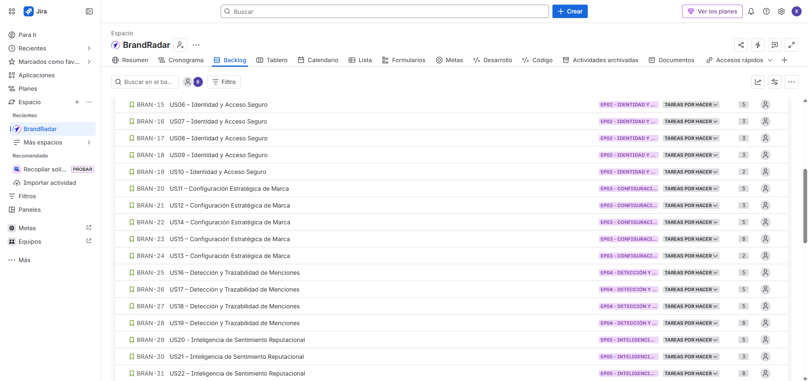

</div>

<br>

---

<div align="center">

# Capítulo IV: Product Design

</div>

---

## 4.1. Style Guidelines

>*Los lineamientos de estilo de BrandRadar buscan unificar la identidad visual y la comunicación del producto en todos sus puntos de contacto. Para ello se estableció un repositorio común que contiene tipografías, paleta de colores, íconos e isotipos, asegurando consistencia en cada pantalla de la aplicación y en la landing page.*

### 4.1.1. General Style Guidelines

La identidad visual de BrandRadar ha sido diseñada para transmitir precisión, tecnología y confianza analítica, cualidades esenciales en una herramienta digital orientada al monitoreo y gestión de la reputación de marca en tiempo real. El estilo visual se inspira en principios de claridad, sofisticación y consistencia, permitiendo que tanto equipos de marketing como analistas de datos y gestores de marca puedan interactuar con la plataforma de manera intuitiva en su versión web y móvil.
BrandRadar es una solución desarrollada para responder a la necesidad de rastrear, detectar y gestionar la reputación digital de una organización mediante el uso de tecnología analítica avanzada, asegurando una experiencia centrada en el usuario y adaptable a distintos perfiles y roles. La plataforma integra procesos de monitoreo de menciones, análisis de sentimiento, generación de reportes y alertas en tiempo real, con un enfoque accesible, preciso y profesional.

<br>


### Branding Overview

El nombre BrandRadar combina dos conceptos centrales: *"Brand"*, que representa la identidad y reputación de una empresa en el mercado, y *"Radar"*, que evoca monitoreo continuo, detección temprana y precisión analítica. Este nombre fue elegido por su claridad conceptual, fácil recordación y por reflejar con exactitud la misión del producto: rastrear, detectar y gestionar la reputación digital de una marca en tiempo real.

<br>

**Logo e Isotipo**

El logotipo de BrandRadar combina un símbolo geométrico con una tipografía sans serif de alto contraste. El símbolo (un avión de papel dentro de un círculo con un punto en la parte superior) transmite velocidad, dirección y monitoreo activo, evocando la idea de rastrear señales en tiempo real. El punto exterior al círculo refuerza la metáfora del radar: una señal siendo detectada.

La tipografía del wordmark divide visualmente las dos palabras que conforman el nombre: **Brand** aparece en negro y **Radar** en el color primario de la marca (azul-violeta o verde según la variante), lo que refuerza el concepto de "seguimiento de marca" de forma inmediata.

Se dispone de dos variantes de logo para adaptarse a distintos contextos:

<br>

<div align="center">
  
| Variante | Descripción | Uso recomendado |
|---|---|---|
| **Principal (Purple/Blue)** | Isotipo en gradiente violeta–azul con wordmark en negro y primario | Fondos blancos, documentos, landing page |
| **Alternativa (Teal)** | Isotipo en verde-turquesa con wordmark en negro y verde | Fondos claros alternativos, materiales secundarios |

</div>

<br>

El isotipo circular puede utilizarse de forma independiente como favicon, ícono de aplicación móvil o avatar en redes sociales, manteniendo plena legibilidad a tamaños reducidos.

<br>
<div align="center">

</div>
<br>

**Uso No Permitido:**

No se permite el uso de sombras paralelas (drop shadows) excesivas en el logotipo, ni la alteración de sus proporciones (estiramiento). Queda prohibido el uso de combinaciones de colores cálidos como rojo o naranja, ya que entran en conflicto con la psicología de "monitoreo sereno" y "seguridad de marca" que el azul y morado proyectan.

<br>
<div align="center">

</div>
<br>

### Typography:

<br>

La estrategia tipográfica de BrandRadar combina cinco familias de fuentes con roles claramente diferenciados, logrando un sistema visual que equilibra impacto, legibilidad y personalidad tecnológica. Todas las fuentes están disponibles a través de Google Fonts, garantizando compatibilidad en entornos web y móviles sin dependencias externas.

- **Special Gothic Expanded One** se reserva para los títulos principales y elementos de branding de alto impacto. Su diseño expandido y de trazo uniforme domina el espacio visual, ideal para el hero de la landing page y portadas de reportes.

- **Spartan** actúa como la fuente de encabezados estructurales. Su geometría limpia y sus proporciones equilibradas la hacen perfecta para organizar la jerarquía de secciones sin competir con el display principal.

- **Special Gothic Condensed One** complementa al display en subtítulos y bloques destacados donde se requiere presencia tipográfica con menor ocupación horizontal, permitiendo mayor densidad de información en espacios reducidos.

- **Radio Canada Big** es la fuente de interfaz y cuerpo de texto. Diseñada para alta legibilidad en pantallas, se usa en todo el contenido navegable: descripciones, párrafos, etiquetas de navegación, botones y formularios.

- **TASA Orbiter** se emplea de forma selectiva en elementos de datos, métricas y componentes técnicos, aportando un carácter tecnológico y preciso que refuerza la naturaleza analítica del producto.

<br>

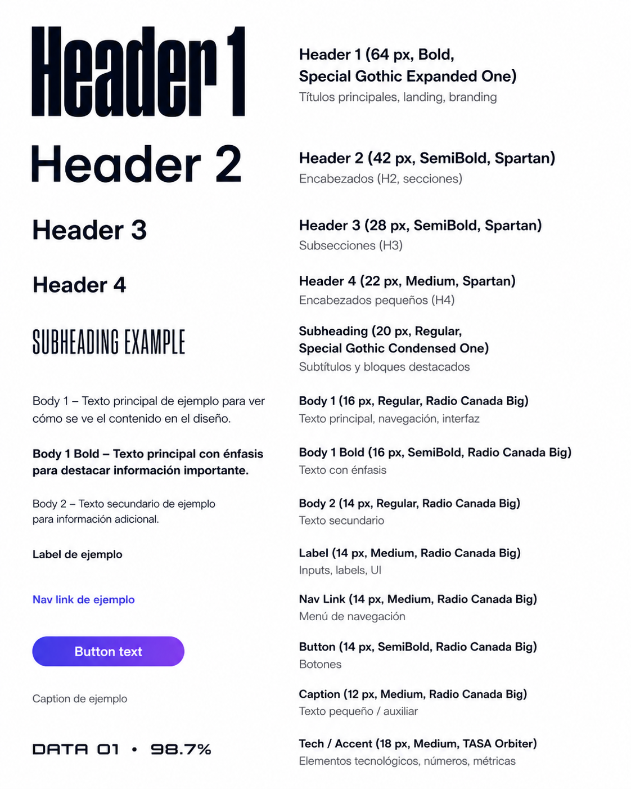

<br>

Sistema de familias tipográficas

<br>

| Tipo | Fuente | Uso |
|:---|:---:|:---|
| Display / Hero | **Special Gothic Expanded One** | Títulos principales, landing, branding |
| Heading | **Spartan** | Encabezados (H2, H3, secciones) |
| Subheading | **Special Gothic Condensed One** | Subtítulos y bloques destacados |
| UI / Body | **Radio Canada Big** | Texto principal, navegación, interfaz |
| Accent / Tech | **TASA Orbiter** | Elementos tecnológicos, números, métricas |

<br>

Jerarquía tipográfica

<br>

| Nivel | Fuente | Peso / Estilo | Tamaño | Uso |
|:---|:---:|:---:|:---:|:---|
| H1 | Special Gothic Expanded One | Bold / Wide | 56–72px | Hero, títulos principales |
| H2 | Spartan | SemiBold | 36–42px | Secciones principales |
| H3 | Spartan | Medium | 24–28px | Sub-secciones |
| H4 | Special Gothic Condensed One | Regular | 18–20px | Encabezados secundarios |
| Body 1 (Bold) | Radio Canada Big | SemiBold | 16px | Énfasis en cuerpo de texto |
| Body 1 (Regular) | Radio Canada Big | Regular | 16px | Texto general de interfaz |
| Body 2 / Caption | Radio Canada Big | Light | 13–14px | Texto secundario, notas al pie |
| Nav link | Radio Canada Big | Medium | 15px | Ítems de navegación |
| Button text | Radio Canada Big | SemiBold | 14px | Etiquetas de botones y CTAs |
| UI / Data | TASA Orbiter | Regular | 14–16px | Datos, métricas, UI técnica |

<br>

### Colors

La paleta de BrandRadar está diseñada para transmitir confianza, tecnología y enfoque analítico, manteniendo un balance entre tonos oscuros profundos, fondos limpios y acentos vibrantes que dirigen la atención del usuario hacia las acciones y datos más relevantes.

Los tonos oscuros (negro y azul pizarra) aportan seriedad y profundidad, adecuados para encabezados, fondos de componentes y texto principal. Los tonos lavanda y lila claro funcionan como superficies neutras de bajo contraste, ideales para fondos de tarjetas, estados hover y separadores. El blanco y el gris muy claro garantizan espacios de respiro visual que mejoran la legibilidad. Como contrapeso, los acentos en azul-violeta intenso y violeta-púrpura introducen dinamismo, identifican las acciones primarias y refuerzan la identidad tecnológica del producto.

<br>
<div align="center">
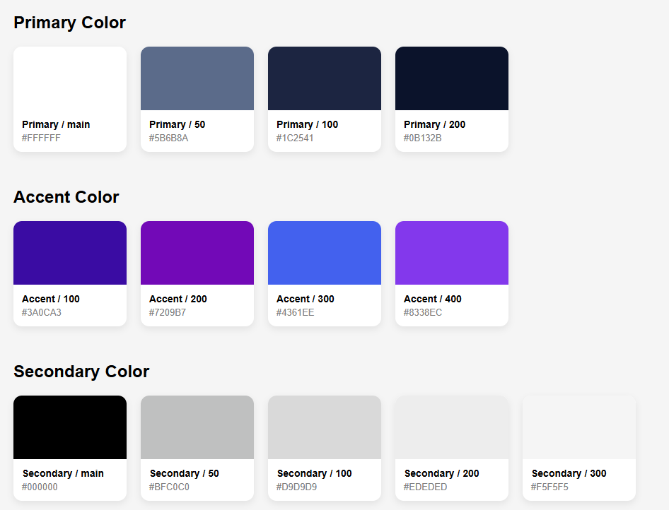
</div>
<br><br>

| Nombre | Hex | Uso |
|:---|:---:|:---|
| Black | `#000000` | Texto de alta importancia, encabezados H1 |
| Slate / Dark Text | `#3D4466` | Texto secundario oscuro, íconos, subtítulos |
| Lavender Medium | `#8B8FBF` | Estados deshabilitados, texto terciario |
| Lavender Light | `#C5C7E0` | Bordes, separadores, fondos de hover |
| Off-White | `#ECEDF5` | Fondo de tarjetas, superficies secundarias |
| White / Ghost | `#F5F5FA` | Fondo general de la aplicación |
| Near White | `#FAFAFA` | Fondo de página, áreas de contenido amplio |
| Navy Deep | `#0D1033` | Fondo de headers oscuros, sidebar dark mode |
| Midnight Blue | `#1A2155` | Fondo de secciones hero, banners de alerta |
| Primary Purple | `#5B5FEE` | Botones primarios, links activos, CTA |
| Accent Blue | `#4B6EF5` | Estados hover de botones, énfasis secundario |
| Accent Violet | `#9B3CF7` | Highlights, badges, métricas destacadas |

<br>

Adicionalmente, se definen colores de estado semántico para alertas, notificaciones y feedback del sistema:

| Estado | Hex | Uso |
|:---|:---:|:---|
| Success (positivo) | `#22C55E` | Sentimiento positivo, confirmaciones |
| Warning (moderado) | `#F59E0B` | Alertas medias, advertencias |
| Danger (crítico) | `#EF4444` | Alertas críticas, errores, sentimiento negativo |
| Info (informativo) | `#3B82F6` | Mensajes informativos, tooltips |

<br><br>

### 4.1.2. Web Style Guidelines

En esta sección se describen las decisiones relacionadas con los estándares visuales y de interacción aplicados a las interfaces web de BrandRadar, enfocadas en la construcción de un sistema de diseño consistente, moderno y escalable.

El sistema de componentes ha sido diseñado bajo un enfoque minimalista sobre fondo claro, priorizando la legibilidad, la jerarquía visual y la claridad en las interacciones. Asimismo, se emplea una paleta basada en tonos neutros (blancos y grises) combinados con acentos en gradientes azul-violeta, los cuales permiten resaltar elementos clave sin sobrecargar la interfaz.

Las decisiones adoptadas buscan garantizar una experiencia de usuario intuitiva, accesible y coherente en todos los módulos del sistema, especialmente en contextos de análisis de datos y monitoreo de reputación digital en tiempo real.

<br>

### Buttons

Para las acciones principales dentro de la plataforma (como iniciar monitoreo, analizar métricas o acceder a reportes), se han definido distintos tipos de botones que responden a diferentes niveles de jerarquía e interacción.

El botón Primary utiliza un gradiente en tonos azul-violeta, destacándose visualmente como la acción principal en cada vista. Este presenta diferentes estados (default, hover, active y disabled), los cuales proporcionan retroalimentación inmediata al usuario.

Por otro lado, el botón Secondary (outline) emplea bordes con color de acento y fondo transparente, siendo utilizado para acciones complementarias. También se incluyen variantes como Ghost buttons, utilizados en contextos de baja prioridad visual, e Icon buttons, orientados a acciones rápidas mediante iconografía.

Finalmente, se contemplan diferentes tamaños (large, medium, small), permitiendo su adaptación a múltiples contextos dentro de la interfaz.

<br>
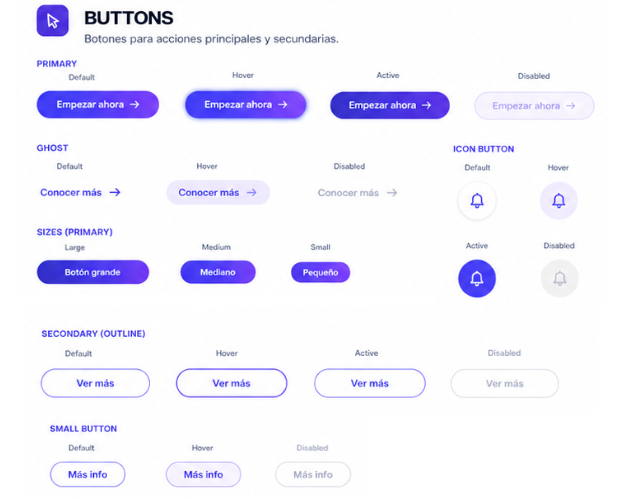
<br><br>
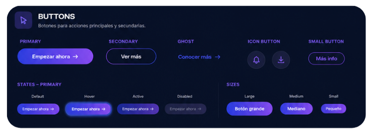
<br>

### Cards

Las tarjetas (cards) constituyen uno de los componentes principales para la organización y visualización de información dentro de BrandRadar. Estas permiten agrupar datos relevantes de manera clara y estructurada, facilitando la comprensión de métricas y resultados por parte del usuario.

Se han definido múltiples variantes de cards:

- **Default:** utilizada para mostrar información general con un diseño limpio y sombras suaves.

- **Hover:** incorpora elevación y sombreado para indicar interactividad.

- **Outline:** presenta bordes definidos para un estilo más ligero.

- **Soft:** utiliza fondos sutilmente coloreados para destacar contenido sin generar alto contraste.

Asimismo, se incluyen cards de métricas, las cuales resaltan indicadores clave (porcentajes, comparativas, rendimiento, etc.) mediante el uso de tipografía destacada y colores de acento. Estas son fundamentales en dashboards y vistas analíticas.

<br>
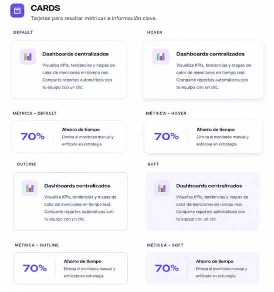
<br><br>
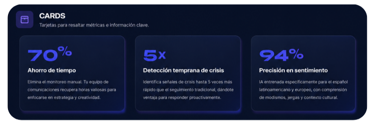
<br>

### Forms

La recolección de datos en BrandRadar se realiza mediante un conjunto de componentes de formulario diseñados para ser claros, accesibles y consistentes.

Los elementos principales incluyen:

- **Inputs (default, focus, error):** campos de entrada con distintos estados visuales que indican interacción y validación.

- **Inputs con label:** permiten contextualizar la información solicitada.

- **Selects:** utilizados para la selección de opciones predefinidas.

- **Textarea:** destinado a entradas de texto más extensas.

- **Checkbox y Radio buttons:** empleados para selecciones múltiples o únicas.

- **Toggle switch:** utilizado para activar o desactivar configuraciones de manera rápida.

Se incorporan estados de validación, como el estado de error (con borde rojo y mensaje descriptivo), que facilitan la identificación de problemas en la entrada de datos. Además, los estados de foco incluyen resaltados en color de acento, mejorando la experiencia de interacción.

<br>
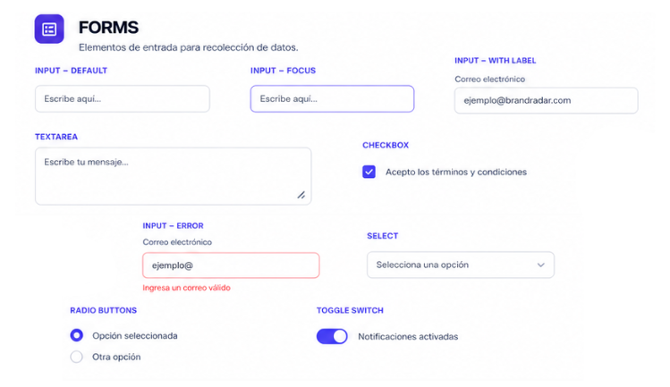
<br><br>
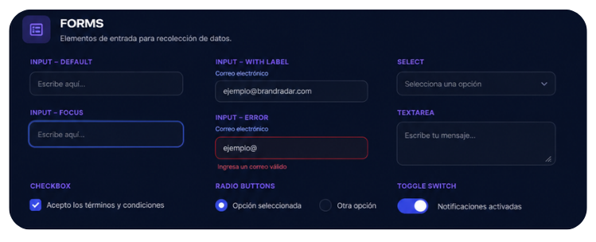
<br>

---

## 4.2. Information Architecture

La arquitectura de información de **BrandRadar** ha sido diseñada para estructurar de forma clara y jerárquica los contenidos, permitiendo a los usuarios (dueños de PyMEs y especialistas de marketing) monitorear su reputación digital sin fricciones. Se prioriza una navegación intuitiva que reduzca la carga cognitiva al gestionar múltiples fuentes de datos en tiempo real.

A continuación, se presentan los diagramas de estructura que representan la organización general de la plataforma, tanto en su versión web como móvil.

<br>

**Figura 1. Diagrama de estructura Web Desktop**

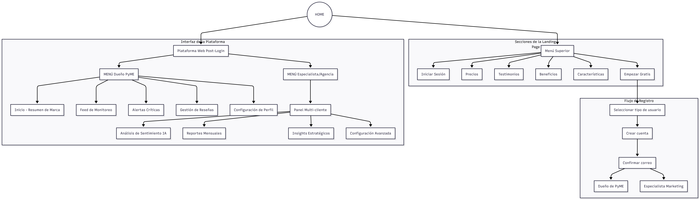

<br>

**Figura 2. Diagrama de la estructura Web Mobile**

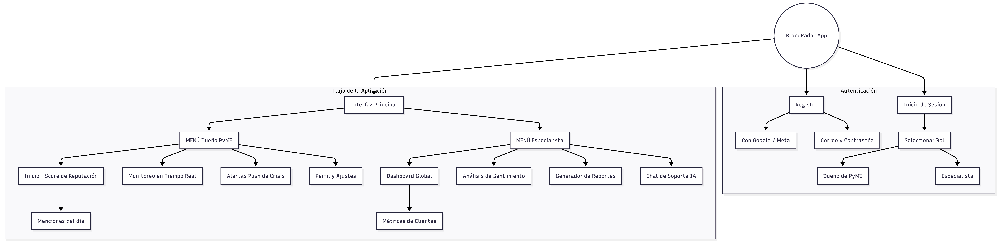

<br>

---

### 4.2.1. Organization Systems

<div align="center">
  
### Organización visual del contenido

<br>

  
**Experiencia Web**

| Forma de organización visual | Razón | Sección de la plataforma |
|---|---|---|
| **Jerárquica (Visual Hierarchy)** | Prioriza las alertas críticas y el score de reputación para una respuesta inmediata ante crisis. Los elementos de mayor importancia (score, alertas rojas) ocupan la posición superior izquierda y mayor tamaño visual. | Dashboard principal, Panel de alertas críticas. |
| **Secuencial (Step-by-step)** | Guía al usuario en flujos obligatorios que deben completarse en orden, como el alta de una marca o la conexión de fuentes de datos externas. | Registro de cuenta, Configuración de fuentes (APIs), Configuración de alertas, Onboarding. |
| **Matricial (Modular)** | Divide las métricas (sentimiento, reseñas, menciones) en bloques independientes y comparables, evitando la saturación visual al gestionar múltiples fuentes simultáneamente. | Sección de Monitoreo detallado, Reportes, Análisis comparativo. |

<br>

**Experiencia Móvil**

| Forma de organización visual | Razón | Sección de la plataforma |
|---|---|---|
| **Jerárquica (Visual Hierarchy)** | Facilita el acceso inmediato a notificaciones push y al resumen de menciones recientes en pantallas de tamaño reducido, donde el espacio es crítico. | Pantalla de inicio, Centro de notificaciones en tiempo real. |
| **Secuencial (Step-by-step)** | Permite al usuario completar tareas rápidas —como responder una reseña o reportar una mención negativa— sin perderse en submenús. | Gestión de reseñas individuales, Reporte de incidentes, Respuesta rápida. |
| **Matricial (Modular)** | Optimiza la lectura de datos de sentimiento y tendencias agrupándolos en tarjetas desplazables, sin saturar la interfaz móvil. | Dashboard móvil, Ajustes de alertas. |

</div>

<br>

<div align="center">
  
### Esquemas de categorización de contenido

<br>

**Experiencia Web**

| Esquema de organización | Razón | Sección de la plataforma |
|---|---|---|
| **Cronológico** | Muestra las menciones y comentarios conforme ocurren en tiempo real, ofreciendo al usuario una línea de tiempo de su reputación. | Feed de Monitoreo, Historial de alertas, Línea de tiempo de menciones. |
| **Por tópicos** | Agrupa el análisis según la fuente o área temática (Redes Sociales, Google Maps, Web General), para que el usuario acceda directamente a la fuente relevante. | Fuentes de datos configuradas, Análisis de sentimiento por plataforma. |
| **Según audiencia** | Personaliza el panel y las funciones visibles según el rol del usuario: vista simplificada para el dueño de PyME vs. vista multi-marca para el Account Manager de agencia. | Dashboard principal, Gestión de cuentas de clientes. |

<br>

**Experiencia Móvil**

| Esquema de organización | Razón | Sección de la plataforma |
|---|---|---|
| **Cronológico** | Presenta las alertas más urgentes primero según el momento de detección, facilitando la respuesta oportuna desde cualquier lugar. | Centro de notificaciones, Feed de menciones recientes. |
| **Por tópicos** | Clasifica las alertas por nivel de riesgo (Alto, Medio, Bajo) para que el usuario priorice su atención de forma visual e inmediata. | Filtros de búsqueda rápida, Listado de crisis detectadas. |
| **Según audiencia** | Adapta las herramientas y acciones disponibles en el menú según el rol del usuario autenticado. | Menú de navegación principal, Pantalla de configuración de perfil. |

</div>
<br>

---

### 4.2.2. Labeling Systems

El objetivo del sistema de etiquetado de BrandRadar es representar conjuntos de información complejos (reputación, sentimiento, alertas, métricas) con el menor número de palabras posible, evitando la ambigüedad. Todas las etiquetas son concretas, orientadas a la acción y coherentes entre la versión web y móvil.

<br>
<div align="center">
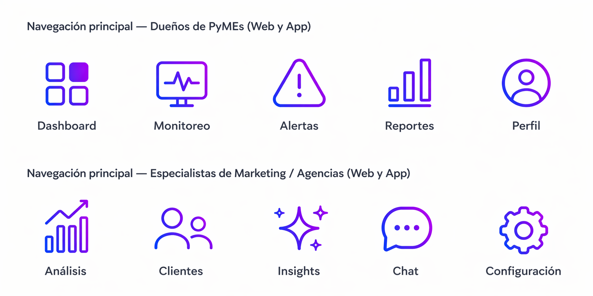

<br> <br>

**Etiquetas de estados y badges**

| Contexto | Etiqueta | Color |
|---|---|---|
| Sentimiento positivo | **Positivo** | Verde `#43A047` |
| Sentimiento negativo | **Negativo** | Rojo `#E53935` |
| Sentimiento neutro | **Neutro** | Gris `#9E9E9E` |
| Nivel de alerta alto | **Crítico** | Rojo `#E53935` |
| Nivel de alerta medio | **Moderado** | Naranja `#FB8C00` |
| Nivel de alerta bajo | **Informativo** | Azul `#1A73E8` |

</div>

<br>

**Etiquetas de acciones directas en tarjetas**

- **Responder** — abre el editor de respuesta a una reseña.
- **Ver detalle** — expande la mención o alerta seleccionada.
- **Generar reporte** — inicia la generación del informe de la crisis detectada.
- **Marcar revisado** — archiva la alerta sin generar acción.
- **Escalar** — redirige la alerta al administrador de cuenta.


<br>

---

### 4.2.3. SEO Tags and Meta Tags

**Landing Page**

```html
<!-- Landing Page: BrandRadar -->
<title>BrandRadar – Monitoreo de Reputación Digital para PyMEs</title>

<meta name="description"
  content="BrandRadar analiza en tiempo real las menciones, reseñas y comentarios de tu marca en redes sociales, Google Maps y la web. Detecta crisis, gestiona alertas y mejora tu reputación digital.">

<meta name="keywords"
  content="monitoreo de reputación, gestión de reseñas, alertas de marca, análisis de sentimiento, menciones en redes sociales, reputación digital PyMEs, Google Maps reviews, social listening">

<meta name="author" content="BrandRadar Team">

<meta property="og:title" content="BrandRadar – Monitoreo de Reputación Digital para PyMEs">
<meta property="og:description"
  content="Detecta crisis reputacionales antes de que escalen. Analiza el sentimiento de tu marca en tiempo real.">
<meta property="og:image" content="https://brandradar.app/assets/og-cover.png">
<meta property="og:url" content="https://brandradar.app">
<meta property="og:type" content="website">

<meta name="twitter:card" content="summary_large_image">
<meta name="twitter:title" content="BrandRadar – Monitoreo de Reputación Digital">
<meta name="twitter:description"
  content="Gestiona la reputación de tu negocio desde un solo panel. Alertas en tiempo real, análisis de sentimiento y reportes automáticos.">

<link rel="canonical" href="https://brandradar.app">
```
<br>

**Web Application — Dashboard (usuario autenticado)**

<br>

```html
<!-- Dashboard principal -->
<title>Dashboard – BrandRadar</title>
<meta name="description" content="Resumen de tu score de reputación, alertas críticas y menciones recientes.">
<meta name="robots" content="noindex, nofollow">
<meta name="author" content="BrandRadar Team">
```
<br>

**Web Application — Sección Monitoreo**

<br>

```html
<title>Monitoreo en Tiempo Real – BrandRadar</title>
<meta name="description"
  content="Feed en tiempo real de todas las menciones detectadas de tu marca en redes sociales, Google Maps y la web general.">
<meta name="robots" content="noindex, nofollow">
<meta name="author" content="BrandRadar Team">
```

<br>

**Web Application — Sección Reportes**

```html
<title>Reportes de Reputación – BrandRadar</title>
<meta name="description"
  content="Genera informes detallados sobre la evolución de la reputación de tu marca. Exporta en PDF o comparte directamente.">
<meta name="robots" content="noindex, nofollow">
<meta name="author" content="BrandRadar Team">
```

<br>

---

### 4.2.4. Searching Systems

En BrandRadar, los sistemas de búsqueda han sido diseñados para reducir el tiempo de localización de información crítica dentro de un volumen alto de datos provenientes de múltiples fuentes simultáneas. El usuario nunca debe sentirse abrumado; los filtros actúan como capas que van reduciendo progresivamente el universo de resultados hasta mostrar exactamente lo que necesita.

**Tipos de búsqueda disponibles**

| Nombre | Descripción | Disponible en |
|---|---|---|
| **Barra de búsqueda libre** | Búsqueda por palabra clave, nombre de marca, frase específica o URL. Autocompletado con sugerencias basadas en historial. | Web y App |
| **Filtro por Sentimiento** | Aísla menciones positivas, negativas o neutras para gestión de crisis o fidelización. | Web y App |
| **Filtro por Plataforma** | Segmenta resultados por fuente: Instagram, Facebook, Google Maps, Twitter/X, TripAdvisor, web general. | Web y App |
| **Filtro por Criticidad** | Enfoca la vista en alertas de alta prioridad (caída de score, reseñas de 1 estrella, pico de menciones negativas). | Web y App |
| **Rango cronológico** | Visualiza menciones y tendencias en un período específico (ej. semana de campaña, Black Friday). | Web y App |
| **Filtro por tipo de mención** | Diferencia entre reseñas, comentarios, noticias y menciones directas en redes. | Web |
| **Buscador de competidores** | Busca palabras clave asociadas a la competencia para análisis de benchmarking. | Web |

<br>

**Cómo lucen los resultados después de la búsqueda**

<br>

Los resultados se presentan como **tarjetas informativas** ordenadas cronológicamente (más reciente primero):

- El **badge de sentimiento** (verde/rojo/gris) permite identificar el tono de un vistazo.

- El **badge de criticidad** (Crítico / Moderado / Informativo) indica la urgencia de acción.

- Los **botones de acción directa** permiten gestionar la mención sin salir de la vista de resultados.

- Al aplicar filtros, aparece una barra de **filtros activos** en la parte superior, donde cada filtro puede eliminarse individualmente con una "X".

- Si la búsqueda no devuelve resultados, se muestra un mensaje con sugerencias: "No encontramos menciones con estos filtros. Prueba ampliar el rango de fechas o eliminar un filtro."

<br>


## 4.2.5. Navigation Systems

Los sistemas de navegación de BrandRadar han sido diseñados para guiar al usuario de forma clara, personalizada e intuitiva tanto en la Landing Page como en la aplicación web y móvil. El objetivo es que los dueños de PyMEs y los especialistas de marketing encuentren cualquier funcionalidad en tres clics o menos.

<br>
<div align="center">
  
## Landing Page

</div>
La navegación se basa en una **barra superior fija** (sticky header) con las siguientes secciones:

<div align="center"> 
<br>


<br><br>

| Etiqueta        | Destino                                  |
| --------------- | ---------------------------------------- |
| Inicio (logo)   | Hero section con propuesta de valor      |
| Características | Bloque de funcionalidades principales    |
| Beneficios      | Sección de ventajas y valor diferencial  |
| Precios         | Tabla de planes y comparativa            |
| Contacto        | Formulario o sección de contacto         |
| Empezar ahora   | Redirección al registro de la aplicación |

<br>
</div>

Se incorporan CTAs visibles en la interfaz:

Se incorpora un CTA principal visible en la barra:

- **"Empezar ahora"** — inicia el flujo de registro.

- **"Ver precios"** — ancla a la sección de precios.

- **"Contactar"** — acceso directo al formulario.

El pie de página es minimalista y contiene únicamente el texto:
**"BrandRadar © 2026"**, cumpliendo una función informativa básica sin incluir navegación secundaria.

<br>
<div align="center">
  
## Web Application Desktop

</div>
<br>

Se implementa un patrón de navegación híbrido en tres niveles que se adapta tanto a la profundidad de la información como al dispositivo del usuario.


- El **sidebar lateral izquierdo** es el punto de entrada permanente a las secciones principales de la plataforma. En desktop se muestra expandido con íconos, etiquetas y badges de notificación. En tablet se colapsa automáticamente a una barra de íconos de 52px de ancho, liberando espacio para el contenido sin eliminar el acceso a la navegación. El usuario puede expandirlo o colapsarlo manualmente mediante el botón ‹ ubicado en el borde derecho del sidebar.

- Las **pestañas superiores** se utilizan dentro de secciones que agrupan múltiples fuentes o vistas del mismo contexto. Por ejemplo, en la sección Monitoreo, las pestañas permiten alternar entre los canales General, Instagram, Google Maps, Web y Twitter/X sin abandonar la sección ni perder el estado de los filtros activos. Las pestañas con alertas pendientes muestran un badge de color según la severidad: rojo para alertas críticas y amarillo para advertencias.

- Los **breadcrumbs** aparecen en rutas de cuatro o más niveles de profundidad, ubicados entre la topbar y las pestañas. Indican al usuario su posición exacta dentro de la jerarquía de la plataforma (ej. Inicio › Clientes › Marca XYZ › Monitoreo) y funcionan como links activos para regresar a cualquier nivel anterior sin necesidad de usar el botón atrás del navegador.

<br>
<div align="center">
  
## Web Application Mobile

</div>

La navegación móvil utiliza una **barra inferior de navegación** (bottom tab bar) con los 4-5 destinos más frecuentes, siguiendo el patrón estándar de iOS y Android:

<br>
<div align="center">
  
**Dueño de PyME (barra inferior)**


**Especialista de Marketing (barra inferior)**

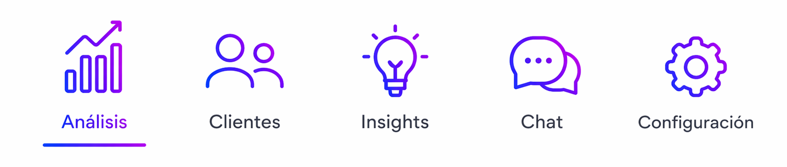
</div>
<br>

Las notificaciones push dirigen al usuario directamente a la mención o alerta específica, sin necesidad de navegar manualmente por la app. Los flujos de acción rápida (responder reseña, escalar alerta) se resuelven en modales de pantalla completa que no interrumpen la ruta de navegación principal.

<br>

---

## 4.3. Landing Page UI Design

>En esta sección se presenta la propuesta de interfaz de usuario (UI) para la Landing Page de **BrandRadar**. El diseño se fundamenta en los hallazgos obtenidos durante el proceso de investigación (entrevistas y Lean UX), priorizando las necesidades de los usuarios, especialmente la visualización clara de la reputación digital y el acceso rápido a información relevante.*

>*Asimismo, se han aplicado principios de diseño centrados en el usuario, una arquitectura de información clara y un enfoque visual moderno, con el objetivo de comunicar de manera efectiva el valor de la plataforma y facilitar la conversión de usuarios.*


### 4.3.1. Landing Page Wireframe

>*Los wireframes representan la estructura base de la Landing Page, permitiendo definir la organización de contenidos, la jerarquía visual y el flujo de navegación antes de la aplicación del diseño visual final. Se desarrollaron versiones para escritorio (desktop web browser) y dispositivos móviles (mobile web browser):*

<br>

<div align="center">

**Desktop Web Browser**

<br>

*Elaboración propia en Figma*

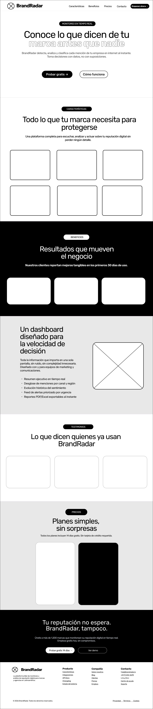

<br>

**Mobile Web Browser**
<br>

*Elaboración propia en Figma*

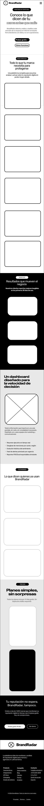

</div>


### 4.3.2. Landing Page Mock-up

>*Los mock-ups representan la versión visual final de la Landing Page, incorporando los elementos definidos en el Design System, como la paleta de colores, la tipografía, la iconografía y los estilos de componentes.
En esta etapa se materializa la propuesta de wireframes en una interfaz visual completamente definida, permitiendo validar la coherencia estética, la jerarquía visual y la experiencia de usuario antes del desarrollo final.*

<div align="center">

**Desktop Web Browser**

<br>

*Elaboración propia en Figma*


<br>

**Mobile Web Browser**

<br>

*Elaboración propia en Figma*

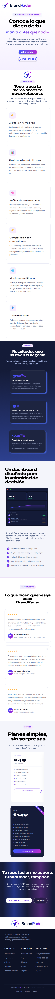

</div>

<br>

---

## 4.4. Web Applications UX/UI Design

>*En esta sección se presenta la propuesta visual y de interacción para la aplicación web de BrandRadar. El diseño ha sido desarrollado a partir de los hallazgos obtenidos en el proceso de investigación con usuarios, priorizando la claridad en la visualización de datos, el acceso rápido a funcionalidades críticas y una experiencia coherente tanto para dueños de PyMEs como para especialistas de marketing.
Se aplican principios de diseño centrado en el usuario, consistencia visual basada en el Design System definido y una arquitectura de información orientada a reducir la carga cognitiva en cada interacción.*

<br>

### 4.4.1. Web Applications Wireframes

>*Los wireframes presentados a continuación representan la estructura base de las principales vistas de la aplicación web de BrandRadar. Su elaboración se realizó aplicando principios de diseño inclusivo, asegurando que la disposición de los elementos sea clara, comprensible y accesible para usuarios con distintos niveles de experiencia tecnológica.*

<br>


<br>

### 4.4.2. Web Applications Wireflow Diagrams

*(Un Wireflow por cada User goal, considerando los User Personas definidos)*

<br>


**User goal: `[Nombre del User goal]`**

*(Descripción del flujo especificado)*


<br>

**User goal: `[Nombre del User goal]`**

*(Descripción del flujo especificado)*


<br>

### 4.4.3. Web Applications Mock-ups

>*Los mock-ups presentados a continuación representan la propuesta visual final de las principales vistas de la aplicación web de BrandRadar, incorporando el Design System definido en la sección 4.1. A diferencia de los wireframes, estas vistas integran la paleta de colores, tipografía, iconografía, componentes visuales y espaciado establecidos para la plataforma, ofreciendo una representación de alta fidelidad de la experiencia de usuario en el sistema.*

>*El diseño busca transmitir confianza, claridad y eficiencia, valores fundamentales de BrandRadar, asegurando que tanto los dueños de PyMEs como los account managers de agencias puedan interpretar la información de reputación digital de forma rápida e intuitiva.*

<br>


<br>

### 4.4.4. Web Applications User Flow Diagrams

*(User Flows incluyendo Mock-ups de vistas, happy paths y unhappy paths)*

<br>

**User goal: `[Nombre del User goal]`**

*(Descripción de los flujos y condiciones especificadas)*


<br>

---

## 4.5. Web Applications Prototyping

En esta sección se presenta el prototipo interactivo de la aplicación web de BrandRadar, desarrollado en Figma a partir de los mock-ups de alta fidelidad definidos en la sección anterior. El prototipo simula la navegación real del sistema, permitiendo visualizar los flujos de interacción entre las distintas vistas de la plataforma en sus versiones Desktop y Mobile Web.

Las decisiones de interacción del prototipo se basaron en los siguientes criterios:

- **Accesibilidad y simplicidad:** Se prioriza una navegación intuitiva que permita a cualquier usuario, independientemente de su nivel técnico, utilizar la plataforma sin necesidad de instrucciones previas, especialmente en el segmento de dueños de PyMEs.
- **Rapidez de acceso a funciones críticas:** Las acciones más frecuentes, como la revisión de alertas, el análisis de sentimiento y la generación de reportes, se encuentran disponibles desde el Dashboard principal con el menor número de interacciones posible.
- **Consistencia visual:** Todos los elementos siguen el Design System definido, garantizando un comportamiento coherente y predecible en componentes como botones, formularios, tarjetas y navegación.
- **Diseño responsivo:** El prototipo se adapta a dispositivos móviles, asegurando una experiencia consistente que permita el monitoreo de la reputación digital desde cualquier dispositivo.

A continuación, se presentan los prototipos para Desktop y Mobile Web, junto con los videos de simulación de navegación correspondientes.

<br>

<div align="center">

**Desktop Prototyping**


[Ver video de prototipo Desktop en Microsoft Stream](`URL`)

<br>

**Mobile Prototyping**


[Ver video de prototipo Mobile en Microsoft Stream](`URL`)

</div>

<br>

---

## 4.6. Domain-Driven Software Architecture

### 4.6.1. Design-Level Event Storming

>*Para definir la arquitectura de BrandRadar orientada al dominio (DDD), se realizó un proceso iterativo de Design-Level Event Storming siguiendo la metodología de 10 pasos. A continuación, se detalla la evolución del modelo:*

<br>
  
**Step 1: Unstructured Exploration**

Se identificaron y representaron todos los eventos que modifican el estado del sistema, escritos en tiempo pasado (post-its naranjas). Estos abarcan desde `User Registered` hasta `PDF Report Generated`, entre otros eventos relevantes del dominio.

<br>
<div align="center">
  
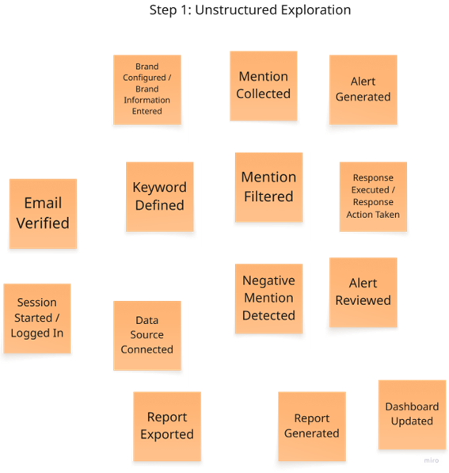

</div>

**Step 2: Timelines**

Se ordenaron los eventos del dominio de forma cronológica de izquierda a derecha, estableciendo el flujo del ciclo de vida del monitoreo de reputación digital.

<br>
<div align="center">
  
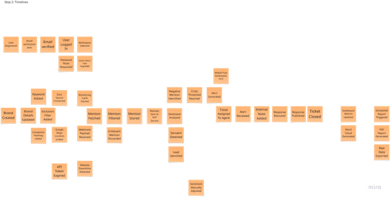

</div>

**Step 3: Hotspots**

Se identificaron los puntos críticos del sistema y riesgos técnicos del negocio (marcados con rombos rojos), como posibles limitaciones por rate limits en APIs de redes sociales o falsos positivos en los modelos de análisis de sentimiento basados en inteligencia artificial.

<br>
<div align="center">
  


</div>

**Step 4: Pivotal Events**

Se definieron eventos pivote que segmentan el flujo del sistema en fases funcionales, delimitando el cambio de estado entre la configuración inicial, el monitoreo automático y la gestión de crisis reputacionales.

<div align="center">
  


</div>

**Step 5: Commands & Actors**

Se definieron los commands (post-its azules) que disparan los eventos del sistema, así como los actores (íconos amarillos) responsables de ejecutarlos, ya sean usuarios (PyME / Agencia) o procesos automatizados del sistema.

<div align="center">
  


</div>

**Step 6: Policies**

Se incorporaron las business policies (post-its lilas), que representan reglas de negocio reactivas que automatizan el comportamiento del sistema. Por ejemplo, la regla que establece que cuando una mención presenta sentimiento negativo, se genera automáticamente una alerta de alta prioridad.

<div align="center">
  


</div>

**Step 7: Read Models**

Se mapearon los read models (post-its verdes), que representan las vistas e interfaces que los usuarios necesitan consultar para la toma de decisiones antes de ejecutar un comando.

<div align="center">
  


</div>

**Step 8: External Systems**

Se identificaron los sistemas externos (post-its rosados) que interactúan con BrandRadar, incluyendo APIs de redes sociales, Google Maps API y servicios de procesamiento de lenguaje natural (NLP) basados en inteligencia artificial.

<div align="center">
  


</div>

**Step 9: Aggregates**

Se incrementó el nivel de abstracción agrupando comandos y eventos alrededor de las principales entidades del dominio (Aggregates, representados como post-its amarillos grandes). En esta etapa se definieron agregados clave como `Account`, `Brand`, `Mention`, `Crisis Alert` y `Analytics Report`, los cuales encapsulan la consistencia de las reglas de negocio y el estado del sistema.

<div align="center">
  
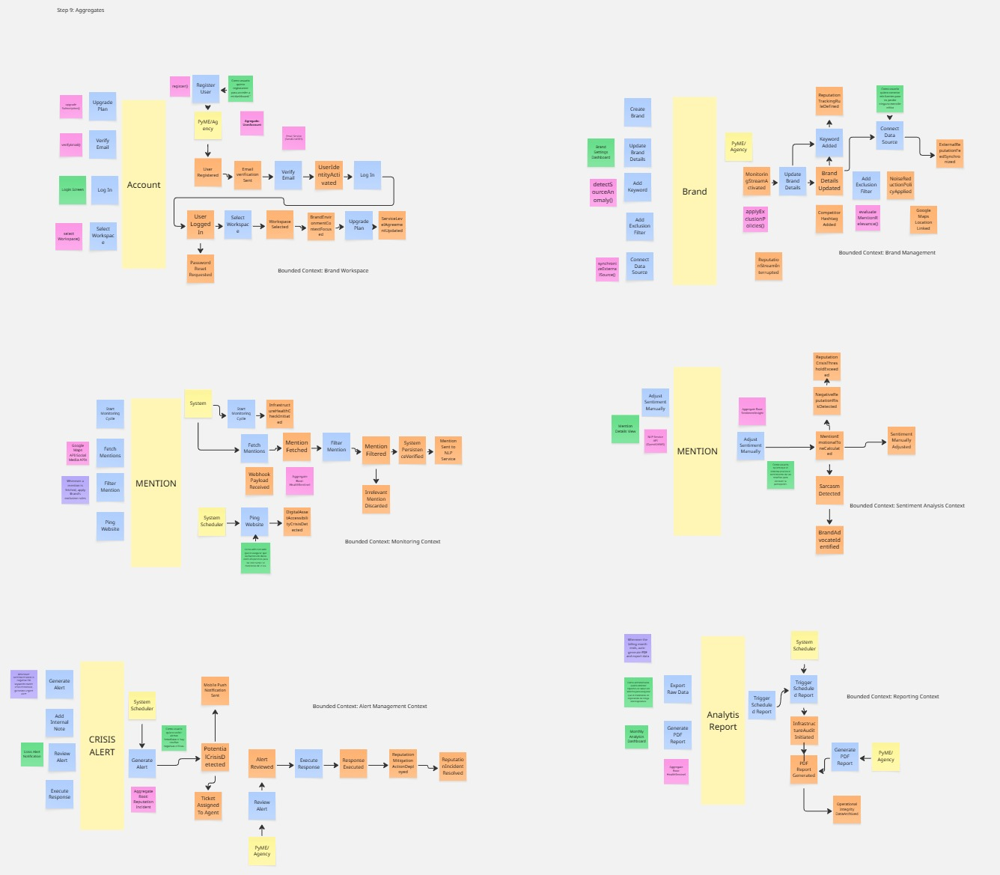

</div>

**Step 10: Bounded Contexts**

Finalmente, se delimitaron los límites semánticos y transaccionales del dominio mediante la definición de Bounded Contexts, agrupando los agregados relacionados en bloques coherentes e independientes. Este paso consolidó la arquitectura del sistema en seis contextos principales: Brand Workspace, Reputation Monotoring, Identity Access, Sentiment Intelligence, Crisis Detection y Infrastructure Health.

<div align="center">
  
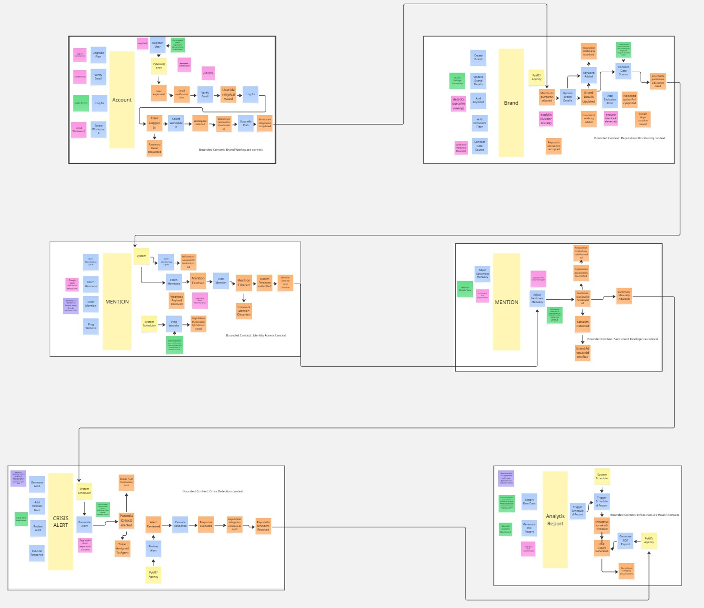

  
**Bounded Contexts:**

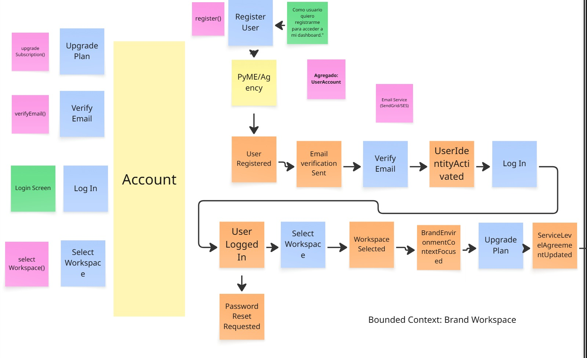

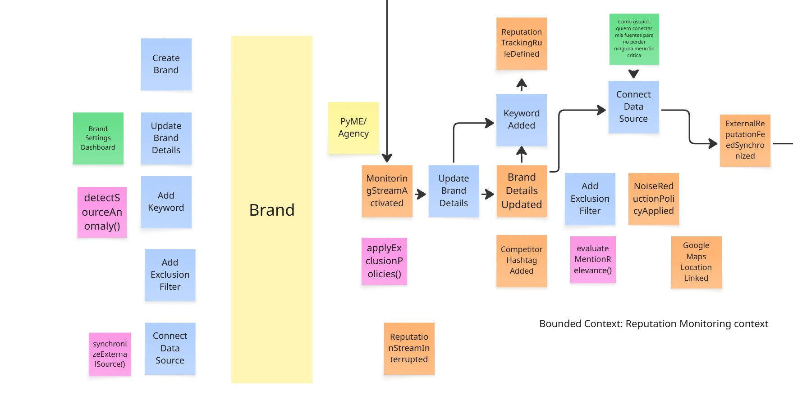

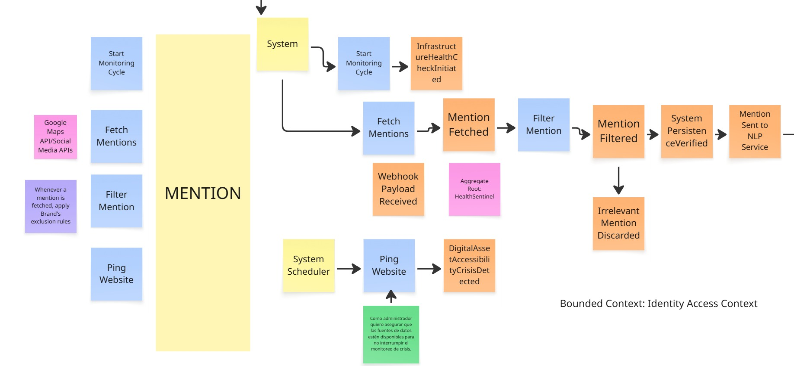

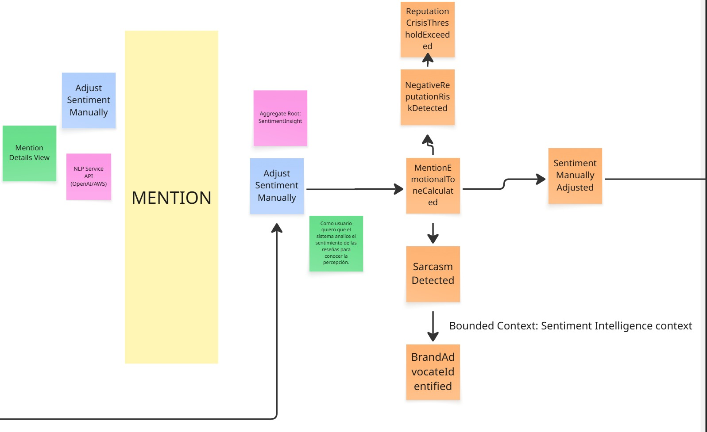

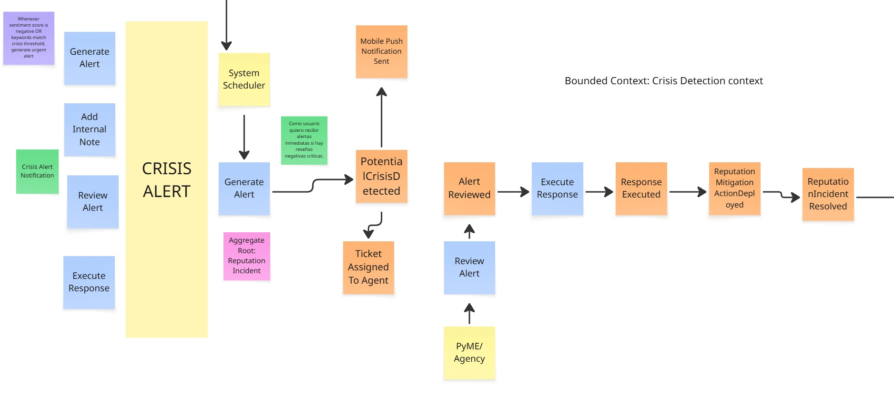

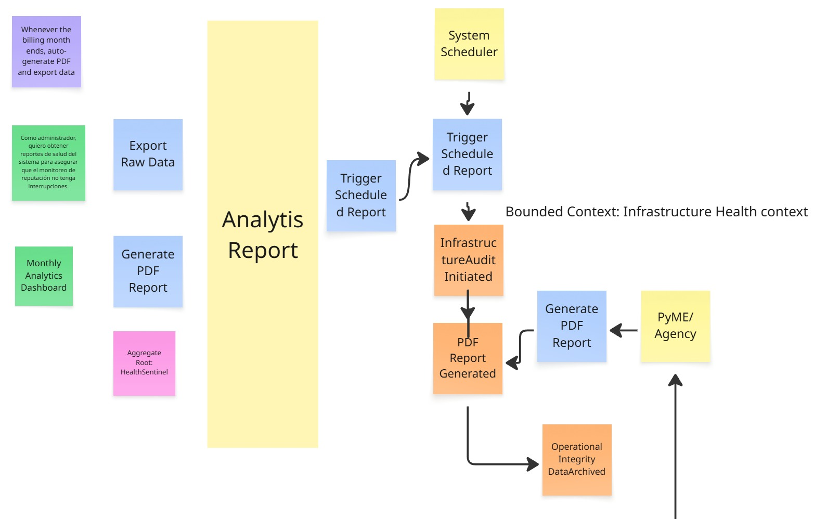

</div>

<br>

El proceso de Design-Level Event Storming permitió profundizar en el comportamiento técnico del sistema, tomando como base los flujos identificados en el Big Picture Event Storming. En esta etapa, se definieron los límites transaccionales (Bounded Contexts) y se incorporaron elementos de diseño táctico como Comandos (Commands), Agregados (Aggregates) y Políticas (Policies). [Ver Miro](https://miro.com/welcomeonboard/OFNBUUR3ZHl3VWkyVzJPRzhPWEV5bHF2S0hiRjArNEswejJoT0ZyZVdHQ0VMVDkzNy9Xd3RCOGdHemhTN3ZJblhjSkJLRjBneGRvNjdaaXNCZHkvWVQ3N1VhMUxRYkI4SmNBRTdTaHpBWWlzRHhGTTZKL2NFVjVtK1IwcFZscnhnbHpza3F6REdEcmNpNEFOMmJXWXBBPT0hdjE=?share_link_id=126405139400).

El proceso de Design-Level Event Storming permitió profundizar en el comportamiento técnico del sistema, tomando como base los flujos identificados en el Big Picture Event Storming. En esta etapa, se definieron los límites transaccionales (Bounded Contexts) y se incorporaron elementos de diseño táctico como Comandos (Commands), Agregados (Aggregates) y Políticas (Policies). Ver Miro.

A partir del análisis del dominio de BrandRadar, se consolidaron seis Bounded Contexts principales:

Identity Access Context: Gestiona la identidad de los usuarios, roles y sesiones de autenticación, asegurando el acceso protegido a la plataforma.

Brand Workspace Context: Administra la configuración de los espacios de trabajo, marcas, palabras clave (keywords) y la personalización del entorno del usuario.

Reputation Monitoring Context: Coordina la recolección de menciones en tiempo real y el rastreo de la presencia de la marca en diversas fuentes digitales.

Crisis Detection Context: Aplica reglas de negocio y umbrales críticos para identificar amenazas potenciales a la reputación de manera inmediata.

Sentiment Intelligence Context: Delega el procesamiento de lenguaje natural para clasificar sentimientos y extraer inteligencia emocional de los datos recolectados.

Infrastructure Health Context: Supervisa la salud técnica del ecosistema, incluyendo el estado de los dispositivos, la latencia de servicios y la estabilidad de la infraestructura.
   
<br>

---

### 4.6.2. Software Architecture Context Diagram

>*El Diagrama de Contexto representa a BrandRadar dentro de su entorno operativo, mostrando las interacciones de alto nivel entre el sistema, los usuarios y los sistemas externos.*

<br>


Este nivel de abstracción permite comprender el alcance del sistema y su valor dentro del dominio de negocio, evidenciando cómo los actores principales —PyME Owner y Agency Manager— interactúan con la plataforma central de BrandRadar. Asimismo, se identifican las dependencias críticas con sistemas externos, como las APIs de redes sociales y Google Maps para la obtención de datos, y servicios de Inteligencia Artificial (NLP) para el análisis automático de sentimiento.

<br>

### 4.6.3. Software Architecture Container Diagrams

>*El Diagrama de Contenedores descompone el sistema BrandRadar en sus unidades desplegables, describiendo cómo se distribuyen las responsabilidades técnicas y las tecnologías utilizadas en cada componente.*

<br>
<div align="center">
  


</div>
<br>

En esta vista se presenta la arquitectura de contenedores del sistema BrandRadar, basada en una aproximación de microservicios. Se observa cómo la aplicación cliente (Web App SPA) se comunica exclusivamente con un API Gateway, el cual actúa como punto de entrada único y enruta las solicitudes hacia los distintos servicios de dominio.

Este enfoque permite centralizar la gestión de autenticación, seguridad y enrutamiento, desacoplando la capa de presentación de la lógica de negocio.

Asimismo, se justifica la adopción de persistencia políglota, utilizando una base de datos relacional para datos transaccionales estructurados (cuentas, usuarios y suscripciones), y una base de datos documental para el manejo de información no estructurada y de alta volumetría, como las menciones provenientes de redes sociales.

<br>

### 4.6.4. Software Architecture Components Diagrams

Para el diagrama de componentes, se ha desglosado la arquitectura interna de cada contenedor principal, alineándola directamente con los Bounded Contexts identificados durante el proceso de Event Storming.

Este nivel de detalle permite identificar las piezas de software que conforman cada microservicio, tales como controladores, servicios de lógica de negocio, repositorios de acceso a datos y conectores hacia sistemas externos.

A continuación, se presentan los diagramas de componentes correspondientes a los seis contextos delimitados del sistema:

<br>
<div align="center">
  
**Bounded Context: `Account Manager`**

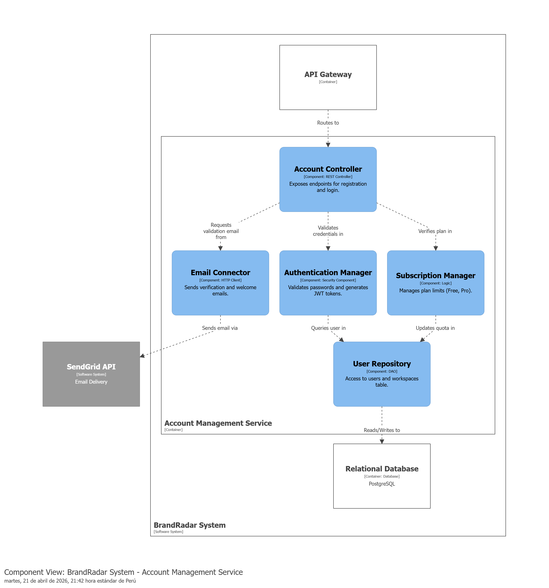

</div>
<br>

Administra la seguridad, la emisión de tokens JWT, el registro de usuarios y el control de las cuotas permitidas según el plan de suscripción adquirido.

<br>
<div align="center">
  
**Bounded Context: `Brand Management`**

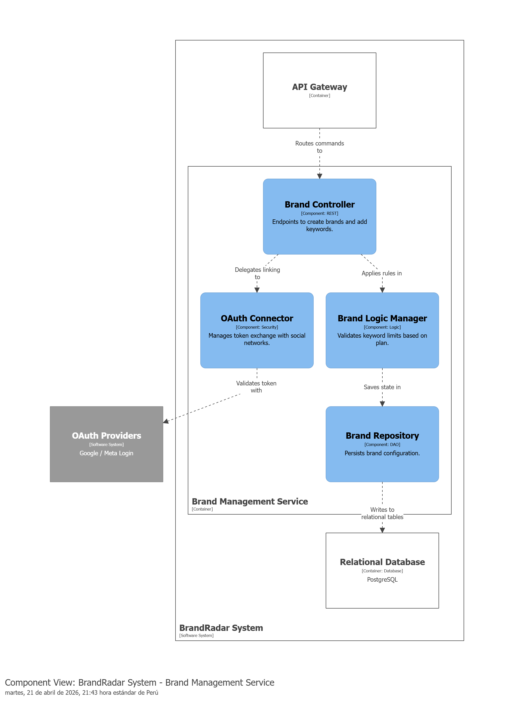

</div>
<br>

Permite la configuración del núcleo del negocio: la creación de marcas, la validación de palabras clave (keywords) y el intercambio seguro de tokens OAuth con plataformas de terceros.

<br>
<div align="center">

**Bounded Context: `Monitoring`**


</div>
<br>
  
Encargado de orquestar los ciclos programados (Schedulers) para extraer datos de Google Maps y Redes Sociales, filtrarlos y almacenarlos en la base de datos documental.

<br>
<div align="center">

**Bounded Context: `Sentiment Analysis`**


</div>
<br>

Integra el motor central de evaluación. Recibe eventos de nuevas menciones, interactúa con la API de NLP externa, aplica reglas locales para detección de sarcasmo y determina si el sentimiento cruza el umbral negativo.


<br>
<div align="center">
  
**Bounded Context: `Alert Management`**


</div>
<br>

Gestiona el ciclo de vida de las crisis de reputación. Evalúa las menciones negativas, genera tickets de seguimiento y dispara notificaciones push a través de servicios como Firebase/APNs.

<br>
<div align="center">
  
**Bounded Context: `Reporting`**


</div>
<br>

Consolida la información mediante procesos asíncronos para generar dashboards analíticos y reportes descargables en PDF, permitiendo a las agencias presentar resultados tangibles a sus clientes.

<br>

---

## 4.7. Software Object-Oriented Design

>*Esta sección presenta el diseño orientado a objetos de BrandRadar, traduciendo el modelo de dominio obtenido del Event Storming en una estructura de clases implementable. Se aplican principios SOLID y patrones tácticos de Domain-Driven Design, organizando el sistema en seis Bounded Contexts: Account Management, Brand Setup, Monitoring, Sentiment Analysis, Alert Management y Reporting.*

<br>

### 4.7.1. Class Diagrams

>*A continuación, se presentan los diagramas de clases UML para cada bounded context de BrandRadar. Estos diagramas describen las clases, sus atributos, métodos y relaciones, diferenciando además los componentes de frontend y backend. Esta representación permite comprender la organización modular del sistema y la distribución de responsabilidades entre la interfaz de usuario y la lógica de negocio, asegurando coherencia con la arquitectura definida.*


**1. Bounded Context: `Identity Access Context`**

<br>

El Identity Access Context es el contexto responsable de toda la gestión de identidad, autenticación y autorización dentro de BrandRadar. Su función central es garantizar que únicamente los usuarios verificados y autorizados accedan al sistema, y que cada usuario opere estrictamente dentro del perímetro de marcas que le fueron asignadas. Este contexto protege la información reputacional sensible desde el primer punto de contacto: el registro.
Sus responsabilidades incluyen el ciclo de vida completo de la cuenta de usuario (registro, verificación, activación, suspensión), la gestión de sesiones autenticadas con JWT, la recuperación segura de contraseñas y el control de acceso basado en roles (UserRole). Es también el contexto que emite los eventos de dominio más críticos de seguridad: UserRegistered, SessionInvalidated y UnauthorizedAccessAttempted.

<br>
<div align="center">

**Frontend Components Diagrams**

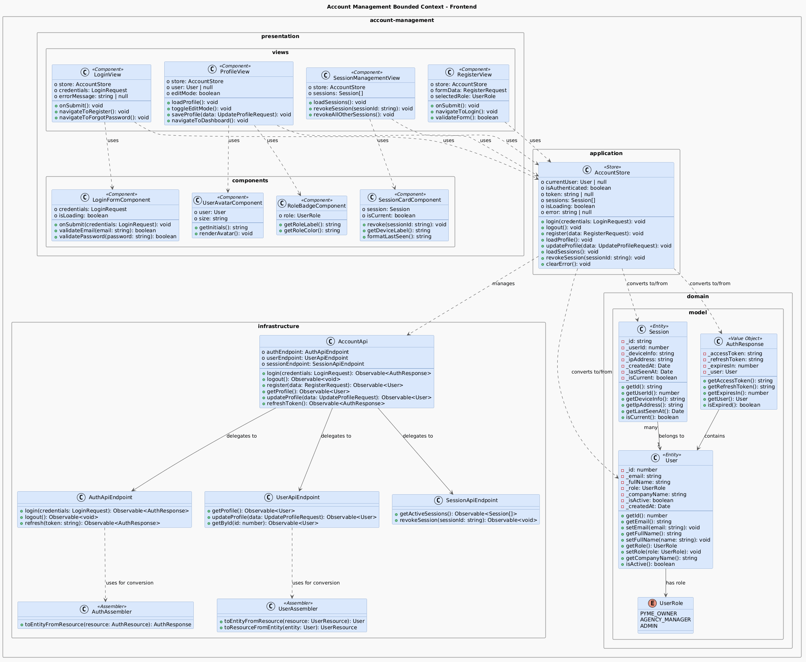

</div>
<br>

El diagrama muestra cómo LoginPage y RegisterPage delegan en el composable useAuth, que a su vez sincroniza el estado a través de AuthStore. El AuthGuard protege cada ruta consultando AuthFacade antes de permitir la navegación. TokenStorageAdapter abstrae la persistencia del token, y AuthApiClient centraliza las llamadas HTTP de autenticación. El flujo completo va desde la vista hasta la API sin que los componentes conozcan los detalles de autenticación.

<br>
<div align="center">

**Backend Components Diagrams**

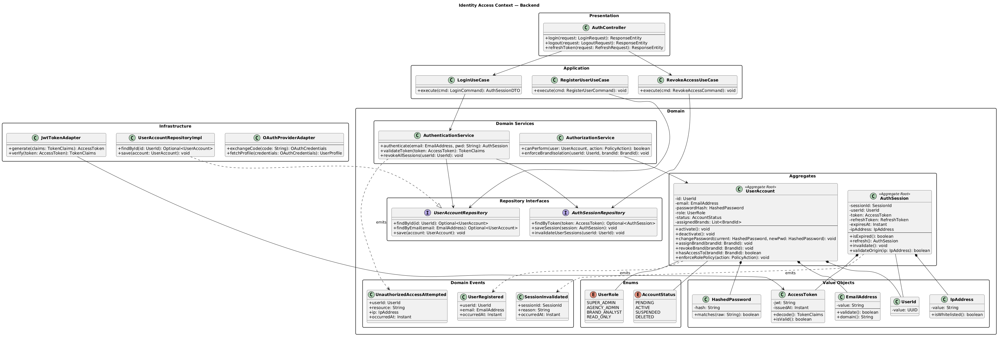

</div>
<br>

El diagrama gira en torno a dos Aggregate Roots: UserAccount y AuthSession. UserAccount encapsula el ciclo de vida completo de una cuenta —registro, activación, suspensión— y controla el acceso a marcas mediante hasAccessTo() y enforceBrandIsolation(). AuthSession representa una sesión activa, gestionando la validez del JWT y el origen de la request. Ambos aggregates emiten eventos de dominio relevantes: UserRegistered, SessionInvalidated y UnauthorizedAccessAttempted. Los Value Objects EmailAddress, HashedPassword y AccessToken encapsulan las reglas de validación de identidad, mientras que los Domain Services AuthenticationService y AuthorizationService coordinan la lógica que involucra múltiples agregados. La capa de infraestructura abstrae la generación de JWT (JwtTokenAdapter) y la integración con proveedores OAuth externos.

<br>


**2. Bounded Context: `Brand Workspace Context`**

<br>

El Brand Workspace Context es el contexto responsable de la configuración estratégica de las marcas monitoreadas. Modela el espacio de trabajo operacional de cada cliente: qué marcas se monitorean, con qué palabras clave, desde qué canales digitales y bajo qué plan y políticas. Es el contexto que define el perímetro de monitoreo y activa el motor de detección reputacional.
Este contexto es el núcleo organizacional de BrandRadar: sin una BrandWorkspace configurada, ningún otro contexto puede operar. Sus responsabilidades incluyen la gestión del ciclo de vida de workspaces y marcas, la conexión y desconexión de canales digitales (MonitoringChannel), la gestión de reglas de palabras clave (KeywordRule) y la aplicación de las políticas del plan contratado (WorkspacePolicy). También soporta el modo de emergencia (activateEmergencyMode()), que cambia el comportamiento del sistema ante una crisis reputacional activa.

<br>
<div align="center">

**Frontend Components Diagrams**

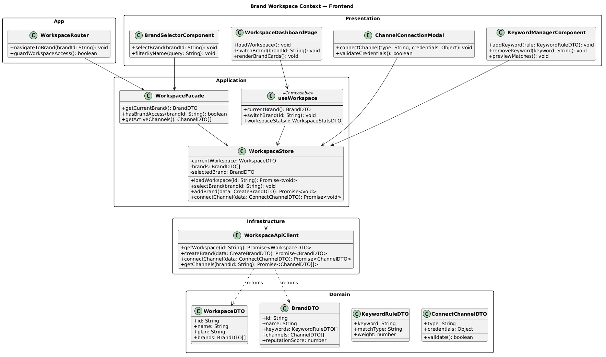

</div>
<br>

El diagrama muestra WorkspaceDashboardPage como punto de entrada, apoyada por BrandSelectorComponent, ChannelConnectionModal y KeywordManagerComponent para las operaciones principales. WorkspaceStore centraliza el estado del workspace activo y la marca seleccionada, mientras WorkspaceFacade expone consultas de alto nivel como hasBrandAccess(). El composable useWorkspace provee acceso reactivo a toda esta información para los componentes de presentación.

<br>
<div align="center">

**Backend Components Diagrams**

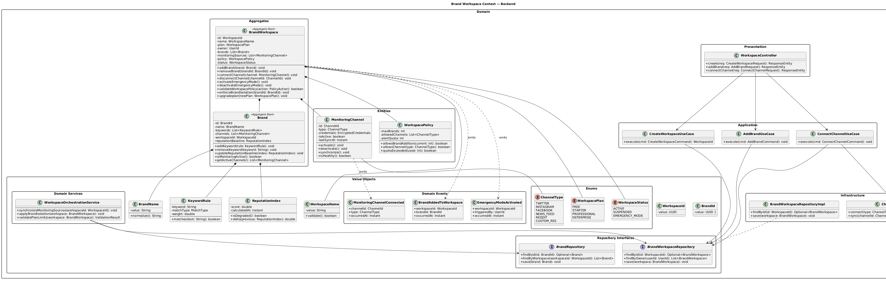

</div>
<br>

El diagrama tiene como núcleo al BrandWorkspace, Aggregate Root que agrupa marcas, canales y políticas del plan. Sus métodos activateEmergencyMode(), enforceBrandIsolation() y validateWorkspacePolicy() reflejan comportamiento de negocio real, no solo persistencia. El agregado Brand contiene las KeywordRule y el ReputationIndex base de la marca. La entidad MonitoringChannel gestiona el ciclo de vida de cada integración con plataformas digitales, y WorkspacePolicy encapsula los límites operacionales del plan contratado. Los eventos BrandAddedToWorkspace, MonitoringChannelConnected y EmergencyModeActivated comunican cambios estructurales al resto del sistema. ChannelIntegrationAdapter desacopla las APIs externas del dominio.

<br>

**3. Bounded Context: `Reputation Monitoring Context`**

<br>

El Reputation Monitoring Context es el corazón operacional de BrandRadar. Es el contexto responsable de capturar, clasificar y trazar las menciones digitales de una marca, y de gestionar los incidentes reputacionales desde su detección hasta su resolución. Modela el flujo continuo de información reputacional: desde la ingesta de menciones en tiempo real hasta la escalación y resolución de crisis.
Sus responsabilidades incluyen la captura y clasificación automática de menciones (MentionStream), la detección de anomalías en el volumen o sentimiento, la creación y gestión del ciclo de vida completo de ReputationIncident, y la generación de reportes reputacionales. Este contexto es el principal productor de eventos de dominio críticos: NegativeMentionDetected, ReputationSpikeDetected, IncidentEscalated e IncidentResolved.

<br>
<div align="center">

**Frontend Components Diagrams**

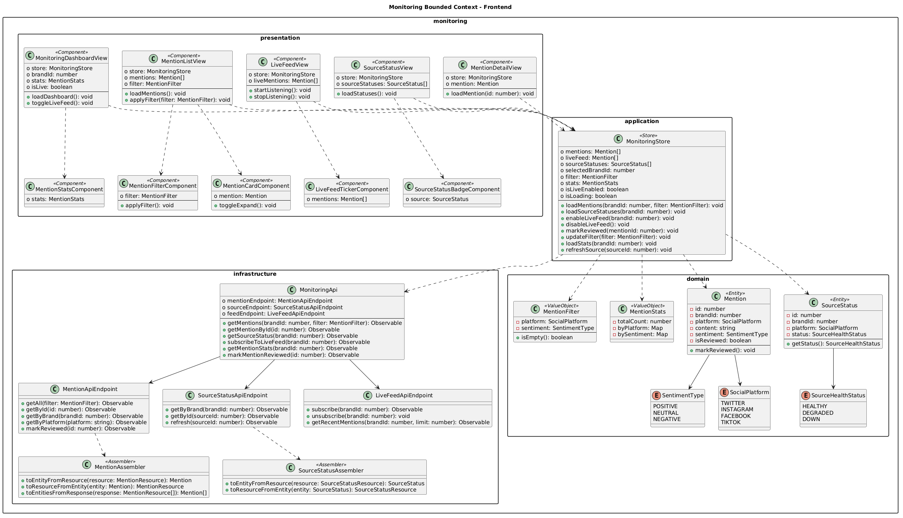

</div>
<br>

El diagrama organiza tres vistas principales: MentionFeedPage para el feed filtrable de menciones, IncidentDetailPage para la gestión individual de incidentes con su línea de tiempo, y ReputationDashboardPage para el score general. MonitoringStore centraliza el estado de menciones e incidentes, MonitoringFacade expone getCriticalMentions() y getOpenIncidents() para consumo de otros contextos, y useMonitoring provee el acceso reactivo desde los componentes.

<br>
<div align="center">

**Backend Components Diagrams**

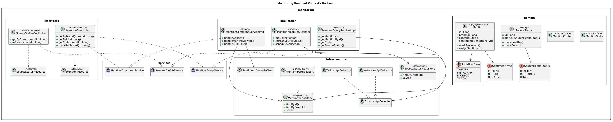

</div>
<br>

El diagrama muestra dos Aggregate Roots con comportamiento rico. MentionStream representa el flujo activo de menciones: ingesta, clasificación, detección de anomalías y generación de snapshots. ReputationIncident gestiona el ciclo de vida completo de un incidente: escalate(), acknowledge(), resolve() y construcción de la línea de tiempo con addTimelineEvent(). La entidad Mention combina MentionSource, SentimentScore y MentionCategory para representar cada mención con su contexto completo. Los Domain Services ReputationMonitoringService y AnomalyDetectionService coordinan el escaneo periódico y la detección de desviaciones estadísticas. Los eventos NegativeMentionDetected, ReputationSpikeDetected, IncidentEscalated e IncidentResolved alimentan tanto el Crisis Detection Context como el historial de trazabilidad.

<br>

**4. Bounded Context: `Crisis Detection Context`**

<br>

El Crisis Detection Context es el contexto responsable de la detección temprana, escalación y gestión de alertas de crisis reputacional. Su función es transformar señales anómalas detectadas en el MentionStream en alertas accionables con prioridad definida, y garantizar que los stakeholders correctos sean notificados en el menor tiempo posible.
Sus responsabilidades incluyen la evaluación continua del stream de menciones contra las reglas de monitoreo configuradas, la creación y gestión del ciclo de vida de CrisisAlert, la configuración de MonitoringRule con umbrales personalizados por marca, y la notificación multi-canal de stakeholders críticos. Este contexto consume eventos del Reputation Monitoring Context (ReputationSpikeDetected) y produce sus propios eventos: CrisisAlertTriggered, CrisisEscalated, MonitoringRuleTriggered y AlertAcknowledged.

<br>
<div align="center">

**Frontend Components Diagrams**

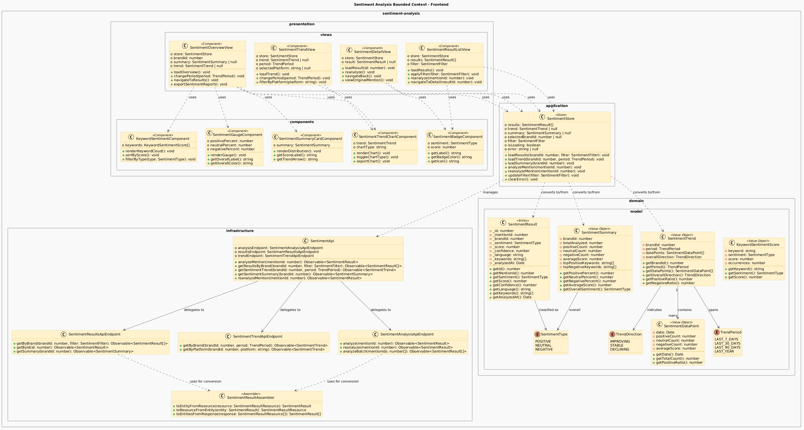

</div>
<br>

El diagrama muestra CrisisAlertDashboardPage como la vista central de alertas activas, AlertDetailPage para la gestión individual y MonitoringRulesPage para configurar las reglas de detección. CrisisBannerComponent garantiza visibilidad de alertas críticas en cualquier pantalla del sistema. CrisisStore mantiene el estado de alertas y reglas; CrisisFacade expone hasCriticalAlerts() y getUnacknowledgedCount() para que otros contextos puedan mostrar indicadores de estado. La infraestructura soporta WebSocket para recibir alertas en tiempo real.

<br>
<div align="center">

**Backend Components Diagrams**

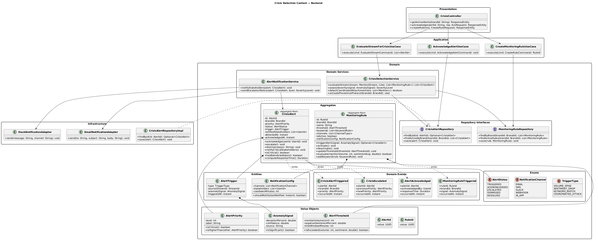

</div>
<br>

El diagrama tiene dos Aggregate Roots complementarios. CrisisAlert modela una alerta activa con su prioridad (AlertPriority), trigger de origen y ciclo de vida: acknowledge(), escalate(), dismiss(). El método computeResponseTime() mide el tiempo entre detección y reconocimiento, métrica clave de efectividad operacional. MonitoringRule encapsula la inteligencia de detección: el AlertThreshold define cuándo activar una alerta evaluando volumen de menciones y porcentaje de sentimiento negativo en una ventana temporal. Su método triggerAlert() es el punto de decisión central del contexto. CrisisDetectionService evalúa el stream completo contra todas las reglas activas y puede detectar ataques coordinados. AlertNotificationService orquesta notificaciones multi-canal a través de SlackNotificationAdapter y EmailNotificationAdapter. Los eventos CrisisAlertTriggered, CrisisEscalated y AlertAcknowledged documentan cada paso del ciclo de vida de la alerta.

<br>

**5. Bounded Context: `Sentiment Intelligence Context`**

<br>

El Sentiment Intelligence Context es el contexto responsable del análisis semántico y emocional de las menciones, la detección de tendencias de sentimiento y la identificación de patrones de desinformación. Provee la inteligencia que transforma texto crudo en señales reputacionales interpretables por el negocio.
Sus responsabilidades incluyen el análisis NLP de cada mención (sentimiento, emoción dominante, temas clave, idioma), el cálculo del SentimentScore compuesto, la detección de degradación sostenida del sentimiento, la comparación entre períodos para evaluar el impacto de estrategias, y la detección de patrones coordinados que sugieran campañas de desinformación. Este contexto emite los eventos SentimentTrendChanged, NegativeSentimentSpikeDetected y DisinformationPatternFlagged.

<br>
<div align="center">

**Frontend Components Diagrams**

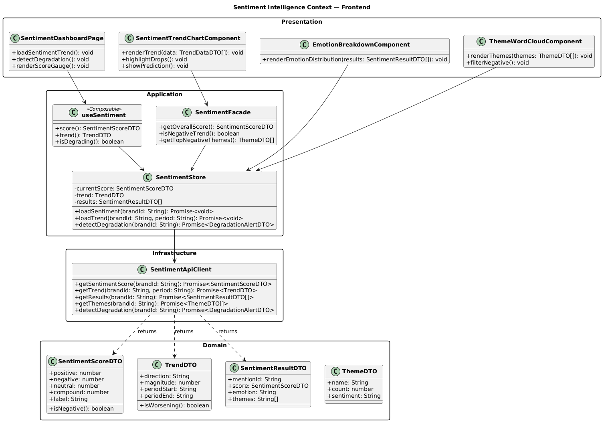

</div>
<br>

El diagrama muestra cuatro componentes visuales especializados: SentimentDashboardPage para el score general, SentimentTrendChartComponent para la evolución temporal con predicción, EmotionBreakdownComponent para la distribución de emociones y ThemeWordCloudComponent para los temas recurrentes. SentimentStore y SentimentFacade centralizan el estado y exponen isNegativeTrend() para consumo cross-context. Los DTOs SentimentScoreDTO y TrendDTO incluyen métodos como isNegative() e isWorsening() para activar alertas visuales directamente desde el componente.

<br>
<div align="center">

**Backend Components Diagrams**

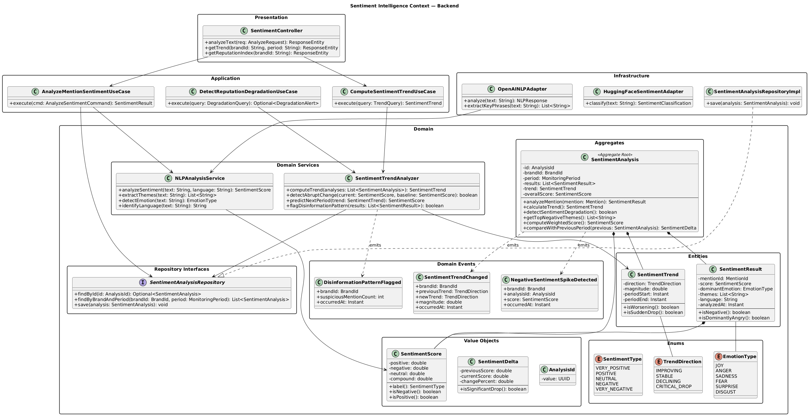

</div>
<br>

El diagrama está organizado alrededor del SentimentAnalysis, único Aggregate Root del contexto, que consolida los resultados individuales de análisis, la tendencia calculada y el score global compuesto. Sus métodos detectSentimentDegradation(), compareWithPreviousPeriod() y getTopNegativeThemes() representan decisiones de negocio concretas, no solo cálculos técnicos. La entidad SentimentTrend modela la dirección y magnitud de la tendencia con isWorsening() e isSuddenDrop() como indicadores de alarma. El Value Object SentimentScore descompone el sentimiento en cuatro dimensiones (positivo, negativo, neutro, compuesto), y SentimentDelta cuantifica la variación entre períodos. Los Domain Services NLPAnalysisService y SentimentTrendAnalyzer abstraen los modelos de IA, permitiendo cambiar de proveedor —OpenAINLPAdapter o HuggingFaceSentimentAdapter— sin afectar el dominio. El evento DisinformationPatternFlagged conecta este contexto con el de Crisis Detection.

<br>

**6. Bounded Context: `Infrastructure Health Context`**

<br>

El Infrastructure Health Context es el contexto responsable de monitorear la salud operacional de los servicios técnicos que soportan BrandRadar. Su función es detectar fallos de infraestructura antes de que impacten el monitoreo reputacional, garantizar el cumplimiento del SLA de disponibilidad y cuantificar el impacto reputacional que una caída de servicio puede generar para las marcas afectadas.
Sus responsabilidades incluyen la ejecución periódica de health checks sobre los endpoints de cada servicio, la gestión del ciclo de vida de incidentes de infraestructura (InfraIncident), el cálculo de disponibilidad y cumplimiento del SLA, y la notificación a las marcas afectadas cuando un servicio crítico falla. Este contexto conecta la dimensión técnica con la reputacional: un fallo de infraestructura que afecta la disponibilidad del sistema puede derivar en riesgo reputacional para las marcas que dependen del monitoreo en tiempo real.

<br>
<div align="center">

**Frontend Components Diagrams**

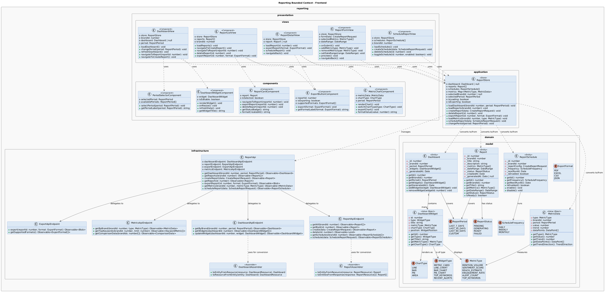

</div>
<br>

El diagrama organiza cuatro componentes: InfraHealthDashboardPage como vista central, ServiceStatusComponent con indicadores visuales de estado y uptime, InfraIncidentListComponent para gestión y resolución de incidentes con nota de postmortem, y AvailabilityReportComponent para el reporte de cumplimiento del SLA. InfraStore mantiene el flag hasActiveIncidents para que otros contextos del frontend puedan mostrar alertas de degradación. InfraFacade expone hasReputationalRisk() y overallHealthScore() como indicadores cross-context. Los DTOs incluyen hasReputationalImpact() e isCompliant() para lógica de presentación condicional.

<br>
<div align="center">

**Backend Components Diagrams**

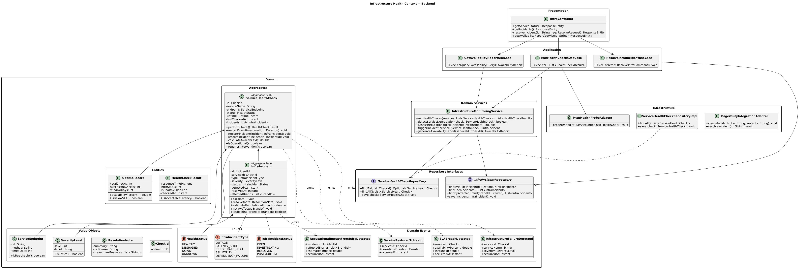

</div>
<br>

El diagrama presenta dos Aggregate Roots con una relación directa. ServiceHealthCheck ejecuta verificaciones periódicas sobre cada servicio, calcula la disponibilidad acumulada mediante UptimeRecord y determina si está por debajo del SLA. Sus métodos performCheck(), calculateAvailability() y requiresIntervention() gobiernan el ciclo de monitoreo. InfraIncident modela el incidente técnico con su tipo (OUTAGE, LATENCY_SPIKE, SSL_EXPIRY, etc.), severidad y marcas afectadas. El método estimateReputationalImpact() es el puente conceptual entre infraestructura y negocio, y notifyAffectedBrands() propaga el impacto a los responsables de cada marca. InfrastructureMonitoringService orquesta los checks en paralelo y evalúa el riesgo reputacional de cada incidente. El evento ReputationalImpactFromInfraDetected es el más relevante del contexto: conecta explícitamente un fallo técnico con el riesgo reputacional de las marcas que dependen del sistema. PagerDutyIntegrationAdapter conecta el sistema con la plataforma de guardia operacional.

<br>

---

## 4.8. Database Design

>*El diseño de base de datos de BrandRadar define la capa de persistencia del sistema, donde se almacena la información generada y procesada por los distintos Bounded Contexts. Esta sección traduce el modelo orientado a objetos hacia un esquema relacional, definiendo tablas, columnas, tipos de datos, claves primarias, claves foráneas y restricciones necesarias para garantizar la integridad, consistencia y trazabilidad de los datos.*

*El diseño respeta los límites establecidos por los Bounded Contexts, organizando las tablas de forma modular según el dominio al que pertenecen.*

<br>

### 4.8.1. Database Diagrams

>*El diagrama de base de datos de Brandradar refleja una arquitectura orientada al dominio, organizada en múltiples bounded contexts, cada uno responsable de un conjunto cohesivo de entidades. Para su elaboración se utilizó MySQL Workbench, herramienta que permitió diseñar, visualizar y estructurar las tablas, columnas y relaciones del sistema de manera clara. Aunque el modelo es único a nivel físico, en el diagrama las tablas se agrupan visualmente según el bounded context al que pertenecen, lo que facilita la comprensión de la estructura del sistema sin generar duplicación de datos. Aunque todas las tablas comparten una sola base de datos, en el diagrama se agrupan visualmente según el bounded context al que pertenecen.*

<br>

<div align="center">
  

**`Database Diagram`**

<br>

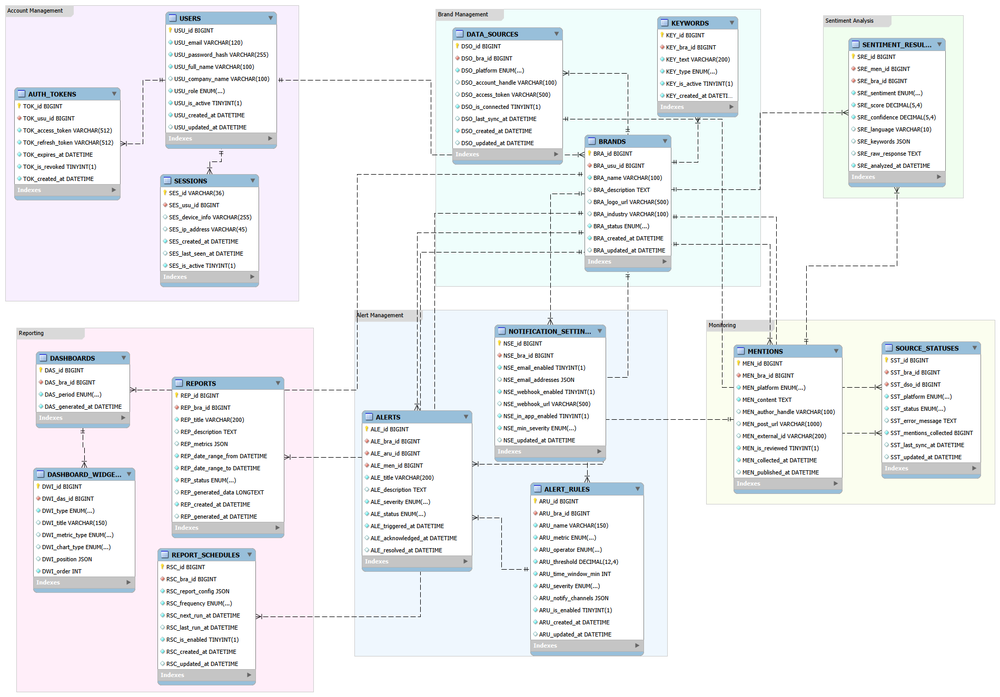

</div>

<br>

*Explicación:*

<br>

**Identity Access Context**

Gestiona todo lo relacionado con autenticación, autorización y auditoría de usuarios. La entidad central es user_account, que define el perfil del usuario con su rol (SUPER_ADMIN, AGENCY_ADMIN, BRAND_ANALYST, READ_ONLY) y estado del ciclo de vida (PENDING, ACTIVE, SUSPENDED, DELETED). Las sesiones activas se registran en auth_session, almacenando el JWT, el refresh token, la IP y la fecha de expiración, con cascada de eliminación al borrar el usuario. La tabla user_assigned_brand modela la relación N:M entre usuarios y marcas, permitiendo que un analista tenga acceso restringido solo a las marcas que le corresponden. Finalmente, unauthorized_access_log registra intentos de acceso fallidos o no autorizados —incluyendo anónimos— para fines de auditoría de seguridad.

<br>

**Brand Workspace Context**

Es el núcleo organizativo de la plataforma. Un brand_workspace agrupa marcas bajo un plan de suscripción (FREE, STARTER, PROFESSIONAL, ENTERPRISE) y embebe la política del workspace como Value Object: límite de marcas (policy_max_brands) y cuota de alertas (policy_alert_quota). Los canales habilitados por workspace se gestionan en la tabla separada workspace_allowed_channel. Cada brand pertenece a un workspace e incorpora el ReputationIndex como campos embebidos (reputation_score, reputation_calculated_at). Para cada marca se configuran keyword_rule (palabras clave con tipo de match y peso) y monitoring_channel (canales de fuente de datos con credenciales cifradas y control de última sincronización).

<br>

**Reputation Monitoring Context** 

Centraliza la captura y gestión de menciones de marca en redes y medios. Un mention_stream define una ventana temporal de escucha activa para una marca. Cada mention capturada dentro de ese stream lleva embebido el Value Object MentionSource (plataforma, URL, confiabilidad del autor) y un SentimentScore preliminar (positivo, negativo, neutral, compuesto). Cuando las menciones derivan en un problema de reputación, se crea un reputation_incident con nivel de severidad, estado del flujo de trabajo (OPEN → ESCALATED → RESOLVED) y datos de resolución. El historial completo de acciones sobre cada incidente queda registrado en incident_event, con el actor que realizó cada acción.

<br>

**Crisis Detection Context** 

Implementa el motor de detección proactiva de crisis. Las monitoring_rule definen las condiciones de disparo embebiendo el Value Object AlertThreshold: volumen máximo de menciones, porcentaje de sentimiento negativo permitido y ventana de tiempo de evaluación. Cada regla puede tener asociados keywords (monitoring_rule_keyword), canales monitoreados (monitoring_rule_channel), canales de notificación (monitoring_rule_notification_channel) y stakeholders a alertar (monitoring_rule_stakeholder). Cuando una regla se activa, genera un crisis_alert con su AlertPriority, tipo de disparo (VOLUME_SPIKE, SENTIMENT_DROP, KEYWORD_MATCH, COORDINATED_ATTACK) y métricas de confianza. El reconocimiento de la alerta queda formalizado en crisis_alert_acknowledgement y las notificaciones enviadas se rastrean en crisis_alert_notified_stakeholder.

<br>

**Sentiment Intelligence Context** 

Provee análisis de sentimiento agregado y profundo por marca. Un sentiment_analysis cubre un período temporal y contiene el SentimentScore global (positivo, negativo, neutral, compuesto), la tendencia embebida SentimentTrend (dirección: IMPROVING, STABLE, DECLINING, CRITICAL_DROP con magnitud) y el SentimentDelta comparativo respecto al período anterior. Cada sentiment_result desagrega el análisis a nivel de mención individual, registrando scores individuales y la emoción dominante detectada (JOY, ANGER, SADNESS, FEAR, SURPRISE, DISGUST). Los temas recurrentes identificados en cada resultado se almacenan como entradas individuales en sentiment_result_theme, permitiendo análisis de tendencias temáticas.

<br>

**Infrastructure Health Context** 

Monitorea la salud operativa de los servicios internos de la plataforma. Cada service_health_check registra un servicio con su ServiceEndpoint embebido (URL, método HTTP, timeout) y su UptimeRecord (total de checks realizados, exitosos y ventana de días). Los resultados individuales de cada verificación —tiempo de respuesta, HTTP status e indicador de salud— se persisten en health_check_result. Cuando se detecta una degradación, se abre un infra_incident categorizado por tipo (OUTAGE, LATENCY_SPIKE, SSL_EXPIRY, etc.) con su SeverityLevel y flujo de resolución hasta el estado POSTMORTEM. La tabla infra_incident_affected_brand vincula cada incidente de infraestructura con las marcas cuyo monitoreo fue impactado, cerrando el ciclo entre la salud técnica y su efecto reputacional.

<br>

---

<div align="center">

# Capítulo V: Product Implementation, Validation & Deployment

</div>

---

## 5.1. Software Configuration Management

### 5.1.1. Software Development Environment Configuration

En esta sección se describen las herramientas de software seleccionadas para dar soporte a las distintas fases del ciclo de vida del producto digital BrandRadar. Se incluyen sus nombres, objetivos específicos dentro del proyecto y los enlaces de acceso o descarga, diferenciando entre soluciones SaaS y aplicaciones instalables.

<br>

<div align="center">

**Gestión de Requisitos**

| Herramienta | Uso principal | Enlace |
|:---|:---|:---|
|  | Elaboración colaborativa de As-Is y To-Be Scenario Maps, así como Impact Maps para cada segmento objetivo. | [miro.com](https://miro.com) |
|  | Creación de User Personas, Empathy Maps, Journey Maps e Impact Maps para los segmentos Dueños de PyMEs y Directores de Agencias Digitales. | [uxpressia.com](https://uxpressia.com) |
|  | Seguimiento de proyectos con enfoque en historias de usuario, métricas de velocidad y visualización del estado de tareas por sprint. | [pivotaltracker.com](https://pivotaltracker.com) |


<br>

**Diseño de Experiencia y UI/UX**

| Herramienta | Uso principal | Enlace |
|:---|:---|:---|
|  | Diseño colaborativo de wireframes, mockups y prototipos de alta fidelidad de la aplicación web BrandRadar. | [figma.com](https://figma.com) |
|  | Elaboración de user flows, wireflows y diagramas de procesos o arquitectura. | [lucidchart.com](https://lucidchart.com) |
|  | Diseño colaborativo en tiempo real de mapas de experiencia (As-Is y To-Be Scenarios). | [miro.com](https://miro.com) |
|  | Creación de User Personas, Empathy Maps y Journey Maps para la validación de la experiencia de usuario. | [uxpressia.com](https://uxpressia.com) |

<br>

**Desarrollo de Software**

| Herramienta / Tecnología | Uso principal | Enlace |
|:---|:---|:---|
|  | Entorno de desarrollo integrado principal para escribir, editar y depurar el código de la aplicación. | [jetbrains.com/webstorm](https://www.jetbrains.com/webstorm/) |
|  | Lenguaje de marcado para estructurar el contenido de la landing page y del dashboard de BrandRadar. | [MDN Web Docs](https://developer.mozilla.org/docs/Web/HTML) |
|  | Lenguaje de estilos para definir la apariencia visual de la landing page y la aplicación web. | [MDN Web Docs](https://developer.mozilla.org/docs/Web/CSS) |
|  | Framework principal para el desarrollo de la aplicación web con componentes reutilizables y enrutamiento. | [angular.io](https://angular.io) |
|  | Superconjunto tipado de JavaScript utilizado como lenguaje principal del proyecto Angular. | [typescriptlang.org](https://www.typescriptlang.org) |

<br>

**Pruebas de Software**

| Herramienta | Uso principal |
|:---|:---|
|  | Lenguaje para definir criterios de aceptación de las User Stories en formato legible por todos los integrantes del equipo (Given / When / Then). |

<br>

**Diseño de Arquitectura de Software**

| Herramienta | Uso principal | Enlace |
|:---|:---|:---|
|  | Modelado de la arquitectura del sistema con el enfoque C4 mediante la técnica Diagrams-as-Code. | [structurizr.com/dsl](https://structurizr.com/dsl) |
|  | Elaboración de diagramas UML y de arquitectura, compatible con la documentación técnica del proyecto. | [plantuml.com](https://plantuml.com/es/) |
|  | Diseño visual y profesional de bases de datos relacionales. | [mysql.com/products/workbench](https://www.mysql.com/products/workbench) |

<br>

**Control de Versiones y Colaboración**

| Herramienta | Uso principal | Enlace |
|:---|:---|:---|
|  | Sistema distribuido de control de versiones para la gestión del código fuente. | [git-scm.com](https://git-scm.com) |
|  | Repositorio remoto para almacenar, gestionar y colaborar en el código fuente. Incluye seguimiento de issues y revisión de Pull Requests. | [github.com](https://github.com) |
|  | Modelo de ramificación para mantener el código organizado en ramas (`main`, `develop`, `feature`, `release`). | [nvie.com](https://nvie.com/posts/a-successful-git-branching-model) |
|  | Convención de mensajes de commit para mejorar la trazabilidad y facilitar la generación de changelogs. | [conventionalcommits.org](https://www.conventionalcommits.org) |

<br>

**Despliegue de Software**

| Herramienta / Plataforma | Uso principal | Enlace |
|:---|:---|:---|
|  | Despliegue automático y gratuito de la landing page directamente desde el repositorio de GitHub, con integración continua. | [netlify.com](https://www.netlify.com) |

<br>

**Documentación de Software**

| Herramienta / Recurso | Uso principal | Enlace |
|:---|:---|:---|
|  | Repositorio central de documentación mediante `README.md`, issues y wikis del proyecto. | [github.com](https://github.com) |
|  | Edición y mantenimiento del archivo `README.md` asociado a la documentación del proyecto. | [code.visualstudio.com](https://code.visualstudio.com) |

</div>
<br>

---

### 5.1.2. Source Code Management

El equipo utilizará Git como sistema de control de versiones y GitHub como plataforma centralizada para la gestión del repositorio del proyecto BrandRadar. Esta infraestructura permite registrar, rastrear y visualizar todos los cambios realizados en el código fuente, así como identificar la contribución individual de cada integrante del equipo a lo largo del ciclo de desarrollo.

<br>

El repositorio principal del proyecto se encuentra disponible en el siguiente enlace:

[https://github.com/Los-5-Suyos/BrandRadar](https://github.com/Los-5-Suyos/BrandRadar)

<br>

**Contribuciones del equipo:**

[https://github.com/Los-5-Suyos/BrandRadar-report/graphs/contributors](https://github.com/Los-5-Suyos/BrandRadar-report/graphs/contributors)

| Producto                 | Repositorio GitHub                                                                                   |
| :----------------------- | :--------------------------------------------------------------------------------------------------- |
| Organización Los 5 Suyos | [https://github.com/Los-5-Suyos](https://github.com/Los-5-Suyos)                                     |
| Landing Page             | [https://github.com/Los-5-Suyos/BrandRadar-Landing-Page](https://github.com/Los-5-Suyos/BrandRadar-Landing-Page)  |
| Report                   | [https://github.com/Los-5-Suyos/BrandRadar-report.git](https://github.com/Los-5-Suyos/BrandRadar-report.git) |
| Web Application          | [https://github.com/Los-5-Suyos/BrandRadar-Frontend-Web-App](https://github.com/Los-5-Suyos/BrandRadar-Frontend-Web-App)  |
| API / Backend            | [https://github.com/Los-5-Suyos/BrandRadar-Web-Services](https://github.com/Los-5-Suyos/BrandRadar-Web-Services)  |

<br>

**Modelo de Ramificación (GitFlow)**

El equipo adoptará la estrategia GitFlow Workflow, la cual permite organizar el desarrollo de manera estructurada mediante el uso de ramas especializadas.

Se definen dos ramas principales:

- main: contiene las versiones estables listas para producción.
- develop: integra las nuevas funcionalidades antes de su liberación.

<br>

| Tipo de rama | Uso principal                        | Convención de nombres        | Ejemplo                |
| :----------- | :----------------------------------- | :--------------------------- | :--------------------- |
| feature      | Desarrollo de nuevas funcionalidades | feature/<nombre-descriptivo> | feature/login-usuarios |
| release      | Preparación de versiones previas     | release/vX.Y.Z               | release/v1.0.0         |
| hotfix       | Corrección de errores en producción  | hotfix/<problema>            | hotfix/error-navbar    |


<br>

## Convención de Commits

Para mantener consistencia y trazabilidad, los mensajes de commit seguirán la convención Conventional Commits.

**Formato general:**

>*tipo(alcance opcional): descripción breve*

**Tipos de commit definidos:**

- **feat:** nueva funcionalidad
- **fix:** corrección de errores
- **docs:** cambios en documentación
- **style:** ajustes de formato
- **refactor:** cambios sin alterar funcionalidad
- **test:** pruebas
- **chore:** tareas de mantenimiento

<br>

---

### 5.1.3. Source Code Style Guide & Conventions

Con el objetivo de mantener un código ordenado, consistente y fácil de mantener entre todos los miembros del equipo, se han definido las siguientes convenciones para el proyecto BrandRadar. Estas normas aseguran una correcta colaboración y facilitan la escalabilidad del sistema.

<br>

**Convenciones Generales**

- Se utilizará inglés como idioma único para nombres de variables, funciones, clases, comentarios y documentación.
- Se evitarán abreviaciones innecesarias y nombres genéricos como data1, temp, info, etc.
- Los nombres deben ser descriptivos y reflejar claramente su propósito.
- Se prioriza la claridad del código sobre soluciones complejas.

<br>

### HTML

- Atributos en minúsculas.
- Nombres de clases usando kebab-case (ej. section-title, main-container).
- Uso de estructura semántica clara:
  - *header*
  - *nav*
  - *main*
  - *section*
  - *footer*
- Sangría de 2 espacios.
- Atributos ordenados de manera lógica:
- id, class, type, name, placeholder, value, required, etc.

<br>

### CSS

- Para clases personalizadas se utilizará kebab-case.
- Las clases se organizarán por orden lógico:
  - layout → spacing → color → typography
- Se evitarán estilos redundantes y se priorizará la reutilización.

<br>

### TypeScript

Basado en buenas prácticas de desarrollo, se adoptan las siguientes reglas:

Nombres y sintaxis:

- camelCase para variables, funciones y parámetros.
- PascalCase para clases, interfaces, enums y tipos.
- Constantes globales en UPPER_CASE_WITH_UNDERSCORES.

Módulos e imports:

- Imports ordenados:
    Librerías externas
    Módulos internos
- Evitar default export, usar:
    export const
    export class
  
Tipado:

- Tipar explícitamente parámetros y valores de retorno.
- Evitar any excepto cuando sea estrictamente necesario.
- Usar readonly en propiedades inmutables.
- Preferir interface sobre type cuando aplique.

Buenas prácticas:

- Preferir const sobre let y evitar var.
- Evitar el uso de this fuera de clases.
- Separar lógica de negocio de la capa de presentación.
- Mantener funciones pequeñas y reutilizables.

<br>

### Angular

Se seguirán buenas prácticas para mantener una arquitectura limpia:

Componentes:

- Nombres en PascalCase con sufijo Component
(ej. UserCardComponent)
- Separación de archivos:
    templateUrl para HTML
    styleUrls para CSS
- Evitar lógica compleja en los templates.

Buenas prácticas:

- No incluir lógica de negocio dentro de los componentes.
- Delegar procesos a servicios.
- Usar async en templates en lugar de suscripciones manuales.
- Selectores en kebab-case (ej. app-user-card).

<br>

### Pruebas (Gherkin)

En caso de utilizar especificaciones basadas en Gherkin:

- Se empleará el formato estándar:

```html
Given condición inicial  
When ocurre una acción  
Then se obtiene un resultado  
And condiciones adicionales  
```

<br>

---

### 5.1.4. Software Deployment Configuration

<br>

## Landing Page:

Para desplegar la landing page de BrandRadar, utilizamos GitHub como repositorio y Netlify como plataforma de hosting. El despliegue se configura conectando el repositorio de GitHub a Netlify, permitiendo implementación continua automática cada vez que se realiza un push a la rama principal. El directorio de publicación corresponde a la carpeta que contiene el archivo index.html.

<br>

## Frontend Web Application:

El frontend de la aplicación web se despliega utilizando GitHub + Netlify. Se configura el build automático (npm run build) y se define el directorio de salida. Esto permite que las actualizaciones del dashboard, sistema de alertas y visualización de menciones se publiquen de forma rápida y automática.

<br>

## Web Services (RESTful API):

Los servicios backend (RESTful API) se despliegan en Render o Railway. Se vincula el repositorio de GitHub, se configuran las variables de entorno necesarias para las integraciones con APIs externas y se activa el despliegue automático. De esta forma, el backend que procesa el análisis de sentimiento y genera alertas funciona de manera independiente del frontend.

<br>

---

## 5.2. Landing Page, Services & Applications Implementation

### 5.2.1. Sprint 1

#### 5.2.1.1. Sprint Planning 1

El Sprint Planning 1 tuvo como objetivo principal completar y desplegar la Landing Page del proyecto BrandRadar, estableciendo así una primera versión funcional y accesible para los usuarios.

Durante este sprint, el equipo definió las tareas necesarias para finalizar el desarrollo visual y estructural de la Landing Page, asegurando el cumplimiento de los lineamientos de diseño responsive y experiencia de usuario previamente establecidos. Asimismo, se planificó la integración con el repositorio en GitHub y su posterior despliegue en la plataforma Netlify.

Entre las actividades principales se incluyeron:

- Finalización de secciones clave de la Landing Page (Home, Features, About, Contact).
- Ajustes de estilos y diseño responsive.
- Optimización de componentes y estructura HTML/CSS.
- Configuración del despliegue continuo mediante Netlify.
- Publicación de la versión inicial accesible mediante un enlace web.

Como resultado del Sprint Planning, el equipo estableció un conjunto claro de tareas priorizadas, permitiendo organizar el trabajo de manera eficiente y cumplir con el objetivo de contar con una Landing Page completamente funcional y desplegada al finalizar el sprint.

<br>

| Campo                               | Detalle   |
| :---------------------------------- | :-------------------------------------------------------------------------------------------------------------------------------------------------------------------------------------------------------------------------------------------------------------------------------------------------------------------------------------------------------------------------------------------------------------------------------- |
| **Sprint #**                        | Sprint  |
| **Sprint Planning Background**      | En este sprint se abordará el desarrollo de la Landing Page de BrandRadar utilizando HTML y CSS puro, a partir de los mock-ups de alta fidelidad previamente diseñados. El objetivo es construir una primera versión funcional del sitio web que comunique la propuesta de valor del producto, sus funcionalidades, planes y canales de contacto, permitiendo captar leads y generar visibilidad de marca.                        |
| **Date**                            | 2026/04/15              |
| **Time**                            | 6:00  PM|
| **Location**                        | Reunión virtual mediante la plataforma  |
| **Prepared By**                     | Salinas Guzmán, Brianna  |
| **Attendees (to planning meeting)** | Salinas, Brianna / Cruzalegui, Joaquin / Jáuregui, Jean / García, Victor / Acuña, Luis   |
| **Sprint 0 Review Summary**         | Durante el Sprint 0 se completó la etapa de investigación y diseño de la arquitectura base del sistema. Se definieron las épicas, user stories y se desarrollaron los mock-ups de alta fidelidad, lo que permite al equipo iniciar con claridad la implementación de la Landing Page.     |
| **Sprint 0 Retrospective Summary**  | El equipo demostró compromiso durante el desarrollo del Sprint 0; sin embargo, se identificó la necesidad de reforzar el uso de GitFlow y la coordinación en la integración del código para evitar conflictos durante el desarrollo colaborativo.   |
| **Sprint Goal & User Stories**      |    |
| **Sprint 1 Goal**                   | Nuestro enfoque está en desarrollar y desplegar la Landing Page de BrandRadar. Creemos que esto permitirá presentar claramente la propuesta de valor del producto y captar potenciales clientes desde una primera interacción. Esto se confirmará cuando todas las secciones (hero, funcionalidades, testimonios, precios y contacto) estén completamente implementadas, integradas y desplegadas en una plataforma como Netlify. |
| **Sprint 1 Velocity**               | 10   |
| **Sum of Story Points**             | 9   |

<br>

---

#### 5.2.1.2. Aspect Leaders and Collaborators


Ahora presentaremos nuestro LACX (Leadership-and-Collaboration Matrix) que nos ayudará a saber quién lidera y quién colabora en cada aspecto de este primer sprint. En base a la coordinación del equipo, se asignaron los siguientes liderazgos para los componentes de la Landing Page:

<br>

| Team Member  | GitHub Username | `[US01 · Hero + Propuesta de valor]` | `[US02 · Funcionalidades + Segmentos]` | `[US03 · Testimonios + Evidencia social]` | `[US04 · Planes + Comparativa]` | `[US05 · Formulario de contacto]` |
|:-----------------------------------:|:---------------:|:-------------:|:-------------:|:-------------:|:-------------:|:-------------:|
| Salinas, Brianna | brianna-salinas | L | C | C | C | C |
| García, Victor | vicmacode | C | L | C | C | C |
| Jáuregui, Jean | JFranco556 | C | C | L | C | C |
| Acuña, Luis | L2006delacruz | C | C | C | L | C |
| Cruzalegui, Joaquin | JoaquinCruzalegui | C | C | C | C | L |

<br>

> **L** = Leader &nbsp;|&nbsp; **C** = Collaborator

<br>

---

#### 5.2.1.3. Sprint Backlog 1

**Objetivo del Sprint:** Publicar la landing page funcional de BrandRadar que comunique la propuesta de valor reputacional, permita a visitantes evaluar el producto y habilite el primer contacto comercial — convirtiendo visitas en prospectos calificados.
 
**Sprint Goal:** *Un visitante PyME o de agencia puede llegar a la landing page, comprender qué resuelve BrandRadar, comparar planes, leer evidencia social y enviar una consulta comercial — todo sin fricciones.*
 
**Story Points comprometidos: 9 SP | Duración: 2 semanas | Stack: HTML5 / CSS3 / JavaScript vanilla**
 
---
 
| Sprint # |   |        |      |     |        |                |                    |            |
| :----------- | :--------------------------------------------------------------------------------------- | :----- | :------------------- | :----------------------------------------------------------- | :---------------------------------------------------------------------------------------------------------------------------------------------------------------------------------------------------------------------- | :------------- | :----------------- | :--------- |
| **Sprint 1** | **User Story**   |   | **Work-Item / Task** |    |   |                | **Asignado a**     | **Status** |
| **ID**       | **Título**   | **SP** | **ID**     | **Título**  | **Descripción**   | **Estimación** | **Asignado a**     |            |
| US01         | Comunicar propuesta de valor para convertir visitantes en prospectos                     | 2      | T01                  | Maquetar hero section                                        | Diseñar y maquetar hero section con HTML y CSS puro: titular, descripción del producto y CTA 'Comenzar gratis' visible above the fold.                                                                             | 4h             | Brianna           | Done     |
| US01         | Comunicar propuesta de valor para convertir visitantes en prospectos                     | 2      | T02                  | Implementar tracking de conversión                           | Registrar clic en CTA mediante JavaScript vanilla. Redirigir al formulario de registro con el plan preseleccionado.                                                                                                               | 2h             | Luis           | Done     |
| US01         | Comunicar propuesta de valor para convertir visitantes en prospectos                     | 2      | T03                  | Validar responsive                                           | Validar breakpoints mobile (375px), tablet (768px) y desktop (1280px). Sin pérdida de capacidad de conversión en ningún dispositivo.                                                                                    | 2h             | Brianna           | Done      |
| US02         | Evaluar si las capacidades del producto cubren las necesidades de monitoreo reputacional | 2      | T04                  | Maquetar sección de funcionalidades                          | Maquetar sección con cards en HTML/CSS por capacidad reputacional: monitoreo, detección de crisis, reportes. Mínimo 3 flujos de trabajo concretos representados.                                                                     | 3h             | Victor           | Done      |
| US02         | Evaluar si las capacidades del producto cubren las necesidades de monitoreo reputacional | 2      | T05                  | Maquetar subsección para agencias                            | Maquetar subsección diferenciada para agencias: gestión multi-marca, reportes por cliente y alertas priorizadas visibles explícitamente.                                                                                  | 2h             | Victor           | Done    |
| US03         | Reducir fricción de decisión mediante evidencia social de usuarios reales                | 1      | T06                  | Maquetar sección de testimonios                              | Maquetar sección con al menos 2 testimonios por segmento (PyME / agencia) con nombre, tipo de empresa y resultado operacional obtenido — no frase genérica de satisfacción.                                             | 3h             | Jean Franco            | Done      |
| US03         | Reducir fricción de decisión mediante evidencia social de usuarios reales                | 1      | T07                  | Implementar navegación entre testimonios                     | Implementar carousel o scroll entre testimonios. Al menos 2 casos comparables visibles para el visitante sin scroll adicional.                                                                                           | 2h             | Jean Franco           | To-Do      |
| US04         | Seleccionar el plan que se alinea con la escala operacional del negocio                  | 2      | T08                  | Maquetar tabla comparativa de planes                         | Maquetar tabla con al menos 2 planes mostrando diferencias operacionales explícitas: número de marcas monitoreadas, fuentes conectadas y usuarios permitidos.                                                            | 3h             | Luis          | Done     |
| US04         | Seleccionar el plan que se alinea con la escala operacional del negocio                  | 2      | T09                  | Preservar plan seleccionado hacia registro                   | Implementar lógica en JavaScript vanilla para preservar el plan elegido (sessionStorage o query param) durante la navegación hacia el formulario de registro sin obligar al usuario a repetir la selección.                                  | 2h             | Luis          | To-Do      |
| US05         | Iniciar conversación comercial antes de comprometer una suscripción                      | 2      | T10                  | Construir estructura HTML y estilos CSS del formulario de contacto  | Definir en index.html los campos nombre, correo corporativo y mensaje. Aplicar en css/styles.css: layout de columna, estados de foco (:focus), placeholders y contenedores reservados para mensajes de error inline debajo de cada campo. Ninguna línea de JavaScript en esta tarea. | 3h             | Joaquin           |  Done      |
| US05         | Iniciar conversación comercial antes de comprometer una suscripción                      | 2      | T11                  | Implementar lógica JS de validación, bloqueo y feedback del formulario | Escribir exclusivamente en js/main.js: validar formato de correo con regex, verificar campos obligatorios no vacíos, bloquear el submit si existe algún error, inyectar mensajes de error en los contenedores definidos en T10, mostrar confirmación visible al usuario y limpiar el formulario tras envío exitoso. Sin modificar HTML ni CSS. | 2h             | Joaquin           | Done      |
| —            | Setup del proyecto                                                                       | —      | T12                  | Crear estructura de carpetas y archivos base del proyecto           | Crear árbol de directorios: index.html, css/styles.css, js/main.js, assets/img/, assets/icons/. Definir convención de nombrado de archivos y clases CSS (BEM). Verificar que index.html carga styles.css y main.js correctamente en el navegador sin errores de consola. Sin escribir estilos ni variables en esta tarea. | 2h             | Brianna           | Done     |
| —            | Setup del proyecto                                                                       | —      | T13                  | Definir variables CSS globales y design tokens en styles.css        | En css/styles.css, declarar bajo :root todas las variables de diseño de BrandRadar: paleta de colores (primary, secondary, neutral, error, success), escala tipográfica (font-size, font-weight, line-height), escala de espaciado (spacing-xs…spacing-xl) y breakpoints como variables custom. Ninguna regla de layout o componente en esta tarea. | 2h             | Brianna   | Done     |
| —            | Setup del proyecto                                                                       | —      | T14                  | Configurar scroll suave entre secciones                      | Implementar navegación interna con scroll suave desde el menú hacia cada sección de la landing. Sin recarga de página.                                                                                                   | 1h             | Brianna           | Done     |
| —            | Setup del proyecto                                                                       | —      | T15                  | Revisión de accesibilidad                                    | Verificar contraste de colores, alt text en imágenes y aria-labels en elementos interactivos. Cumplimiento básico WCAG 2.1 nivel A.                                                                                      | 2h             | Team           | Done      |

<br>
 

---

#### 5.2.1.4. Development Evidence for Sprint Review

Durante el Sprint 1, el equipo se enfocó en establecer la base técnica de BrandRadar mediante el uso de estándares web modernos: HTML5 para la estructura y CSS3 para el diseño visual. Se priorizó una arquitectura de estilos modular, donde cada componente de la Landing Page cuenta con su propia hoja de estilos, facilitando el trabajo paralelo y evitando conflictos en el código.

Se adoptó el flujo GitFlow, organizando el desarrollo en ramas de características (feature/) que permitieron a los integrantes trabajar de forma independiente en el Header, Hero, Beneficios y demás secciones, antes de consolidar el producto final en la rama develop para su revisión. 

El desarrollo se realizó en el repositorio público https://github.com/Los-5-Suyos/BrandRadar-Landing-Page, utilizando un flujo de ramas basado en feature branches.

<br>

| Repository | Branch | Commit ID | Commit Message | Commit Message Body | Committed on (Date) |
|:----------:|:------:|:---------:|:--------------:|:-------------------:|:-------------------:|
| Los-5-Suyos/BrandRadar-Landing-Page | main | b148470 | `initial commit | Configuración inicial del repositorio y README base | 2026-04-13 |
| Los-5-Suyos/BrandRadar-Landing-Page | develop | f3aaaf1 | feat: project structure setup | Creación de carpetas e integración de estilos CSS base | 2026-04-13 |
| Los-5-Suyos/BrandRadar-Landing-Page | feature/brianna | f85e590 | feat: add header and hero | Implementación de navegación e impacto visual con CSS nativo | 2026-04-19 |
| Los-5-Suyos/BrandRadar-Landing-Page | feature/victor | b5b80f6 | feat: add features section | Desarrollo de la cuadrícula de servicios usando CSS | 2026-04-DD |
| Los-5-Suyos/BrandRadar-Landing-Page | feature/jfranco | 09c0f86 | feat: add benefits and metrics | Maquetación de beneficios y métricas con estilos personalizados | 2026-04-22 |
| Los-5-Suyos/BrandRadar-Landing-Page | feature/luis | 6272bc2 | feat: add dashboard and social proof | Implementación de testimonios y previsualización de Dashboard | 2026-04-23 |
| Los-5-Suyos/BrandRadar-Landing-Page | feature/Joaquin | 68319a2 | feat: add pricing and footer | Diseño de tablas de precios y cierre de página con CSS responsivo | 2026-04-22 |
| Los-5-Suyos/BrandRadar-Landing-Page | develop | d9812fb | merge: final integration | Fusión de ramas para el despliegue final en producción | 2026-04-23 |
| | | | | | |

<br>

---

#### 5.2.1.5. Execution Evidence for Sprint Review

Durante el Sprint 1 se completó la Landing Page de BrandRadar, cumpliendo con los objetivos de diseño responsivo y captación de interés. El producto permite una navegación fluida y cuenta con interactividad avanzada gracias a la implementación de scripts de scroll y observadores de intersección.

El desarrollo se validó mediante:

- Interactividad: Menú hamburguesa funcional para móviles y efectos de sombra dinámicos en el header.

- Secciones integradas: Hero (Brianna), Características (Victor), Beneficios (Jean Franco), Dashboard/Testimonios (Luis) y Precios/Footer (Joaquin).

- Rendimiento: Uso de técnicas de carga diferida visual para la aparición de elementos de la interfaz.

<br>

A continuación se muestran las capturas de las vistas desarrolladas 

<br>

**US01 Evidence**
<br>


<br>

**US02 Evidence**
<br>

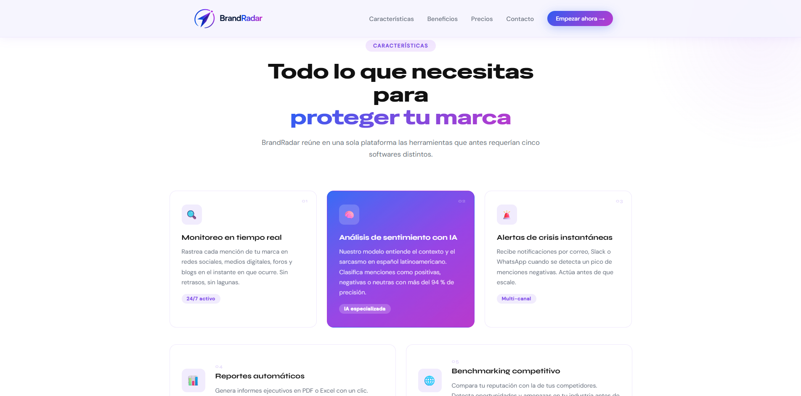

<br>

**US02 Evidence**
<br>

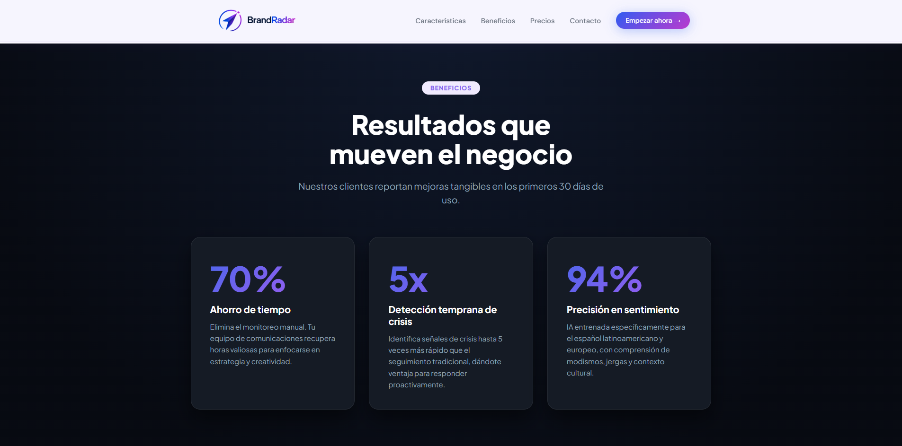

<br>

**US02 Evidence**
<br>


<br>

**US03 Evidence**
<br>


<br>

**US04 Evidence**
<br>


<br>

**US05 Evidence**
<br>


<br>

Asimismo, se elaboró un video demostrativo que muestra la navegación de la Landing Page y explica cada una de las secciones implementadas:

[Ver video de ejecución Sprint 1](https://upcedupe-my.sharepoint.com/:v:/g/personal/u202411354_upc_edu_pe/IQBglzF7t1MLS5D9Y52AB6oMAdQK0GqOTwkBViRGT8Agma0?nav=eyJyZWZlcnJhbEluZm8iOnsicmVmZXJyYWxBcHAiOiJPbmVEcml2ZUZvckJ1c2luZXNzIiwicmVmZXJyYWxBcHBQbGF0Zm9ybSI6IldlYiIsInJlZmVycmFsTW9kZSI6InZpZXciLCJyZWZlcnJhbFZpZXciOiJNeUZpbGVzTGlua0NvcHkifX0&e=md7RBa)

<br>

---

#### 5.2.1.6. Services Documentation Evidence for Sprint Review

Durante el Sprint 1, el alcance del proyecto estuvo centrado estrictamente en la implementación del Frontend (Landing Page). Por lo tanto, no se desarrollaron servicios de backend asociados a la lógica de negocio ni se expusieron endpoints funcionales en esta etapa.

Sin embargo, el equipo ha definido preliminarmente la estructura de los servicios necesarios para la captación de leads que se integrarán en futuros ciclos, dejando preparada la base de la documentación técnica (OpenAPI/Swagger) para asegurar la trazabilidad del desarrollo.

<br>

---

#### 5.2.1.7. Software Deployment Evidence for Sprint Review

Durante el Sprint 1 se realizó el despliegue de la Landing Page del proyecto BrandRadar utilizando la plataforma Netlify, integrada con el repositorio en GitHub.

El despliegue fue configurado mediante integración continua (CI/CD), permitiendo que la aplicación se publique automáticamente cada vez que se realizan cambios en la rama principal (main) del repositorio.

<br>

 **Deployment Process**
  1. Ingresar a la plataforma Netlify utilizando la opción “Log in with GitHub”.
  2. Autorizar el acceso de Netlify a los repositorios del equipo.
  3. Seleccionar la opción “Add new site” → “Import an existing project”.
  4. Elegir GitHub como proveedor del repositorio.
  5. Seleccionar la organización Los 5 Suyos y el repositorio de la Landing Page.
  6. Configurar los parámetros de despliegue: Branch: main, Publish directory: public (o carpeta de salida del proyecto)
  7. Ejecutar el proceso de despliegue mediante la opción “Deploy site”.
  8. Esperar la confirmación de despliegue exitoso.
  9. Acceder a la URL pública generada por Netlify.


**URL pública:** [https://brandradar-landing-page.netlify.app/](https://brandradar-landing-page.netlify.app/)

<br>

**Evidencias**

A continuación, se presentan capturas del proceso de despliegue y del resultado final:

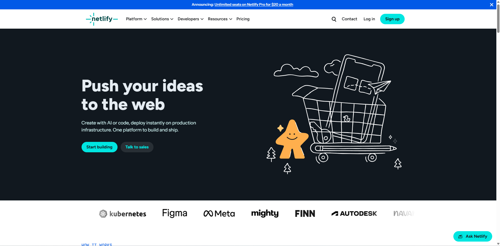
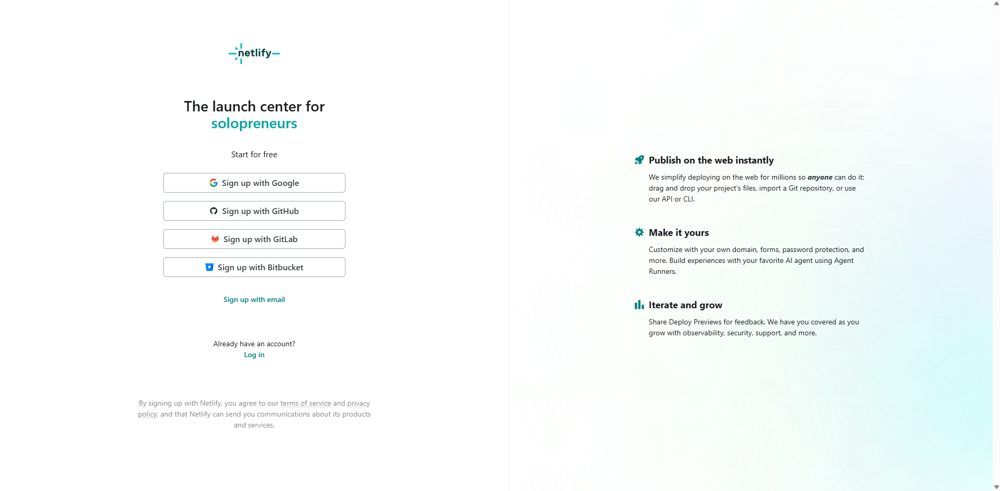
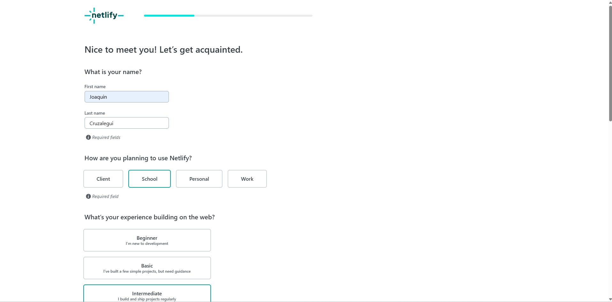
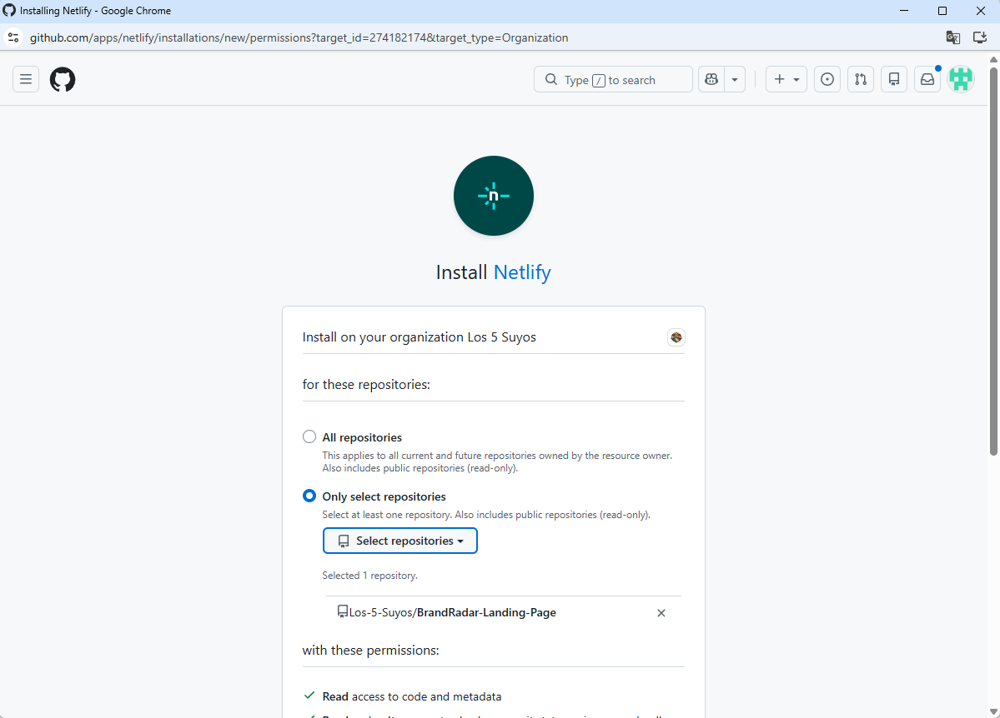
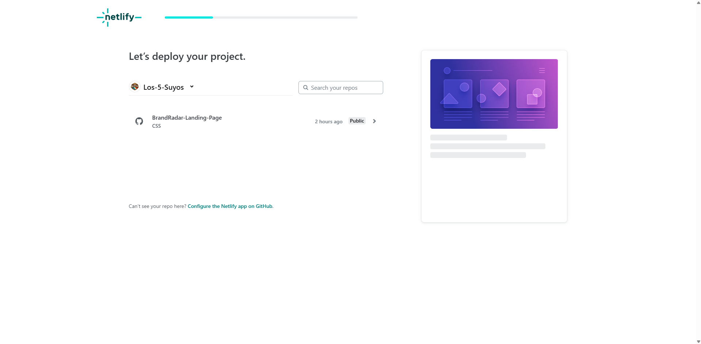
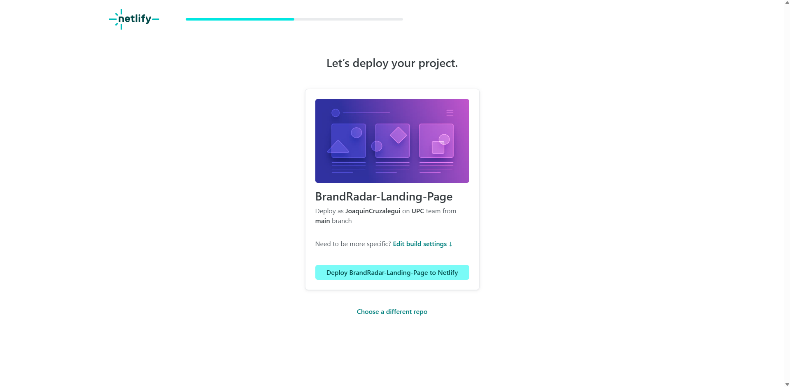
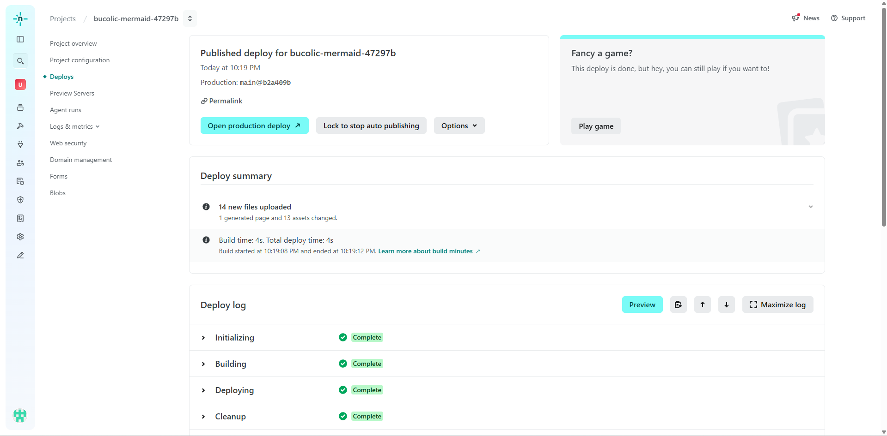
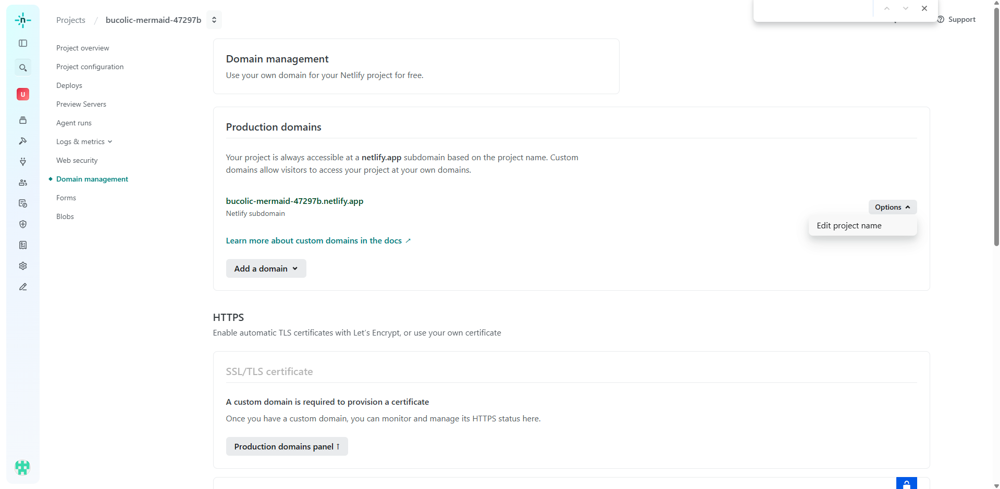
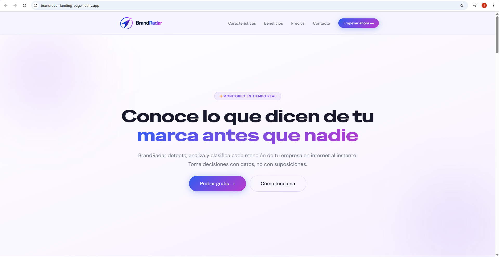

<br>

---

#### 5.2.1.8. Team Collaboration Insights during Sprint

El equipo utilizó la estrategia GitFlow para gestionar el desarrollo paralelo. Cada integrante trabajó en su propia rama de característica (feature/brianna, feature/victor, etc.), las cuales fueron fusionadas en la rama develop tras pasar una revisión de código básica.

<br>

## Métricas de colaboración:

- Commits: Se registró una actividad constante de los 5 miembros, con picos de integración los días previos a la entrega.

- Roles: La matriz de trabajo permitió que cada componente tuviera un líder responsable, evitando la duplicidad de trabajo.

- Gráfico de red de ramas en el repositorio de GitHub evidenciando la integración de las 5 ramas de características en la rama develop.

<br>

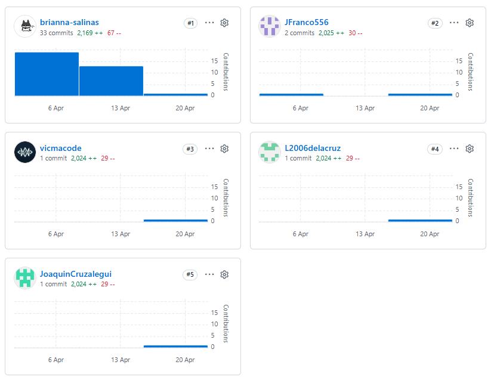


<br>

---

### 5.2.2. Sprint 2

#### 5.2.2.1. Sprint Planning 2


A continuación se presenta el Sprint Planning para esta segunda entrega, donde definimos el trabajo a realizar, las metas y el enfoque del equipo para el desarrollo del frontend de BrandRadar.

<br>

| Campo                               | Detalle |
| :---------------------------------- | :---------------------------------------------------------------------------------------------------------------------------------------------------------------------------------------------------------------------------------------------------------------------------------------------------------------------------------------------------------------------------------------------------------------------------------------------------------------------------------------------------------------- |
| **Sprint #**                        | Sprint 2 |
| **Sprint Planning Background**      | En este sprint se abordará el desarrollo del Frontend Web Application de BrandRadar utilizando Angular, enfocándose en el módulo de Gestión de Cuentas (autenticación) y la construcción de la estructura base de la aplicación. Se integrará una Fake API mediante JSON Server para simular la comunicación con el backend. El objetivo es construir una primera versión funcional que permita validar el flujo de autenticación y la navegación inicial dentro de la aplicación.   |
| **Date**                            | 2026/05/06 |
| **Time**                            | 9:00 PM |
| **Location**                        | Reunión virtual mediante la plataforma Discord  |
| **Prepared By**                     | Salinas Guzmán, Brianna Cristina |
| **Attendees (to planning meeting)** | Salinas, Brianna / Cruzalegui, Joaquin / Jáuregui, Jean / García, Victor / Acuña, Luis  |
| **Sprint 1 Review Summary**         | Durante el Sprint 1 se desarrolló y desplegó la Landing Page de BrandRadar, permitiendo a los usuarios conocer la propuesta de valor, funcionalidades, planes y contacto del producto. Se logró una integración completa de las secciones y su despliegue en Netlify. Como feedback, se identificó la necesidad de mejorar la redirección de los call-to-action hacia la Web Application y establecer el idioma inglés como predeterminado.  |
| **Sprint 1 Retrospective Summary**  | El equipo mantuvo una comunicación constante a través de Discord; sin embargo, se identificaron dificultades en la gestión de ramas debido a un uso inconsistente de GitFlow. Para este sprint se adoptará un flujo más estructurado basado en feature branches por User Story, así como revisiones mediante Pull Requests antes de integrar cambios en la rama principal.   |
| **Sprint 2 Goal**                   | Nuestro enfoque está en desarrollar la primera versión funcional del frontend de BrandRadar, implementando el flujo de autenticación (registro, login, recuperación de contraseña y logout) e integrándolo con una Fake API. Creemos que esto permitirá validar la arquitectura base del sistema y los flujos principales de usuario. Esto se confirmará cuando los usuarios puedan registrarse, iniciar sesión, recuperar su contraseña y acceder a una vista inicial protegida dentro de la aplicación Angular. |
| **Sprint 2 Velocity**               | 157 |
| **Sum of Story Points**             | 157 |


<br>

---

#### 5.2.2.2. Aspect Leaders and Collaborators

<br>

| Team Member | GitHub Username | `[US06 · Registro + SharedModule]` | `[US07 · Verificación de correo]` | `[US08 · Login + JWT]` | `[US09 · Recuperación de contraseña]` | `[US11 · BrandWorkspace]` | `[US17 · MentionStream]` | `[US23 · ReputationIncident]` | `[US27 · Dashboard reputacional]` | `[US33 · Autorización contextual]` | `[TS01–TS16 · Infraestructura y QA]` |
|:-----------------------------------:|:---------------:|:-------------:|:-------------:|:-------------:|:-------------:|:-------------:|:-------------:|:-------------:|:-------------:|:-------------:|:-------------:|
| Salinas, Brianna | brianna-salinas | L | L | L | C | C | C | C | C | C | C |
| García, Victor | vicmacode | C | C | C | C | C | C | C | C | L | C |
| Jáuregui, Jean | JFranco556 | C | C | C | L | L | C | C | L | C | C |
| Acuña, Luis | L2006delacruz | C | C | C | C | C | C | C | C | C | L |
| Cruzalegui, Joaquin | JoaquinCruzalegui | C | C | C | C | C | L | L | C | C | C |

<br>

> **L** = Leader &nbsp;|&nbsp; **C** = Collaborator

<br>

---

#### 5.2.2.3. Sprint Backlog 2

**Objetivo del Sprint:** Implementar las pantallas de autenticación (registro, login, verificación, recuperación) y la configuración inicial de marca — todas conectadas a una Fake API con json-server — habilitando el flujo completo de onboarding desde registro hasta primer workspace activo sin backend real.
 
**Sprint Goal:** *Un usuario puede registrarse, verificar su cuenta, iniciar sesión y configurar su primera marca con palabras clave y fuentes — usando datos simulados — completando el flujo de onboarding de principio a fin.*

<br>

 **Story Points comprometidos: 157 SP | Duración: 2 semanas | Stack: Angular 17 / TypeScript / json-server**
 
**Tech Lead: Brianna Cristina Salinas Guzmán**

<br>

| Sprint # | | | | | | | | |
| :--- | :--- | :--- | :--- | :--- | :--- | :--- | :--- | :--- |
| **Sprint 2** | **User Story** | | **Work-Item / Task** | | | | **Asignado a** | **Status** |
| **ID** | **Título** | **SP** | **ID** | **Título** | **Descripción** | **Estimación** | **Asignado a** | |
| **US06** | Registrar cuenta verificada para proteger información reputacional sensible | 5 | T-01 | Pantalla de Registro con validación de dominio y emisión de `AccountRegistered` | Formulario de registro (nombre, email, contraseña, plan) conectado a TS01. Valida invariantes del dominio en frontend: email único, contraseña segura, plan válido. Emite Domain Event `AccountRegistered` al confirmar y redirige a verificación. | 3h | Brianna | To Do |
| **US06** | Registrar cuenta verificada para proteger información reputacional sensible | | T-02 | `SharedModule` – componentes atómicos reutilizables para todo el sprint | Módulo compartido con `InputField`, `PrimaryButton`, `AlertBanner`, `LoadingSpinner`, `StatusBadge`. Base de diseño consistente para todas las pantallas del sprint. Incluye manejo de estados de error alineado con respuestas de dominio. | 2h | Brianna | To Do |
| **US07** | Verificar correo para que la cuenta transite a `ACTIVA` y habilite el workspace | 3 | T-03 | Pantalla de Verificación de Email: transiciona `UserAccount` a `ACTIVA` emitiendo `AccountActivated` | Pantalla accedida por token en URL. Llama a TS03, muestra confirmación de activación y redirige al workspace. Maneja casos de token expirado (reenvío) y ya verificado. El estado `ACTIVA` habilita acceso al `BrandWorkspace`. | 2h | Brianna | To Do |
| **US08** | Iniciar sesión para acceder exclusivamente a las marcas asignadas | 3 | T-04 | Pantalla de Login con bloqueo por intentos fallidos y JWT asociado a `BrandWorkspace` asignados | Formulario de login conectado a TS02. Diferencia errores por credenciales inválidas vs cuenta bloqueada vs no verificada. Almacena JWT en `AuthService` (en memoria). Solo habilita acceso a los `BrandWorkspace` asignados al usuario autenticado. | 3h | Brianna | To Do |
| **US09** | Recuperar acceso mediante flujo seguro sin comprometer la confidencialidad reputacional | 3 | T-05 | Pantalla de Recuperar Contraseña: solicita email y emite `PasswordRecoveryRequested` | Captura email y llama al flujo de recuperación (TS04). Emite `PasswordRecoveryRequested`. Respuesta genérica que no revela si el email existe en el sistema, protegiendo enumeración de cuentas. | 2h | Jean Franco | To Do |
| **US09** | Recuperar acceso mediante flujo seguro sin comprometer la confidencialidad reputacional | | T-06 | Pantalla de Nueva Contraseña: completa `PasswordReset` e invalida sesiones activas | Pantalla accedida por token en URL. Valida requisitos del dominio para contraseña. Llama a TS04 completando `PasswordReset` e invalidando todas las sesiones activas del usuario para evitar acceso no autorizado posterior. | 2h | Jean Franco | To Do |
| **US11** | Configurar `BrandWorkspace` con palabras clave y fuentes para activar motor de detección | 5 | T-07 | Pantalla de Selección de `BrandWorkspace`: aísla reputación por cliente y activa contexto operacional | Lista los `BrandWorkspace` asignados al usuario autenticado. Permite seleccionar el workspace activo, aislando métricas y menciones por cliente. Conecta con TS06 y persiste estado en `WorkspaceStateService`. Previene análisis cruzados incorrectos entre clientes. | 3h | Jean Franco | To Do |
| **US27** | Detectar tendencias negativas del `SentimentScore` para ejecutar acciones correctivas rápidamente | 8 | T-08 | Pantalla de Dashboard reputacional: expone indicadores de decisión del `BrandWorkspace` activo | Consume endpoint de métricas consolidadas (TS15). Muestra `SentimentScore` actual, tendencia, menciones recientes del `MentionStream`, `ReputationIncident` activos por `SeverityLevel` y alertas pendientes. Orientado a decisión operacional, no solo visualización de métricas. | 4h | Jean Franco | To Do |
| **US33** | Operar exclusivamente dentro del perímetro de `BrandWorkspace` asignados para garantizar confidencialidad | 8 | T-09 | Pantalla 403 – Acceso no autorizado al `BrandWorkspace`: registra intento como evento de auditoría | Se activa cuando el `WorkspaceGuard` (T-14) rechaza acceso a un `BrandWorkspace` no asignado al usuario. Muestra mensaje claro, registra el intento no autorizado como evento de auditoría (TS16) y orienta al usuario hacia sus workspaces legítimos. | 2h | Joaquin | To Do |
| **US11** | Configurar `BrandWorkspace` con palabras clave y fuentes para activar motor de detección | 5 | T-10 | Pantalla de Gestión de Marcas: crear, editar y desactivar `BrandWorkspace` con trazabilidad | CRUD de marcas conectado a TS06 y TS07. Formulario de configuración: nombre, `KeywordRule`, `MonitoringChannel`. La desactivación conserva historial emitiendo `WorkspaceDeactivated`. Cada cambio de configuración emite `MonitoringRuleUpdated` para trazabilidad. | 5h | Joaquin | To Do |
| **US23** | Detectar picos anómalos en `MentionStream` para crear `ReputationIncident` antes de que una crisis escale | 8 | T-11 | Pantalla de Incidentes Reputacionales: prioriza `ReputationIncident` por `SeverityLevel` y registra respuesta | Lista de `ReputationIncident` filtrable por `SeverityLevel`, `IncidentStatus` y fecha. Permite registrar respuesta emitiendo `AlertAcknowledged` con responsable y timestamp. Conecta con TS11 y TS12. Diseñada para gestión simultánea de múltiples clientes. | 5h | Joaquin | To Do |
| **US17** | Identificar menciones negativas recurrentes en `MentionStream` para priorizar respuesta operacional | 5 | T-12 | Pantalla de Menciones: filtra `MentionStream` por `SentimentType`, `MentionSource` y fecha para identificar riesgo reputacional | Vista paginada del `MentionStream` del workspace activo. Filtros por `SentimentType`, `MentionCategory`, `MentionSource` y rango de fechas. Conecta con TS09. Identifica fuentes recurrentes de riesgo para priorizar acciones correctivas. | 4h | Joaquin | To Do |
| **TS02** | Endpoint de login: valida credenciales, emite JWT y bloquea por intentos fallidos | 5 | T-13 | HTTP Interceptor: inyecta JWT automáticamente en cada request autenticado | Interceptor que adjunta el Bearer token JWT en el header `Authorization` de cada llamada. Detecta respuesta 401 (token expirado) y redirige a login limpiando el contexto de sesión. Transparente para todos los componentes del sprint. | 3h | Victor | To Do |
| **TS16** | Middleware de autorización contextual por `BrandWorkspace` con auditoría de accesos no autorizados | 5 | T-14 | `WorkspaceGuard`: protege rutas del workspace activo y registra accesos no autorizados como eventos de auditoría | Guard de ruta Angular que valida antes de activar cada pantalla que el usuario autenticado tiene acceso al `BrandWorkspace` solicitado (llamando a TS16). Acceso no autorizado → redirige a pantalla 403 (T-09) y emite evento de auditoría. | 3h | Victor | To Do |
| **US10** | Cerrar sesión para invalidar contexto de workspace en dispositivos compartidos | 2 | T-15 | Logout con timeout por inactividad e invalidación del contexto de `BrandWorkspace` | Flujo de cierre de sesión que limpia el JWT del `AuthService`, invalida el `WorkspaceStateService` y redirige al login. Incluye timeout automático configurable por inactividad para proteger datos reputacionales en dispositivos compartidos. | 2h | Victor | To Do |
| **TS01–TS16** | Infraestructura de desarrollo, fake API y QA del sprint | — | T-16 | Fake API con `json-server`: simula endpoints TS01–TS16 con datos semilla realistas de dominio | Levantar `json-server` con rutas que simulan los endpoints del sprint: registro, login, verificación, recuperación de contraseña, workspaces, reglas de monitoreo, menciones, incidentes y métricas de dashboard. Datos semilla reflejan entidades DDD: `BrandWorkspace`, `ReputationIncident`, `MentionStream`, `SentimentScore`. | 4h | Luis | To Do |
| — |  — |  — | T-17 | `WorkspaceStateService`: gestiona el `BrandWorkspace` activo en sesión con observables reactivos | Servicio centralizado que almacena el `BrandWorkspace` activo en memoria de sesión. Expone observables para que componentes reaccionen a cambio de workspace. Se limpia completamente en logout para evitar filtración de contexto entre sesiones. | 3h | Luis | To Do |
| — |  — |  — | T-18 | QA: flujo completo de autenticación, autorización contextual y acceso reputacional | Pruebas de integración cubriendo el flujo completo: registro → `AccountRegistered` → verificación → `AccountActivated` → login → selección de `BrandWorkspace` → dashboard → acceso a incidentes → logout. Valida bloqueo 403, `WorkspaceGuard`, timeout y aislamiento de contexto entre clientes. | 4h | Luis | To Do |
 
<br>

*Herramienta de gestión: Jira | Repositorio: GitFlow (main / develop / feature/\*)*

<br>

---

#### 5.2.2.4. Development Evidence for Sprint Review

<br>

Durante el Sprint 2, el equipo se enfocó en la construcción de la arquitectura frontend de BrandRadar utilizando Angular y TypeScript bajo una estructura modular orientada a Domain-Driven Design (DDD). El objetivo principal del sprint fue implementar los flujos de autenticación, autorización contextual y gestión de workspaces reputacionales, permitiendo que cada usuario opere únicamente dentro de los espacios asignados.

Se desarrollaron pantallas clave como Registro, Login, Verificación de Correo, Recuperación de Contraseña, Gestión de BrandWorkspace, Dashboard Reputacional e Incidentes, integradas mediante servicios, guards e interceptors reutilizables. Asimismo, se incorporó una Fake API con `json-server` para simular los endpoints del dominio y permitir pruebas funcionales sin depender todavía de un backend definitivo.

El equipo adoptó Angular standalone architecture, Reactive Forms y un enfoque basado en componentes reutilizables mediante un `SharedModule`, permitiendo mantener consistencia visual y acelerar el desarrollo colaborativo. Además, se implementó control de acceso contextual usando `WorkspaceGuard` y JWT para proteger la información reputacional de cada cliente.

El desarrollo se realizó en el repositorio público de frontend utilizando GitFlow y ramas `feature/`, permitiendo que cada integrante trabajara de manera independiente antes de integrar sus avances en la rama `develop` para pruebas de integración y revisión del sprint.

<br>

| Repository | Branch | Commit ID | Commit Message | Commit Message Body | Committed on (Date) |
|:---|:---|:---|:---|:---|:---|
| Los-5-Suyos/BrandRadar-Frontend-Web-App | main | pending | `initial frontend setup` | Configuración inicial del proyecto Angular, instalación de Angular Material y estructura DDD base | 2026-05-02 |
| Los-5-Suyos/BrandRadar-Frontend-Web-App | develop | pending | `feat: shared architecture setup` | Creación de módulos compartidos, routing principal y estructura base de servicios y guards | 2026-05-03 |
| Los-5-Suyos/BrandRadar-Frontend-Web-App | feature/sprint2-brianna | pending | `feat: authentication flows implementation` | Desarrollo de pantallas de registro, login, verificación de correo y componentes reutilizables del sprint | 2026-05-06 |
| Los-5-Suyos/BrandRadar-Frontend-Web-App | feature/sprint2-victor | pending | `feat: guards and interceptor setup` | Implementación de JWT Interceptor, WorkspaceGuard y flujo de logout seguro | 2026-05-07 |
| Los-5-Suyos/BrandRadar-Frontend-Web-App | feature/sprint2-jean | pending | `feat: workspace and recovery flows` | Desarrollo de recuperación de contraseña, selección de BrandWorkspace y dashboard reputacional | 2026-05-08 |
| Los-5-Suyos/BrandRadar-Frontend-Web-App | feature/sprint2-joaquin | pending | `feat: incidents and mentions management` | Implementación de gestión de incidentes reputacionales, menciones y pantalla 403 | 2026-05-09 |
| Los-5-Suyos/BrandRadar-Frontend-Web-App | feature/sprint2-luis | pending | `feat: fake api and workspace state service` | Configuración de json-server, datos semilla y WorkspaceStateService reactivo | 2026-05-09 |
| Los-5-Suyos/BrandRadar-Frontend-Web-App | develop | pending | `merge: sprint 2 integration` | Integración completa de funcionalidades del Sprint 2 y validación de flujos de autenticación contextual | 2026-05-10 |

<br>

---

#### 5.2.2.5. Execution Evidence for Sprint Review

<br>

Durante el Sprint 2 se implementó la primera versión funcional del sistema web de BrandRadar, enfocada en los flujos de autenticación, autorización contextual y gestión de workspaces reputacionales. El equipo desarrolló una arquitectura frontend modular utilizando Angular y TypeScript, incorporando guards, interceptors y servicios reactivos para garantizar el aislamiento seguro de información entre clientes.

El sprint permitió consolidar las bases funcionales del producto mediante la integración de formularios reactivos, validaciones de dominio, manejo de JWT y navegación protegida por contexto de `BrandWorkspace`. Asimismo, se incorporó una Fake API usando `json-server`, permitiendo validar los flujos del sistema sin depender aún de un backend productivo.

El desarrollo se validó mediante:

- **Autenticación segura:** Registro de usuarios, login con JWT, recuperación de contraseña y verificación de correo electrónico.

- **Autorización contextual:** Implementación de `WorkspaceGuard` y control de acceso exclusivo a los `BrandWorkspace` asignados.

- **Arquitectura reutilizable:** Creación de componentes compartidos (`SharedModule`) y servicios reactivos para mantener consistencia y escalabilidad.

- **Gestión reputacional:** Visualización de dashboard reputacional, incidentes, menciones y métricas asociadas al workspace activo.

- **Infraestructura de pruebas:** Simulación de endpoints mediante `json-server` y validación integral de flujos funcionales del sprint.

<br>

A continuación se muestran las capturas de las vistas desarrolladas

<br>

**US06 Evidence – Registro de Cuenta**
<br>

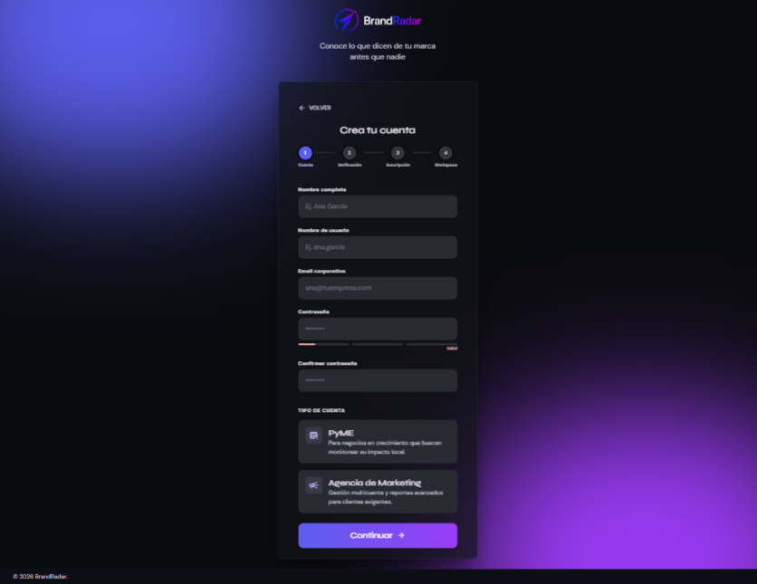

<br>

**US07 Evidence – Verificación de Correo**
<br>

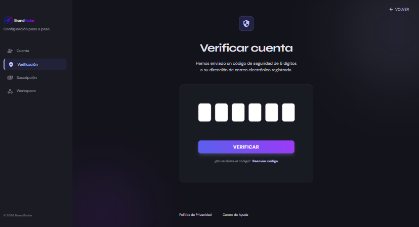

<br>

**US08 Evidence – Inicio de Sesión**
<br>

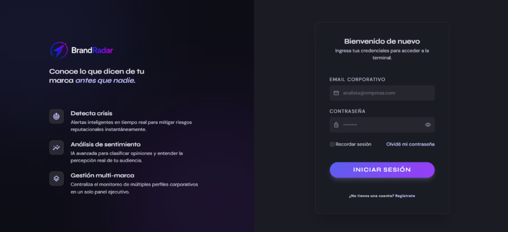

<br>

**US09 Evidence – Recuperación de Contraseña**
<br>

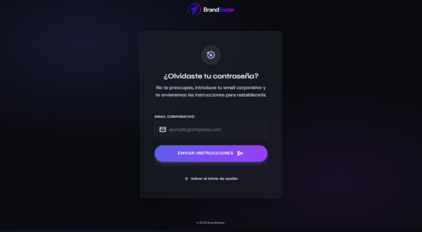

<br>

**US11 Evidence – Selección y Gestión de BrandWorkspace**
<br>

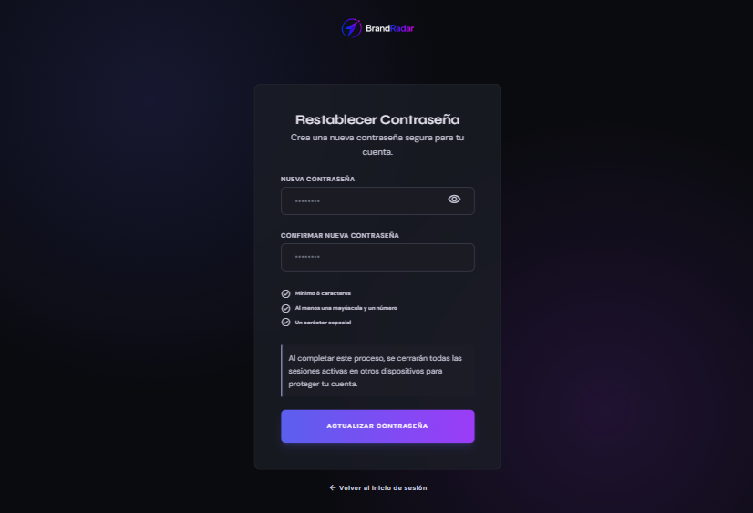

<br>

**US17 Evidence – Gestión de MentionStream**
<br>

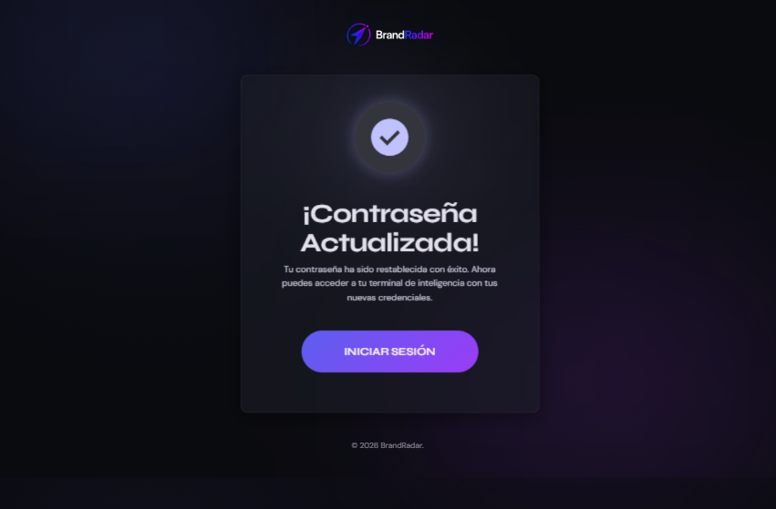

<br>

**US23 Evidence – Gestión de ReputationIncident**
<br>

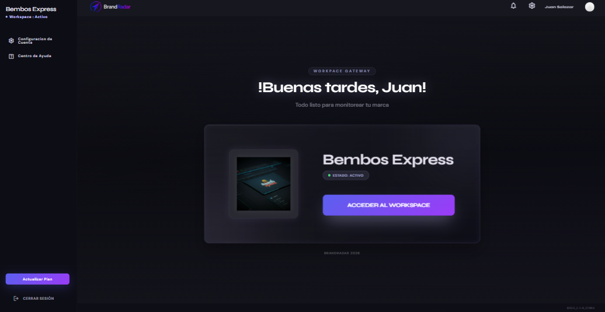

<br>

**US27 Evidence – Dashboard Reputacional**
<br>

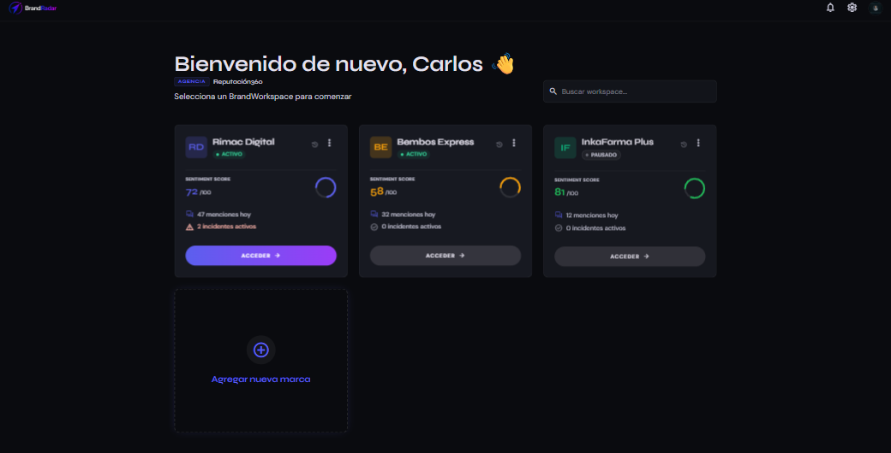

<br>

**US33 Evidence – Pantalla 403 y WorkspaceGuard**
<br>

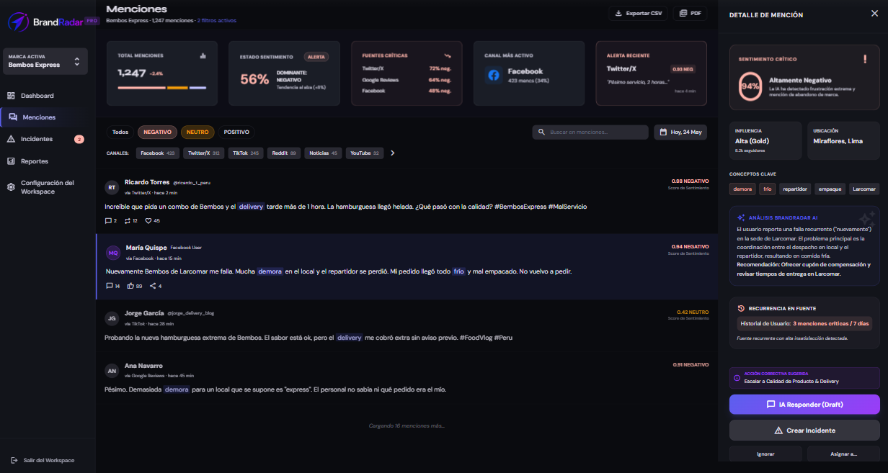

<br>

Asimismo, se elaboró un video demostrativo que muestra la ejecución de los flujos implementados durante el Sprint 2, incluyendo autenticación, autorización contextual, selección de workspaces y navegación del dashboard reputacional:

[Ver video de ejecución Sprint 2](https://example.com/sprint2-demo-video)

<br>

---

#### 5.2.2.6. Services Documentation Evidence for Sprint Review

<br>

Durante el Sprint 2, el equipo implementó la primera aproximación funcional de los servicios requeridos por BrandRadar mediante el uso de una Fake API construida con `json-server`. Esta infraestructura permitió simular el comportamiento de los endpoints definidos en el modelo de dominio, facilitando el desarrollo paralelo entre frontend y backend sin depender todavía de servicios productivos reales.

Los servicios simulados cubrieron los principales flujos del sprint, incluyendo autenticación, verificación de cuentas, recuperación de contraseña, gestión de `BrandWorkspace`, monitoreo reputacional e incidentes. Además, se definieron contratos preliminares de integración alineados con los bounded contexts y Domain Events del sistema.

Entre los endpoints simulados implementados se encuentran:

- `/auth/register`
- `/auth/login`
- `/auth/verify-email`
- `/auth/recover-password`
- `/workspaces`
- `/mentions`
- `/incidents`
- `/dashboard/metrics`

Asimismo, el equipo dejó preparada la base documental para futuras integraciones RESTful mediante OpenAPI/Swagger, permitiendo asegurar trazabilidad técnica y escalabilidad en los siguientes sprints.

<br>

**Evidencias**

A continuación, se presentan capturas de la Fake API, rutas simuladas y pruebas funcionales realizadas durante el Sprint 2:


<br>

---

#### 5.2.2.7. Software Deployment Evidence for Sprint Review

<br>

Durante el Sprint 2 se realizó el despliegue de la aplicación frontend de BrandRadar utilizando Vercel, integrado directamente con el repositorio del proyecto en GitHub. El despliegue permitió validar en un entorno cloud los flujos de autenticación, navegación protegida y gestión contextual de workspaces desarrollados durante el sprint.

El proceso de despliegue fue automatizado mediante integración continua (CI/CD), asegurando que cada actualización en la rama principal generara automáticamente una nueva versión de la aplicación.

<br>

**Deployment Process**

1. Ingresar a la plataforma Vercel utilizando la opción “Continue with GitHub”.
2. Autorizar el acceso de Vercel a los repositorios del equipo.
3. Seleccionar la opción “Add New Project”.
4. Importar el repositorio `BrandRadar-Frontend-Web-App`.
5. Configurar Angular como framework del proyecto.
6. Configurar la rama principal (`main`) como rama de despliegue.
7. Definir los parámetros de build (`npm install` y `ng build`).
8. Ejecutar el despliegue mediante la opción “Deploy”.
9. Esperar la generación automática del dominio público.
10. Validar el correcto funcionamiento de la aplicación desplegada.

<br>

**URL pública:** [https://brandradar-frontend.vercel.app/](https://brandradar-frontend.vercel.app/)

<br>

**Evidencias**

A continuación, se presentan capturas del proceso de despliegue y del resultado final de la aplicación:


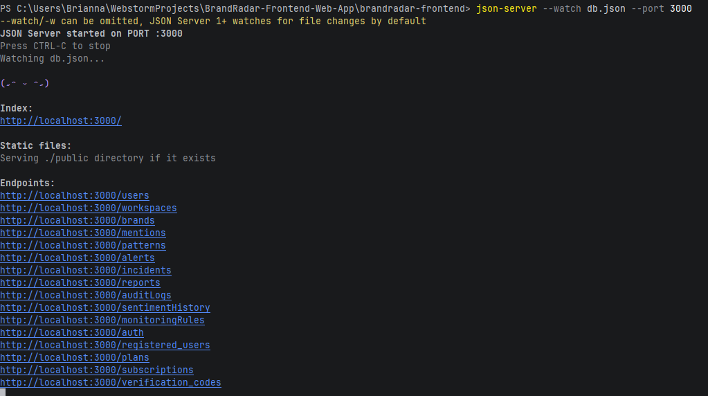

<br>

---

#### 5.2.2.8. Team Collaboration Insights during Sprint

<br>

Durante el Sprint 2, el equipo continuó utilizando GitFlow como estrategia principal de colaboración y control de versiones. Cada integrante desarrolló funcionalidades específicas en ramas `feature/`, permitiendo trabajar de manera paralela sobre autenticación, guards, dashboard reputacional, gestión de incidentes y servicios compartidos sin afectar la estabilidad de la rama principal.

La colaboración se fortaleció mediante integraciones frecuentes hacia `develop`, validando compatibilidad entre componentes Angular, servicios y rutas protegidas antes de consolidar el sprint completo.

<br>

## Métricas de colaboración:

- **Commits:** Se registró actividad continua de los cinco integrantes durante todo el sprint, especialmente durante la integración de autenticación y dashboard.

- **Trabajo modular:** La arquitectura basada en componentes reutilizables y servicios permitió dividir responsabilidades sin generar conflictos de integración.

- **Integración continua:** Las ramas feature fueron fusionadas progresivamente en `develop`, permitiendo detectar errores tempranamente y validar el flujo completo del sistema.

- **Colaboración técnica:** El equipo coordinó el uso de guards, interceptors y servicios compartidos para mantener consistencia arquitectónica en toda la aplicación Angular.

<br>


<br>

## Conclusiones


1. 

2. 

3. 

4. 

5. 

 

<br>

## Recomendaciones

1. 

2. 

3. 

4. 

5. 


<br>

## Video About-The-Team

Este apartado será desarrollado en la **entrega final del proyecto**, donde se incluirá el video de presentación del equipo.

En la versión final del informe se incorporarán los siguientes elementos:

- Captura representativa del video
- URL del video en Microsoft Stream  
- URL del video en YouTube  
- Estructura o timing del contenido presentado (introducción, desarrollo y cierre)

El video tiene como objetivo presentar a los integrantes del equipo, sus roles, principales contribuciones y la experiencia obtenida durante el desarrollo del proyecto BrandRadar.

<br>

---


##  Bibliografía

>Backlinko. (2024). *Online review statistics*. https://backlinko.com/online-review-stats

>BrightLocal. (2026). *Local consumer review survey 2026*. https://www.brightlocal.com/research/local-consumer-review-survey/

>Capital One Shopping Research. (2026). *Online reviews statistics*. https://capitaloneshopping.com/research/online-reviews-statistics/

>HubSpot. (2024). *State of marketing report*. https://www.hubspot.com/marketing-statistics

>Ott, M., Cardie, C., & Hancock, J. T. (2012). *Estimating the prevalence of deception in online review communities*. arXiv. https://arxiv.org/abs/1204.2804

>ReputationUP. (2024). *Qué es la reputación digital y cómo gestionarla*. https://reputationup.com/es/reputacion-digital/

>Ruby, D. (2025, December 30). *30 latest online review statistics 2026 (updated data)*. DemandSage. https://www.demandsage.com/online-review-statistics/

>Statista. (2024). *Online reviews - statistics & facts*. https://www.statista.com/topics/4381/online-reviews/

<br>

---

<br>

## Anexos


### Anexo A: Participant Performance Report

El *Participant Performance Report* se adjunta como documento independiente en formato Word y PDF, donde se detalla el nivel de participación, contribuciones y desempeño de cada integrante del equipo a lo largo del desarrollo del presente proyecto.

En este documento se incluyen los criterios de evaluación, evidencias de trabajo y la distribución de responsabilidades asumidas por cada miembro del equipo.

<br>

### Anexo B: Videos de Exposiciones

| Entrega | Título | Enlace |
|:-------:|:------:|:------:|
| AV1 | `upc-pre-202610-1asi0729-[11863]-[brandradar]-expo-av1` | [URL Microsoft Stream](https://upcedupe-my.sharepoint.com/:f:/g/personal/u202410239_upc_edu_pe/IgBV-ACEG37lQ466daCivegHARBFGxWIBXchDZGj6xfsMAY?e=Y3HNmH) |
| TB1 | `upc-pre-202610-1asi0729-[11863]-[brandradar]-expo-tb1` | [URL Microsoft Stream](https://upcedupe-my.sharepoint.com/) |

<br>

---

<div align="center">

<br>

*BrandRadar · Desarrollo de Aplicaciones Open Source · UPC 2026-10*

</div>
